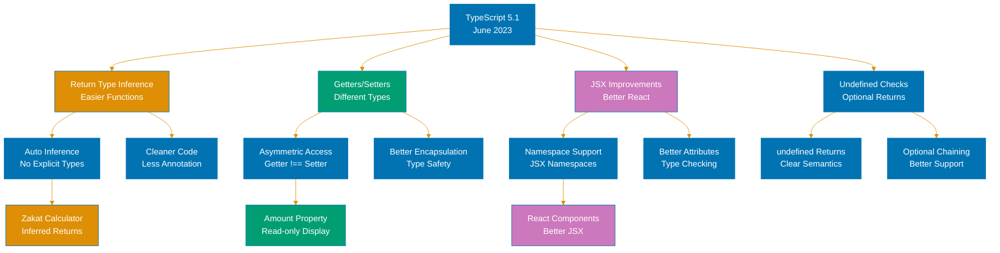
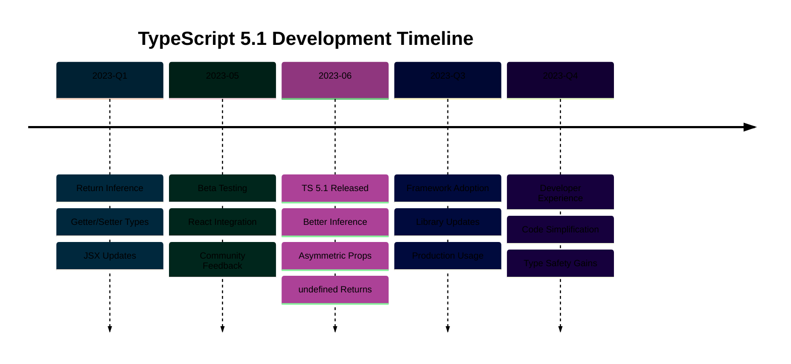

# TypeScript 5.1 Release

## Overview

TypeScript 5.1 introduces new features, type system enhancements, and performance improvements. This release continues TypeScript's evolution toward better type safety and developer productivity.

## Key Features

This release includes improvements to the type system, compiler performance, and editor tooling.

## Breaking Changes

Consult the official TypeScript 5.1 documentation for detailed breaking changes and migration guidance.

## References

- [TypeScript 5.1 Release Notes](https://www.typescriptlang.org/docs/handbook/release-notes/typescript-5.1.html)
- [TypeScript Documentation](https://www.typescriptlang.org/docs/)

---

**Last Updated**: 2026-01-24
**TypeScript Version**: 5.0+ (baseline), 5.7+ (stable maintenance), 5.9.x (latest stable)
**Maintainers**: OSE Platform Documentation Team

