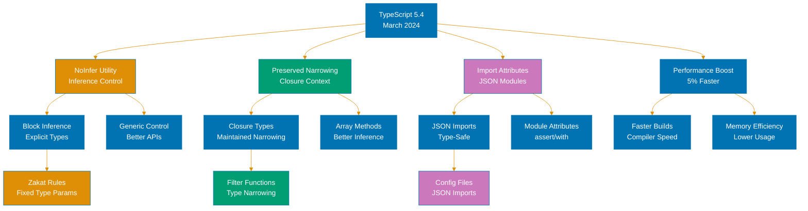
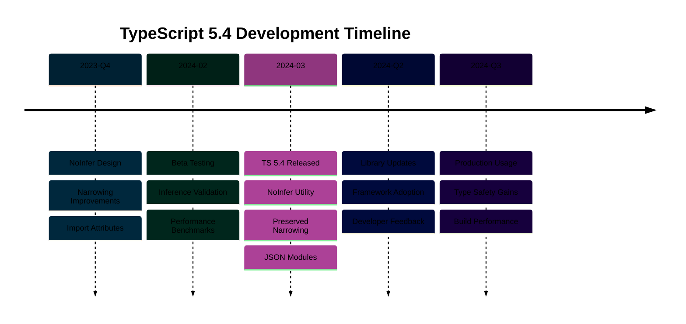

# TypeScript 5.4 Release

**Quick Reference**: [Overview](#-overview) | [NoInfer Utility](#-noinfer-utility-type) | [Closure Narrowing](#-preserved-narrowing-in-closures) | [groupBy Methods](#-objectgroupby-and-mapgroupby) | [Control Flow](#-improved-control-flow-analysis) | [Other Features](#-other-features) | [Breaking Changes](#-breaking-changes) | [Migration Guide](#-migration-guide) | [Related Documentation](#-related-documentation)

## 📋 Overview

TypeScript 5.4, released in March 2024, introduces targeted improvements to type inference and standard library support. This release focuses on solving long-standing inference challenges with the new `NoInfer` utility type, improving type narrowing behavior in closures, and adding native support for ECMAScript's `Object.groupBy` and `Map.groupBy` methods.

### Key Features

1. **NoInfer Utility Type**: Prevent unwanted type inference in generic function parameters
2. **Preserved Narrowing in Closures**: Type narrowing now works correctly inside closure functions
3. **Object.groupBy and Map.groupBy**: Native support for grouping operations
4. **Improved Control Flow Analysis**: Better type narrowing in complex conditional logic
5. **`--noCheck` Option**: Skip type checking in emit-only scenarios

### Why TypeScript 5.4 Matters

- **Better Type Inference Control**: `NoInfer` solves common generic inference problems
- **More Accurate Narrowing**: Closures preserve type guards correctly
- **Modern JavaScript Features**: Native groupBy support matches ES2024
- **Enhanced Developer Experience**: Fewer manual type annotations needed
- **Performance Options**: `--noCheck` speeds up build-only scenarios

**Official Source**: [TypeScript 5.4 Release Notes](https://devblogs.microsoft.com/typescript/announcing-typescript-5-4/)

## 🚫 NoInfer Utility Type

### The Problem: Unwanted Type Inference

Before TypeScript 5.4, generic type parameters could be inferred from multiple sources, sometimes leading to unexpected results:

```typescript
// Before TS 5.4: Type parameter inferred from both arguments
function firstOrDefault<T>(items: T[], defaultValue: T): T {
  return items.length > 0 ? items[0] : defaultValue;
}

const numbers = [1, 2, 3];
const result = firstOrDefault(numbers, "default");
// Type of result: number | string (unwanted union!)
```

The problem: TypeScript infers `T` from **both** `items` and `defaultValue`, creating an unintended union type when we want `defaultValue` to match the array type.

### The Solution: NoInfer Utility Type

`NoInfer<T>` prevents a type parameter from being inferred from a specific position:

```typescript
// TS 5.4: Use NoInfer to block inference from defaultValue
function firstOrDefault<T>(items: T[], defaultValue: NoInfer<T>): T {
  return items.length > 0 ? items[0] : defaultValue;
}

const numbers = [1, 2, 3];
const result = firstOrDefault(numbers, "default");
// Error: Argument of type 'string' is not assignable to parameter of type 'number'

const correct = firstOrDefault(numbers, 0);
// Type of correct: number ✓
```

### Syntax and Semantics

```typescript
// NoInfer<T> wraps a type to prevent inference from that position
function example<T>(
  source: T, // T can be inferred from here
  target: NoInfer<T>, // T CANNOT be inferred from here
): void {
  // Implementation
}
```

**Key behavior**:

- `NoInfer<T>` has the same type as `T` at runtime
- It only affects type inference during compilation
- Prevents bidirectional inference conflicts

### Practical Examples

**Example 1: Array Operations**

```typescript
// Ensure default value matches array element type
function findOrDefault<T>(array: T[], predicate: (item: T) => boolean, defaultValue: NoInfer<T>): T {
  const found = array.find(predicate);
  return found !== undefined ? found : defaultValue;
}

const users = [
  { id: 1, name: "Alice" },
  { id: 2, name: "Bob" },
];

// Correct: defaultValue matches array type
const user = findOrDefault(users, (u) => u.id === 3, { id: 0, name: "Unknown" });

// Error: defaultValue doesn't match
// const wrong = findOrDefault(users, u => u.id === 3, "not-found");
```

**Example 2: Configuration Merging**

```typescript
// Merge configurations with type safety
function mergeConfig<T extends object>(base: T, overrides: Partial<NoInfer<T>>): T {
  return { ...base, ...overrides };
}

interface AppConfig {
  apiUrl: string;
  timeout: number;
  retries: number;
}

const defaultConfig: AppConfig = {
  apiUrl: "https://api.example.com",
  timeout: 5000,
  retries: 3,
};

// Correct: overrides must match AppConfig shape
const config = mergeConfig(defaultConfig, { timeout: 10000 });

// Error: invalid property
// const wrong = mergeConfig(defaultConfig, { invalid: true });
```

**Example 3: Event Emitter**

```typescript
// Type-safe event emitter
type EventMap = {
  click: { x: number; y: number };
  submit: { data: string };
  load: void;
};

class TypedEventEmitter<T extends Record<string, any>> {
  private listeners = new Map<keyof T, Array<(data: any) => void>>();

  on<K extends keyof T>(event: K, listener: (data: NoInfer<T[K]>) => void): void {
    const handlers = this.listeners.get(event) || [];
    handlers.push(listener);
    this.listeners.set(event, handlers);
  }

  emit<K extends keyof T>(event: K, data: T[K]): void {
    const handlers = this.listeners.get(event) || [];
    handlers.forEach((handler) => handler(data));
  }
}

const emitter = new TypedEventEmitter<EventMap>();

// Correct: listener parameter matches event data type
emitter.on("click", (data) => {
  console.log(data.x, data.y); // data is { x: number, y: number }
});

// Correct: emit data matches event type
emitter.emit("click", { x: 10, y: 20 });

// Error: wrong data type
// emitter.emit("click", { invalid: true });
```

**Example 4: Islamic Finance - Zakat Calculation**

```typescript
// Type-safe Zakat calculation with asset-specific defaults
interface ZakatAsset {
  type: string;
  value: number;
  nisab: number;
  rate: number;
}

interface GoldAsset extends ZakatAsset {
  type: "gold";
  weightInGrams: number;
}

interface SilverAsset extends ZakatAsset {
  type: "silver";
  weightInGrams: number;
}

interface CashAsset extends ZakatAsset {
  type: "cash";
  currency: string;
}

function calculateZakatOrDefault<T extends ZakatAsset>(asset: T | null, defaultAsset: NoInfer<T>): number {
  const activeAsset = asset ?? defaultAsset;
  return activeAsset.value >= activeAsset.nisab ? activeAsset.value * activeAsset.rate : 0;
}

const goldAsset: GoldAsset = {
  type: "gold",
  value: 10000,
  nisab: 87.48,
  rate: 0.025,
  weightInGrams: 100,
};

const defaultGold: GoldAsset = {
  type: "gold",
  value: 0,
  nisab: 87.48,
  rate: 0.025,
  weightInGrams: 0,
};

// Correct: default matches gold asset type
const zakat1 = calculateZakatOrDefault(goldAsset, defaultGold);

// Error: cannot use cash default with gold asset
// const defaultCash: CashAsset = { type: "cash", value: 0, nisab: 0, rate: 0.025, currency: "USD" };
// const wrong = calculateZakatOrDefault(goldAsset, defaultCash);
```

**Example 5: Form Validation**

```typescript
// Type-safe form validation with default values
interface FormField<T> {
  value: T;
  validator: (value: T) => boolean;
  errorMessage: string;
}

function validateOrDefault<T>(field: FormField<T>, defaultValue: NoInfer<T>): T {
  return field.validator(field.value) ? field.value : defaultValue;
}

const emailField: FormField<string> = {
  value: "user@example.com",
  validator: (email) => email.includes("@"),
  errorMessage: "Invalid email",
};

// Correct: default is string
const email = validateOrDefault(emailField, "default@example.com");

// Error: default must be string
// const wrong = validateOrDefault(emailField, 0);
```

### When to Use NoInfer

✅ **Use NoInfer when**:

- You want to prevent inference from specific function parameters
- Default values or fallbacks should match a primary source
- Avoiding unwanted union types from multiple inference sources
- Creating type-safe APIs with strict parameter relationships

❌ **Don't use NoInfer when**:

- All parameters should contribute to type inference equally
- You want flexibility in accepting different types
- The inference behavior is already correct

### Benefits of NoInfer

1. **Precise Type Inference**: Control exactly where types are inferred from
2. **Better Error Messages**: Catch type mismatches at the call site
3. **Reduced Manual Annotations**: Less need for explicit type parameters
4. **API Safety**: Prevent callers from accidentally widening types
5. **Self-Documenting**: Makes type relationships explicit in signatures

## 🔒 Preserved Narrowing in Closures

### The Problem: Lost Type Narrowing

Before TypeScript 5.4, type narrowing was not preserved in closures, forcing developers to add redundant checks:

```typescript
// Before TS 5.4: Narrowing lost in closure
function processValue(value: string | number | null) {
  if (value !== null) {
    // value is string | number here

    setTimeout(() => {
      // ERROR: value is string | number | null again!
      // TypeScript forgot the null check
      console.log(value.toString());
    }, 100);
  }
}
```

### The Solution: Preserved Narrowing

TypeScript 5.4 preserves type narrowing in closures when the narrowed variable is not modified:

```typescript
// TS 5.4: Narrowing preserved in closure
function processValue(value: string | number | null) {
  if (value !== null) {
    // value is string | number here

    setTimeout(() => {
      // value is still string | number in closure!
      console.log(value.toString()); // No error
    }, 100);
  }
}
```

### How It Works

**Key rules**:

1. Narrowing is preserved if the variable is **not reassigned** after narrowing
2. Narrowing is preserved across **all closure types** (arrow functions, function expressions, callbacks)
3. Narrowing is **lost** if the variable might be modified before the closure executes

```typescript
// Rule 1: Preserved when not reassigned
function example1(x: string | null) {
  if (x !== null) {
    [1, 2, 3].forEach(() => {
      console.log(x.toUpperCase()); // OK: x is string
    });
  }
}

// Rule 2: Lost when reassigned
function example2(x: string | null) {
  if (x !== null) {
    x = Math.random() > 0.5 ? null : x; // Reassignment

    [1, 2, 3].forEach(() => {
      // console.log(x.toUpperCase()); // Error: x is string | null again
    });
  }
}
```

### Practical Examples

**Example 1: Array Operations**

```typescript
// Filter and map with type narrowing
function processNumbers(values: Array<number | null>): number[] {
  return values
    .filter((value) => value !== null) // Narrow to number[]
    .map((value) => value * 2); // value is number in closure!
}

const numbers = [1, null, 2, null, 3];
const doubled = processNumbers(numbers); // [2, 4, 6]
```

**Example 2: Event Handlers**

```typescript
// Event handlers preserve narrowing
interface User {
  id: number;
  name: string;
}

function setupUserProfile(user: User | null) {
  if (user === null) {
    console.log("No user logged in");
    return;
  }

  // user is User here
  const button = document.getElementById("profile-btn");

  button?.addEventListener("click", () => {
    // user is still User in event handler!
    console.log(`Profile for ${user.name}`);
    fetchUserData(user.id);
  });
}

function fetchUserData(userId: number): void {
  console.log(`Fetching data for user ${userId}`);
}
```

**Example 3: Async Operations**

```typescript
// Narrowing preserved in async callbacks
async function fetchAndProcess(id: string | undefined) {
  if (!id) {
    return;
  }

  // id is string here
  const data = await fetch(`/api/data/${id}`)
    .then((res) => res.json())
    .then((json) => {
      // id is still string in promise chain!
      console.log(`Processing data for ${id}`);
      return json;
    });

  return data;
}
```

**Example 4: Islamic Finance - Transaction Processing**

```typescript
// Type-safe transaction validation
interface Transaction {
  id: string;
  amount: number;
  type: "debit" | "credit";
}

interface ZakatableTransaction extends Transaction {
  zakatRate: number;
  isZakatEligible: true;
}

function isZakatEligible(transaction: Transaction): transaction is ZakatableTransaction {
  return transaction.amount >= 1000; // Simplified nisab check
}

function processTransactions(transactions: Transaction[]) {
  const zakatEligible = transactions.filter(isZakatEligible);

  // Type narrowed to ZakatableTransaction[]
  zakatEligible.forEach((transaction) => {
    // transaction is ZakatableTransaction in closure!
    const zakatAmount = transaction.amount * transaction.zakatRate;
    console.log(`Zakat for transaction ${transaction.id}: ${zakatAmount}`);
  });
}

const transactions: Transaction[] = [
  { id: "T1", amount: 5000, type: "credit" } as ZakatableTransaction,
  { id: "T2", amount: 500, type: "credit" },
  { id: "T3", amount: 10000, type: "debit" } as ZakatableTransaction,
];

processTransactions(transactions);
```

**Example 5: Debounced Search**

```typescript
// Search with debouncing preserves narrowing
function setupSearch(input: HTMLInputElement | null) {
  if (!input) {
    console.error("Input element not found");
    return;
  }

  // input is HTMLInputElement here
  let timeoutId: number | undefined;

  input.addEventListener("input", () => {
    clearTimeout(timeoutId);

    timeoutId = setTimeout(() => {
      // input is still HTMLInputElement in timeout!
      const query = input.value.trim();
      if (query.length >= 3) {
        performSearch(query);
      }
    }, 300);
  });
}

function performSearch(query: string): void {
  console.log(`Searching for: ${query}`);
}
```

### Migration Impact

**Before TypeScript 5.4** - Required workarounds:

```typescript
// Workaround 1: Assign to new variable
function old1(value: string | null) {
  if (value !== null) {
    const nonNullValue = value; // Capture in new variable

    setTimeout(() => {
      console.log(nonNullValue.toUpperCase()); // OK
    }, 100);
  }
}

// Workaround 2: Re-check in closure
function old2(value: string | null) {
  if (value !== null) {
    setTimeout(() => {
      if (value !== null) {
        // Redundant check
        console.log(value.toUpperCase()); // OK
      }
    }, 100);
  }
}
```

**TypeScript 5.4** - No workarounds needed:

```typescript
// Clean, direct code
function new1(value: string | null) {
  if (value !== null) {
    setTimeout(() => {
      console.log(value.toUpperCase()); // Just works!
    }, 100);
  }
}
```

## 📊 Object.groupBy and Map.groupBy

### What Are groupBy Methods?

ECMAScript 2024 introduced `Object.groupBy` and `Map.groupBy` for native array grouping. TypeScript 5.4 adds type definitions and compiler support for these methods.

### Object.groupBy

Group array elements into an object with string/symbol keys:

```typescript
// Basic syntax
Object.groupBy(array, (item) => key);

// Example: Group by category
const products = [
  { id: 1, name: "Laptop", category: "electronics" },
  { id: 2, name: "Shirt", category: "clothing" },
  { id: 3, name: "Phone", category: "electronics" },
  { id: 4, name: "Pants", category: "clothing" },
];

const byCategory = Object.groupBy(products, (product) => product.category);

// Result:
// {
//   electronics: [
//     { id: 1, name: "Laptop", category: "electronics" },
//     { id: 3, name: "Phone", category: "electronics" }
//   ],
//   clothing: [
//     { id: 2, name: "Shirt", category: "clothing" },
//     { id: 4, name: "Pants", category: "clothing" }
//   ]
// }
```

### Map.groupBy

Group array elements into a Map (allows non-string keys):

```typescript
// Basic syntax
Map.groupBy(array, (item) => key);

// Example: Group by numeric ranges
const scores = [
  { student: "Alice", score: 95 },
  { student: "Bob", score: 72 },
  { student: "Charlie", score: 88 },
  { student: "David", score: 65 },
];

const byGrade = Map.groupBy(scores, (item) => {
  if (item.score >= 90) return "A";
  if (item.score >= 80) return "B";
  if (item.score >= 70) return "C";
  return "D";
});

// Result: Map {
//   "A" => [{ student: "Alice", score: 95 }],
//   "B" => [{ student: "Charlie", score: 88 }],
//   "C" => [{ student: "Bob", score: 72 }],
//   "D" => [{ student: "David", score: 65 }]
// }
```

### Practical Examples

**Example 1: E-commerce Order Processing**

```typescript
interface Order {
  id: string;
  customerId: string;
  status: "pending" | "processing" | "shipped" | "delivered";
  total: number;
}

const orders: Order[] = [
  { id: "O1", customerId: "C1", status: "pending", total: 150 },
  { id: "O2", customerId: "C2", status: "shipped", total: 200 },
  { id: "O3", customerId: "C1", status: "delivered", total: 100 },
  { id: "O4", customerId: "C3", status: "processing", total: 300 },
  { id: "O5", customerId: "C2", status: "pending", total: 250 },
];

// Group by status
const ordersByStatus = Object.groupBy(orders, (order) => order.status);

console.log(ordersByStatus.pending);
// [
//   { id: "O1", customerId: "C1", status: "pending", total: 150 },
//   { id: "O5", customerId: "C2", status: "pending", total: 250 }
// ]

// Group by customer
const ordersByCustomer = Object.groupBy(orders, (order) => order.customerId);

console.log(ordersByCustomer.C1);
// [
//   { id: "O1", customerId: "C1", status: "pending", total: 150 },
//   { id: "O3", customerId: "C1", status: "delivered", total: 100 }
// ]
```

**Example 2: Islamic Finance - Zakat Calculation by Asset Class**

```typescript
interface Asset {
  id: string;
  type: "gold" | "silver" | "cash" | "stock" | "real-estate";
  value: number;
  currency: string;
}

const assets: Asset[] = [
  { id: "A1", type: "gold", value: 10000, currency: "USD" },
  { id: "A2", type: "cash", value: 5000, currency: "USD" },
  { id: "A3", type: "silver", value: 3000, currency: "USD" },
  { id: "A4", type: "gold", value: 8000, currency: "USD" },
  { id: "A5", type: "stock", value: 15000, currency: "USD" },
  { id: "A6", type: "cash", value: 2000, currency: "EUR" },
];

// Group by asset type
const assetsByType = Object.groupBy(assets, (asset) => asset.type);

// Calculate Zakat for each asset class
const zakatRates: Record<Asset["type"], number> = {
  gold: 0.025,
  silver: 0.025,
  cash: 0.025,
  stock: 0.025,
  "real-estate": 0.0, // Generally not zakat-eligible unless for trade
};

const zakatByAssetClass = Object.entries(assetsByType).map(([type, assets]) => {
  const totalValue = assets?.reduce((sum, asset) => sum + asset.value, 0) ?? 0;
  const zakatRate = zakatRates[type as Asset["type"]];
  const zakatAmount = totalValue * zakatRate;

  return {
    assetClass: type,
    totalValue,
    zakatRate,
    zakatAmount,
  };
});

console.log(zakatByAssetClass);
// [
//   { assetClass: "gold", totalValue: 18000, zakatRate: 0.025, zakatAmount: 450 },
//   { assetClass: "cash", totalValue: 7000, zakatRate: 0.025, zakatAmount: 175 },
//   { assetClass: "silver", totalValue: 3000, zakatRate: 0.025, zakatAmount: 75 },
//   { assetClass: "stock", totalValue: 15000, zakatRate: 0.025, zakatAmount: 375 }
// ]
```

**Example 3: User Activity Analytics**

```typescript
interface UserActivity {
  userId: string;
  action: "view" | "click" | "purchase" | "share";
  timestamp: Date;
  page: string;
}

const activities: UserActivity[] = [
  { userId: "U1", action: "view", timestamp: new Date("2024-01-01T10:00:00"), page: "/home" },
  { userId: "U2", action: "click", timestamp: new Date("2024-01-01T10:05:00"), page: "/products" },
  { userId: "U1", action: "purchase", timestamp: new Date("2024-01-01T10:10:00"), page: "/checkout" },
  { userId: "U3", action: "view", timestamp: new Date("2024-01-01T10:15:00"), page: "/home" },
  { userId: "U1", action: "share", timestamp: new Date("2024-01-01T10:20:00"), page: "/products" },
];

// Group by action type
const activitiesByAction = Object.groupBy(activities, (activity) => activity.action);

// Count actions
const actionCounts = Object.entries(activitiesByAction).map(([action, activities]) => ({
  action,
  count: activities?.length ?? 0,
}));

console.log(actionCounts);
// [
//   { action: "view", count: 2 },
//   { action: "click", count: 1 },
//   { action: "purchase", count: 1 },
//   { action: "share", count: 1 }
// ]
```

**Example 4: Map.groupBy with Complex Keys**

```typescript
interface Transaction {
  id: string;
  amount: number;
  date: Date;
}

const transactions: Transaction[] = [
  { id: "T1", amount: 100, date: new Date("2024-01-15") },
  { id: "T2", amount: 200, date: new Date("2024-01-15") },
  { id: "T3", amount: 150, date: new Date("2024-02-10") },
  { id: "T4", amount: 300, date: new Date("2024-02-10") },
  { id: "T5", amount: 250, date: new Date("2024-03-05") },
];

// Group by month (Date objects as keys)
const byMonth = Map.groupBy(transactions, (transaction) => {
  const date = transaction.date;
  return new Date(date.getFullYear(), date.getMonth(), 1);
});

// Convert to readable format
const monthlyTotals = Array.from(byMonth.entries()).map(([month, transactions]) => ({
  month: month.toISOString().slice(0, 7), // "2024-01"
  count: transactions.length,
  total: transactions.reduce((sum, t) => sum + t.amount, 0),
}));

console.log(monthlyTotals);
// [
//   { month: "2024-01", count: 2, total: 300 },
//   { month: "2024-02", count: 2, total: 450 },
//   { month: "2024-03", count: 1, total: 250 }
// ]
```

**Example 5: Performance Comparison with Lodash**

```typescript
// Lodash groupBy (traditional approach)
import _ from "lodash";

interface Product {
  id: number;
  name: string;
  category: string;
}

const products: Product[] = [
  { id: 1, name: "Laptop", category: "electronics" },
  { id: 2, name: "Shirt", category: "clothing" },
  { id: 3, name: "Phone", category: "electronics" },
];

// Lodash version
const lodashGrouped = _.groupBy(products, "category");

// Native TypeScript 5.4 version
const nativeGrouped = Object.groupBy(products, (p) => p.category);

// Both produce same result:
// {
//   electronics: [...],
//   clothing: [...]
// }

// Benefits of native groupBy:
// 1. No external dependency
// 2. Smaller bundle size
// 3. Native browser performance
// 4. Type-safe without @types package
```

### Object.groupBy vs Map.groupBy

| Feature          | Object.groupBy           | Map.groupBy                  |
| ---------------- | ------------------------ | ---------------------------- |
| Key Type         | string \| symbol         | Any type                     |
| Return Type      | Object                   | Map                          |
| Key Uniqueness   | String coercion          | Reference equality           |
| Iteration        | Object.entries()         | map.entries() / for...of     |
| Use Case         | Simple string keys       | Complex keys (objects, Date) |
| Browser Support  | Modern browsers (ES2024) | Modern browsers (ES2024)     |
| TypeScript Types | Built-in (TS 5.4+)       | Built-in (TS 5.4+)           |

### Benefits of Native groupBy

1. **No Dependencies**: Built into JavaScript, no lodash/ramda needed
2. **Type Safety**: Full TypeScript type inference
3. **Performance**: Native implementation, optimized by engines
4. **Smaller Bundles**: Remove grouping utility libraries
5. **Standard API**: ECMAScript standard, consistent across environments

## 🔍 Improved Control Flow Analysis

### Overview

TypeScript 5.4 enhances control flow analysis to provide more accurate type narrowing in complex conditional scenarios.

### Auto-Accessors in Decorators

TypeScript 5.4 improves support for auto-accessors (introduced in TS 5.2) when used with decorators:

```typescript
class Example {
  // Auto-accessor with decorator
  @logged
  accessor value: number = 0;
}

function logged(target: any, context: ClassFieldDecoratorContext) {
  console.log(`Logged accessor: ${String(context.name)}`);
}
```

### Better Type Narrowing in Conditionals

**Example 1: Narrowing with Multiple Conditions**

```typescript
type Result<T> = { success: true; data: T } | { success: false; error: string };

function processResult(result: Result<number>) {
  // TS 5.4: Better narrowing in nested conditions
  if (result.success) {
    // result.data is accessible without error
    const doubled = result.data * 2;
    console.log(doubled);
  } else {
    // result.error is accessible
    console.error(result.error);
  }
}
```

**Example 2: Narrowing in Array Methods**

```typescript
interface User {
  id: number;
  name: string;
  email?: string;
}

const users: User[] = [
  { id: 1, name: "Alice", email: "alice@example.com" },
  { id: 2, name: "Bob" },
  { id: 3, name: "Charlie", email: "charlie@example.com" },
];

// TS 5.4: Improved narrowing in filter + map
const usersWithEmail = users
  .filter((user): user is User & { email: string } => user.email !== undefined)
  .map((user) => ({
    id: user.id,
    // email is definitely string here
    emailDomain: user.email.split("@")[1],
  }));

console.log(usersWithEmail);
// [
//   { id: 1, emailDomain: "example.com" },
//   { id: 3, emailDomain: "example.com" }
// ]
```

**Example 3: Discriminated Unions**

```typescript
type PaymentMethod =
  | { type: "card"; cardNumber: string; cvv: string }
  | { type: "bank"; accountNumber: string; routingNumber: string }
  | { type: "cash"; amount: number };

function processPayment(method: PaymentMethod) {
  switch (method.type) {
    case "card":
      // TS 5.4: Precise narrowing
      console.log(`Processing card: ${method.cardNumber}`);
      break;
    case "bank":
      console.log(`Processing bank: ${method.accountNumber}`);
      break;
    case "cash":
      console.log(`Processing cash: ${method.amount}`);
      break;
  }
}
```

## 🆕 Other Features

### `--noCheck` Compiler Option

Skip type checking when only emitting JavaScript files:

```bash
# Only emit JS, skip type checking (faster builds)
tsc --noCheck

# Useful for production builds when types already verified in CI
```

**Use case**: Production builds where type checking happens separately in CI/CD.

### Improved Import Handling

Better error messages for import resolution failures:

```typescript
// Before TS 5.4: Vague error
import { helper } from "./utils"; // Error: Cannot find module

// TS 5.4: Specific suggestion
import { helper } from "./utils"; // Error: Did you mean './utils.ts' or './utils/index.ts'?
```

### JSDoc Improvements

Better JSDoc support for type narrowing:

```typescript
/**
 * @param {string | number} value
 */
function process(value) {
  if (typeof value === "string") {
    // TS 5.4: JSDoc types narrowed correctly
    return value.toUpperCase();
  }
  return value * 2;
}
```

### Editor Experience Enhancements

- **Faster IntelliSense**: Improved autocomplete performance in large projects
- **Better Rename Refactoring**: More accurate symbol renaming across files
- **Improved Quick Fixes**: Additional code fix suggestions

## 💥 Breaking Changes

### 1. Stricter Checks for `lib.d.ts` Types

Updated DOM types may cause errors in existing code:

```typescript
// Before TS 5.4: Accepted
document.body.appendChild(someElement);

// TS 5.4: May require null check
if (document.body) {
  document.body.appendChild(someElement);
}
```

### 2. More Accurate `instanceof` Narrowing

Stricter type narrowing with `instanceof`:

```typescript
class Base {
  baseMethod() {}
}

class Derived extends Base {
  derivedMethod() {}
}

function process(value: Base | Derived) {
  if (value instanceof Derived) {
    // TS 5.4: More precise narrowing
    value.derivedMethod(); // OK
  } else {
    // TS 5.4: value is Base, not Base | Derived
    value.baseMethod(); // OK
    // value.derivedMethod(); // Error
  }
}
```

### 3. Changes to Variance Annotations (Experimental)

If using experimental variance annotations, behavior may change:

```typescript
// Experimental feature - may behave differently
type Box<out T> = { value: T };
type MutableBox<in out T> = { value: T; setValue: (v: T) => void };
```

### 4. Deprecation Warnings

Some deprecated features now show warnings:

- Using `--target ES5` or older (consider ES2015+)
- Certain legacy module resolution strategies

## 🚀 Migration Guide

### Step 1: Update TypeScript Version

```bash
# npm
npm install -D typescript@5.4

# yarn
yarn add -D typescript@5.4

# pnpm
pnpm add -D typescript@5.4
```

### Step 2: Update `tsconfig.json`

Recommended configuration for TypeScript 5.4:

```json
{
  "compilerOptions": {
    "target": "ES2022",
    "module": "ESNext",
    "moduleResolution": "bundler",
    "lib": ["ES2024", "DOM", "DOM.Iterable"],
    "strict": true,
    "skipLibCheck": true,
    "esModuleInterop": true,
    "resolveJsonModule": true,
    "isolatedModules": true,
    "incremental": true,
    "noUncheckedIndexedAccess": true,
    "exactOptionalPropertyTypes": true
  }
}
```

### Step 3: Adopt New Features Gradually

**Phase 1: Use NoInfer in Generic APIs**

Identify functions with unwanted type inference:

```typescript
// Before
function merge<T extends object>(base: T, overrides: Partial<T>): T {
  return { ...base, ...overrides };
}

// After: Use NoInfer to prevent overrides from widening T
function merge<T extends object>(base: T, overrides: Partial<NoInfer<T>>): T {
  return { ...base, ...overrides };
}
```

**Phase 2: Replace Lodash groupBy**

```typescript
// Before
import { groupBy } from "lodash";
const grouped = groupBy(items, (item) => item.category);

// After: Use native Object.groupBy
const grouped = Object.groupBy(items, (item) => item.category);
```

**Phase 3: Remove Closure Workarounds**

```typescript
// Before: Workaround for lost narrowing
function old(value: string | null) {
  if (value !== null) {
    const nonNull = value; // Capture in variable
    setTimeout(() => console.log(nonNull.toUpperCase()), 100);
  }
}

// After: Direct usage
function new1(value: string | null) {
  if (value !== null) {
    setTimeout(() => console.log(value.toUpperCase()), 100);
  }
}
```

### Step 4: Fix Breaking Changes

**Fix 1: Add null checks for DOM elements**

```typescript
// Before
document.getElementById("app").innerHTML = "Hello";

// After
const app = document.getElementById("app");
if (app) {
  app.innerHTML = "Hello";
}
```

**Fix 2: Update instanceof narrowing**

```typescript
// Before: Assumed value could be either type
function handle(value: Base | Derived) {
  if (value instanceof Derived) {
    value.derivedMethod();
  }
  // Before: value could still be Derived here
  // After: value is definitely Base here
}

// After: Explicit handling
function handle(value: Base | Derived) {
  if (value instanceof Derived) {
    value.derivedMethod();
    return;
  }
  // value is Base
  value.baseMethod();
}
```

### Step 5: Test Thoroughly

```bash
# Type check all files
npx tsc --noEmit

# Run test suite
npm test

# Check for runtime errors
npm run dev

# Run production build
npm run build
```

### Step 6: Update Dependencies

Update type definition packages:

```bash
# Update @types packages
npm update @types/node @types/react

# Check for TypeScript 5.4 compatibility
npm ls typescript
```

### Common Migration Pitfalls

**Pitfall 1: NoInfer in wrong position**

```typescript
// Wrong: NoInfer on source parameter
function merge<T>(source: NoInfer<T>, target: T): T {
  return { ...source, ...target };
}

// Right: NoInfer on target parameter
function merge<T>(source: T, target: NoInfer<T>): T {
  return { ...source, ...target };
}
```

**Pitfall 2: Assuming groupBy returns required properties**

```typescript
// Wrong: Accessing without null check
const grouped = Object.groupBy(items, (item) => item.category);
grouped.electronics.forEach(/* ... */); // Error: possibly undefined

// Right: Check before accessing
if (grouped.electronics) {
  grouped.electronics.forEach(/* ... */);
}

// Or use optional chaining
grouped.electronics?.forEach(/* ... */);
```

**Pitfall 3: Reassigning narrowed variables**

```typescript
// Wrong: Reassigning breaks narrowing preservation
function process(value: string | null) {
  if (value !== null) {
    value = Math.random() > 0.5 ? null : value; // Breaks narrowing

    setTimeout(() => {
      console.log(value.toUpperCase()); // Error: value is string | null
    }, 100);
  }
}

// Right: Don't reassign or use new variable
function process(value: string | null) {
  if (value !== null) {
    const safeValue = value; // Capture in immutable variable

    setTimeout(() => {
      console.log(safeValue.toUpperCase()); // OK
    }, 100);
  }
}
```

### Migration Checklist

- [ ] Update TypeScript to 5.4
- [ ] Update `tsconfig.json` with recommended settings
- [ ] Add `lib: ["ES2024"]` for groupBy support
- [ ] Identify functions benefiting from NoInfer
- [ ] Replace lodash groupBy with native Object.groupBy
- [ ] Remove closure narrowing workarounds
- [ ] Add null checks for DOM operations
- [ ] Update instanceof usage patterns
- [ ] Run type checking (`tsc --noEmit`)
- [ ] Run full test suite
- [ ] Test in development environment
- [ ] Update CI/CD pipelines
- [ ] Update team documentation

### Recommended Reading Order

1. Start with [NoInfer Utility Type](#-noinfer-utility-type) - Most impactful for API design
2. Review [Preserved Narrowing in Closures](#-preserved-narrowing-in-closures) - Simplifies common patterns
3. Adopt [Object.groupBy](#-objectgroupby-and-mapgroupby) - Replace lodash dependencies
4. Check [Breaking Changes](#-breaking-changes) - Identify potential issues
5. Follow [Migration Guide](#-migration-guide) - Step-by-step adoption

## 📚 Related Documentation

**TypeScript Documentation**:

- **[TypeScript Best Practices](ex-soen-prla-ty__best-practices.md)** - Coding standards and patterns
- **[TypeScript 5.0 Release](ex-soen-prla-ty__release-5.0.md)** - Previous major release (decorators, const type parameters)
- **[TypeScript Documentation](./README.md)** - Complete TypeScript guide

**Official Resources**:

- [TypeScript 5.4 Release Notes](https://devblogs.microsoft.com/typescript/announcing-typescript-5-4/) - Official announcement (March 2024)
- [TypeScript Handbook: Utility Types](https://www.typescriptlang.org/docs/handbook/utility-types.html) - Utility types documentation
- [ECMAScript groupBy Proposal](https://github.com/tc39/proposal-array-grouping) - TC39 specification

**Migration Resources**:

- [Breaking Changes in TS 5.4](https://github.com/microsoft/TypeScript/wiki/Breaking-Changes#typescript-54) - Official breaking changes list
- [TypeScript 5.3 to 5.4 API Changes](https://github.com/microsoft/TypeScript/wiki/API-Breaking-Changes) - API migration guide

---

**Last Updated**: 2026-01-24
**TypeScript Version**: 5.4
**Release Date**: March 2024
**Maintainers**: OSE Documentation Team




