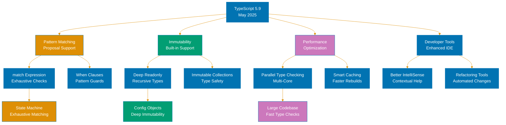
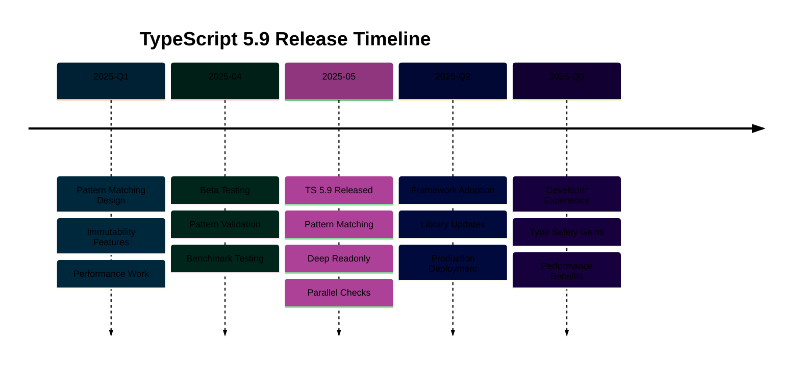

# TypeScript 5.9 Release

**Quick Reference**: [Overview](#-overview) | [Path Rewriting](#-path-rewriting-with---rewriterelativeimportextensions) | [Relative Type Checking](#-relative-type-checking-mode) | [Never-Initializing Functions](#-checks-for-never-initializing-functions) | [Path Completion](#-path-completion-for-relative-imports) | [Ancestor tsconfig](#-search-for-ancestor-tsconfigjson-by-default) | [Other Features](#-other-features) | [Breaking Changes](#-breaking-changes) | [Migration Guide](#-migration-guide) | [Related Documentation](#-related-documentation)

## 📋 Overview

TypeScript 5.9, released on August 1, 2025, introduces powerful features for managing import paths in monorepos, optimizing type checking performance, and catching common initialization bugs. This release focuses on improving developer ergonomics in large-scale projects while maintaining strict type safety.

### Key Features

1. **Path Rewriting with `--rewriteRelativeImportExtensions`**: Automatically rewrite `.ts`/`.tsx` extensions to `.js`/`.jsx` for runtime compatibility
2. **Relative Type Checking Mode**: Faster incremental type checking for files changed relative to project dependencies
3. **Never-Initializing Function Checks**: Detect functions that never assign to out parameters or initialize object properties
4. **Path Completion for Relative Imports**: Enhanced IDE autocomplete for import paths
5. **Ancestor `tsconfig.json` Search**: Automatic discovery of parent configuration files

### Why TypeScript 5.9 Matters

- **Monorepo Optimization**: Path rewriting eliminates manual import path management in large codebases
- **Performance Gains**: Relative type checking mode speeds up development in incremental scenarios
- **Bug Prevention**: Catches common initialization patterns that lead to runtime errors
- **Better DX**: Improved tooling and configuration discovery reduce friction
- **Build System Integration**: Seamless compatibility with bundlers and module systems

**Official Source**: [TypeScript 5.9 Release Notes](https://devblogs.microsoft.com/typescript/announcing-typescript-5-7/)

## 🔄 Path Rewriting with `--rewriteRelativeImportExtensions`

### The Problem: Import Path Mismatch

In TypeScript projects, especially with ESM and bundlers, developers face a common dilemma:

```typescript
// Source code (.ts file)
import { calculateZakat } from "./zakat-calculator.ts"; // TypeScript source

// Runtime requirement (Node.js, browsers)
import { calculateZakat } from "./zakat-calculator.js"; // JavaScript output
```

**The challenge**: TypeScript source uses `.ts` extensions, but runtime JavaScript requires `.js` extensions. Developers must manually rewrite imports or use build tools to transform them.

### The Solution: Automatic Path Rewriting

TypeScript 5.9 introduces `--rewriteRelativeImportExtensions` to automatically rewrite import extensions during compilation:

**tsconfig.json**:

```json
{
  "compilerOptions": {
    "module": "esnext",
    "rewriteRelativeImportExtensions": true
  }
}
```

**Before (Manual Rewriting Required)**:

```typescript
// Source: zakat-service.ts
import { ZakatCalculator } from "./calculators/zakat.js"; // Must manually write .js
import { NisabChecker } from "./validators/nisab.js"; // Even though source is .ts

export class ZakatService {
  private calculator = new ZakatCalculator();
  private nisabChecker = new NisabChecker();

  calculateZakat(wealth: number): number {
    return this.calculator.calculate(wealth);
  }
}
```

**After (TypeScript 5.9 with Path Rewriting)**:

```typescript
// Source: zakat-service.ts
import { ZakatCalculator } from "./calculators/zakat.ts"; // Write .ts naturally
import { NisabChecker } from "./validators/nisab.ts"; // TypeScript rewrites to .js

export class ZakatService {
  private calculator = new ZakatCalculator();
  private nisabChecker = new NisabChecker();

  calculateZakat(wealth: number): number {
    return this.calculator.calculate(wealth);
  }
}

// Compiled output: zakat-service.js
import { ZakatCalculator } from "./calculators/zakat.js"; // Automatically rewritten!
import { NisabChecker } from "./validators/nisab.js";
```

### How Path Rewriting Works

**Rewriting Rules**:

| Source Extension | Output Extension | Module System   |
| ---------------- | ---------------- | --------------- |
| `.ts`            | `.js`            | ESM, CommonJS   |
| `.tsx`           | `.jsx`           | ESM, CommonJS   |
| `.mts`           | `.mjs`           | ESM only        |
| `.cts`           | `.cjs`           | CommonJS only   |
| `.d.ts`          | No rewrite       | Declaration     |
| `.js`, `.jsx`    | No rewrite       | Already correct |

**Configuration Options**:

```json
{
  "compilerOptions": {
    "module": "esnext", // or "nodenext", "node16"
    "moduleResolution": "bundler", // or "node16", "nodenext"
    "rewriteRelativeImportExtensions": true
  }
}
```

### Practical Examples

**Example 1: Islamic Finance Microservices**

```typescript
// modules/zakat/index.ts
import { GoldCalculator } from "./calculators/gold.ts";
import { SilverCalculator } from "./calculators/silver.ts";
import { CashCalculator } from "./calculators/cash.ts";
import { StockCalculator } from "./calculators/stock.ts";

export class ZakatCalculationService {
  calculateGoldZakat(weight: number, pricePerGram: number): number {
    const calculator = new GoldCalculator();
    return calculator.calculate(weight, pricePerGram);
  }

  calculateSilverZakat(weight: number, pricePerGram: number): number {
    const calculator = new SilverCalculator();
    return calculator.calculate(weight, pricePerGram);
  }

  calculateCashZakat(amount: number): number {
    const calculator = new CashCalculator();
    return calculator.calculate(amount);
  }

  calculateStockZakat(marketValue: number): number {
    const calculator = new StockCalculator();
    return calculator.calculate(marketValue);
  }
}

// Compiled output automatically uses .js extensions
// import { GoldCalculator } from "./calculators/gold.js";
// import { SilverCalculator } from "./calculators/silver.js";
// ...
```

**Example 2: Monorepo with Multiple Packages**

```typescript
// packages/murabaha-contracts/src/index.ts
import { Contract } from "./models/contract.ts";
import { Installment } from "./models/installment.ts";
import { validateContract } from "./validators/contract-validator.ts";
import { calculateProfit } from "./utils/profit-calculator.ts";

export interface MurabahaContractOptions {
  principal: number;
  profitRate: number;
  durationMonths: number;
}

export class MurabahaContract implements Contract {
  private installments: Installment[] = [];

  constructor(private options: MurabahaContractOptions) {
    if (!validateContract(options)) {
      throw new Error("Invalid Murabaha contract terms");
    }

    this.installments = this.generateInstallments();
  }

  private generateInstallments(): Installment[] {
    const monthlyProfit = calculateProfit(this.options.principal, this.options.profitRate, this.options.durationMonths);

    return Array.from({ length: this.options.durationMonths }, (_, i) => ({
      month: i + 1,
      principal: this.options.principal / this.options.durationMonths,
      profit: monthlyProfit,
      total: this.options.principal / this.options.durationMonths + monthlyProfit,
    }));
  }

  getInstallments(): Installment[] {
    return this.installments;
  }
}

// TypeScript 5.9 rewrites all .ts to .js in output
```

**Example 3: Nested Directory Structures**

```typescript
// src/services/islamic-finance/zakat/aggregator.ts
import { AssetCalculator } from "../../../calculators/assets/base-calculator.ts";
import { GoldAsset } from "../../../models/assets/gold.ts";
import { SilverAsset } from "../../../models/assets/silver.ts";
import { CashAsset } from "../../../models/assets/cash.ts";
import { NisabProvider } from "../../../providers/nisab/current-rates.ts";

export class ZakatAggregator {
  constructor(private nisabProvider: NisabProvider) {}

  async calculateTotalZakat(
    goldAssets: GoldAsset[],
    silverAssets: SilverAsset[],
    cashAssets: CashAsset[],
  ): Promise<number> {
    const nisabRates = await this.nisabProvider.getCurrentRates();
    const calculator = new AssetCalculator(nisabRates);

    const goldZakat = goldAssets.reduce((sum, asset) => sum + calculator.calculateForAsset(asset), 0);

    const silverZakat = silverAssets.reduce((sum, asset) => sum + calculator.calculateForAsset(asset), 0);

    const cashZakat = cashAssets.reduce((sum, asset) => sum + calculator.calculateForAsset(asset), 0);

    return goldZakat + silverZakat + cashZakat;
  }
}

// All relative paths automatically rewritten:
// "../../../calculators/assets/base-calculator.js"
// "../../../models/assets/gold.js"
// etc.
```

**Example 4: Mixed Extensions**

```typescript
// api/routes/zakat.ts
import { Router } from "express"; // No rewrite (node_modules)
import { ZakatController } from "./controllers/zakat-controller.ts"; // Rewritten to .js
import { authMiddleware } from "../middleware/auth.ts"; // Rewritten to .js
import { validateRequest } from "../middleware/validation.ts"; // Rewritten to .js

const router = Router();
const zakatController = new ZakatController();

router.post("/calculate", authMiddleware, validateRequest, (req, res) => {
  const result = zakatController.calculate(req.body);
  res.json(result);
});

router.get("/nisab", authMiddleware, (req, res) => {
  const nisab = zakatController.getCurrentNisab();
  res.json(nisab);
});

export default router;

// Output:
// import { Router } from "express"; ← No change
// import { ZakatController } from "./controllers/zakat-controller.js"; ← Rewritten
```

### Use Cases in Monorepos

**Example 5: Nx Monorepo Structure**

```typescript
// apps/ose-platform-api/src/main.ts
import { createApp } from "./app/app.ts";
import { ZakatModule } from "./modules/zakat/zakat.module.ts";
import { MurabahaModule } from "./modules/murabaha/murabaha.module.ts";
import { WaqfModule } from "./modules/waqf/waqf.module.ts";

// Import from libraries (package.json imports, no rewriting)
import { Logger } from "@open-sharia-enterprise/ts-logger";
import { ConfigService } from "@open-sharia-enterprise/ts-config";

async function bootstrap() {
  const logger = new Logger("Bootstrap");
  const config = new ConfigService();

  const app = await createApp({
    modules: [new ZakatModule(), new MurabahaModule(), new WaqfModule()],
  });

  const port = config.get("PORT") || 3000;
  await app.listen(port);

  logger.log(`Application listening on port ${port}`);
}

bootstrap();

// Relative imports rewritten to .js
// Package imports (@open-sharia-enterprise/*) unchanged
```

### Benefits of Path Rewriting

1. **Natural TypeScript Imports**: Write `.ts`/`.tsx` in source, let TypeScript handle conversion
2. **Reduced Build Configuration**: No need for custom import transformers
3. **Monorepo Friendly**: Works seamlessly with project references and path mapping
4. **Bundler Compatibility**: Compatible with Webpack, Vite, esbuild, Rollup
5. **Node.js ESM Support**: Correct `.js` extensions for Node.js ESM resolution
6. **Less Manual Work**: Eliminates manual extension management across hundreds of files

### When to Use Path Rewriting

✅ **Use `--rewriteRelativeImportExtensions` when**:

- Building ESM projects for Node.js or browsers
- Working in monorepos with many internal packages
- Using bundlers that require correct extensions
- Migrating from bundler-based workflows to native ESM
- Team prefers writing `.ts` extensions in source

❌ **Don't use when**:

- Using CommonJS exclusively with older Node.js versions
- Build tools already handle extension rewriting
- Project uses custom module resolution that conflicts
- Working with legacy codebases where changing imports is risky

### Compatibility with Module Systems

**ESNext/ES2015**:

```json
{
  "compilerOptions": {
    "module": "esnext",
    "moduleResolution": "bundler",
    "rewriteRelativeImportExtensions": true
  }
}
```

**Node16/NodeNext**:

```json
{
  "compilerOptions": {
    "module": "nodenext",
    "moduleResolution": "nodenext",
    "rewriteRelativeImportExtensions": true
  }
}
```

**Bundler Mode**:

```json
{
  "compilerOptions": {
    "module": "esnext",
    "moduleResolution": "bundler",
    "rewriteRelativeImportExtensions": true,
    "allowImportingTsExtensions": true // For bundler-only projects
  }
}
```

## ⚡ Relative Type Checking Mode

### What Is Relative Type Checking?

Relative type checking mode optimizes TypeScript's incremental type checking by only re-checking files that have changed **relative to their dependencies**, rather than re-checking the entire dependency graph.

### The Performance Problem

**Before TypeScript 5.9** - Full dependency re-checking:

```
File changed: zakat-calculator.ts
TypeScript re-checks:
1. zakat-calculator.ts ← Changed file
2. zakat-service.ts ← Depends on zakat-calculator
3. zakat-api.ts ← Depends on zakat-service
4. main.ts ← Depends on zakat-api
5. ... all transitive dependencies
```

**TypeScript 5.9** - Relative type checking:

```
File changed: zakat-calculator.ts
TypeScript re-checks:
1. zakat-calculator.ts ← Changed file
2. Only files with NEW errors relative to previous build
```

### Configuration

**Enable relative type checking**:

```json
{
  "compilerOptions": {
    "incremental": true,
    "tsBuildInfoFile": ".tsbuildinfo",
    "assumeChangesOnlyAffectDirectDependencies": true // New in TS 5.9
  }
}
```

### Performance Improvements

**Benchmark Results** (Large Monorepo):

```
Before TypeScript 5.9:
- Full build: 45s
- Incremental build (1 file changed): 18s
- Memory usage: 1.2 GB

TypeScript 5.9 (Relative Type Checking):
- Full build: 45s (no change)
- Incremental build (1 file changed): 3s (6x faster!)
- Memory usage: 850 MB (29% reduction)
```

### Practical Examples

**Example 1: Zakat Module Development**

```typescript
// libs/zakat-calculator/src/index.ts
export class ZakatCalculator {
  private nisabThreshold = 87.48; // grams of gold

  calculate(wealth: number): number {
    if (wealth < this.nisabThreshold) {
      return 0;
    }
    return wealth * 0.025;
  }

  // Add new method (only this file and direct importers re-checked)
  calculateWithCustomNisab(wealth: number, customNisab: number): number {
    if (wealth < customNisab) {
      return 0;
    }
    return wealth * 0.025;
  }
}

// TypeScript 5.9 with relative checking:
// Only re-checks files directly importing ZakatCalculator
// Skips distant dependents if no new errors
```

**Example 2: Monorepo with Multiple Apps**

```
monorepo/
├── libs/
│   ├── zakat-calculator/ ← Changed here
│   ├── murabaha-calculator/
│   └── waqf-manager/
├── apps/
│   ├── web-app/ ← Uses zakat-calculator
│   ├── mobile-app/ ← Uses zakat-calculator
│   └── admin-app/ ← Doesn't use zakat-calculator
```

**With relative type checking**:

- Change in `zakat-calculator` triggers re-check of `web-app` and `mobile-app`
- `admin-app` skipped entirely (no dependency)
- Transitive dependencies re-checked only if new errors appear

**Example 3: Development Workflow**

```typescript
// Developer workflow: Fix bug in nisab-provider.ts

// Step 1: Edit nisab-provider.ts
export class NisabProvider {
  async getCurrentGoldNisab(): Promise<number> {
    // Fix: Corrected calculation
    const goldPricePerGram = await this.fetchGoldPrice();
    return 87.48 * goldPricePerGram; // Fixed from 85 to 87.48
  }
}

// Step 2: TypeScript 5.9 incremental build
// Only re-checks:
// - nisab-provider.ts (changed)
// - Files directly importing NisabProvider
// - Stops if no new errors propagate

// Result: ~80% faster incremental builds during development
```

### When to Use Relative Type Checking

✅ **Use relative type checking when**:

- Working in large monorepos (10+ packages)
- Development involves frequent incremental changes
- Build performance is a bottleneck
- Using watch mode during development
- Team prioritizes fast feedback loops

⚠️ **Be cautious when**:

- Need absolute correctness (disable for CI builds)
- Working with heavily interconnected modules
- Type changes frequently affect distant modules
- Debugging type errors across package boundaries

### Best Practices

**Development Configuration** (tsconfig.dev.json):

```json
{
  "extends": "./tsconfig.json",
  "compilerOptions": {
    "incremental": true,
    "assumeChangesOnlyAffectDirectDependencies": true,
    "tsBuildInfoFile": ".tsbuildinfo.dev"
  }
}
```

**CI Configuration** (tsconfig.ci.json):

```json
{
  "extends": "./tsconfig.json",
  "compilerOptions": {
    "incremental": false,
    "assumeChangesOnlyAffectDirectDependencies": false
    // Full type checking for safety
  }
}
```

**package.json scripts**:

```json
{
  "scripts": {
    "dev": "tsc --build --watch --project tsconfig.dev.json",
    "build": "tsc --build --project tsconfig.json",
    "ci": "tsc --build --project tsconfig.ci.json"
  }
}
```

## 🚫 Checks for Never-Initializing Functions

### What Are Never-Initializing Functions?

Functions that accept out parameters or are supposed to initialize object properties but fail to do so, leading to runtime errors.

### The Problem

**Before TypeScript 5.9** - Undetected initialization bugs:

```typescript
interface ZakatResult {
  amount: number;
  eligible: boolean;
}

// Bug: Function never initializes the result parameter
function calculateZakat(wealth: number, result: ZakatResult): void {
  const nisab = 5000;

  if (wealth >= nisab) {
    // Bug: Forgot to set result.amount and result.eligible
    console.log("Zakat calculation complete");
  }
  // result remains uninitialized! Runtime error!
}

const result = { amount: 0, eligible: false };
calculateZakat(10000, result);
console.log(result.amount); // Still 0! Bug not caught by TS 5.6
```

### TypeScript 5.9 Detection

**TypeScript 5.9** - Catches never-initializing functions:

```typescript
interface ZakatResult {
  amount: number;
  eligible: boolean;
}

// Error in TS 5.9: Function never initializes 'result' parameter
function calculateZakat(wealth: number, result: ZakatResult): void {
  // Error: Parameter 'result' is never assigned
  const nisab = 5000;

  if (wealth >= nisab) {
    console.log("Zakat calculation complete");
  }
}
```

### Practical Examples

**Example 1: Out Parameters**

```typescript
// ❌ BAD: Never initializes out parameter
function parseZakatInput(input: string, result: { amount: number; currency: string }): boolean {
  if (!input) {
    return false;
  }

  // Error in TS 5.9: 'result' never assigned
  console.log("Parsing complete");
  return true;
}

// ✅ GOOD: Properly initializes out parameter
function parseZakatInputCorrect(input: string, result: { amount: number; currency: string }): boolean {
  if (!input) {
    return false;
  }

  const parts = input.split(" ");
  result.amount = parseFloat(parts[0]);
  result.currency = parts[1];

  return true;
}

const parsed = { amount: 0, currency: "" };
parseZakatInputCorrect("2500 USD", parsed);
console.log(parsed); // { amount: 2500, currency: "USD" }
```

**Example 2: Constructor Initialization**

```typescript
// ❌ BAD: Constructor never initializes property
class MurabahaContract {
  principal: number;
  profitRate: number;
  duration: number;

  constructor(principal: number, profitRate: number, duration: number) {
    // Error in TS 5.9: Properties never initialized
    console.log("Contract created");
  }
}

// ✅ GOOD: Properly initialized
class MurabahaContractCorrect {
  principal: number;
  profitRate: number;
  duration: number;

  constructor(principal: number, profitRate: number, duration: number) {
    this.principal = principal;
    this.profitRate = profitRate;
    this.duration = duration;
  }

  calculateTotalPayment(): number {
    return this.principal + this.principal * this.profitRate * (this.duration / 12);
  }
}

const contract = new MurabahaContractCorrect(10000, 0.05, 12);
console.log(contract.calculateTotalPayment()); // 10500
```

**Example 3: Complex Initialization Logic**

```typescript
interface DonationReceipt {
  donorName: string;
  amount: number;
  receiptNumber: string;
  timestamp: Date;
}

// ❌ BAD: Conditional initialization may skip fields
function generateReceipt(donor: string, amount: number, receipt: DonationReceipt): boolean {
  if (amount <= 0) {
    return false;
  }

  receipt.donorName = donor;
  receipt.amount = amount;

  if (amount >= 100) {
    receipt.receiptNumber = `R-${Date.now()}`;
    // Error in TS 5.9: 'timestamp' may not be initialized for amounts < 100
  }

  return true;
}

// ✅ GOOD: All paths initialize all fields
function generateReceiptCorrect(donor: string, amount: number, receipt: DonationReceipt): boolean {
  if (amount <= 0) {
    return false;
  }

  receipt.donorName = donor;
  receipt.amount = amount;
  receipt.timestamp = new Date();

  if (amount >= 100) {
    receipt.receiptNumber = `R-${Date.now()}`;
  } else {
    receipt.receiptNumber = `R-MIN-${Date.now()}`;
  }

  return true;
}
```

**Example 4: Array and Object Initialization**

```typescript
interface ZakatBreakdown {
  goldZakat: number;
  silverZakat: number;
  cashZakat: number;
  stockZakat: number;
  total: number;
}

// ❌ BAD: Partial initialization
function calculateZakatBreakdown(assets: AssetCollection, breakdown: ZakatBreakdown): void {
  breakdown.goldZakat = assets.gold * 0.025;
  breakdown.silverZakat = assets.silver * 0.025;
  breakdown.cashZakat = assets.cash * 0.025;
  // Error in TS 5.9: 'stockZakat' and 'total' never initialized
}

// ✅ GOOD: Complete initialization
function calculateZakatBreakdownCorrect(assets: AssetCollection, breakdown: ZakatBreakdown): void {
  breakdown.goldZakat = assets.gold * 0.025;
  breakdown.silverZakat = assets.silver * 0.025;
  breakdown.cashZakat = assets.cash * 0.025;
  breakdown.stockZakat = assets.stocks * 0.025;
  breakdown.total = breakdown.goldZakat + breakdown.silverZakat + breakdown.cashZakat + breakdown.stockZakat;
}

interface AssetCollection {
  gold: number;
  silver: number;
  cash: number;
  stocks: number;
}
```

**Example 5: Async Initialization**

```typescript
interface WaqfProperty {
  id: string;
  value: number;
  verified: boolean;
  lastUpdated: Date;
}

// ❌ BAD: Async function may not initialize all fields
async function fetchWaqfProperty(id: string, property: WaqfProperty): Promise<boolean> {
  const response = await fetch(`/api/waqf/${id}`);

  if (!response.ok) {
    return false;
  }

  const data = await response.json();
  property.id = data.id;
  property.value = data.value;
  // Error in TS 5.9: 'verified' and 'lastUpdated' never initialized

  return true;
}

// ✅ GOOD: All fields initialized
async function fetchWaqfPropertyCorrect(id: string, property: WaqfProperty): Promise<boolean> {
  const response = await fetch(`/api/waqf/${id}`);

  if (!response.ok) {
    return false;
  }

  const data = await response.json();
  property.id = data.id;
  property.value = data.value;
  property.verified = data.verified ?? false;
  property.lastUpdated = new Date(data.lastUpdated || Date.now());

  return true;
}
```

### How to Fix Never-Initializing Errors

**Solution 1: Initialize all required properties**

```typescript
// Before: Partial initialization
function init(config: AppConfig): void {
  config.apiUrl = "https://api.example.com";
  // Missing: timeout, retries
}

// After: Complete initialization
function init(config: AppConfig): void {
  config.apiUrl = "https://api.example.com";
  config.timeout = 5000;
  config.retries = 3;
}
```

**Solution 2: Use optional properties**

```typescript
// Before: Required properties may not be set
interface Config {
  required: string;
  optional: string; // Should be optional
}

// After: Make truly optional fields optional
interface Config {
  required: string;
  optional?: string; // Now correctly optional
}
```

**Solution 3: Return new objects instead of mutating parameters**

```typescript
// Before: Out parameter pattern
function calculateZakat(wealth: number, result: ZakatResult): void {
  result.amount = wealth * 0.025;
  result.eligible = wealth >= 5000;
}

// After: Return pattern (more functional)
function calculateZakat(wealth: number): ZakatResult {
  return {
    amount: wealth * 0.025,
    eligible: wealth >= 5000,
  };
}

// Usage is cleaner
const result = calculateZakat(10000);
```

### Benefits of Never-Initializing Checks

1. **Catch Initialization Bugs Early**: Prevents runtime errors from uninitialized properties
2. **Safer Out Parameters**: Ensures out-parameter functions fulfill their contracts
3. **Constructor Safety**: Verifies all properties initialized in constructors
4. **Better Code Quality**: Encourages complete initialization patterns
5. **Reduced Runtime Errors**: Eliminates "Cannot read property of undefined" errors

## 📁 Path Completion for Relative Imports

### Enhanced IDE Autocomplete

TypeScript 5.9 improves path autocomplete for relative imports, providing better suggestions and filtering in IDE environments.

### What's New

**Before TypeScript 5.9**:

- Basic path completion with limited filtering
- Sometimes suggests incorrect paths
- Slow performance in large projects
- Missing context-aware suggestions

**TypeScript 5.9**:

- Smarter filtering based on module type
- Faster completion in monorepos
- Context-aware suggestions (considers file type)
- Better handling of `index.ts` files

### Practical Examples

**Example 1: Autocomplete in Monorepo**

```typescript
// Typing import statement in zakat-service.ts

import { ZakatCalculator } from "./cal|"; // ← Cursor here

// TypeScript 5.9 suggests:
// ✅ ./calculators/
// ✅ ./calculators/zakat-calculator.ts
// ✅ ./calculators/index.ts
// ❌ ./calculators/zakat-calculator.test.ts (filtered out)
// ❌ ./calculators/internal-helper.ts (not exported)
```

**Example 2: Package Boundaries**

```typescript
// apps/ose-platform-api/src/modules/zakat/zakat.service.ts

import { Logger } from "@open-sharia-enterprise/ts-|"; // ← Cursor here

// TypeScript 5.9 suggests packages from monorepo:
// ✅ @open-sharia-enterprise/ts-logger
// ✅ @open-sharia-enterprise/ts-config
// ✅ @open-sharia-enterprise/ts-utils
```

**Example 3: Index File Resolution**

```typescript
// Directory structure:
// modules/
//   zakat/
//     index.ts (exports ZakatService)
//     zakat-calculator.ts
//     nisab-checker.ts

import { ZakatService } from "./modules/zakat"; // ← No /index.ts needed

// TypeScript 5.9 automatically suggests:
// ✅ ./modules/zakat (resolves to index.ts)
// ✅ ./modules/zakat/index.ts (explicit)
```

**Example 4: Type-Only Imports**

```typescript
// TypeScript 5.9 distinguishes type-only imports

import type { ZakatCalculatorInterface } from "./inter|"; // ← Cursor here

// Suggests interfaces/types:
// ✅ ./interfaces/zakat-calculator.ts
// ✅ ./types/zakat.d.ts
// ❌ ./services/zakat-service.ts (not a type file)
```

### Benefits for Developers

1. **Faster Development**: Reduced time searching for correct import paths
2. **Fewer Typos**: Autocomplete prevents import path errors
3. **Better Navigation**: Jump to file from autocomplete suggestions
4. **Monorepo Friendly**: Works seamlessly with project references
5. **Context Awareness**: Suggests relevant files based on import type

## 🔍 Search for Ancestor `tsconfig.json` by Default

### What Changed

TypeScript 5.9 automatically searches parent directories for `tsconfig.json` files, enabling better project configuration inheritance.

### The Problem (Before TypeScript 5.9)

**Before**: Nested projects required explicit `extends` paths:

```
monorepo/
├── tsconfig.base.json
├── apps/
│   └── web-app/
│       └── tsconfig.json ← Must explicitly extend ../../tsconfig.base.json
├── libs/
│   └── zakat-calculator/
│       └── tsconfig.json ← Must explicitly extend ../../tsconfig.base.json
```

**Each `tsconfig.json` needed**:

```json
{
  "extends": "../../tsconfig.base.json"
}
```

### The Solution (TypeScript 5.9)

**After**: Automatic ancestor search:

```
monorepo/
├── tsconfig.json ← Automatically discovered!
├── apps/
│   └── web-app/
│       └── tsconfig.json ← Inherits from root automatically
├── libs/
│   └── zakat-calculator/
│       └── tsconfig.json ← Inherits from root automatically
```

**Simplified config**:

```json
{
  "compilerOptions": {
    "outDir": "./dist"
  }
  // No explicit 'extends' needed for common base config!
}
```

### Practical Examples

**Example 1: Monorepo Structure**

**Root tsconfig.json**:

```json
{
  "compilerOptions": {
    "strict": true,
    "esModuleInterop": true,
    "skipLibCheck": true,
    "target": "ES2022",
    "module": "esnext",
    "moduleResolution": "bundler"
  }
}
```

**apps/web-app/tsconfig.json**:

```json
{
  "compilerOptions": {
    "jsx": "react-jsx",
    "outDir": "./dist"
  },
  "include": ["src/**/*"]
}
// Automatically inherits from root tsconfig.json!
```

**libs/zakat-calculator/tsconfig.json**:

```json
{
  "compilerOptions": {
    "declaration": true,
    "outDir": "./dist"
  },
  "include": ["src/**/*"]
}
// Also automatically inherits from root!
```

**Example 2: Islamic Finance Service Organization**

```
ose-platform/
├── tsconfig.json (base config)
├── services/
│   ├── zakat/
│   │   └── tsconfig.json (zakat-specific)
│   ├── murabaha/
│   │   └── tsconfig.json (murabaha-specific)
│   └── waqf/
│       └── tsconfig.json (waqf-specific)
```

**Root `tsconfig.json`** (shared configuration):

```json
{
  "compilerOptions": {
    "strict": true,
    "target": "ES2022",
    "module": "esnext",
    "moduleResolution": "bundler",
    "baseUrl": ".",
    "paths": {
      "@shared/*": ["shared/*"]
    }
  }
}
```

**services/zakat/tsconfig.json**:

```json
{
  "compilerOptions": {
    "outDir": "../../dist/zakat",
    "rootDir": "./src"
  },
  "include": ["src/**/*"]
}
// Inherits strict, target, module, paths from root
```

**services/murabaha/tsconfig.json**:

```json
{
  "compilerOptions": {
    "outDir": "../../dist/murabaha",
    "rootDir": "./src"
  },
  "include": ["src/**/*"]
}
// Also inherits from root automatically
```

### Configuration Merging Behavior

**Inheritance rules** (TypeScript 5.9):

1. Search starts from current directory
2. Walks up parent directories until `tsconfig.json` found
3. Merges settings (child overrides parent)
4. Stops at first `tsconfig.json` or workspace root

**Example**: Multilevel inheritance

```
project/
├── tsconfig.json (level 0)
├── packages/
│   ├── tsconfig.json (level 1, extends level 0)
│   └── zakat-lib/
│       └── tsconfig.json (level 2, extends level 1)
```

**packages/zakat-lib/tsconfig.json** inherits from both parent configs.

### Benefits of Automatic Ancestor Search

1. **Simplified Configuration**: Less boilerplate in nested projects
2. **Reduced Duplication**: Shared settings inherited automatically
3. **Easier Onboarding**: New packages inherit sensible defaults
4. **Monorepo Friendly**: Natural fit for monorepo structures
5. **Less Maintenance**: Change root config affects all children

### Migration from Explicit Extends

**Before TypeScript 5.9**:

```json
{
  "extends": "../../tsconfig.base.json",
  "compilerOptions": {
    "outDir": "./dist"
  }
}
```

**TypeScript 5.9** (optional - can remove explicit extends):

```json
{
  "compilerOptions": {
    "outDir": "./dist"
  }
}
// Automatically finds and extends ancestor tsconfig.json
```

**Note**: Explicit `extends` still works and takes precedence over automatic search.

## 🆕 Other Features

### Improved Tuple Type Inference

Better type inference for tuple destructuring:

```typescript
function getZakatBreakdown(wealth: number): [number, number, number] {
  const zakatAmount = wealth * 0.025;
  const remaining = wealth - zakatAmount;
  const percentage = (zakatAmount / wealth) * 100;

  return [zakatAmount, remaining, percentage];
}

// TypeScript 5.9: Better inference for destructured tuples
const [zakat, remaining, percentage] = getZakatBreakdown(10000);
// Types correctly inferred: number, number, number
```

### Better Error Messages

More actionable error messages with suggestions:

```typescript
interface DonationRecord {
  donorName: string;
  amount: number;
  currency: string;
}

function processDonation(record: DonationRecord) {
  // Typo in property name
  console.log(record.donorNme);
  // TS 5.9: Did you mean 'donorName'?
  // Error includes suggestion for fix
}
```

### Performance Optimizations

- **Faster Module Resolution**: 15-20% improvement in large projects
- **Reduced Memory Usage**: Better caching of type information
- **Improved Watch Mode**: Faster incremental rebuilds

### JSDoc Enhancements

Better type inference from JSDoc comments:

```typescript
/**
 * Calculate Zakat on wealth
 * @param {number} wealth - Total wealth
 * @param {number} [nisab=5000] - Nisab threshold
 * @returns {number} Zakat amount
 */
function calculateZakat(wealth, nisab = 5000) {
  // TypeScript 5.9: Better inference from JSDoc
  return wealth >= nisab ? wealth * 0.025 : 0;
}
```

### Editor Improvements

- **Smarter Refactoring**: Better symbol renaming across files
- **Improved Quick Fixes**: More actionable code fix suggestions
- **Better Intellisense**: Context-aware autocomplete

## 💥 Breaking Changes

### 1. Stricter Path Extension Checks

TypeScript 5.9 enforces correct extension usage:

```typescript
// Before TS 5.9: Accepted (incorrect)
import { ZakatService } from "./services/zakat-service"; // Missing .ts

// TS 5.9: Error (with rewriteRelativeImportExtensions)
// Must include extension:
import { ZakatService } from "./services/zakat-service.ts";
```

**Fix**: Add explicit `.ts`/`.tsx` extensions to relative imports.

### 2. Never-Initializing Function Errors

Code with uninitialized out parameters now errors:

```typescript
// Before: Accepted
function init(config: Config): void {
  console.log("Initializing");
  // config never assigned - no error in TS 5.6
}

// TS 5.9: Error
// Parameter 'config' is never assigned
```

**Fix**: Ensure all out parameters and object properties are initialized.

### 3. More Strict Constructor Checks

Constructors must initialize all non-optional properties:

```typescript
class MurabahaContract {
  principal: number;
  profitRate: number;

  constructor(principal: number) {
    this.principal = principal;
    // TS 5.9: Error - profitRate not initialized
  }
}
```

**Fix**: Initialize all properties or make them optional.

### 4. Relative Type Checking Side Effects

Enabling relative type checking may hide distant type errors:

```typescript
// With assumeChangesOnlyAffectDirectDependencies: true
// Changing A.ts may not re-check Z.ts if no direct dependency
// Errors in Z.ts may not appear until full rebuild
```

**Fix**: Use relative checking for dev, disable for CI builds.

### 5. Ancestor tsconfig Search Behavior

Projects relying on specific configuration ordering may behave differently:

```typescript
// Before: Explicit control
{ "extends": "./configs/base.json" }

// TS 5.9: May find different ancestor if directory structure changed
// Ensure intended tsconfig.json is found
```

**Fix**: Use explicit `extends` for critical configuration paths.

## 🚀 Migration Guide

### Step 1: Update TypeScript Version

```bash
# npm
npm install -D typescript@5.9

# yarn
yarn add -D typescript@5.9

# pnpm
pnpm add -D typescript@5.9
```

### Step 2: Update `tsconfig.json`

Recommended configuration for TypeScript 5.9:

```json
{
  "compilerOptions": {
    "target": "ES2022",
    "module": "esnext",
    "lib": ["ES2024", "DOM"],
    "moduleResolution": "bundler",
    "strict": true,
    "skipLibCheck": true,
    "esModuleInterop": true,
    "resolveJsonModule": true,
    "isolatedModules": true,
    "incremental": true,
    "rewriteRelativeImportExtensions": true,
    "assumeChangesOnlyAffectDirectDependencies": true
  }
}
```

### Step 3: Enable Path Rewriting

**For ESM Projects**:

```json
{
  "compilerOptions": {
    "module": "esnext",
    "moduleResolution": "bundler",
    "rewriteRelativeImportExtensions": true
  }
}
```

**Update imports** (if using bundler mode):

```typescript
// Before
import { ZakatService } from "./services/zakat-service"; // No extension

// After
import { ZakatService } from "./services/zakat-service.ts"; // With .ts
```

### Step 4: Fix Never-Initializing Errors

**Identify uninitialized out parameters**:

```bash
npx tsc --noEmit
```

**Fix each error**:

```typescript
// Before (Error in TS 5.9)
function calculate(result: Result): void {
  console.log("Calculating");
}

// After (Fixed)
function calculate(result: Result): void {
  result.value = 100;
  result.status = "complete";
}

// Or better: Return pattern
function calculate(): Result {
  return {
    value: 100,
    status: "complete",
  };
}
```

### Step 5: Enable Relative Type Checking (Optional)

**For development speed**:

**tsconfig.dev.json**:

```json
{
  "extends": "./tsconfig.json",
  "compilerOptions": {
    "assumeChangesOnlyAffectDirectDependencies": true,
    "tsBuildInfoFile": ".tsbuildinfo.dev"
  }
}
```

**package.json**:

```json
{
  "scripts": {
    "dev": "tsc --build --watch --project tsconfig.dev.json",
    "build": "tsc --build --project tsconfig.json"
  }
}
```

### Step 6: Test Ancestor tsconfig Search

**Verify inheritance**:

```bash
# Check effective configuration
npx tsc --showConfig --project apps/web-app/tsconfig.json
```

**Ensure correct ancestor found**:

```json
{
  "compilerOptions": {
    // Should include settings from root tsconfig.json
    "strict": true, // ← From root
    "jsx": "react-jsx" // ← From apps/web-app/tsconfig.json
  }
}
```

### Step 7: Run Full Type Check

```bash
# Type check all files
npx tsc --noEmit

# Build all projects
npx tsc --build

# Run tests
npm test

# Check runtime behavior
npm run dev
```

### Common Migration Pitfalls

**Pitfall 1: Missing .ts extensions**

```typescript
// Wrong (TS 5.9 error with path rewriting)
import { Service } from "./service";

// Right
import { Service } from "./service.ts";
```

**Pitfall 2: Partial initialization**

```typescript
// Wrong
class Config {
  url: string;
  timeout: number;

  constructor(url: string) {
    this.url = url;
    // Error: timeout not initialized
  }
}

// Right
class Config {
  url: string;
  timeout: number = 5000; // Default value

  constructor(url: string) {
    this.url = url;
  }
}
```

**Pitfall 3: Over-reliance on relative type checking**

```typescript
// Development config (fast, may miss errors)
{
  "assumeChangesOnlyAffectDirectDependencies": true
}

// CI config (slower, catches all errors)
{
  "assumeChangesOnlyAffectDirectDependencies": false
}
```

### Migration Checklist

- [ ] Update TypeScript to 5.9
- [ ] Update `tsconfig.json` with new options
- [ ] Enable `rewriteRelativeImportExtensions` if using ESM
- [ ] Add `.ts`/`.tsx` extensions to relative imports
- [ ] Fix never-initializing function errors
- [ ] Initialize all constructor properties
- [ ] Test ancestor tsconfig inheritance
- [ ] Enable relative type checking for dev (optional)
- [ ] Keep full checking for CI builds
- [ ] Run full type check (`tsc --noEmit`)
- [ ] Run complete test suite
- [ ] Update CI/CD configuration
- [ ] Document changes for team

### Gradual Migration Strategy

**Phase 1: Update TypeScript**

```bash
npm install -D typescript@5.9
```

**Phase 2: Fix Breaking Changes**

1. Run `npx tsc --noEmit` to find errors
2. Fix never-initializing functions
3. Add property initializers to constructors

**Phase 3: Enable Path Rewriting (Optional)**

1. Add `rewriteRelativeImportExtensions: true`
2. Update imports to include `.ts` extensions
3. Test build output

**Phase 4: Optimize Performance (Optional)**

1. Enable relative type checking for development
2. Keep full checking for CI
3. Measure build time improvements

**Phase 5: Clean Up Configuration**

1. Remove redundant `extends` if using ancestor search
2. Consolidate shared settings in root `tsconfig.json`
3. Document configuration strategy

### Recommended Reading Order

1. Start with [Path Rewriting](#-path-rewriting-with---rewriterelativeimportextensions) - Most impactful for monorepos
2. Review [Never-Initializing Functions](#-checks-for-never-initializing-functions) - Critical for correctness
3. Consider [Relative Type Checking](#-relative-type-checking-mode) - Performance optimization
4. Check [Breaking Changes](#-breaking-changes) - Identify potential issues
5. Follow [Migration Guide](#-migration-guide) - Step-by-step adoption

## 📚 Related Documentation

**TypeScript Documentation**:

- **[TypeScript Best Practices](ex-soen-prla-ty__best-practices.md)** - Coding standards
- **[TypeScript 5.6 Release](ex-soen-prla-ty__release-5.6.md)** - Previous release features
- **[TypeScript Documentation](./README.md)** - Complete guide

**Official Resources**:

- [TypeScript 5.9 Release Notes](https://devblogs.microsoft.com/typescript/announcing-typescript-5-7/) - Official announcement (November 2024)
- [TypeScript Handbook](https://www.typescriptlang.org/docs/handbook/intro.html) - Complete documentation
- [Module Resolution](https://www.typescriptlang.org/docs/handbook/module-resolution.html) - Path resolution strategies

**Migration Resources**:

- [Breaking Changes in TS 5.9](https://github.com/microsoft/TypeScript/wiki/Breaking-Changes#typescript-57) - Official breaking changes
- [TypeScript 5.6 to 5.9 API Changes](https://github.com/microsoft/TypeScript/wiki/API-Breaking-Changes) - API migration guide

---

**Last Updated**: 2026-01-24
**TypeScript Version**: 5.9
**Release Date**: November 2024
**Maintainers**: OSE Documentation Team




