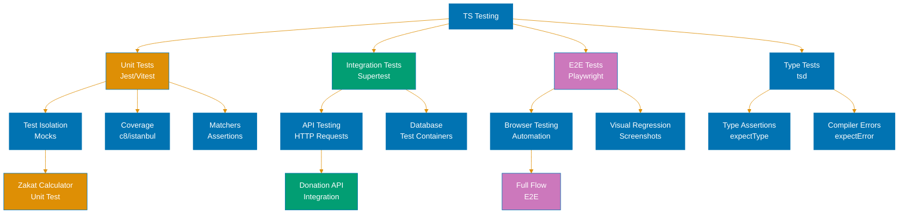
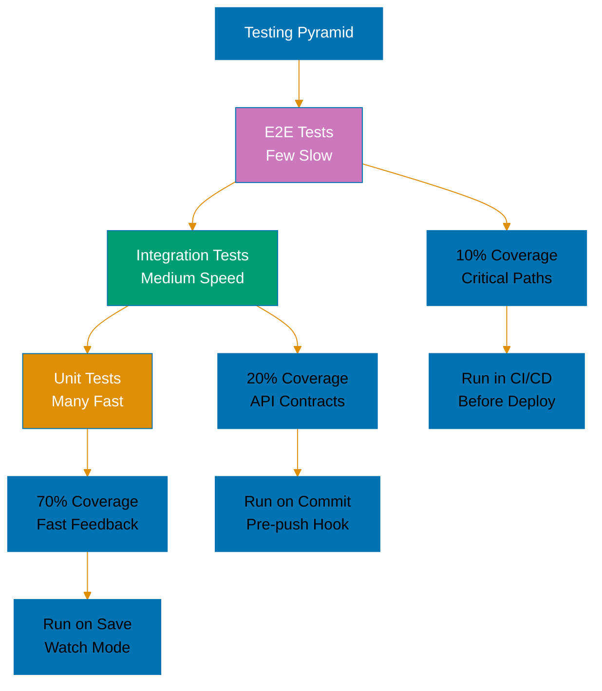

# TypeScript Testing

## Testing Strategy

```mermaid
%%{init: {'theme':'base', 'themeVariables': { 'primaryColor':'#0173B2','primaryTextColor':'#fff','primaryBorderColor':'#0173B2','lineColor':'#DE8F05','secondaryColor':'#029E73','tertiaryColor':'#CC78BC','fontSize':'16px'}}}%%
flowchart TD
    A[TS Testing] --> B[Unit Tests<br/>Jest/Vitest]
    A --> C[Integration Tests<br/>Supertest]
    A --> D[E2E Tests<br/>Playwright]
    A --> E[Type Tests<br/>tsd]

    B --> B1[Test Isolation<br/>Mocks]
    B --> B2[Coverage<br/>c8/istanbul]
    B --> B3[Matchers<br/>Assertions]

    C --> C1[API Testing<br/>HTTP Requests]
    C --> C2[Database<br/>Test Containers]

    D --> D1[Browser Testing<br/>Automation]
    D --> D2[Visual Regression<br/>Screenshots]

    E --> E1[Type Assertions<br/>expectType]
    E --> E2[Compiler Errors<br/>expectError]

    B1 --> F[Zakat Calculator<br/>Unit Test]
    C1 --> G[Donation API<br/>Integration]
    D1 --> H[Full Flow<br/>E2E]

    style A fill:#0173B2,color:#fff
    style B fill:#DE8F05,color:#fff
    style C fill:#029E73,color:#fff
    style D fill:#CC78BC,color:#fff
    style E fill:#0173B2,color:#fff
    style F fill:#DE8F05,color:#fff
    style G fill:#029E73,color:#fff
    style H fill:#CC78BC,color:#fff
```

## Test Pyramid

```mermaid
%%{init: {'theme':'base', 'themeVariables': { 'primaryColor':'#0173B2','primaryTextColor':'#000','primaryBorderColor':'#0173B2','lineColor':'#DE8F05','secondaryColor':'#029E73','tertiaryColor':'#CC78BC','fontSize':'16px'}}}%%
flowchart TD
    A[Testing Pyramid] --> B[E2E Tests<br/>Few Slow]
    B --> C[Integration Tests<br/>Medium Speed]
    C --> D[Unit Tests<br/>Many Fast]

    D --> D1[70% Coverage<br/>Fast Feedback]
    C --> C1[20% Coverage<br/>API Contracts]
    B --> B1[10% Coverage<br/>Critical Paths]

    D1 --> E[Run on Save<br/>Watch Mode]
    C1 --> F[Run on Commit<br/>Pre-push Hook]
    B1 --> G[Run in CI/CD<br/>Before Deploy]

    style A fill:#0173B2,color:#fff
    style D fill:#DE8F05,color:#fff
    style C fill:#029E73,color:#fff
    style B fill:#CC78BC,color:#fff
```
