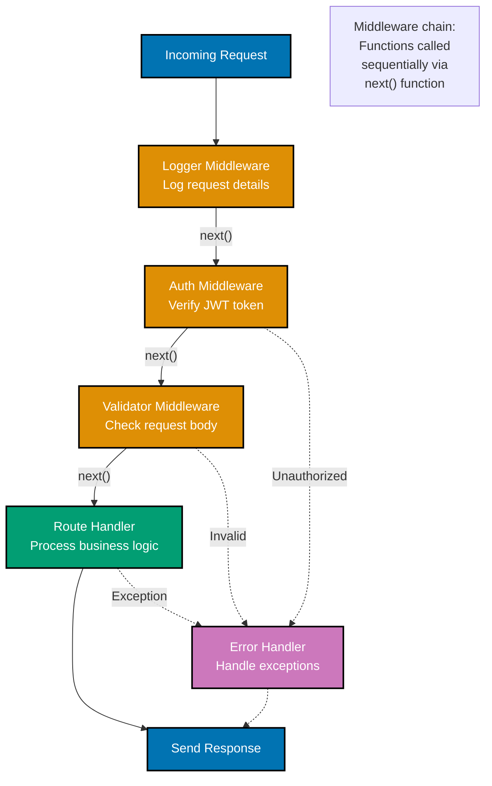
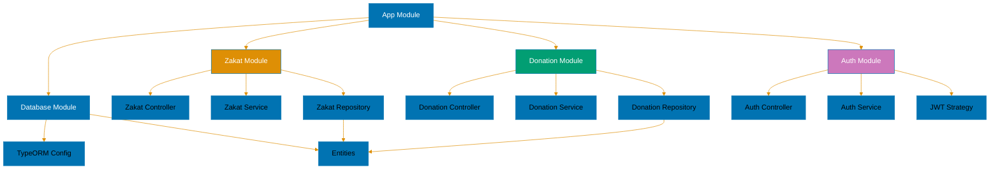

# TypeScript Web Services

**Quick Reference**: [Overview](#overview) | [Express](#express-5x4x) | [Fastify](#fastify-5x) | [NestJS](#nestjs-11x) | [tRPC](#trpc-11x) | [Hono](#hono-4x) | [API Design](#api-design-patterns) | [Complete Example](#complete-example-donation-api) | [Related Documentation](#related-documentation)

## Overview

TypeScript is the dominant language for building web services in Node.js. This guide covers the major frameworks and patterns for building robust, type-safe APIs for financial applications.

### Framework Comparison

| Framework | Version     | Type Safety | Performance | Complexity | Best For                       |
| --------- | ----------- | ----------- | ----------- | ---------- | ------------------------------ |
| Express   | 5.2.1 / 4.x | Moderate    | Good        | Low        | Simple APIs, existing projects |
| Fastify   | 5.x         | High        | Excellent   | Medium     | High-performance APIs          |
| NestJS    | 11.x        | Excellent   | Good        | High       | Enterprise applications        |
| tRPC      | 11.x        | Perfect     | Excellent   | Medium     | Full-stack TypeScript          |
| Hono      | 4.x         | Excellent   | Excellent   | Low        | Edge computing, serverless     |

## Express 5.x/4.x

Express is the minimalist Node.js web framework. Version 5.x brings async/await support and better error handling.

### Basic Setup

```typescript
import express, { Request, Response, NextFunction } from "express";

const app = express();

app.use(express.json());

app.get("/", (req: Request, res: Response) => {
  res.json({ message: "Hello World" });
});

app.listen(3000, () => {
  console.log("Server running on port 3000");
});
```

### Typed Request/Response

```typescript
interface DonationCreateRequest {
  donorId: string;
  amount: number;
  currency: string;
  category: "zakat" | "sadaqah" | "waqf";
  message?: string;
}

interface DonationResponse {
  donationId: string;
  donorId: string;
  amount: number;
  currency: string;
  category: string;
  createdAt: string;
}

app.post("/api/donations", async (req: Request<{}, {}, DonationCreateRequest>, res: Response<DonationResponse>) => {
  const { donorId, amount, currency, category, message } = req.body;

  // Validation
  if (!donorId || !amount || !currency || !category) {
    res.status(400).json({
      error: "Missing required fields",
    } as any);
    return;
  }

  // Create donation
  const donation = {
    donationId: `DON-${Date.now()}`,
    donorId,
    amount,
    currency,
    category,
    createdAt: new Date().toISOString(),
  };

  res.status(201).json(donation);
});
```

### HTTP Request/Response Cycle with Middleware

```mermaid
%% Color Palette: Blue #0173B2, Orange #DE8F05, Teal #029E73, Purple #CC78BC, Brown #CA9161
sequenceDiagram
    participant Client
    participant M1 as Middleware 1<br/>#40;Logger#41;
    participant M2 as Middleware 2<br/>#40;Auth#41;
    participant M3 as Middleware 3<br/>#40;Validator#41;
    participant Handler as Route Handler
    participant DB as Database

    Client->>M1: HTTP Request
    activate M1
    M1->>M1: Log request
    M1->>M2: next#40;#41;
    deactivate M1

    activate M2
    M2->>M2: Check auth token
    alt Not authenticated
        M2-->>Client: 401 Unauthorized
    else Authenticated
        M2->>M3: next#40;#41;
    end
    deactivate M2

    activate M3
    M3->>M3: Validate body
    alt Invalid
        M3-->>Client: 400 Bad Request
    else Valid
        M3->>Handler: next#40;#41;
    end
    deactivate M3

    activate Handler
    Handler->>DB: Query data
    activate DB
    DB-->>Handler: Data
    deactivate DB
    Handler-->>Client: 200 OK + JSON
    deactivate Handler

    classDef blue fill:#0173B2,stroke:#000000,color:#FFFFFF,stroke-width:2px
    classDef orange fill:#DE8F05,stroke:#000000,color:#FFFFFF,stroke-width:2px
    classDef teal fill:#029E73,stroke:#000000,color:#FFFFFF,stroke-width:2px
```

### Middleware Pattern

```typescript
import { Request, Response, NextFunction } from "express";

// Request validator middleware
function validateDonation(req: Request, res: Response, next: NextFunction): void {
  const { amount, currency } = req.body;

  if (typeof amount !== "number" || amount <= 0) {
    res.status(400).json({ error: "Invalid amount" });
    return;
  }

  if (!["USD", "EUR", "SAR"].includes(currency)) {
    res.status(400).json({ error: "Invalid currency" });
    return;
  }

  next();
}

// Error handler middleware
function errorHandler(err: Error, req: Request, res: Response, next: NextFunction): void {
  console.error(err.stack);
  res.status(500).json({
    error: "Internal server error",
    message: err.message,
  });
}

app.post("/api/donations", validateDonation, async (req, res) => {
  // Handler logic
});

app.use(errorHandler);
```

### Middleware Chain Execution



### Express Router

```typescript
import { Router } from "express";

const donationRouter = Router();

donationRouter.get("/", async (req, res) => {
  // List donations
  res.json({ donations: [] });
});

donationRouter.get("/:id", async (req, res) => {
  const { id } = req.params;
  // Get donation by ID
  res.json({ donationId: id });
});

donationRouter.post("/", validateDonation, async (req, res) => {
  // Create donation
  res.status(201).json({ created: true });
});

donationRouter.put("/:id", async (req, res) => {
  const { id } = req.params;
  // Update donation
  res.json({ updated: true });
});

donationRouter.delete("/:id", async (req, res) => {
  const { id } = req.params;
  // Delete donation
  res.status(204).send();
});

app.use("/api/donations", donationRouter);
```

## Fastify 5.x

Fastify is a high-performance web framework with excellent TypeScript support.

### Basic Setup

```typescript
import Fastify from "fastify";

const fastify = Fastify({
  logger: true,
});

fastify.get("/", async (request, reply) => {
  return { message: "Hello World" };
});

fastify.listen({ port: 3000 }, (err, address) => {
  if (err) throw err;
  console.log(`Server listening on ${address}`);
});
```

### JSON Schema Validation

```typescript
import { FastifyInstance, FastifyRequest, FastifyReply } from "fastify";

const donationSchema = {
  body: {
    type: "object",
    required: ["donorId", "amount", "currency", "category"],
    properties: {
      donorId: { type: "string", pattern: "^DNR-\\d{10}$" },
      amount: { type: "number", minimum: 1 },
      currency: { type: "string", enum: ["USD", "EUR", "SAR"] },
      category: { type: "string", enum: ["zakat", "sadaqah", "waqf"] },
      message: { type: "string" },
    },
  },
  response: {
    201: {
      type: "object",
      properties: {
        donationId: { type: "string" },
        donorId: { type: "string" },
        amount: { type: "number" },
        currency: { type: "string" },
        category: { type: "string" },
        createdAt: { type: "string" },
      },
    },
  },
};

fastify.post("/api/donations", { schema: donationSchema }, async (request, reply) => {
  const { donorId, amount, currency, category, message } = request.body as {
    donorId: string;
    amount: number;
    currency: string;
    category: string;
    message?: string;
  };

  const donation = {
    donationId: `DON-${Date.now()}`,
    donorId,
    amount,
    currency,
    category,
    createdAt: new Date().toISOString(),
  };

  reply.status(201).send(donation);
});
```

### Fastify Plugins

```typescript
import { FastifyPluginAsync } from "fastify";
import fp from "fastify-plugin";

interface DonationService {
  createDonation(data: any): Promise<any>;
  getDonation(id: string): Promise<any>;
}

const donationServicePlugin: FastifyPluginAsync = async (fastify) => {
  const donationService: DonationService = {
    async createDonation(data) {
      return {
        donationId: `DON-${Date.now()}`,
        ...data,
        createdAt: new Date().toISOString(),
      };
    },
    async getDonation(id) {
      return {
        donationId: id,
        donorId: "DNR-1234567890",
        amount: 1000,
        currency: "USD",
        category: "zakat",
      };
    },
  };

  fastify.decorate("donationService", donationService);
};

declare module "fastify" {
  interface FastifyInstance {
    donationService: DonationService;
  }
}

export default fp(donationServicePlugin);
```

### Fastify Hooks

```typescript
fastify.addHook("onRequest", async (request, reply) => {
  console.log(`Request: ${request.method} ${request.url}`);
});

fastify.addHook("preHandler", async (request, reply) => {
  // Check authentication
  const authHeader = request.headers.authorization;
  if (!authHeader) {
    reply.code(401).send({ error: "Unauthorized" });
  }
});

fastify.addHook("onSend", async (request, reply, payload) => {
  // Modify response before sending
  return payload;
});

fastify.addHook("onResponse", async (request, reply) => {
  console.log(`Response: ${reply.statusCode}`);
});
```

## NestJS 11.x

NestJS is a progressive framework for building scalable server-side applications with TypeScript and dependency injection.

### Basic Setup

```typescript
import { NestFactory } from "@nestjs/core";
import { Module, Controller, Get, Post, Body, Param } from "@nestjs/common";
import { Injectable } from "@nestjs/common";

@Injectable()
export class DonationService {
  private donations = new Map<string, any>();

  async create(data: any): Promise<any> {
    const donationId = `DON-${Date.now()}`;
    const donation = {
      donationId,
      ...data,
      createdAt: new Date().toISOString(),
    };
    this.donations.set(donationId, donation);
    return donation;
  }

  async findById(id: string): Promise<any | null> {
    return this.donations.get(id) || null;
  }

  async findAll(): Promise<any[]> {
    return Array.from(this.donations.values());
  }
}

@Controller("donations")
export class DonationController {
  constructor(private readonly donationService: DonationService) {}

  @Get()
  async findAll() {
    return this.donationService.findAll();
  }

  @Get(":id")
  async findOne(@Param("id") id: string) {
    return this.donationService.findById(id);
  }

  @Post()
  async create(@Body() createDonationDto: any) {
    return this.donationService.create(createDonationDto);
  }
}

@Module({
  controllers: [DonationController],
  providers: [DonationService],
})
export class AppModule {}

async function bootstrap() {
  const app = await NestFactory.create(AppModule);
  await app.listen(3000);
}

bootstrap();
```

### DTOs and Validation

```typescript
import { IsString, IsNumber, IsEnum, IsOptional, Min } from "class-validator";

export class CreateDonationDto {
  @IsString()
  donorId!: string;

  @IsNumber()
  @Min(1)
  amount!: number;

  @IsString()
  @IsEnum(["USD", "EUR", "SAR"])
  currency!: string;

  @IsString()
  @IsEnum(["zakat", "sadaqah", "waqf"])
  category!: string;

  @IsOptional()
  @IsString()
  message?: string;
}

@Post()
async create(@Body() createDonationDto: CreateDonationDto) {
  return this.donationService.create(createDonationDto);
}
```

### NestJS Guards

```typescript
import { Injectable, CanActivate, ExecutionContext } from "@nestjs/common";
import { Observable } from "rxjs";

@Injectable()
export class AuthGuard implements CanActivate {
  canActivate(context: ExecutionContext): boolean | Promise<boolean> | Observable<boolean> {
    const request = context.switchToHttp().getRequest();
    const authHeader = request.headers.authorization;

    if (!authHeader) {
      return false;
    }

    // Validate token
    return true;
  }
}

@Controller("donations")
@UseGuards(AuthGuard)
export class DonationController {
  // Protected endpoints
}
```

### NestJS Interceptors

```typescript
import { Injectable, NestInterceptor, ExecutionContext, CallHandler } from "@nestjs/common";
import { Observable } from "rxjs";
import { map } from "rxjs/operators";

export interface Response<T> {
  data: T;
  timestamp: string;
}

@Injectable()
export class TransformInterceptor<T> implements NestInterceptor<T, Response<T>> {
  intercept(context: ExecutionContext, next: CallHandler): Observable<Response<T>> {
    return next.handle().pipe(
      map((data) => ({
        data,
        timestamp: new Date().toISOString(),
      })),
    );
  }
}

@Controller("donations")
@UseInterceptors(TransformInterceptor)
export class DonationController {
  // All responses wrapped with timestamp
}
```

## tRPC 11.x

tRPC provides end-to-end type safety between TypeScript client and server.

### tRPC Procedure Call Flow

```mermaid
%% Color Palette: Blue #0173B2, Orange #DE8F05, Teal #029E73, Purple #CC78BC, Brown #CA9161
sequenceDiagram
    participant C as Client
    participant tC as tRPC Client
    participant tS as tRPC Server
    participant H as Handler
    participant DB as Database

    C->>tC: client.getDonation.query#40;{id}#41;
    activate tC
    Note over tC: TypeScript types<br/>known at compile time

    tC->>tS: HTTP POST /trpc/getDonation
    activate tS
    tS->>tS: Validate input<br/>with Zod schema
    alt Invalid input
        tS-->>tC: Validation error
    else Valid
        tS->>H: Execute procedure
        activate H
        H->>DB: Query donation
        activate DB
        DB-->>H: Donation data
        deactivate DB
        H-->>tS: Return typed result
        deactivate H
        tS-->>tC: Typed response
    end
    deactivate tS

    tC-->>C: Fully typed donation
    deactivate tC
    Note over C: IntelliSense<br/>auto-complete

    classDef blue fill:#0173B2,stroke:#000000,color:#FFFFFF,stroke-width:2px
    classDef orange fill:#DE8F05,stroke:#000000,color:#FFFFFF,stroke-width:2px
    classDef teal fill:#029E73,stroke:#000000,color:#FFFFFF,stroke-width:2px
```

### Basic Setup

```typescript
import { initTRPC } from "@trpc/server";
import { z } from "zod";

const t = initTRPC.create();

const router = t.router;
const publicProcedure = t.procedure;

const donationSchema = z.object({
  donorId: z.string().regex(/^DNR-\d{10}$/),
  amount: z.number().min(1),
  currency: z.enum(["USD", "EUR", "SAR"]),
  category: z.enum(["zakat", "sadaqah", "waqf"]),
  message: z.string().optional(),
});

const appRouter = router({
  getDonation: publicProcedure.input(z.object({ id: z.string() })).query(async ({ input }) => {
    return {
      donationId: input.id,
      donorId: "DNR-1234567890",
      amount: 1000,
      currency: "USD",
      category: "zakat",
    };
  }),

  listDonations: publicProcedure.query(async () => {
    return [];
  }),

  createDonation: publicProcedure.input(donationSchema).mutation(async ({ input }) => {
    return {
      donationId: `DON-${Date.now()}`,
      ...input,
      createdAt: new Date().toISOString(),
    };
  }),
});

export type AppRouter = typeof appRouter;
```

### tRPC Context

```typescript
import { inferAsyncReturnType } from "@trpc/server";
import * as trpcExpress from "@trpc/server/adapters/express";

export const createContext = ({ req, res }: trpcExpress.CreateExpressContextOptions) => {
  const getUser = () => {
    // Extract user from auth token
    return { userId: "USER-123", role: "donor" };
  };

  return {
    req,
    res,
    user: getUser(),
  };
};

export type Context = inferAsyncReturnType<typeof createContext>;

const t = initTRPC.context<Context>().create();

const protectedProcedure = t.procedure.use(async ({ ctx, next }) => {
  if (!ctx.user) {
    throw new Error("Unauthorized");
  }
  return next({
    ctx: {
      ...ctx,
      user: ctx.user,
    },
  });
});

const appRouter = router({
  myDonations: protectedProcedure.query(async ({ ctx }) => {
    const userId = ctx.user.userId;
    // Return donations for this user
    return [];
  }),
});
```

### tRPC Client

```typescript
import { createTRPCProxyClient, httpBatchLink } from "@trpc/client";
import type { AppRouter } from "./server";

const client = createTRPCProxyClient<AppRouter>({
  links: [
    httpBatchLink({
      url: "http://localhost:3000/trpc",
    }),
  ],
});

// Fully type-safe calls
async function example() {
  const donation = await client.getDonation.query({ id: "DON-123" });
  console.log(donation.donationId); // TypeScript knows the shape

  const newDonation = await client.createDonation.mutate({
    donorId: "DNR-1234567890",
    amount: 1000,
    currency: "USD",
    category: "zakat",
  });
}
```

## Hono 4.x

Hono is an ultrafast web framework designed for edge computing and serverless.

### Basic Setup

```typescript
import { Hono } from "hono";

const app = new Hono();

app.get("/", (c) => {
  return c.json({ message: "Hello World" });
});

export default app;
```

### Typed Routes

```typescript
import { Hono } from "hono";
import { zValidator } from "@hono/zod-validator";
import { z } from "zod";

const app = new Hono();

const donationSchema = z.object({
  donorId: z.string().regex(/^DNR-\d{10}$/),
  amount: z.number().min(1),
  currency: z.enum(["USD", "EUR", "SAR"]),
  category: z.enum(["zakat", "sadaqah", "waqf"]),
  message: z.string().optional(),
});

app.post("/api/donations", zValidator("json", donationSchema), async (c) => {
  const data = c.req.valid("json");

  const donation = {
    donationId: `DON-${Date.now()}`,
    ...data,
    createdAt: new Date().toISOString(),
  };

  return c.json(donation, 201);
});

app.get("/api/donations/:id", (c) => {
  const id = c.req.param("id");
  return c.json({
    donationId: id,
    donorId: "DNR-1234567890",
    amount: 1000,
    currency: "USD",
  });
});
```

### Hono Middleware

```typescript
import { Hono } from "hono";
import { logger } from "hono/logger";
import { cors } from "hono/cors";
import { jwt } from "hono/jwt";

const app = new Hono();

// Built-in middleware
app.use("*", logger());
app.use("*", cors());

// JWT authentication
app.use("/api/*", jwt({ secret: "your-secret-key" }));

// Custom middleware
app.use("/api/*", async (c, next) => {
  const start = Date.now();
  await next();
  const end = Date.now();
  console.log(`${c.req.method} ${c.req.url} - ${end - start}ms`);
});
```

### Hono with Edge Runtime

```typescript
import { Hono } from "hono";

const app = new Hono();

app.get("/api/donations/:id", async (c) => {
  // Access edge KV storage (Cloudflare Workers)
  const donations = c.env?.DONATIONS_KV;
  const id = c.req.param("id");

  const donation = await donations?.get(id);

  if (!donation) {
    return c.json({ error: "Not found" }, 404);
  }

  return c.json(JSON.parse(donation));
});

export default app;
```

## API Design Patterns

### REST API Versioning

```typescript
// URL versioning
app.use("/api/v1/donations", donationRouterV1);
app.use("/api/v2/donations", donationRouterV2);

// Header versioning
app.use("/api/donations", (req, res, next) => {
  const version = req.headers["api-version"] || "1";
  if (version === "2") {
    return donationRouterV2(req, res, next);
  }
  return donationRouterV1(req, res, next);
});
```

### Pagination

```typescript
interface PaginationQuery {
  page?: number;
  limit?: number;
}

interface PaginatedResponse<T> {
  data: T[];
  pagination: {
    page: number;
    limit: number;
    total: number;
    totalPages: number;
  };
}

app.get("/api/donations", async (req, res) => {
  const page = parseInt(req.query.page as string) || 1;
  const limit = parseInt(req.query.limit as string) || 10;

  const total = 100; // From database count
  const donations = []; // From database

  const response: PaginatedResponse<any> = {
    data: donations,
    pagination: {
      page,
      limit,
      total,
      totalPages: Math.ceil(total / limit),
    },
  };

  res.json(response);
});
```

### Filtering and Sorting

```typescript
interface DonationFilters {
  category?: "zakat" | "sadaqah" | "waqf";
  minAmount?: number;
  maxAmount?: number;
  currency?: string;
  donorId?: string;
}

interface SortOptions {
  field: "amount" | "createdAt" | "category";
  order: "asc" | "desc";
}

app.get("/api/donations", async (req, res) => {
  const filters: DonationFilters = {
    category: req.query.category as any,
    minAmount: req.query.minAmount ? parseFloat(req.query.minAmount as string) : undefined,
    maxAmount: req.query.maxAmount ? parseFloat(req.query.maxAmount as string) : undefined,
    currency: req.query.currency as string,
    donorId: req.query.donorId as string,
  };

  const sort: SortOptions = {
    field: (req.query.sortBy as any) || "createdAt",
    order: (req.query.order as any) || "desc",
  };

  // Apply filters and sorting
  const donations = []; // From database with filters

  res.json({ data: donations });
});
```

### HATEOAS (Hypermedia)

```typescript
interface DonationHATEOAS {
  donationId: string;
  amount: number;
  currency: string;
  _links: {
    self: { href: string };
    donor: { href: string };
    campaign?: { href: string };
    receipt: { href: string };
  };
}

app.get("/api/donations/:id", async (req, res) => {
  const { id } = req.params;

  const donation: DonationHATEOAS = {
    donationId: id,
    amount: 1000,
    currency: "USD",
    _links: {
      self: { href: `/api/donations/${id}` },
      donor: { href: `/api/donors/DNR-1234567890` },
      receipt: { href: `/api/donations/${id}/receipt` },
    },
  };

  res.json(donation);
});
```

### Rate Limiting

```typescript
import rateLimit from "express-rate-limit";

const limiter = rateLimit({
  windowMs: 15 * 60 * 1000, // 15 minutes
  max: 100, // Limit each IP to 100 requests per windowMs
  message: "Too many requests from this IP",
});

app.use("/api/", limiter);

// Custom rate limiting per endpoint
const donationLimiter = rateLimit({
  windowMs: 60 * 60 * 1000, // 1 hour
  max: 50,
  message: "Too many donation requests",
});

app.post("/api/donations", donationLimiter, async (req, res) => {
  // Handler
});
```

### API Documentation with OpenAPI

```typescript
import swaggerJsdoc from "swagger-jsdoc";
import swaggerUi from "swagger-ui-express";

const options = {
  definition: {
    openapi: "3.0.0",
    info: {
      title: "Donation API",
      version: "1.0.0",
      description: "API for managing donations",
    },
    servers: [
      {
        url: "http://localhost:3000",
      },
    ],
  },
  apis: ["./routes/*.ts"],
};

const specs = swaggerJsdoc(options);

app.use("/api-docs", swaggerUi.serve, swaggerUi.setup(specs));

/**
 * @openapi
 * /api/donations:
 *   post:
 *     summary: Create a new donation
 *     requestBody:
 *       required: true
 *       content:
 *         application/json:
 *           schema:
 *             type: object
 *             required:
 *               - donorId
 *               - amount
 *               - currency
 *               - category
 *             properties:
 *               donorId:
 *                 type: string
 *               amount:
 *                 type: number
 *               currency:
 *                 type: string
 *               category:
 *                 type: string
 *     responses:
 *       201:
 *         description: Donation created
 */
app.post("/api/donations", async (req, res) => {
  // Handler
});
```

## Complete Example: Donation API

### Express Implementation

```typescript
import express, { Request, Response, NextFunction } from "express";
import { z } from "zod";

const app = express();
app.use(express.json());

// Types
type DonationId = string & { __brand: "DonationId" };
type DonorId = string & { __brand: "DonorId" };

interface Donation {
  donationId: DonationId;
  donorId: DonorId;
  amount: number;
  currency: string;
  category: "zakat" | "sadaqah" | "waqf";
  message?: string;
  createdAt: Date;
  processedAt?: Date;
}

// Validation schemas
const createDonationSchema = z.object({
  donorId: z.string().regex(/^DNR-\d{10}$/),
  amount: z.number().min(1),
  currency: z.enum(["USD", "EUR", "SAR"]),
  category: z.enum(["zakat", "sadaqah", "waqf"]),
  message: z.string().optional(),
});

// In-memory storage
const donations = new Map<DonationId, Donation>();

// Middleware
function validateRequest<T extends z.ZodSchema>(schema: T) {
  return (req: Request, res: Response, next: NextFunction): void => {
    try {
      schema.parse(req.body);
      next();
    } catch (error) {
      if (error instanceof z.ZodError) {
        res.status(400).json({ errors: error.errors });
      } else {
        next(error);
      }
    }
  };
}

// Routes
app.post("/api/donations", validateRequest(createDonationSchema), async (req: Request, res: Response) => {
  const data = createDonationSchema.parse(req.body);

  const donationId = `DON-${Date.now()}` as DonationId;
  const donation: Donation = {
    donationId,
    donorId: data.donorId as DonorId,
    amount: data.amount,
    currency: data.currency,
    category: data.category,
    message: data.message,
    createdAt: new Date(),
  };

  donations.set(donationId, donation);

  res.status(201).json({
    donationId: donation.donationId,
    donorId: donation.donorId,
    amount: donation.amount,
    currency: donation.currency,
    category: donation.category,
    createdAt: donation.createdAt.toISOString(),
  });
});

app.get("/api/donations/:id", async (req: Request, res: Response) => {
  const { id } = req.params;
  const donation = donations.get(id as DonationId);

  if (!donation) {
    res.status(404).json({ error: "Donation not found" });
    return;
  }

  res.json({
    donationId: donation.donationId,
    donorId: donation.donorId,
    amount: donation.amount,
    currency: donation.currency,
    category: donation.category,
    createdAt: donation.createdAt.toISOString(),
  });
});

app.get("/api/donations", async (req: Request, res: Response) => {
  const category = req.query.category as string | undefined;

  let results = Array.from(donations.values());

  if (category) {
    results = results.filter((d) => d.category === category);
  }

  res.json({
    data: results.map((d) => ({
      donationId: d.donationId,
      amount: d.amount,
      currency: d.currency,
      category: d.category,
      createdAt: d.createdAt.toISOString(),
    })),
  });
});

// Error handler
app.use((err: Error, req: Request, res: Response, next: NextFunction) => {
  console.error(err);
  res.status(500).json({ error: "Internal server error" });
});

app.listen(3000, () => {
  console.log("Donation API running on port 3000");
});
```

### NestJS Implementation

```typescript
import { Module, Controller, Get, Post, Body, Param, Injectable, NotFoundException } from "@nestjs/common";
import { IsString, IsNumber, IsEnum, IsOptional, Min } from "class-validator";

// DTOs
export class CreateDonationDto {
  @IsString()
  donorId!: string;

  @IsNumber()
  @Min(1)
  amount!: number;

  @IsString()
  @IsEnum(["USD", "EUR", "SAR"])
  currency!: string;

  @IsString()
  @IsEnum(["zakat", "sadaqah", "waqf"])
  category!: string;

  @IsOptional()
  @IsString()
  message?: string;
}

// Service
@Injectable()
export class DonationService {
  private donations = new Map<string, any>();

  async create(createDonationDto: CreateDonationDto) {
    const donationId = `DON-${Date.now()}`;
    const donation = {
      donationId,
      ...createDonationDto,
      createdAt: new Date().toISOString(),
    };

    this.donations.set(donationId, donation);
    return donation;
  }

  async findOne(id: string) {
    const donation = this.donations.get(id);
    if (!donation) {
      throw new NotFoundException(`Donation ${id} not found`);
    }
    return donation;
  }

  async findAll(category?: string) {
    let donations = Array.from(this.donations.values());

    if (category) {
      donations = donations.filter((d) => d.category === category);
    }

    return donations;
  }
}

// Controller
@Controller("donations")
export class DonationController {
  constructor(private readonly donationService: DonationService) {}

  @Post()
  async create(@Body() createDonationDto: CreateDonationDto) {
    return this.donationService.create(createDonationDto);
  }

  @Get(":id")
  async findOne(@Param("id") id: string) {
    return this.donationService.findOne(id);
  }

  @Get()
  async findAll(@Query("category") category?: string) {
    return this.donationService.findAll(category);
  }
}

// Module
@Module({
  controllers: [DonationController],
  providers: [DonationService],
})
export class DonationModule {}
```

## Related Documentation

- **[TypeScript Best Practices](ex-soen-prla-ty__best-practices.md)** - Coding standards
- **[TypeScript Error Handling](ex-soen-prla-ty__error-handling.md)** - Error patterns
- **[TypeScript Security](ex-soen-prla-ty__security.md)** - Security best practices
- **[TypeScript DDD](ex-soen-prla-ty__domain-driven-design.md)** - Domain patterns

---

**Last Updated**: 2025-01-23
**TypeScript Version**: 5.0+ (baseline), 5.4+ (milestone), 5.6+ (stable), 5.9.3+ (latest stable)
**Framework Versions**: Express 5.2.1/4.x, Fastify 5.x, NestJS 11.x, tRPC 11.x, Hono 4.x
**Maintainers**: OSE Documentation Team

## Express.js API Architecture

```mermaid
%%{init: {'theme':'base', 'themeVariables': { 'primaryColor':'#0173B2','primaryTextColor':'#fff','primaryBorderColor':'#0173B2','lineColor':'#DE8F05','secondaryColor':'#029E73','tertiaryColor':'#CC78BC','fontSize':'16px'}}}%%
flowchart TD
    A[Express Application] --> B[Middleware Stack]
    A --> C[Router Layer]
    A --> D[Error Handler]

    B --> B1[Body Parser<br/>JSON]
    B --> B2[CORS<br/>Cross-Origin]
    B --> B3[Helmet<br/>Security Headers]
    B --> B4[Morgan<br/>Logging]

    C --> C1[/api/zakat<br/>Zakat Routes]
    C --> C2[/api/donations<br/>Donation Routes]
    C --> C3[/api/auth<br/>Auth Routes]

    C1 --> E[Controller Layer]
    C2 --> E
    C3 --> E

    E --> F[Service Layer]
    F --> G[Repository Layer]
    G --> H[Database<br/>TypeORM/Prisma]

    D --> I[Global Error Handler]
    I --> J[Error Response]

    style A fill:#0173B2,color:#fff
    style B fill:#DE8F05,color:#fff
    style C fill:#029E73,color:#fff
    style E fill:#CC78BC,color:#fff
    style F fill:#0173B2,color:#fff
```

## NestJS Module Architecture


