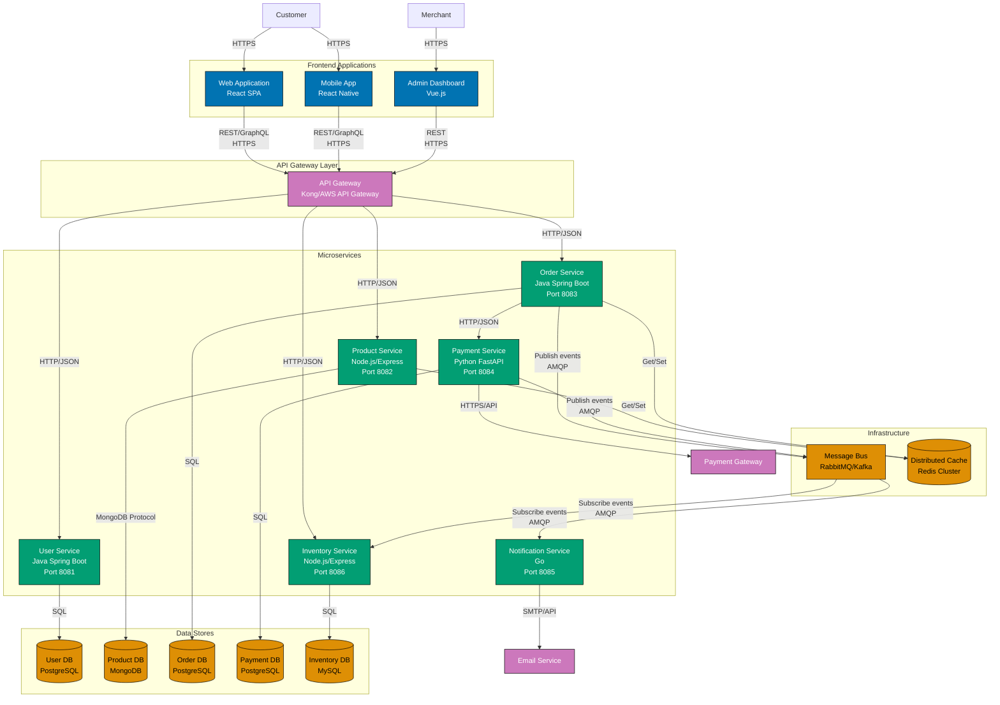

# Level 2: Container Diagram

## Overview

**Purpose**: Shows the high-level technical building blocks (containers) of the system.

**Audience**: Technical stakeholders - developers, architects, operations teams.

**Contains**:

- Containers (deployable/executable units)
- Technology choices for each container
- Communication patterns between containers
- External systems from context diagram

**Important**: In C4 terminology, "container" means a deployable/executable unit like:

- Web application
- Mobile app
- Desktop application
- Database
- File system
- Microservice

NOT Docker containers (though they often align).

**Key Questions Answered**:

- What are the major technical building blocks?
- How do they communicate?
- What technology stack is used?
- What can be deployed independently?

**Example Elements**:

- **Web Containers**: ose-platform-web (Hugo Static Site), ayokoding-web (Hugo Static Site), orca-grid-fe (Next.js)
- **Backend Containers**: orca-grid-be (Spring Boot)
- **CLI Tools**: ayokoding-cli (Go), butler-cli (Go)
- **Test Containers**: orca-grid-fe-e2e (Playwright), orca-grid-be-e2e (Playwright)
- **Infrastructure**: Nx Workspace, Shared Libraries

**Best Practices**:

- One container diagram per software system
- Show major technology choices
- Include all containers that run at runtime
- Clearly label communication protocols (HTTP, gRPC, message queues)
- Color-code containers by type (frontend, backend, database, etc.)

**When to Use**:

- Explaining the overall shape of the system
- Identifying deployment boundaries
- Planning infrastructure and DevOps
- Understanding technology stack decisions

**Example: E-Commerce Microservices Platform Containers**

**Diagram Explanation**:

- **Frontend Applications** (blue): Multiple client applications (web, mobile, admin) serving different user types
- **API Gateway** (purple): Single entry point for all client requests, handles routing, auth, rate limiting
- **Microservices** (teal): Six independently deployable services, each with specific business capability
  - **User Service**: Authentication, user profiles, account management
  - **Product Service**: Product catalog, search, recommendations
  - **Order Service**: Order processing, order lifecycle management
  - **Payment Service**: Payment processing, transaction management
  - **Notification Service**: Email/SMS notifications across all domains
  - **Inventory Service**: Stock management, inventory tracking
- **Databases** (coral): Each microservice owns its database (database-per-service pattern), using different technologies based on needs
- **Message Bus** (orange): Asynchronous communication between services via events
- **Distributed Cache** (orange): Shared Redis cluster for performance optimization
- **Technology Diversity**: Different languages/frameworks chosen per service needs (polyglot architecture)

This diagram reveals the microservices architecture inside the E-Commerce Platform. Key patterns visible:

1. **Database per Service**: Each service has its own database, ensuring loose coupling
2. **API Gateway Pattern**: Centralized entry point for client requests
3. **Event-Driven Communication**: Services communicate asynchronously via message bus
4. **Polyglot Persistence**: Different database technologies (PostgreSQL, MongoDB, MySQL) based on service needs
5. **Independent Deployment**: Each microservice can be deployed, scaled, and updated independently
