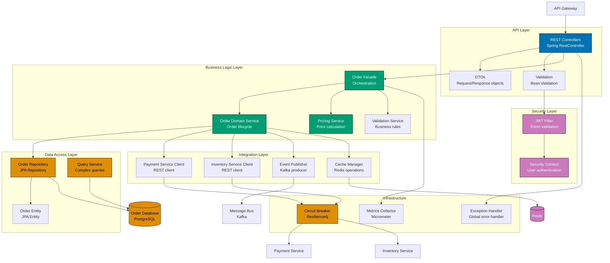

# Level 3: Component Diagram

## Overview

**Purpose**: Shows the internal structure of a single container by breaking it down into components.

**Audience**: Developers and architects working on specific containers.

**Contains**:

- Components (groupings of related functionality)
- Component responsibilities
- Relationships between components
- External dependencies (other containers, systems)

**Important**: A "component" is a grouping of related functionality behind a well-defined interface.

**In Object-Oriented Programming** (Java, C#, Python OOP):

- REST Controllers (API layer)
- Services (business logic)
- Repositories (data access)
- Authentication filters
- Event publishers
- Configuration managers

**In Functional Programming** (Elixir, Haskell, OCaml):

- Contexts (coarse-grained API boundaries)
- Routers and Controllers (HTTP request handling)
- Pure function modules (business logic)
- GenServers (stateful processes)
- Schemas and Changesets (data validation)
- Supervision trees (fault tolerance)

**Key Questions Answered**:

- How is this container structured internally?
- What are the major responsibilities?
- How do components interact?
- Where are the architectural boundaries?

**Example Elements** (from dolphin-be Spring Boot backend):

- **API Layer**: REST Controllers, API Documentation, Request Validation
- **Security Layer**: Authentication Filter, Authorization Service, Security Config
- **Business Logic Layer**: Business Services, Domain Models, Business Rules Engine
- **Data Access Layer**: Repositories, JPA Entities, Query Services
- **Integration Layer**: Event Publisher, External API Clients, Message Broker Client
- **Infrastructure**: Exception Handler, Logging Service, Configuration, Health Checks

**Best Practices**:

- Create one component diagram per container (not all containers need one)
- Only create for containers with significant internal complexity
- Group related functionality into cohesive components
- Show major dependencies between components
- Indicate technology choices for components

**When to Use**:

- Planning internal architecture of complex containers
- Explaining layered or modular architecture
- Identifying refactoring opportunities
- Onboarding developers to specific containers

**Example: Order Service Components (Java Spring Boot Microservice)**

**Diagram Explanation**:

- **API Layer** (blue): REST endpoints exposing order operations, DTOs for data transfer, validation
- **Security Layer** (purple): JWT-based authentication, security context management
- **Business Logic Layer** (teal): Core order processing logic
  - **Order Facade**: Orchestrates complex operations across multiple services
  - **Order Domain Service**: Manages order lifecycle (create, update, cancel, complete)
  - **Pricing Service**: Calculates order totals, discounts, taxes
  - **Validation Service**: Enforces business rules and constraints
- **Data Access Layer** (coral): JPA repositories, entity mappings, custom queries
- **Integration Layer**: External service clients and messaging
  - **Payment Service Client**: Synchronous REST calls to Payment Service
  - **Inventory Service Client**: Synchronous REST calls to Inventory Service
  - **Event Publisher**: Publishes domain events (OrderCreated, OrderCancelled) to Kafka
  - **Cache Manager**: Redis caching for performance
- **Infrastructure Layer** (orange): Cross-cutting concerns
  - **Exception Handler**: Centralized error handling and HTTP responses
  - **Circuit Breaker**: Fault tolerance for external service calls (Resilience4j)
  - **Metrics Collector**: Application metrics and observability (Micrometer)

This diagram shows the internal architecture of the Order Service microservice. Key patterns visible:

1. **Hexagonal Architecture**: Clear separation between domain logic and external concerns
2. **Service Clients**: HTTP clients for synchronous inter-service communication
3. **Event-Driven**: Publishes events to message bus for asynchronous communication
4. **Circuit Breaker**: Resilience pattern to handle failures in dependent services
5. **Caching**: Redis cache to reduce database load and improve response times
6. **Domain-Driven Design**: Facade and domain service separation for complex orchestration
