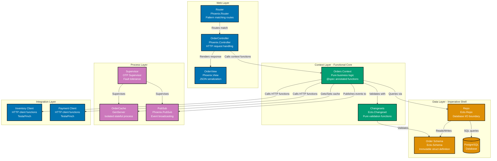

# Level 3: Component Diagram - Functional Programming

## Functional Programming Approach

The same Order Service implemented in a functional programming paradigm reveals different component boundaries and architectural patterns. While OOP organizes around classes and objects, FP organizes around modules, functions, and processes.

**Architectural Shift from OOP**:

- **Modules replace classes**: Groups of related pure functions, not stateful objects
- **Contexts replace services**: Coarse-grained API boundaries for business domains
- **GenServers for state**: When state is needed, isolate it in supervised processes (Actor model)
- **Supervision trees**: Fault-tolerant process hierarchies replace exception handlers
- **Pattern matching**: Route requests and handle results via pattern matching, not conditionals
- **Pipeline operator**: Data transformations flow through function pipelines (`|>`)
- **Immutable data**: All transformations create new values, no in-place mutation

**Example: Order Service Components (Elixir/Phoenix Application)**

**Diagram Explanation**:

**Web Layer (Blue)** - HTTP request/response handling:

- **Router**: Pattern matches incoming HTTP requests to controller actions (`/api/orders/:id`)
- **Controller**: Thin adapter that calls context functions, returns HTTP responses
- **View**: Pure functions that serialize Elixir data structures to JSON

**Context Layer (Teal)** - Functional Core (Pure Business Logic):

- **Orders Context**: Module with `@spec`-annotated pure functions (`create_order/1`, `validate_inventory/1`)
- **Changesets**: Pure validation functions that return `{:ok, valid_data}` or `{:error, changeset}`
- **No side effects**: All I/O delegated to data layer, returns result tuples

**Data Layer (Orange)** - Imperative Shell (I/O Boundary):

- **Order Schema**: Immutable struct definition with type specifications (not a class)
- **Repo**: Ecto repository for database queries (side effects isolated here)
- **PostgreSQL**: Data persistence layer

**Process Layer (Purple)** - Concurrent State Management:

- **OrderCache**: GenServer process with isolated mutable state (Actor model)
- **PubSub**: Event broadcasting system for domain events (`order_created`, `order_cancelled`)
- **Supervisor**: OTP supervisor monitors processes, restarts on failure (self-healing)

**Integration Layer (Blue)** - External Services:

- **HTTP Clients**: Pure functions that make HTTP requests (side effects at boundary)
- **Tesla/Finch**: HTTP client libraries for service-to-service communication

**Functional Programming Patterns Visible**:

1. **Functional Core, Imperative Shell**: Business logic in Contexts (pure), I/O in Repo/Clients (impure)
2. **Pattern Matching**: Router matches paths, contexts match result tuples (`{:ok, _}` / `{:error, _}`)
3. **Immutable Data Structures**: All data transformations create new values, original unchanged
4. **Process Isolation**: GenServer isolates stateful cache behind message-passing API
5. **Supervision Trees**: Supervisor monitors child processes, provides fault tolerance
6. **Pipeline Operator**: Data flows through function chains (`order |> validate() |> save()`)
7. **Explicit Dependencies**: All inputs as function arguments, no hidden global state

**OOP vs FP Component Organization**:

| Aspect                   | OOP (Spring Boot)            | FP (Elixir/Phoenix)                        |
| ------------------------ | ---------------------------- | ------------------------------------------ |
| **Primary Abstraction**  | Classes (stateful objects)   | Modules (pure functions)                   |
| **Business Logic**       | Service classes with methods | Context modules with `@spec` functions     |
| **State Management**     | Instance variables           | GenServer processes (isolated)             |
| **Data Validation**      | Bean Validation annotations  | Ecto.Changeset pure functions              |
| **Database Access**      | JPA Repositories (ORM)       | Ecto.Repo (data mapper)                    |
| **Error Handling**       | Try/catch exceptions         | Result tuples (`{:ok, _}` / `{:error, _}`) |
| **Dependency Injection** | Spring @Autowired            | Explicit function parameters               |
| **Concurrency**          | Thread pools, synchronized   | Processes, message passing                 |
| **Fault Tolerance**      | Circuit breakers, retries    | OTP Supervision trees (self-healing)       |
| **Event Publishing**     | @EventListener annotations   | PubSub broadcast functions                 |
| **HTTP Clients**         | RestTemplate/WebClient       | Tesla/Finch pure functions                 |

**When to Use Each Approach**:

**Choose FP (Elixir/Phoenix) when**:

- Concurrency and fault tolerance are critical (real-time systems, high-traffic APIs)
- Business logic complexity benefits from pure functions and pattern matching
- Team prefers immutability and explicit state management
- Need self-healing systems (OTP supervision automatically restarts failed processes)

**Choose OOP (Spring Boot) when**:

- Team expertise is primarily in object-oriented languages (Java ecosystem)
- Need tight integration with enterprise Java systems (existing services, libraries)
- Domain model complexity benefits from encapsulation and inheritance
- Spring ecosystem provides required integrations (Spring Security, Spring Cloud)

**Key Insight**: Both approaches implement the same Component-level architecture (separation of concerns, layered design, external service integration). The paradigm affects HOW components are implemented (classes vs modules), not WHAT components exist.

## Related Principles

- **[Explicit Over Implicit](../../../../../governance/principles/software-engineering/explicit-over-implicit.md)** - Component diagrams make functional modules and data flow explicit
- **[Pure Functions Over Side Effects](../../../../../governance/principles/software-engineering/pure-functions.md)** - FP components separate pure domain logic from impure I/O

See [C4 Model Best Practices](./ex-so-ar-c4armo__14-best-practices.md) and [DDD Functional Programming](../domain-driven-design-ddd/ex-so-ar-dodrdedd__14-ddd-and-functional-programming.md).
