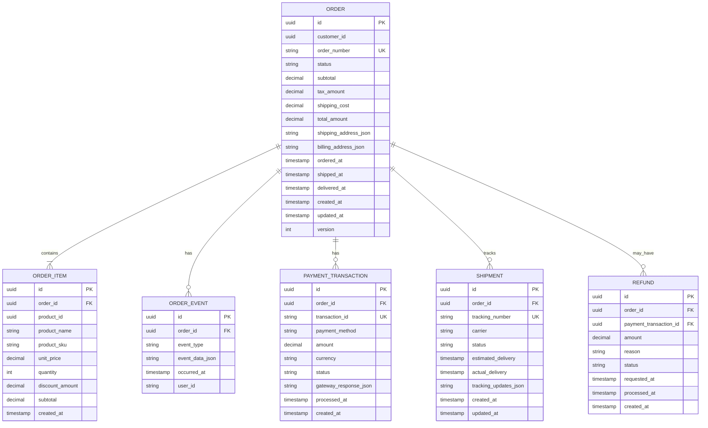
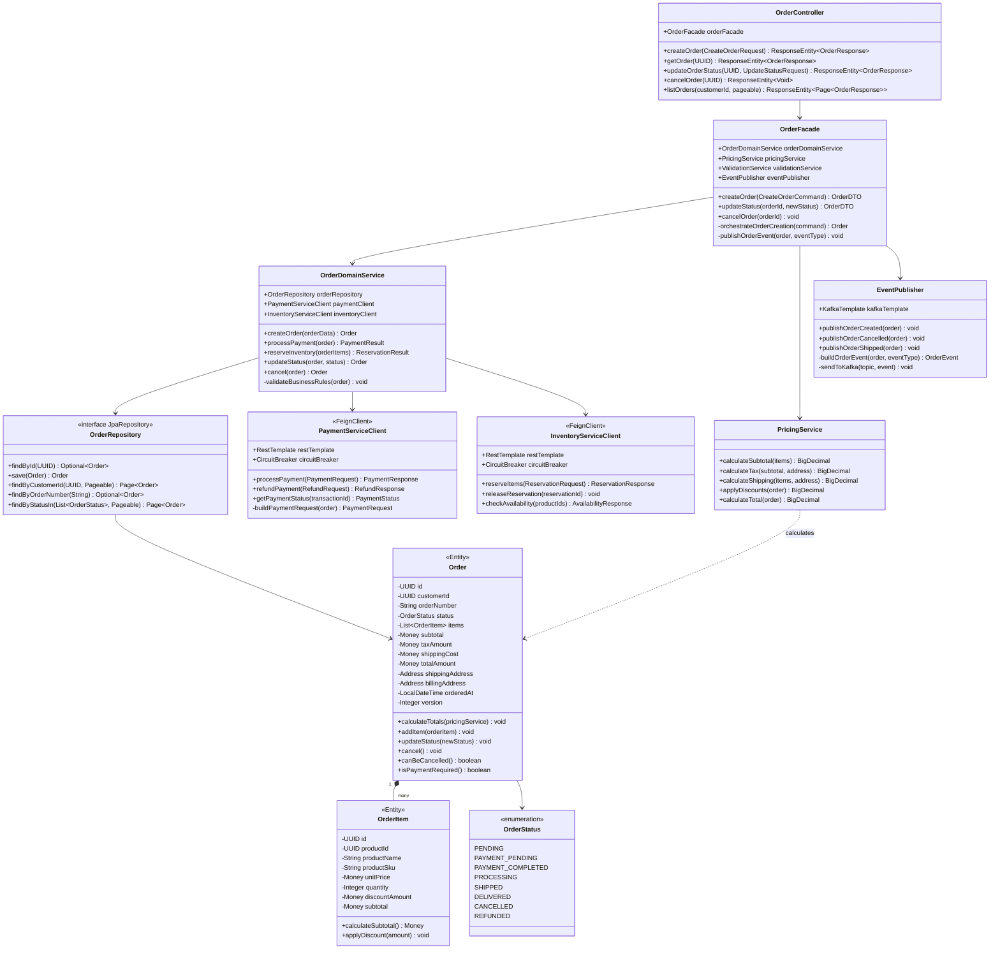

# Level 4: Code Diagram

## Overview

**Purpose**: Provides implementation-level details that can be mapped directly to code.

**Audience**: Developers implementing or maintaining specific components.

**Contains**:

**For Object-Oriented Code**:

- Classes, interfaces, and their relationships (UML class diagrams)
- Inheritance hierarchies and design patterns
- Method signatures and access modifiers

**For Functional Code**:

- Function signatures with type specifications (`@spec`, type annotations)
- Data structures (immutable structs, algebraic data types)
- Pattern matching clauses and function pipelines
- Pure vs impure function boundaries

**Universal**:

- Database schemas (entity-relationship diagrams)
- Implementation-level design patterns
- Detailed component internals

**Important**: C4 model doesn't prescribe specific notation for this level. Use existing standards appropriate to your paradigm:

- **UML Class Diagrams**: For object-oriented code structure
- **Function Signature Diagrams**: For functional code with type specifications
- **Entity-Relationship Diagrams**: For database schemas (paradigm-agnostic)
- **Sequence Diagrams**: For runtime behavior (paradigm-agnostic)

**Key Questions Answered**:

- How is this component implemented?
- What are the class structures?
- What is the database schema?
- What design patterns are used?

**Example Elements**:

- **UML Class Diagrams**: UserController, UserService, UserRepository, User entity, Role entity
- **Database ER Diagrams**: USER table, ROLE table, USER_ROLE junction table, AUDIT_LOG table
- **Package Structures**: Go package hierarchy for ayokoding-cli

**Best Practices**:

- Only create for critical or complex components
- Use automated diagram generation where possible (IDE tools)
- Keep diagrams focused on specific areas
- Consider whether code itself is better documentation
- Update diagrams when code changes significantly

**When to Use**:

- Documenting complex algorithms or patterns
- Explaining database schema design
- Onboarding to legacy codebases
- Capturing critical design decisions

**When NOT to Use**:

- For simple, self-documenting code
- When IDE-generated diagrams suffice
- For rapidly changing code (diagrams become stale)

**Example 1: Order Service Database Schema (Entity-Relationship Diagram)**

**Example 2: Class Diagram (Order Service Domain Model & Controllers)**

**Diagram Explanations**:

**Entity-Relationship Diagram** (Order Service Database):

- Shows the complete database schema owned by Order Service microservice
- **Key Tables**:
  - **ORDER**: Core order aggregate with status tracking, pricing, addresses (JSON), timestamps
  - **ORDER_ITEM**: Line items within order with product snapshots (name, SKU, price at time of order)
  - **ORDER_EVENT**: Event sourcing table tracking all state changes for audit trail
  - **PAYMENT_TRANSACTION**: Payment records linked to orders
  - **SHIPMENT**: Shipping tracking information per order
  - **REFUND**: Refund requests and processing status
- **Microservices Pattern**: Order Service owns this entire schema (database-per-service)
- **Denormalization**: Product details copied into ORDER_ITEM (not foreign key to Product table in another service)
- **Version Field**: Optimistic locking for concurrent updates (`version` column in ORDER table)
- **JSON Columns**: Flexible storage for addresses and complex data without rigid schema
- **Audit Trail**: ORDER_EVENT table captures complete order history

**UML Class Diagram** (Order Service Java Classes):

- Shows Spring Boot implementation architecture
- **API Layer**:
  - **OrderController**: REST endpoints (`@RestController`) handling HTTP requests
- **Orchestration Layer**:
  - **OrderFacade**: Orchestrates complex multi-step operations across services
- **Domain Layer**:
  - **OrderDomainService**: Core business logic for order lifecycle
  - **PricingService**: Handles all pricing calculations (tax, shipping, discounts)
  - **Order Entity**: Rich domain model with business methods (`@Entity`)
  - **OrderItem**: Value object within Order aggregate
  - **OrderStatus**: Enumeration with expanded states for microservices workflow
- **Data Access**:
  - **OrderRepository**: Spring Data JPA repository interface
- **Integration**:
  - **PaymentServiceClient**: Feign client calling Payment Service via REST
  - **InventoryServiceClient**: Feign client calling Inventory Service via REST
  - **EventPublisher**: Kafka producer publishing domain events
- **Resilience**:
  - **CircuitBreaker**: Resilience4j pattern protecting external calls

**Microservices Patterns Visible**:

1. **Service Clients with Circuit Breaker**: Resilient inter-service communication
2. **Event Publishing**: Domain events published to Kafka for async processing
3. **Facade Pattern**: Complex orchestration separated from domain logic
4. **Rich Domain Model**: Order entity with business methods, not anemic data holder
5. **Optimistic Locking**: Version field in Order entity for concurrency control

These code-level diagrams guide developers implementing the Order Service microservice. The ER diagram shows database-per-service isolation, while the class diagram reveals layered architecture with resilience patterns for distributed systems.

## Related Principles

- **[Explicit Over Implicit](../../../../../governance/principles/software-engineering/explicit-over-implicit.md)** - Code diagrams make class relationships and dependencies explicit
- **[Simplicity Over Complexity](../../../../../governance/principles/general/simplicity-over-complexity.md)** - Use sparingly, only for critical or complex code requiring detailed documentation

See [C4 Model Best Practices](./ex-so-ar-c4armo__14-best-practices.md) for when to create code-level diagrams.
