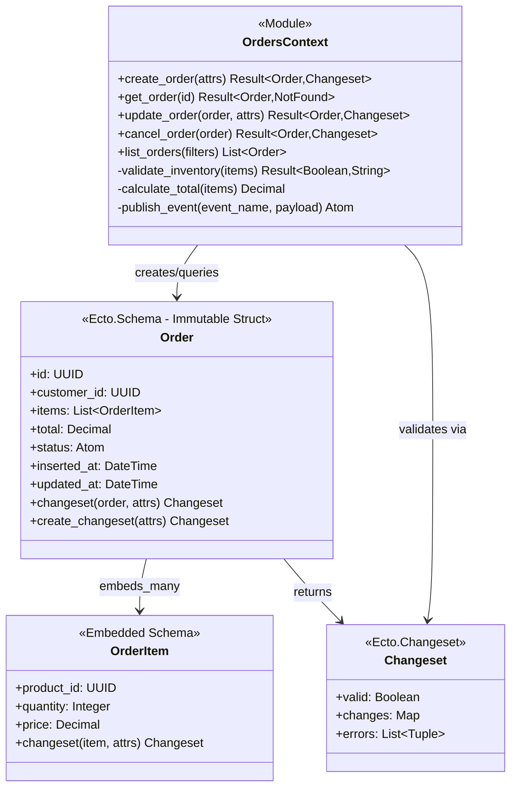
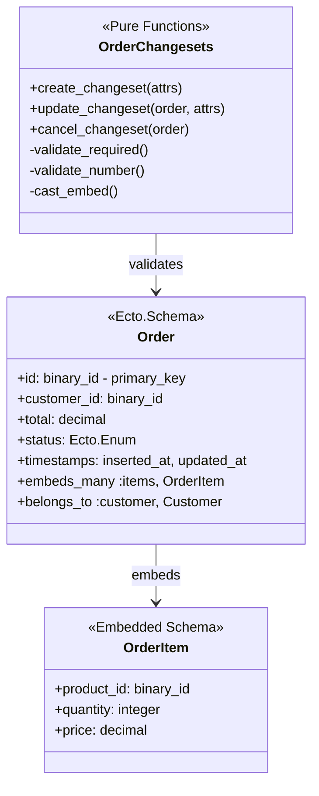
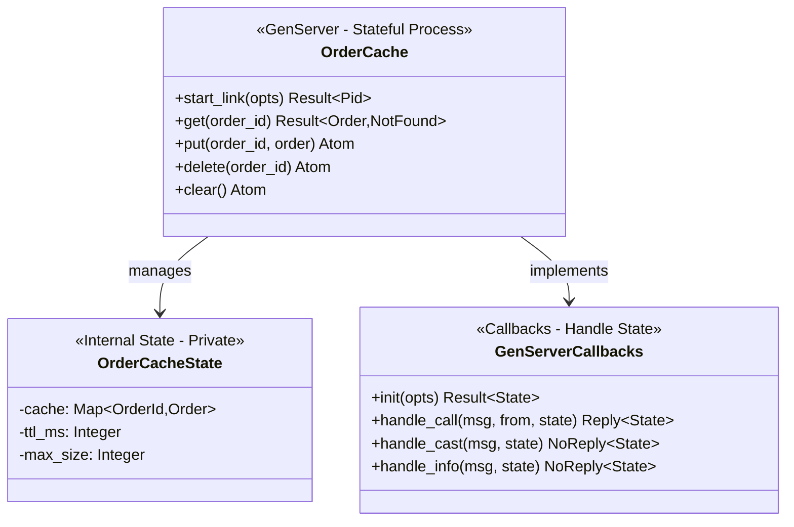

# Level 4: Code Diagram - Functional Programming

## Functional Programming Approach

In functional programming, code-level diagrams focus on function signatures, data transformations, and the boundaries between pure and impure code. Rather than classes and inheritance, FP code diagrams show modules with type specifications, data structures with immutable fields, and isolated processes for stateful operations.

**Key Differences from OOP Code Diagrams**:

- **Function signatures** replace method signatures (standalone functions, not methods on objects)
- **Type specifications** (`@spec`) provide contracts without inheritance hierarchies
- **Immutable structs** replace mutable class instances
- **Pattern matching** on function clauses replaces polymorphism
- **Result tuples** (`{:ok, value}` / `{:error, reason}`) replace exceptions
- **GenServer callbacks** for stateful processes (isolated, supervised)

**Example 3a: Orders Context Module (Pure Business Logic)**



**Notation Note**: The diagram uses generic type syntax (`Result~Order,Changeset~`, `List~Order~`) for Mermaid compatibility. In actual Elixir code, `Result~Order,Changeset~` represents the tuple types `{:ok, Order.t()} | {:error, Ecto.Changeset.t()}`, and `List~Order~` represents `[Order.t()]`.

**Elixir Code Example**:

```elixir
defmodule MyApp.Orders do
  @moduledoc """
  Context for Order domain - Pure business logic.
  All functions are pure (no side effects) or clearly marked as impure.
  """

  alias MyApp.Orders.Order
  alias MyApp.Repo

  @doc """
  Creates an order with inventory validation.
  Returns {:ok, order} if successful, {:error, changeset} if validation fails.
  """
  @spec create_order(map()) :: {:ok, Order.t()} | {:error, Ecto.Changeset.t()}
  def create_order(attrs) do
    with {:ok, _} <- validate_inventory(attrs["items"]),
         changeset <- Order.create_changeset(attrs),
         {:ok, order} <- Repo.insert(changeset) do
      publish_event(:order_created, order)
      {:ok, order}
    else
      {:error, reason} -> {:error, reason}
    end
  end

  @doc """
  Pure function: Validates inventory availability.
  """
  @spec validate_inventory(list(map())) :: {:ok, boolean()} | {:error, String.t()}
  defp validate_inventory(items) do
    # Pure validation logic - could be extracted and tested independently
    if Enum.all?(items, &valid_quantity?/1) do
      {:ok, true}
    else
      {:error, "Insufficient inventory"}
    end
  end

  @doc """
  Pure function: Calculates order total from items.
  """
  @spec calculate_total(list(OrderItem.t())) :: Decimal.t()
  defp calculate_total(items) do
    items
    |> Enum.map(&Decimal.mult(&1.price, &1.quantity))
    |> Enum.reduce(Decimal.new(0), &Decimal.add/2)
  end
end
```

**Pattern Matching for Error Handling**:

The `with` statement chains operations, short-circuiting on errors. Each step returns `{:ok, value}` or `{:error, reason}`. This is "railway-oriented programming" - success path continues, error path exits early.

**Example 3b: Ecto Schema (Immutable Data Structure)**



**Elixir Schema and Changeset Example**:

```elixir
defmodule MyApp.Orders.Order do
  use Ecto.Schema
  import Ecto.Changeset

  @type t :: %__MODULE__{
    id: Ecto.UUID.t(),
    customer_id: Ecto.UUID.t(),
    total: Decimal.t(),
    status: :pending | :confirmed | :cancelled,
    items: [OrderItem.t()],
    inserted_at: DateTime.t(),
    updated_at: DateTime.t()
  }

  @primary_key {:id, :binary_id, autogenerate: true}
  schema "orders" do
    field :customer_id, :binary_id
    field :total, :decimal
    field :status, Ecto.Enum, values: [:pending, :confirmed, :cancelled]

    embeds_many :items, OrderItem do
      field :product_id, :binary_id
      field :quantity, :integer
      field :price, :decimal
    end

    timestamps()
  end

  @doc """
  Pure validation function: Creates changeset for new order.
  """
  def create_changeset(attrs) do
    %__MODULE__{}
    |> cast(attrs, [:customer_id, :total, :status])
    |> cast_embed(:items, with: &OrderItem.changeset/2)
    |> validate_required([:customer_id, :status])
    |> validate_number(:total, greater_than: 0)
  end

  @doc """
  Pure validation function: Updates existing order.
  """
  def update_changeset(order, attrs) do
    order
    |> cast(attrs, [:status, :total])
    |> validate_inclusion(:status, [:pending, :confirmed, :cancelled])
  end
end
```

**Key FP Patterns**:

- **Immutable struct**: All fields `readonly` by default, changes create new struct
- **Pipeline transformations**: `changeset |> cast(...) |> validate_required(...)`
- **Pure validation**: Changesets are pure functions, no database queries inside
- **Type specifications**: `@type t` defines struct shape for compiler checks

**Example 3c: GenServer for Stateful Cache (When FP Needs State)**



**GenServer Implementation (Isolated State Management)**:

```elixir
defmodule MyApp.Orders.OrderCache do
  @moduledoc """
  GenServer for caching orders in memory.
  State is isolated within this process - accessed only via message passing.
  """
  use GenServer

  # Client API (Pure Functions - No State)

  def start_link(opts) do
    GenServer.start_link(__MODULE__, opts, name: __MODULE__)
  end

  @spec get(Ecto.UUID.t()) :: {:ok, Order.t()} | {:error, :not_found}
  def get(order_id) do
    GenServer.call(__MODULE__, {:get, order_id})
  end

  @spec put(Ecto.UUID.t(), Order.t()) :: :ok
  def put(order_id, order) do
    GenServer.cast(__MODULE__, {:put, order_id, order})
  end

  # Server Callbacks (State Management - Private)

  @impl true
  def init(_opts) do
    {:ok, %{cache: %{}, max_size: 1000}}
  end

  @impl true
  def handle_call({:get, order_id}, _from, state) do
    case Map.get(state.cache, order_id) do
      nil -> {:reply, {:error, :not_found}, state}
      order -> {:reply, {:ok, order}, state}
    end
  end

  @impl true
  def handle_cast({:put, order_id, order}, state) do
    new_cache = Map.put(state.cache, order_id, order)
    {:noreply, %{state | cache: new_cache}}
  end
end
```

**Actor Model Pattern**:

- **Client API**: Pure functions that send messages to process
- **Server Callbacks**: Handle messages, update state, return new state
- **Isolation**: State never exposed directly, only via message passing
- **Supervision**: If process crashes, supervisor restarts it with fresh state

**OOP vs FP Code Organization**:

| Aspect               | OOP (Java Classes)       | FP (Elixir Modules/Schemas)              |
| -------------------- | ------------------------ | ---------------------------------------- |
| **Primary Unit**     | Class with methods       | Module with functions                    |
| **Type System**      | Interfaces, inheritance  | `@spec` + `@type`, no inheritance        |
| **Data Structures**  | Mutable objects          | Immutable structs                        |
| **Validation**       | Annotations + exceptions | Changeset functions + result tuples      |
| **State Management** | Instance variables       | GenServer processes (isolated)           |
| **Error Handling**   | Try/catch exceptions     | Pattern match `{:ok, _}` / `{:error, _}` |
| **Polymorphism**     | Interfaces + inheritance | Pattern matching + protocols             |
| **Dependencies**     | Constructor injection    | Explicit function parameters             |
| **Composition**      | Inheritance + delegation | Function pipelines (`\|>`)               |

**Diagram Color Legend**:

- **Blue (#0173B2)**: Public API functions, client-facing interfaces
- **Teal (#029E73)**: Pure business logic, validation functions
- **Orange (#DE8F05)**: Data structures, schemas, types
- **Purple (#CC78BC)**: Stateful processes (GenServers), isolated state

**When to Create FP Code Diagrams**:

**Create diagrams when**:

- Complex function composition requires visualization (multi-step pipelines)
- GenServer state management needs documentation (what state, what messages)
- Pattern matching logic is non-obvious (multiple clauses, guard conditions)
- Team is new to FP and needs guidance on pure/impure boundaries

**Skip diagrams when**:

- Function signatures and `@spec` annotations are self-documenting
- Schema definitions are straightforward (simple field lists)
- Code is better documentation than diagrams (for simple modules)

**Key Insight**: FP code diagrams emphasize **data flow and transformations** rather than object hierarchies. The goal is showing how data moves through pure functions (functional core) and where side effects occur (imperative shell), not inheritance trees.

## Related Principles

- **[Pure Functions Over Side Effects](../../../../../governance/principles/software-engineering/pure-functions.md)** - FP code diagrams emphasize pure functions and data flow
- **[Immutability Over Mutability](../../../../../governance/principles/software-engineering/immutability.md)** - FP code structures use immutable data transformations

See [C4 Model Best Practices](./ex-so-ar-c4armo__14-best-practices.md) and [DDD Functional Programming](../domain-driven-design-ddd/ex-so-ar-dodrdedd__14-ddd-and-functional-programming.md).
