# Best Practices and Guidance

Comprehensive guide on when to use the C4 model, comparisons with other approaches, and common pitfalls to avoid.

## Core Principles

C4 model selection and tooling decisions embody core software engineering principles:

- **[Explicit Over Implicit](../../../../../governance/principles/software-engineering/explicit-over-implicit.md)** - C4 provides explicit guidance on when it fits vs when alternative approaches are more appropriate. This document makes those tradeoffs transparent rather than leaving teams to discover limitations through trial and error.

- **[Simplicity Over Complexity](../../../../../governance/principles/general/simplicity-over-complexity.md)** - C4's core value proposition is simplicity over heavyweight alternatives like UML or ArchiMate. The "When to Use C4" guidance helps teams choose the right level of complexity for their context.

- **[Automation Over Manual](../../../../../governance/principles/software-engineering/automation-over-manual.md)** - The tooling philosophy section emphasizes diagram-as-code approaches (Mermaid, Structurizr, PlantUML) that enable version control, CI/CD integration, and automated diagram generation rather than manual drawing tools.

- **[Reproducibility First](../../../../../governance/principles/software-engineering/reproducibility.md)** - Text-based diagram definitions ensure architecture documentation can be reproduced consistently across teams, tools, and time. Standard Mermaid syntax choice prioritizes long-term stability over experimental features.

## When to Use the C4 Model

### Ideal Use Cases

**Custom-Built Software Systems**:

The C4 model works best for:

- Custom applications developed in-house
- Microservices architectures
- Web applications and APIs
- Mobile applications
- Cloud-native systems
- Monorepo architectures (like Nx workspaces)

**Team Contexts**:

Particularly valuable when:

- Teams find UML/ArchiMate too complex or heavyweight
- You need architecture documentation that developers will actually maintain
- Multiple audiences need different levels of detail
- Agile/continuous delivery workflows require lightweight documentation
- New team members need onboarding materials

This context directly implements **[Simplicity Over Complexity](../../../../../governance/principles/general/simplicity-over-complexity.md)**. C4's core value is rejecting heavyweight modeling approaches in favor of simple boxes and lines that developers will actually create and maintain. When teams find UML overwhelming, C4 provides the minimum viable architecture documentation approach.

### When C4 May Not Fit

**Not Universally Applicable**:

The C4 model is designed for custom-built software systems. It has significant limitations for certain system types and contexts where different approaches are more appropriate.

**System Types Where C4 Struggles**:

**Embedded Systems and Firmware**:

C4 focuses on software architecture, but embedded systems require modeling hardware-software interactions, timing constraints, memory layouts, and real-time behavior. For these systems:

- Use hardware description languages (HDLs) for hardware components
- Use timing diagrams for real-time constraints
- Use memory maps for resource allocation
- Consider UML deployment diagrams with hardware nodes
- C4 can document the software layers (e.g., RTOS, drivers, application) but misses critical hardware integration

**Heavily Customized Enterprise Platforms**:

SAP, Salesforce, Oracle E-Business Suite, and similar platforms with extensive customization present challenges:

- **Problem**: C4 shows custom software systems. When 90% is platform-provided and 10% is customization, C4 becomes awkward
- **Alternative**: Document customizations separately (custom objects, workflows, integrations) rather than trying to model the entire platform
- **When C4 works**: If you build custom applications that integrate with these platforms (show platform as external system)
- **When C4 doesn't work**: If you're configuring the platform without writing custom code

**Infrastructure-as-Code Only**:

Systems defined purely through infrastructure configuration (Terraform, CloudFormation) without custom application code:

- C4 models software systems, not infrastructure topology
- Use cloud provider architecture diagrams instead
- If you do have custom software deployed on this infrastructure, C4 applies to the software, not the IaC definitions

**Libraries, Frameworks, and SDKs**:

C4 is for software **systems** (deployed, running applications), not software **libraries**:

- **Don't use C4 for**: Documenting a React component library, npm package, or Python SDK
- **Reason**: Libraries don't "run" - they're consumed by systems
- **Alternative**: Use package diagrams, API documentation, or design pattern documentation
- **Exception**: If your library requires a server component or CLI tool, C4 can document those deployable parts

**Pure Data Pipelines**:

ETL/ELT pipelines that only transform and move data without business logic:

- C4 can show pipeline architecture (containers for ingestion, transformation, storage)
- But data flow diagrams or DAG visualizations (Apache Airflow, dbt) may be more appropriate
- Consider C4 when pipelines include significant custom logic or microservices

**System Type Suitability Table**:

| System Type                            | C4 Suitability | Reason                                                   | Better Alternative                                   |
| -------------------------------------- | -------------- | -------------------------------------------------------- | ---------------------------------------------------- |
| **Custom Web Application**             | Excellent      | Core use case - custom software with clear boundaries    | N/A                                                  |
| **Microservices Architecture**         | Excellent      | Multiple deployable units, clear container boundaries    | N/A                                                  |
| **Mobile + Backend System**            | Excellent      | Multiple containers (mobile app, backend API, database)  | N/A                                                  |
| **Embedded System with Firmware**      | Poor           | Hardware-software integration, timing constraints        | Hardware diagrams, timing diagrams                   |
| **SAP with Heavy Customization**       | Poor           | Platform-provided functionality dominates                | SAP-specific modeling, integration diagrams          |
| **Salesforce with Apex Code**          | Fair           | Can model custom Apex services, but feels awkward        | Salesforce architecture diagrams                     |
| **Infrastructure-as-Code (Terraform)** | Poor           | Infrastructure configuration, not running software       | Cloud provider diagrams                              |
| **React Component Library**            | Poor           | Not a deployed system, consumed by applications          | API documentation, Storybook                         |
| **ETL Data Pipeline**                  | Fair           | Can show pipeline containers, but data flow matters more | Data flow diagrams, DAG visualization                |
| **Serverless Functions (AWS Lambda)**  | Good           | Each function is a container, clear boundaries           | Consider simpler function diagrams for small systems |
| **Monolithic Desktop Application**     | Good           | Single container with components, clear structure        | N/A                                                  |
| **IoT System (Edge + Cloud)**          | Good           | Show edge devices, gateway, cloud backend separately     | N/A                                                  |

**Supplementary Diagrams Needed**:

C4 focuses on **static structure**. You'll need other diagram types for:

- **Business Processes**: Use BPMN (Business Process Model and Notation)
- **State Machines**: Use UML state diagrams
- **Data Models**: Use Entity-Relationship Diagrams
- **Data Flow**: Use data flow diagrams (DFD)
- **Network Topology**: Use infrastructure diagrams
- **Sequence of Operations**: Use C4 dynamic diagrams or UML sequence diagrams

**Scaling Considerations**:

For very large systems with high complexity:

- **Don't create monolithic diagrams**: Single diagrams with hundreds of elements become unreadable
- **Split by bounded context**: Create separate C4 diagram sets for each business domain (e.g., Order Management, User Management, Payments)
- **Use system landscape diagrams**: Organizational overview showing how multiple systems relate
- **Focus on integration points**: For large microservices architectures, document key integration patterns rather than every service
- **Selective component diagrams**: Only create component diagrams for complex or critical containers

**When to Question C4 Usage**:

- If your "container diagram" has 50+ containers, consider splitting by domain
- If you're spending more time maintaining diagrams than code, simplify
- If stakeholders don't understand the diagrams, you may be over-documenting
- If the system is simple (3-4 components), C4 may be overkill - a single diagram might suffice

## Comparison to Other Approaches

This comparison section demonstrates **[Explicit Over Implicit](../../../../../governance/principles/software-engineering/explicit-over-implicit.md)** by making architectural modeling tradeoffs explicit. Rather than assuming one approach fits all contexts, we transparently compare C4 against alternatives so teams can make informed decisions about their documentation strategy.

### C4 vs. UML (Unified Modeling Language)

**UML**:

- **Pros**: Comprehensive, standardized, supports many diagram types
- **Cons**: Complex, steep learning curve, can be overwhelming for teams

**C4**:

- **Pros**: Simple, developer-friendly, easier to learn and maintain
- **Cons**: Less comprehensive, focuses only on structure (not behavior extensively)

**Relationship**:

C4 is a **simplified version** of UML concepts:

- C4 component diagrams ≈ UML component diagrams (but simpler)
- C4 code diagrams often use UML class diagrams
- C4 dynamic diagrams ≈ UML sequence diagrams

**When to Choose**:

- **Use UML** if your team already successfully uses it and has expertise
- **Use C4** if UML feels too heavyweight or incompatible with your agile workflow
- **Use Both** - C4 for high-level architecture, UML for detailed design

### C4 vs. arc42

**arc42**:

- Template-based architecture documentation framework
- Comprehensive sections for all architecture concerns
- More than just diagrams - includes decisions, quality requirements, etc.

**C4**:

- Focused specifically on architecture visualization
- Hierarchical diagram approach
- Less prescriptive about documentation structure

**Relationship**:

C4 and arc42 **complement each other**:

- **C4 System Context** → arc42 "Context and Scope"
- **C4 Container Diagram** → arc42 "Building Block View (Level 1)"
- **C4 Component Diagram** → arc42 "Building Block View (Level 2)"
- **C4 Code Diagram** → arc42 "Building Block View (Level 3)"

**When to Choose**:

- **Use arc42** for comprehensive architecture documentation framework
- **Use C4** for architecture visualization specifically
- **Use Both** - C4 diagrams within arc42 structure

### C4 vs. 4+1 View Model

**4+1 View Model**:

- Five views: Logical, Development, Process, Physical, and Scenarios (+1)
- Academic and comprehensive
- Separates concerns across multiple views

**C4**:

- Four hierarchical levels of the same system
- Single progression from context to code
- Simpler and more pragmatic

**Relationship**:

C4 evolved from 4+1 but deliberately simplifies:

- C4 focuses on hierarchical zoom levels
- 4+1 separates different architectural perspectives
- C4 prioritizes ease of use over comprehensive coverage

## Best Practices

### Creating Effective C4 Diagrams

**Start High, Drill Down**:

1. Always begin with System Context diagram
2. Create Container diagram for overall architecture
3. Only create Component diagrams where complexity justifies it
4. Reserve Code diagrams for truly complex components

**You Don't Need All Four Levels**:

Most teams find **Context + Container diagrams sufficient** for documentation needs. Component and Code diagrams add value only for:

- Complex containers with significant internal structure
- Areas requiring detailed documentation
- Legacy code needing explanation
- Onboarding-critical components

**Focus on Value**:

Ask: "Does this diagram help someone understand the system better?"

If not, skip it. Over-documentation wastes time and becomes outdated quickly.

### Diagram Quality Guidelines

**Keep Diagrams Focused**:

- **Small Systems**: 1 context diagram, 1 container diagram
- **Medium Systems**: 1 context, 1 container, 2-3 component diagrams
- **Large Systems**: 1 landscape, multiple context diagrams (per bounded context), focused container/component diagrams

**Avoid Clutter**:

- Don't show hundreds of elements in one diagram
- Split large systems into multiple focused diagrams
- Group related containers into subgraphs
- Show only relevant relationships (not every possible connection)

**Use Consistent Notation**:

- Establish team conventions for shapes and colors
- Document your notation choices in diagram keys
- Apply same style across all diagrams
- Update diagrams when notation changes

**Keep Diagrams Updated**:

- Review during architecture changes
- Update as part of feature development
- Automate diagram generation where possible
- Don't create diagrams you won't maintain

### Team Collaboration

**Shared Ownership**:

- Don't assume architects create container diagrams and developers create code diagrams
- Encourage team collaboration on all levels
- Use diagrams as communication tools, not deliverables
- Iterate and refine diagrams together

**Tool Selection**:

- Choose tools that team actually uses (not perfect tools they ignore)
- Prefer tools that integrate with version control
- Consider diagram-as-code approaches (Mermaid, PlantUML, Structurizr DSL)
- Balance power with ease of use

**Documentation Culture**:

- Make architecture documentation part of definition of done
- Review diagrams during code reviews
- Use diagrams in team meetings and presentations
- Celebrate good documentation examples

### Tooling Philosophy: Modeling vs. Diagramming

Understanding the distinction between **modeling tools** and **diagramming tools** helps you choose the right approach for C4 diagrams.

**Modeling Tools** (model-first approach):

- **Concept**: Create a model (data structure), generate diagrams from model
- **Example**: Structurizr (official C4 tool), Enterprise Architect with C4 plugin
- **Workflow**: Define systems, containers, components, and relationships in code or UI → tool renders diagrams automatically
- **Advantages**:
  - Single source of truth (model)
  - Multiple views generated from same model
  - Consistency enforced automatically
  - Easier to keep synchronized across diagrams
- **Disadvantages**:
  - Steeper learning curve (learn modeling DSL or API)
  - Less visual freedom (layout controlled by tool)
  - Tool lock-in (model format specific to tool)

**Diagramming Tools** (diagram-first approach):

- **Concept**: Manually draw diagrams using shapes and connectors
- **Examples**: draw.io, Mermaid, PlantUML, Lucidchart, Excalidraw
- **Workflow**: Drag boxes, draw arrows, add labels → create diagram directly
- **Advantages**:
  - Easy to learn (visual interface or simple syntax)
  - Full control over layout and appearance
  - Wide tool choice, no lock-in
  - Familiar to most developers
- **Disadvantages**:
  - No single source of truth (each diagram independent)
  - Manual synchronization across diagrams
  - Inconsistencies possible (same element different names)
  - More maintenance burden

**Structurizr: Official C4 Modeling Tool**:

Structurizr was created by Simon Brown (C4 model creator) specifically for C4 diagrams:

- **Structurizr DSL**: Text-based language for defining architecture models
- **Structurizr Lite**: Free, open-source, self-hosted version
- **Structurizr Cloud**: Commercial SaaS offering with collaboration features
- **Benefits**:
  - Purpose-built for C4 model
  - Automatic layout with manual override
  - Multiple diagram types from single model
  - Version control friendly (DSL is text)
- **When to use**: Teams serious about architecture documentation, willing to invest in learning DSL

**Tool Comparison Table (2026 Recommendations)**:

| Tool            | Type        | Cost                       | C4 Support                 | Learning Curve | Version Control   | Team Collaboration           | Best For                                    |
| --------------- | ----------- | -------------------------- | -------------------------- | -------------- | ----------------- | ---------------------------- | ------------------------------------------- |
| **Structurizr** | Modeling    | Free (Lite) / Paid (Cloud) | Native (official)          | Medium-High    | Excellent (DSL)   | Good (Cloud)                 | Serious C4 practitioners, large teams       |
| **Mermaid**     | Diagramming | Free                       | Good (experimental)        | Low-Medium     | Excellent (text)  | Good (GitHub/Markdown)       | Documentation-as-code, open source projects |
| **PlantUML**    | Diagramming | Free                       | Good (C4-PlantUML library) | Medium         | Excellent (text)  | Good (any text editor)       | Java teams, enterprise developers           |
| **draw.io**     | Diagramming | Free                       | Fair (C4 stencils)         | Low            | Fair (XML format) | Good (desktop/web)           | Quick ad-hoc diagrams, non-technical teams  |
| **Lucidchart**  | Diagramming | Paid                       | Fair (templates)           | Low            | Fair              | Excellent (real-time collab) | Distributed teams, non-developers           |
| **Excalidraw**  | Diagramming | Free                       | Fair (manual)              | Very Low       | Good (JSON)       | Good (shareable links)       | Lightweight whiteboarding, sketches         |

**Diagram-as-Code: 2026 Best Practices**:

Modern teams prefer text-based diagram tools that integrate with version control:

**Recommended Stack**:

1. **Primary: Mermaid** (in Markdown files)
   - Native GitHub rendering
   - Simple syntax, low learning curve
   - Standard Mermaid syntax (graph TB/TD, flowchart) - NOT experimental C4 types
   - Integrates with documentation sites (Hugo, Jekyll, MkDocs)
2. **Advanced: Structurizr DSL** (for complex systems)
   - Model-first approach
   - Automatic diagram generation
   - Better for large systems (20+ containers)
3. **Prototyping: draw.io or Excalidraw** (for quick sketches)
   - Whiteboard sessions
   - Iterate quickly before codifying in Mermaid/Structurizr

#### Standard Mermaid vs. Experimental C4 Syntax

Understanding the difference between standard Mermaid syntax and experimental C4 diagram types is critical for choosing the right approach.

**Two Approaches to C4 Diagrams in Mermaid**:

**1. Standard Mermaid** (used in this repository):

- **Uses**: `graph TB`, `flowchart TB`, `classDiagram`, `sequenceDiagram`
- **Control**: Full control over layout, colors, and styling
- **Stability**: Stable, widely supported across tools
- **Accessibility**: WCAG color compliance straightforward
- **Flexibility**: Can customize every visual aspect
- **Maturity**: Battle-tested, unlikely to change

**2. Experimental C4 Syntax** (NOT used here):

- **Uses**: `C4Context`, `C4Container`, `C4Component`, `C4Dynamic`, `C4Deployment`
- **Control**: C4-specific syntax with predefined shapes and layout rules
- **Stability**: Experimental status, syntax may change in future Mermaid releases
- **Accessibility**: Limited styling flexibility for color customization
- **Flexibility**: Follows C4 conventions automatically but less customizable
- **Maturity**: Added in Mermaid 9.x, still evolving

**Why We Use Standard Mermaid**:

This repository uses standard Mermaid syntax (graph/flowchart) rather than experimental C4 diagram types for several reasons:

1. **Stability and Predictability**:
   - Standard Mermaid syntax is stable and unlikely to change
   - Experimental C4 syntax may evolve or change in future releases
   - No risk of diagram breakage from Mermaid version updates
2. **Full Control Over Accessibility**:
   - WCAG-compliant color palette applied directly to nodes
   - Contrast ratios controlled explicitly (`fill:#0173B2,stroke:#000000,color:#ffffff`)
   - Experimental C4 syntax has limited styling options
3. **Better Tool Support**:
   - Standard Mermaid renders consistently across GitHub, VS Code, documentation sites
   - Experimental C4 syntax support varies by tool and version
   - Some Mermaid renderers don't support experimental features
4. **Flexibility for Custom Styling**:
   - Can use subgraphs, custom node shapes, and styling
   - Not constrained by C4-specific visual conventions
   - Easier to match repository's visual design system
5. **No Experimental Syntax Breaking Changes**:
   - Avoids risk of diagrams breaking when Mermaid updates experimental features
   - Protects investment in documentation long-term

**Example Comparison**:

**Standard Mermaid Approach** (what we use):

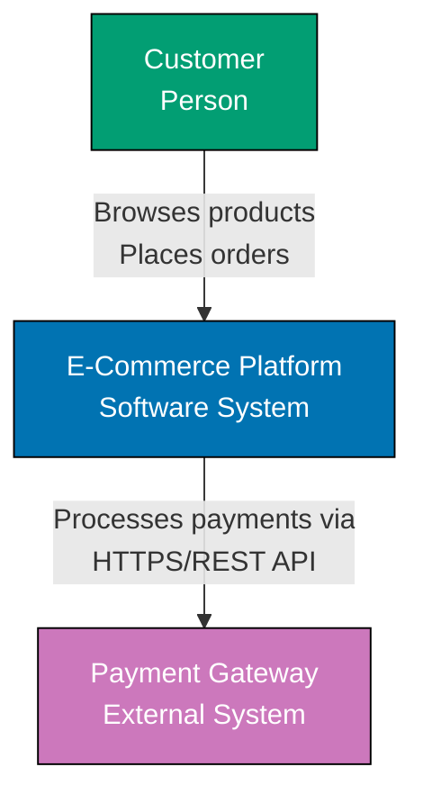

**Experimental C4 Syntax Approach** (what we DON'T use):

```text
C4Context
    title System Context Diagram for E-Commerce Platform

    Person(customer, "Customer", "A user browsing and purchasing products")
    System(ecommerce, "E-Commerce Platform", "Allows customers to browse and purchase products")
    System_Ext(payment, "Payment Gateway", "Processes payments")

    Rel(customer, ecommerce, "Browses products, Places orders")
    Rel(ecommerce, payment, "Processes payments", "HTTPS/REST")
```

**Key Differences**:

| Aspect                       | Standard Mermaid                                                          | Experimental C4 Syntax                                     |
| ---------------------------- | ------------------------------------------------------------------------- | ---------------------------------------------------------- |
| **Syntax**                   | `graph TB`, define nodes, connect with `-->`                              | `C4Context`, use `Person()`, `System()`, `Rel()` functions |
| **Color Control**            | Explicit `style` commands with hex colors                                 | Limited styling, uses C4 default colors                    |
| **Accessibility Compliance** | Full control, can ensure WCAG AA contrast                                 | Harder to customize for accessibility                      |
| **Tool Support**             | Works in all Mermaid renderers                                            | Requires Mermaid 9.x+, may not work in all tools           |
| **Stability**                | Stable, won't change                                                      | Experimental, syntax may evolve                            |
| **Layout Control**           | Manual positioning with subgraphs                                         | Automatic layout based on C4 conventions                   |
| **Learning Curve**           | Learn Mermaid graph syntax (general purpose)                              | Learn C4-specific syntax (specialized)                     |
| **Best For**                 | Stable long-term documentation with accessibility requirements            | Quick C4 prototypes when tool support is guaranteed        |
| **Migration Risk**           | Low - standard Mermaid syntax backwards compatible                        | Medium - experimental syntax may change in future releases |
| **Repository Fit**           | Perfect - meets accessibility, stability, and flexibility requirements    | Poor - experimental status and limited styling problematic |
| **Use When**                 | Building production documentation, requiring WCAG compliance, long-term   | Prototyping, experimenting, when C4 tool migration planned |
| **Avoid When**               | Need automatic C4 layout (consider Structurizr instead)                   | Need stable syntax, accessibility critical, tool agnostic  |
| **Example Use Case**         | Open source projects, enterprise documentation, regulated industries      | Internal prototypes, teams committed to specific tooling   |
| **Community Adoption**       | Widespread - most Mermaid users use standard syntax                       | Limited - experimental adopters only                       |
| **Diagram Portability**      | High - works across tools and platforms                                   | Low - tied to Mermaid-specific features                    |
| **Version Lock-in**          | None - works with any Mermaid version                                     | Requires specific Mermaid versions                         |
| **Future-Proofing**          | Excellent - unlikely to break                                             | Uncertain - experimental features may change or be removed |
| **Documentation Examples**   | GitHub README, technical blogs, Hugo/Jekyll sites, VS Code previews       | Mermaid Live Editor experiments, specialized documentation |
| **Diagram Maintenance**      | Easy - standard syntax familiar to most developers                        | Requires C4 syntax knowledge                               |
| **Cross-Reference Strategy** | Can mix with other Mermaid diagram types (sequence, class, ER) seamlessly | May feel inconsistent mixing C4 and standard syntax        |
| **Error Messages**           | Clear Mermaid syntax errors                                               | C4-specific errors may be less clear                       |
| **Debugging**                | Standard Mermaid debugging tools work                                     | Limited debugging for experimental features                |
| **Industry Adoption**        | Used by thousands of open source projects                                 | Niche adoption, mostly experimental users                  |
| **Risk Assessment**          | Low risk - proven, stable, widely supported                               | Medium risk - experimental, may change, limited support    |
| **Recommendation**           | **Recommended** for production documentation                              | Not recommended for production documentation               |

**When Experimental C4 Syntax Might Be Appropriate**:

Despite our choice to use standard Mermaid, experimental C4 syntax can be appropriate when:

1. **Internal Documentation Only**: Not relying on external tools or platforms
2. **Committed to Mermaid**: Team is comfortable adapting to syntax changes
3. **Automatic Layout Desired**: Want C4 conventions enforced automatically
4. **Short-Term Use**: Diagrams expected to be rewritten or replaced soon
5. **Prototyping**: Quick experiments before migrating to Structurizr
6. **Controlled Environment**: All tools support latest Mermaid experimental features

**Our Recommendation**:

For long-term, maintainable, accessible C4 documentation:

- **Use standard Mermaid syntax** (graph/flowchart) for stability and control
- **Reserve experimental C4 syntax** for short-term prototypes or controlled environments
- **Consider Structurizr DSL** if you need automatic layout and C4-specific tooling

**This Repository's Approach (Mermaid)**:

Open Sharia Enterprise uses **Mermaid diagrams** for C4 model documentation:

**Why Mermaid**:

- **GitHub-native**: Renders automatically in markdown files
- **Version controlled**: Text format diffs well in Git
- **Accessible**: WCAG-compliant color palette enforced
- **Portable**: Works in Obsidian, VS Code, documentation sites
- **No build step**: Renders client-side in browser

This tooling decision embodies **[Automation Over Manual](../../../../../governance/principles/software-engineering/automation-over-manual.md)** and **[Reproducibility First](../../../../../governance/principles/software-engineering/reproducibility.md)**. Text-based diagrams enable version control, code review, and CI/CD integration—treating architecture documentation as code rather than manual artifacts. Standard Mermaid syntax ensures diagrams remain reproducible across tools and time, avoiding experimental feature breakage.

**Trade-offs Accepted**:

- **Manual synchronization**: Each diagram independent, must update related diagrams manually
- **No automatic layout**: Must arrange elements by hand
- **Standard Mermaid only**: We use graph/flowchart syntax, NOT experimental C4 diagram types
- **Limited C4 features**: Mermaid C4 support simpler than Structurizr

**When to Switch**:

If this repository grows beyond 30 containers or requires complex cross-cutting views, consider migrating to Structurizr DSL while keeping Mermaid for simple diagrams.

### Practical Workflow: Creating C4 Diagrams

**Step-by-Step Process for New Systems**:

**Phase 1: Initial Documentation (First Week)**

1. **Gather Context**
   - Interview stakeholders: who uses the system? What external systems does it depend on?
   - List all users, external systems, and integration points
2. **Create System Context Diagram**
   - Draw the system (one box)
   - Add users (people boxes)
   - Add external systems (other system boxes)
   - Connect with labeled relationships
   - Review with team for accuracy
3. **Create Container Diagram**
   - List all deployable units (apps, databases, services)
   - Identify technology stack for each container
   - Draw containers with technology labels
   - Connect containers showing communication protocols
   - Review with developers for completeness

**Deliverable**: 2 diagrams . You now have minimum viable architecture documentation.

**Phase 2: Detailed Documentation (As Needed)**

1. **Identify Complex Containers**
   - Which containers have non-obvious internal structure?
   - Which containers cause confusion for new team members?
   - Which containers require component-level understanding?
2. **Create Component Diagrams**
   - For each complex container:
     - List major components (controllers, services, repositories)
     - Show component relationships
     - Indicate external dependencies
   - Review with developers who work on that container
3. **Document Key Workflows**
   - Identify critical user journeys or processes
   - Create Dynamic diagram (sequence or collaboration)
   - Show error paths and edge cases
   - Review with developers and QA

**Phase 3: Infrastructure Documentation (Before Deployment)**

1. **Create Deployment Diagram**
   - Document production infrastructure
   - Show containers mapped to infrastructure
   - Identify scaling strategy
   - Document external dependencies (cloud services, third-party APIs)

**Completeness Checklists**:

**System Context Diagram Checklist**:

- [ ] System clearly identified with name and description
- [ ] All user types shown (internal and external)
- [ ] All external systems shown (third-party, legacy, other teams)
- [ ] Relationships labeled with purpose (not just "uses")
- [ ] Diagram has title and legend
- [ ] Reviewed with stakeholders for accuracy

**Container Diagram Checklist**:

- [ ] All deployable units identified (apps, services, databases, message queues)
- [ ] Technology stack specified for each container (`[Container: Spring Boot]`)
- [ ] Communication protocols labeled (`HTTP/REST`, `gRPC`, `AMQP`)
- [ ] External systems from context diagram included
- [ ] Database-per-service pattern visible (if microservices)
- [ ] Diagram has title and legend
- [ ] Reviewed with development team

**Component Diagram Checklist** (per container):

- [ ] Major components identified (controllers, services, repositories, clients)
- [ ] Component responsibilities described
- [ ] Design patterns noted (`[Component: REST Controller]`)
- [ ] External dependencies shown (other containers, external systems)
- [ ] Database access components identified
- [ ] Diagram has title indicating which container
- [ ] Reviewed with container developers

**Deployment Diagram Checklist**:

- [ ] Infrastructure type specified (Kubernetes, AWS ECS, on-premise VMs)
- [ ] All containers mapped to infrastructure nodes
- [ ] Scaling strategy visible (replicas, auto-scaling groups)
- [ ] Network boundaries shown (VPCs, subnets, security groups)
- [ ] External services mapped to infrastructure (S3, RDS, external APIs)
- [ ] Environment clearly labeled (dev, staging, production)
- [ ] Reviewed with DevOps/infrastructure team

**Diagram Evolution as System Grows**:

**Startup Phase** (1-5 containers):

- 1 System Context
- 1 Container Diagram
- 0-1 Component Diagrams

**Growth Phase** (6-15 containers):

- 1 System Context
- 1 Container Diagram (may split by domain)
- 2-3 Component Diagrams (critical services)
- 1-2 Dynamic Diagrams (key workflows)
- 1 Deployment Diagram (production)

**Maturity Phase** (16+ containers):

- 1 System Landscape
- 2-4 System Context Diagrams (per bounded context)
- 2-4 Container Diagrams (per bounded context)
- 5-8 Component Diagrams (selective, complex services only)
- 3-5 Dynamic Diagrams (authentication, critical transactions)
- 2-3 Deployment Diagrams (dev, staging, prod)

**Maintenance Cadence**:

- **Weekly**: Review during sprint planning if architecture changes planned
- **Monthly**: Quick audit - do diagrams match reality?
- **Quarterly**: Comprehensive review - update all stale diagrams
- **On Major Changes**: Update immediately when deploying significant architecture changes

## Limitations and Scope

### What C4 Doesn't Cover

**Static Structure Only**:

C4 primarily focuses on **static architecture** (boxes and lines showing structure). For runtime behavior, supplement with:

- **Dynamic Diagrams** (C4 supplementary type)
- **Sequence Diagrams** (UML)
- **BPMN Process Flows**
- **State Machine Diagrams**

**Not a Complete Documentation Framework**:

C4 doesn't address:

- Architecture Decision Records (ADRs)
- Quality attribute scenarios
- Architectural principles and constraints
- Technology radar or standards
- Deployment procedures
- Operational runbooks

Consider combining C4 with comprehensive frameworks like arc42 for full coverage.

### Common Mistakes to Avoid (With Visual Examples)

Learning from mistakes is critical for creating effective C4 diagrams. This section shows common anti-patterns with visual examples of what goes wrong and how to fix it.

#### Anti-Pattern 1: Mixing Abstraction Levels

**Problem**: Combining different zoom levels in a single diagram confuses readers. Context-level elements mixed with component-level details create cognitive overload.

**Example (Wrong)**: Container diagram mixing high-level containers with low-level implementation details

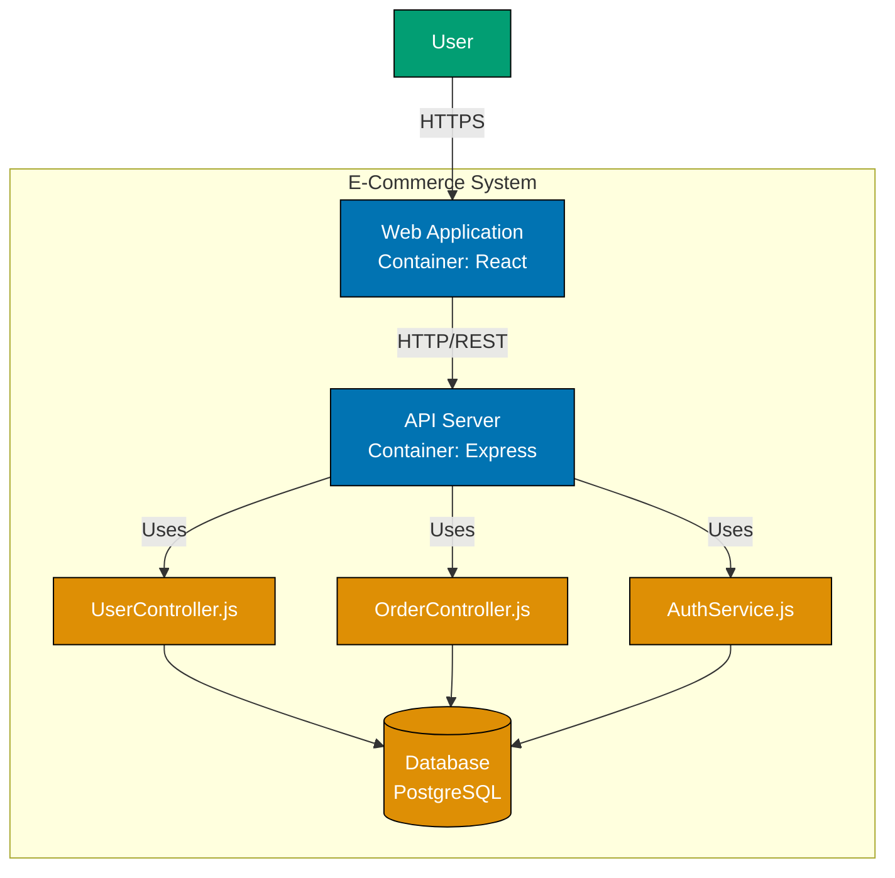

**Problems with this diagram**:

- Mixes Container level (WebApp, API) with Component level (controllers, services)
- Unclear whether `UserController` is a container or component
- Creates confusion about system boundaries
- Too much detail for Container diagram audience

**How to Fix**: Create separate diagrams for each abstraction level

**Container Diagram** (correct approach):

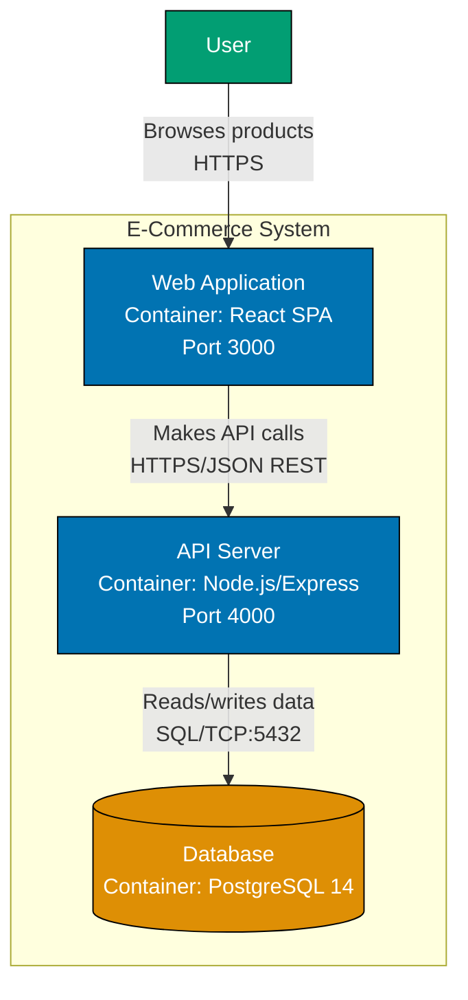

**Component Diagram** for API Server (separate diagram):

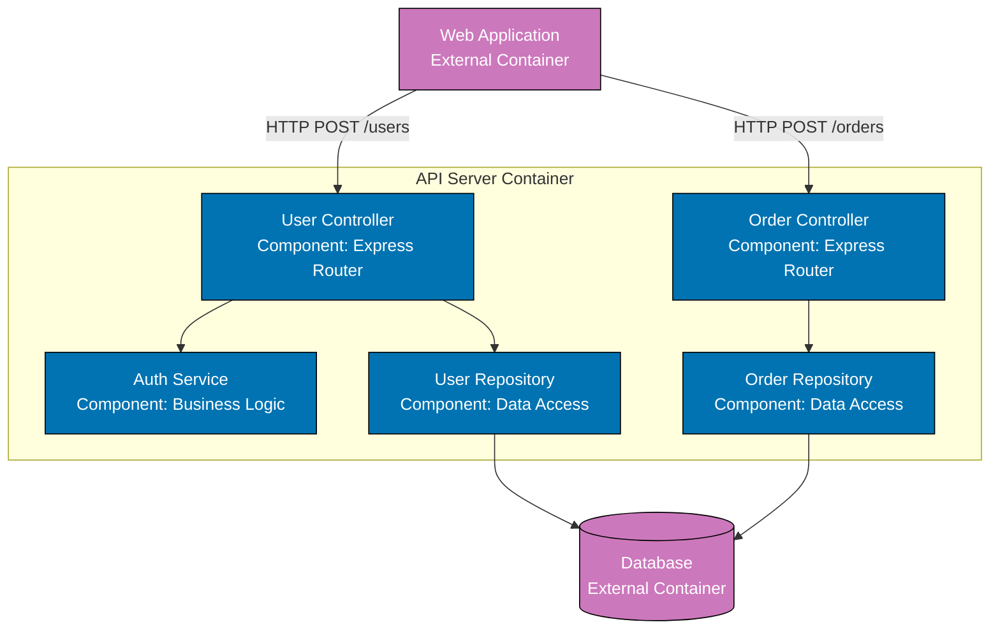

**Key Lessons**:

- Keep Container diagram at container level - show deployable units only
- Create separate Component diagram for internal structure
- Use consistent abstraction levels within each diagram
- Link between diagrams using cross-references

#### Anti-Pattern 2: Over-Documenting Simple Systems

**Problem**: Creating comprehensive C4 diagram sets for trivial systems wastes effort and creates maintenance burden.

**Example (Wrong)**: Full diagram set for simple 3-tier app

```text
Created diagrams:
✓ System Context Diagram
✓ Container Diagram
✓ Component Diagram for React App (5 components)
✓ Component Diagram for Express API (8 components)
✓ Code Diagram for React Components (15 classes)
✓ Code Diagram for Express Routes (12 functions)
✓ Dynamic Diagram for Login Flow
✓ Dynamic Diagram for Data Fetch Flow
✓ Deployment Diagram (Development)
✓ Deployment Diagram (Production)

Total diagrams: 10
Time spent: 15+ hours
System complexity: 3 containers, standard CRUD operations
Team size: 2 developers
```

**Problems**:

- 10 diagrams for simple system is overkill
- Component and Code diagrams restate obvious file structure
- Dynamic diagrams show standard patterns (login, data fetch)
- Maintenance burden outweighs value
- Diagrams ignored by 2-person team who knows system intimately

**How to Fix**: Create only valuable diagrams

**Minimal Approach** (2 diagrams):

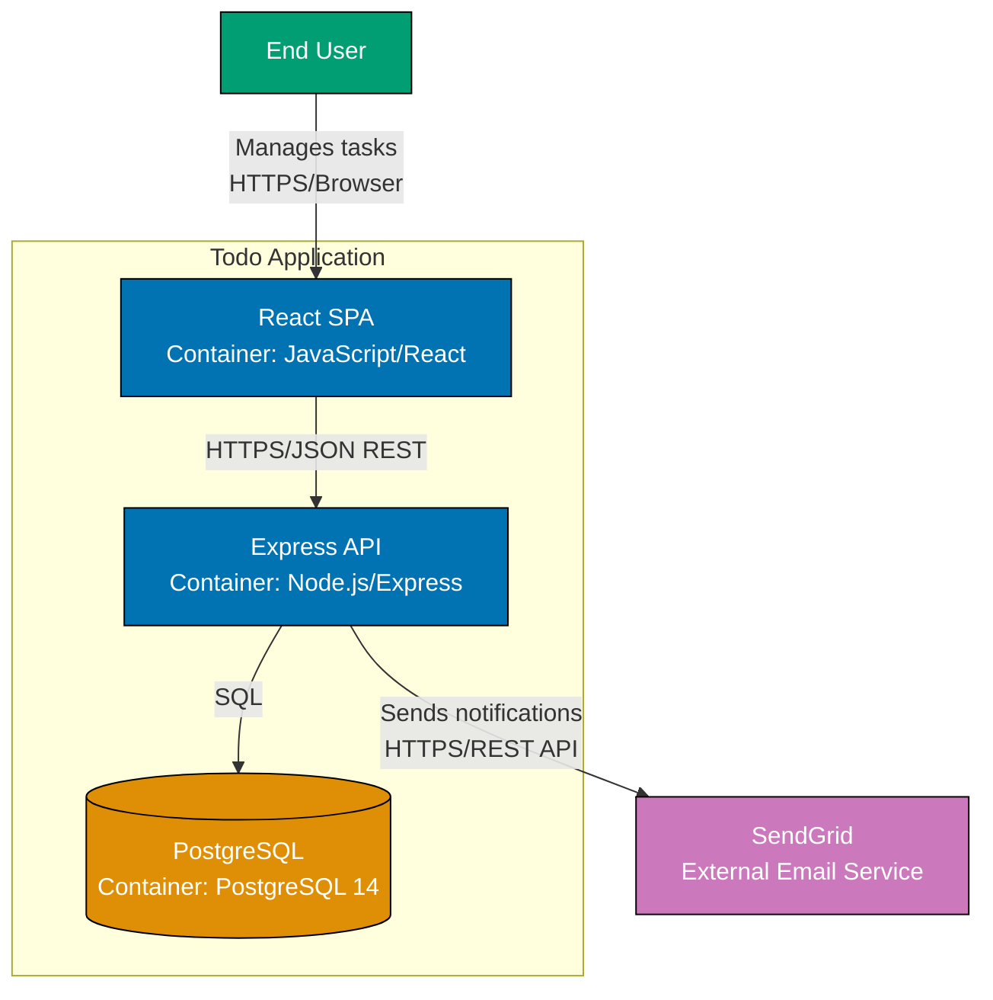

**Alternative to More Diagrams**: README with bullet points

```markdown
## Architecture

- Frontend: React SPA (create-react-app), port 3000
- Backend: Express REST API, port 4000
- Database: PostgreSQL 14
- External: SendGrid for email notifications

File structure is self-documenting - standard MVC pattern.
```

**Key Lessons**:

- Context + Container diagrams sufficient for simple systems
- Component/Code diagrams only for genuinely complex areas
- Consider README instead of diagrams for very simple systems
- Measure value by team usage, not completeness

#### Anti-Pattern 3: Under-Labeling Relationships

**Problem**: Vague relationship labels don't communicate what actually happens between elements.

**Example (Wrong)**: Generic labels that don't explain interactions

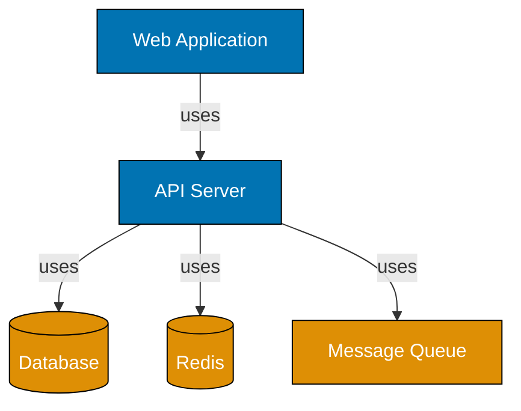

**Problems**:

- "uses" is too vague - doesn't explain what happens
- No communication protocols specified
- No indication of data flow or purpose
- Reader must guess how systems interact

**How to Fix**: Descriptive labels with protocols and purpose

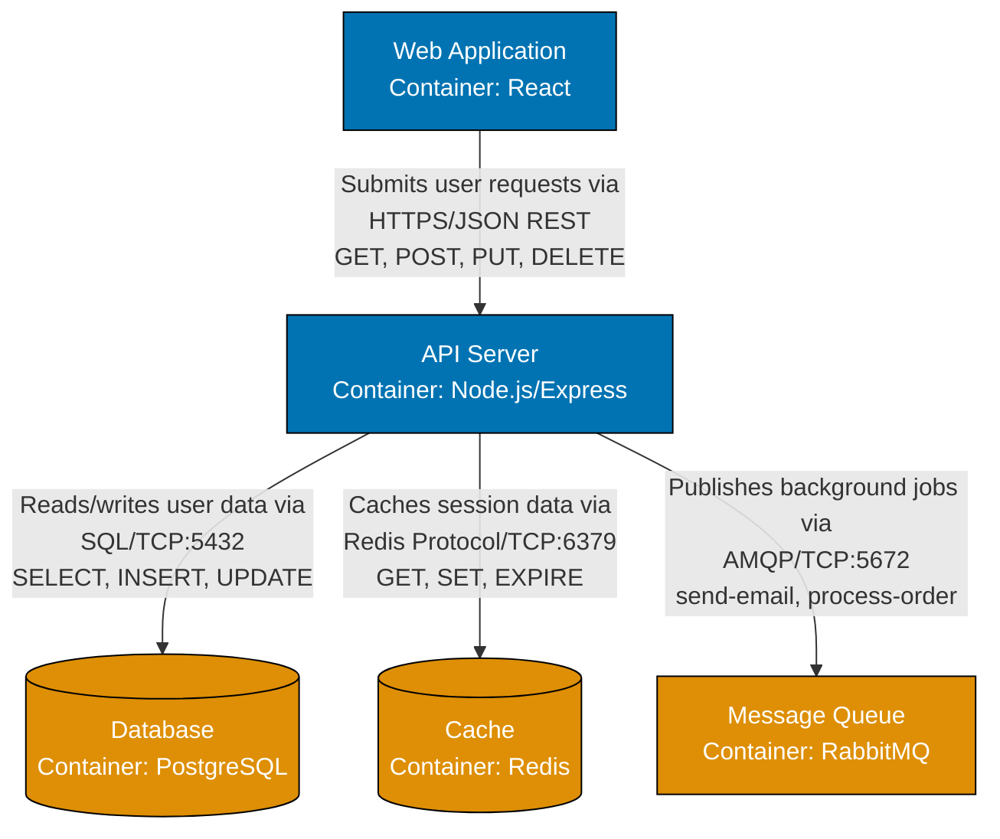

**Good Label Structure**:

```text
Format: [Purpose] via [Protocol/Technology] [Specific Actions/Methods]

Examples:
- "Reads user profile via HTTP GET /users/:id"
- "Publishes OrderCreated events via Kafka topic:orders"
- "Authenticates requests via JWT Bearer tokens"
- "Stores session data via Redis SET/GET commands"
- "Executes queries via SQL connection pool"
```

**Key Lessons**:

- Avoid generic labels: "uses", "calls", "interacts with"
- Include protocol: HTTP/REST, SQL, gRPC, AMQP, Kafka
- Specify purpose: What data flows? What actions occur?
- Add technology details: API endpoints, message topics, SQL operations

#### Anti-Pattern 4: Ignoring Accessibility

**Problem**: Using colors that fail WCAG contrast requirements or rely on color alone to convey meaning.

**Example (Wrong)**: Poor contrast and color-dependent meaning

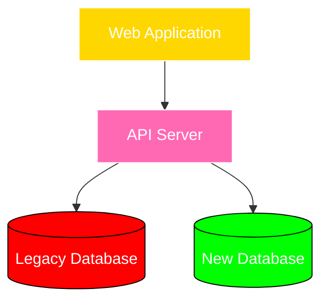

**Problems**:

- Yellow and pink fills with white text fail WCAG AA contrast (less than 4.5:1)
- Red/green color scheme problematic for color-blind users
- Color alone conveys "deprecated" status - no text label
- Diagram meaningless in grayscale or to color-blind readers

**How to Fix**: WCAG-compliant colors with explicit labels

```mermaid
graph TB
    WebApp[Web Application<br/>Container: React<br/>Status: Active]
    API[API Server<br/>Container: Express<br/>Status: Active]
    LegacyDB[(Legacy Database<br/>Container: Oracle<br/>⚠️ DEPRECATED - Migrate by Q3]
    NewDB[(New Database<br/>Container: PostgreSQL<br/>✓ Current Production DB)]

    WebApp -->|HTTP/REST| API
    API -->|Read-only queries<br/>JDBC| LegacyDB
    API -->|Primary data access<br/>SQL| NewDB

    style WebApp fill:#0173B2,stroke:#000000,color:#ffffff
    style API fill:#0173B2,stroke:#000000,color:#ffffff
    style LegacyDB fill:#CA9161,stroke:#000000,color:#ffffff
    style NewDB fill:#029E73,stroke:#000000,color:#ffffff
```

**WCAG-Compliant Color Palette** (repository standard):

- Blue `#0173B2` - Active containers
- Teal `#029E73` - Databases, active infrastructure
- Orange `#DE8F05` - Databases, infrastructure
- Purple `#CC78BC` - External systems
- Brown `#CA9161` - Legacy/deprecated systems
- Black `#000000` - Text and borders
- White `#FFFFFF` - Text on dark backgrounds

All combinations meet WCAG AA contrast ratio (4.5:1 minimum).

**Key Lessons**:

- Use repository-approved WCAG-compliant color palette only
- Add text labels for status (don't rely on color alone)
- Include symbols: ⚠️ for warnings, ✓ for confirmed, 🔒 for security
- Test diagrams in grayscale to ensure comprehension

#### Anti-Pattern 5: Inconsistent Notation Across Diagrams

**Problem**: Using different shapes, colors, or conventions across related diagrams creates confusion.

**Example (Wrong)**: Same elements shown differently

**Container Diagram 1** (inconsistent notation):

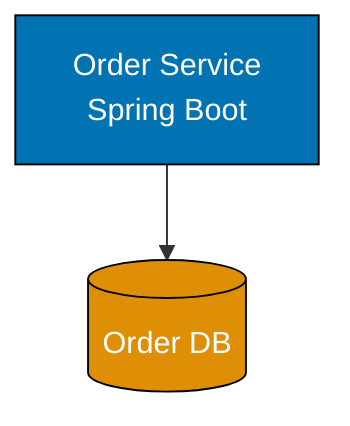

**Container Diagram 2** (inconsistent notation):

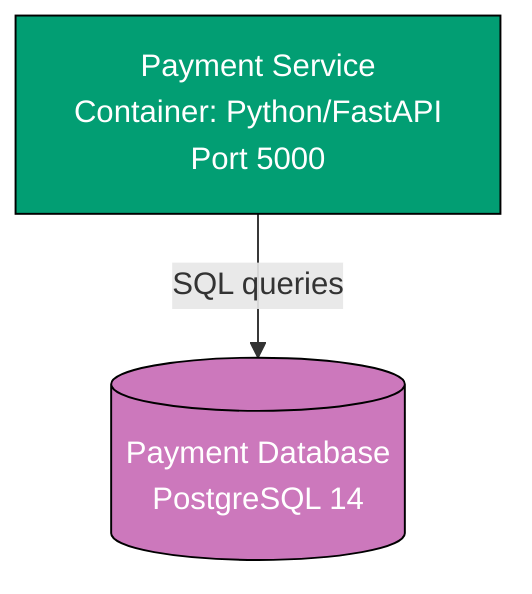

**Problems**:

- Order Service lacks "Container:" prefix, Payment Service has it
- Order Service no port specified, Payment Service has port
- Different colors for same element types (both APIs, both databases)
- Inconsistent relationship labeling (unlabeled vs. "SQL queries")
- Readers can't tell if differences are meaningful or arbitrary

**How to Fix**: Consistent notation and conventions

**Standard Format** (applied to all diagrams):

```text
Element Naming:
[Name]<br/>[Type]: [Technology]<br/>[Additional Info]

Examples:
- "Order Service<br/>Container: Spring Boot<br/>Port 8080"
- "Payment Service<br/>Container: Python/FastAPI<br/>Port 5000"
- "Order Database<br/>Container: PostgreSQL 14"

Relationship Labeling:
[Purpose] via [Protocol]

Examples:
- "Reads/writes orders via SQL"
- "Processes payments via HTTP/REST"
```

**Consistent Container Diagram**:

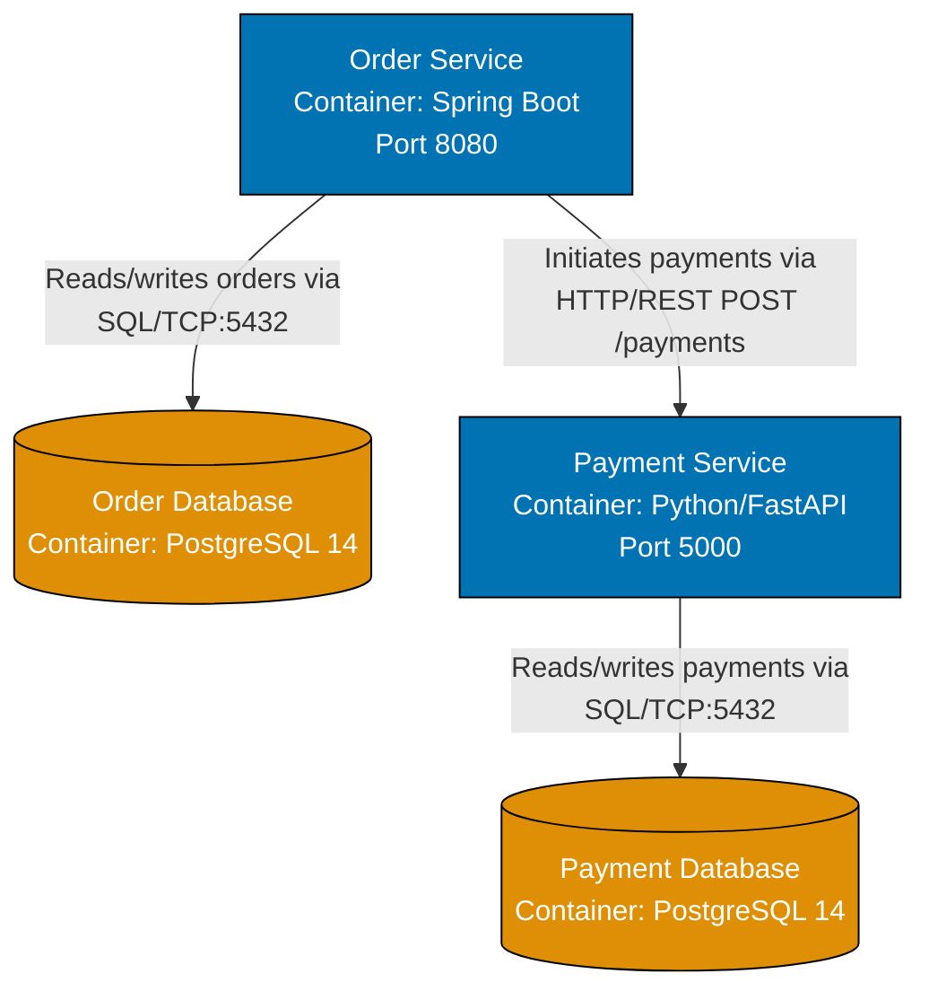

**Key Lessons**:

- Define notation standards once, apply everywhere
- Use consistent colors for element types (all APIs blue, all databases orange)
- Use consistent labeling format for all elements
- Document conventions in diagram legend or style guide

#### Anti-Pattern 6: Creating Diagrams No One Maintains

**Problem**: Diagrams created once during initial documentation become stale as system evolves.

**Warning Signs**:

- Last updated date is 12+ months ago
- Diagrams show containers that were deprecated/removed
- New services added in last 6 months not shown
- Technology stacks listed are outdated (Node 12 when system uses Node 20)
- Team members say "ignore those diagrams, they're wrong"

**How to Fix**: Establish diagram maintenance process

**Maintenance Strategies**:

1. **Documentation as Code**:
   - Store diagrams in version control with code
   - Review diagrams during architecture change pull requests
   - Use CI/CD to validate diagram syntax and render
2. **Ownership Assignment**:
   - Assign diagram ownership (e.g., "Tech Lead maintains Container diagram")
   - Include diagram updates in Definition of Done for architecture changes
3. **Regular Audits**:
   - Quarterly review: Do diagrams match reality?
   - Monthly spot-check: Compare one diagram to actual deployment
4. **Automation Where Possible**:
   - Generate deployment diagrams from infrastructure-as-code (Terraform, Kubernetes manifests)
   - Use Structurizr or similar tools to maintain model and generate diagrams
5. **Measure Staleness**:
   - Track last updated date in diagram frontmatter
   - Flag diagrams not updated in 6+ months for review

**Key Lessons**:

- Don't create diagrams you won't maintain
- Integrate diagram updates into development workflow
- Automate diagram generation where feasible
- Delete diagrams that are perpetually stale

#### Anti-Pattern 7: Tool Obsession

**Problem**: Spending excessive time on tooling, automation, or perfect diagram aesthetics instead of useful documentation.

**Example Symptoms**:

- significant time spent building custom diagram generation tool
- considerable time debating Structurizr vs. PlantUML vs. Mermaid
- Perfect pixel-aligned diagrams but outdated content
- Team avoids updating diagrams because tooling is too complex
- Diagrams require specific IDE plugin that half the team doesn't have

**How to Fix**: Prioritize content over tooling

**Pragmatic Tool Selection**:

1. **Good Enough is Good Enough**:
   - Mermaid in Markdown renders on GitHub - ship it
   - draw.io works for team - use it
   - Whiteboard photo with annotations - better than no diagram
2. **Optimize for Team Adoption**:
   - Choose tools team already uses daily
   - Lowest friction = highest adoption
   - Complex automation can wait until diagrams prove valuable
3. **Start Simple**:
   - Week 1: Hand-drawn diagrams in meeting notes
   - Week 2: Digitize in simplest tool (Mermaid, draw.io)
   - Month 3: Consider automation only if manual updates become bottleneck

**Red Flags** (tool obsession in progress):

- "Let's build a custom DSL for our diagrams"
- "We should auto-generate diagrams from runtime tracing"
- "This diagram tool has 47 configuration options we need to learn"
- Spending more time on tooling than on architecture itself

**Key Lessons**:

- Tools serve documentation, not vice versa
- Start with simplest tool that works
- Only automate if manual process is proven bottleneck
- Evaluate tool value by diagram adoption, not tool features

### Summary: Anti-Patterns Checklist

Before finalizing C4 diagrams, check against these anti-patterns:

- [ ] **Consistent Abstraction**: Each diagram maintains single zoom level
- [ ] **Right Amount of Documentation**: Diagrams proportional to system complexity
- [ ] **Descriptive Labels**: Relationships specify protocol, purpose, and actions
- [ ] **Accessible Colors**: WCAG AA compliant, meaning not color-dependent
- [ ] **Consistent Notation**: Same element types use same shapes, colors, labels across all diagrams
- [ ] **Maintenance Plan**: Process exists for keeping diagrams current
- [ ] **Pragmatic Tooling**: Tool choice prioritizes team adoption over features

If any checkbox fails, revisit diagram before publishing.

### Diagram Versioning Strategy

As systems evolve, architecture diagrams must evolve with them. Versioning strategies help teams track changes, manage migrations, and communicate architectural evolution.

#### Why Version Diagrams

**Tracking Architectural Evolution**:

- Document how architecture changed over time
- Show before/after states during migrations
- Provide historical context for architectural decisions
- Help new team members understand system evolution

**Migration Planning**:

- Clearly communicate current vs. future state
- Track progress during multi-phase migrations
- Align stakeholders on migration roadmap
- Measure completion of architectural changes

**Audit and Compliance**:

- Document when architectural changes occurred
- Connect diagram versions to deployment timestamps
- Satisfy compliance requirements for change documentation
- Support post-incident analysis (what was the architecture when incident occurred?)

**Knowledge Management**:

- Preserve institutional knowledge
- Understand why past decisions were made
- Avoid repeating past mistakes
- Onboard new team members with historical context

#### Four Versioning Approaches

**1. Date-Based Versioning** (Recommended)

Include date in diagram title or filename.

**Format**:

- **Title**: `System Context Diagram (as of 2026-01-20)`
- **Filename**: `system-context-2026-01-20.md`
- **Alternative**: Use ISO week format `2026-W03` for weekly snapshots

**When to Use**:

- Regular architectural reviews (monthly/quarterly)
- Documenting architecture at specific milestones (launch, major releases)
- Compliance requirements for time-stamped documentation
- Slow-changing systems where explicit dates provide context

**Advantages**:

- Unambiguous - everyone understands dates
- Easy to find "architecture as of Q3 2025"
- Works well with documentation-as-code in Git
- Simple to implement - just add date to title

**Disadvantages**:

- Requires discipline to update dates when making changes
- Can accumulate many dated versions over time
- Doesn't clearly indicate what changed between versions

**Example**:

```markdown
# System Context Diagram (as of 2026-01-20)

Last Updated: 2026-01-20
Previous Version: System Context Diagram (as of 2025-12-15) - see `system-context-2025-12-15.md`
Changes: Added Stripe payment gateway integration, removed legacy PayPal integration
```

**2. As-Is / To-Be Versioning**

Create pairs of diagrams showing current and future state.

**Format**:

- **Current**: `System Context Diagram (As-Is)`
- **Future**: `System Context Diagram (To-Be)`
- **During Migration**: Both diagrams exist, updated as migration progresses

**When to Use**:

- Planning major migrations (monolith → microservices, on-premise → cloud)
- Communicating architectural vision to stakeholders
- Tracking progress during multi-month architectural changes
- Securing buy-in for architectural proposals

**Advantages**:

- Clear communication of desired end state
- Highlights differences between current and future
- Useful for stakeholder presentations and approval
- Natural fit for migration planning

**Disadvantages**:

- Only captures two states (doesn't show intermediate phases)
- "To-Be" diagram can become stale if migration delayed
- Need to maintain both diagrams during transition
- Doesn't scale to multi-phase migrations

**Example**:

```markdown
# System Context Diagram (As-Is) - Monolithic Architecture

Current production architecture serving 10K users.

# System Context Diagram (To-Be) - Microservices Architecture

Target architecture for 100K users. Migration planned Q2-Q4 2026.

Migration Phases:

- Phase 1 (Q2): Extract user service
- Phase 2 (Q3): Extract order service
- Phase 3 (Q4): Decommission monolith
```

**3. Semantic Versioning**

Version diagrams like software (v1.0, v1.1, v2.0).

**Format**:

- **Major version**: Fundamental architectural changes (v1.0 → v2.0)
- **Minor version**: Incremental changes (v2.0 → v2.1)
- **Patch version**: Corrections/clarifications (v2.1.0 → v2.1.1)

**When to Use**:

- Formal documentation processes with version control
- Enterprise architecture teams managing multiple systems
- When diagram versions need to align with software versions
- Teams familiar with semantic versioning conventions

**Advantages**:

- Explicit about impact of changes (major vs. minor)
- Aligns with software versioning conventions
- Works well with formal change management processes
- Clear progression (v1 → v2 → v3)

**Disadvantages**:

- Subjective - what constitutes "major" vs. "minor" change?
- Requires team agreement on versioning rules
- Version numbers don't communicate timeline
- More overhead than date-based approach

**Example**:

```markdown
# System Context Diagram v2.1

Version: 2.1.0
Date: 2026-01-20
Changes since v2.0:

- Added Stripe payment gateway (minor: new external system)
- Removed PayPal integration (minor: removed external system)

Changelog:

- v2.1.0 (2026-01-20): Payment gateway changes
- v2.0.0 (2025-11-15): Microservices migration complete
- v1.5.0 (2025-08-01): Added message bus
- v1.0.0 (2025-01-01): Initial monolithic architecture
```

**4. Git History as Versioning**

Rely on Git commits and file history for versioning.

**Format**:

- Single file updated in place: `system-context.md`
- Git commit messages document changes
- Use `git log` or `git blame` to see evolution

**When to Use**:

- Documentation-as-code workflows
- Teams comfortable with Git
- When diagram changes are frequent and small
- Informal documentation processes

**Advantages**:

- No manual versioning overhead
- Automatically tracked by Git
- Natural fit for documentation-as-code
- Can diff versions using Git tools

**Disadvantages**:

- Requires Git proficiency to understand history
- Hard to compare versions visually (need Git diff)
- Not accessible to non-technical stakeholders
- Difficult to reference specific version in conversations

**Example**:

```bash
# View diagram history
git log --oneline system-context.md

# Compare two versions
git diff abc123..def456 system-context.md

# View diagram as of specific date
git show HEAD@{2025-12-01}:system-context.md
```

#### Recommended Strategy by Use Case

| Use Case                                            | Recommended Approach | Secondary Approach | Avoid                    |
| --------------------------------------------------- | -------------------- | ------------------ | ------------------------ |
| **Regular architectural reviews (quarterly)**       | Date-Based           | Semantic           | As-Is/To-Be              |
| **Major migration planning**                        | As-Is/To-Be          | Date-Based         | Semantic                 |
| **Compliance documentation (audit trail)**          | Date-Based           | Semantic           | Git History              |
| **Fast-changing startup architecture**              | Git History          | Date-Based         | Semantic                 |
| \*\*Stakeholder presentations (architectural vision | As-Is/To-Be          | Date-Based         | Git History              |
| **Enterprise formal change management**             | Semantic             | Date-Based         | Git History              |
| **Small team informal documentation**               | Git History          | Date-Based         | Semantic                 |
| **Multi-phase migration (3+ phases)**               | Date-Based + Phases  | As-Is/To-Be        | Semantic                 |
| **Documentation for external auditors**             | Date-Based           | Semantic           | Git History              |
| **Historical architecture analysis**                | Date-Based           | Git History        | As-Is/To-Be              |
| **Active migration in progress**                    | As-Is/To-Be          | Date-Based         | Semantic                 |
| **System with infrequent architectural changes**    | Date-Based           | Git History        | Semantic, As-Is/To-Be    |
| **System with daily/weekly architectural changes**  | Git History          | Date-Based         | As-Is/To-Be, Semantic    |
| **Greenfield project (early iterations)**           | Git History          | Date-Based         | Semantic, As-Is/To-Be    |
| **Legacy system documentation (historical)**        | Date-Based           | Semantic           | As-Is/To-Be, Git History |

**Hybrid Approach** (Recommended for Most Teams):

Combine date-based versioning with Git history:

- **Diagram title**: Include date for major versions (quarterly snapshots)
- **Git commits**: Track incremental changes between major versions
- **As-Is/To-Be**: Create during major migrations, date-stamp both diagrams

**Example**:

```markdown
# System Context Diagram (as of 2026-01-20)

Version: 2026-01-20 (Q1 Snapshot)
Previous Version: 2025-10-15 (Q4 2025) - see `system-context-2025-10-15.md`
Git History: See commit log for incremental changes between snapshots

During Active Migration:

- System Context (As-Is) - Monolithic - see `system-context-as-is-2026-01-20.md`
- System Context (To-Be) - Microservices - see `system-context-to-be-2026-01-20.md`
```

#### Diagram Lifecycle

**Phase 1: Creation**

- Create initial diagram with date or version
- Document context: Why created? What questions does it answer?
- Add to documentation index

**Phase 2: Active Maintenance**

- Update diagram when architecture changes
- Increment version or update date
- Document changes in commit message or changelog
- Review during architectural changes (pull requests)

**Phase 3: Migration/Transition**

- Create As-Is/To-Be versions if major migration
- Update both diagrams as migration progresses
- Clearly mark "As-Is" once migration complete

**Phase 4: Archival**

- Mark diagram as archived when system decommissioned
- Keep in repository for historical reference
- Add "ARCHIVED" prefix to title
- Link to replacement diagram if applicable

**Example Lifecycle**:

```markdown
# System Context Diagram (as of 2025-01-01)

Status: ARCHIVED
Archived Date: 2025-12-01
Reason: Monolithic system replaced by microservices architecture
Replacement: System Context Diagram (as of 2025-12-01) - see `system-context-2025-12-01.md`
Historical Context: Original e-commerce platform architecture, served production from 2025-01 to 2025-11.
```

#### Example Versioned Diagram Titles

**Date-Based Examples**:

- `System Context Diagram (as of 2026-01-20)`
- `Container Diagram - E-Commerce Platform (Q1 2026)`
- `Component Diagram - Order Service (2026-W03)` (ISO week format)

**As-Is / To-Be Examples**:

- `System Context (As-Is) - Monolithic Architecture`
- `System Context (To-Be) - Microservices Architecture`
- `Deployment Diagram (Current State) - On-Premise`
- `Deployment Diagram (Target State) - Cloud-Native`

**Semantic Versioning Examples**:

- `System Context Diagram v2.1`
- `Container Diagram - Payment System v3.0`
- `Component Diagram - User Service v1.5.2`

**Hybrid Examples**:

- `System Context Diagram v2.0 (as of 2026-01-20)`
- `Container Diagram (As-Is, Q4 2025)` and `Container Diagram (To-Be, Q2 2026)`
- `Deployment Diagram v3.1 (2026-01-20)`

**Archived Examples**:

- `[ARCHIVED] System Context - Monolith (2023-05 to 2025-11)`
- `[DEPRECATED] Container Diagram - Legacy Platform (v1.0, archived 2025-12)`

#### Best Practices for Diagram Versioning

**Do**:

- Include dates in diagram titles for major versions
- Document changes in commit messages or changelog
- Create As-Is/To-Be diagrams for major migrations
- Archive old diagrams rather than deleting
- Link between diagram versions (previous/next)
- Use consistent versioning approach across all diagrams
- Review and update diagram dates during architectural reviews

**Don't**:

- Mix versioning approaches inconsistently
- Version diagrams daily (too much overhead)
- Delete old versions (lose historical context)
- Forget to update version when making significant changes
- Use version numbers without documenting what changed
- Create new versions for typo fixes or formatting changes
- Over-version (reserve versioning for meaningful architectural changes)

**Frequency Guidance**:

- **Quarterly**: Create dated snapshots for stable systems
- **Monthly**: Version diagrams for actively evolving systems
- **Per Major Release**: Version diagrams when deploying significant changes
- **Per Migration Phase**: Update As-Is/To-Be diagrams at each milestone
- **Continuous**: Use Git history for frequently changing diagrams

### ADR Integration with C4 Diagrams

Architecture Decision Records (ADRs) and C4 diagrams serve complementary purposes. Understanding when to use each - and how they work together - creates comprehensive architecture documentation.

#### What are Architecture Decision Records (ADRs)?

**Definition**:

Architecture Decision Records document significant architectural decisions, the context that led to them, the options considered, and the reasoning behind the chosen solution.

**Standard ADR Format** (Michael Nygard template):

```markdown
# ADR-001: Use Microservices Architecture

Date: 2026-01-20
Status: Accepted
Deciders: Tech Lead, Senior Engineers, Product Manager

## Context

Current monolithic architecture struggles to scale beyond 10K users. Deployments are slow and complex.
Independent teams blocked waiting for monolith releases. Need faster iteration and independent scaling.

## Decision

Migrate from monolithic architecture to microservices architecture with the following services:

- User Service (authentication, profiles)
- Order Service (order management, checkout)
- Product Service (catalog, search)
- Payment Service (payment processing)

Use HTTP/REST for synchronous communication, Kafka for asynchronous events.

## Consequences

Positive:

- Independent deployment (services deployed separately)
- Team autonomy (each team owns services)
- Technology flexibility (polyglot services)
- Horizontal scaling per service

Negative:

- Increased operational complexity (10+ services to monitor)
- Distributed system challenges (network failures, eventual consistency)
- Higher infrastructure costs (separate databases per service)
- Learning curve (team needs microservices expertise)

## Alternatives Considered

1. **Modular Monolith**: Keep single deployment, modularize codebase
   - Rejected: Doesn't solve deployment bottleneck or independent scaling
2. **Serverless Functions**: Break into AWS Lambda functions
   - Rejected: Vendor lock-in, cold start issues for user-facing APIs
```

**Why ADRs Matter**:

- Capture **why** decisions were made (C4 diagrams show **what** the architecture is)
- Document alternatives considered and trade-offs
- Provide context for future team members
- Create audit trail of architectural evolution
- Support decision accountability

#### ADR vs. C4 Diagrams: Complementary Tools

| Aspect                    | ADRs (Architecture Decision Records)                               | C4 Diagrams                                                     |
| ------------------------- | ------------------------------------------------------------------ | --------------------------------------------------------------- |
| **Purpose**               | Document WHY architecture decisions were made                      | Document WHAT the architecture is                               |
| **Focus**                 | Context, reasoning, trade-offs, alternatives                       | Structure, components, relationships, technology                |
| **Content**               | Prose describing decision, context, consequences                   | Visual diagrams showing boxes and lines                         |
| **Audience**              | Future developers, architects, decision reviewers                  | Current and new team members, stakeholders                      |
| **Timeline**              | Point-in-time decision (dated, immutable once accepted)            | Living documentation (updated as architecture evolves)          |
| **Granularity**           | High-level strategic decisions (microservices, database choice)    | Tactical implementation details (services, components, APIs)    |
| **Format**                | Text (Markdown, typically)                                         | Diagrams (Mermaid, PlantUML, Structurizr)                       |
| **When Created**          | Before or during architectural change (decision point)             | After architectural change (documentation of current state)     |
| **Mutability**            | Immutable (superseded by new ADRs, never edited)                   | Mutable (updated as architecture evolves)                       |
| **Historical Value**      | High - explains evolution of thinking                              | Medium - shows architectural snapshots over time                |
| **Decision Trail**        | Clear audit trail (ADR-001 → ADR-002 → ADR-003)                    | Implicit (compare diagram versions to see changes)              |
| **Trade-Offs Documented** | Explicitly lists alternatives and consequences                     | Does not capture why alternatives weren't chosen                |
| **Implementation Detail** | No - describes decision, not implementation                        | Yes - shows exact services, APIs, databases                     |
| **Use in Code Reviews**   | Referenced when reviewing PR implementing decision                 | Referenced to understand system context for PR                  |
| **Lifecycle**             | Created once, superseded by later ADRs if decision changes         | Continuously updated as system evolves                          |
| **Search/Discovery**      | Numbered list (ADR-001, ADR-002), tags, index                      | Navigate by zoom level (Context → Container → Component)        |
| **Tool Support**          | Simple text files, ADR CLI tools, wikis                            | Diagramming tools (Mermaid, Structurizr, draw.io)               |
| **Approval Process**      | Often requires explicit sign-off before implementation             | Reviewed during architecture review, less formal                |
| **Relationship**          | ADRs explain **why** C4 diagrams look the way they do              | C4 diagrams visualize **what** was decided in ADRs              |
| **Example**               | "We chose microservices for independent scaling and team autonomy" | Diagram showing 5 microservices with their databases            |
| **When to Create**        | When making significant architectural decision                     | After architectural change, during onboarding, for stakeholders |
| **Maintenance**           | No maintenance (immutable)                                         | Ongoing maintenance as architecture evolves                     |
| **Combination Strategy**  | Link ADRs from C4 diagrams, link C4 diagrams from ADRs             | Cross-reference to provide both WHY and WHAT                    |

**Key Insight**: ADRs answer "Why did we choose this architecture?" while C4 diagrams answer "What does this architecture look like?"

#### When to Create ADR vs. Update Diagram vs. Both

**Create ADR Only**:

- Choosing architectural style (monolith vs. microservices vs. serverless)
- Selecting technology stack (programming language, database, framework)
- Deciding on cross-cutting concerns (authentication strategy, logging approach)
- Establishing architectural principles (no shared databases, API-first)
- Trade-off decisions (consistency vs. availability, latency vs. throughput)

**Update C4 Diagram Only**:

- Adding new container (new microservice following existing patterns)
- Updating technology version (Node 18 → Node 20)
- Adding new external integration (new third-party API)
- Refactoring internal components (no architectural impact)
- Changing deployment infrastructure (Kubernetes config updates)

**Create ADR AND Update Diagram**:

- Introducing new architectural pattern (adding event sourcing, CQRS)
- Major migration (monolith → microservices, on-premise → cloud)
- Changing communication patterns (REST → gRPC, sync → async)
- Database strategy changes (SQL → NoSQL, single DB → database-per-service)
- Introducing new architectural layer (API gateway, service mesh)

**Decision Matrix**:

| Change Type                                         | ADR? | Update Diagram? | Rationale                                                            |
| --------------------------------------------------- | ---- | --------------- | -------------------------------------------------------------------- |
| **Adopt microservices architecture**                | ✅   | ✅              | Major decision + visual structure changes                            |
| **Choose PostgreSQL over MySQL**                    | ✅   | ❌              | Decision captured in ADR, diagram just shows "Database"              |
| **Add new Order Service (follows existing pattern** | ❌   | ✅              | No new decision, just implementation                                 |
| **Introduce API Gateway**                           | ✅   | ✅              | New architectural layer + visual change                              |
| **Upgrade Node.js 18 → 20**                         | ❌   | ⚠️              | Update diagram label, no ADR needed                                  |
| **Change from REST to gRPC**                        | ✅   | ✅              | Significant decision + relationship labels change                    |
| **Add Redis caching**                               | ⚠️   | ✅              | Minor decision (ADR if caching strategy), always update diagram      |
| **Introduce Event Sourcing pattern**                | ✅   | ✅              | Major pattern change + new components in diagram                     |
| **Add Stripe payment integration**                  | ❌   | ✅              | Standard integration, no architectural decision                      |
| **Adopt Database-per-Service pattern**              | ✅   | ✅              | Architectural principle + multiple databases in diagram              |
| **Refactor component internals (no API changes)**   | ❌   | ❌              | Implementation detail, no architectural impact                       |
| **Split monolith into services**                    | ✅   | ✅              | Major migration + new containers in diagram                          |
| **Choose Kafka over RabbitMQ**                      | ✅   | ⚠️              | Decision captured in ADR, diagram shows message bus                  |
| **Add authentication middleware**                   | ⚠️   | ⚠️              | ADR if auth strategy decision, diagram if visible in Component level |
| **Deploy to Kubernetes**                            | ⚠️   | ✅              | ADR if first orchestration decision, update Deployment diagram       |

**Legend**:

- ✅ Yes, required
- ⚠️ Maybe, depends on context
- ❌ No, not needed

#### Linking Strategies: ADRs ↔ C4 Diagrams

**Strategy 1: ADR → Diagram** (Recommended)

Link from ADR to relevant C4 diagram.

**Example ADR**:

```markdown
# ADR-005: Introduce API Gateway Pattern

Date: 2026-01-20
Status: Accepted

## Decision

Introduce Kong API Gateway as single entry point for all microservices.

## Consequences

See architecture diagram: Container Diagram - Microservices with API Gateway (in `container-diagram-2026-01-20.md`)

The diagram shows:

- API Gateway as entry point
- Routing to User, Order, Product services
- Authentication handled at gateway level
```

**Benefits**:

- ADR readers see visual representation of decision
- Diagram provides context for technical implementation
- Clear connection between decision and resulting architecture

**Strategy 2: Diagram → ADR**

Reference ADR in C4 diagram description or frontmatter.

**Example Diagram**:

```markdown
# Container Diagram - Microservices Architecture (as of 2026-01-20)

Architecture Decisions:

- ADR-001: Adopt Microservices Architecture (see `../../adr/001-microservices-architecture.md`)
- ADR-005: Introduce API Gateway Pattern (see `../../adr/005-api-gateway.md`)
- ADR-008: Database-per-Service Pattern (see `../../adr/008-database-per-service.md`)

[Mermaid diagram here]
```

**Benefits**:

- Diagram readers understand why architecture looks this way
- Links to decision context and trade-offs
- Historical context for architectural choices

**Strategy 3: Bidirectional Linking** (Best Practice)

Link ADRs to diagrams AND diagrams to ADRs.

**ADR File**:

```markdown
# ADR-001: Adopt Microservices Architecture

See architecture: Container Diagram (as of 2026-01-20) - see `container-2026-01-20.md`
```

**Diagram File**:

```markdown
# Container Diagram (as of 2026-01-20)

Related ADRs:

- ADR-001: Microservices Architecture - see `../../adr/001-microservices.md`
```

**Benefits**:

- Navigation works in both directions
- Complete picture: WHY (ADR) + WHAT (diagram)
- Self-documenting architecture

#### Example Workflow: Adding New Microservice

**Scenario**: Team decides to extract Payment functionality from monolith into separate Payment Service.

**Step 1: Create ADR** (if new pattern or significant decision)

```markdown
# ADR-010: Extract Payment Service from Monolith

Date: 2026-01-20
Status: Accepted

## Context

Payment processing logic tightly coupled in monolith. PCI compliance requires isolated payment handling.
Team wants to scale payment independently during sales events.

## Decision

Extract payment processing into dedicated Payment Service.

## Consequences

Positive:

- PCI compliance isolation (payment data contained)
- Independent scaling (scale payment service during high load)
- Technology flexibility (use Python for payment service)

Negative:

- Distributed transaction complexity (need saga pattern for order + payment)
- Network latency (additional service hop)

## Implementation

See architecture: Container Diagram (as of 2026-01-20) - see `container-2026-01-20.md`
```

**Step 2: Update C4 Container Diagram**

Add Payment Service container to diagram:

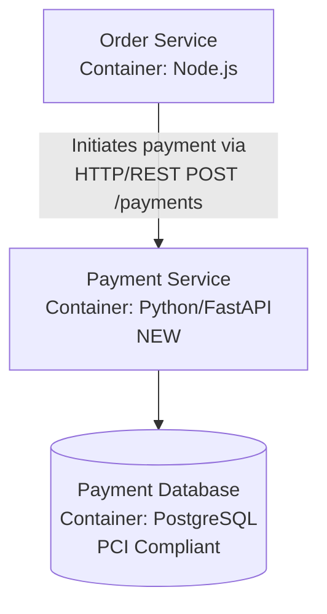

**Step 3: Link ADR from Diagram**

Update diagram frontmatter:

```markdown
# Container Diagram (as of 2026-01-20)

Related ADRs:

- ADR-001: Microservices Architecture - see `../../adr/001-microservices.md`
- ADR-010: Extract Payment Service - see `../../adr/010-extract-payment-service.md` ← NEW
```

**Result**: Complete documentation showing both WHY (ADR-010) and WHAT (updated Container diagram).

#### ADR Tools and Location

**ADR CLI Tools**:

- **adr-tools**: <https://github.com/npryce/adr-tools> (Bash-based, simple)
- **log4brains**: <https://github.com/thomvaill/log4brains> (Web UI for browsing ADRs)
- **adr-manager**: VS Code extension for managing ADRs

**ADR Location in Repository**:

**Option 1: Dedicated `adr/` Directory** (Recommended):

```text
project-root/
├── adr/
│   ├── README.md (ADR index)
│   ├── 001-microservices-architecture.md
│   ├── 002-database-choice.md
│   ├── 003-api-gateway.md
│   └── template.md
├── docs/
│   └── explanation/
│       └── c4-architecture-model/
│           ├── README.md
│           ├── container-diagram-2026-01-20.md
│           └── ...
```

**Option 2: Co-located with Documentation**:

```text
docs/
├── adr/
│   ├── 001-microservices.md
│   └── ...
├── explanation/
│   └── c4-architecture-model/
```

**Option 3: Within Architecture Documentation**:

```text
docs/
└── architecture/
    ├── adr/
    │   └── 001-microservices.md
    ├── diagrams/
    │   └── container-2026-01-20.md
    └── README.md
```

**Recommendation**: Use dedicated `adr/` directory at repository root for visibility and easy cross-referencing from code and documentation.

**ADR Index File** (`adr/README.md`):

```markdown
# Architecture Decision Records

## Active ADRs

- ADR-001: Microservices Architecture - see `001-microservices.md` - 2025-01-15
- ADR-010: Extract Payment Service - see `010-extract-payment-service.md` - 2026-01-20

## Superseded ADRs

- ADR-002: Use MongoDB - see `002-mongodb.md` - Superseded by ADR-009 (PostgreSQL)

## Rejected ADRs

- ADR-007: Serverless Architecture - see `007-serverless.md` - Rejected due to cold start latency
```

#### Best Practices: ADRs + C4 Diagrams

**Do**:

- Create ADR before implementing significant architectural changes
- Link bidirectionally between ADRs and C4 diagrams
- Update diagrams after implementing ADR decision
- Reference specific diagram versions from ADRs (include date)
- Keep ADRs immutable (create new ADR to supersede, don't edit)
- Use consistent numbering (ADR-001, ADR-002, ADR-003)
- Include "Status" field in ADRs (Proposed, Accepted, Deprecated, Superseded)

**Don't**:

- Create ADRs for trivial decisions (library version upgrades)
- Edit ADRs after acceptance (create new superseding ADR instead)
- Skip diagram updates after ADR implementation
- Create diagrams without linking related ADRs
- Use ADRs as requirements documentation (use user stories for that)
- Duplicate information (ADR has decision, diagram has implementation)
- Forget to update ADR index when creating new ADRs

**Integration Workflow**:

1. **Before Change**: Create ADR documenting decision
2. **During Implementation**: Update C4 diagrams to reflect new architecture
3. **After Deployment**: Link ADR ↔ Diagram bidirectionally
4. **Ongoing**: Keep diagrams updated, keep ADRs immutable

### Diagram Effectiveness Metrics

Measuring diagram effectiveness ensures they provide value and guides investment in documentation.

#### Why Measure Diagram Effectiveness

**Value Validation**:

- Confirm diagrams actually help team (vs. documentation theater)
- Identify which diagrams are useful vs. ignored
- Justify time spent on documentation to stakeholders
- Focus effort on high-value diagrams

**Continuous Improvement**:

- Discover gaps in documentation (frequently asked questions not answered by diagrams)
- Identify stale or outdated diagrams
- Optimize diagram creation process
- Track documentation quality over time

**Resource Allocation**:

- Decide which diagrams to maintain vs. archive
- Prioritize diagram updates based on usage
- Allocate team effort to highest-impact documentation
- Identify when to create new diagrams vs. update existing

#### Qualitative Metrics (Team Surveys)

Regular surveys (quarterly or after major architecture changes) measure perceived value.

**Survey Questions**:

**Category 1: Discoverability** (Can team find diagrams when needed?)

- Q1: "I know where to find C4 architecture diagrams" (1-5 scale: Strongly Disagree → Strongly Agree)
- Q2: "I can easily navigate between Context, Container, and Component diagrams" (1-5 scale)
- Q3: "Diagram organization makes sense" (1-5 scale)

**Category 2: Accuracy** (Do diagrams match reality?)

- Q4: "C4 diagrams accurately represent current architecture" (1-5 scale)
- Q5: "When was the last time you found an inaccuracy in a C4 diagram?" (Never, Last month, Last quarter, Last year)
- Q6: "I trust C4 diagrams to be up-to-date" (1-5 scale)

**Category 3: Usefulness** (Do diagrams help with work?)

- Q7: "C4 diagrams helped me understand the system" (1-5 scale)
- Q8: "I reference C4 diagrams when working on tasks" (Never, Rarely, Sometimes, Often, Always)
- Q9: "C4 diagrams help during code reviews" (1-5 scale)
- Q10: "C4 diagrams help during incident response" (1-5 scale)

**Category 4: Completeness** (Are diagrams comprehensive enough?)

- Q11: "C4 diagrams answer my architecture questions" (1-5 scale)
- Q12: "What architecture questions do diagrams NOT answer?" (Open-ended)
- Q13: "Which diagrams would you like to see created?" (Open-ended)

**Scoring**:

- **Above 4.0 average**: Diagrams highly effective
- **3.0-4.0 average**: Diagrams useful but room for improvement
- **Below 3.0 average**: Diagrams need significant improvement or reconsideration

**Action Items from Survey Results**:

- **Low discoverability (Q1-Q3)**: Improve documentation index, add diagram navigation guide
- **Low accuracy (Q4-Q6)**: Establish diagram maintenance cadence, review stale diagrams
- **Low usefulness (Q7-Q10)**: Understand why diagrams not helping, consider different diagram types
- **Low completeness (Q11-Q13)**: Create missing diagrams based on open-ended feedback

#### Quantitative Metrics (Usage Analytics)

Track actual diagram usage to complement survey data.

**Metric 1: Page Views / Access Count**

**What to Track**:

- Number of views per diagram (if hosted on wiki/documentation site)
- Git file views (if using GitHub/GitLab analytics)
- Documentation tool analytics (Confluence, Notion, etc.)

**Interpretation**:

- **High views (100+ per month)**: Valuable, maintain carefully
- **Medium views (10-100 per month)**: Moderately useful, periodic updates sufficient
- **Low views (less than 10 per month)**: Rarely used, consider archiving or improving

**Caveats**:

- High views might indicate confusion (diagram unclear, people re-reading)
- Low views might indicate diagram not discoverable, not lack of value
- Combine with survey data for full picture

**Metric 2: Git History Activity**

**What to Track**:

- Last updated date (diagram freshness)
- Update frequency (how often diagram changes)
- Number of contributors (how many team members update diagrams)

**Interpretation**:

- **Frequently updated (monthly)**: Living documentation, high value
- **Occasionally updated (quarterly)**: Stable architecture, maintained as needed
- **Rarely updated (6+ months)**: Either architecture stable or diagram forgotten

**Red Flags**:

- Diagram unchanged for 12+ months in rapidly evolving system → likely stale
- Only 1 person ever updates diagrams → single point of failure, low team ownership
- Many updates with no corresponding architecture changes → over-engineering documentation

**Metric 3: Onboarding Feedback**

**What to Track**:

- Survey new hires after 30/60/90 days
- Ask: "Which diagrams helped most during onboarding?" (rank Context, Container, Component, Dynamic, Deployment)
- Ask: "What diagrams were missing or unclear?"

**Interpretation**:

- Diagrams consistently ranked highly → valuable for onboarding, prioritize maintenance
- Diagrams rarely mentioned → not helpful for new hires, consider improving or archiving
- Missing diagrams frequently requested → create these diagrams

**Example Onboarding Survey Results**:

| Diagram Type        | Helpfulness (1-5) | Percentage Who Used It |
| ------------------- | ----------------- | ---------------------- |
| System Context      | 4.8               | 95%                    |
| Container Diagram   | 4.6               | 90%                    |
| Component Diagrams  | 3.2               | 45%                    |
| Dynamic Diagrams    | 4.0               | 60%                    |
| Deployment Diagrams | 3.8               | 55%                    |
| Code Diagrams       | 2.1               | 15%                    |

**Insights from Example**:

- Context and Container highly valued → invest in keeping these updated
- Component diagrams less useful → only create for truly complex containers
- Code diagrams rarely used → consider archiving or only creating on-demand
- Dynamic diagrams moderately valued → create for critical workflows only

#### Quality Checklists per Diagram Type

Use checklists to assess diagram quality during reviews.

**System Context Diagram Quality Checklist**:

- [ ] **Completeness**: All users (internal and external) shown
- [ ] **Completeness**: All external systems shown (third-party APIs, legacy systems)
- [ ] **Labeling**: System name clearly stated
- [ ] **Labeling**: Relationships describe purpose (not just "uses")
- [ ] **Accuracy**: Diagram matches current production architecture
- [ ] **Visual**: Consistent color scheme (users, systems, external systems)
- [ ] **Visual**: Readable font sizes and spacing
- [ ] **Accessibility**: WCAG AA color contrast (4.5:1 minimum)
- [ ] **Metadata**: Diagram dated (if using versioning)
- [ ] **Metadata**: Legend included (if custom notation)
- [ ] **Navigation**: Links to Container diagram provided

**Container Diagram Quality Checklist**:

- [ ] **Completeness**: All deployable units shown (apps, services, databases, queues)
- [ ] **Completeness**: Technology stack specified for each container
- [ ] **Labeling**: Communication protocols specified (HTTP/REST, gRPC, SQL, AMQP)
- [ ] **Labeling**: Relationships show data flow and purpose
- [ ] **Accuracy**: Matches deployment reality (not aspirational architecture)
- [ ] **Visual**: Containers visually distinct from external systems
- [ ] **Visual**: Databases use distinct shape (cylinder or similar)
- [ ] **Accessibility**: Color-blind friendly palette used
- [ ] **Grouping**: Related containers grouped with subgraphs (if applicable)
- [ ] **Navigation**: Links to Context diagram (parent) and Component diagrams (children)
- [ ] **Architecture Pattern**: Microservices boundaries clear (if applicable)

**Component Diagram Quality Checklist** (per container):

- [ ] **Completeness**: Major components identified (controllers, services, repositories)
- [ ] **Completeness**: External dependencies shown (other containers, external systems)
- [ ] **Labeling**: Component responsibilities described
- [ ] **Labeling**: Design patterns noted (MVC, Hexagonal, etc.)
- [ ] **Scope**: Diagram title specifies which container
- [ ] **Scope**: Only components within this container shown (no cross-container components)
- [ ] **Visual**: Component types visually distinguishable
- [ ] **Accuracy**: Reflects actual codebase structure
- [ ] **Abstraction**: Appropriate level of detail (not too granular, not too high-level)
- [ ] **Navigation**: Links to Container diagram (parent) and Code diagram (child, if exists)

**Dynamic Diagram Quality Checklist**:

- [ ] **Completeness**: All participants shown (actors, containers, components)
- [ ] **Completeness**: Both happy path and error paths shown (if complex workflow)
- [ ] **Labeling**: Steps numbered or sequenced clearly
- [ ] **Labeling**: Messages describe data/action (not just "calls")
- [ ] **Timing**: Sequence clearly shows time progression (top to bottom)
- [ ] **Async**: Asynchronous operations clearly indicated
- [ ] **Visual**: Different participants visually distinct
- [ ] **Scope**: Diagram title specifies workflow (e.g., "User Authentication Flow")
- [ ] **Usefulness**: Diagram adds value beyond static diagrams (workflow not obvious from structure)
- [ ] **Navigation**: Links to relevant Container or Component diagrams

**Deployment Diagram Quality Checklist**:

- [ ] **Completeness**: All infrastructure nodes shown (servers, VMs, containers, cloud services)
- [ ] **Completeness**: All containers mapped to infrastructure
- [ ] **Environment**: Environment clearly labeled (dev, staging, production)
- [ ] **Scaling**: Scaling strategy visible (replicas, auto-scaling groups)
- [ ] **Networking**: Network boundaries shown (VPCs, subnets, firewalls)
- [ ] **Deployment**: Deployment units clearly mapped
- [ ] **Technology**: Infrastructure technology specified (Kubernetes, AWS ECS, VMs)
- [ ] **Accuracy**: Matches actual deployment (not just planned deployment)
- [ ] **Visual**: Infrastructure and software visually distinguishable
- [ ] **Navigation**: Links to Container diagram showing what is deployed

**Quality Score Calculation**:

For each checklist, count items checked:

- **80-100% checked**: High quality diagram
- **60-79% checked**: Good diagram, minor improvements needed
- **40-59% checked**: Fair diagram, significant improvements needed
- **Below 40% checked**: Poor diagram, major revision or removal recommended

#### Maintenance Cadence by Diagram Type

Different diagram types have different volatility - adjust maintenance frequency accordingly.

| Diagram Type           | Typical Change Frequency | Recommended Review Cadence | When to Update Immediately                                                         |
| ---------------------- | ------------------------ | -------------------------- | ---------------------------------------------------------------------------------- |
| **System Context**     | Low (quarterly)          | Quarterly                  | New external system integration, system removed, major user role change            |
| **Container**          | Medium (monthly)         | Monthly                    | New container added, container removed, communication pattern change               |
| **Component**          | Medium-High (biweekly)   | Monthly                    | Component refactor, new major component, design pattern change                     |
| **Code**               | High (weekly)            | On-demand only             | Major class structure change (rarely needed - avoid creating unless critical)      |
| **Dynamic (workflow)** | Low (quarterly)          | Quarterly                  | Workflow significantly changes, new error handling, async pattern introduced       |
| **Deployment**         | Medium (monthly)         | Monthly                    | Infrastructure change, new environment, scaling strategy change, service migration |
| **System Landscape**   | Very Low (annually)      | Annually                   | New system added to organization, system decommissioned, major integration         |

**Maintenance Process**:

1. **Scheduled Review**: Review diagrams at recommended cadence
2. **Compare to Reality**: Check diagrams against actual architecture (deployment, codebase, infrastructure)
3. **Identify Discrepancies**: Note what changed since last review
4. **Update Diagrams**: Make necessary updates
5. **Version if Significant**: If major changes, consider creating new versioned diagram
6. **Document Changes**: Commit message or changelog documenting what changed
7. **Notify Team**: Announce significant diagram updates to team

#### Action Plan Based on Metrics

Use metrics to guide diagram lifecycle decisions.

**Metric-Driven Decision Matrix**:

| Usage                       | Quality                | Action                                                                                               |
| --------------------------- | ---------------------- | ---------------------------------------------------------------------------------------------------- |
| **High Usage (100+ views**  | **High Quality (80%+** | **Maintain carefully** - Schedule regular reviews, keep updated, protect from degradation            |
| **High Usage (100+ views**  | \*\*Low Quality (less  | **Improve immediately** - High demand for diagram, invest in improving quality                       |
| \*\*Low Usage (less than 10 | **High Quality (80%+** | **Investigate** - Good diagram not used, improve discoverability or question necessity               |
| \*\*Low Usage (less than 10 | \*\*Low Quality (less  | **Archive or remove** - Low demand + poor quality = waste of effort, remove or mark as deprecated    |
| \*\*Medium Usage (10-100    | **High Quality (80%+** | **Maintain as-is** - Useful to subset of team, keep updated but don't over-invest                    |
| \*\*Medium Usage (10-100    | \*\*Low Quality (less  | **Improve or remove** - Either improve quality or accept low usage and reduce maintenance effort     |
| **Zero Usage (0 views)**    | **Any Quality**        | **Remove immediately** - No one uses it, regardless of quality, removes maintenance burden           |
| **High Team Requests**      | **Doesn't Exist**      | **Create** - Team asking for it, clear demand signal                                                 |
| **Updated Frequently**      | **Low Quality**        | **Stabilize** - Stop updating, improve quality first, then resume updates                            |
| **Stale (12+ months)**      | **High Quality**       | **Review and update** - Was high quality, likely outdated now, one-time update to restore usefulness |

**Example Action Plan** (based on fictional metrics):

| Diagram                                   | Usage (Views/Month) | Quality Score | Action                                                                       |
| ----------------------------------------- | ------------------- | ------------- | ---------------------------------------------------------------------------- |
| System Context                            | 250                 | 95%           | **Maintain carefully** - highly valuable, schedule quarterly review          |
| Container Diagram                         | 180                 | 85%           | **Maintain carefully** - core documentation, monthly review                  |
| Component: Order Service                  | 45                  | 90%           | **Maintain as-is** - good quality, moderate usage, review quarterly          |
| Component: User Service                   | 5                   | 40%           | **Improve or archive** - low usage, low quality, decide: improve or remove   |
| Component: Legacy Billing Module          | 0                   | 60%           | **Archive** - zero usage, no value regardless of quality                     |
| Dynamic: Authentication Flow              | 120                 | 70%           | **Improve quality** - high demand, good quality, can be excellent with fixes |
| Dynamic: Obscure Edge Case Workflow       | 2                   | 80%           | **Archive** - high quality but no one needs it                               |
| Deployment: Production                    | 90                  | 55%           | **Improve immediately** - used but quality insufficient                      |
| Code Diagram: Database ER                 | 15                  | 95%           | **Maintain as-is** - specialized use, keep for those who need it             |
| Component: Payment Service (Requested 3x) | N/A                 | N/A           | **Create** - team requesting, clear demand                                   |

#### Example: Diagram Health Dashboard

Track all diagrams in a simple dashboard (spreadsheet or documentation tool).

**Dashboard Columns**:

- Diagram Name
- Type (Context, Container, Component, etc.)
- Last Updated (date)
- Last Reviewed (date)
- Views (last 30 days)
- Quality Score (%)
- Action Needed
- Owner

**Example Dashboard Snapshot**:

| Diagram Name                         | Type      | Last Updated | Last Reviewed | Views (30d) | Quality | Action Needed              | Owner       |
| ------------------------------------ | --------- | ------------ | ------------- | ----------- | ------- | -------------------------- | ----------- |
| System Context - E-Commerce Platform | Context   | 2026-01-15   | 2026-01-15    | 250         | 95%     | None - maintain            | Tech Lead   |
| Container - Microservices            | Container | 2026-01-10   | 2026-01-10    | 180         | 85%     | None - maintain            | Architect   |
| Component - Order Service            | Component | 2025-12-20   | 2026-01-05    | 45          | 90%     | None - review quarterly    | Order Team  |
| Component - User Service             | Component | 2025-06-01   | 2026-01-05    | 5           | 40%     | **Improve or archive**     | User Team   |
| Component - Legacy Billing           | Component | 2024-03-15   | 2026-01-05    | 0           | 60%     | **Archive - zero usage**   | (No owner)  |
| Dynamic - Auth Flow                  | Dynamic   | 2025-11-20   | 2026-01-05    | 120         | 70%     | **Improve labels**         | Security    |
| Dynamic - Edge Case Workflow         | Dynamic   | 2025-08-10   | 2026-01-05    | 2           | 80%     | **Archive - not used**     | Product     |
| Deployment - Production K8s          | Deploy    | 2025-12-01   | 2026-01-05    | 90          | 55%     | **Improve - add replicas** | DevOps Team |
| Code - Database ER                   | Code      | 2025-10-15   | 2026-01-05    | 15          | 95%     | None - specialized use     | DBA         |

**Dashboard Review Cadence**: Monthly review of dashboard to triage action items.

#### Best Practices for Diagram Measurement

**Do**:

- Combine qualitative (surveys) and quantitative (usage) metrics
- Track metrics consistently over time (monthly or quarterly snapshots)
- Use metrics to guide decisions, not as absolute rules
- Act on metrics - archive unused diagrams, improve low-quality diagrams
- Celebrate wins - share when diagrams help team (e.g., "Context diagram helped 3 new hires understand system")

**Don't**:

- Measure for measurement's sake - use metrics to drive actions
- Punish low usage - some diagrams serve niche needs and that's okay
- Over-optimize - perfect diagrams not needed, "good enough" is often sufficient
- Ignore zero-usage diagrams - archive them to reduce maintenance burden
- Treat all diagrams equally - Context and Container diagrams more critical than Code diagrams

**Key Insight**: Effective diagrams are used, trusted, and maintained. Measure to validate value and guide continuous improvement.

## C4 Model in This Repository

### Current Usage

The Open Sharia Enterprise platform uses C4 model for architecture documentation in:

**Reference Documentation**: [docs/reference/re\_\_system-architecture.md](../../../../reference/re__system-architecture.md)

**C4 Levels Implemented**:

1. **System Context** (Level 1): Shows OSE platform, users, and external systems
2. **Container Diagram** (Level 2): Shows 8 applications across technology stacks
3. **Component Diagrams** (Level 3): Detailed breakdowns for:
   - orca-grid-be (Spring Boot backend)
   - orca-grid-fe (Next.js frontend)
   - ayokoding-cli (Go CLI tool)
   - rhino-cli (Go CLI tool)
   - ose-platform-web (Hugo static site)
   - ayokoding-web (Hugo static site)
   - E2E test suites (Playwright)
4. **Code Diagrams** (Level 4): Includes:
   - Database ER diagrams for orca-grid-be
   - Class diagrams for Spring Boot architecture
   - Component hierarchies for React/Next.js
   - Package structures for Go applications

**Supplementary Diagrams**:

- **Dynamic Diagrams**: Sequence diagrams for authentication flows, transaction processing, content pipeline
- **Deployment Diagrams**: Multi-environment deployment architecture (local, dev, staging, prod)

### Diagramming Approach

**Tool**: Mermaid diagrams (text-based, version-controlled)

**Color Palette**: WCAG-compliant, color-blind friendly palette from [governance/conventions/formatting/diagrams.md](../../../../../governance/conventions/formatting/diagrams.md)

**Accessibility**: All diagrams include proper legends and contrast ratios meeting WCAG AA standards

### Learning from Examples

To see C4 model in practice, review:

1. **System Context Diagram**: High-level view of platform and integrations
2. **Container Diagram**: Technical building blocks and communication patterns
3. **Component Diagrams**: Internal architecture of complex containers
4. **Sequence Diagrams**: Runtime flows and interactions

These diagrams demonstrate how C4 model scales from simple overview to detailed implementation documentation while maintaining clarity at each level.

## Related Principles

C4 model selection and guidance demonstrates alignment with core software engineering principles:

- **[Explicit Over Implicit](../../../../../governance/principles/software-engineering/explicit-over-implicit.md)** - This document makes architecture modeling tradeoffs explicit, helping teams understand when C4 fits vs when alternatives are more appropriate. Comparison tables and suitability matrices eliminate guesswork.

- **[Simplicity Over Complexity](../../../../../governance/principles/general/simplicity-over-complexity.md)** - C4's core value proposition is simplicity over heavyweight modeling approaches. The "When to Use C4" section helps teams avoid both under-modeling and over-modeling their systems.

- **[Automation Over Manual](../../../../../governance/principles/software-engineering/automation-over-manual.md)** - Tooling philosophy emphasizes diagram-as-code approaches (Mermaid, Structurizr, PlantUML) over manual drawing tools, enabling version control and CI/CD integration.

- **[Reproducibility First](../../../../../governance/principles/software-engineering/reproducibility.md)** - Text-based diagram definitions ensure consistent architecture documentation across teams and time. Standard Mermaid syntax choice prioritizes long-term stability over experimental features.

See [Software Engineering Principles](../../../../../governance/principles/software-engineering/README.md) for comprehensive documentation.
