# Best Practices and Antipatterns

## Overview

This document provides comprehensive guidance on best practices and common antipatterns when using the C4 model for software architecture documentation. Understanding these principles helps create clear, maintainable, and valuable architecture diagrams that effectively communicate system structure to all stakeholders.

The C4 model's strength lies in its simplicity and pragmatism, but these same qualities can be undermined by misuse. This guide draws from real-world experience and community best practices to help teams maximize the value of their architecture documentation while avoiding common pitfalls.

## Core Best Practices

### 1. Avoid Ambiguity

**Principle**: Every diagram should be immediately understandable without requiring extensive explanation or context.

**Key Guidelines**:

- Include descriptive titles that clearly state what the diagram shows
- Add legends to explain symbols, colors, and line styles
- Label all relationships with verbs describing the interaction
- Provide technology choices in square brackets (e.g., "[Spring Boot]")
- Add sufficient descriptive text to elements and relationships

**Example - Clear Context Diagram**:

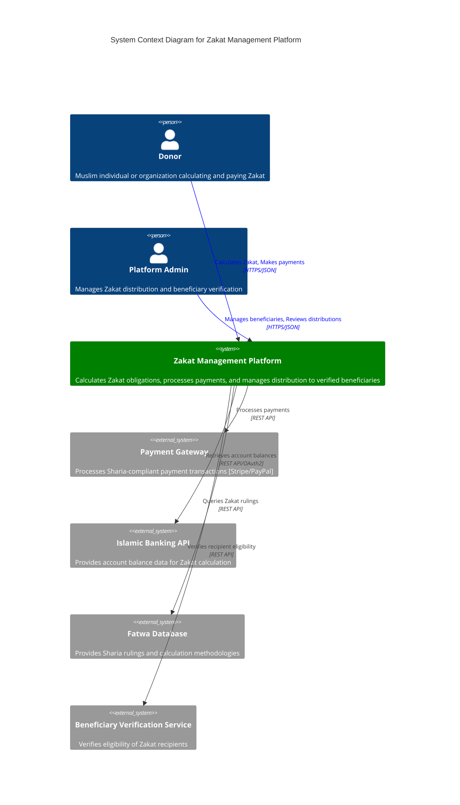
```mermaid
C4Context
    title System Context Diagram for Zakat Management Platform

    Person(donor, "Donor", "Muslim individual or organization calculating and paying Zakat")
    Person(admin, "Platform Admin", "Manages Zakat distribution and beneficiary verification")

    System(zakat, "Zakat Management Platform", "Calculates Zakat obligations, processes payments, and manages distribution to verified beneficiaries")

    System_Ext(payment, "Payment Gateway", "Processes Sharia-compliant payment transactions [Stripe/PayPal]")
    System_Ext(bank, "Islamic Banking API", "Provides account balance data for Zakat calculation")
    System_Ext(scholar, "Fatwa Database", "Provides Sharia rulings and calculation methodologies")
    System_Ext(beneficiary, "Beneficiary Verification Service", "Verifies eligibility of Zakat recipients")

    Rel(donor, zakat, "Calculates Zakat, Makes payments", "HTTPS/JSON")
    Rel(admin, zakat, "Manages beneficiaries, Reviews distributions", "HTTPS/JSON")
    Rel(zakat, payment, "Processes payments", "REST API")
    Rel(zakat, bank, "Retrieves account balances", "REST API/OAuth2")
    Rel(zakat, scholar, "Queries Zakat rulings", "REST API")
    Rel(zakat, beneficiary, "Verifies recipient eligibility", "REST API")

    UpdateElementStyle(zakat, $fontColor="white", $bgColor="green", $borderColor="darkgreen")
    UpdateRelStyle(donor, zakat, $textColor="blue", $lineColor="blue")
    UpdateRelStyle(admin, zakat, $textColor="blue", $lineColor="blue")
```

**Benefits**:

- Stakeholders immediately understand system boundaries and interactions
- No verbal explanation required during presentations
- Diagrams remain useful when reviewed months later
- Reduces misinterpretation and miscommunication

### 2. Keep It Simple

**Principle**: C4 is deliberately simple and pragmatic. Don't overcomplicate diagrams with unnecessary notation or complexity.

**Key Guidelines**:

- Use simple boxes and lines - avoid complex UML notation
- Show only relevant elements for the current abstraction level
- Limit the number of elements per diagram (5-9 for Context, 10-15 for Container)
- Focus on the 80/20 rule - document what matters most
- Prefer multiple simple diagrams over one complex diagram

**Example - Simple Container Diagram**:

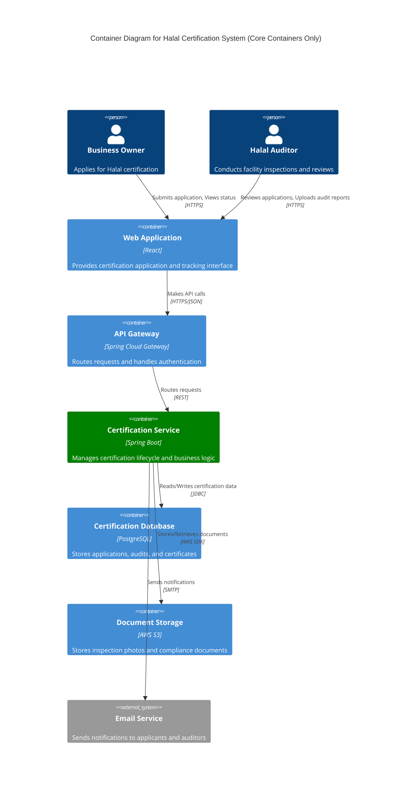
```mermaid
C4Container
    title Container Diagram for Halal Certification System (Core Containers Only)

    Person(applicant, "Business Owner", "Applies for Halal certification")
    Person(auditor, "Halal Auditor", "Conducts facility inspections and reviews")

    Container(web, "Web Application", "React", "Provides certification application and tracking interface")
    Container(api, "API Gateway", "Spring Cloud Gateway", "Routes requests and handles authentication")
    Container(cert_service, "Certification Service", "Spring Boot", "Manages certification lifecycle and business logic")
    Container(db, "Certification Database", "PostgreSQL", "Stores applications, audits, and certificates")
    Container(file_storage, "Document Storage", "AWS S3", "Stores inspection photos and compliance documents")

    System_Ext(email, "Email Service", "Sends notifications to applicants and auditors")

    Rel(applicant, web, "Submits application, Views status", "HTTPS")
    Rel(auditor, web, "Reviews applications, Uploads audit reports", "HTTPS")
    Rel(web, api, "Makes API calls", "HTTPS/JSON")
    Rel(api, cert_service, "Routes requests", "REST")
    Rel(cert_service, db, "Reads/Writes certification data", "JDBC")
    Rel(cert_service, file_storage, "Stores/Retrieves documents", "AWS SDK")
    Rel(cert_service, email, "Sends notifications", "SMTP")

    UpdateElementStyle(cert_service, $fontColor="white", $bgColor="green", $borderColor="darkgreen")
```

**Benefits**:

- Easier to understand and maintain
- Faster to create and update
- More likely to be kept current
- Better suited for presentations and discussions

### 3. Focus on Necessary Diagrams Only

**Principle**: Not every system needs all four levels of C4 diagrams. Create only what provides value.

**Decision Matrix**:

| Diagram Level      | When to Create                                               | When to Skip                                                     |
| ------------------ | ------------------------------------------------------------ | ---------------------------------------------------------------- |
| **System Context** | Always create for any system                                 | Never skip                                                       |
| **Container**      | Create for any multi-container system                        | Skip for single-deployment systems (e.g., monolithic mobile app) |
| **Component**      | Create for complex containers needing internal documentation | Skip for simple containers or when code is self-documenting      |
| **Code**           | Rarely create; use existing UML/ER diagrams if needed        | Skip unless specific regulatory or educational need              |

**Example - Minimal Viable Documentation Set**:

For a simple Halal product lookup mobile app:

1. **System Context** (Required):
   - Shows mobile app, users, and external Halal database API
   - Sufficient for stakeholder communication

2. **Container** (Skip):
   - Single mobile application deployment
   - No value in showing internal app architecture in Container diagram

3. **Component** (Optional):
   - Could document internal app architecture if complex
   - Better served by mobile app architecture diagrams (MVC/MVVM)

For a complex Islamic banking platform:

1. **System Context** (Required):
   - Shows integration with external systems (payment gateways, credit bureaus, central bank)

2. **Container** (Required):
   - Shows web apps, mobile apps, microservices, databases, message queues
   - Critical for understanding deployment and scaling

3. **Component** (Selective):
   - Create only for complex services (e.g., Murabaha financing calculator)
   - Skip for simple CRUD services

4. **Code** (Rarely):
   - Create only for critical algorithms (e.g., Tawarruq transaction flow)

### 4. Maintain Consistency

**Principle**: Use consistent naming, symbols, colors, and conventions across all diagrams in a system or organization.

**Consistency Guidelines**:

**Naming Conventions**:

- Use business terminology, not technical jargon
- Be consistent with plurality (e.g., "User" vs "Users")
- Match names across abstraction levels (Container names should match in Component diagrams)

**Color Conventions**:

- Gray: External systems/containers
- Blue: User-facing applications
- Green: Backend services/APIs
- Orange: Data stores
- Red: Security/authentication components

**Technology Labels**:

- Always include in square brackets: `[Spring Boot]`, `[React]`, `[PostgreSQL]`
- Use consistent technology names across diagrams
- Include version numbers only when relevant (e.g., `[Java 17]`)

**Example - Consistent Naming Across Levels**:

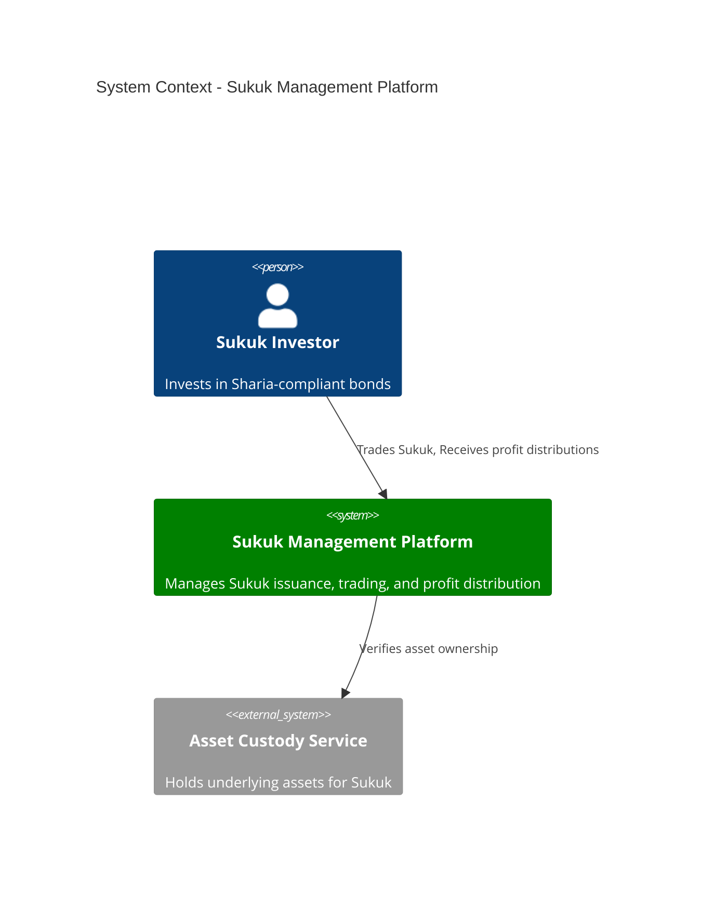
```mermaid
C4Context
    title System Context - Sukuk Management Platform

    Person(investor, "Sukuk Investor", "Invests in Sharia-compliant bonds")
    System(sukuk_platform, "Sukuk Management Platform", "Manages Sukuk issuance, trading, and profit distribution")
    System_Ext(custody, "Asset Custody Service", "Holds underlying assets for Sukuk")

    Rel(investor, sukuk_platform, "Trades Sukuk, Receives profit distributions")
    Rel(sukuk_platform, custody, "Verifies asset ownership")

    UpdateElementStyle(sukuk_platform, $fontColor="white", $bgColor="green", $borderColor="darkgreen")
```

**Corresponding Container Diagram**:

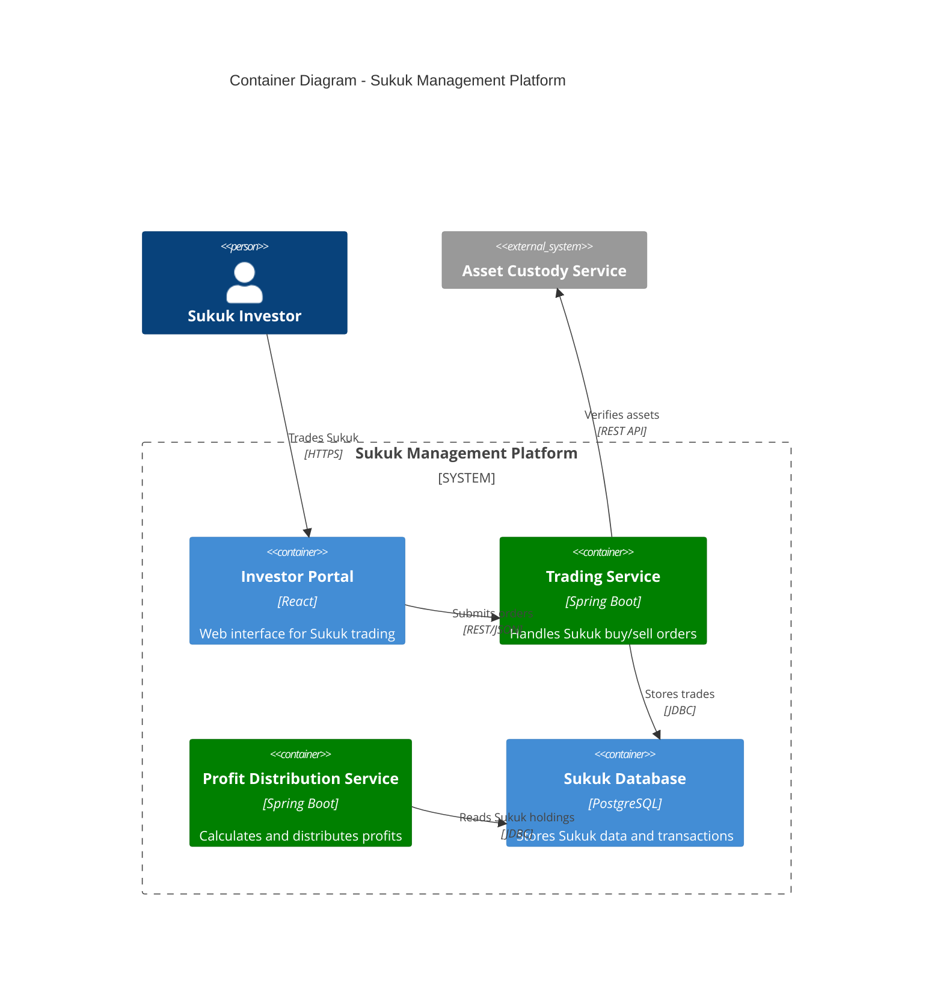
```mermaid
C4Container
    title Container Diagram - Sukuk Management Platform

    Person(investor, "Sukuk Investor")

    System_Boundary(sukuk_platform, "Sukuk Management Platform") {
        Container(web, "Investor Portal", "React", "Web interface for Sukuk trading")
        Container(trading_api, "Trading Service", "Spring Boot", "Handles Sukuk buy/sell orders")
        Container(profit_api, "Profit Distribution Service", "Spring Boot", "Calculates and distributes profits")
        Container(db, "Sukuk Database", "PostgreSQL", "Stores Sukuk data and transactions")
    }

    System_Ext(custody, "Asset Custody Service")

    Rel(investor, web, "Trades Sukuk", "HTTPS")
    Rel(web, trading_api, "Submits orders", "REST/JSON")
    Rel(trading_api, db, "Stores trades", "JDBC")
    Rel(profit_api, db, "Reads Sukuk holdings", "JDBC")
    Rel(trading_api, custody, "Verifies assets", "REST API")

    UpdateElementStyle(trading_api, $fontColor="white", $bgColor="green", $borderColor="darkgreen")
    UpdateElementStyle(profit_api, $fontColor="white", $bgColor="green", $borderColor="darkgreen")
```

**Note**: System name "Sukuk Management Platform" is identical across Context and Container diagrams. Services within the platform use consistent naming (e.g., "Trading Service" not "Trade Service" or "Trading API").

### 5. Iterative Refinement

**Principle**: Start with rough diagrams and refine them through collaboration and feedback.

**Iterative Process**:

1. **Initial Draft** (5-10 minutes):
   - Sketch boxes and lines on whiteboard or paper
   - Identify major elements and relationships
   - No colors, minimal labels

2. **Digital Version** (15-20 minutes):
   - Convert to C4 diagram using Structurizr DSL, PlantUML, or Mermaid
   - Add technology choices and basic descriptions
   - Share with team for initial feedback

3. **First Refinement** (after team review):
   - Clarify ambiguous relationships
   - Add missing external systems or containers
   - Improve element descriptions
   - Add legend if needed

4. **Stakeholder Review**:
   - Present to broader audience (architects, product managers, executives)
   - Gather questions and confusion points
   - Note what needs better explanation

5. **Final Polish**:
   - Add colors and visual hierarchy
   - Enhance descriptions based on feedback
   - Ensure consistency with other diagrams
   - Add diagram to documentation repository

6. **Continuous Updates**:
   - Review during architecture reviews
   - Update when system changes significantly
   - Schedule quarterly reviews to prevent drift

**Example - Evolution of a Diagram**:

**Version 1 (Initial Whiteboard Sketch)**:

```
[Donor] --> [Zakat System] --> [Payment Gateway]
              |
              v
         [Database]
```

**Version 2 (Basic Digital Diagram)**:

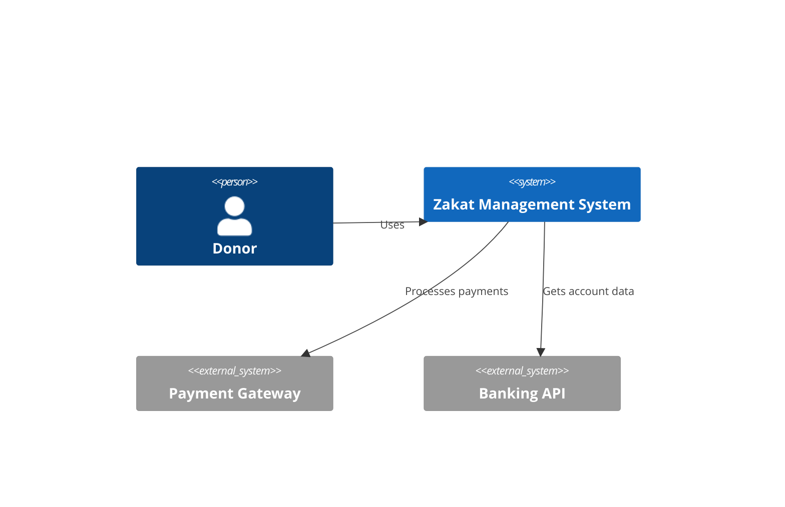
```mermaid
C4Context
    Person(donor, "Donor")
    System(zakat, "Zakat Management System")
    System_Ext(payment, "Payment Gateway")
    System_Ext(bank, "Banking API")

    Rel(donor, zakat, "Uses")
    Rel(zakat, payment, "Processes payments")
    Rel(zakat, bank, "Gets account data")
```

**Version 3 (After Feedback - Missing Scholars)**:

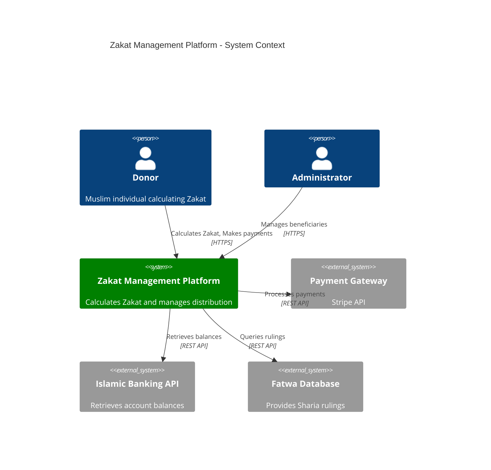
```mermaid
C4Context
    title Zakat Management Platform - System Context

    Person(donor, "Donor", "Muslim individual calculating Zakat")
    Person(admin, "Administrator")

    System(zakat, "Zakat Management Platform", "Calculates Zakat and manages distribution")

    System_Ext(payment, "Payment Gateway", "Stripe API")
    System_Ext(bank, "Islamic Banking API", "Retrieves account balances")
    System_Ext(scholar, "Fatwa Database", "Provides Sharia rulings")

    Rel(donor, zakat, "Calculates Zakat, Makes payments", "HTTPS")
    Rel(admin, zakat, "Manages beneficiaries", "HTTPS")
    Rel(zakat, payment, "Processes payments", "REST API")
    Rel(zakat, bank, "Retrieves balances", "REST API")
    Rel(zakat, scholar, "Queries rulings", "REST API")

    UpdateElementStyle(zakat, $fontColor="white", $bgColor="green", $borderColor="darkgreen")
```

### 6. Diagram-as-Code Approach

**Principle**: Store diagrams as code in version control alongside application code for better collaboration, automation, and maintenance.

**Benefits**:

- **Version Control**: Track changes over time with Git
- **Collaboration**: Review diagram changes through pull requests
- **Automation**: Generate diagrams automatically in CI/CD pipelines
- **Consistency**: Enforce standards through linting and validation
- **Search**: Find diagrams using code search tools
- **Documentation**: Keep diagrams close to code they document

**Recommended Tools**:

1. **Structurizr DSL** (Recommended for large enterprises):
   - Domain-specific language for C4 diagrams
   - Strong tooling and validation
   - Official C4 model support

2. **PlantUML with C4-PlantUML** (Good for existing PlantUML users):
   - Extends familiar PlantUML syntax
   - Wide tool support

3. **Mermaid C4 Diagrams** (Good for GitHub/GitLab users):
   - Native support in GitHub/GitLab markdown
   - Simpler syntax, less feature-rich

**Example - Structurizr DSL**:

```dsl
workspace "Halal Certification Platform" {
    model {
        applicant = person "Business Owner" "Applies for Halal certification"
        auditor = person "Halal Auditor" "Conducts facility inspections"

        certificationSystem = softwareSystem "Halal Certification System" {
            webApp = container "Web Application" "React" "Provides certification application interface"
            apiGateway = container "API Gateway" "Spring Cloud Gateway" "Routes requests"
            certService = container "Certification Service" "Spring Boot" "Manages certification lifecycle"
            database = container "Certification Database" "PostgreSQL" "Stores certification data"
        }

        emailService = softwareSystem "Email Service" "Sends notifications" "External"

        applicant -> webApp "Submits application"
        auditor -> webApp "Reviews applications"
        webApp -> apiGateway "Makes API calls" "HTTPS/JSON"
        apiGateway -> certService "Routes requests" "REST"
        certService -> database "Reads/Writes data" "JDBC"
        certService -> emailService "Sends notifications" "SMTP"
    }

    views {
        systemContext certificationSystem {
            include *
            autolayout lr
        }

        container certificationSystem {
            include *
            autolayout lr
        }
    }
}
```

**Integration with CI/CD**:

```yaml
# .github/workflows/docs.yml
name: Generate Architecture Diagrams

on:
  push:
    paths:
      - "docs/architecture/**/*.dsl"
      - "docs/architecture/**/*.puml"

jobs:
  generate-diagrams:
    runs-on: ubuntu-latest
    steps:
      - uses: actions/checkout@v3

      - name: Generate Structurizr diagrams
        run: |
          docker run -v $(pwd):/workspace structurizr/cli export \
            -workspace /workspace/docs/architecture/workspace.dsl \
            -format png -output /workspace/docs/architecture/diagrams

      - name: Commit generated diagrams
        run: |
          git config user.name "GitHub Actions"
          git config user.email "actions@github.com"
          git add docs/architecture/diagrams
          git commit -m "docs: regenerate architecture diagrams" || exit 0
          git push
```

### 7. Proper Use of Abstraction Levels

**Principle**: Each C4 level should focus on its specific abstraction without mixing concerns from other levels.

**Level-Specific Guidelines**:

**System Context**:

- Show only software systems (not containers or components)
- External systems should be high-level (e.g., "Payment Gateway" not "Stripe API Server")
- Focus on what systems do, not how they work

**Container**:

- Show runtime containers (deployable units)
- Each container should be independently deployable/scalable
- Include databases, file stores, message queues
- Don't show implementation details (classes, functions)

**Component**:

- Show major structural components within a container
- Focus on high-level groupings (controllers, services, repositories)
- Don't show every class or module
- Stop before reaching code-level details

**Code**:

- Rarely needed
- Show actual code entities (classes, interfaces)
- Use standard UML class diagrams or ER diagrams instead

**Example - Correct Abstraction Level Usage**:

**System Context** (Correct - Shows Systems):

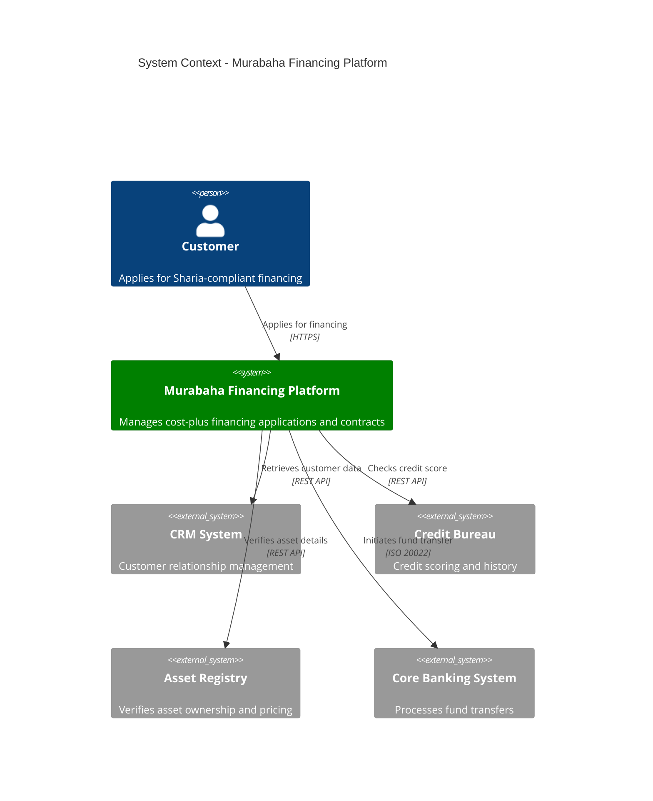
```mermaid
C4Context
    title System Context - Murabaha Financing Platform

    Person(customer, "Customer", "Applies for Sharia-compliant financing")

    System(murabaha, "Murabaha Financing Platform", "Manages cost-plus financing applications and contracts")

    System_Ext(crm, "CRM System", "Customer relationship management")
    System_Ext(credit, "Credit Bureau", "Credit scoring and history")
    System_Ext(asset, "Asset Registry", "Verifies asset ownership and pricing")
    System_Ext(bank, "Core Banking System", "Processes fund transfers")

    Rel(customer, murabaha, "Applies for financing", "HTTPS")
    Rel(murabaha, crm, "Retrieves customer data", "REST API")
    Rel(murabaha, credit, "Checks credit score", "REST API")
    Rel(murabaha, asset, "Verifies asset details", "REST API")
    Rel(murabaha, bank, "Initiates fund transfer", "ISO 20022")

    UpdateElementStyle(murabaha, $fontColor="white", $bgColor="green", $borderColor="darkgreen")
```

**Container** (Correct - Shows Deployable Units):

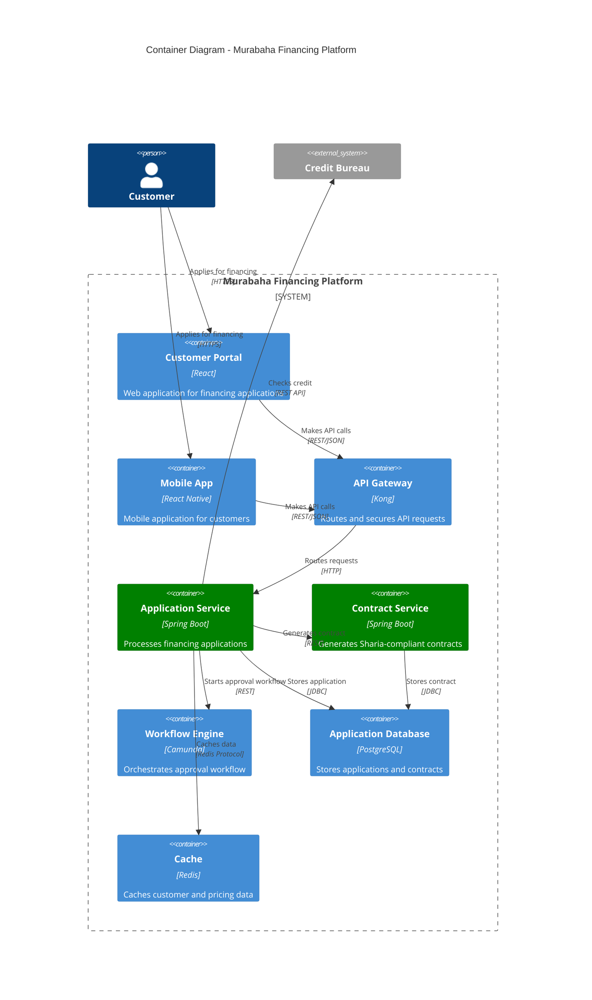
```mermaid
C4Container
    title Container Diagram - Murabaha Financing Platform

    Person(customer, "Customer")

    System_Boundary(murabaha, "Murabaha Financing Platform") {
        Container(web, "Customer Portal", "React", "Web application for financing applications")
        Container(mobile, "Mobile App", "React Native", "Mobile application for customers")
        Container(api_gateway, "API Gateway", "Kong", "Routes and secures API requests")
        Container(application_service, "Application Service", "Spring Boot", "Processes financing applications")
        Container(contract_service, "Contract Service", "Spring Boot", "Generates Sharia-compliant contracts")
        Container(workflow_engine, "Workflow Engine", "Camunda", "Orchestrates approval workflow")
        Container(db, "Application Database", "PostgreSQL", "Stores applications and contracts")
        Container(cache, "Cache", "Redis", "Caches customer and pricing data")
    }

    System_Ext(credit, "Credit Bureau")

    Rel(customer, web, "Applies for financing", "HTTPS")
    Rel(customer, mobile, "Applies for financing", "HTTPS")
    Rel(web, api_gateway, "Makes API calls", "REST/JSON")
    Rel(mobile, api_gateway, "Makes API calls", "REST/JSON")
    Rel(api_gateway, application_service, "Routes requests", "HTTP")
    Rel(application_service, workflow_engine, "Starts approval workflow", "REST")
    Rel(application_service, contract_service, "Generates contract", "REST")
    Rel(application_service, db, "Stores application", "JDBC")
    Rel(contract_service, db, "Stores contract", "JDBC")
    Rel(application_service, cache, "Caches data", "Redis Protocol")
    Rel(application_service, credit, "Checks credit", "REST API")

    UpdateElementStyle(application_service, $fontColor="white", $bgColor="green", $borderColor="darkgreen")
    UpdateElementStyle(contract_service, $fontColor="white", $bgColor="green", $borderColor="darkgreen")
```

**Component** (Correct - Shows Major Structural Components):

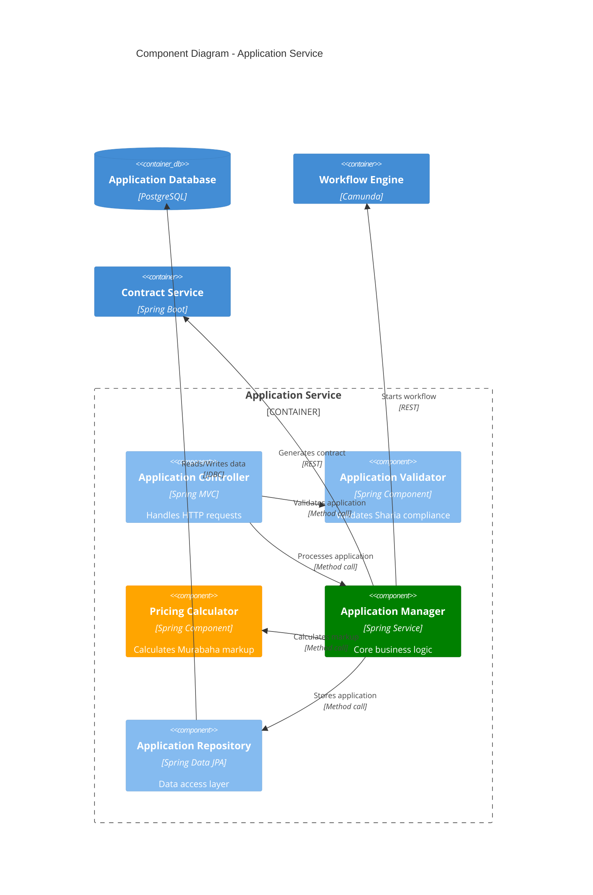
```mermaid
C4Component
    title Component Diagram - Application Service

    Container_Boundary(application_service, "Application Service") {
        Component(controller, "Application Controller", "Spring MVC", "Handles HTTP requests")
        Component(validation, "Application Validator", "Spring Component", "Validates Sharia compliance")
        Component(pricing, "Pricing Calculator", "Spring Component", "Calculates Murabaha markup")
        Component(service, "Application Manager", "Spring Service", "Core business logic")
        Component(repository, "Application Repository", "Spring Data JPA", "Data access layer")
    }

    ContainerDb(db, "Application Database", "PostgreSQL")
    Container(workflow_engine, "Workflow Engine", "Camunda")
    Container(contract_service, "Contract Service", "Spring Boot")

    Rel(controller, validation, "Validates application", "Method call")
    Rel(controller, service, "Processes application", "Method call")
    Rel(service, pricing, "Calculates markup", "Method call")
    Rel(service, repository, "Stores application", "Method call")
    Rel(service, workflow_engine, "Starts workflow", "REST")
    Rel(service, contract_service, "Generates contract", "REST")
    Rel(repository, db, "Reads/Writes data", "JDBC")

    UpdateElementStyle(service, $fontColor="white", $bgColor="green", $borderColor="darkgreen")
    UpdateElementStyle(pricing, $fontColor="white", $bgColor="orange", $borderColor="darkorange")
```

## Common Antipatterns

### 1. Mixing Container and Component Abstractions

**Problem**: Showing both containers (deployable units) and components (internal code structures) in the same diagram.

**Why It's Wrong**:

- Violates separation of abstraction levels
- Creates confusion about deployment boundaries
- Makes diagrams harder to understand
- Loses the clarity that makes C4 valuable

**Example - Incorrect Mixing**:

```
❌ Container Diagram (WRONG - Mixes Containers and Components)

[Web Application - React] ---> [API Gateway - Kong]
[Mobile App - React Native] -> [API Gateway - Kong]

[API Gateway] ---> [UserController - Spring MVC]  ⚠️ Component, not Container!
[API Gateway] ---> [OrderController - Spring MVC]  ⚠️ Component, not Container!

[UserController] ---> [User Service - Spring Boot]  ✓ Container
[OrderController] ---> [Order Service - Spring Boot]  ✓ Container
```

**Correct Approach**:

Create separate diagrams for each abstraction level:

**Container Diagram**:

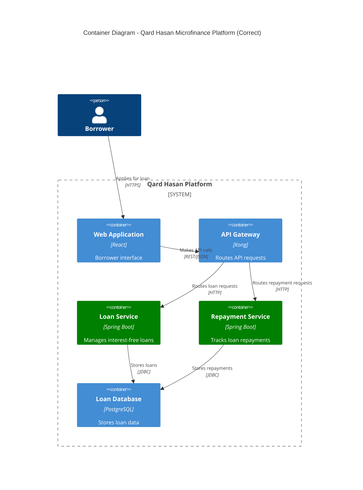
```mermaid
C4Container
    title Container Diagram - Qard Hasan Microfinance Platform (Correct)

    Person(borrower, "Borrower")

    System_Boundary(qard, "Qard Hasan Platform") {
        Container(web, "Web Application", "React", "Borrower interface")
        Container(api_gateway, "API Gateway", "Kong", "Routes API requests")
        Container(loan_service, "Loan Service", "Spring Boot", "Manages interest-free loans")
        Container(repayment_service, "Repayment Service", "Spring Boot", "Tracks loan repayments")
        Container(db, "Loan Database", "PostgreSQL", "Stores loan data")
    }

    Rel(borrower, web, "Applies for loan", "HTTPS")
    Rel(web, api_gateway, "Makes API calls", "REST/JSON")
    Rel(api_gateway, loan_service, "Routes loan requests", "HTTP")
    Rel(api_gateway, repayment_service, "Routes repayment requests", "HTTP")
    Rel(loan_service, db, "Stores loans", "JDBC")
    Rel(repayment_service, db, "Stores repayments", "JDBC")

    UpdateElementStyle(loan_service, $fontColor="white", $bgColor="green", $borderColor="darkgreen")
    UpdateElementStyle(repayment_service, $fontColor="white", $bgColor="green", $borderColor="darkgreen")
```

**Component Diagram for Loan Service** (Separate diagram):

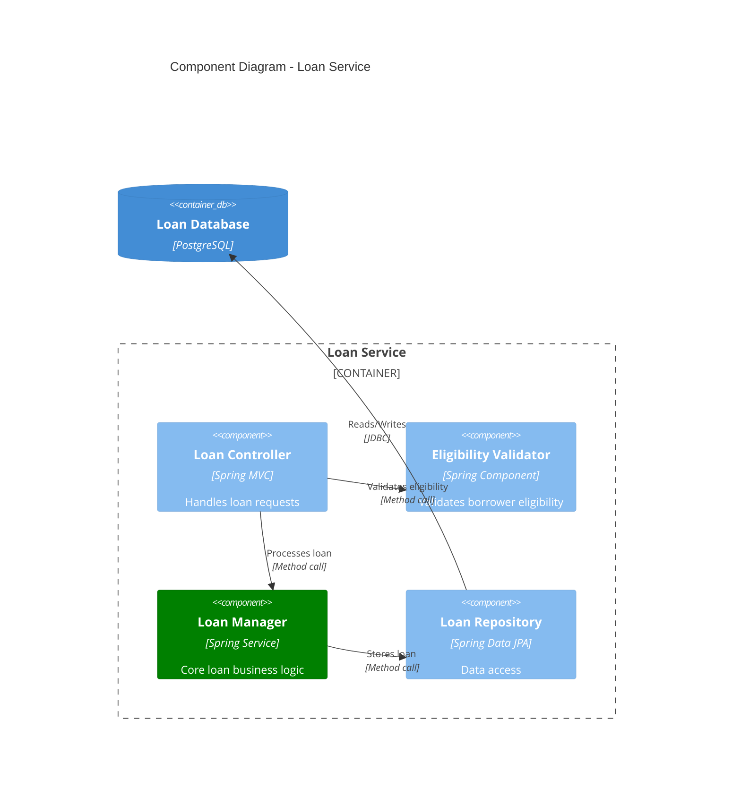
```mermaid
C4Component
    title Component Diagram - Loan Service

    Container_Boundary(loan_service, "Loan Service") {
        Component(loan_controller, "Loan Controller", "Spring MVC", "Handles loan requests")
        Component(eligibility_validator, "Eligibility Validator", "Spring Component", "Validates borrower eligibility")
        Component(loan_manager, "Loan Manager", "Spring Service", "Core loan business logic")
        Component(loan_repository, "Loan Repository", "Spring Data JPA", "Data access")
    }

    ContainerDb(db, "Loan Database", "PostgreSQL")

    Rel(loan_controller, eligibility_validator, "Validates eligibility", "Method call")
    Rel(loan_controller, loan_manager, "Processes loan", "Method call")
    Rel(loan_manager, loan_repository, "Stores loan", "Method call")
    Rel(loan_repository, db, "Reads/Writes", "JDBC")

    UpdateElementStyle(loan_manager, $fontColor="white", $bgColor="green", $borderColor="darkgreen")
```

### 2. Adding Arbitrary Abstraction Levels

**Problem**: Creating custom abstraction levels between the standard four C4 levels (e.g., "Service", "Module", "Subsystem").

**Why It's Wrong**:

- Defeats the purpose of a standard model
- Creates confusion about what each diagram shows
- Makes it harder to onboard new team members
- Reduces interoperability with C4 tooling

**Common Violations**:

- "Service Layer" diagram (between Container and Component)
- "Module" diagram (between Component and Code)
- "Microservice Group" diagram (between System Context and Container)

**Example - Incorrect Custom Level**:

```
❌ "Service Layer" Diagram (NOT a standard C4 level)

This diagram shows "services" which are neither Containers nor Components
```

**Correct Approach**:

Use standard C4 levels with clear boundaries:

1. If "services" are deployable units → Use Container diagram
2. If "services" are code groupings within a container → Use Component diagram
3. If you need both views → Create both Container and Component diagrams

### 3. Overusing Subsystems

**Problem**: Creating "subsystem" groupings that don't represent actual deployment or logical boundaries.

**Why It's Wrong**:

- Adds visual complexity without adding clarity
- Often represents organizational structure rather than system structure
- Can hide important direct relationships
- Makes diagrams harder to understand

**Example - Incorrect Subsystem Usage**:

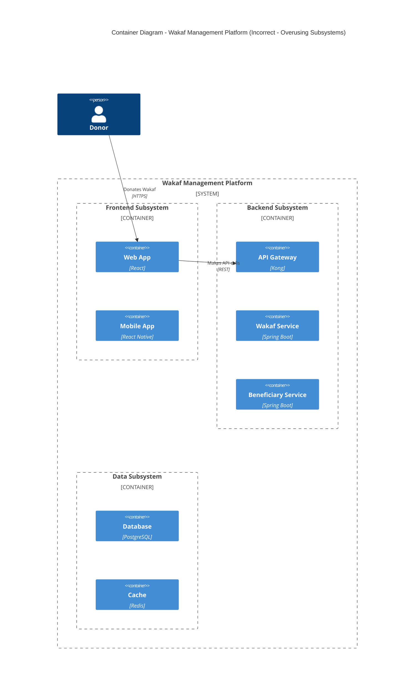
```mermaid
C4Container
    title Container Diagram - Wakaf Management Platform (Incorrect - Overusing Subsystems)

    Person(donor, "Donor")

    System_Boundary(wakaf, "Wakaf Management Platform") {
        Container_Boundary(frontend_subsystem, "Frontend Subsystem") {
            Container(web, "Web App", "React")
            Container(mobile, "Mobile App", "React Native")
        }

        Container_Boundary(backend_subsystem, "Backend Subsystem") {
            Container(api, "API Gateway", "Kong")
            Container(wakaf_service, "Wakaf Service", "Spring Boot")
            Container(beneficiary_service, "Beneficiary Service", "Spring Boot")
        }

        Container_Boundary(data_subsystem, "Data Subsystem") {
            Container(db, "Database", "PostgreSQL")
            Container(cache, "Cache", "Redis")
        }
    }

    Rel(donor, web, "Donates Wakaf", "HTTPS")
    Rel(web, api, "Makes API calls", "REST")
```

**Problem**: The "subsystems" add no value - they just group similar container types.

**Correct Approach**:

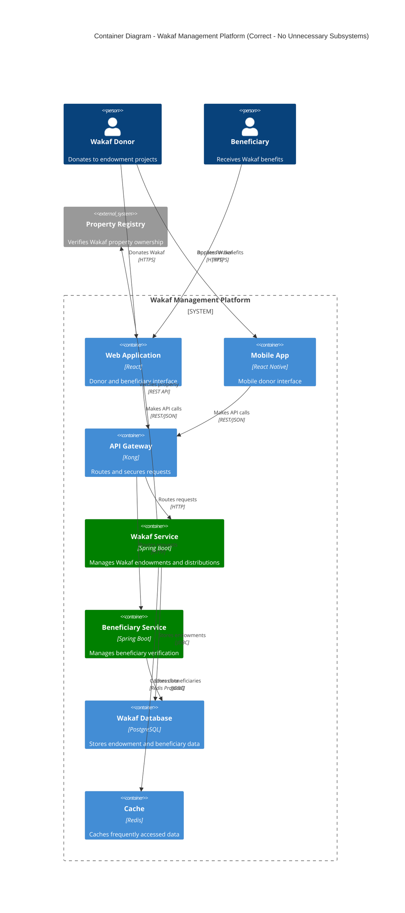
```mermaid
C4Container
    title Container Diagram - Wakaf Management Platform (Correct - No Unnecessary Subsystems)

    Person(donor, "Wakaf Donor", "Donates to endowment projects")
    Person(beneficiary, "Beneficiary", "Receives Wakaf benefits")

    System_Boundary(wakaf, "Wakaf Management Platform") {
        Container(web, "Web Application", "React", "Donor and beneficiary interface")
        Container(mobile, "Mobile App", "React Native", "Mobile donor interface")
        Container(api, "API Gateway", "Kong", "Routes and secures requests")
        Container(wakaf_service, "Wakaf Service", "Spring Boot", "Manages Wakaf endowments and distributions")
        Container(beneficiary_service, "Beneficiary Service", "Spring Boot", "Manages beneficiary verification")
        Container(db, "Wakaf Database", "PostgreSQL", "Stores endowment and beneficiary data")
        Container(cache, "Cache", "Redis", "Caches frequently accessed data")
    }

    System_Ext(property_registry, "Property Registry", "Verifies Wakaf property ownership")

    Rel(donor, web, "Donates Wakaf", "HTTPS")
    Rel(donor, mobile, "Donates Wakaf", "HTTPS")
    Rel(beneficiary, web, "Applies for benefits", "HTTPS")
    Rel(web, api, "Makes API calls", "REST/JSON")
    Rel(mobile, api, "Makes API calls", "REST/JSON")
    Rel(api, wakaf_service, "Routes requests", "HTTP")
    Rel(api, beneficiary_service, "Routes requests", "HTTP")
    Rel(wakaf_service, db, "Stores endowments", "JDBC")
    Rel(wakaf_service, cache, "Caches data", "Redis Protocol")
    Rel(beneficiary_service, db, "Stores beneficiaries", "JDBC")
    Rel(wakaf_service, property_registry, "Verifies property", "REST API")

    UpdateElementStyle(wakaf_service, $fontColor="white", $bgColor="green", $borderColor="darkgreen")
    UpdateElementStyle(beneficiary_service, $fontColor="white", $bgColor="green", $borderColor="darkgreen")
```

**When Subsystems ARE Appropriate**:

Subsystems make sense when they represent actual logical or physical boundaries:

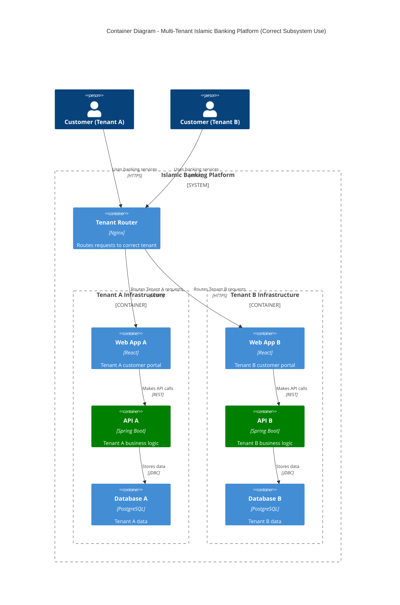
```mermaid
C4Container
    title Container Diagram - Multi-Tenant Islamic Banking Platform (Correct Subsystem Use)

    Person(customer_a, "Customer (Tenant A)")
    Person(customer_b, "Customer (Tenant B)")

    System_Boundary(platform, "Islamic Banking Platform") {
        Container(router, "Tenant Router", "Nginx", "Routes requests to correct tenant")

        Container_Boundary(tenant_a, "Tenant A Infrastructure") {
            Container(web_a, "Web App A", "React", "Tenant A customer portal")
            Container(api_a, "API A", "Spring Boot", "Tenant A business logic")
            Container(db_a, "Database A", "PostgreSQL", "Tenant A data")
        }

        Container_Boundary(tenant_b, "Tenant B Infrastructure") {
            Container(web_b, "Web App B", "React", "Tenant B customer portal")
            Container(api_b, "API B", "Spring Boot", "Tenant B business logic")
            Container(db_b, "Database B", "PostgreSQL", "Tenant B data")
        }
    }

    Rel(customer_a, router, "Uses banking services", "HTTPS")
    Rel(customer_b, router, "Uses banking services", "HTTPS")
    Rel(router, web_a, "Routes Tenant A requests", "HTTPS")
    Rel(router, web_b, "Routes Tenant B requests", "HTTPS")
    Rel(web_a, api_a, "Makes API calls", "REST")
    Rel(web_b, api_b, "Makes API calls", "REST")
    Rel(api_a, db_a, "Stores data", "JDBC")
    Rel(api_b, db_b, "Stores data", "JDBC")

    UpdateElementStyle(api_a, $fontColor="white", $bgColor="green", $borderColor="darkgreen")
    UpdateElementStyle(api_b, $fontColor="white", $bgColor="green", $borderColor="darkgreen")
```

Here, subsystems represent actual deployment isolation between tenants.

### 4. Detailing External Containers

**Problem**: Showing internal implementation details of external systems that you don't own or control.

**Why It's Wrong**:

- Violates abstraction boundaries (external systems should be black boxes)
- Creates maintenance burden when external systems change
- Adds clutter without adding value
- Confuses ownership and responsibility

**Example - Incorrect External System Detail**:

```
❌ System Context (WRONG - Shows internal details of external system)

[Takaful Platform] ---> [Payment Gateway Web Server]
                   ---> [Payment Gateway Database]
                   ---> [Payment Gateway Message Queue]

⚠️ Shows internal containers of external "Payment Gateway" system
```

**Correct Approach**:

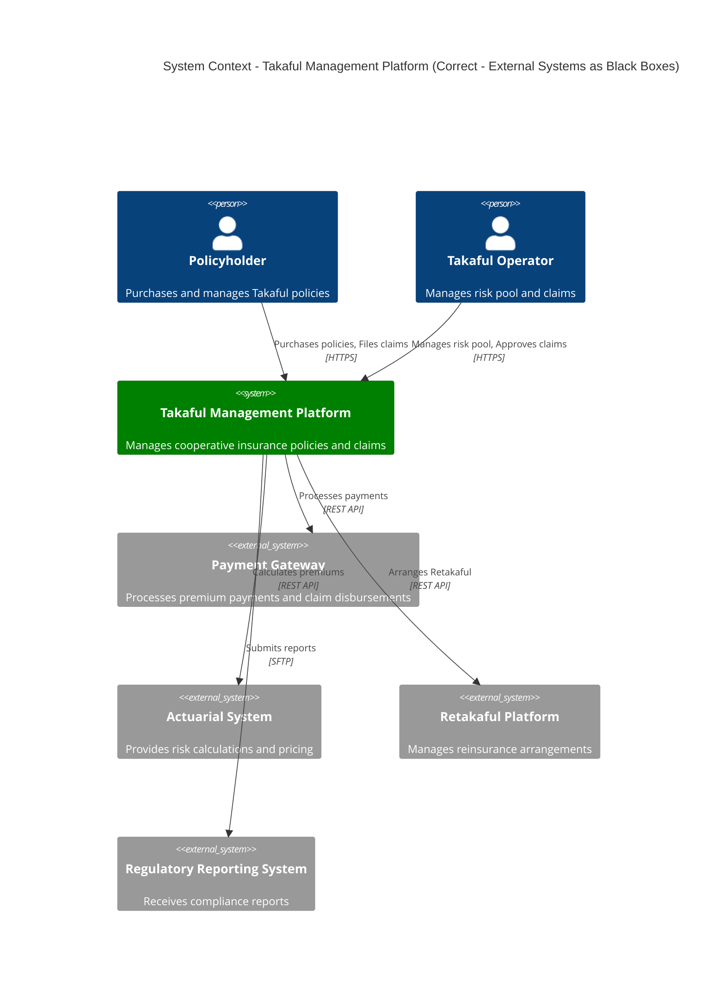
```mermaid
C4Context
    title System Context - Takaful Management Platform (Correct - External Systems as Black Boxes)

    Person(policyholder, "Policyholder", "Purchases and manages Takaful policies")
    Person(operator, "Takaful Operator", "Manages risk pool and claims")

    System(takaful, "Takaful Management Platform", "Manages cooperative insurance policies and claims")

    System_Ext(payment, "Payment Gateway", "Processes premium payments and claim disbursements")
    System_Ext(actuarial, "Actuarial System", "Provides risk calculations and pricing")
    System_Ext(reinsurance, "Retakaful Platform", "Manages reinsurance arrangements")
    System_Ext(regulatory, "Regulatory Reporting System", "Receives compliance reports")

    Rel(policyholder, takaful, "Purchases policies, Files claims", "HTTPS")
    Rel(operator, takaful, "Manages risk pool, Approves claims", "HTTPS")
    Rel(takaful, payment, "Processes payments", "REST API")
    Rel(takaful, actuarial, "Calculates premiums", "REST API")
    Rel(takaful, reinsurance, "Arranges Retakaful", "REST API")
    Rel(takaful, regulatory, "Submits reports", "SFTP")

    UpdateElementStyle(takaful, $fontColor="white", $bgColor="green", $borderColor="darkgreen")
```

**When to Show External System Details**:

Only show external system internals if:

1. You own/control the external system (e.g., legacy system you're integrating)
2. You're documenting integration architecture and need to show specific integration points
3. You're creating a Container diagram that zooms into a previously external system

### 5. Ambiguous Diagrams Without Legends or Labels

**Problem**: Creating diagrams without sufficient context, labels, or explanations.

**Why It's Wrong**:

- Requires verbal explanation (diagrams should be self-explanatory)
- Different stakeholders interpret diagrams differently
- Diagrams lose value when reviewed later
- Wastes time in meetings explaining unclear elements

**Example - Ambiguous Diagram**:

```
❌ Ambiguous Container Diagram (Missing context)

[Web] ---> [API] ---> [DB]
 |
 v
[Queue]

⚠️ No title, no technology choices, no relationship labels
⚠️ Unclear what "API" does or why Queue is needed
```

**Correct Approach**:

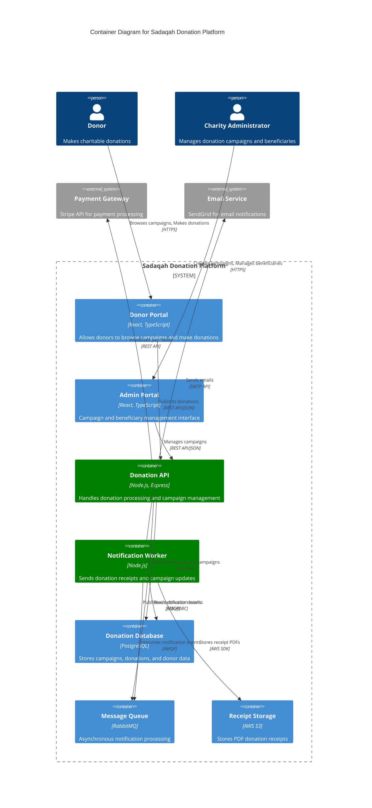
```mermaid
C4Container
    title Container Diagram for Sadaqah Donation Platform

    Person(donor, "Donor", "Makes charitable donations")
    Person(charity_admin, "Charity Administrator", "Manages donation campaigns and beneficiaries")

    System_Boundary(sadaqah, "Sadaqah Donation Platform") {
        Container(web, "Donor Portal", "React, TypeScript", "Allows donors to browse campaigns and make donations")
        Container(admin_web, "Admin Portal", "React, TypeScript", "Campaign and beneficiary management interface")
        Container(api, "Donation API", "Node.js, Express", "Handles donation processing and campaign management")
        Container(notification_worker, "Notification Worker", "Node.js", "Sends donation receipts and campaign updates")
        Container(db, "Donation Database", "PostgreSQL", "Stores campaigns, donations, and donor data")
        Container(queue, "Message Queue", "RabbitMQ", "Asynchronous notification processing")
        Container(storage, "Receipt Storage", "AWS S3", "Stores PDF donation receipts")
    }

    System_Ext(payment, "Payment Gateway", "Stripe API for payment processing")
    System_Ext(email, "Email Service", "SendGrid for email notifications")

    Rel(donor, web, "Browses campaigns, Makes donations", "HTTPS")
    Rel(charity_admin, admin_web, "Creates campaigns, Manages beneficiaries", "HTTPS")
    Rel(web, api, "Submits donations", "REST API/JSON")
    Rel(admin_web, api, "Manages campaigns", "REST API/JSON")
    Rel(api, db, "Stores donations and campaigns", "SQL/JDBC")
    Rel(api, payment, "Processes payments", "REST API")
    Rel(api, queue, "Publishes notification events", "AMQP")
    Rel(notification_worker, queue, "Consumes notification events", "AMQP")
    Rel(notification_worker, db, "Reads donation details", "SQL/JDBC")
    Rel(notification_worker, storage, "Stores receipt PDFs", "AWS SDK")
    Rel(notification_worker, email, "Sends emails", "SMTP API")

    UpdateElementStyle(api, $fontColor="white", $bgColor="green", $borderColor="darkgreen")
    UpdateElementStyle(notification_worker, $fontColor="white", $bgColor="green", $borderColor="darkgreen")
```

**Legend** (when colors/symbols have specific meaning):

```markdown
### Diagram Legend

**Colors**:

- Green: Core platform services
- Blue: User-facing applications
- Orange: Data stores
- Gray: External systems

**Relationships**:

- Solid lines: Synchronous calls
- Dashed lines: Asynchronous messaging

**Technologies**:

- All technology choices shown in square brackets [Technology Name]
```

### 6. Using C4 for Wrong System Types

**Problem**: Applying C4 model to systems where it doesn't fit well.

**Why It's Wrong**:

- C4 is designed for software systems with runtime deployment
- Some systems don't have clear container/component abstractions
- Forces artificial modeling that doesn't reflect reality

**Inappropriate Use Cases**:

1. **Embedded Systems**: Firmware with no clear deployment separation
2. **Libraries/SDKs**: Reusable code without independent deployment
3. **Infrastructure as Code**: Terraform/CloudFormation templates
4. **Data Pipelines**: ETL workflows (better suited for flow diagrams)
5. **Mobile Apps (Simple)**: Single deployment unit with no backend

**Example - Inappropriate Use**:

```
❌ C4 Container Diagram for Simple Mobile App (WRONG)

Container: Mobile App [React Native]
Container: Local Database [SQLite]
Container: User Interface Layer [React Components]
Container: Business Logic Layer [JavaScript Classes]

⚠️ These aren't separate deployable containers - they're all part of one mobile app
⚠️ Better to skip Container diagram or use mobile app architecture patterns (MVVM, MVC)
```

**When C4 IS Appropriate for Mobile**:

When the mobile app is part of a larger distributed system:

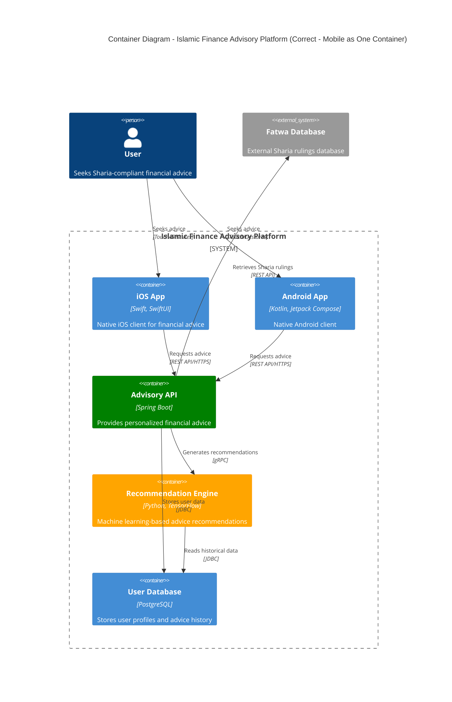
```mermaid
C4Container
    title Container Diagram - Islamic Finance Advisory Platform (Correct - Mobile as One Container)

    Person(user, "User", "Seeks Sharia-compliant financial advice")

    System_Boundary(advisory, "Islamic Finance Advisory Platform") {
        Container(ios_app, "iOS App", "Swift, SwiftUI", "Native iOS client for financial advice")
        Container(android_app, "Android App", "Kotlin, Jetpack Compose", "Native Android client")
        Container(api, "Advisory API", "Spring Boot", "Provides personalized financial advice")
        Container(ml_service, "Recommendation Engine", "Python, TensorFlow", "Machine learning-based advice recommendations")
        Container(db, "User Database", "PostgreSQL", "Stores user profiles and advice history")
    }

    System_Ext(fatwa_db, "Fatwa Database", "External Sharia rulings database")

    Rel(user, ios_app, "Seeks advice", "Touch/Gestures")
    Rel(user, android_app, "Seeks advice", "Touch/Gestures")
    Rel(ios_app, api, "Requests advice", "REST API/HTTPS")
    Rel(android_app, api, "Requests advice", "REST API/HTTPS")
    Rel(api, ml_service, "Generates recommendations", "gRPC")
    Rel(api, db, "Stores user data", "JDBC")
    Rel(api, fatwa_db, "Retrieves Sharia rulings", "REST API")
    Rel(ml_service, db, "Reads historical data", "JDBC")

    UpdateElementStyle(api, $fontColor="white", $bgColor="green", $borderColor="darkgreen")
    UpdateElementStyle(ml_service, $fontColor="white", $bgColor="orange", $borderColor="darkorange")
```

Here, mobile apps are legitimate containers in a distributed system.

**Better Alternatives for Inappropriate Cases**:

- **Embedded Systems**: Hardware architecture diagrams, state machines
- **Libraries**: Package diagrams, dependency graphs
- **IaC**: Resource topology diagrams, deployment diagrams
- **Data Pipelines**: Data flow diagrams, workflow diagrams
- **Simple Mobile Apps**: MVVM/MVC architecture diagrams

## Summary of Best Practices

| Practice                        | Key Guideline                                       | Benefit                             |
| ------------------------------- | --------------------------------------------------- | ----------------------------------- |
| **Avoid Ambiguity**             | Include titles, labels, legends, technology choices | Self-explanatory diagrams           |
| **Keep It Simple**              | Use simple boxes/lines, limit elements per diagram  | Easy to understand and maintain     |
| **Focus on Necessary Diagrams** | Create only Context + Container for most systems    | Avoid documentation overhead        |
| **Maintain Consistency**        | Use consistent naming, colors, technology labels    | Professional, unified documentation |
| **Iterative Refinement**        | Start rough, refine through feedback                | Collaborative, evolving diagrams    |
| **Diagram-as-Code**             | Store in version control, generate in CI/CD         | Automated, versioned, searchable    |
| **Proper Abstraction Levels**   | Keep each level focused on its specific concern     | Clear separation of concerns        |

## Summary of Antipatterns

| Antipattern                    | Problem                                        | Solution                                     |
| ------------------------------ | ---------------------------------------------- | -------------------------------------------- |
| **Mixing Abstractions**        | Containers and Components in same diagram      | Create separate diagrams for each level      |
| **Arbitrary Levels**           | Custom levels between standard C4 levels       | Stick to four standard levels                |
| **Overusing Subsystems**       | Groupings that don't represent real boundaries | Use subsystems only for actual isolation     |
| **Detailing External Systems** | Showing internals of systems you don't own     | Keep external systems as black boxes         |
| **Ambiguous Diagrams**         | Missing labels, legends, context               | Add sufficient descriptive text              |
| **Wrong System Types**         | Using C4 for embedded systems, libraries, IaC  | Use C4 only for distributed software systems |

## Practical Checklist

Before finalizing a C4 diagram, verify:

**General Quality**:

- [ ] Diagram has a clear, descriptive title
- [ ] All elements have meaningful names
- [ ] All relationships have verb labels describing the interaction
- [ ] Technology choices are included in square brackets
- [ ] Legend is provided if colors/symbols have specific meaning
- [ ] Diagram is stored as code in version control

**Abstraction Level**:

- [ ] Diagram uses only elements appropriate for its level (System/Container/Component)
- [ ] No mixing of abstraction levels in a single diagram
- [ ] External systems are shown as black boxes (no internal details)
- [ ] Subsystems represent real boundaries, not arbitrary groupings

**Clarity**:

- [ ] Diagram is understandable without verbal explanation
- [ ] Number of elements is manageable (5-9 for Context, 10-15 for Container)
- [ ] Layout is clean with minimal line crossings
- [ ] Colors enhance understanding rather than add confusion

**Consistency**:

- [ ] Naming matches across diagram levels
- [ ] Technology labels are consistent across diagrams
- [ ] Visual style matches other diagrams in the system
- [ ] Business terminology is used, not technical jargon

## Further Reading

**Official C4 Resources**:

- C4 Model Website: <https://c4model.com/>
- C4 Model FAQ: <https://c4model.com/#faq>
- Structurizr (C4 tooling): <https://structurizr.com/>

**Community Resources**:

- "Misuses and Mistakes of the C4 Model": <https://www.workingsoftware.dev/misuses-and-mistakes-of-the-c4-model/>
- "The C4 Model for Visualising Software Architecture" (InfoQ): <https://www.infoq.com/articles/C4-architecture-model/>

**Related Documentation**:

- System Context Diagrams: `/docs/explanation/software/architecture/c4-architecture-model/ex-so-ar-c4armo__02-system-context-diagrams.md`
- Container Diagrams: `/docs/explanation/software/architecture/c4-architecture-model/ex-so-ar-c4armo__03-container-diagrams.md`
- Component Diagrams: `/docs/explanation/software/architecture/c4-architecture-model/ex-so-ar-c4armo__04-component-diagrams.md`

## Conclusion

The C4 model's power comes from its simplicity and pragmatism. Following these best practices and avoiding common antipatterns ensures your architecture documentation remains clear, valuable, and maintainable. Remember:

- **Simple is better than complex** - Use basic shapes and clear labels
- **Consistency builds understanding** - Standardize naming and visual style
- **Focus on value** - Create only diagrams that serve a purpose
- **Iterate and refine** - Start rough and improve through feedback
- **Automate everything** - Use diagram-as-code for better collaboration

When in doubt, return to the core principle: **Can someone unfamiliar with the system understand this diagram without my explanation?** If not, refine until the answer is yes.
