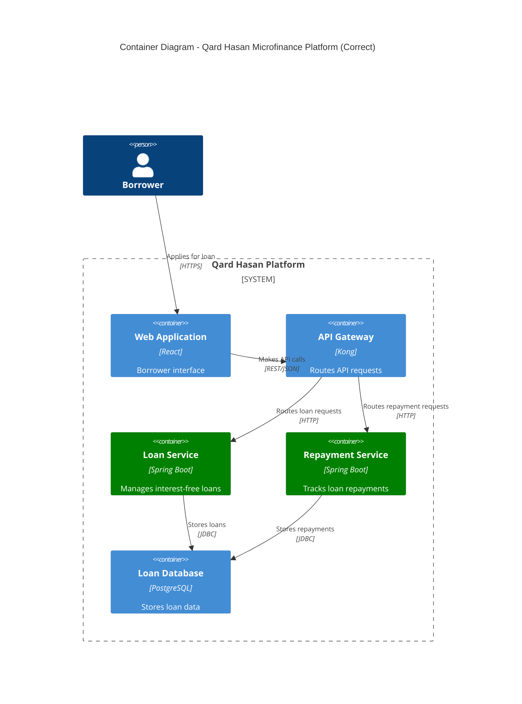
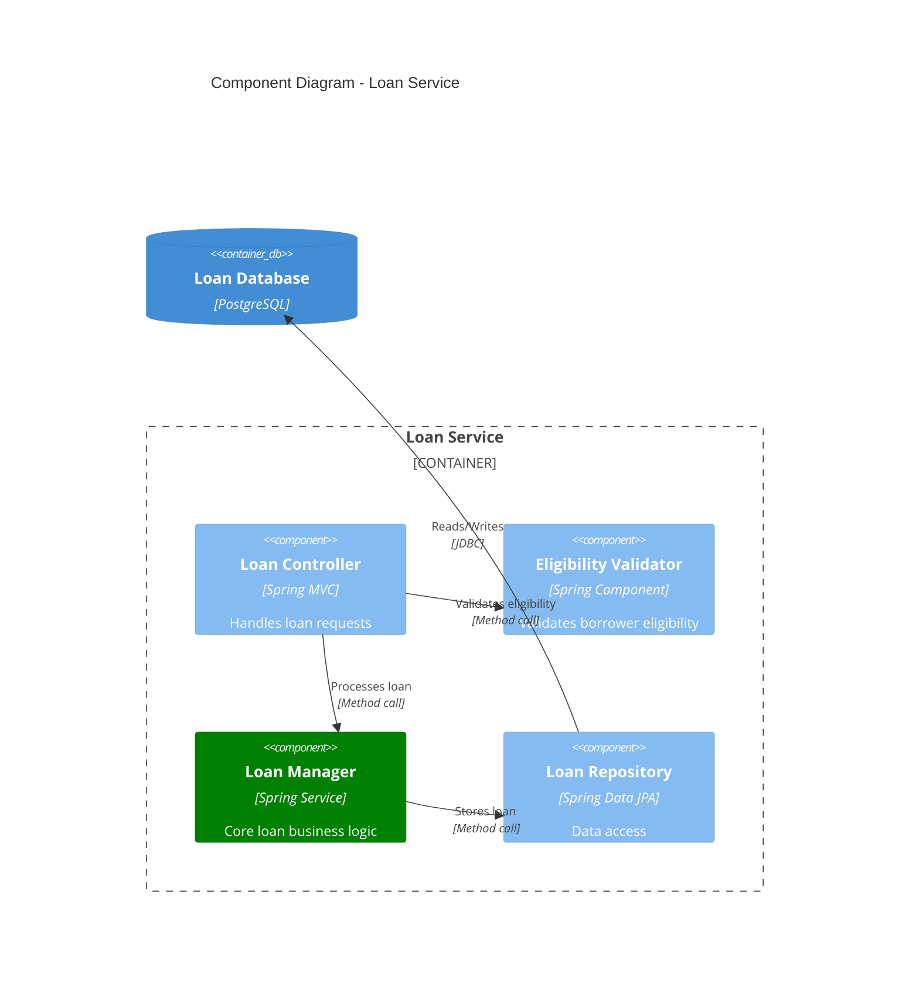
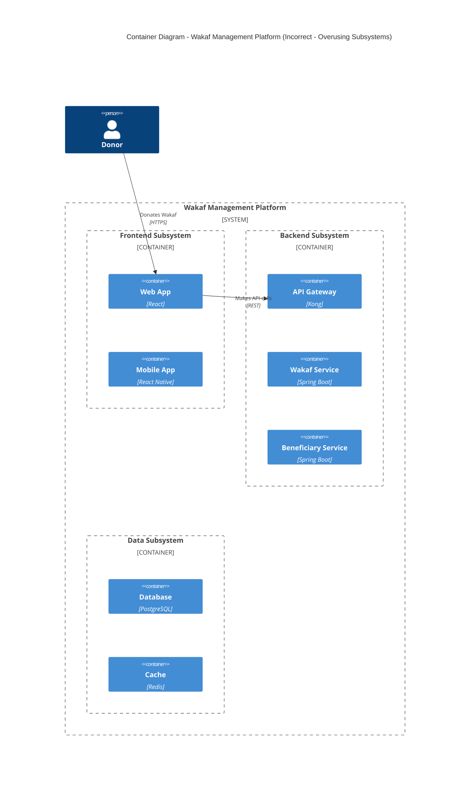
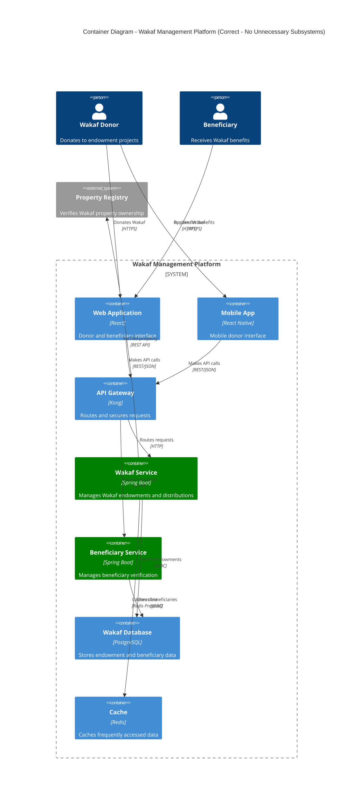
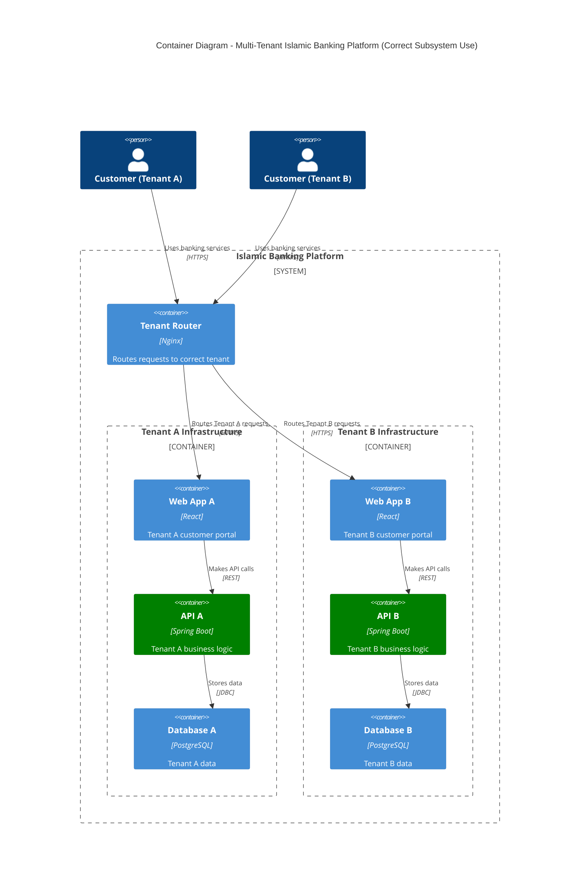
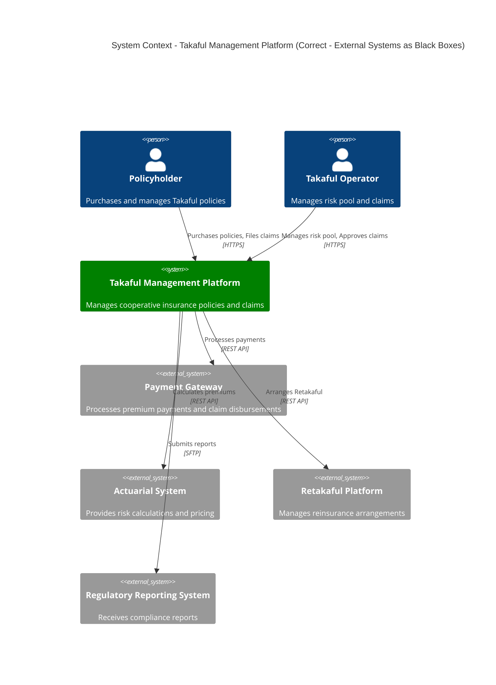
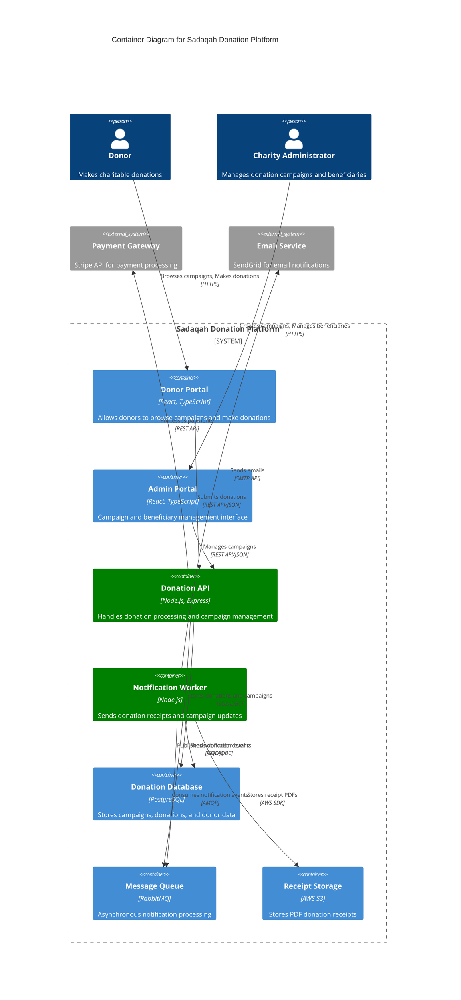
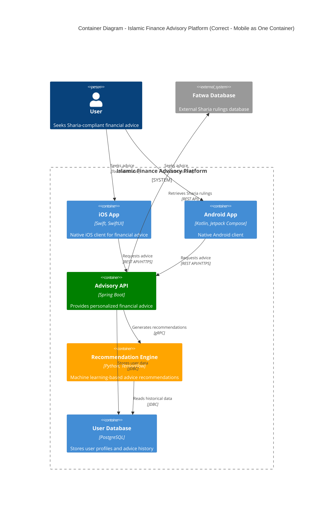

# Antipatterns

> **Companion Document**: For positive guidance on what to do, see [Best Practices](./ex-so-ar-c4armo__14-best-practices.md)

## Overview

This document identifies common antipatterns and mistakes when using the C4 model for software architecture documentation. Understanding what to avoid is just as important as knowing what to do. These antipatterns undermine the clarity and value that the C4 model is designed to provide.

The C4 model's strength lies in its simplicity and pragmatism. When misused through these antipatterns, it loses its effectiveness and becomes just another confusing architecture notation. This guide helps teams recognize and avoid common pitfalls that reduce the value of their architecture documentation.

## Common Antipatterns

### 1. Mixing Container and Component Abstractions

**Problem**: Showing both containers (deployable units) and components (internal code structures) in the same diagram.

**Why It's Wrong**:

- Violates separation of abstraction levels
- Creates confusion about deployment boundaries
- Makes diagrams harder to understand
- Loses the clarity that makes C4 valuable

**Example - Incorrect Mixing**:

```
❌ Container Diagram (WRONG - Mixes Containers and Components)

[Web Application - React] ---> [API Gateway - Kong]
[Mobile App - React Native] -> [API Gateway - Kong]

[API Gateway] ---> [UserController - Spring MVC]  ⚠️ Component, not Container!
[API Gateway] ---> [OrderController - Spring MVC]  ⚠️ Component, not Container!

[UserController] ---> [User Service - Spring Boot]  ✓ Container
[OrderController] ---> [Order Service - Spring Boot]  ✓ Container
```

**Correct Approach**:

Create separate diagrams for each abstraction level:

**Container Diagram**:



**Component Diagram for Loan Service** (Separate diagram):



### 2. Adding Arbitrary Abstraction Levels

**Problem**: Creating custom abstraction levels between the standard four C4 levels (e.g., "Service", "Module", "Subsystem").

**Why It's Wrong**:

- Defeats the purpose of a standard model
- Creates confusion about what each diagram shows
- Makes it harder to onboard new team members
- Reduces interoperability with C4 tooling

**Common Violations**:

- "Service Layer" diagram (between Container and Component)
- "Module" diagram (between Component and Code)
- "Microservice Group" diagram (between System Context and Container)

**Example - Incorrect Custom Level**:

```
❌ "Service Layer" Diagram (NOT a standard C4 level)

This diagram shows "services" which are neither Containers nor Components
```

**Correct Approach**:

Use standard C4 levels with clear boundaries:

1. If "services" are deployable units → Use Container diagram
2. If "services" are code groupings within a container → Use Component diagram
3. If you need both views → Create both Container and Component diagrams

### 3. Overusing Subsystems

**Problem**: Creating "subsystem" groupings that don't represent actual deployment or logical boundaries.

**Why It's Wrong**:

- Adds visual complexity without adding clarity
- Often represents organizational structure rather than system structure
- Can hide important direct relationships
- Makes diagrams harder to understand

**Example - Incorrect Subsystem Usage**:



**Problem**: The "subsystems" add no value - they just group similar container types.

**Correct Approach**:



**When Subsystems ARE Appropriate**:

Subsystems make sense when they represent actual logical or physical boundaries:



Here, subsystems represent actual deployment isolation between tenants.

### 4. Detailing External Containers

**Problem**: Showing internal implementation details of external systems that you don't own or control.

**Why It's Wrong**:

- Violates abstraction boundaries (external systems should be black boxes)
- Creates maintenance burden when external systems change
- Adds clutter without adding value
- Confuses ownership and responsibility

**Example - Incorrect External System Detail**:

```
❌ System Context (WRONG - Shows internal details of external system)

[Takaful Platform] ---> [Payment Gateway Web Server]
                   ---> [Payment Gateway Database]
                   ---> [Payment Gateway Message Queue]

⚠️ Shows internal containers of external "Payment Gateway" system
```

**Correct Approach**:



**When to Show External System Details**:

Only show external system internals if:

1. You own/control the external system (e.g., legacy system you're integrating)
2. You're documenting integration architecture and need to show specific integration points
3. You're creating a Container diagram that zooms into a previously external system

### 5. Ambiguous Diagrams Without Legends or Labels

**Problem**: Creating diagrams without sufficient context, labels, or explanations.

**Why It's Wrong**:

- Requires verbal explanation (diagrams should be self-explanatory)
- Different stakeholders interpret diagrams differently
- Diagrams lose value when reviewed later
- Wastes time in meetings explaining unclear elements

**Example - Ambiguous Diagram**:

```
❌ Ambiguous Container Diagram (Missing context)

[Web] ---> [API] ---> [DB]
 |
 v
[Queue]

⚠️ No title, no technology choices, no relationship labels
⚠️ Unclear what "API" does or why Queue is needed
```

**Correct Approach**:



**Legend** (when colors/symbols have specific meaning):

```markdown
### Diagram Legend

**Colors**:

- Green: Core platform services
- Blue: User-facing applications
- Orange: Data stores
- Gray: External systems

**Relationships**:

- Solid lines: Synchronous calls
- Dashed lines: Asynchronous messaging

**Technologies**:

- All technology choices shown in square brackets [Technology Name]
```

### 6. Using C4 for Wrong System Types

**Problem**: Applying C4 model to systems where it doesn't fit well.

**Why It's Wrong**:

- C4 is designed for software systems with runtime deployment
- Some systems don't have clear container/component abstractions
- Forces artificial modeling that doesn't reflect reality

**Inappropriate Use Cases**:

1. **Embedded Systems**: Firmware with no clear deployment separation
2. **Libraries/SDKs**: Reusable code without independent deployment
3. **Infrastructure as Code**: Terraform/CloudFormation templates
4. **Data Pipelines**: ETL workflows (better suited for flow diagrams)
5. **Mobile Apps (Simple)**: Single deployment unit with no backend

**Example - Inappropriate Use**:

```
❌ C4 Container Diagram for Simple Mobile App (WRONG)

Container: Mobile App [React Native]
Container: Local Database [SQLite]
Container: User Interface Layer [React Components]
Container: Business Logic Layer [JavaScript Classes]

⚠️ These aren't separate deployable containers - they're all part of one mobile app
⚠️ Better to skip Container diagram or use mobile app architecture patterns (MVVM, MVC)
```

**When C4 IS Appropriate for Mobile**:

When the mobile app is part of a larger distributed system:



Here, mobile apps are legitimate containers in a distributed system.

**Better Alternatives for Inappropriate Cases**:

- **Embedded Systems**: Hardware architecture diagrams, state machines
- **Libraries**: Package diagrams, dependency graphs
- **IaC**: Resource topology diagrams, deployment diagrams
- **Data Pipelines**: Data flow diagrams, workflow diagrams
- **Simple Mobile Apps**: MVVM/MVC architecture diagrams

## Summary of Antipatterns

| Antipattern                    | Problem                                        | Solution                                     |
| ------------------------------ | ---------------------------------------------- | -------------------------------------------- |
| **Mixing Abstractions**        | Containers and Components in same diagram      | Create separate diagrams for each level      |
| **Arbitrary Levels**           | Custom levels between standard C4 levels       | Stick to four standard levels                |
| **Overusing Subsystems**       | Groupings that don't represent real boundaries | Use subsystems only for actual isolation     |
| **Detailing External Systems** | Showing internals of systems you don't own     | Keep external systems as black boxes         |
| **Ambiguous Diagrams**         | Missing labels, legends, context               | Add sufficient descriptive text              |
| **Wrong System Types**         | Using C4 for embedded systems, libraries, IaC  | Use C4 only for distributed software systems |

## Practical Avoidance Checklist

Before finalizing a C4 diagram, verify you're NOT doing these:

**Abstraction Level Violations**:

- [ ] ❌ Mixing containers and components in same diagram
- [ ] ❌ Creating custom levels between standard C4 levels
- [ ] ❌ Showing internal details of external systems
- [ ] ❌ Using subsystems that don't represent real boundaries

**Clarity Violations**:

- [ ] ❌ Missing diagram title
- [ ] ❌ Missing technology choices in square brackets
- [ ] ❌ Unlabeled relationships
- [ ] ❌ Ambiguous element names (e.g., "API", "Service", "Handler")
- [ ] ❌ No legend when using colors/symbols with specific meaning

**Scope Violations**:

- [ ] ❌ Too many elements (>15 in Context, >20 in Container)
- [ ] ❌ Too much detail for the abstraction level
- [ ] ❌ Irrelevant elements that don't serve the diagram's purpose

**Consistency Violations**:

- [ ] ❌ Inconsistent naming across diagram levels
- [ ] ❌ Mixing terminology (technical jargon with business terms)
- [ ] ❌ Inconsistent technology naming
- [ ] ❌ Different visual styles within same documentation set

**Inappropriate Use**:

- [ ] ❌ Using C4 for embedded systems
- [ ] ❌ Using C4 for libraries/SDKs
- [ ] ❌ Using C4 for simple mobile apps (no backend)
- [ ] ❌ Using C4 for data pipelines (use flow diagrams instead)
- [ ] ❌ Using C4 for infrastructure as code (use topology diagrams)

## Further Reading

**Official C4 Resources**:

- C4 Model Website: <https://c4model.com/>
- C4 Model FAQ: <https://c4model.com/#faq>
- Structurizr (C4 tooling): <https://structurizr.com/>

**Community Resources**:

- "Misuses and Mistakes of the C4 Model": <https://www.workingsoftware.dev/misuses-and-mistakes-of-the-c4-model/>
- "The C4 Model for Visualising Software Architecture" (InfoQ): <https://www.infoq.com/articles/C4-architecture-model/>

**Related Documentation**:

- Best Practices: [ex-so-ar-c4armo\_\_14-best-practices.md](./ex-so-ar-c4armo__14-best-practices.md)
- System Context Diagrams: [ex-so-ar-c4armo\_\_01-level-1-system-context.md](./ex-so-ar-c4armo__01-level-1-system-context.md)
- Container Diagrams: [ex-so-ar-c4armo\_\_02-level-2-container.md](./ex-so-ar-c4armo__02-level-2-container.md)
- Component Diagrams: [ex-so-ar-c4armo\_\_03-level-3-component.md](./ex-so-ar-c4armo__03-level-3-component.md)

## Conclusion

Avoiding these antipatterns is crucial for maintaining the value and clarity that the C4 model provides. Remember:

- **Respect abstraction levels** - Don't mix containers and components
- **Keep it standard** - Stick to the four C4 levels
- **Make it clear** - Add titles, labels, legends, and descriptions
- **Know when to use C4** - Only for distributed software systems
- **External systems are black boxes** - Don't show what you don't own

When you catch yourself doing any of these antipatterns, step back and ask: **Am I adding clarity or confusion?** If the answer is confusion, simplify and refocus on the core C4 principles. For positive guidance, refer to the [Best Practices](./ex-so-ar-c4armo__14-best-practices.md) document.
