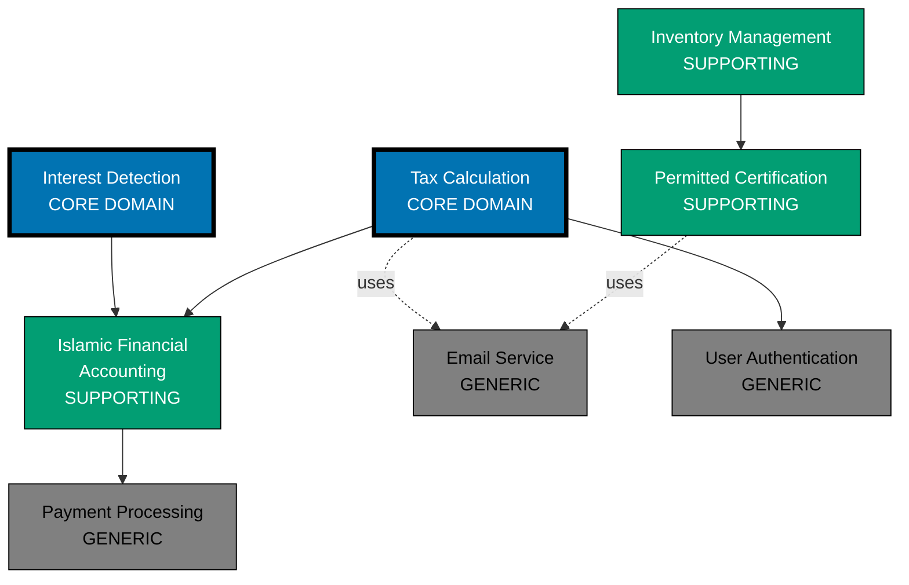

# Subdomains

## What is a Subdomain?

A **Subdomain** is a distinct area of the business problem space. While Bounded Contexts partition the solution space (how we model the software), Subdomains partition the problem space (what problems the business needs to solve).

**Problem Space vs. Solution Space:**

- **Subdomain (Problem Space)**: Business capabilities and problems
  - Examples: Tax calculation, Permitted certification, Payment processing
- **Bounded Context (Solution Space)**: Software models and implementations
  - Examples: Tax Calculation Context, Permitted Certification Context, Payment Gateway Integration

**Key Insight**: Subdomains are discovered through domain analysis. Bounded Contexts are designed as solutions to subdomain problems. Ideally, one subdomain maps to one bounded context, but this is not always possible or desirable.

**Three Types of Subdomains:**

1. **Core Domain**: Competitive differentiator, unique to your business
2. **Supporting Subdomain**: Necessary but not differentiating
3. **Generic Subdomain**: Commodity problems solved by off-the-shelf solutions

## Why Subdomains Matter

### The Problem: Treating All Problems Equally

Without subdomain classification, teams waste resources:

**1. Over-Engineering Generic Problems**

Building a custom payment processing system when Stripe exists:

- Months of development
- Ongoing maintenance burden
- Security and compliance risks
- No competitive advantage

**2. Under-Investing in Core Domain**

Rushing through tax calculation logic (your competitive advantage) to build yet another admin panel:

- Competitors catch up quickly
- Missed business opportunities
- Poor implementation of critical features

**3. Misaligned Team Allocation**

Assigning senior developers to generic subdomains and junior developers to core domain:

- Core domain gets poor design
- Generic subdomain gets over-engineered

### The Solution: Strategic Subdomain Classification

Classifying subdomains enables strategic decision-making:

**Investment Prioritization:**

- **Core**: Invest heavily, best developers, careful design
- **Supporting**: Adequate investment, competent developers, pragmatic design
- **Generic**: Minimal investment, buy vs. build, standardized solutions

**Build vs. Buy Decisions:**

- **Core**: Always build, proprietary advantage
- **Supporting**: Usually build, occasionally buy and customize
- **Generic**: Usually buy, occasionally build simple version

**Quality Standards:**

- **Core**: Highest quality, comprehensive tests, extensive documentation
- **Supporting**: Good quality, adequate tests, sufficient documentation
- **Generic**: Adequate quality, basic tests, minimal documentation

## Core Domain

### Definition

The **Core Domain** is the part of the system that provides competitive advantage and is most valuable to the business. It's what makes your company unique and successful.

**Characteristics:**

- **Differentiating**: Competitors cannot easily replicate
- **High Business Value**: Directly impacts revenue or key metrics
- **Complex**: Requires deep domain expertise
- **Evolving**: Changes frequently as business innovates
- **Proprietary**: Contains trade secrets or unique approaches

### Example: Tax Calculation for Open Compliance Enterprise

**Why Core?**

Tax calculation is the competitive differentiator for an Islamic fintech platform:

- **Complex Islamic Jurisprudence**: Requires collaboration with Islamic scholars
- **Unique Approach**: Automated, precise calculations for modern wealth types
- **Business Differentiation**: Competitors lack sophisticated tax features
- **High Value**: Attracts permitted-conscious users, drives platform adoption

**Implementation Strategy:**

```typescript
// Core Domain: Sophisticated, well-designed aggregate
class TaxAssessment {
  private readonly assessmentId: AssessmentId;
  private readonly wealthHolderId: WealthHolderId;
  private readonly assessmentPeriod: LunarYearPeriod;
  private wealthDeclarations: WealthDeclaration[] = [];
  private status: AssessmentStatus;

  // Rich domain logic reflecting Islamic finance complexity
  finalize(thresholdThreshold: ThresholdAmount, taxRate: TaxRate): void {
    this.validateHawlCompletion();
    this.validateWealthDeclarations();

    const totalWealth = this.calculateTotalTaxableWealth();

    if (totalWealth.isLessThan(thresholdThreshold.toMoney())) {
      this.status = AssessmentStatus.ExemptBelowThreshold;
      this.taxAmount = Money.zero();
    } else {
      this.taxAmount = this.calculateTaxOwed(totalWealth, taxRate);
      this.status = AssessmentStatus.Finalized;
    }

    this.addDomainEvent(new TaxCalculated(this.assessmentId, this.wealthHolderId, this.taxAmount, HijriDate.now()));
  }

  private calculateTaxOwed(wealth: Money, rate: TaxRate): Money {
    // Sophisticated calculation considering:
    // - Wealth type (cash, gold, agricultural produce)
    // - Threshold thresholds
    // - Deductions (debts, necessary expenses)
    // - Tax rates (2.5% for most wealth, 5-10% for agriculture)
    return wealth.multiply(rate.percentage);
  }

  private validateHawlCompletion(): void {
    if (!this.assessmentPeriod.isComplete()) {
      throw new HawlNotCompleteError(`Hawl period ending ${this.assessmentPeriod.endDate} has not yet completed`);
    }
  }
}
```

**Investment:**

- **Team**: Senior developers + Islamic scholars
- **Quality**: Comprehensive test coverage (>90%), extensive documentation
- **Architecture**: DDD tactical patterns (Aggregates, Value Objects, Domain Events)
- **Maintenance**: Continuous improvement, feature expansion

### Identifying Core Domain

Ask these questions:

1. **Would this capability make us successful if we did it exceptionally well?**
   - Tax Calculation: YES (attracts permitted-conscious users)
   - Email sending: NO (commodity feature)

2. **Is this capability difficult for competitors to replicate?**
   - Islamic jurisprudence rules: YES (requires scholars + developers)
   - User authentication: NO (standard problem)

3. **Does this capability require unique domain expertise?**
   - Interest detection: YES (requires Islamic finance knowledge)
   - File upload: NO (generic technical problem)

4. **Would outsourcing this harm our competitive advantage?**
   - Permitted certification logic: YES (competitive secret)
   - Payment processing: NO (Stripe is fine)

If you answer "YES" to 3-4 questions, it's likely a Core Domain.

## Supporting Subdomain

### Definition

**Supporting Subdomains** are necessary for the business but do not provide competitive differentiation. They support the Core Domain but are not themselves sources of advantage.

**Characteristics:**

- **Necessary**: Required for system to function
- **Non-Differentiating**: Competitors have similar solutions
- **Moderate Complexity**: Requires some domain knowledge
- **Custom**: Off-the-shelf solutions don't fit well enough
- **Stable**: Changes less frequently than Core Domain

### Example: Islamic Financial Accounting

**Why Supporting?**

Accounting is necessary for tax calculation but not the differentiator:

- **Necessary**: Tax requires accurate wealth tracking
- **Non-Differentiating**: All financial platforms have accounting
- **Custom Required**: Standard accounting doesn't handle Islamic finance specifics
- **Stable**: Accounting principles change slowly

**Implementation Strategy:**

```typescript
// Supporting Subdomain: Pragmatic, adequate design
class IslamicFinancialAccount {
  private readonly accountId: AccountId;
  private balance: Money;
  private transactions: Transaction[] = [];

  // Adequate domain logic, no over-engineering
  applyTransaction(transaction: Transaction): void {
    this.validateTransaction(transaction);

    if (transaction.isDebit()) {
      this.balance = this.balance.subtract(transaction.amount);
    } else {
      this.balance = this.balance.add(transaction.amount);
    }

    this.transactions.push(transaction);

    this.addDomainEvent(new TransactionApplied(this.accountId, transaction.id));
  }

  getBalanceAt(date: HijriDate): Money {
    // Simple calculation, no complex optimization
    let balance = Money.zero();
    for (const transaction of this.transactions) {
      if (transaction.date.isBeforeOrEqual(date)) {
        balance = transaction.isDebit() ? balance.subtract(transaction.amount) : balance.add(transaction.amount);
      }
    }
    return balance;
  }

  private validateTransaction(transaction: Transaction): void {
    if (transaction.amount.isNegativeOrZero()) {
      throw new Error("Transaction amount must be positive");
    }
    // Basic validation, no exhaustive checks
  }
}
```

**Investment:**

- **Team**: Mid-level developers
- **Quality**: Good test coverage (70-80%), adequate documentation
- **Architecture**: Simplified DDD patterns, pragmatic choices
- **Maintenance**: Reactive maintenance, limited feature expansion

### Example: Permitted Certification Tracking

**Why Supporting?**

Tracking permitted certifications supports product catalog but isn't the main value:

- **Necessary**: Users need confidence in permitted status
- **Non-Differentiating**: All permitted platforms track certifications
- **Custom**: Standard e-commerce doesn't handle permitted certification
- **Supporting Core**: Enables trust in platform (supports sales)

**Implementation:**

```typescript
// Supporting Subdomain: Straightforward implementation
class Product {
  private permittedCertification: PermittedCertification | null = null;

  certify(authority: CertificationAuthority, expiryDate: Date, certificationNumber: string): void {
    if (!authority.isRecognized()) {
      throw new Error("Certification authority not recognized");
    }

    this.permittedCertification = new PermittedCertification(authority, expiryDate, certificationNumber);

    this.addDomainEvent(new ProductCertified(this.productId, authority, expiryDate));
  }

  isPermittedCertified(): boolean {
    return this.permittedCertification !== null && !this.permittedCertification.isExpired();
  }
}
```

## Generic Subdomain

### Definition

**Generic Subdomains** are commodity problems with well-known solutions. They are necessary for the system but provide no competitive advantage.

**Characteristics:**

- **Commodity**: Many existing solutions available
- **Non-Differentiating**: Every business has this problem
- **Low Complexity**: Well-understood problem space
- **Off-the-Shelf**: SaaS or open-source solutions exist
- **Stable**: Changes rarely

### Example: Payment Processing

**Why Generic?**

Payment processing is a solved problem:

- **Commodity**: Stripe, PayPal, Square all provide solutions
- **Non-Differentiating**: Users don't choose platforms based on payment processing
- **Off-the-Shelf**: Excellent SaaS solutions exist
- **Low Business Value**: Generic technical capability

**Implementation Strategy:**

```typescript
// Generic Subdomain: Minimal code, use third-party service
class PaymentService {
  constructor(private stripeClient: StripeClient) {}

  // Thin wrapper around Stripe API
  async chargeOrder(order: Order): Promise<PaymentResult> {
    try {
      const charge = await this.stripeClient.charges.create({
        amount: order.total.toCents(),
        currency: order.total.currency.code.toLowerCase(),
        source: order.paymentToken,
        description: `Order ${order.id}`,
      });

      return PaymentResult.success(charge.id);
    } catch (error) {
      return PaymentResult.failure(error.message);
    }
  }
}
```

**Investment:**

- **Team**: Junior developers or outsource
- **Quality**: Basic tests, minimal documentation
- **Architecture**: Thin wrapper around third-party service
- **Maintenance**: Update library versions, minimal customization

### Example: Email Sending

**Why Generic?**

Email is a commodity:

- **Commodity**: SendGrid, Mailgun, AWS SES available
- **Non-Differentiating**: Email is expected, not special
- **Off-the-Shelf**: Mature SaaS solutions
- **Low Complexity**: Well-understood problem

**Implementation:**

```typescript
// Generic Subdomain: Use SaaS, minimal code
interface EmailService {
  sendEmail(to: string, subject: string, body: string): Promise<void>;
}

class SendGridEmailService implements EmailService {
  constructor(private sendGridClient: SendGridClient) {}

  async sendEmail(to: string, subject: string, body: string): Promise<void> {
    await this.sendGridClient.send({
      to,
      from: "noreply@oseplatform.com",
      subject,
      html: body,
    });
  }
}
```

## Subdomain Classification Matrix

Use this matrix to classify subdomains:

| Subdomain                        | Differentiating? | Business Value | Complexity | Existing Solutions | Classification | Strategy           |
| -------------------------------- | ---------------- | -------------- | ---------- | ------------------ | -------------- | ------------------ |
| Tax Calculation                  | ✅ Yes           | High           | High       | None               | **Core**       | Build, invest      |
| Interest Detection               | ✅ Yes           | High           | High       | None               | **Core**       | Build, invest      |
| Islamic Financial Accounting     | ❌ No            | Medium         | Medium     | Some (general)     | **Supporting** | Build, adequate    |
| Permitted Certification Tracking | ❌ No            | Medium         | Low        | Some (e-commerce)  | **Supporting** | Build, pragmatic   |
| Inventory Management             | ❌ No            | Medium         | Low        | Many               | **Supporting** | Build or buy       |
| Payment Processing               | ❌ No            | Low            | Low        | Excellent (Stripe) | **Generic**    | Buy (SaaS)         |
| Email Sending                    | ❌ No            | Low            | Low        | Excellent          | **Generic**    | Buy (SendGrid)     |
| User Authentication              | ❌ No            | Low            | Medium     | Excellent (Auth0)  | **Generic**    | Buy or use library |
| Shipping                         | ❌ No            | Low            | Low        | Many               | **Generic**    | Buy (ShipStation)  |

## Investment Prioritization

### Resource Allocation

Allocate team resources based on subdomain classification:

**Core Domain (50-60% of team):**

- Senior developers with domain expertise
- Extensive collaboration with domain experts (Islamic scholars)
- Comprehensive testing and documentation
- Iterative refinement and continuous improvement

**Supporting Subdomains (30-40% of team):**

- Mid-level developers
- Occasional domain expert consultation
- Good test coverage
- Pragmatic design decisions

**Generic Subdomains (10-20% of team):**

- Junior developers or outsource
- Minimal custom code
- Prefer SaaS or open-source solutions
- Basic integration and configuration

### Build vs. Buy Decision Tree

```
Does subdomain provide competitive advantage?
├─ YES → Core Domain → BUILD with high investment
└─ NO → Continue...

Does subdomain require custom domain logic?
├─ YES → Supporting Subdomain → Usually BUILD
│   └─ Can we customize an off-the-shelf solution?
│       ├─ YES, fits well → BUY and customize
│       └─ NO → BUILD pragmatically
└─ NO → Generic Subdomain → Usually BUY
    └─ Does excellent SaaS/library exist?
        ├─ YES → BUY
        └─ NO → BUILD simple version
```

**Example Decisions:**

- **Tax Calculation**: Core → BUILD with DDD, tests, documentation
- **Islamic Financial Accounting**: Supporting → BUILD with pragmatic design
- **Permitted Certification Tracking**: Supporting → BUILD simple model or customize e-commerce platform
- **Payment Processing**: Generic → BUY Stripe integration
- **Email**: Generic → BUY SendGrid
- **User Auth**: Generic → BUY Auth0 or use Passport.js library

## Domain Distillation

### Process

**Domain Distillation** is the process of separating Core Domain from Supporting and Generic Subdomains to focus investment and attention.

**Steps:**

1. **Identify All Subdomains**
   - List all business capabilities
   - Group related capabilities

2. **Classify Each Subdomain**
   - Apply decision matrix
   - Consult business stakeholders

3. **Visualize with Context Map**
   - Show subdomain relationships
   - Color-code by classification (Blue = Core, Teal = Supporting, Gray = Generic)

4. **Prioritize Investment**
   - Allocate best developers to Core
   - Simplify Supporting subdomains
   - Buy or minimize Generic subdomains

5. **Extract Core Domain**
   - Isolate Core Domain code
   - Protect with clear boundaries
   - Prevent coupling to Generic code

### Example: OSE Platform Distillation



**Visual Insights:**

- **Core Domain (Blue, thick border)**: Tax Calculation and Interest Detection are the focus
- **Supporting (Teal)**: Islamic Financial Accounting, Permitted Certification, Inventory Management
- **Generic (Gray)**: Payment, Email, Authentication are commodities

**Strategic Decisions:**

- **Invest heavily** in Tax Calculation and Interest Detection
- **Build pragmatically** for Islamic Financial Accounting and Permitted Certification
- **Buy SaaS** for Payment (Stripe), Email (SendGrid), Auth (Auth0)

## Subdomains vs. Bounded Contexts

**Key Distinction:**

- **Subdomain (Problem Space)**: What business problems exist?
- **Bounded Context (Solution Space)**: How do we model solutions?

**Ideal Mapping**: 1 Subdomain = 1 Bounded Context

**Reality**: Many-to-many relationships possible:

**One Subdomain → Multiple Bounded Contexts:**

Example: Islamic Financial Accounting subdomain split into:

- Accounting Bounded Context (ledger, transactions)
- Reporting Bounded Context (financial reports, dashboards)

**Multiple Subdomains → One Bounded Context:**

Example: Small startup combines:

- Tax Calculation subdomain
- Islamic Financial Accounting subdomain
- Single "Islamic Finance" Bounded Context (pragmatic monolith)

**Practical Guidance:**

- **Start with 1:1 mapping** when possible
- **Split contexts** when subdomain grows too large or teams need autonomy
- **Merge contexts** when coordination overhead exceeds benefit

## Summary

Subdomain classification is essential for strategic investment:

- **Core Domain**: Competitive advantage, invest heavily, build carefully
- **Supporting Subdomain**: Necessary but not differentiating, build pragmatically
- **Generic Subdomain**: Commodity, buy off-the-shelf or minimize

**Classification Criteria:**

- Business value and differentiation
- Complexity and domain expertise required
- Availability of existing solutions

**Benefits:**

- **Resource Optimization**: Best developers on Core Domain
- **Cost Reduction**: Buy Generic subdomains instead of building
- **Focus**: Clear prioritization of investment
- **Strategic Alignment**: Business and technology aligned on what matters

**Process:**

1. Identify all subdomains
2. Classify using decision matrix
3. Visualize with context map
4. Prioritize investment
5. Make build vs. buy decisions

Subdomain distillation ensures teams focus on what truly matters: the Core Domain that makes your business unique and successful.

## Next Steps

- **[Context Mapping](./ex-so-ar-dodrdedd__04-context-mapping.md)** - Map relationships between subdomains/contexts
- **[Bounded Contexts](./ex-so-ar-dodrdedd__03-bounded-contexts.md)** - Design solution-space models for subdomains
- **[Strategic Design Process](./ex-so-ar-dodrdedd__06-strategic-design-process.md)** - Discover subdomains through Event Storming
- **<!-- TODO: Create templates/README.md -->** - Document your subdomain analysis

## References

- Eric Evans, "Domain-Driven Design" (2003) - Chapter on Distillation
- Vaughn Vernon, "Implementing Domain-Driven Design" (2013) - Chapter 2: Subdomains
- Vaughn Vernon, "Domain-Driven Design Distilled" (2016) - Chapter 2: Strategic Design with Subdomains
- Alberto Brandolini, "Strategic Domain-Driven Design with Context Mapping" - Subdomain discovery
- Mathias Verraes, ["Towards a Theory of Classification in DDD"](https://verraes.net/2021/09/theory-of-classification-in-ddd/)

## Related Principles

- **[Explicit Over Implicit](../../../../../governance/principles/software-engineering/explicit-over-implicit.md)** - Subdomain classification (core/supporting/generic) makes strategic priorities explicit
- **[Simplicity Over Complexity](../../../../../governance/principles/general/simplicity-over-complexity.md)** - Generic subdomains can use simple off-the-shelf solutions

See [Software Engineering Principles](../../../../../governance/principles/software-engineering/README.md) for comprehensive documentation.
