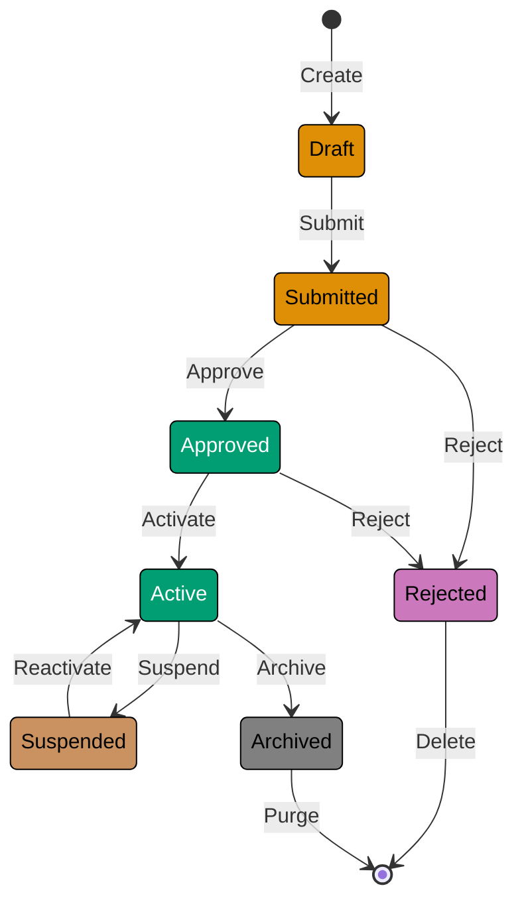

# Entities

## What is an Entity?

An **Entity** is an object that has a distinct identity that runs through time and different representations. Unlike value objects that are defined by their attributes, entities are defined by their identity. Two entities with the same attributes but different identities are distinct objects.

**Key Characteristics:**

- **Identity**: Has a unique identifier that distinguishes it from other entities
- **Lifecycle**: Exists over time and can change state while maintaining identity
- **Mutability**: Attributes can change, but identity remains constant
- **Identity-Based Equality**: Two entities are equal if they have the same identity, regardless of attribute values
- **Continuity**: The same entity can be referenced and tracked across transactions and time

**Example**: Two `WealthDeclaration` entities with identical wealth amounts but different IDs are distinct declarations that must be tracked separately.

## Why Entities Matter

### The Problem: Identity Confusion

Without entities, systems struggle to track important objects over time:

```typescript
// WITHOUT Entities: No identity, only attributes
const transaction1 = { amount: 1000, type: "deposit" };
const transaction2 = { amount: 1000, type: "deposit" };

// Are these the same transaction or two different transactions?
// Impossible to tell! Leads to:
// - Duplicate processing
// - Lost audit trails
// - Inability to update or cancel specific transactions
```

Problems:

- **Cannot distinguish objects**: Two objects with same attributes appear identical
- **Cannot track changes**: No way to know if object state evolved or if it's a different object
- **Cannot reference reliably**: No stable identifier for lookups or relationships
- **Audit trail impossible**: Cannot track lifecycle of specific object

### The Solution: Entities with Identity

Entities solve these problems through unique, stable identities:

```typescript
// WITH Entities: Explicit identity
class Transaction {
  constructor(
    readonly id: TransactionId, // Unique identity
    public amount: Money,
    public type: TransactionType,
  ) {}
}

const transaction1 = new Transaction(TransactionId.from("txn-001"), Money.usd(1000), TransactionType.Deposit);

const transaction2 = new Transaction(TransactionId.from("txn-002"), Money.usd(1000), TransactionType.Deposit);

// Even with identical amounts and types, these are distinct transactions
transaction1.equals(transaction2); // false - different IDs

// Can track this specific transaction through its lifecycle
transactionRepository.findById(TransactionId.from("txn-001"));
```

Benefits:

- **Unambiguous references**: ID uniquely identifies object across system
- **Reliable tracking**: Changes to specific entity tracked over time
- **Audit trails**: Full history of entity lifecycle
- **Referential integrity**: Foreign keys and relationships work reliably

## Entity vs Value Object

The distinction between entities and value objects is fundamental in tactical DDD. Use this decision tree:

```
Does the object need to be tracked over time?

├─ YES → Does it need a unique identity?
│  ├─ YES → Entity
│  └─ NO → Reconsider if tracking is actually needed
│
└─ NO → Are two instances with the same attributes interchangeable?
   ├─ YES → Value Object
   └─ NO → Entity (identity matters even if not tracked over time)
```

**Key Differences:**

| Aspect         | Entity                              | Value Object                            |
| -------------- | ----------------------------------- | --------------------------------------- |
| **Identity**   | Has unique ID                       | No identity (defined by attributes)     |
| **Equality**   | ID-based (same ID = same entity)    | Structural (same attributes = equal)    |
| **Mutability** | Usually mutable (state can change)  | Always immutable                        |
| **Lifecycle**  | Created, modified, deleted          | Created as complete, replaced if needed |
| **Example**    | `WealthDeclaration`, `LoanContract` | `Money`, `HijriDate`, `TaxRate`         |

**Examples from Islamic Finance:**

**Entities:**

- `TaxAssessment` - Unique assessment tracked from draft to finalized state
- `WealthDeclaration` - Specific declaration of wealth that can be amended
- `LoanContract` - Unique contract tracked through approval workflow
- `Transaction` - Specific financial transaction in account history
- `PermittedCertification` - Unique certification with lifecycle (issued, renewed, revoked)

**Value Objects:**

- `Money` - $100 USD is interchangeable with any other $100 USD
- `HijriDate` - 1445-01-01 is the same date regardless of where used
- `TaxRate` - 2.5% is 2.5% everywhere
- `ThresholdAmount` - Threshold threshold defined purely by its value
- `Email` - Two email addresses with same string are identical

## Identity Management

### Identity Types

**1. Natural Identity (Domain-Assigned)**

Identity derived from business domain attributes:

```typescript
// Natural identity: ISBN uniquely identifies book in publishing domain
class Book {
  constructor(
    readonly isbn: ISBN, // Natural business identifier
    public title: string,
    public author: string,
  ) {}

  equals(other: Book): boolean {
    return this.isbn.equals(other.isbn);
  }
}
```

**Benefits:**

- Meaningful to domain experts
- No artificial ID generation needed
- Often human-readable

**Drawbacks:**

- Natural keys can change (rare but possible)
- May not exist for all entities
- Composite keys can be complex

**Examples:**

- `ISBN` for books
- `IBAN` for bank accounts
- `ProductSKU` for inventory items
- Social security numbers, passport numbers (use with privacy caution)

**2. Surrogate Identity (System-Generated)**

Identity generated by system, not derived from domain:

```typescript
// Surrogate identity: UUID generated by system
class WealthDeclaration {
  constructor(
    readonly id: WealthDeclarationId, // System-generated UUID
    readonly wealthType: WealthType,
    readonly amount: Money,
  ) {}

  static create(wealthType: WealthType, amount: Money): WealthDeclaration {
    const id = WealthDeclarationId.generate(); // Auto-generate
    return new WealthDeclaration(id, wealthType, amount);
  }

  equals(other: WealthDeclaration): boolean {
    return this.id.equals(other.id);
  }
}

class WealthDeclarationId {
  private constructor(private readonly value: string) {}

  static generate(): WealthDeclarationId {
    return new WealthDeclarationId(uuidv4());
  }

  static from(value: string): WealthDeclarationId {
    return new WealthDeclarationId(value);
  }

  equals(other: WealthDeclarationId): boolean {
    return this.value === other.value;
  }

  toString(): string {
    return this.value;
  }
}
```

**Benefits:**

- Always available (no reliance on domain attributes)
- Immutable (never changes)
- Simple equality checks
- No business logic in ID

**Drawbacks:**

- Not meaningful to humans
- Requires external mapping for human reference
- Database storage overhead (UUIDs are large)

**Best Practices:**

- **Prefer UUIDs** for distributed systems (no central ID generator needed)
- **Use sequential IDs** for databases optimizing on integer keys
- **Wrap IDs in value objects** (type safety: `WealthDeclarationId` vs. `string`)
- **Generate IDs early** in entity lifecycle (before persistence)

### Identity Stability

**Rule:** Entity identity must never change.

**Why?**

- Other entities reference by ID (foreign keys)
- ID changes break all references
- Audit trails become corrupted
- Equality checks become unreliable

**Anti-Pattern: Mutable Identity**

```typescript
// ANTI-PATTERN: Don't do this!
class TaxAssessment {
  private assessmentId: AssessmentId; // Mutable ID field

  changeId(newId: AssessmentId): void {
    this.assessmentId = newId; // WRONG! Identity should never change
  }
}
```

**Correct: Immutable Identity**

```typescript
// CORRECT: Identity is immutable
class TaxAssessment {
  constructor(
    readonly id: AssessmentId, // readonly = immutable
    // other fields...
  ) {}

  // No setter for ID - cannot be changed after construction
}
```

If you need to "change" an entity's identity, create a new entity and mark the old one as deprecated or deleted.

## Entity Equality

Entities use **identity-based equality**, not structural equality.

### Object-Oriented Implementation

```typescript
class LoanContract {
  constructor(
    readonly contractId: ContractId,
    public customerName: string,
    public amount: Money,
    public profitMargin: Percentage,
  ) {}

  // Identity-based equality
  equals(other: LoanContract): boolean {
    if (!(other instanceof LoanContract)) {
      return false;
    }
    return this.contractId.equals(other.contractId);
  }

  // Hash code based on identity (for hash-based collections)
  hashCode(): number {
    return this.contractId.hashCode();
  }
}

// Usage
const contract1 = new LoanContract(ContractId.from("contract-001"), "Ali Hassan", Money.usd(50000), Percentage.from(5));

const contract2 = new LoanContract(
  ContractId.from("contract-001"), // Same ID
  "Ali Hassan (Updated)", // Different name
  Money.usd(55000), // Different amount
  Percentage.from(6), // Different margin
);

contract1.equals(contract2); // TRUE - same identity despite different attributes
```

**Key Points:**

- Only ID compared, not attributes
- Entities with same ID are considered equal even if all other fields differ
- Enables tracking entity through state changes

### Functional Programming Implementation

FP uses immutable data structures with explicit equality functions:

```typescript
// FP-style entity with immutable data
type LoanContract = {
  readonly contractId: ContractId;
  readonly customerName: string;
  readonly amount: Money;
  readonly profitMargin: Percentage;
  readonly status: ContractStatus;
};

// Pure function for identity-based equality
function contractEquals(contract1: LoanContract, contract2: LoanContract): boolean {
  return contractId.equals(contract1.contractId, contract2.contractId);
}

// Usage
const contract1: LoanContract = {
  contractId: ContractId.from("contract-001"),
  customerName: "Ali Hassan",
  amount: Money.usd(50000),
  profitMargin: Percentage.from(5),
  status: ContractStatus.Draft,
};

const contract2: LoanContract = {
  ...contract1,
  customerName: "Ali Hassan (Updated)", // Different attributes
  status: ContractStatus.Approved, // Different status
};

contractEquals(contract1, contract2); // TRUE - same ID
```

FP benefits:

- No mutable state
- Explicit equality functions (no hidden `equals()` methods)
- Easy to test (pure functions)
- State changes create new immutable objects

See [DDD and Functional Programming](./ex-so-ar-dodrdedd__14-ddd-and-functional-programming.md) for comprehensive FP patterns.

## Entity Lifecycle

Entities have distinct lifecycle phases from creation to removal.

### Typical Lifecycle



**Note**: This diagram uses WCAG AA-compliant colors. See [Color Palette Template](./templates/ex-so-ar-dodrdedd-te__color-palette.md).

### Lifecycle Example: Permitted Certification

```typescript
class PermittedCertification {
  private constructor(
    readonly id: CertificationId,
    readonly productId: ProductId,
    readonly authority: CertificationAuthority,
    readonly issuedDate: HijriDate,
    readonly expiryDate: HijriDate,
    private status: CertificationStatus,
    private revocationReason: string | null = null,
  ) {}

  // Factory: Creation
  static issue(
    productId: ProductId,
    authority: CertificationAuthority,
    validityPeriod: LunarMonths,
  ): PermittedCertification {
    const id = CertificationId.generate();
    const issuedDate = HijriDate.now();
    const expiryDate = issuedDate.addMonths(validityPeriod.value);

    return new PermittedCertification(id, productId, authority, issuedDate, expiryDate, CertificationStatus.Active);
  }

  // Lifecycle: Renewal
  renew(newValidityPeriod: LunarMonths): void {
    if (this.status !== CertificationStatus.Active && this.status !== CertificationStatus.Expired) {
      throw new Error("Can only renew active or expired certifications");
    }

    const newExpiryDate = HijriDate.now().addMonths(newValidityPeriod.value);
    this.expiryDate = newExpiryDate;
    this.status = CertificationStatus.Active;
  }

  // Lifecycle: Expiration (triggered by time-based check)
  checkExpiration(): void {
    if (this.status === CertificationStatus.Active && HijriDate.now().isAfter(this.expiryDate)) {
      this.status = CertificationStatus.Expired;
    }
  }

  // Lifecycle: Revocation
  revoke(reason: string): void {
    if (this.status === CertificationStatus.Revoked) {
      throw new Error("Certification already revoked");
    }

    this.status = CertificationStatus.Revoked;
    this.revocationReason = reason;
  }

  // Query: Check if valid
  isValid(): boolean {
    return this.status === CertificationStatus.Active && HijriDate.now().isBeforeOrEqual(this.expiryDate);
  }
}

enum CertificationStatus {
  Active = "ACTIVE",
  Expired = "EXPIRED",
  Revoked = "REVOKED",
}
```

**Lifecycle Events:**

Each lifecycle transition can publish domain events:

```typescript
class PermittedCertification {
  private domainEvents: DomainEvent[] = [];

  static issue(/*...*/): PermittedCertification {
    const certification = new PermittedCertification(/*...*/);
    certification.addDomainEvent(
      new CertificationIssued(certification.id, certification.productId, certification.authority),
    );
    return certification;
  }

  revoke(reason: string): void {
    // ... validation
    this.status = CertificationStatus.Revoked;
    this.revocationReason = reason;

    this.addDomainEvent(new CertificationRevoked(this.id, this.productId, reason));
  }

  private addDomainEvent(event: DomainEvent): void {
    this.domainEvents.push(event);
  }

  // Extract events for publishing
  popDomainEvents(): DomainEvent[] {
    const events = [...this.domainEvents];
    this.domainEvents = [];
    return events;
  }
}
```

See [Domain Events](./ex-so-ar-dodrdedd__12-domain-events.md) for event publishing patterns.

## Entity Design Patterns

### Pattern 1: Rich Entity with Behavior

Entities encapsulate both data and behavior (OOP approach):

```typescript
class TaxAssessment {
  private constructor(
    readonly id: AssessmentId,
    readonly wealthHolderId: WealthHolderId,
    private declarations: WealthDeclaration[],
    private status: AssessmentStatus,
    private taxAmount: Money | null,
  ) {}

  // Factory
  static create(wealthHolderId: WealthHolderId): TaxAssessment {
    return new TaxAssessment(
      AssessmentId.generate(),
      wealthHolderId,
      [], // empty declarations
      AssessmentStatus.Draft,
      null,
    );
  }

  // Command: Add declaration
  addDeclaration(wealthType: WealthType, amount: Money): void {
    if (this.status !== AssessmentStatus.Draft) {
      throw new Error("Cannot add declarations to finalized assessment");
    }

    const declaration = WealthDeclaration.create(wealthType, amount);
    this.declarations.push(declaration);
  }

  // Command: Finalize
  finalize(thresholdThreshold: ThresholdAmount, taxRate: TaxRate): void {
    if (this.status !== AssessmentStatus.Draft) {
      throw new Error("Assessment already finalized");
    }

    if (this.declarations.length === 0) {
      throw new Error("Must have at least one declaration");
    }

    const totalWealth = this.calculateTotalWealth();

    if (totalWealth.isGreaterThanOrEqual(thresholdThreshold.toMoney())) {
      this.taxAmount = totalWealth.multiply(taxRate.percentage);
      this.status = AssessmentStatus.Finalized;
    } else {
      this.taxAmount = Money.zero();
      this.status = AssessmentStatus.ExemptBelowThreshold;
    }
  }

  // Query
  private calculateTotalWealth(): Money {
    return this.declarations.reduce((total, decl) => total.add(decl.amount), Money.zero());
  }

  // Getters
  get totalWealth(): Money {
    return this.calculateTotalWealth();
  }

  get finalizedTax(): Money | null {
    return this.taxAmount;
  }
}
```

**Benefits:**

- Behavior and data co-located
- Encapsulation enforces invariants
- Clear interface for operations

**Drawbacks:**

- Can become bloated with too many responsibilities
- Harder to test (need entity instances)

### Pattern 2: Anemic Entity + Domain Service (FP Approach)

Separate data structures from operations:

```typescript
// Data structure (anemic entity)
type TaxAssessment = {
  readonly id: AssessmentId;
  readonly wealthHolderId: WealthHolderId;
  readonly declarations: readonly WealthDeclaration[];
  readonly status: AssessmentStatus;
  readonly taxAmount: Money | null;
};

// Factory function
function createTaxAssessment(wealthHolderId: WealthHolderId): TaxAssessment {
  return {
    id: AssessmentId.generate(),
    wealthHolderId,
    declarations: [],
    status: AssessmentStatus.Draft,
    taxAmount: null,
  };
}

// Pure function for adding declaration
function addDeclaration(
  assessment: TaxAssessment,
  wealthType: WealthType,
  amount: Money,
): Result<TaxAssessment, DomainError> {
  // Validate
  if (assessment.status !== AssessmentStatus.Draft) {
    return Err(new Error("Cannot add declarations to finalized assessment"));
  }

  // Return new immutable state
  const newDeclaration = createWealthDeclaration(wealthType, amount);
  return Ok({
    ...assessment,
    declarations: [...assessment.declarations, newDeclaration],
  });
}

// Pure function for finalization
function finalizeAssessment(
  assessment: TaxAssessment,
  thresholdThreshold: ThresholdAmount,
  taxRate: TaxRate,
): Result<TaxAssessment, DomainError> {
  // Validate
  if (assessment.status !== AssessmentStatus.Draft) {
    return Err(new Error("Assessment already finalized"));
  }

  if (assessment.declarations.length === 0) {
    return Err(new Error("Must have at least one declaration"));
  }

  // Calculate
  const totalWealth = calculateTotalWealth(assessment);
  const meetsThreshold = totalWealth.isGreaterThanOrEqual(thresholdThreshold.toMoney());

  const taxAmount = meetsThreshold ? totalWealth.multiply(taxRate.percentage) : Money.zero();

  const status = meetsThreshold ? AssessmentStatus.Finalized : AssessmentStatus.ExemptBelowThreshold;

  // Return new state
  return Ok({
    ...assessment,
    taxAmount,
    status,
  });
}

// Pure query function
function calculateTotalWealth(assessment: TaxAssessment): Money {
  return assessment.declarations.reduce((total, decl) => total.add(decl.amount), Money.zero());
}
```

**Benefits:**

- Pure functions easy to test
- Immutable state prevents bugs
- Functions composable
- No hidden state

**Drawbacks:**

- Behavior separated from data
- More verbose (explicit state passing)

See [DDD and Functional Programming](./ex-so-ar-dodrdedd__14-ddd-and-functional-programming.md) for comprehensive FP patterns.

### Pattern 3: Entity with State Machine

Entities with complex lifecycle transitions benefit from explicit state machines:

```typescript
class LoanContract {
  private constructor(
    readonly id: ContractId,
    readonly customerId: CustomerId,
    readonly amount: Money,
    private status: ContractStatus,
  ) {}

  // State transition: Draft → Submitted
  submit(): void {
    if (this.status !== ContractStatus.Draft) {
      throw new Error(`Cannot submit contract in ${this.status} status`);
    }

    this.validateCompleteness(); // Business rules
    this.status = ContractStatus.Submitted;
  }

  // State transition: Submitted → Approved
  approve(): void {
    if (this.status !== ContractStatus.Submitted) {
      throw new Error(`Cannot approve contract in ${this.status} status`);
    }

    this.validateInterestCompliance(); // Islamic finance rules
    this.status = ContractStatus.Approved;
  }

  // State transition: Submitted → Rejected
  reject(reason: string): void {
    if (this.status !== ContractStatus.Submitted) {
      throw new Error(`Cannot reject contract in ${this.status} status`);
    }

    this.status = ContractStatus.Rejected;
    this.rejectionReason = reason;
  }

  // State transition: Approved → Executed
  execute(): void {
    if (this.status !== ContractStatus.Approved) {
      throw new Error(`Cannot execute contract in ${this.status} status`);
    }

    this.status = ContractStatus.Executed;
  }

  private validateCompleteness(): void {
    // Check all required fields present
  }

  private validateInterestCompliance(): void {
    // Validate interest-free structure
  }
}

enum ContractStatus {
  Draft = "DRAFT",
  Submitted = "SUBMITTED",
  Approved = "APPROVED",
  Rejected = "REJECTED",
  Executed = "EXECUTED",
}
```

**State Machine Benefits:**

- Explicit allowed transitions
- Guards prevent invalid state changes
- Clear lifecycle visibility
- Easy to add logging/events at transition points

## Common Mistakes

### 1. Primitive Obsession for IDs

**Problem:** Using raw strings/numbers for entity IDs instead of value objects.

```typescript
// ANTI-PATTERN: Primitive ID
class TaxAssessment {
  constructor(
    public id: string, // Raw string
    // ...
  ) {}
}

// Type-unsafe usage
const assessment = new TaxAssessment("customer-123" /*...*/); // Whoops! Used customer ID instead of assessment ID
```

**Solution:** Wrap IDs in value objects for type safety.

```typescript
// CORRECT: Value object ID
class AssessmentId {
  private constructor(private readonly value: string) {}

  static generate(): AssessmentId {
    return new AssessmentId(uuidv4());
  }

  equals(other: AssessmentId): boolean {
    return this.value === other.value;
  }
}

class TaxAssessment {
  constructor(
    readonly id: AssessmentId, // Type-safe
    // ...
  ) {}
}

// Type-safe usage
const assessment = new TaxAssessment(
  CustomerId.from("customer-123"), // Compile error! Wrong type
);
```

### 2. Mutable Identity

**Problem:** Allowing entity ID to change after creation.

```typescript
// ANTI-PATTERN: Mutable ID
class WealthDeclaration {
  public id: WealthDeclarationId; // Mutable!

  changeId(newId: WealthDeclarationId): void {
    this.id = newId; // WRONG!
  }
}
```

**Solution:** Make ID immutable with `readonly`.

```typescript
// CORRECT: Immutable ID
class WealthDeclaration {
  constructor(
    readonly id: WealthDeclarationId, // Immutable
    // ...
  ) {}
}
```

### 3. Structural Equality for Entities

**Problem:** Comparing entities by attributes instead of identity.

```typescript
// ANTI-PATTERN: Structural equality
class Transaction {
  equals(other: Transaction): boolean {
    return (
      this.amount.equals(other.amount) && this.type === other.type && this.date.equals(other.date)
      // WRONG! Should compare IDs, not attributes
    );
  }
}
```

**Solution:** Use identity-based equality.

```typescript
// CORRECT: Identity-based equality
class Transaction {
  equals(other: Transaction): boolean {
    return this.id.equals(other.id); // Only compare IDs
  }
}
```

### 4. Anemic Domain Model (OOP)

**Problem:** Entities with only getters/setters, no behavior.

```typescript
// ANTI-PATTERN: Anemic entity
class LoanContract {
  private status: ContractStatus;

  getStatus(): ContractStatus {
    return this.status;
  }

  setStatus(status: ContractStatus): void {
    this.status = status; // No validation!
  }
}

// External code does the work
if (contract.getStatus() === ContractStatus.Submitted) {
  contract.setStatus(ContractStatus.Approved); // Easy to violate business rules
}
```

**Solution:** Encapsulate behavior in entity methods.

```typescript
// CORRECT: Rich domain model
class LoanContract {
  private status: ContractStatus;

  approve(): void {
    if (this.status !== ContractStatus.Submitted) {
      throw new Error("Can only approve submitted contracts");
    }

    this.validateInterestCompliance(); // Business logic
    this.status = ContractStatus.Approved;
  }
}

// Usage
contract.approve(); // Business rules enforced
```

**Note:** In FP, "anemic" entities (data structures) are acceptable because behavior lives in pure functions. See [DDD and Functional Programming](./ex-so-ar-dodrdedd__14-ddd-and-functional-programming.md).

### 5. Exposing Internal Collections

**Problem:** Returning mutable collections that can be modified externally.

```typescript
// ANTI-PATTERN: Mutable collection exposure
class TaxAssessment {
  private declarations: WealthDeclaration[] = [];

  getDeclarations(): WealthDeclaration[] {
    return this.declarations; // Mutable reference!
  }
}

// External code violates invariants
const assessment = new TaxAssessment();
assessment.getDeclarations().push(invalidDeclaration); // Bypassed validation!
```

**Solution:** Return immutable views or defensive copies.

```typescript
// CORRECT: Immutable view
class TaxAssessment {
  private declarations: WealthDeclaration[] = [];

  get declarations(): readonly WealthDeclaration[] {
    return Object.freeze([...this.declarations]); // Immutable copy
  }
}
```

## Entity Within Aggregates

Entities typically exist within aggregates. See [Aggregates](./ex-so-ar-dodrdedd__09-aggregates.md) for full context.

**Key Points:**

- **Aggregate Root**: Top-level entity that controls access to internal entities
- **Internal Entities**: Entities within aggregate accessed only through root
- **No Direct Repositories**: Internal entities don't have repositories (only root does)

**Example: Order Aggregate**

```typescript
// Aggregate Root (entity)
class Order {
  constructor(
    readonly id: OrderId,
    private lines: OrderLine[], // Internal entities
    private status: OrderStatus,
  ) {}

  // Access internal entities through root methods
  addLine(productId: ProductId, quantity: number, price: Money): void {
    const line = new OrderLine(OrderLineId.generate(), productId, quantity, price);
    this.lines.push(line);
  }

  removeLine(lineId: OrderLineId): void {
    this.lines = this.lines.filter((line) => !line.id.equals(lineId));
  }

  // Return immutable view
  get orderLines(): readonly OrderLine[] {
    return Object.freeze([...this.lines]);
  }
}

// Internal entity (not aggregate root)
class OrderLine {
  constructor(
    readonly id: OrderLineId, // Has identity
    readonly productId: ProductId,
    readonly quantity: number,
    readonly price: Money,
  ) {}

  subtotal(): Money {
    return this.price.multiply(this.quantity);
  }
}
```

**OrderLine** is an entity (has ID) but not an aggregate root. Access only through `Order`.

## Testing Entities

Entities are straightforward to test due to clear identity and behavior:

```typescript
describe("PermittedCertification Entity", () => {
  it("should have stable identity across attribute changes", () => {
    // Arrange
    const certificationId = CertificationId.from("cert-001");
    const authority1 = CertificationAuthority.from("JAKIM");
    const authority2 = CertificationAuthority.from("MUI");

    // Act
    const cert1 = new PermittedCertification(certificationId, productId, authority1, issuedDate, expiryDate);

    const cert2 = new PermittedCertification(certificationId, productId, authority2, issuedDate, expiryDate);

    // Assert: Same ID = same entity despite different authority
    expect(cert1.equals(cert2)).toBe(true);
  });

  it("should prevent revocation of already revoked certification", () => {
    // Arrange
    const certification = PermittedCertification.issue(productId, authority, validityPeriod);
    certification.revoke("Contamination detected");

    // Act & Assert
    expect(() => {
      certification.revoke("Another reason");
    }).toThrow("Certification already revoked");
  });

  it("should mark as expired when past expiry date", () => {
    // Arrange
    const pastDate = HijriDate.fromString("1443-01-01"); // Date in past
    const certification = new PermittedCertification(
      certificationId,
      productId,
      authority,
      pastDate,
      pastDate.addMonths(12), // Expired
      CertificationStatus.Active,
    );

    // Act
    certification.checkExpiration();

    // Assert
    expect(certification.status).toBe(CertificationStatus.Expired);
  });
});
```

**Testing Guidelines:**

- Test identity stability across attribute changes
- Test lifecycle transitions and state machine guards
- Test business rule enforcement
- Test equality based on ID only
- Test domain event publishing (if applicable)

## Summary

Entities are fundamental building blocks for domain models:

- **Identity**: Unique ID that persists through state changes
- **Lifecycle**: Created, modified, transitioned through states, eventually archived/deleted
- **Equality**: Based on identity (ID), not attributes
- **Mutability**: Attributes can change, identity cannot
- **Behavior**: Encapsulate domain logic (OOP) or use pure functions (FP)

**Decision Criteria:**

Use entities when:

- Object needs to be tracked over time
- Object needs unique identity
- Object lifecycle matters (creation, state changes, deletion)
- Two instances with same attributes are NOT interchangeable

Use value objects when:

- Object is defined purely by its attributes
- Two instances with same attributes ARE interchangeable
- Immutability is essential

## Next Steps

- **[Value Objects](./ex-so-ar-dodrdedd__08-value-objects.md)** - Understand immutable, structurally-equal domain primitives
- **[Aggregates](./ex-so-ar-dodrdedd__09-aggregates.md)** - Learn how entities are organized into consistency boundaries
- **[Repositories](./ex-so-ar-dodrdedd__10-repositories.md)** - Persistence abstraction for entities
- **[Domain Events](./ex-so-ar-dodrdedd__12-domain-events.md)** - Capture entity lifecycle events
- **[Decision Trees and Best Practices](./ex-so-ar-dodrdedd__16-decision-trees-and-best-practices.md)** - Entity vs. Value Object decision guidance
- **[DDD and Functional Programming](./ex-so-ar-dodrdedd__14-ddd-and-functional-programming.md)** - FP-style entities

## References

- Eric Evans, "Domain-Driven Design" (2003) - Chapter on Entities
- Vaughn Vernon, "Implementing Domain-Driven Design" (2013) - Chapter 5: Entities
- Martin Fowler, ["Value Object"](https://martinfowler.com/bliki/ValueObject.html) - Contrasts with entities
- Scott Wlaschin, "Domain Modeling Made Functional" (2018) - FP perspective on entities

## Related Principles

- **[Explicit Over Implicit](../../../../../governance/principles/software-engineering/explicit-over-implicit.md)** - Entities make identity and lifecycle explicit through unique identifiers
- **[Pure Functions Over Side Effects](../../../../../governance/principles/software-engineering/pure-functions.md)** - Entity validation methods can be pure functions

See [Software Engineering Principles](../../../../../governance/principles/software-engineering/README.md) for comprehensive documentation.
