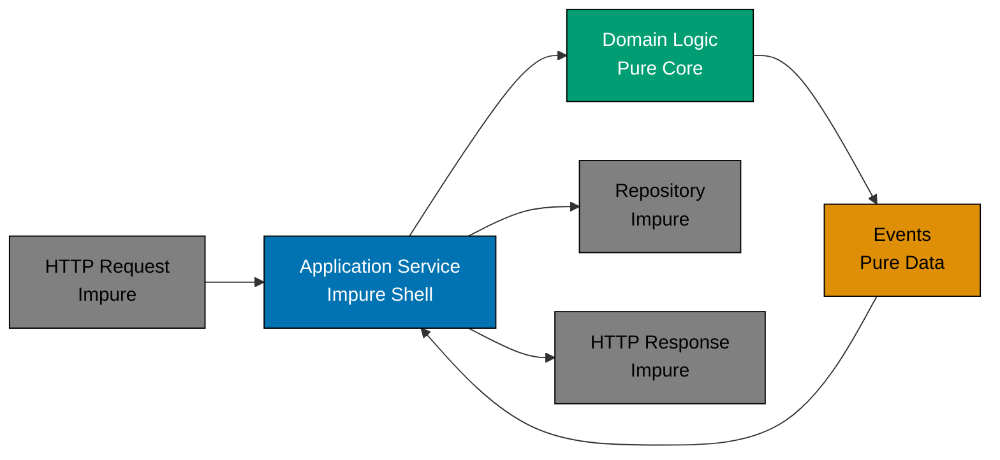

# DDD and Functional Programming

## Overview

Domain-Driven Design (DDD) was originally introduced in 2003 using object-oriented programming (OOP) languages like Java and C#. However, DDD principles translate naturally to functional programming (FP), and in many ways, FP's emphasis on immutability, pure functions, and explicit data flow aligns better with DDD's goals than traditional OOP.

This document shows how to adapt DDD tactical patterns (Entities, Value Objects, Aggregates, Domain Events) to functional programming paradigms, with TypeScript/JavaScript examples. The strategic patterns (Bounded Contexts, Context Mapping, Subdomains) remain unchanged across paradigms.

**Key Insight**: DDD is about modeling business domains accurately, not about using classes or objects. FP provides different tools for the same goal: representing business concepts clearly and enforcing business rules reliably.

## Why FP Aligns with DDD

### 1. Immutability Prevents Invalid State

**DDD Goal**: Aggregates protect invariants by controlling all state changes.

**FP Advantage**: Immutable data structures make invalid state transitions impossible.

```typescript
// OOP: Mutable state requires careful protection
class TaxAssessment {
  private status: AssessmentStatus; // Mutable

  finalize(): void {
    // Must validate before mutation
    if (this.status !== AssessmentStatus.Draft) {
      throw new Error("Cannot finalize non-draft assessment");
    }
    this.status = AssessmentStatus.Finalized; // Mutation
  }
}

// FP: Immutable state prevents accidental mutation
type TaxAssessment = {
  readonly status: AssessmentStatus;
  // ... other fields
};

function finalize(assessment: TaxAssessment): Result<TaxAssessment, DomainError> {
  if (assessment.status !== AssessmentStatus.Draft) {
    return Err(new Error("Cannot finalize non-draft assessment"));
  }

  // Returns new assessment, original unchanged
  return Ok({
    ...assessment,
    status: AssessmentStatus.Finalized,
  });
}
```

### 2. Pure Functions Make Domain Logic Testable

**DDD Goal**: Domain logic should be independent of infrastructure concerns.

**FP Advantage**: Pure functions have no side effects, making testing trivial.

```typescript
// OOP: Testing requires mocking dependencies
class TaxCalculator {
  constructor(private repository: TaxRepository) {} // Dependency

  calculate(assessmentId: string): TaxAmount {
    const assessment = this.repository.findById(assessmentId); // Side effect
    return assessment.wealth.multiply(0.025);
  }
}

// Test requires mock
const mockRepo = { findById: jest.fn() };
const calculator = new TaxCalculator(mockRepo);

// FP: Pure function, no dependencies
function calculateTax(wealth: Money, rate: TaxRate): TaxAmount {
  return wealth.multiply(rate.percentage);
}

// Test is trivial
expect(calculateTax(Money.usd(10000), TaxRate.standard())).toEqual(Money.usd(250));
```

### 3. Railway-Oriented Programming Handles Validation Gracefully

**DDD Goal**: Domain operations should validate inputs and enforce business rules.

**FP Advantage**: Result/Either types compose error handling without exceptions.

```typescript
// Result type for error handling
type Result<T, E> = Ok<T> | Err<E>;
type Ok<T> = { kind: "ok"; value: T };
type Err<E> = { kind: "err"; error: E };

// Pure functions return Result instead of throwing
function createTaxAssessment(holderId: WealthHolderId, startDate: HijriDate): Result<TaxAssessment, DomainError> {
  if (!startDate.isValid()) {
    return Err(new Error("Invalid start date"));
  }

  return Ok({
    id: AssessmentId.generate(),
    holderId,
    startDate,
    status: AssessmentStatus.Draft,
    declarations: [],
  });
}

// Chain operations with map/flatMap
const result = createTaxAssessment(holderId, startDate)
  .flatMap((assessment) => declareWealth(assessment, WealthType.Cash, Money.usd(10000)))
  .flatMap((assessment) => finalize(assessment, incomeThreshold, taxRate));

// Handle success or failure
match(result, {
  ok: (assessment) => console.log("Tax calculated:", assessment.taxAmount),
  err: (error) => console.error("Validation failed:", error.message),
});
```

### 4. Separated I/O (Functional Core, Imperative Shell)

**DDD Goal**: Domain logic should be isolated from infrastructure.

**FP Advantage**: Pure domain functions, impure I/O at edges.



**Architecture**:

- **Functional Core** (Pure): All domain logic, validations, calculations
- **Imperative Shell** (Impure): HTTP, database, file system, external APIs

## Adapting DDD Patterns to FP

### Entities in FP

**OOP Definition**: Objects with identity and mutable lifecycle.

**FP Adaptation**: Immutable data structures with identity-based equality.

**OOP Example**:

```typescript
class WealthHolder {
  constructor(
    private readonly id: WealthHolderId,
    private name: string,
    private email: Email,
  ) {}

  // Mutates internal state
  changeName(newName: string): void {
    this.name = newName;
  }

  // Identity-based equality
  equals(other: WealthHolder): boolean {
    return this.id.equals(other.id);
  }
}
```

**FP Example**:

```typescript
// Entity as immutable record
type WealthHolder = {
  readonly id: WealthHolderId;
  readonly name: string;
  readonly email: Email;
};

// Pure function returns new entity
function changeName(holder: WealthHolder, newName: string): WealthHolder {
  return {
    ...holder,
    name: newName,
  };
}

// Identity-based equality function
function equalsById(a: WealthHolder, b: WealthHolder): boolean {
  return a.id.value === b.id.value;
}
```

**Key Differences**:

- **OOP**: Encapsulation via private fields, methods mutate state
- **FP**: Public readonly fields, functions return new instances

**Testing**:

```typescript
describe("WealthHolder", () => {
  it("should maintain identity when name changes", () => {
    const original = {
      id: WealthHolderId.fromString("holder-1"),
      name: "Ahmad bin Ali",
      email: Email.fromString("ahmad@example.com"),
    };

    const updated = changeName(original, "Ahmad bin Ali Al-Mansur");

    expect(equalsById(original, updated)).toBe(true); // Same identity
    expect(original.name).toBe("Ahmad bin Ali"); // Original unchanged
    expect(updated.name).toBe("Ahmad bin Ali Al-Mansur"); // New value
  });
});
```

### Value Objects in FP

**OOP Definition**: Immutable objects with structural equality.

**FP Adaptation**: Natural fit - immutable records with structural equality.

**OOP Example**:

```typescript
class Money {
  private constructor(
    private readonly amount: number,
    private readonly currency: Currency,
  ) {}

  static usd(amount: number): Money {
    return new Money(amount, Currency.USD);
  }

  multiply(factor: number): Money {
    return new Money(this.amount * factor, this.currency);
  }

  equals(other: Money): boolean {
    return this.amount === other.amount && this.currency === other.currency;
  }
}
```

**FP Example**:

```typescript
// Value object as immutable record
type Money = {
  readonly amount: number;
  readonly currency: Currency;
};

// Factory function
const Money = {
  usd: (amount: number): Money => ({ amount, currency: Currency.USD }),
  eur: (amount: number): Money => ({ amount, currency: Currency.EUR }),
  zero: (): Money => ({ amount: 0, currency: Currency.USD }),
};

// Pure functions operate on value objects
function multiply(money: Money, factor: number): Money {
  return {
    ...money,
    amount: money.amount * factor,
  };
}

function add(a: Money, b: Money): Result<Money, DomainError> {
  if (a.currency !== b.currency) {
    return Err(new Error("Cannot add different currencies"));
  }
  return Ok({
    amount: a.amount + b.amount,
    currency: a.currency,
  });
}

// Structural equality
function equals(a: Money, b: Money): boolean {
  return a.amount === b.amount && a.currency === b.currency;
}
```

**Validation with Railway-Oriented Programming**:

```typescript
type ValidationError = { field: string; message: string };

function createMoney(amount: number, currency: Currency): Result<Money, ValidationError> {
  if (amount < 0) {
    return Err({ field: "amount", message: "Amount cannot be negative" });
  }

  if (!Object.values(Currency).includes(currency)) {
    return Err({ field: "currency", message: "Invalid currency" });
  }

  return Ok({ amount, currency });
}
```

### Aggregates in FP

**OOP Definition**: Cluster of entities/value objects with aggregate root controlling access.

**FP Adaptation**: Immutable data structure + pure validation functions.

**OOP Example**:

```typescript
class TaxAssessment {
  private constructor(
    readonly id: AssessmentId,
    private declarations: WealthDeclaration[],
    private status: AssessmentStatus,
  ) {}

  // Command: mutates internal state
  declareWealth(type: WealthType, amount: Money): void {
    if (this.status !== AssessmentStatus.Draft) {
      throw new Error("Cannot modify finalized assessment");
    }
    this.declarations.push(new WealthDeclaration(type, amount));
  }
}
```

**FP Example**:

```typescript
// Aggregate as immutable data
type TaxAssessment = {
  readonly id: AssessmentId;
  readonly holderId: WealthHolderId;
  readonly declarations: ReadonlyArray<WealthDeclaration>;
  readonly status: AssessmentStatus;
  readonly taxAmount: Money | null;
};

type WealthDeclaration = {
  readonly id: DeclarationId;
  readonly wealthType: WealthType;
  readonly amount: Money;
  readonly acquiredDate: HijriDate;
};

// Command function returns Result<new aggregate, error>
function declareWealth(
  assessment: TaxAssessment,
  wealthType: WealthType,
  amount: Money,
  acquiredDate: HijriDate,
): Result<TaxAssessment, DomainError> {
  // Validate invariants
  if (assessment.status !== AssessmentStatus.Draft) {
    return Err(new Error("Cannot modify finalized assessment"));
  }

  if (amount.amount <= 0) {
    return Err(new Error("Amount must be positive"));
  }

  // Create new declaration
  const declaration: WealthDeclaration = {
    id: DeclarationId.generate(),
    wealthType,
    amount,
    acquiredDate,
  };

  // Return new aggregate with added declaration
  return Ok({
    ...assessment,
    declarations: [...assessment.declarations, declaration],
  });
}

// Query function (pure, no side effects)
function calculateTotalWealth(assessment: TaxAssessment): Money {
  return assessment.declarations.reduce((total, decl) => add(total, decl.amount).unwrap(), Money.zero());
}

// Command function with domain event
function finalize(
  assessment: TaxAssessment,
  incomeThreshold: ThresholdAmount,
  taxRate: TaxRate,
): Result<[TaxAssessment, TaxCalculated], DomainError> {
  if (assessment.status !== AssessmentStatus.Draft) {
    return Err(new Error("Already finalized"));
  }

  if (assessment.declarations.length === 0) {
    return Err(new Error("No wealth declared"));
  }

  const totalWealth = calculateTotalWealth(assessment);
  const meetsThreshold = totalWealth.amount >= incomeThreshold.amount.amount;

  const taxAmount = meetsThreshold ? multiply(totalWealth, taxRate.percentage) : Money.zero();

  const updatedAssessment: TaxAssessment = {
    ...assessment,
    status: meetsThreshold ? AssessmentStatus.Finalized : AssessmentStatus.ExemptBelowThreshold,
    taxAmount,
  };

  const event: TaxCalculated = {
    assessmentId: assessment.id,
    holderId: assessment.holderId,
    taxAmount,
    calculatedAt: HijriDate.now(),
  };

  return Ok([updatedAssessment, event]);
}
```

**Aggregate Command Pattern**:

```typescript
// All commands follow this pattern
type Command<T, E> = (aggregate: T) => Result<T | [T, DomainEvent], E>;

// Example: Chain multiple commands
const result = createTaxAssessment(holderId, startDate)
  .flatMap((assessment) => declareWealth(assessment, WealthType.Cash, Money.usd(10000), date1))
  .flatMap((assessment) => declareWealth(assessment, WealthType.Gold, Money.usd(5000), date2))
  .flatMap((assessment) => finalize(assessment, incomeThreshold, taxRate));

match(result, {
  ok: ([finalAssessment, event]) => {
    // Persist assessment
    // Publish event
  },
  err: (error) => {
    // Handle validation failure
  },
});
```

**Benefits**:

- **Immutability**: Original aggregate never changes
- **Testability**: Pure functions, no mocks needed
- **Time Travel**: Easy to replay command history
- **Event Sourcing**: Natural fit (store commands/events, replay to rebuild state)

### Domain Events in FP

**OOP Definition**: Immutable records of business occurrences.

**FP Adaptation**: Already immutable - perfect fit.

**Event Definition**:

```typescript
type DomainEvent = TaxCalculated | WealthDeclared | AssessmentCreated | IncomeThresholdMet;

type TaxCalculated = {
  readonly kind: "TaxCalculated";
  readonly assessmentId: AssessmentId;
  readonly holderId: WealthHolderId;
  readonly taxAmount: Money;
  readonly calculatedAt: HijriDate;
};

type WealthDeclared = {
  readonly kind: "WealthDeclared";
  readonly assessmentId: AssessmentId;
  readonly declaration: WealthDeclaration;
  readonly declaredAt: HijriDate;
};
```

**Event Handling**:

```typescript
// Event handler type
type EventHandler<E extends DomainEvent> = (event: E) => Promise<void>;

// Pure projection function
function applyEvent(assessment: TaxAssessment, event: DomainEvent): TaxAssessment {
  switch (event.kind) {
    case "WealthDeclared":
      return {
        ...assessment,
        declarations: [...assessment.declarations, event.declaration],
      };

    case "TaxCalculated":
      return {
        ...assessment,
        taxAmount: event.taxAmount,
        status: AssessmentStatus.Finalized,
      };

    default:
      return assessment;
  }
}

// Event sourcing: rebuild aggregate from events
function replayEvents(events: ReadonlyArray<DomainEvent>, initialState: TaxAssessment): TaxAssessment {
  return events.reduce(applyEvent, initialState);
}
```

### Repositories in FP

**OOP Definition**: Persistence abstraction for aggregates.

**FP Adaptation**: Pure interface, impure implementation.

**Pure Repository Interface**:

```typescript
// Interface returns Result for error handling
interface TaxAssessmentRepository {
  findById(id: AssessmentId): Promise<Result<TaxAssessment, NotFoundError>>;
  save(assessment: TaxAssessment): Promise<Result<void, PersistenceError>>;
  findByHolder(holderId: WealthHolderId): Promise<Result<TaxAssessment[], PersistenceError>>;
}
```

**Impure Implementation** (isolated at edges):

```typescript
class PostgresTaxRepository implements TaxAssessmentRepository {
  constructor(private db: DatabaseConnection) {} // Impure dependency

  async findById(id: AssessmentId): Promise<Result<TaxAssessment, NotFoundError>> {
    try {
      const row = await this.db.query("SELECT * FROM tax_assessments WHERE id = $1", [id.value]);

      if (!row) {
        return Err(new NotFoundError(`Assessment ${id.value} not found`));
      }

      return Ok(this.toDomain(row)); // Map database row to domain model
    } catch (error) {
      return Err(new NotFoundError(error.message));
    }
  }

  private toDomain(row: any): TaxAssessment {
    // Impure: parsing database row
    return {
      id: AssessmentId.fromString(row.id),
      holderId: WealthHolderId.fromString(row.holder_id),
      declarations: JSON.parse(row.declarations),
      status: row.status as AssessmentStatus,
      taxAmount: row.tax_amount ? Money.usd(row.tax_amount) : null,
    };
  }
}
```

**Testing with Pure Functions**:

```typescript
// Test domain logic without repository
describe("TaxAssessment domain logic", () => {
  it("should calculate tax correctly", () => {
    const assessment = {
      id: AssessmentId.generate(),
      holderId: WealthHolderId.generate(),
      declarations: [
        {
          id: DeclarationId.generate(),
          wealthType: WealthType.Cash,
          amount: Money.usd(10000),
          acquiredDate: HijriDate.now(),
        },
      ],
      status: AssessmentStatus.Draft,
      taxAmount: null,
    };

    const result = finalize(assessment, ThresholdAmount.fromMoney(Money.usd(5000)), TaxRate.standard());

    expect(result.kind).toBe("ok");
    if (result.kind === "ok") {
      const [updated, event] = result.value;
      expect(updated.taxAmount?.amount).toBe(250); // 10000 * 0.025
    }
  });
});
```

### Domain Services in FP

**OOP Definition**: Stateless operations on domain objects.

**FP Adaptation**: Pure functions (already stateless).

**OOP Example**:

```typescript
class InterestDetectionService {
  detectInterest(transaction: FinancialTransaction): boolean {
    return transaction.interestRate > 0;
  }
}
```

**FP Example**:

```typescript
// Pure function - no class needed
function detectInterest(transaction: FinancialTransaction): boolean {
  return transaction.interestRate > 0;
}

// More complex service with multiple operations
const IslamicFinanceValidation = {
  detectInterest: (transaction: FinancialTransaction): boolean => {
    return transaction.interestRate > 0;
  },

  validateLoan: (contract: LoanContract): Result<void, ValidationError> => {
    if (contract.profitMargin > 0.5) {
      return Err({ field: "profitMargin", message: "Excessive profit margin" });
    }
    return Ok(undefined);
  },

  calculateProfitSharing: (investment: Money, ratio: ProfitSharingRatio, actualProfit: Money): [Money, Money] => {
    const investorShare = multiply(actualProfit, ratio.investorPercentage);
    const ownerShare = multiply(actualProfit, 1 - ratio.investorPercentage);
    return [investorShare, ownerShare];
  },
};
```

## Railway-Oriented Programming for Validation

Railway-Oriented Programming (ROP) is an FP pattern for composing validation logic. Instead of throwing exceptions, functions return `Result<T, E>` types that can be chained.

### Result Type

```typescript
type Result<T, E> = { kind: "ok"; value: T } | { kind: "err"; error: E };

// Constructors
function Ok<T>(value: T): Result<T, never> {
  return { kind: "ok", value };
}

function Err<E>(error: E): Result<never, E> {
  return { kind: "err", error };
}

// Utility functions
function isOk<T, E>(result: Result<T, E>): result is { kind: "ok"; value: T } {
  return result.kind === "ok";
}

function isErr<T, E>(result: Result<T, E>): result is { kind: "err"; error: E } {
  return result.kind === "err";
}
```

### Chaining with flatMap

```typescript
interface Result<T, E> {
  flatMap<U>(f: (value: T) => Result<U, E>): Result<U, E>;
  map<U>(f: (value: T) => U): Result<U, E>;
  mapErr<F>(f: (error: E) => F): Result<T, F>;
}

// Implementation
function flatMap<T, E, U>(result: Result<T, E>, f: (value: T) => Result<U, E>): Result<U, E> {
  if (result.kind === "ok") {
    return f(result.value);
  }
  return result; // Propagate error
}

function map<T, E, U>(result: Result<T, E>, f: (value: T) => U): Result<U, E> {
  if (result.kind === "ok") {
    return Ok(f(result.value));
  }
  return result;
}
```

### Example: Tax Assessment Validation Pipeline

```typescript
type ValidationError =
  | { kind: "InvalidDate"; message: string }
  | { kind: "InvalidAmount"; message: string }
  | { kind: "InvalidStatus"; message: string };

function validateStartDate(date: HijriDate): Result<HijriDate, ValidationError> {
  if (!date.isValid()) {
    return Err({ kind: "InvalidDate", message: "Start date is invalid" });
  }
  if (date.isAfter(HijriDate.now())) {
    return Err({ kind: "InvalidDate", message: "Start date cannot be in future" });
  }
  return Ok(date);
}

function validateAmount(amount: Money): Result<Money, ValidationError> {
  if (amount.amount <= 0) {
    return Err({ kind: "InvalidAmount", message: "Amount must be positive" });
  }
  if (amount.amount > 1_000_000_000) {
    return Err({ kind: "InvalidAmount", message: "Amount exceeds maximum" });
  }
  return Ok(amount);
}

function validateAssessmentStatus(status: AssessmentStatus): Result<AssessmentStatus, ValidationError> {
  const validStatuses = [AssessmentStatus.Draft, AssessmentStatus.Finalized, AssessmentStatus.ExemptBelowThreshold];
  if (!validStatuses.includes(status)) {
    return Err({ kind: "InvalidStatus", message: `Invalid status: ${status}` });
  }
  return Ok(status);
}

// Compose validations
function createValidatedAssessment(
  holderId: WealthHolderId,
  startDate: HijriDate,
): Result<TaxAssessment, ValidationError> {
  return validateStartDate(startDate).map((validDate) => ({
    id: AssessmentId.generate(),
    holderId,
    declarations: [],
    status: AssessmentStatus.Draft,
    taxAmount: null,
  }));
}

function addValidatedDeclaration(
  assessment: TaxAssessment,
  wealthType: WealthType,
  amount: Money,
  acquiredDate: HijriDate,
): Result<TaxAssessment, ValidationError> {
  return validateAmount(amount)
    .flatMap(() => validateStartDate(acquiredDate))
    .flatMap(() => declareWealth(assessment, wealthType, amount, acquiredDate));
}
```

### Pattern Matching for Error Handling

```typescript
function match<T, E, R>(result: Result<T, E>, handlers: { ok: (value: T) => R; err: (error: E) => R }): R {
  if (result.kind === "ok") {
    return handlers.ok(result.value);
  }
  return handlers.err(result.error);
}

// Usage
const assessment = createValidatedAssessment(holderId, startDate);

match(assessment, {
  ok: (a) => console.log("Assessment created:", a.id),
  err: (e) => console.error("Validation failed:", e.message),
});
```

## Comparison Table: OOP vs FP for DDD Patterns

| Pattern            | OOP Approach                              | FP Approach                                 | When to Use OOP                                    | When to Use FP                                            |
| ------------------ | ----------------------------------------- | ------------------------------------------- | -------------------------------------------------- | --------------------------------------------------------- |
| **Entity**         | Class with private fields, mutable state  | Immutable record, identity-based equality   | Complex lifecycle, many behaviors                  | Simple data structures, event sourcing                    |
| **Value Object**   | Immutable class, structural equality      | Immutable record, structural equality       | Complex validation logic                           | Simple domain primitives                                  |
| **Aggregate**      | Class with encapsulated entities          | Immutable data + pure validation functions  | Traditional CRUD, ORM integration                  | Event sourcing, functional core/imperative shell          |
| **Domain Event**   | Immutable class                           | Immutable record                            | Either (no difference)                             | Either (no difference)                                    |
| **Repository**     | Interface with class implementation       | Pure interface, impure implementation       | Rich query methods, complex caching                | Simple CRUD, separated I/O                                |
| **Domain Service** | Stateless class with methods              | Pure functions                              | Complex multi-aggregate operations                 | Simple calculations, no side effects                      |
| **Factory**        | Static method or Builder pattern          | Factory function                            | Complex construction with many optional parameters | Simple construction, composition                          |
| **Validation**     | Throw exceptions                          | Railway-Oriented Programming (Result type)  | Integration with existing exception-based code     | Composable validation pipelines, explicit errors          |
| **Event Handling** | Observer pattern, mutable subscribers     | Pure projection functions, event folding    | Complex event routing, dynamic subscriptions       | Event sourcing, time travel debugging                     |
| **Testing**        | Mocks/stubs for dependencies              | Pure functions, no mocks needed             | Heavy infrastructure integration                   | Pure domain logic                                         |
| **Concurrency**    | Locks, synchronized methods               | Immutable data (safe by default)            | Shared mutable state required                      | Concurrent operations on shared data                      |
| **Time Travel**    | Memento pattern, complex                  | Replay events/commands (trivial)            | Rarely needed                                      | Debugging, audit trails, temporal queries                 |
| **CQRS/ES**        | Possible but verbose                      | Natural fit                                 | Traditional database-centric design                | Event-driven architectures, high audit requirements       |
| **Error Handling** | Try/catch, checked exceptions             | Result/Either types, explicit               | Existing codebases with exceptions                 | New codebases, composable error handling                  |
| **Performance**    | Mutation can be faster (in-place updates) | Structural sharing (efficient immutability) | Tight loops, performance-critical paths            | Most business logic (immutability benefits outweigh cost) |

## Example: Tax Assessment in FP Style

Complete example using functional programming patterns:

```typescript
// ============================================================================
// Domain Types (Immutable)
// ============================================================================

type TaxAssessment = {
  readonly id: AssessmentId;
  readonly holderId: WealthHolderId;
  readonly period: LunarYearPeriod;
  readonly declarations: ReadonlyArray<WealthDeclaration>;
  readonly status: AssessmentStatus;
  readonly taxAmount: Money | null;
};

type WealthDeclaration = {
  readonly id: DeclarationId;
  readonly wealthType: WealthType;
  readonly amount: Money;
  readonly acquiredDate: HijriDate;
};

enum AssessmentStatus {
  Draft = 'DRAFT',
  Finalized = 'FINALIZED',
  ExemptBelowThreshold = 'EXEMPT_BELOW_THRESHOLD',
}

enum WealthType {
  Cash = 'CASH',
  Gold = 'GOLD',
  Silver = 'SILVER',
  TradableGoods = 'TRADABLE_GOODS',
}

// ============================================================================
// Domain Events
// ============================================================================

type DomainEvent =
  | { kind: 'AssessmentCreated'; assessmentId: AssessmentId; holderId: WealthHolderId }
  | { kind: 'WealthDeclared'; assessmentId: AssessmentId; declaration: WealthDeclaration }
  | { kind: 'TaxCalculated'; assessmentId: AssessmentId; taxAmount: Money; calculatedAt: HijriDate };

// ============================================================================
// Factory Functions
// ============================================================================

function createAssessment(
  holderId: WealthHolderId,
  startDate: HijriDate,
): Result<[TaxAssessment, DomainEvent], ValidationError> {
  if (!startDate.isValid()) {
    return Err({ field: 'startDate', message: 'Invalid start date' });
  }

  const assessment: TaxAssessment = {
    id: AssessmentId.generate(),
    holderId,
    period: LunarYearPeriod.fromStartDate(startDate),
    declarations: [],
    status: AssessmentStatus.Draft,
    taxAmount: null,
  };

  const event: DomainEvent = {
    kind: 'AssessmentCreated',
    assessmentId: assessment.id,
    holderId,
  };

  return Ok([assessment, event]);
}

// ============================================================================
// Commands (Pure Functions)
// ============================================================================

function declareWealth(
  assessment: TaxAssessment,
  wealthType: WealthType,
  amount: Money,
  acquiredDate: HijriDate,
): Result<[TaxAssessment, DomainEvent], DomainError> {
  // Validate invariants
  if (assessment.status !== AssessmentStatus.Draft) {
    return Err(new Error('Cannot modify finalized assessment'));
  }

  if (amount.amount <= 0) {
    return Err(new Error('Amount must be positive'));
  }

  if (!assessment.period.contains(acquiredDate)) {
    return Err(new Error('Acquired date outside assessment period'));
  }

  // Create new declaration
  const declaration: WealthDeclaration = {
    id: DeclarationId.generate(),
    wealthType,
    amount,
    acquiredDate,
  };

  // Return new assessment with added declaration
  const updatedAssessment: TaxAssessment = {
    ...assessment,
    declarations: [...assessment.declarations, declaration],
  };

  const event: DomainEvent = {
    kind: 'WealthDeclared',
    assessmentId: assessment.id,
    declaration,
  };

  return Ok([updatedAssessment, event]);
}

function finalize(
  assessment: TaxAssessment,
  incomeThreshold: ThresholdAmount,
  taxRate: TaxRate,
): Result<[TaxAssessment, DomainEvent], DomainError> {
  // Validate invariants
  if (assessment.status !== AssessmentStatus.Draft) {
    return Err(new Error('Assessment already finalized'));
  }

  if (!assessment.period.isComplete()) {
    return Err(new Error('Lunar year period not complete'));
  }

  if (assessment.declarations.length === 0) {
    return Err(new Error('No wealth declared'));
  }

  // Calculate total wealth
  const totalWealth = calculateTotalWealth(assessment);

  // Determine tax amount
  const meetsThreshold = totalWealth.amount >= incomeThreshold.amount.amount;
  const taxAmount = meetsThreshold
    ? multiply(totalWealth, taxRate.percentage)
    : Money.zero();

  const newStatus = meetsThreshold
    ? AssessmentStatus.Finalized
    : AssessmentStatus.ExemptBelowThreshold;

  // Return updated assessment
  const updatedAssessment: TaxAssessment = {
    ...assessment,
    status: newStatus,
    taxAmount,
  };

  const event: DomainEvent = {
    kind: 'TaxCalculated',
    assessmentId: assessment.id,
    taxAmount,
    calculatedAt: HijriDate.now(),
  };

  return Ok([updatedAssessment, event]);
}

// ============================================================================
// Queries (Pure Functions)
// ============================================================================

function calculateTotalWealth(assessment: TaxAssessment): Money {
  return assessment.declarations.reduce(
    (total, decl) => add(total, decl.amount).unwrapOr(total),
    Money.zero(),
  );
}

function meetsThreshold(assessment: TaxAssessment, threshold: ThresholdAmount): boolean {
  const total = calculateTotalWealth(assessment);
  return total.amount >= threshold.amount.amount;
}

function getDeclarationsByType(
  assessment: TaxAssessment,
  wealthType: WealthType,
): WealthDeclaration[] {
  return assessment.declarations.filter(d => d.wealthType === wealthType);
}

// ============================================================================
// Application Service (Impure Shell)
// ============================================================================

async function handleCreateAndFinalizeAssessment(
  holderId: WealthHolderId,
  startDate: HijriDate,
  declarations: Array<{ type: WealthType; amount: Money; date: HijriDate }>,
  repository: TaxAssessmentRepository,
  eventBus: EventBus,
): Promise<Result<TaxAssessment, Error>> {
  // Create assessment (pure)
  const createResult = createAssessment(holderId, startDate);
  if (createResult.kind === 'err') {
    return Err(createResult.error);
  }

  let [assessment, createEvent] = createResult.value;
  const events: DomainEvent[] = [createEvent];

  // Add declarations (pure)
  for (const decl of declarations) {
    const declareResult = declareWealth(assessment, decl.type, decl.amount, decl.date);
    if (declareResult.kind === 'err') {
      return Err(declareResult.error);
    }
    [assessment, const declareEvent] = declareResult.value;
    events.push(declareEvent);
  }

  // Finalize (pure)
  const finalizeResult = finalize(assessment, ThresholdAmount.goldStandard(), TaxRate.standard());
  if (finalizeResult.kind === 'err') {
    return Err(finalizeResult.error);
  }

  [assessment, const finalizeEvent] = finalizeResult.value;
  events.push(finalizeEvent);

  // Persist (impure)
  await repository.save(assessment);

  // Publish events (impure)
  for (const event of events) {
    await eventBus.publish(event);
  }

  return Ok(assessment);
}
```

## Testing FP Domain Models

Functional domain models are trivially testable:

```typescript
describe("TaxAssessment (FP)", () => {
  const holderId = WealthHolderId.generate();
  const startDate = HijriDate.fromString("1444-01-01");

  describe("createAssessment", () => {
    it("should create assessment with initial state", () => {
      const result = createAssessment(holderId, startDate);

      expect(result.kind).toBe("ok");
      if (result.kind === "ok") {
        const [assessment, event] = result.value;
        expect(assessment.status).toBe(AssessmentStatus.Draft);
        expect(assessment.declarations).toHaveLength(0);
        expect(event.kind).toBe("AssessmentCreated");
      }
    });

    it("should reject invalid start date", () => {
      const invalidDate = HijriDate.fromString("invalid");
      const result = createAssessment(holderId, invalidDate);

      expect(result.kind).toBe("err");
    });
  });

  describe("declareWealth", () => {
    it("should add declaration to draft assessment", () => {
      const createResult = createAssessment(holderId, startDate);
      expect(createResult.kind).toBe("ok");

      if (createResult.kind === "ok") {
        const [assessment] = createResult.value;
        const declareResult = declareWealth(assessment, WealthType.Cash, Money.usd(10000), startDate);

        expect(declareResult.kind).toBe("ok");
        if (declareResult.kind === "ok") {
          const [updated, event] = declareResult.value;
          expect(updated.declarations).toHaveLength(1);
          expect(event.kind).toBe("WealthDeclared");

          // Original unchanged (immutability)
          expect(assessment.declarations).toHaveLength(0);
        }
      }
    });

    it("should reject declaration on finalized assessment", () => {
      const finalizedAssessment: TaxAssessment = {
        id: AssessmentId.generate(),
        holderId,
        period: LunarYearPeriod.fromStartDate(startDate),
        declarations: [],
        status: AssessmentStatus.Finalized,
        taxAmount: Money.zero(),
      };

      const result = declareWealth(finalizedAssessment, WealthType.Cash, Money.usd(1000), startDate);

      expect(result.kind).toBe("err");
    });
  });

  describe("calculateTotalWealth", () => {
    it("should sum all declarations", () => {
      const assessment: TaxAssessment = {
        id: AssessmentId.generate(),
        holderId,
        period: LunarYearPeriod.fromStartDate(startDate),
        declarations: [
          {
            id: DeclarationId.generate(),
            wealthType: WealthType.Cash,
            amount: Money.usd(10000),
            acquiredDate: startDate,
          },
          {
            id: DeclarationId.generate(),
            wealthType: WealthType.Gold,
            amount: Money.usd(5000),
            acquiredDate: startDate,
          },
        ],
        status: AssessmentStatus.Draft,
        taxAmount: null,
      };

      const total = calculateTotalWealth(assessment);

      expect(total.amount).toBe(15000);
    });
  });
});
```

**No Mocks Needed**: All domain logic is pure functions with no side effects.

## Summary

Functional Programming aligns naturally with Domain-Driven Design:

**Key Adaptations:**

- **Entities**: Immutable records with identity-based equality
- **Value Objects**: Immutable records with structural equality (natural fit)
- **Aggregates**: Immutable data + pure validation functions
- **Domain Events**: Immutable records (no change from OOP)
- **Repositories**: Pure interfaces, impure implementations isolated
- **Domain Services**: Pure functions (already stateless)

**FP Advantages for DDD:**

- **Immutability**: Invalid state transitions impossible
- **Pure Functions**: Trivial testing, no mocks
- **Railway-Oriented Programming**: Composable validation
- **Separated I/O**: Pure domain core, impure infrastructure shell
- **Event Sourcing**: Natural fit (replay events to rebuild state)

**When to Use FP for DDD:**

- New greenfield projects
- Event-driven architectures
- High testability requirements
- Functional programming team expertise
- Event sourcing or CQRS planned

**When to Use OOP for DDD:**

- Existing OOP codebases
- Team primarily experienced with OOP
- Heavy ORM integration
- Traditional CRUD applications

## Next Steps

- **[Layered Architecture](./ex-so-ar-dodrdedd__15-layered-architecture.md)** - Organizing pure domain core with impure infrastructure
- **[Aggregates](./ex-so-ar-dodrdedd__09-aggregates.md)** - Consistency boundaries (applicable to both OOP and FP)
- **[Domain Events](./ex-so-ar-dodrdedd__12-domain-events.md)** - Event-driven patterns
- **[Decision Trees and Best Practices](./ex-so-ar-dodrdedd__16-decision-trees-and-best-practices.md)** - Practical guidance

## References

- Scott Wlaschin, "Domain Modeling Made Functional" (2018)
- Mark Seemann, "Functional Architecture" series
- Scott Wlaschin, ["Railway Oriented Programming"](https://fsharpforfunandprofit.com/rop/)
- Eric Evans, "Domain-Driven Design" (2003) - Original OOP perspective
- Vaughn Vernon, "Implementing Domain-Driven Design" (2013) - OOP implementation
