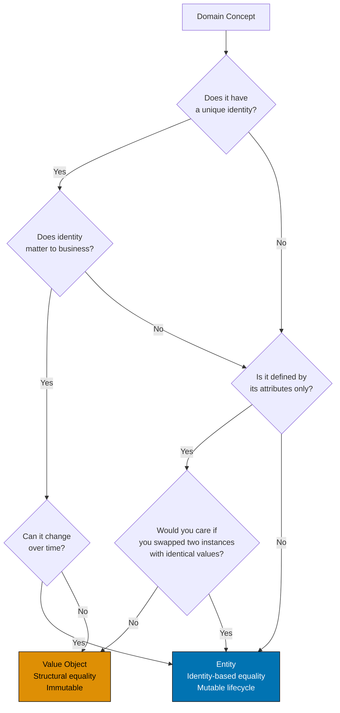
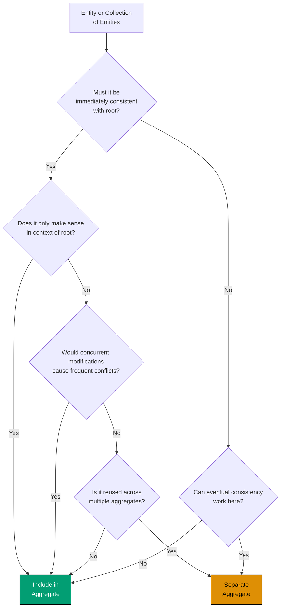

# Decision Trees and Best Practices

## Overview

Domain-Driven Design provides powerful patterns, but knowing _when_ and _how_ to apply them requires judgment. This document provides decision trees, flowcharts, checklists, and practical guidance to help you make good DDD decisions in real projects.

Topics covered:

- Entity vs Value Object decision tree
- Aggregate boundary decision tree
- Common anti-patterns and how to avoid them
- Testing strategies for DDD
- Performance considerations
- Refactoring from anemic to rich domain model

## Entity vs Value Object Decision Tree

One of the most common questions in DDD: Should this be an Entity or a Value Object?



### Examples

**Entity Examples**:

- **Wealth Holder**: Unique ID, changes over time (name, address), identity matters
- **Zakat Assessment**: Unique ID, lifecycle (draft → finalized), identity matters
- **Order**: Unique order number, status changes, identity matters

**Value Object Examples**:

- **Money**: Defined by amount + currency, no identity, immutable
- **HijriDate**: Defined by year/month/day, no identity, immutable
- **Address**: Defined by street/city/country, no identity (two identical addresses are interchangeable)

### Key Questions

1. **Does it have a unique identity?**
   - Entity: `ZakatAssessment` with `assessmentId`
   - Value Object: `Money` (100 USD is 100 USD, doesn't need ID)

2. **Does it change over time?**
   - Entity: `Order` status changes (draft → submitted → fulfilled)
   - Value Object: `Money` never changes (to change amount, create new Money instance)

3. **Would you care if you swapped two instances with identical values?**
   - Entity: Yes! Two `Customer` instances with same name are different people
   - Value Object: No! Two `Money` instances with same amount/currency are interchangeable

## Aggregate Boundary Decision Tree

Determining what belongs inside an aggregate is critical for consistency and performance.



### Examples

**Include in Aggregate**:

- **Order Lines in Order**: Must be immediately consistent (order total = sum of lines)
- **Wealth Declarations in Zakat Assessment**: Only make sense in context of assessment

**Separate Aggregate**:

- **Customer in Order**: Customer is reused across many orders, eventual consistency OK
- **Product in Order**: Product is reused across many orders, eventual consistency OK

### Guidelines

**Keep aggregates small**:

- Smaller aggregates = fewer concurrency conflicts
- Load only what you need
- Faster persistence

**Use ID references between aggregates**:

```typescript
// GOOD: Reference by ID
class Order {
  orderId: OrderId;
  customerId: CustomerId; // ID reference
  productId: ProductId; // ID reference
}

// BAD: Direct object reference
class Order {
  orderId: OrderId;
  customer: Customer; // Loads entire customer graph
  product: Product; // Loads entire product catalog
}
```

**Immediate vs Eventual Consistency**:

- **Immediate**: Within aggregate (single transaction)
- **Eventual**: Between aggregates (domain events, message queues)

## Common Anti-Patterns

### 1. Anemic Domain Model

**Problem**: Domain objects have no behavior, only getters/setters. Business logic lives in services.

**Example**:

```typescript
// ANTI-PATTERN: Anemic domain model
class ZakatAssessment {
  id: string;
  declarations: WealthDeclaration[];
  status: string;
  zakatAmount: number | null;

  // Only getters/setters, no behavior
  getId(): string {
    return this.id;
  }
  setStatus(status: string): void {
    this.status = status;
  }
}

// Business logic in service (WRONG)
class ZakatService {
  calculate(assessmentId: string): number {
    const assessment = this.repo.findById(assessmentId);
    const total = assessment.declarations.reduce((sum, d) => sum + d.amount, 0);
    const zakat = total > 5000 ? total * 0.025 : 0;
    assessment.setZakatAmount(zakat);
    this.repo.save(assessment);
    return zakat;
  }
}
```

**Problems**:

- Business rules scattered across services
- Duplicate logic (multiple services calculate zakat differently)
- Difficult to test (services depend on infrastructure)

**Solution**: Rich domain model with behavior.

```typescript
// BETTER: Rich domain model
class ZakatAssessment {
  private constructor(
    readonly id: AssessmentId,
    private declarations: WealthDeclaration[],
    private status: AssessmentStatus,
    private zakatAmount: Money | null,
  ) {}

  // Business logic in domain
  finalize(nisabThreshold: NisabAmount, zakatRate: ZakatRate): Result<ZakatAssessment, DomainError> {
    if (this.declarations.length === 0) {
      return Err(new InvalidOperationError("No wealth declared"));
    }

    const totalWealth = this.calculateTotalWealth();
    const meetsNisab = totalWealth.isGreaterThanOrEqual(nisabThreshold.toMoney());
    const zakatAmount = meetsNisab ? totalWealth.multiply(zakatRate.percentage) : Money.zero();

    return Ok(new ZakatAssessment(this.id, this.declarations, AssessmentStatus.Finalized, zakatAmount));
  }

  private calculateTotalWealth(): Money {
    return this.declarations.reduce((total, d) => total.add(d.amount), Money.zero());
  }
}
```

### 2. Large Aggregates

**Problem**: Including too many entities in aggregate causes performance issues and concurrency conflicts.

**Example**:

```typescript
// ANTI-PATTERN: Too large
class Customer {
  customerId: CustomerId;
  name: string;
  addresses: Address[]; // Hundreds
  orders: Order[]; // Thousands
  supportTickets: Ticket[]; // Hundreds
  invoices: Invoice[]; // Thousands
}
```

**Problems**:

- Loading customer loads entire object graph (slow)
- Concurrent updates to orders and tickets conflict
- Large transaction scope

**Solution**: Separate aggregates with ID references.

```typescript
// BETTER: Multiple small aggregates
class Customer {
  customerId: CustomerId;
  name: string;
  email: Email;
  defaultAddressId: AddressId; // Reference by ID
}

class Order {
  orderId: OrderId;
  customerId: CustomerId; // Reference by ID
  orderLines: OrderLine[];
  total: Money;
}

class SupportTicket {
  ticketId: TicketId;
  customerId: CustomerId; // Reference by ID
  messages: Message[];
}
```

### 3. Breaking Encapsulation

**Problem**: Exposing mutable collections or internal state.

**Example**:

```typescript
// ANTI-PATTERN: Exposing mutable collection
class ZakatAssessment {
  private declarations: WealthDeclaration[];

  getDeclarations(): WealthDeclaration[] {
    return this.declarations; // Mutable array!
  }
}

// External code can bypass invariants
const assessment = repo.findById(id);
assessment.getDeclarations().push(invalidDeclaration); // Bypassed validation!
```

**Solution**: Return immutable views or copies.

```typescript
// BETTER: Immutable view
class ZakatAssessment {
  private declarations: WealthDeclaration[];

  get declarations(): readonly WealthDeclaration[] {
    return Object.freeze([...this.declarations]);
  }

  // Enforce invariants via methods
  declareWealth(type: WealthType, amount: Money, date: HijriDate): Result<ZakatAssessment, DomainError> {
    // Validation here
    if (amount.amount <= 0) {
      return Err(new InvalidAmountError("Amount must be positive"));
    }
    // Add declaration
    return Ok(
      new ZakatAssessment(
        this.id,
        [...this.declarations, new WealthDeclaration(type, amount, date)],
        this.status,
        this.zakatAmount,
      ),
    );
  }
}
```

### 4. Infrastructure in Domain

**Problem**: Domain layer depends on database, HTTP, or frameworks.

**Example**:

```typescript
// ANTI-PATTERN: Domain depends on Prisma
import { PrismaClient } from '@prisma/client';

class ZakatAssessment {
  async save(prisma: PrismaClient): Promise<void> {
    await prisma.zakatAssessment.create({
      data: { id: this.id, ... },
    });
  }
}
```

**Solution**: Repository interfaces in domain, implementations in infrastructure.

```typescript
// BETTER: Domain defines interface
interface ZakatAssessmentRepository {
  save(assessment: ZakatAssessment): Promise<Result<void, PersistenceError>>;
}

// Infrastructure implements
class PrismaZakatRepository implements ZakatAssessmentRepository {
  constructor(private prisma: PrismaClient) {}

  async save(assessment: ZakatAssessment): Promise<Result<void, PersistenceError>> {
    await this.prisma.zakatAssessment.create({ ... });
    return Ok(undefined);
  }
}
```

### 5. Primitive Obsession

**Problem**: Using primitive types (string, number) instead of Value Objects.

**Example**:

```typescript
// ANTI-PATTERN: Primitive obsession
class ZakatAssessment {
  zakatAmount: number; // What currency?
  startDate: string; // What format?
  holderId: string; // No validation

  calculate(nisabThreshold: number, zakatRate: number): number {
    // Magic numbers everywhere
  }
}
```

**Solution**: Use Value Objects for domain concepts.

```typescript
// BETTER: Value Objects
class ZakatAssessment {
  zakatAmount: Money; // Explicit currency
  startDate: HijriDate; // Explicit format
  holderId: WealthHolderId; // Validated ID

  finalize(nisabThreshold: NisabAmount, zakatRate: ZakatRate): Result<ZakatAssessment, DomainError> {
    // Type-safe, validated
  }
}

// Value Objects encapsulate validation
class Money {
  private constructor(
    readonly amount: number,
    readonly currency: Currency,
  ) {}

  static usd(amount: number): Result<Money, ValidationError> {
    if (amount < 0) {
      return Err({ field: "amount", message: "Amount cannot be negative" });
    }
    return Ok(new Money(amount, Currency.USD));
  }
}
```

### 6. Using Getters/Setters Instead of Intention-Revealing Methods

**Problem**: Generic setters hide business operations.

**Example**:

```typescript
// ANTI-PATTERN: Generic setters
class Order {
  setStatus(status: OrderStatus): void {
    this.status = status; // No validation!
  }
}

// Usage is unclear
order.setStatus(OrderStatus.Cancelled); // Why cancelled? Was it validated?
```

**Solution**: Intention-revealing methods.

```typescript
// BETTER: Intention-revealing methods
class Order {
  cancel(reason: CancellationReason): Result<Order, DomainError> {
    if (this.status === OrderStatus.Shipped) {
      return Err(new InvalidOperationError("Cannot cancel shipped order"));
    }

    return Ok(new Order(this.id, OrderStatus.Cancelled, reason));
  }

  ship(trackingNumber: TrackingNumber): Result<Order, DomainError> {
    if (this.status !== OrderStatus.Paid) {
      return Err(new InvalidOperationError("Can only ship paid orders"));
    }

    return Ok(new Order(this.id, OrderStatus.Shipped, trackingNumber));
  }
}

// Usage is clear
const result = order.cancel(CancellationReason.OutOfStock);
```

## Testing Strategies

### 1. Unit Tests (Domain Layer)

**Goal**: Test business logic without infrastructure.

**Pattern**: Arrange-Act-Assert with pure domain objects.

```typescript
describe("ZakatAssessment", () => {
  describe("finalize", () => {
    it("should calculate zakat when above nisab", () => {
      // Arrange
      const assessment = createTestAssessment([{ type: WealthType.Cash, amount: Money.usd(10000) }]);

      // Act
      const result = assessment.finalize(
        NisabAmount.fromMoney(Money.usd(5000)),
        ZakatRate.standard(), // 2.5%
      );

      // Assert
      expect(result.kind).toBe("ok");
      if (result.kind === "ok") {
        expect(result.value.zakatAmount?.amount).toBe(250); // 10000 * 0.025
      }
    });

    it("should exempt when below nisab", () => {
      // Arrange
      const assessment = createTestAssessment([{ type: WealthType.Cash, amount: Money.usd(3000) }]);

      // Act
      const result = assessment.finalize(NisabAmount.fromMoney(Money.usd(5000)), ZakatRate.standard());

      // Assert
      expect(result.kind).toBe("ok");
      if (result.kind === "ok") {
        expect(result.value.status).toBe(AssessmentStatus.ExemptBelowNisab);
        expect(result.value.zakatAmount?.amount).toBe(0);
      }
    });

    it("should reject finalization without declarations", () => {
      // Arrange
      const assessment = createTestAssessment([]); // No declarations

      // Act
      const result = assessment.finalize(NisabAmount.fromMoney(Money.usd(5000)), ZakatRate.standard());

      // Assert
      expect(result.kind).toBe("err");
      if (result.kind === "err") {
        expect(result.error.message).toContain("No wealth declared");
      }
    });
  });
});
```

### 2. Integration Tests (Application Layer)

**Goal**: Test use cases with mocked infrastructure.

**Pattern**: Mock repositories and event buses.

```typescript
describe("CalculateZakatUseCase", () => {
  it("should persist assessment and publish events", async () => {
    // Arrange
    const mockRepo: ZakatAssessmentRepository = {
      findById: jest.fn(),
      save: jest.fn().mockResolvedValue(Ok(undefined)),
    };

    const mockEventBus: EventBus = {
      publish: jest.fn().mockResolvedValue(undefined),
    };

    const useCase = new CalculateZakatUseCase(mockRepo, mockEventBus);

    const dto = new CreateZakatAssessmentDTO("holder-123", "1444-01-01", [
      { type: "Cash", amount: 10000, date: "1444-01-01" },
    ]);

    // Act
    const result = await useCase.execute(dto);

    // Assert
    expect(result.kind).toBe("ok");
    expect(mockRepo.save).toHaveBeenCalledTimes(1);
    expect(mockEventBus.publish).toHaveBeenCalled();
  });
});
```

### 3. Repository Tests (Infrastructure Layer)

**Goal**: Test database integration.

**Pattern**: Use test database (in-memory or Docker container).

```typescript
describe("PostgresZakatAssessmentRepository", () => {
  let db: TestDatabase;
  let repo: PostgresZakatAssessmentRepository;

  beforeAll(async () => {
    db = await TestDatabase.create();
    repo = new PostgresZakatAssessmentRepository(db.connection, new ZakatAssessmentMapper());
  });

  afterAll(async () => {
    await db.destroy();
  });

  beforeEach(async () => {
    await db.clear();
  });

  it("should save and retrieve assessment", async () => {
    // Arrange
    const assessment = createTestAssessment();

    // Act
    const saveResult = await repo.save(assessment);
    const findResult = await repo.findById(assessment.id);

    // Assert
    expect(saveResult.kind).toBe("ok");
    expect(findResult.kind).toBe("ok");

    if (findResult.kind === "ok") {
      expect(findResult.value.id.equals(assessment.id)).toBe(true);
      expect(findResult.value.declarations.length).toBe(assessment.declarations.length);
    }
  });

  it("should return NotFoundError for non-existent assessment", async () => {
    // Act
    const result = await repo.findById(AssessmentId.generate());

    // Assert
    expect(result.kind).toBe("err");
    if (result.kind === "err") {
      expect(result.error).toBeInstanceOf(NotFoundError);
    }
  });
});
```

### 4. Domain Tests (Business Scenarios)

**Goal**: Test complex business scenarios end-to-end.

**Pattern**: Given-When-Then with domain events.

```typescript
describe("Zakat Assessment Business Scenarios", () => {
  it("Given wealthy holder with mixed assets, When calculating zakat, Then should correctly aggregate all wealth", () => {
    // Given
    const assessment = ZakatAssessment.create(WealthHolderId.generate(), HijriDate.fromString("1444-01-01")).unwrap();

    // When
    const withCash = assessment
      .declareWealth(WealthType.Cash, Money.usd(5000), HijriDate.fromString("1444-01-01"))
      .unwrap();

    const withGold = withCash
      .declareWealth(WealthType.Gold, Money.usd(3000), HijriDate.fromString("1444-02-01"))
      .unwrap();

    const withSilver = withGold
      .declareWealth(WealthType.Silver, Money.usd(2000), HijriDate.fromString("1444-03-01"))
      .unwrap();

    const finalized = withSilver.finalize(NisabAmount.fromMoney(Money.usd(5000)), ZakatRate.standard()).unwrap();

    // Then
    expect(finalized.zakatAmount?.amount).toBe(250); // (5000 + 3000 + 2000) * 0.025
    expect(finalized.status).toBe(AssessmentStatus.Finalized);
  });
});
```

## Performance Considerations

### 1. Aggregate Size and Loading

**Problem**: Loading large aggregates is slow.

**Solution**: Keep aggregates small or use lazy loading for rarely-accessed parts.

```typescript
// GOOD: Small aggregate
class Order {
  orderId: OrderId;
  customerId: CustomerId; // Reference only, don't load entire customer
  orderLines: OrderLine[]; // Usually <10 items
  total: Money;
}

// AVOID: Large aggregate
class Order {
  orderId: OrderId;
  customer: Customer; // Loads entire customer with addresses, orders, tickets
  orderLines: OrderLine[];
  product: Product; // Loads entire product catalog
}
```

### 2. N+1 Query Problem

**Problem**: Loading aggregates in loop causes many database queries.

```typescript
// ANTI-PATTERN: N+1 queries
const orderIds = ['order1', 'order2', 'order3', ...]; // 100 orders
const orders = [];
for (const id of orderIds) {
  const order = await orderRepo.findById(id); // 100 database queries!
  orders.push(order);
}
```

**Solution**: Batch loading.

```typescript
// BETTER: Batch loading
const orders = await orderRepo.findByIds(['order1', 'order2', 'order3', ...]); // 1 query
```

### 3. Caching Aggregates

**Strategy**: Cache frequently-accessed, rarely-changed aggregates.

```typescript
class CachedZakatAssessmentRepository implements ZakatAssessmentRepository {
  constructor(
    private innerRepo: ZakatAssessmentRepository,
    private cache: Cache,
  ) {}

  async findById(id: AssessmentId): Promise<Result<ZakatAssessment, NotFoundError>> {
    const cacheKey = `assessment:${id.value}`;
    const cached = await this.cache.get(cacheKey);

    if (cached) {
      return Ok(deserialize(cached));
    }

    const result = await this.innerRepo.findById(id);

    if (result.kind === "ok") {
      await this.cache.set(cacheKey, serialize(result.value), { ttl: 300 }); // 5 min
    }

    return result;
  }

  async save(assessment: ZakatAssessment): Promise<Result<void, PersistenceError>> {
    const result = await this.innerRepo.save(assessment);

    if (result.kind === "ok") {
      // Invalidate cache
      await this.cache.delete(`assessment:${assessment.id.value}`);
    }

    return result;
  }
}
```

### 4. Optimistic Locking

**Problem**: Concurrent modifications cause data loss.

**Solution**: Version number on aggregate root.

```typescript
class ZakatAssessment {
  constructor(
    readonly id: AssessmentId,
    readonly version: number, // Optimistic lock version
    private declarations: WealthDeclaration[],
    private status: AssessmentStatus,
  ) {}
}

// Repository saves with version check
class PostgresZakatAssessmentRepository {
  async save(assessment: ZakatAssessment): Promise<Result<void, PersistenceError>> {
    const result = await this.db.query(
      `UPDATE zakat_assessments
       SET declarations = $1, status = $2, version = version + 1
       WHERE id = $3 AND version = $4`,
      [
        JSON.stringify(assessment.declarations),
        assessment.status,
        assessment.id.value,
        assessment.version, // Optimistic lock check
      ],
    );

    if (result.rowCount === 0) {
      return Err(new ConcurrencyError("Assessment was modified by another transaction"));
    }

    return Ok(undefined);
  }
}
```

## Refactoring from Anemic to Rich Domain Model

### Step 1: Identify Business Rules

**Find all places where business logic exists:**

- Controllers
- Services
- Utilities
- Database stored procedures

**Example**: Zakat calculation scattered across codebase.

```typescript
// Business logic in controller
class ZakatController {
  async calculate(req, res) {
    const total = req.body.declarations.reduce((sum, d) => sum + d.amount, 0);
    const zakat = total > 5000 ? total * 0.025 : 0; // Business rule!
    res.json({ zakat });
  }
}

// Same logic duplicated in service
class ReportingService {
  generateReport(assessmentId) {
    const assessment = this.repo.findById(assessmentId);
    const total = assessment.declarations.reduce((sum, d) => sum + d.amount, 0);
    const zakat = total > 5000 ? total * 0.025 : 0; // Duplicated!
    return { total, zakat };
  }
}
```

### Step 2: Extract Business Logic to Domain

**Move business rules into domain entities:**

```typescript
// Rich domain model
class ZakatAssessment {
  finalize(nisabThreshold: NisabAmount, zakatRate: ZakatRate): Result<ZakatAssessment, DomainError> {
    const totalWealth = this.calculateTotalWealth();
    const meetsNisab = totalWealth.isGreaterThanOrEqual(nisabThreshold.toMoney());
    const zakatAmount = meetsNisab ? totalWealth.multiply(zakatRate.percentage) : Money.zero();

    return Ok(new ZakatAssessment(this.id, this.declarations, AssessmentStatus.Finalized, zakatAmount));
  }

  private calculateTotalWealth(): Money {
    return this.declarations.reduce((total, d) => total.add(d.amount), Money.zero());
  }
}
```

### Step 3: Refactor Services to Use Domain Methods

```typescript
// Application service delegates to domain
class CalculateZakatUseCase {
  async execute(dto: CreateZakatAssessmentDTO): Promise<Result<ZakatAssessment, ApplicationError>> {
    const assessment = ZakatAssessment.create(
      WealthHolderId.fromString(dto.holderId),
      HijriDate.fromString(dto.startDate),
    ).unwrap();

    // Domain logic
    const finalized = assessment.finalize(NisabAmount.goldStandard(), ZakatRate.standard());

    if (finalized.kind === "err") {
      return Err(new DomainValidationError(finalized.error));
    }

    await this.repo.save(finalized.value);
    return Ok(finalized.value);
  }
}
```

### Step 4: Introduce Value Objects

**Replace primitives with Value Objects:**

```typescript
// Before: Primitives
class ZakatAssessment {
  zakatAmount: number;
  currency: string;
}

// After: Value Object
class ZakatAssessment {
  zakatAmount: Money; // Value Object encapsulates amount + currency
}

class Money {
  private constructor(
    readonly amount: number,
    readonly currency: Currency,
  ) {}

  static usd(amount: number): Result<Money, ValidationError> {
    if (amount < 0) return Err({ field: "amount", message: "Cannot be negative" });
    return Ok(new Money(amount, Currency.USD));
  }

  multiply(factor: number): Money {
    return new Money(this.amount * factor, this.currency);
  }
}
```

### Step 5: Add Invariant Protection

**Enforce business rules:**

```typescript
class ZakatAssessment {
  declareWealth(type: WealthType, amount: Money, date: HijriDate): Result<ZakatAssessment, DomainError> {
    // Invariant: Can only modify draft assessments
    if (this.status !== AssessmentStatus.Draft) {
      return Err(new InvalidOperationError("Cannot modify finalized assessment"));
    }

    // Invariant: Amount must be positive
    if (amount.amount <= 0) {
      return Err(new InvalidAmountError("Amount must be positive"));
    }

    // Invariant: Date must be within assessment period
    if (!this.period.contains(date)) {
      return Err(new InvalidDateError("Date outside assessment period"));
    }

    return Ok(
      new ZakatAssessment(
        this.id,
        [...this.declarations, new WealthDeclaration(type, amount, date)],
        this.status,
        this.zakatAmount,
      ),
    );
  }
}
```

## Checklist: Is This Good DDD?

Use this checklist to evaluate your DDD implementation:

### Strategic Design

- [ ] Bounded Contexts identified and documented
- [ ] Context Map shows relationships between contexts
- [ ] Subdomains classified (Core, Supporting, Generic)
- [ ] Ubiquitous Language glossary maintained
- [ ] Domain experts regularly consulted

### Tactical Design

- [ ] Domain layer has no infrastructure dependencies
- [ ] Aggregates are small (typically <10 entities)
- [ ] Aggregates enforce invariants
- [ ] Value Objects used for domain primitives (Money, Date, Email)
- [ ] Entities have identity-based equality
- [ ] Domain Events capture business occurrences
- [ ] Repositories exist only for aggregate roots
- [ ] Business logic is in domain layer, not services

### Code Quality

- [ ] Domain logic is testable without mocks
- [ ] Intention-revealing method names (not generic setters)
- [ ] Immutability used where appropriate
- [ ] No primitive obsession (using Value Objects)
- [ ] No anemic domain model (behavior in entities)
- [ ] No leaky abstractions (domain doesn't know about DB)

### Architecture

- [ ] Layered architecture (Presentation → Application → Domain → Infrastructure)
- [ ] Dependency inversion (domain defines interfaces, infrastructure implements)
- [ ] Separated I/O (pure domain core, impure infrastructure shell)
- [ ] Nx enforces layer dependencies via tags

## Summary

Good DDD decisions require:

**Decision Trees:**

- Entity vs Value Object: Identity + mutability = Entity
- Aggregate Boundaries: Immediate consistency = include, eventual = separate

**Anti-Patterns to Avoid:**

- Anemic domain model (put behavior in entities)
- Large aggregates (keep small, use ID references)
- Breaking encapsulation (return immutable views)
- Infrastructure in domain (use repository interfaces)
- Primitive obsession (use Value Objects)

**Testing Strategies:**

- Unit tests: Domain logic (no mocks)
- Integration tests: Application layer (mock infrastructure)
- Repository tests: Database integration
- Domain tests: Business scenarios (Given-When-Then)

**Performance:**

- Small aggregates (faster loading)
- Batch loading (avoid N+1 queries)
- Caching (frequently-accessed aggregates)
- Optimistic locking (prevent concurrent modification conflicts)

**Refactoring:**

1. Identify business rules scattered in code
2. Extract to domain entities
3. Refactor services to delegate to domain
4. Introduce Value Objects
5. Add invariant protection

## Next Steps

- **[Aggregates](./ex-so-ar-dodrdedd__09-aggregates.md)** - Deep dive into aggregate design
- **[Value Objects](./ex-so-ar-dodrdedd__08-value-objects.md)** - Replacing primitives with Value Objects
- **[DDD and Functional Programming](./ex-so-ar-dodrdedd__14-ddd-and-functional-programming.md)** - Immutability and pure functions
- **[Layered Architecture](./ex-so-ar-dodrdedd__15-layered-architecture.md)** - Organizing layers correctly
- **[Aggregate Design Template](./templates/ex-so-ar-dodrdedd-te__aggregate-design-template.md)** - Document your aggregates

## References

- Vaughn Vernon, "Effective Aggregate Design" - Three-part series
- Martin Fowler, "Refactoring" (2018) - Refactoring patterns
- Michael Feathers, "Working Effectively with Legacy Code" (2004) - Refactoring anemic models
- Eric Evans, "Domain-Driven Design" (2003) - Original patterns
- Vlad Khononov, "Learning Domain-Driven Design" (2021) - Modern DDD practices
