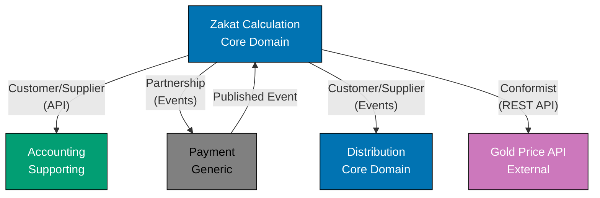

# Event Storming Output Template

This template provides a structured format for documenting Event Storming workshop results. Use this template to capture discoveries from strategic or tactical Event Storming sessions.

## Instructions

1. Conduct Event Storming workshop with domain experts
2. Fill in sections progressively as you move through phases
3. Capture exact terminology used by domain experts (Ubiquitous Language)
4. Document hotspots and unresolved questions immediately
5. Share output with participants for validation
6. Use discoveries to guide bounded context design

## Template

---

## Event Storming Session: [SESSION NAME]

### Session Metadata

**Date**: [YYYY-MM-DD]

**Duration**: [X hours]

**Facilitator**: [Name]

**Participants**:

**Session Type**: [Strategic Event Storming / Tactical Event Storming]

**Scope**: [What business process or subdomain was explored?]

### Workshop Objective

**Goal**:
[What were you trying to discover or design?]

**Success Criteria**:

- [What outcomes indicate a successful workshop?]
- [What questions should be answered?]

---

## Phase 1: Domain Events

**Timeline Direction**: [Left-to-right / Right-to-left / No particular order]

**Discovered Events** (past tense, business-meaningful):

1. **[EventName]**
   - When: [What triggers this event?]
   - Business Impact: [What does this mean for the business?]
   - Frequency: [How often? Daily, Hourly, Rare]

2. **[EventName]**
   - When: [Trigger]
   - Business Impact: [Impact]
   - Frequency: [Frequency]

**Timeline Patterns**:

- [Are events sequential, parallel, cyclical?]
- [Are there clear process boundaries?]

**Event Clusters** (natural groupings):

- **[Cluster Name]**: [List of related events]
- **[Cluster Name]**: [List of related events]

---

## Phase 2: Hotspots

**Identified Issues**:

1. **[Hotspot Name]** (Type: [Conflict / Ambiguity / Process Gap / Technical Concern])
   - **Description**: [What is unclear or problematic?]
   - **Impact**: [Why does this matter?]
   - **Participants Affected**: [Who raised this? Who cares?]
   - **Resolution Status**: [Unresolved / Parking Lot / Resolved]
   - **Resolution Notes**: [If resolved, how?]

2. **[Hotspot Name]**
   - **Description**: [Issue]
   - **Impact**: [Impact]
   - **Participants Affected**: [Names/Roles]
   - **Resolution Status**: [Status]

**Parking Lot Questions** (to investigate later):

- [Question 1]
- [Question 2]

---

## Phase 3: Commands

**Discovered Commands** (imperative, user-initiated actions):

1. **[CommandName]**
   - **Triggered By**: [User role or automated system]
   - **Resulting Events**: [Which domain events fire after this command?]
   - **Preconditions**: [What must be true before this command executes?]
   - **Business Rules**: [What validation or logic applies?]

2. **[CommandName]**
   - **Triggered By**: [Actor]
   - **Resulting Events**: [Events]
   - **Preconditions**: [Conditions]
   - **Business Rules**: [Rules]

**Command-Event Chains** (causal relationships):

```
[CommandName] --> [EventName] --> [Another CommandName] --> [Another EventName]
```

---

## Phase 4: Actors

**Identified Actors** (users, systems, roles):

1. **[Actor Name]** (Type: [Human Role / External System / Automated Process])
   - **Responsibilities**: [What do they do?]
   - **Commands They Trigger**: [List of commands]
   - **Events They React To**: [List of events they observe]
   - **Access Needs**: [What data or capabilities do they need?]

2. **[Actor Name]**
   - **Responsibilities**: [Responsibilities]
   - **Commands They Trigger**: [Commands]
   - **Events They React To**: [Events]
   - **Access Needs**: [Needs]

**Actor-System Interactions**:

- [How do external systems integrate with the domain?]
- [What APIs or interfaces are needed?]

---

## Phase 5: Policies

**Automation Policies** ("Whenever X happens, always do Y"):

1. **[Policy Name]**
   - **Triggering Event**: [Which domain event activates this policy?]
   - **Resulting Action**: [What command or side effect occurs?]
   - **Business Rationale**: [Why is this automated?]
   - **Exceptions**: [When does this policy NOT apply?]

2. **[Policy Name]**
   - **Triggering Event**: [Event]
   - **Resulting Action**: [Command/Side Effect]
   - **Business Rationale**: [Reason]
   - **Exceptions**: [Edge cases]

**Policy Examples** (common patterns):

- **Time-Based Policies**: [e.g., "Every lunar year, calculate zakat"]
- **Event-Driven Policies**: [e.g., "When payment received, unlock premium features"]
- **Threshold Policies**: [e.g., "When inventory below 10 units, reorder stock"]

---

## Phase 6: Read Models

**Identified Read Models** (what users need to see):

1. **[Read Model Name]**
   - **Purpose**: [What decision or action does this view support?]
   - **Actor**: [Who uses this view?]
   - **Data Sources**: [Which events or aggregates populate this?]
   - **Update Trigger**: [When is this view refreshed? Real-time or eventual consistency?]
   - **Key Fields**: [What data is displayed?]

2. **[Read Model Name]**
   - **Purpose**: [Purpose]
   - **Actor**: [Actor]
   - **Data Sources**: [Sources]
   - **Update Trigger**: [Trigger]
   - **Key Fields**: [Fields]

**CQRS Implications**:

- [Should this be a separate query model?]
- [Can this tolerate eventual consistency?]

---

## Phase 7: External Systems

**External System Integrations**:

1. **[System Name]** (Type: [Third-Party API / Legacy System / SaaS Platform])
   - **Purpose**: [What does this system provide?]
   - **Integration Direction**: [Inbound (they call us) / Outbound (we call them) / Bidirectional]
   - **Data Exchanged**: [What data flows between systems?]
   - **Events Triggered**: [Which domain events involve this system?]
   - **Commands Triggered**: [Which commands interact with this system?]
   - **Risks/Concerns**: [Reliability, latency, data quality issues?]

2. **[System Name]**
   - **Purpose**: [Purpose]
   - **Integration Direction**: [Direction]
   - **Data Exchanged**: [Data]
   - **Events Triggered**: [Events]
   - **Commands Triggered**: [Commands]
   - **Risks/Concerns**: [Risks]

**Anti-Corruption Layer Needs**:

- [Which external systems require data translation?]
- [Which systems use different terminology than our domain?]

---

## Phase 8: Aggregates (Tactical Only)

**Identified Aggregates** (transactional consistency boundaries):

1. **[Aggregate Name]**
   - **Root Entity**: [Entity name with unique identifier]
   - **Contained Entities**: [Entities within the aggregate boundary]
   - **Value Objects**: [Immutable values used by the aggregate]
   - **Invariants**: [What rules must always be true within this boundary?]
   - **Commands Handled**: [Which commands target this aggregate?]
   - **Events Published**: [Which events does this aggregate emit?]
   - **Lifecycle**: [How is the aggregate created, updated, deleted?]

2. **[Aggregate Name]**
   - **Root Entity**: [Root]
   - **Contained Entities**: [Entities]
   - **Value Objects**: [Values]
   - **Invariants**: [Rules]
   - **Commands Handled**: [Commands]
   - **Events Published**: [Events]
   - **Lifecycle**: [Lifecycle]

**Aggregate Design Decisions**:

- [Why were these boundaries chosen?]
- [What consistency requirements drove aggregate design?]

---

## Phase 9: Bounded Contexts (Strategic Only)

**Identified Bounded Contexts** (linguistic and model boundaries):

1. **[Bounded Context Name]**
   - **Core Domain / Supporting / Generic**: [Classification]
   - **Ubiquitous Language Terms**: [List key terms specific to this context]
   - **Responsibilities**: [What capabilities does this context provide?]
   - **Aggregates**: [Which aggregates belong to this context?]
   - **External Dependencies**: [Which other contexts or systems does it depend on?]
   - **Published Events**: [What events cross context boundaries?]
   - **Team Ownership**: [Which team owns this context?]

2. **[Bounded Context Name]**
   - **Core Domain / Supporting / Generic**: [Classification]
   - **Ubiquitous Language Terms**: [Terms]
   - **Responsibilities**: [Capabilities]
   - **Aggregates**: [Aggregates]
   - **External Dependencies**: [Dependencies]
   - **Published Events**: [Events]
   - **Team Ownership**: [Team]

**Context Map Relationships**:

```
[Context 1] ---(Partnership)---> [Context 2]
[Context 2] ---(Customer/Supplier)---> [Context 3]
[Context 3] ---(Conformist)---> [External System]
```

**Context Boundaries** (why these boundaries?):

- [What linguistic ambiguities drove context separation?]
- [What organizational or team boundaries influenced design?]

---

## Key Discoveries

### Ubiquitous Language Insights

**Shared Terms Across Contexts**:

| Term   | Context 1 Meaning     | Context 2 Meaning     | Conflict? |
| ------ | --------------------- | --------------------- | --------- |
| [Term] | [Definition in ctx 1] | [Definition in ctx 2] | Yes/No    |
| [Term] | [Definition]          | [Definition]          | Yes/No    |

**Domain-Specific Terminology** (terms experts used repeatedly):

- **[Term 1]**: [Definition as stated by domain expert]
- **[Term 2]**: [Definition]

### Business Process Insights

**Surprising Discoveries**:

- [What did you learn that contradicted assumptions?]
- [What processes are more complex than expected?]

**Simplification Opportunities**:

- [Where can the process be streamlined?]
- [What manual steps could be automated?]

**Business Rules Uncovered**:

1. [Rule 1]
2. [Rule 2]
3. [Rule 3]

---

## Action Items

**Immediate Next Steps**:

1. **[Action]** - Assigned to: [Name], Due: [Date]
2. **[Action]** - Assigned to: [Name], Due: [Date]

**Follow-Up Workshops Needed**:

- **[Workshop Topic]**: [Why is another session needed?]

**Technical Investigations**:

- **[Investigation Topic]**: [What needs research or proof of concept?]

**Documentation to Create**:

- [Bounded Context Canvas for Context X]
- [Aggregate Design Template for Aggregate Y]
- [Context Map Diagram]

---

## Risks and Concerns

**Technical Risks**:

1. **[Risk]**: [Description, Impact, Mitigation Strategy]

**Business Risks**:

1. **[Risk]**: [Description, Impact, Mitigation Strategy]

**Unresolved Questions**:

1. [Question requiring domain expert follow-up]
2. [Question requiring technical feasibility analysis]

---

## Appendix: Event Storming Artifacts

**Photos of Sticky Notes**:

- [Link to photo 1]
- [Link to photo 2]

**Miro/Mural Board**:

- [Link to digital board]

**Raw Notes**:

- [Any additional context not captured above]

---

## Example: Zakat Calculation Event Storming

### Session Metadata

**Date**: 2025-11-15

**Duration**: 4 hours

**Facilitator**: Wahid Fahrurrozi

**Participants**:

- **Islamic Finance Scholar**: Sheikh Ahmad bin Abdullah
- **Product Owner**: Fatimah Hassan
- **Tech Lead**: Omar Khalil
- **Backend Developer**: Aisha Rahman
- **Frontend Developer**: Yusuf Ali

**Session Type**: Tactical Event Storming

**Scope**: Zakat calculation workflow from wealth declaration to payment distribution

### Workshop Objective

**Goal**:
Design the bounded context for calculating zakat obligations, identifying key aggregates, commands, events, and integration points with accounting and payment systems.

**Success Criteria**:

- Identify all domain events related to zakat lifecycle
- Define transactional boundaries (aggregates)
- Clarify integration points with Accounting and Distribution contexts
- Resolve ambiguities around nisab threshold calculations
- Validate all rules with Islamic scholar

---

## Phase 1: Domain Events

**Timeline Direction**: Left-to-right (chronological from wealth declaration to payment)

**Discovered Events**:

1. **WealthDeclared**
   - When: User submits annual wealth declaration form
   - Business Impact: Initiates zakat calculation process
   - Frequency: Annually per user

2. **NisabThresholdEvaluated**
   - When: System checks if declared wealth exceeds nisab (minimum threshold)
   - Business Impact: Determines if zakat is obligatory
   - Frequency: Immediately after wealth declaration

3. **NisabThresholdMet**
   - When: Wealth exceeds nisab threshold
   - Business Impact: User is obligated to pay zakat
   - Frequency: ~60% of wealth declarations (varies by user base)

4. **NisabThresholdNotMet**
   - When: Wealth below nisab threshold
   - Business Impact: User is exempt from zakat this year
   - Frequency: ~40% of wealth declarations

5. **HawlCompleted**
   - When: One full lunar year (354 days) passes since wealth first met nisab
   - Business Impact: Zakat becomes due
   - Frequency: Annually per qualifying user

6. **ZakatCalculated**
   - When: System applies zakat rate (2.5% for cash/gold) to qualifying wealth
   - Business Impact: Determines exact payment amount
   - Frequency: Annually per qualifying user

7. **ZakatAssessmentFinalized**
   - When: User reviews and confirms zakat calculation
   - Business Impact: Creates binding zakat obligation
   - Frequency: Annually per qualifying user

8. **ZakatPaymentRecorded**
   - When: User makes zakat payment (handled by Payment Context)
   - Business Impact: Fulfills religious obligation
   - Frequency: After finalized assessment

9. **ZakatDistributionInitiated**
   - When: Payment confirmed, funds transferred to Distribution Context
   - Business Impact: Begins allocation to eligible recipients
   - Frequency: Shortly after payment

**Timeline Patterns**:

- Events are sequential with clear temporal dependencies
- Two divergent paths: NisabThresholdMet vs. NisabThresholdNotMet
- Hawl completion is time-based, not user-triggered

**Event Clusters**:

- **Assessment Cluster**: WealthDeclared, NisabThresholdEvaluated, NisabThresholdMet/NotMet
- **Calculation Cluster**: HawlCompleted, ZakatCalculated, ZakatAssessmentFinalized
- **Payment Cluster**: ZakatPaymentRecorded, ZakatDistributionInitiated

---

## Phase 2: Hotspots

**Identified Issues**:

1. **Cryptocurrency Zakat** (Type: Ambiguity)
   - **Description**: Islamic scholars disagree on whether cryptocurrency is zakatable wealth and what rate applies
   - **Impact**: Cannot implement zakat calculation for crypto holdings without jurisprudence clarity
   - **Participants Affected**: Sheikh Ahmad (domain expert), Product Owner
   - **Resolution Status**: Parking Lot
   - **Resolution Notes**: Sheikh Ahmad will consult scholarly council and provide fatwa within 2 weeks

2. **Gold Price Volatility** (Type: Technical Concern)
   - **Description**: Nisab threshold calculated from gold price (85 grams), but gold price fluctuates daily. Which price to use?
   - **Impact**: Threshold calculation inconsistency could affect user zakat obligation
   - **Participants Affected**: Tech Lead, Islamic Scholar
   - **Resolution Status**: Resolved
   - **Resolution Notes**: Use closing gold price on last day of lunar year. Cache daily prices to avoid API dependency during calculations.

3. **Multi-Currency Wealth** (Type: Process Gap)
   - **Description**: Users may hold wealth in multiple currencies (USD, EUR, SAR). How to aggregate for nisab threshold?
   - **Impact**: Complex currency conversion logic, exchange rate timing issues
   - **Participants Affected**: Backend Developer, Product Owner
   - **Resolution Status**: Resolved
   - **Resolution Notes**: Convert all wealth to user's primary currency using exchange rates from last day of hawl. Store conversion metadata for audit trail.

4. **Partial Year Wealth Changes** (Type: Ambiguity)
   - **Description**: What if wealth fluctuates above/below nisab during the lunar year? Does hawl restart?
   - **Impact**: Incorrect hawl tracking could delay or incorrectly trigger zakat
   - **Participants Affected**: Sheikh Ahmad, Tech Lead
   - **Resolution Status**: Resolved
   - **Resolution Notes**: Per Hanafi school (our default), hawl does NOT restart if wealth temporarily dips below nisab mid-year. Track initial nisab-met date and check at year-end.

**Parking Lot Questions**:

- How to handle zakat for users who change Islamic schools mid-year? (Edge case, low priority)
- Should we support zakat-ul-fitr (end of Ramadan) or only zakat-ul-mal (wealth zakat)? (Future feature)

---

## Phase 3: Commands

**Discovered Commands**:

1. **DeclareWealth**
   - **Triggered By**: User (wealth holder)
   - **Resulting Events**: WealthDeclared, NisabThresholdEvaluated, NisabThresholdMet/NotMet
   - **Preconditions**: User authenticated, lunar year end date known
   - **Business Rules**: Must declare all zakatable asset types (cash, gold, silver, business inventory)

2. **CalculateZakat**
   - **Triggered By**: Automated Policy (when HawlCompleted event fires)
   - **Resulting Events**: ZakatCalculated
   - **Preconditions**: NisabThresholdMet, Hawl completed (≥354 days)
   - **Business Rules**: Apply 2.5% rate for cash/gold/silver, 5-10% for agriculture (based on irrigation method)

3. **FinalizeAssessment**
   - **Triggered By**: User (wealth holder)
   - **Resulting Events**: ZakatAssessmentFinalized
   - **Preconditions**: ZakatCalculated, user reviewed calculation
   - **Business Rules**: User can adjust calculation if they have additional deductions (debts)

4. **RecordPayment**
   - **Triggered By**: Payment Context (external event)
   - **Resulting Events**: ZakatPaymentRecorded, ZakatDistributionInitiated
   - **Preconditions**: ZakatAssessmentFinalized, payment successful
   - **Business Rules**: Payment amount must match finalized assessment

5. **UpdateNisabThreshold**
   - **Triggered By**: Scheduled Job (daily)
   - **Resulting Events**: NisabThresholdUpdated
   - **Preconditions**: Gold price API available
   - **Business Rules**: Calculate 85 grams of gold equivalent in all supported currencies

**Command-Event Chains**:

```
DeclareWealth --> WealthDeclared --> NisabThresholdEvaluated --> NisabThresholdMet
  --> [Wait 354 days] --> HawlCompleted --> CalculateZakat --> ZakatCalculated
  --> FinalizeAssessment --> ZakatAssessmentFinalized
  --> RecordPayment --> ZakatPaymentRecorded --> ZakatDistributionInitiated
```

---

## Phase 4: Actors

**Identified Actors**:

1. **Wealth Holder** (Type: Human Role)
   - **Responsibilities**: Declare annual wealth, review zakat calculation, make payment
   - **Commands They Trigger**: DeclareWealth, FinalizeAssessment
   - **Events They React To**: NisabThresholdMet (notification), ZakatCalculated (review prompt)
   - **Access Needs**: Wealth declaration form, calculation history, payment interface

2. **Islamic Scholar** (Type: Human Role)
   - **Responsibilities**: Validate jurisprudence rules, resolve edge cases, provide fatawa
   - **Commands They Trigger**: UpdateJurisprudenceRule (admin function)
   - **Events They React To**: None (consulted offline)
   - **Access Needs**: Rule configuration interface (admin panel)

3. **Nisab Threshold Service** (Type: Automated Process)
   - **Responsibilities**: Fetch daily gold prices, calculate nisab thresholds in all currencies
   - **Commands They Trigger**: UpdateNisabThreshold
   - **Events They React To**: None (time-based cron job)
   - **Access Needs**: Gold Price API (external), currency exchange rate API

4. **Hawl Tracker** (Type: Automated Process)
   - **Responsibilities**: Monitor lunar calendar, fire HawlCompleted events after 354 days
   - **Commands They Trigger**: CalculateZakat (via HawlCompleted event)
   - **Events They React To**: NisabThresholdMet (starts tracking hawl)
   - **Access Needs**: Hijri calendar library, user wealth declaration records

5. **Payment Gateway** (Type: External System)
   - **Responsibilities**: Process zakat payments, confirm successful transactions
   - **Commands They Trigger**: RecordPayment
   - **Events They React To**: ZakatAssessmentFinalized (receive payment request)
   - **Access Needs**: Payment Context API (separate bounded context)

**Actor-System Interactions**:

- **Gold Price API**: REST API call daily at midnight UTC, cache response for 24 hours
- **Payment Context**: Event-driven integration via RabbitMQ, asynchronous payment confirmation

---

## Phase 5: Policies

**Automation Policies**:

1. **Auto-Calculate After Hawl**
   - **Triggering Event**: HawlCompleted
   - **Resulting Action**: CalculateZakat command
   - **Business Rationale**: Users should not manually trigger calculation; it's automatic after lunar year
   - **Exceptions**: None (always automated)

2. **Notify User on Nisab Threshold Met**
   - **Triggering Event**: NisabThresholdMet
   - **Resulting Action**: Send notification to Wealth Holder
   - **Business Rationale**: Users need to know they are obligated to pay zakat in ~354 days
   - **Exceptions**: User has disabled zakat notifications (opt-out)

3. **Distribute After Payment**
   - **Triggering Event**: ZakatPaymentRecorded
   - **Resulting Action**: Publish ZakatDistributionInitiated event to Distribution Context
   - **Business Rationale**: Funds must reach eligible recipients promptly (Islamic requirement)
   - **Exceptions**: Payment flagged for fraud review (manual hold)

4. **Daily Nisab Update**
   - **Triggering Event**: Midnight UTC daily
   - **Resulting Action**: UpdateNisabThreshold command
   - **Business Rationale**: Gold prices change daily, threshold must reflect current market
   - **Exceptions**: Gold Price API unavailable (use cached value from previous day, log warning)

**Policy Examples**:

- **Time-Based Policies**: Daily nisab update, annual hawl tracking
- **Event-Driven Policies**: Auto-calculate on hawl completion, notify on nisab met
- **Threshold Policies**: None in this domain (threshold logic is in nisab evaluation, not policy)

---

## Phase 6: Read Models

**Identified Read Models**:

1. **Zakat Assessment Dashboard**
   - **Purpose**: Show user current year zakat status (obligated or exempt), projected amount
   - **Actor**: Wealth Holder
   - **Data Sources**: ZakatAssessment aggregate, NisabThreshold value object
   - **Update Trigger**: Real-time after WealthDeclared, ZakatCalculated events
   - **Key Fields**: Obligation status, nisab threshold, wealth total, zakat amount, hawl end date

2. **Zakat Calculation History**
   - **Purpose**: Historical record of past zakat assessments for audit/review
   - **Actor**: Wealth Holder, Auditor (future)
   - **Data Sources**: Event store (all ZakatAssessmentFinalized events)
   - **Update Trigger**: Eventual consistency (updated nightly)
   - **Key Fields**: Year, wealth declared, zakat paid, payment date, school of thought used

3. **Nisab Threshold Display**
   - **Purpose**: Show current nisab threshold in user's preferred currency
   - **Actor**: Wealth Holder (during wealth declaration)
   - **Data Sources**: NisabThreshold aggregate
   - **Update Trigger**: Real-time after UpdateNisabThreshold command
   - **Key Fields**: Threshold amount, currency, gold price (grams), last update timestamp

4. **Pending Assessments Admin View**
   - **Purpose**: Show all users with pending zakat assessments (for customer support)
   - **Actor**: Support Team
   - **Data Sources**: ZakatAssessment aggregate (status = pending)
   - **Update Trigger**: Real-time
   - **Key Fields**: User ID, wealth declared, days until hawl completion, contact info

**CQRS Implications**:

- Zakat Calculation History can tolerate eventual consistency (updated nightly via batch job)
- Dashboard and Nisab Display need real-time updates (sub-second latency)
- Consider read-model database (PostgreSQL materialized views or separate read replica)

---

## Phase 7: External Systems

**External System Integrations**:

1. **Gold Price API** (Type: Third-Party API - GoldAPI.io)
   - **Purpose**: Provide real-time gold prices for nisab threshold calculation
   - **Integration Direction**: Outbound (we call them)
   - **Data Exchanged**: Daily gold price per gram in USD, EUR, SAR
   - **Events Triggered**: None directly (Nisab Threshold Service polls API)
   - **Commands Triggered**: UpdateNisabThreshold
   - **Risks/Concerns**: API downtime (mitigation: cache last known price, retry logic, fallback to manual price entry)

2. **Payment Context** (Type: Internal Bounded Context)
   - **Purpose**: Process zakat payments
   - **Integration Direction**: Bidirectional (events both ways)
   - **Data Exchanged**: Payment amount, user ID, transaction ID
   - **Events Triggered**: ZakatPaymentRecorded (inbound from Payment Context)
   - **Commands Triggered**: RecordPayment (received from Payment Context)
   - **Risks/Concerns**: Event ordering issues (mitigation: idempotent event handlers)

3. **Accounting Context** (Type: Internal Bounded Context)
   - **Purpose**: Track wealth holdings for nisab evaluation
   - **Integration Direction**: Outbound (we query them)
   - **Data Exchanged**: Asset valuations (cash, gold, silver, inventory)
   - **Events Triggered**: None (synchronous API calls)
   - **Commands Triggered**: None
   - **Risks/Concerns**: Stale data if wealth changes mid-year (mitigation: real-time API, cache invalidation)

4. **Hijri Calendar Library** (Type: Open-Source Library - hijri-calendar npm package)
   - **Purpose**: Convert Gregorian dates to Hijri lunar calendar dates
   - **Integration Direction**: Library (embedded in our code)
   - **Data Exchanged**: Date conversions
   - **Events Triggered**: None
   - **Commands Triggered**: None
   - **Risks/Concerns**: Calculation accuracy (mitigation: validate against Islamic authority sources, unit tests)

**Anti-Corruption Layer Needs**:

- **Accounting Context**: Uses term "Account" (ledger account), we use "Assessment" (zakat calculation). ACL translates terminology.
- **Gold Price API**: Returns prices in troy ounces, we calculate in grams. ACL converts units.

---

## Phase 8: Aggregates (Tactical Only)

**Identified Aggregates**:

1. **ZakatAssessment**
   - **Root Entity**: `ZakatAssessment` (ID: `assessmentId`)
   - **Contained Entities**: `WealthDeclaration`, `LunarYearPeriod`
   - **Value Objects**: `NisabAmount`, `ZakatRate`, `Money`, `HijriDate`, `WealthType`
   - **Invariants**:
     - Assessment can only be finalized if hawl is complete (≥354 days)
     - Total wealth must meet or exceed nisab threshold for zakat to be calculated
     - Zakat rate must match wealth type and jurisprudence school
     - Cannot modify assessment after finalization (immutable once locked)
   - **Commands Handled**: DeclareWealth, CalculateZakat, FinalizeAssessment
   - **Events Published**: WealthDeclared, NisabThresholdEvaluated, NisabThresholdMet/NotMet, ZakatCalculated, ZakatAssessmentFinalized
   - **Lifecycle**:
     - Created: When user triggers DeclareWealth command
     - Updated: When CalculateZakat command fires (after hawl completion)
     - Finalized: When user confirms calculation (FinalizeAssessment)
     - Archived: After payment recorded (read-only historical record)

2. **NisabThreshold**
   - **Root Entity**: `NisabThreshold` (ID: `thresholdId` - singleton per currency per day)
   - **Contained Entities**: None
   - **Value Objects**: `Money` (threshold amount), `GoldPrice` (per gram), `Currency`, `Date`
   - **Invariants**:
     - Threshold must be calculated from 85 grams of gold (Hanafi school default)
     - Gold price must be positive non-zero value
     - Threshold updated at most once per day
   - **Commands Handled**: UpdateNisabThreshold
   - **Events Published**: NisabThresholdUpdated
   - **Lifecycle**:
     - Created: First time nisab calculated for a currency
     - Updated: Daily via automated process
     - Never deleted: Historical thresholds archived for audit

**Aggregate Design Decisions**:

- **Why separate NisabThreshold from ZakatAssessment?** Nisab threshold is a globally shared value (same for all users on a given day), while ZakatAssessment is user-specific. Different consistency boundaries.
- **Why include WealthDeclaration inside ZakatAssessment?** Wealth declaration has no meaning outside the context of a zakat assessment. Strong lifecycle coupling.
- **Why not include Payment inside ZakatAssessment?** Payment processing has different consistency requirements (transactional, immediate) and belongs in Payment Context. Integration via domain events.

---

## Phase 9: Bounded Contexts (Strategic Only)

**Identified Bounded Contexts**:

1. **Zakat Calculation Context**
   - **Core Domain / Supporting / Generic**: Core Domain
   - **Ubiquitous Language Terms**: Nisab, Hawl, Zakatable Assets, Zakat Rate, Assessment, Lunar Year, Jurisprudence School
   - **Responsibilities**:
     - Calculate zakat obligations based on Islamic jurisprudence rules
     - Track hawl (lunar year) completion for wealth holders
     - Determine nisab threshold based on gold prices
     - Validate wealth declarations for completeness
   - **Aggregates**: ZakatAssessment, NisabThreshold
   - **External Dependencies**:
     - Accounting Context (wealth data)
     - Payment Context (payment confirmation)
     - Gold Price API (market prices)
     - Hijri Calendar Library (date conversions)
   - **Published Events**: ZakatCalculated, NisabThresholdMet, ZakatAssessmentFinalized, ZakatPaymentRecorded
   - **Team Ownership**: Core Domain Team (Islamic Finance Specialists)

2. **Accounting Context**
   - **Core Domain / Supporting / Generic**: Supporting Subdomain
   - **Ubiquitous Language Terms**: Account, Asset, Valuation, Ledger, Balance, Transaction
   - **Responsibilities**:
     - Track wealth holdings (cash, gold, silver, inventory)
     - Provide asset valuations for zakat calculation
     - Record financial transactions
   - **Aggregates**: Account, Transaction (not part of this Event Storming session)
   - **External Dependencies**: Zakat Calculation Context (provides valuation data)
   - **Published Events**: WealthValuationUpdated, AssetAcquired
   - **Team Ownership**: Finance Team

3. **Payment Context**
   - **Core Domain / Supporting / Generic**: Generic Subdomain
   - **Ubiquitous Language Terms**: Payment, Transaction, Gateway, Confirmation, Receipt
   - **Responsibilities**:
     - Process zakat payments via payment gateways (Stripe, PayPal)
     - Confirm payment success/failure
     - Issue receipts
   - **Aggregates**: Payment (not part of this Event Storming session)
   - **External Dependencies**: Payment Gateways (Stripe, PayPal)
   - **Published Events**: PaymentConfirmed, PaymentFailed
   - **Team Ownership**: Platform Team (generic payment processing)

4. **Zakat Distribution Context**
   - **Core Domain / Supporting / Generic**: Core Domain
   - **Ubiquitous Language Terms**: Eligible Recipient, Distribution, Mustahiq (those entitled to zakat), Allocation, Category (8 categories in Quran)
   - **Responsibilities**:
     - Allocate zakat funds to eligible recipients
     - Verify recipient eligibility
     - Distribute funds according to Islamic priorities
   - **Aggregates**: Distribution, Recipient (not part of this Event Storming session)
   - **External Dependencies**: Zakat Calculation Context (receives payment events)
   - **Published Events**: FundsDistributed
   - **Team Ownership**: Core Domain Team (Social Welfare Specialists)

**Context Map Relationships**:



**Context Boundaries** (why these boundaries?):

- **Zakat Calculation vs. Accounting**: Different language ("Assessment" vs. "Account"), different consistency needs (annual zakat calculation vs. real-time ledger updates), different team expertise (Islamic scholars vs. accountants)
- **Zakat Calculation vs. Payment**: Zakat calculation is domain-specific, payment processing is generic (reusable for any payment). Payment Context isolates third-party gateway complexity.
- **Zakat Calculation vs. Distribution**: Calculation determines "how much", distribution determines "to whom". Different Islamic jurisprudence rules, different stakeholders (individual wealth holders vs. social welfare organizations).

---

## Key Discoveries

### Ubiquitous Language Insights

**Shared Terms Across Contexts**:

| Term       | Zakat Context Meaning                | Accounting Context Meaning | Conflict? |
| ---------- | ------------------------------------ | -------------------------- | --------- |
| Assessment | Zakat obligation calculation         | Risk evaluation            | Yes       |
| Account    | Wealth holder's zakat profile        | Ledger account             | Yes       |
| Balance    | Total wealth subject to zakat        | Account balance (general)  | No        |
| Payment    | Zakat payment (religious obligation) | Generic transaction        | Minor     |
| Rate       | Zakat percentage (2.5%, 5%, 10%)     | Interest rate (forbidden)  | Yes       |

**Domain-Specific Terminology** (terms experts used repeatedly):

- **Nisab**: "The threshold that makes zakat obligatory. 85 grams of gold or equivalent value." (Sheikh Ahmad emphasized this repeatedly)
- **Hawl**: "The complete lunar year. Not 365 days, but 354-355 days in the Islamic calendar." (Critical distinction from Gregorian year)
- **Zakatable Assets**: "Cash, gold, silver, business inventory, trade goods. NOT personal residence or tools of trade." (Clear exclusions prevent errors)
- **Nawaazil**: "Contemporary issues like cryptocurrency where scholars must issue new rulings." (Highlighted as ongoing challenge)

### Business Process Insights

**Surprising Discoveries**:

- **Hawl does NOT restart**: Assumed wealth must stay above nisab for entire year. Learned (Hanafi school) that temporary dips mid-year do NOT reset the lunar year timer. Major simplification.
- **Gold price volatility**: Did not anticipate daily nisab threshold changes. Requires caching strategy and clear timestamp documentation ("nisab as of [date]").
- **Multi-school support critical**: Users expect ability to choose Islamic school (Hanafi, Maliki, Shafi'i, Hanbali) with different nisab and rate rules. Cannot hardcode single interpretation.

**Simplification Opportunities**:

- **Auto-calculation after hawl**: Users should never manually trigger zakat calculation. Policy-based automation eliminates user error and ensures compliance.
- **Pre-fill wealth from Accounting**: Instead of manual declaration, pre-populate wealth declaration from Accounting Context balances. User only confirms/adjusts.
- **Notification-driven workflow**: Notify users at nisab threshold (start tracking), 30 days before hawl completion (prepare payment), and at hawl completion (calculation ready). Reduces cognitive load.

**Business Rules Uncovered**:

1. **Nisab threshold = 85 grams of gold OR 595 grams of silver** (Hanafi school). If user has mix of assets, use gold price (more conservative).
2. **Debts deducted from wealth before nisab evaluation**. User with $10,000 cash but $8,000 debt has $2,000 zakatable wealth (may fall below nisab).
3. **Agricultural zakat rate varies by irrigation**: 10% if rain-fed, 5% if manually irrigated. Reflects labor/cost difference.
4. **Zakat on business inventory**: Calculated on current market value, not purchase price. Requires annual inventory appraisal.

---

## Action Items

**Immediate Next Steps**:

1. **Resolve cryptocurrency zakat ruling** - Assigned to: Sheikh Ahmad, Due: 2025-11-29 (2 weeks)
2. **Design NisabThreshold aggregate** - Assigned to: Omar (Tech Lead), Due: 2025-11-20 (5 days)
3. **Create Bounded Context Canvas for Zakat Calculation Context** - Assigned to: Fatimah (PO), Due: 2025-11-22 (1 week)
4. **Implement Gold Price API integration (spike)** - Assigned to: Aisha (Backend Dev), Due: 2025-11-18 (3 days)
5. **Design multi-school jurisprudence configuration** - Assigned to: Omar + Sheikh Ahmad, Due: 2025-11-25 (10 days)

**Follow-Up Workshops Needed**:

- **Zakat Distribution Context Event Storming**: Explore "to whom" allocation rules (8 Quranic categories)
- **Aggregate Design Workshop**: Deep dive into ZakatAssessment invariants and command validation

**Technical Investigations**:

- **Hijri calendar library evaluation**: Test hijri-calendar npm package accuracy vs. Islamic authority sources
- **Event sourcing feasibility**: Should ZakatAssessment be event-sourced for full audit trail?
- **CQRS read model performance**: Benchmark PostgreSQL materialized views vs. separate read database for Zakat Assessment Dashboard

**Documentation to Create**:

- [Bounded Context Canvas](./ex-so-ar-dodrdedd-te__bounded-context-canvas.md) for Zakat Calculation Context
- [Aggregate Design Template](./ex-so-ar-dodrdedd-te__aggregate-design-template.md) for ZakatAssessment
- [Context Map Diagram](./ex-so-ar-dodrdedd-te__context-map-diagram.md) showing all 4 contexts
- [Ubiquitous Language Glossary](./ex-so-ar-dodrdedd-te__ubiquitous-language-glossary.md) for Zakat domain terms

---

## Risks and Concerns

**Technical Risks**:

1. **Gold Price API Downtime**: Nisab threshold calculation depends on external GoldAPI.io service. If API is down, cannot calculate nisab.
   - **Impact**: Users cannot declare wealth or see current thresholds
   - **Mitigation**: Cache last known price (max 24 hours stale), implement retry logic with exponential backoff, add manual admin override for price entry, monitor API uptime via health checks

2. **Hijri Calendar Accuracy**: Open-source library may have calculation errors vs. official Islamic calendar authorities
   - **Impact**: Incorrect hawl tracking could delay zakat or trigger it prematurely (religious non-compliance)
   - **Mitigation**: Cross-validate library against multiple authoritative sources (Umm al-Qura calendar), implement automated tests for known date conversions, allow manual date adjustment by admin

3. **Event Ordering in Distributed System**: Payment Context publishes PaymentConfirmed event, but network delays could cause out-of-order processing
   - **Impact**: ZakatDistributionInitiated fires before ZakatPaymentRecorded persists, causing data inconsistency
   - **Mitigation**: Idempotent event handlers (deduplicate events by ID), event versioning/timestamps, eventual consistency acceptance (distribution can wait for payment confirmation within 1 minute SLA)

**Business Risks**:

1. **Jurisprudence Divergence**: Different Islamic scholars may issue conflicting rulings for contemporary assets (cryptocurrency, stock options)
   - **Impact**: Platform may implement rule later deemed incorrect by users' preferred scholars, causing trust issues
   - **Mitigation**: Establish scholarly review board with representation from multiple schools, clearly label which school's ruling is implemented, allow users to choose school, provide rule citation sources

2. **Regulatory Compliance**: Some countries have mandatory zakat collection laws (Saudi Arabia, Pakistan). Platform may conflict with local regulations.
   - **Impact**: Legal liability, service unavailable in certain jurisdictions
   - **Mitigation**: Legal review per target market, geofencing to exclude unsupported countries, partnership with local zakat authorities where required

**Unresolved Questions**:

1. **Cryptocurrency zakat**: Awaiting fatwa from Sheikh Ahmad's scholarly council. Parking lot for 2 weeks.
2. **Historical corrections**: If user discovers error in past year's zakat calculation, do we allow retroactive corrections? Or only prospective adjustments? (Needs Islamic jurisprudence research)
3. **Wealth declaration audit**: Should platform verify user wealth declarations (e.g., request bank statements)? Or trust user honesty (Islamic principle of trustworthiness)? (Product decision needed)

---

## Appendix: Event Storming Artifacts

**Photos of Sticky Notes**:

- [Link to Miro board export: zakat-event-storming-2025-11-15.pdf]

**Miro/Mural Board**:

- [https://miro.com/app/board/zakat-calculation-event-storming-nov-2025]

**Raw Notes**:

- Sheikh Ahmad emphasized the importance of citing Quranic verses and hadith for each business rule. Suggested adding "Jurisprudence Source" field to rule configuration.
- Aisha raised concern about transaction volume: 100,000 users × daily nisab update = potential performance bottleneck. Consider batch updates or lazy calculation (only update when user requests).
- Yusuf (frontend dev) requested early mockups for Zakat Assessment Dashboard. Assigned to design team (not present in workshop).

---

## Usage Notes

### When to Use This Template

- **After Event Storming workshops**: Immediately capture discoveries before details fade
- **Strategic design**: Document bounded context boundaries and context map relationships
- **Tactical design**: Record aggregates, commands, events for implementation
- **Knowledge sharing**: Onboard new team members to domain understanding
- **Validation**: Share with domain experts to confirm accuracy

### Keeping It Updated

- **Version control**: Store in git alongside code
- **Living document**: Update as domain knowledge evolves
- **Workshop follow-ups**: Schedule quarterly Event Storming refreshes
- **Link to code**: Reference aggregates, events, commands in codebase comments

### Complementary Artifacts

This output template works well with:

- **[Bounded Context Canvas](./ex-so-ar-dodrdedd-te__bounded-context-canvas.md)**: Formalize each discovered bounded context
- **[Aggregate Design Template](./ex-so-ar-dodrdedd-te__aggregate-design-template.md)**: Detail aggregate structure and invariants
- **[Context Map Diagram](./ex-so-ar-dodrdedd-te__context-map-diagram.md)**: Visualize context relationships
- **[Domain Event Catalog](./ex-so-ar-dodrdedd-te__domain-event-catalog.md)**: Comprehensive event inventory

## Related Documentation

- **[Strategic Design Process](../ex-so-ar-dodrdedd__06-strategic-design-process.md)** - Event Storming facilitation guide
- **[Bounded Contexts](../ex-so-ar-dodrdedd__03-bounded-contexts.md)** - Comprehensive bounded context guide
- **[Aggregates](../ex-so-ar-dodrdedd__09-aggregates.md)** - Aggregate design patterns
- **[Domain Events](../ex-so-ar-dodrdedd__12-domain-events.md)** - Event-driven architecture guide

## References

- Alberto Brandolini, "Introducing Event Storming" (2013) - Original Event Storming technique
- [EventStorming.com](https://www.eventstorming.com/) - Official Event Storming resource
- Vaughn Vernon, "Domain-Driven Design Distilled" (2016) - Event Storming chapter
- [DDD Crew Event Storming Glossary](https://github.com/ddd-crew/eventstorming-glossary-cheat-sheet)
