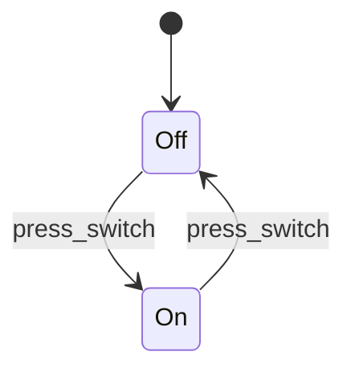
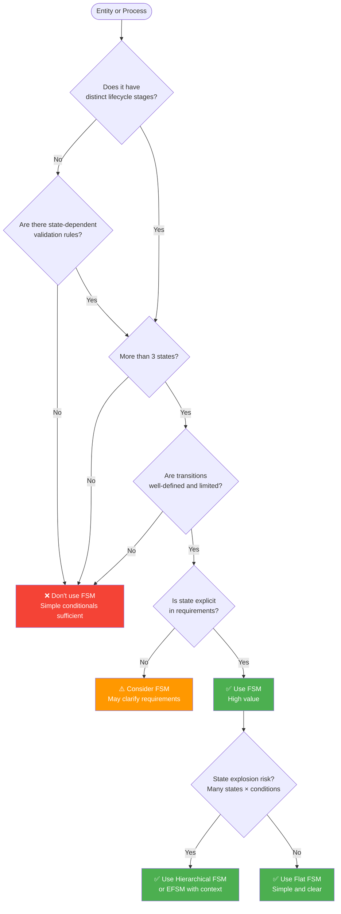
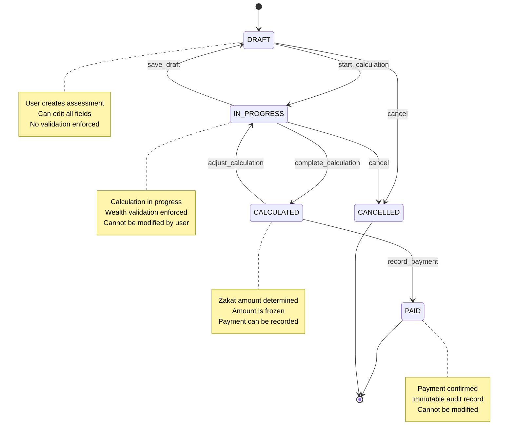
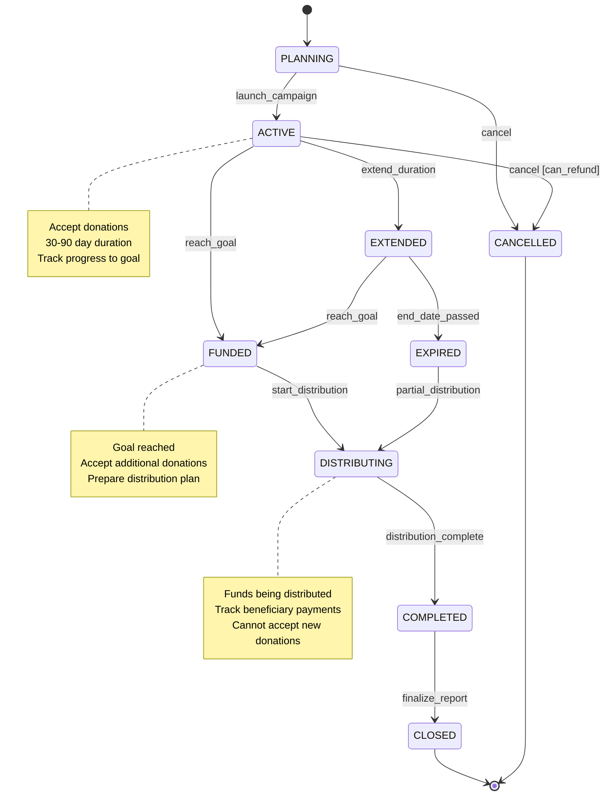
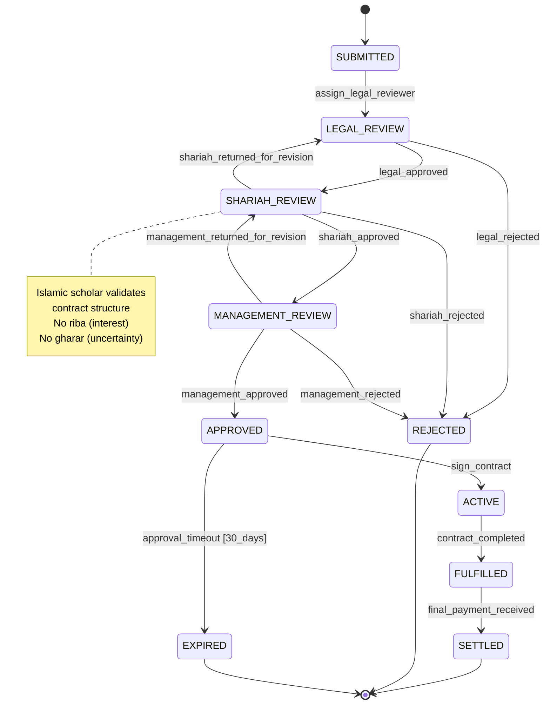

# Introduction and Philosophy

Finite State Machines (FSMs) are one of the most elegant and powerful patterns in software engineering for modeling systems with explicit, well-defined states and transitions. This document establishes the foundational understanding of FSMs, their philosophical underpinnings, and practical guidance on when to apply them in enterprise systems.

## What is a Finite State Machine?

### Formal Definition

A **Finite State Machine** is a mathematical model of computation defined by:

- **Finite set of states (S)**: A non-empty collection of discrete states the system can occupy
- **Initial state (s₀)**: The starting state when the system begins
- **Finite set of events/inputs (E)**: External or internal triggers that can cause transitions
- **Transition function (δ)**: A mapping from (current state, event) → next state
- **Optional: Final states (F)**: Terminal states indicating completion or termination
- **Optional: Actions/Outputs**: Side effects executed during transitions or state entry/exit

**Mathematical notation**:

```
FSM = (S, s₀, E, δ, F)
where:
  S = {s₁, s₂, ..., sₙ}  (finite set of states)
  s₀ ∈ S                 (initial state)
  E = {e₁, e₂, ..., eₘ}  (finite set of events)
  δ: S × E → S           (transition function)
  F ⊆ S                  (set of final states)
```

### Intuitive Understanding

Think of an FSM as a **state diagram with rules**:

- At any moment, the system is in exactly **one state**
- **Events** trigger transitions from one state to another
- **Transitions are explicit**: You cannot move from state A to state B without a defined transition
- **Behavior is deterministic**: Given the same state and event, the system always transitions the same way

### Simple Example: Light Switch



This FSM has:

- **States**: {Off, On}
- **Initial state**: Off
- **Events**: {press_switch}
- **Transitions**: (Off, press_switch) → On, (On, press_switch) → Off
- **Final states**: None (system runs indefinitely)

## Historical Context

### Origins in Automata Theory

FSMs emerged from theoretical computer science in the 1940s-1950s:

- **1943**: Warren McCulloch and Walter Pitts - Neural network models using finite automata
- **1951**: Stephen Cole Kleene - Regular expressions and finite automata equivalence
- **1956**: Edward F. Moore - Moore machine (outputs depend on current state)
- **1955**: George H. Mealy - Mealy machine (outputs depend on current state and input)

These theoretical foundations established FSMs as a fundamental model for **computation, pattern recognition, and system behavior**.

### Evolution in Software Engineering

FSMs transitioned from theory to practice through several milestones:

- **1980s**: State Pattern in object-oriented design
- **1987**: David Harel - Statecharts (hierarchical and concurrent FSMs) for complex systems
- **1990s**: UML State Diagrams standardize FSM notation
- **2000s**: Workflow engines and business process management adopt FSM principles
- **2010s**: Modern FSM libraries (XState, Spring State Machine) bring declarative FSM to mainstream development
- **2020s**: Durable workflow engines (Temporal, Cadence) extend FSMs to distributed, long-running processes

### Key Insights from History

1. **FSMs bridge theory and practice**: Rigorous mathematical foundations enable formal verification while remaining practical
2. **Complexity management evolved**: From flat FSMs → hierarchical statecharts → concurrent regions → workflow orchestration
3. **Declarative trend**: Modern FSMs favor configuration over code for maintainability and visualization

## Why Finite State Machines Matter

### 1. Explicit State Modeling

**Problem**: Implicit state scattered across boolean flags, enums, and conditional logic leads to hidden complexity and bugs.

**FSM Solution**: States are **first-class entities** with explicit names, invariants, and transitions.

**Example - Implicit State (Anti-pattern)**:

```pseudocode
class ZakatAssessment {
  boolean isDraft
  boolean isCalculated
  boolean isPaid
  boolean isRejected

  // What if isDraft=true AND isPaid=true? Invalid state!
  // What if all flags are false? Unknown state!
}
```

**Example - Explicit FSM State**:

```pseudocode
enum ZakatAssessmentState {
  DRAFT,
  IN_PROGRESS,
  CALCULATED,
  PAID,
  REJECTED
}

class ZakatAssessment {
  ZakatAssessmentState currentState
  // Impossible to be in two states simultaneously
  // Always in exactly one valid state
}
```

### 2. Bug Prevention Through Constraints

FSMs enforce **state transition constraints** at the design level, preventing invalid operations.

**Example - Zakat Assessment**:

- Cannot calculate Zakat while in DRAFT state (must be IN_PROGRESS first)
- Cannot mark as PAID while in DRAFT or REJECTED states
- Cannot return to DRAFT after calculation begins

These rules are **encoded in the FSM definition**, not scattered in business logic.

### 3. Testability and Verification

FSMs enable **systematic testing**:

- **State coverage**: Verify all states are reachable
- **Transition coverage**: Test all valid transitions
- **Invalid transition testing**: Confirm illegal transitions are rejected
- **Model-based testing**: Generate test cases from FSM definition

**Example - Zakat Assessment Test Suite**:

```pseudocode
test "valid transitions from DRAFT state":
  assessment = new ZakatAssessment(state=DRAFT)

  // Valid transitions
  assert assessment.canTransitionTo(IN_PROGRESS) == true
  assert assessment.canTransitionTo(REJECTED) == true

  // Invalid transitions
  assert assessment.canTransitionTo(CALCULATED) == false
  assert assessment.canTransitionTo(PAID) == false

test "complete lifecycle path":
  assessment = new ZakatAssessment(state=DRAFT)
  assessment.startCalculation() // → IN_PROGRESS
  assessment.completeCalculation() // → CALCULATED
  assessment.recordPayment() // → PAID

  assert assessment.currentState == PAID
```

### 4. Documentation and Communication

FSM diagrams serve as **living documentation**:

- **Visual clarity**: Stakeholders understand system behavior without reading code
- **Domain alignment**: FSM states map directly to business concepts
- **Change impact analysis**: Visualize which states/transitions are affected by requirements changes

### 5. Auditability and Compliance

FSMs provide **state transition history** for audit trails:

- Record every state change with timestamp and user
- Trace how an entity reached its current state
- Demonstrate compliance with business rules (e.g., Shariah compliance verification trail)

## When to Use Finite State Machines

### Strong Indicators for FSM Usage

#### 1. Entities with Clear Lifecycle Stages

**Use FSM when**: An entity progresses through distinct phases with different behaviors in each phase.

**OSE Examples**:

- **Zakat Assessment**: Draft → In Progress → Calculated → Paid
- **Islamic Contract (Murabaha)**: Negotiation → Approved → Active → Fulfilled → Settled
- **Donation Campaign**: Planning → Active → Funded → Completed → Closed
- **Qard Hasan (Interest-Free Loan)**: Applied → Verified → Approved → Disbursed → Repaying → Repaid

#### 2. Workflow and Approval Processes

**Use FSM when**: Multiple actors perform sequential or parallel approvals.

**OSE Examples**:

- **Multi-level Contract Approval**: Submitted → Legal Review → Shariah Review → Management Approval → Approved
- **Fund Distribution Request**: Requested → Verified → Approved → Scheduled → Disbursed
- **Beneficiary Onboarding**: Application → Document Verification → Background Check → Approved → Active

#### 3. State-Dependent Validation Rules

**Use FSM when**: Different validation rules apply in different states.

**OSE Examples**:

- **Zakat Calculation**: Only validate wealth breakdown when state = IN_PROGRESS, not in DRAFT
- **Contract Modification**: Only allow amendments when state = ACTIVE, not NEGOTIATION or SETTLED
- **Campaign Donations**: Only accept donations when state = ACTIVE, not PLANNING or CLOSED

#### 4. Concurrent or Long-Running Processes

**Use FSM when**: Processes span hours, days, or months with persisted state.

**OSE Examples**:

- **Annual Zakat Cycle**: Configure → Assess → Calculate → Distribute → Report (spans 1 year)
- **Long-Term Financing (Ijara)**: Approved → Active → Periodic Payments → Completed (spans 5-20 years)
- **Ramadan Campaign**: Prepare → Active (30 days) → Grace Period → Final Distribution

#### 5. Complex State-Dependent Business Logic

**Use FSM when**: Business logic varies significantly by state.

**OSE Examples**:

- **Donation Refund Logic**: Refund rules differ for PENDING vs COMPLETED donations
- **Contract Termination Logic**: Early termination penalties vary by contract state (ACTIVE vs GRACE_PERIOD)
- **Campaign Extension**: Extension allowed if ACTIVE and within 30 days of end date

### Decision Matrix: Should I Use an FSM?



## When NOT to Use Finite State Machines

### 1. Simple On/Off or True/False Logic

**Don't use FSM for**: Binary states with trivial transitions.

**Example**:

```pseudocode
// Over-engineering with FSM
stateMachine NotificationPreference {
  states: ENABLED, DISABLED
  transitions: toggle
}

// Better: Simple boolean
class User {
  boolean notificationsEnabled
}
```

**Exception**: Even simple states may benefit from FSM if audit trail or event history is required.

### 2. Highly Dynamic or Unpredictable State Spaces

**Don't use FSM for**: Systems where states cannot be enumerated or transition rules are unknowable at design time.

**Example**:

- **Free-form text editing**: Character-by-character state would be infinite
- **AI model training**: State space is continuous, not discrete
- **User navigation paths**: Unbounded and unpredictable

**Alternative**: Event sourcing, state snapshots, or reactive streams.

### 3. Trivial Workflows with Fewer than 3 States

**Don't use FSM for**: Two-state transitions that can be modeled with a simple flag.

**Example**:

```pseudocode
// Over-engineering with FSM
stateMachine EmailVerification {
  states: UNVERIFIED, VERIFIED
  transition: verify_email
}

// Better: Boolean field
class User {
  boolean emailVerified
}
```

### 4. State is Implicit or Derived from Other Data

**Don't use FSM when**: "State" is a calculated property, not an explicit entity lifecycle stage.

**Example**:

```pseudocode
// Don't create FSM for this
class Account {
  decimal balance

  // Derived state, not explicit lifecycle stage
  function getStatus() {
    if balance < 0 return "OVERDRAWN"
    if balance == 0 return "ZERO_BALANCE"
    return "ACTIVE"
  }
}
```

**When to use FSM instead**: If account status affects business rules or requires explicit transitions (e.g., FROZEN state requires manual unfreezing).

### 5. Performance-Critical Tight Loops

**Don't use FSM for**: Inner loops where FSM overhead (state lookup, transition validation) impacts performance.

**Example**:

- Parsing millions of characters per second
- Real-time signal processing
- Pixel-level image manipulation

**Alternative**: Optimize with direct state encoding (integers, bit flags) or state machines generated by compilers.

## FSM vs. Other Patterns

### FSM vs. Switch Statements

| Aspect                   | FSM                           | Switch Statement                |
| ------------------------ | ----------------------------- | ------------------------------- |
| **State Representation** | Explicit state object or enum | Implicit in control flow        |
| **Transition Logic**     | Centralized transition table  | Scattered across code           |
| **Invalid Transitions**  | Prevented by FSM engine       | Must validate manually          |
| **Testability**          | State/transition coverage     | Branch coverage (less rigorous) |
| **Visualization**        | Generates state diagrams      | No visualization                |
| **Maintainability**      | High (declarative)            | Low (imperative spaghetti)      |

**Recommendation**: Use FSM when you have **more than one switch statement checking the same state variable**.

### FSM vs. Strategy Pattern

| Aspect                | FSM                                 | Strategy Pattern                       |
| --------------------- | ----------------------------------- | -------------------------------------- |
| **Purpose**           | Model state transitions             | Encapsulate interchangeable algorithms |
| **State Persistence** | State is persistent entity property | Strategy is transient behavior         |
| **Transition Rules**  | Explicit transition function        | No transitions (set strategy directly) |
| **Typical Use**       | Entity lifecycle                    | Algorithm selection                    |

**Recommendation**: Use FSM for **stateful entities with lifecycle**, Strategy for **stateless algorithm selection**.

### FSM vs. Workflow Engines

| Aspect               | FSM                       | Workflow Engine (Temporal/Cadence) |
| -------------------- | ------------------------- | ---------------------------------- |
| **Scope**            | Single entity lifecycle   | Multi-entity orchestration         |
| **Duration**         | Seconds to days           | Days to years (durable)            |
| **Persistence**      | Application manages state | Engine manages state + execution   |
| **Failure Handling** | Application code          | Built-in retry, compensation       |
| **Complexity**       | Lightweight library       | Full orchestration platform        |

**Recommendation**: Use FSM for **single-entity state management**, workflow engines for **distributed sagas** and **long-running processes**.

### FSM vs. Event Sourcing

| Aspect                 | FSM                         | Event Sourcing                  |
| ---------------------- | --------------------------- | ------------------------------- |
| **State Storage**      | Current state snapshot      | Event log (reconstruct state)   |
| **Transition Trigger** | Events or commands          | Events only                     |
| **History**            | Optional (requires logging) | Built-in (event log is history) |
| **Complexity**         | Low to medium               | Medium to high                  |

**Recommendation**: Combine both - FSM validates transitions, event sourcing persists transition history.

## Real-World OSE Examples

### Example 1: Zakat Assessment Lifecycle

**Business Context**: Zakat (obligatory charity) assessment progresses through defined stages from draft to payment.



**Key Characteristics**:

- **5 states**: DRAFT, IN_PROGRESS, CALCULATED, PAID, CANCELLED
- **State-dependent validation**: Wealth breakdown required only in IN_PROGRESS
- **Immutability guarantee**: PAID state prevents further modifications
- **Audit trail**: Each transition records timestamp and actor

### Example 2: Donation Campaign Lifecycle

**Business Context**: Campaigns progress from planning through fundraising to distribution.



**Key Characteristics**:

- **8 states** including EXTENDED (business rule: campaigns can extend once)
- **Time-based transitions**: ACTIVE → EXPIRED when end_date_passed
- **Guard conditions**: Can only cancel if refunds are possible
- **Multi-step finalization**: DISTRIBUTING → COMPLETED → CLOSED ensures proper reporting

### Example 3: Islamic Contract Approval (Multi-level)

**Business Context**: Murabaha contracts require legal, Shariah, and management approval.



**Key Characteristics**:

- **10 states** with sequential approval stages
- **Rejection and revision loops**: Each reviewer can reject or return for revision
- **Time-based expiration**: APPROVED → EXPIRED after 30 days without signing
- **Immutable final states**: SETTLED state locks the contract record

## Philosophical Principles

### 1. Explicitness Over Implicitness

FSMs force developers to **name states explicitly** rather than infer state from combinations of flags. This aligns with the **Explicit Over Implicit** principle from software engineering principles.

**Bad (Implicit)**:

```pseudocode
if (contract.isSigned && !contract.isActive && contract.startDate > today) {
  // What state is this? Signed but not yet active?
}
```

**Good (Explicit)**:

```pseudocode
if (contract.state == APPROVED_PENDING_ACTIVATION) {
  // Clear state name
}
```

### 2. Constraints Enable Freedom

By defining **what transitions are valid**, FSMs paradoxically give developers **freedom to change implementation** without breaking guarantees.

**Example**: Changing Zakat calculation logic is safe as long as it respects FSM transitions (cannot calculate while in DRAFT).

### 3. Design for Audit and Compliance

FSMs naturally produce **audit trails** by recording state transitions. This aligns with **governance/principles/software-engineering/automation-over-manual.md**.

**Implementation**:

```pseudocode
class StateTransitionLog {
  UUID id
  EntityType entityType
  UUID entityId
  State fromState
  State toState
  Event event
  Actor actor
  Timestamp occurredAt
  JSON metadata
}
```

### 4. State as First-Class Domain Concept

In DDD terms, state is often a **Value Object** or part of an **Entity's identity**. FSMs elevate state from an implementation detail to a **domain concept** with business meaning.

**DDD Integration**: See [ex-so-ar-fsm\_\_18-integration-with-ddd-and-architecture.md](ex-so-ar-fistmafs__19-integration-with-ddd-and-architecture.md)

## Cross-References

### Software Engineering Principles

- [Explicit Over Implicit](../../../../../governance/principles/software-engineering/explicit-over-implicit.md) - FSMs make state explicit
- [Simplicity Over Complexity](../../../../../governance/principles/general/simplicity-over-complexity.md) - FSMs simplify state management
- [Automation Over Manual](../../../../../governance/principles/software-engineering/automation-over-manual.md) - FSMs enable automated validation

### Architecture Documentation

- [DDD Aggregates](../domain-driven-design-ddd/ex-so-ar-dodrdedd__09-aggregates.md) - FSMs model aggregate lifecycle

### Related FSM Topics

- [Core Concepts and Terminology](ex-so-ar-fistmafs__02-core-concepts-and-terminology.md) - Next: Learn FSM building blocks
- [FSM Types and Classifications](ex-so-ar-fistmafs__03-fsm-types-and-classifications.md) - Understand FSM variants
- [Decision Trees and Guidelines](ex-so-ar-fistmafs__16-decision-trees-and-guidelines.md) - Detailed decision frameworks

## Next Steps

1. **Understand building blocks**: Read [Core Concepts and Terminology](ex-so-ar-fistmafs__02-core-concepts-and-terminology.md)
2. **Choose FSM type**: Read [FSM Types and Classifications](ex-so-ar-fistmafs__03-fsm-types-and-classifications.md)
3. **Select paradigm**: Choose OOP, FP, Declarative, or Event-Driven approach (files 08-11)
4. **Pick a framework**: Review Spring State Machine, XState, or workflow engines (files 13-14)
5. **Design your FSM**: Use templates in [templates/](./templates/)

## Summary

Finite State Machines are a powerful pattern for modeling entities with explicit lifecycles, state-dependent behavior, and well-defined transitions. They excel when:

- Entities have clear lifecycle stages (3+ states)
- Transitions between states have business meaning
- State-dependent validation or behavior is required
- Auditability and compliance are important

Avoid FSMs for trivial boolean flags, derived states, or highly dynamic systems.

The remainder of this documentation section provides comprehensive guidance on FSM theory, design patterns, implementation approaches across four paradigms, framework coverage, and integration with DDD and enterprise architecture.
