# Core Concepts and Terminology

This document defines the essential building blocks of Finite State Machines (FSMs). Understanding these concepts is crucial for designing, implementing, and communicating about state machines in enterprise systems.

## States: The Foundation

### Definition

A **state** represents a distinct condition or phase in the lifecycle of an entity. At any moment, the system occupies **exactly one state** from a finite set of possible states.

**Formal definition**:

```
State s ∈ S
where S = {s₁, s₂, ..., sₙ} is a finite, non-empty set
```

### State Types

#### 1. Initial State (s₀)

The **starting point** of the FSM when an entity is created or the system begins.

**Characteristics**:

- Exactly **one** initial state per FSM (or per region in concurrent FSMs)
- Represented with a **filled circle** pointing to the state in diagrams
- Entry point for all instances of the entity

**Example - Zakat Assessment**:

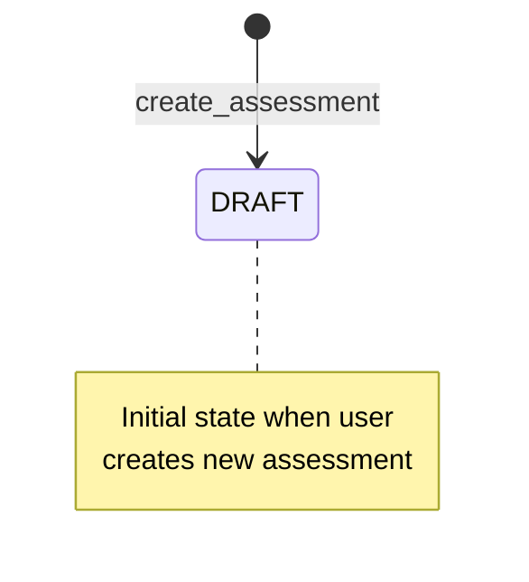

#### 2. Intermediate States

**Normal operational states** where the entity resides during its lifecycle.

**Characteristics**:

- Represent business-meaningful phases
- May have entry/exit actions
- May have do activities (ongoing behavior while in state)
- Can transition to other states based on events

**Example - Contract Lifecycle**:

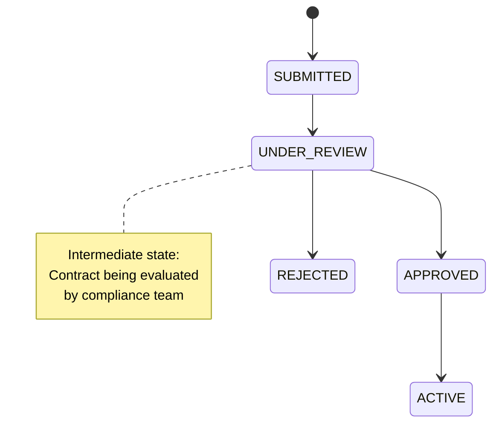

#### 3. Final/Terminal States

**End states** that indicate completion or termination of the FSM.

**Characteristics**:

- No outgoing transitions (entity lifecycle ends)
- Represented with a **filled circle with outer ring** in diagrams
- May have multiple terminal states (success vs. failure)
- Often immutable - entity cannot be modified after reaching terminal state

**Example - Donation Campaign**:

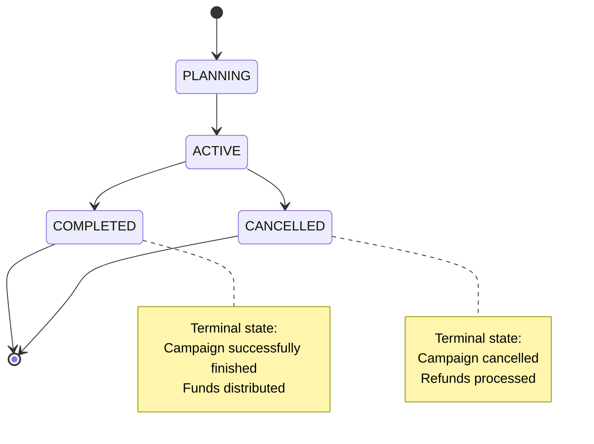

### State Anatomy: Entry, Exit, and Do Activities

States can define behavior that executes **when entering**, **while in**, or **when exiting** the state.

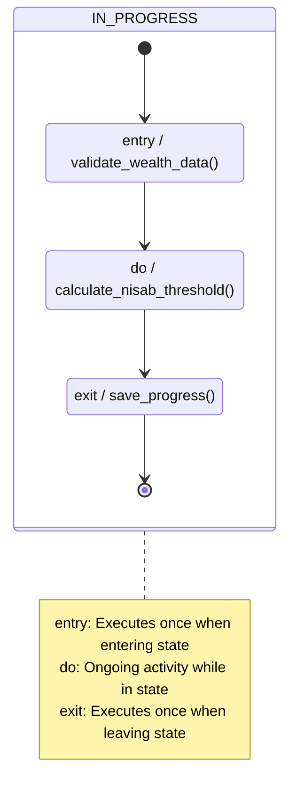

**Execution semantics**:

1. **Entry actions**: Execute **immediately after** transitioning into the state
2. **Do activities**: Long-running or repeating actions while in state (can be interrupted)
3. **Exit actions**: Execute **immediately before** transitioning out of the state

**Example - Zakat Calculation State**:

```pseudocode
state IN_PROGRESS:
  entry:
    log("Entered IN_PROGRESS state")
    validateWealthData()
    lockUserEditing()

  do:
    recalculateNisabThresholdDaily()  // Repeating activity
    trackCalculationProgress()

  exit:
    saveCalculationResults()
    unlockUserEditing()
    log("Exited IN_PROGRESS state")
```

## Transitions: The Glue

### Definition

A **transition** is a directed relationship between two states, triggered by an event and optionally guarded by a condition.

**Formal definition**:

```
Transition: (source_state, event, guard) → target_state

where:
  source_state ∈ S
  event ∈ E
  guard: boolean expression
  target_state ∈ S
```

### Transition Anatomy

A complete transition specification includes:

```
source_state --[ event [guard] / action ]--> target_state
```

**Components**:

- **source_state**: The state from which the transition originates
- **event**: The trigger that causes the transition
- **guard** (optional): Boolean condition that must be true for transition to occur
- **action** (optional): Side effect executed during the transition
- **target_state**: The destination state

### Transition Example: Contract Approval

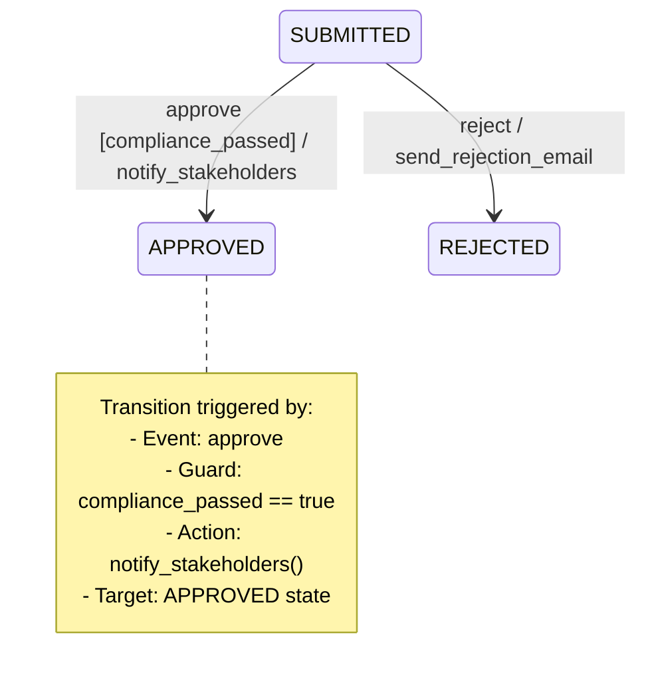

**Pseudocode**:

```pseudocode
transition:
  from: SUBMITTED
  event: approve
  guard: contract.complianceScore >= 80
  action: notifyStakeholders(contract)
  to: APPROVED
```

### Self-Transitions vs. Internal Transitions

#### Self-Transition

Exits and re-enters the same state (executes exit and entry actions).

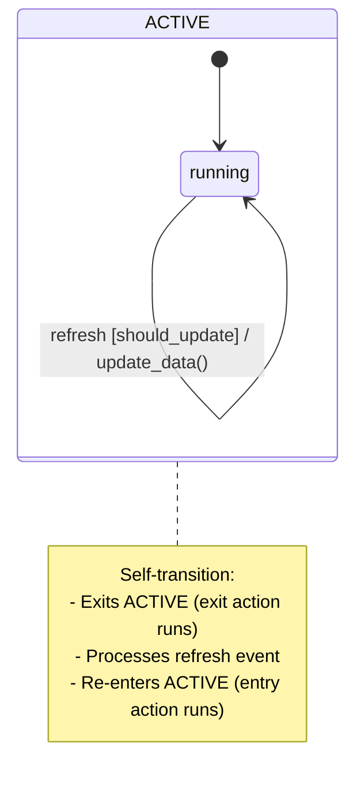

#### Internal Transition

Processes event **without exiting** the state (no entry/exit actions).

```mermaid
stateDiagram-v2
    state ACTIVE {
        ACTIVE : internal_event / update_counter()
    }

    note right of ACTIVE
      Internal transition:
      - Event handled inside state
      - No exit/entry actions
      - More efficient
    end note
```

**When to use**:

- **Self-transition**: When you need to reset the state (re-run entry/exit logic)
- **Internal transition**: When you want to handle an event without state reset (more efficient)

## Events: The Triggers

### Definition

An **event** is an occurrence that can trigger a transition from one state to another.

**Classification**:

```
Events = Signal Events ∪ Call Events ∪ Time Events ∪ Change Events
```

### Event Types

#### 1. Signal Events (Most Common)

Explicit notifications sent to the FSM, often from external actors or systems.

**Characteristics**:

- Named triggers (e.g., `submit`, `approve`, `cancel`)
- Carry optional payload data
- Asynchronous (can be queued)

**Example - Donation Campaign**:

```pseudocode
// Signal events with payloads
event LaunchCampaign {
  campaignId: UUID
  startDate: Date
  targetAmount: Money
}

event RecordDonation {
  donorId: UUID
  amount: Money
  paymentMethod: PaymentMethod
}

event CancelCampaign {
  reason: string
}
```

#### 2. Call Events

Synchronous invocations that expect a response.

**Characteristics**:

- Behave like function calls
- Block until transition completes
- Can return values

**Example - Zakat Calculation**:

```pseudocode
// Call event - synchronous
result = zakatAssessment.calculateZakat()  // Blocks until CALCULATED state reached

if result.success:
  display(result.zakatAmount)
else:
  display(result.errors)
```

#### 3. Time Events

Transitions triggered by **time passing** or **deadlines**.

**Characteristics**:

- No explicit event sent by external actor
- FSM engine monitors time conditions
- Two variants: `after(duration)` and `at(timestamp)`

**Example - Contract Expiration**:

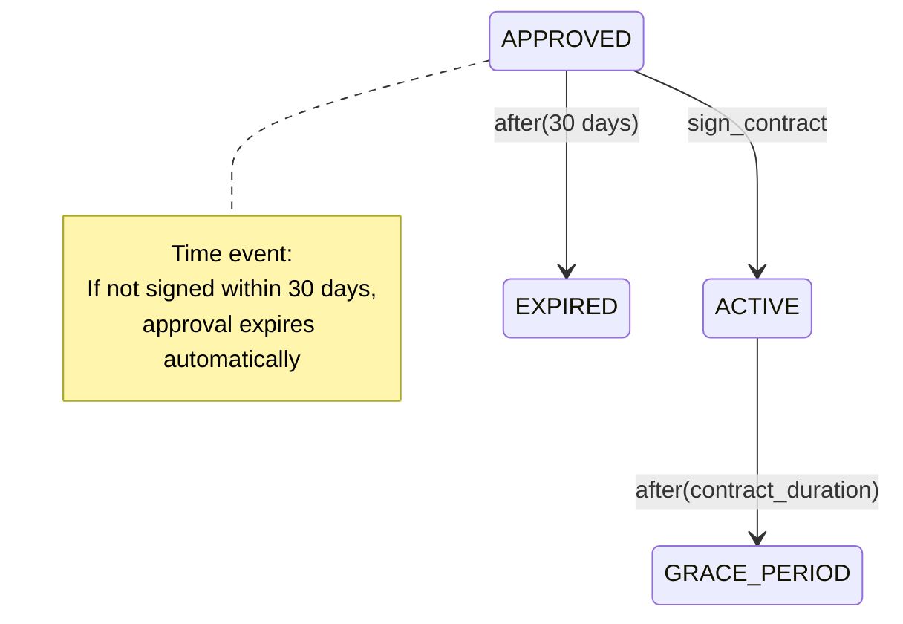

#### 4. Change Events

Transitions triggered when a **condition becomes true**.

**Characteristics**:

- FSM polls or listens for condition changes
- Triggered by changes in context/extended state
- Syntax: `when(condition)`

**Example - Campaign Funding Goal**:

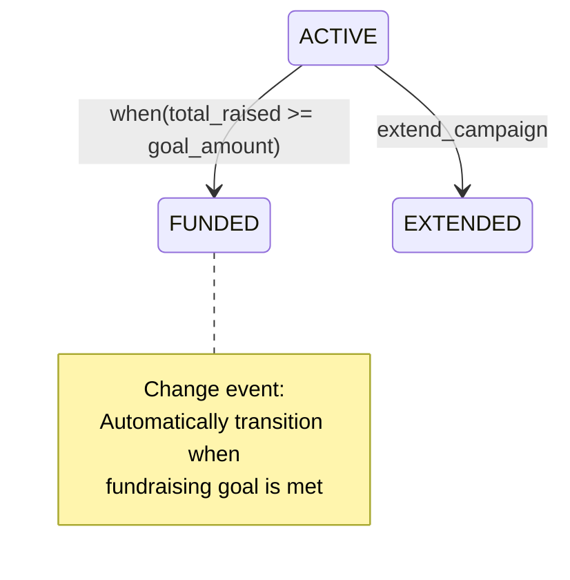

### Event Queuing and Deferred Events

**Challenge**: What happens when an event arrives while the FSM is processing another event?

**Solution**: Event queue with deferred event handling.

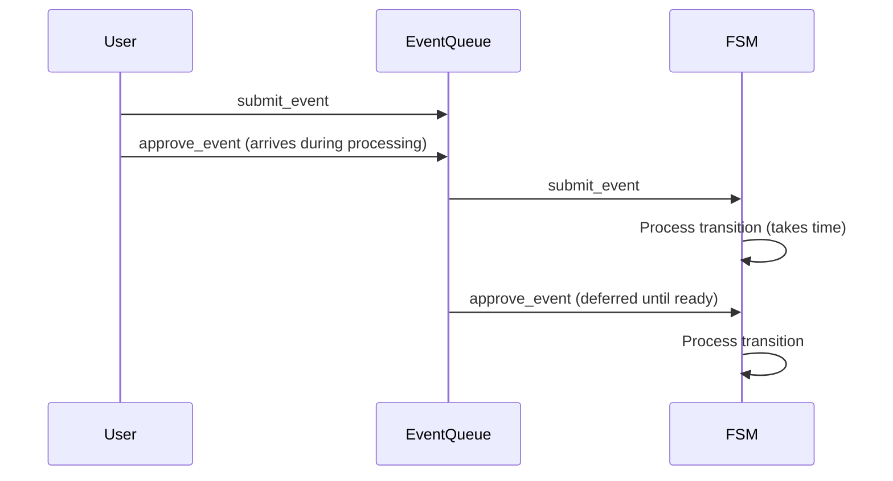

**Deferred events**:

```pseudocode
state UNDER_REVIEW:
  // Defer these events until state changes
  defer: [modify_contract, add_comment]

  // These events are handled immediately
  handle: [approve, reject]
```

## Guards: The Conditions

### Definition

A **guard** is a boolean condition that determines whether a transition is allowed to occur.

**Formal definition**:

```
Guard: State × Event → {true, false}
```

**Syntax in diagrams**: `event [guard_condition]`

### Guard Examples

#### Simple Boolean Guards

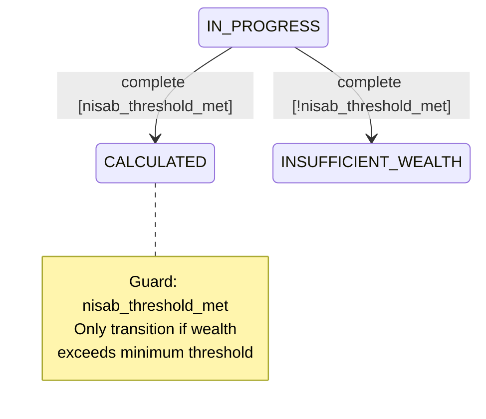

**Pseudocode**:

```pseudocode
transition:
  from: IN_PROGRESS
  event: complete
  guard: assessment.totalWealth >= nisabThreshold
  to: CALCULATED
```

#### Complex Guards with Multiple Conditions

```pseudocode
transition:
  from: SUBMITTED
  event: approve
  guard:
    contract.shariahCompliant == true
    AND contract.legalReviewPassed == true
    AND contract.amount <= approverLimit
    AND contract.parties.all(party => party.verified)
  to: APPROVED
```

### Guard Evaluation Semantics

**Key properties**:

1. **Pure functions**: Guards should be side-effect-free (read-only)
2. **Synchronous**: Guards must evaluate quickly
3. **Deterministic**: Same inputs always produce same result
4. **Fail-safe**: If guard throws exception, transition is rejected

**Best practices**:

```pseudocode
// ✅ Good: Pure, fast guard
guard: assessment.totalWealth >= 3500

// ❌ Bad: Side effect in guard
guard: {
  logGuardEvaluation()  // Side effect!
  return assessment.totalWealth >= 3500
}

// ❌ Bad: Slow I/O operation
guard: {
  complianceScore = callExternalAPI()  // Network call!
  return complianceScore >= 80
}
```

### Multiple Transitions with Guards (Choice Pseudo-state)

When multiple transitions from the same state have the same event but different guards:

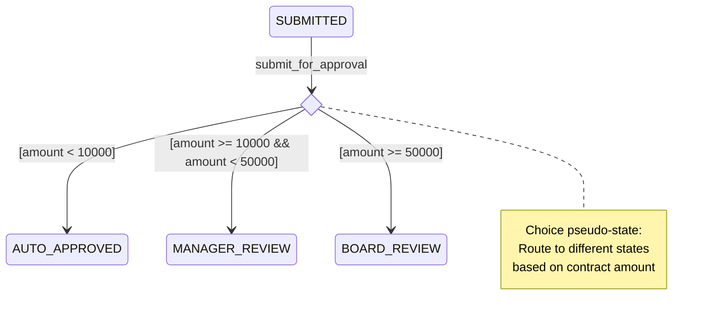

**Evaluation order**: Guards are evaluated in **priority order** (highest priority first). **Exactly one** guard must evaluate to true (else transition fails).

## Actions: The Side Effects

### Definition

An **action** is a computation or side effect executed **during a transition** or **while in a state**.

**Types**:

- **Entry actions**: Execute when entering a state
- **Exit actions**: Execute when leaving a state
- **Transition actions**: Execute during a transition (between exit and entry)
- **Do activities**: Long-running actions while in a state

### Action Execution Order

When transitioning from State A to State B:

```
1. Exit action of State A
2. Transition action
3. Entry action of State B
```

**Example**:

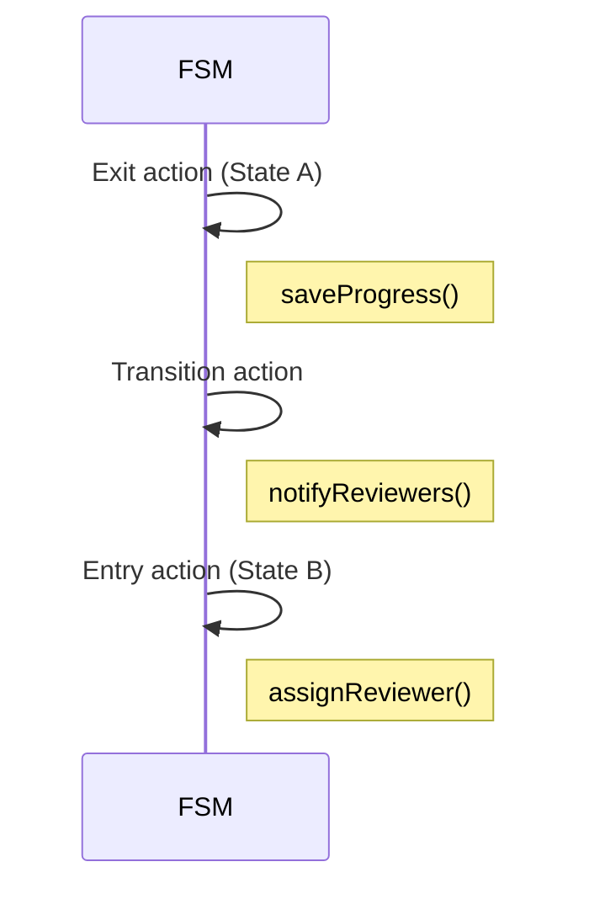

### Action Examples

#### Entry/Exit Actions

```pseudocode
state UNDER_REVIEW:
  entry:
    assignReviewer(contract)
    sendNotification(reviewer, "New contract assigned")
    startReviewTimer(48_hours)

  exit:
    stopReviewTimer()
    saveReviewComments()
```

#### Transition Actions

```pseudocode
transition:
  from: SUBMITTED
  event: approve
  guard: compliancePassed
  action:
    contract.approvedAt = now()
    contract.approvedBy = currentUser
    sendEmail(contract.submitter, "Contract approved")
    logAuditEvent("CONTRACT_APPROVED", contract.id)
  to: APPROVED
```

### Action Best Practices

1. **Keep actions short**: Long-running operations should be triggered asynchronously
2. **Idempotency**: Actions may execute multiple times (e.g., on retry) - design accordingly
3. **Error handling**: Action failures should not leave FSM in inconsistent state
4. **Separate concerns**: Domain logic in actions, FSM only orchestrates

**Bad example**:

```pseudocode
// ❌ Anti-pattern: Heavy computation in action
action:
  for each beneficiary in campaign.beneficiaries:
    calculateAllocation(beneficiary)
    validateShariahCompliance(beneficiary)
    generateReport(beneficiary)
    sendEmail(beneficiary)
  // Blocks FSM for minutes!
```

**Good example**:

```pseudocode
// ✅ Better: Trigger async job
action:
  jobId = distributionJobQueue.enqueue(campaign.id)
  campaign.distributionJobId = jobId
  // FSM continues immediately
```

## Context and Extended State

### Problem: FSM State vs. Domain State

**FSM state** (enumeration of lifecycle stages) is not sufficient for real-world systems. We also need **domain state** (data attributes).

**Example - Zakat Assessment**:

- **FSM state**: DRAFT, IN_PROGRESS, CALCULATED, PAID (4 discrete states)
- **Domain state**: totalWealth, goldOwned, silverOwned, cashOnHand, nisabThreshold, zakatAmount (continuous data)

### Solution: Extended Finite State Machine (EFSM)

An **Extended FSM** augments the basic FSM with a **context object** that holds domain data.

**Formal definition**:

```
EFSM = (S, s₀, E, δ, C)

where:
  C = context object (domain data)
  δ: S × E × C → S × C  (transition function with context)
```

### Context Example: Campaign FSM

```pseudocode
// FSM state (discrete)
enum CampaignState {
  PLANNING,
  ACTIVE,
  FUNDED,
  COMPLETED
}

// Context (domain data)
class CampaignContext {
  goalAmount: Money
  totalRaised: Money
  startDate: Date
  endDate: Date
  donorCount: integer
  beneficiaries: List<Beneficiary>
}

// Extended FSM
class CampaignFSM {
  state: CampaignState
  context: CampaignContext

  transition(event: Event): void {
    // Transition function can read/write context
    newState = δ(state, event, context)
    state = newState
  }
}
```

### Guards and Actions with Context

Guards and actions can **read** (guards) and **read/write** (actions) the context.

**Example - Funding Goal Guard**:

```pseudocode
transition:
  from: ACTIVE
  event: check_progress
  guard: context.totalRaised >= context.goalAmount
  action:
    context.fundedAt = now()
    sendNotifications(context.beneficiaries)
  to: FUNDED
```

### Context Best Practices

1. **Immutability**: In FP approaches, context is immutable (transitions return new context)
2. **Validation**: Validate context on state entry
3. **Serialization**: Context must be serializable for persistence
4. **Separation**: Keep FSM state (enum) separate from context (data object)

## Deterministic vs. Non-Deterministic FSMs

### Deterministic Finite Automaton (DFA)

**Property**: For any state and event, there is **at most one** valid transition.

**Formal**:

```
∀ s ∈ S, ∀ e ∈ E: |δ(s, e)| ≤ 1
```

**Example**:

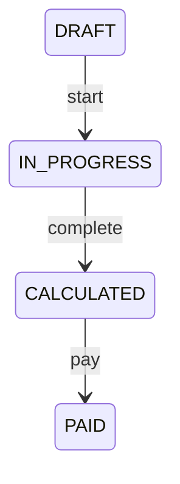

From DRAFT with event `start`, there is **exactly one** target state (IN_PROGRESS).

### Non-Deterministic Finite Automaton (NFA)

**Property**: For some state and event, there may be **multiple** valid transitions.

**Example**:

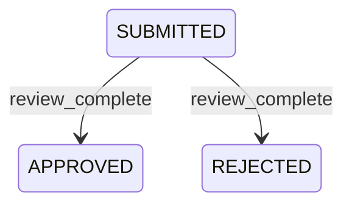

From SUBMITTED with event `review_complete`, there are **two** possible target states (APPROVED or REJECTED).

**Resolution**: Use **guards** to make the FSM deterministic.

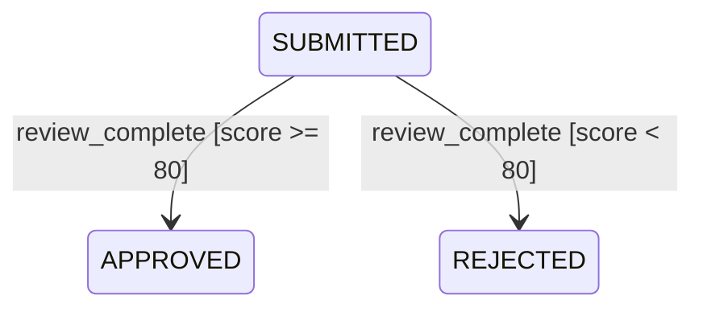

**Recommendation**: Always design **deterministic FSMs** (using guards if needed) for predictable behavior.

## FSM Notation Standards

### UML State Machine Notation

The most widely used notation, standardized by OMG (Object Management Group).

**Key elements**:

- **States**: Rounded rectangles
- **Initial state**: Filled circle with arrow to first state
- **Final state**: Filled circle with outer ring
- **Transitions**: Arrows labeled `event [guard] / action`
- **Composite states**: State containing sub-states
- **Concurrent regions**: Dashed line separating orthogonal regions within a state

**Example**:

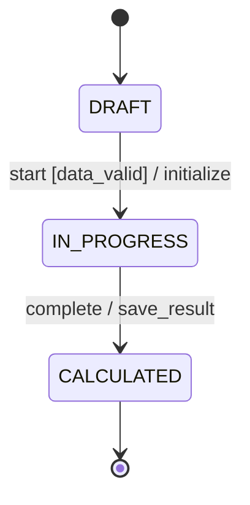

### Harel Statechart Notation

Extension of UML notation by David Harel, adding:

- **Hierarchical states** (nested states)
- **Concurrent regions** (parallel states)
- **History states** (remember last sub-state)

**Example with hierarchy**:

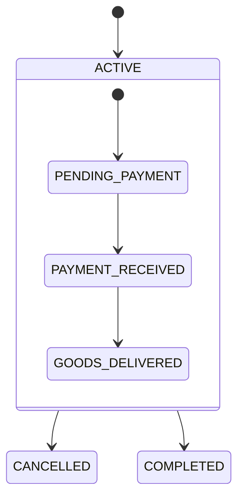

### SCXML (State Chart XML)

XML-based notation for executable state machines, standardized by W3C.

**Example**:

```xml
<scxml xmlns="http://www.w3.org/2005/07/scxml" version="1.0" initial="DRAFT">
  <state id="DRAFT">
    <transition event="start" cond="dataValid" target="IN_PROGRESS">
      <log expr="'Starting calculation'"/>
    </transition>
  </state>

  <state id="IN_PROGRESS">
    <onentry>
      <assign location="startedAt" expr="Date.now()"/>
    </onentry>
    <transition event="complete" target="CALCULATED"/>
  </state>

  <state id="CALCULATED">
    <transition event="pay" target="PAID"/>
  </state>

  <final id="PAID"/>
</scxml>
```

## Notation Comparison Chart

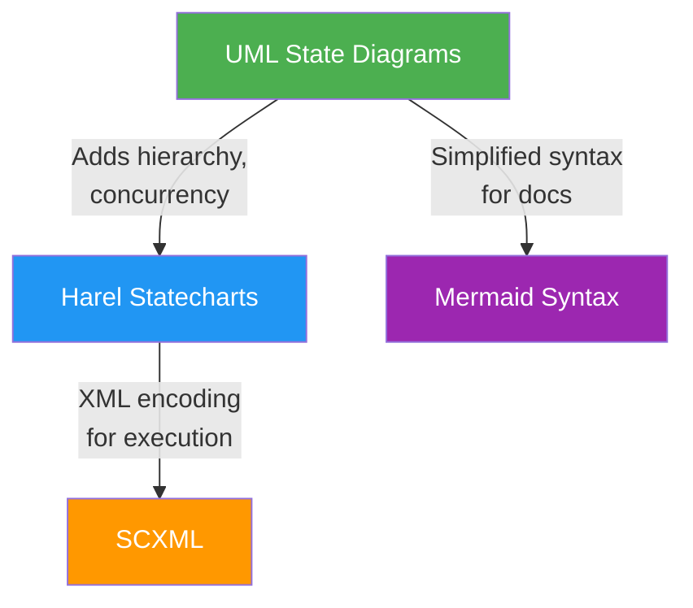

## Cross-References

### Software Engineering Principles

- [Explicit Over Implicit](../../../../../governance/principles/software-engineering/explicit-over-implicit.md) - States are explicit, not implicit
- [Simplicity Over Complexity](../../../../../governance/principles/general/simplicity-over-complexity.md) - Start with flat FSM, add complexity only when needed
- [Pure Functions Over Side Effects](../../../../../governance/principles/software-engineering/pure-functions.md) - Guards as pure functions with deterministic results
- [Immutability Over Mutability](../../../../../governance/principles/software-engineering/immutability.md) - Immutable context in FP implementations

### Related FSM Topics

- [Introduction and Philosophy](ex-so-ar-fistmafs__01-introduction-and-philosophy.md) - Why FSMs matter
- [FSM Types and Classifications](ex-so-ar-fistmafs__03-fsm-types-and-classifications.md) - Next: FSM variants
- [Events, Guards, and Actions](ex-so-ar-fistmafs__06-events-guards-and-actions.md) - Deep dive into transition mechanics
- [Hierarchical and Nested States](ex-so-ar-fistmafs__05-hierarchical-and-nested-states.md) - Composite states and sub-states

### Architecture Documentation

- [DDD Value Objects](../domain-driven-design-ddd/ex-so-ar-dodrdedd__08-value-objects.md) - Context as value objects

### Templates

- Blank State Machine Diagram (TODO: ./templates/ex-so-ar-fsm-te\_\_blank-state-machine-diagram.md) - Create your first FSM diagram
- State Transition Table (TODO: ./templates/ex-so-ar-fsm-te\_\_state-transition-table.md) - Document transitions in tabular format

## Next Steps

1. **Understand FSM variants**: Read [FSM Types and Classifications](ex-so-ar-fistmafs__03-fsm-types-and-classifications.md)
2. **Learn state explosion mitigation**: Read [State Explosion and Mitigation](ex-so-ar-fistmafs__04-state-explosion-and-mitigation.md)
3. **Master hierarchical states**: Read [Hierarchical and Nested States](ex-so-ar-fistmafs__05-hierarchical-and-nested-states.md)
4. **Design your first FSM**: Use State Machine Specification (TODO: ./templates/ex-so-ar-fsm-te\_\_state-machine-specification.md) template

## Summary

This document covered the fundamental building blocks of FSMs:

- **States**: Initial, intermediate, final with entry/exit/do activities
- **Transitions**: Directed relationships between states with events, guards, and actions
- **Events**: Signal, call, time, and change events
- **Guards**: Boolean conditions controlling transition eligibility
- **Actions**: Side effects executed during transitions or in states
- **Context**: Extended state (domain data) augmenting FSM state (lifecycle stage)
- **Determinism**: Prefer deterministic FSMs with guards over non-deterministic designs
- **Notation**: UML State Diagrams, Harel Statecharts, SCXML

These concepts form the foundation for designing robust, maintainable state machines. The next documents explore FSM variants, design patterns, and implementation approaches across different paradigms.
