# FSM Types and Classifications

Finite State Machines come in various forms, each suited to different complexity levels and use cases. This document provides a comprehensive taxonomy of FSM variants, from classical automata theory (Mealy/Moore machines) to modern enterprise patterns (hierarchical, concurrent, and extended FSMs).

## Classical FSM Types

### Mealy Machines

**Definition**: An FSM where **outputs depend on both current state and input**.

**Formal definition**:

```
Mealy Machine = (S, s₀, E, O, δ, λ)

where:
  S = finite set of states
  s₀ = initial state
  E = finite set of input events
  O = finite set of outputs
  δ: S × E → S  (transition function)
  λ: S × E → O  (output function)
```

**Key characteristic**: Outputs are associated with **transitions**.

#### Mealy Machine Example: Contract Notifications

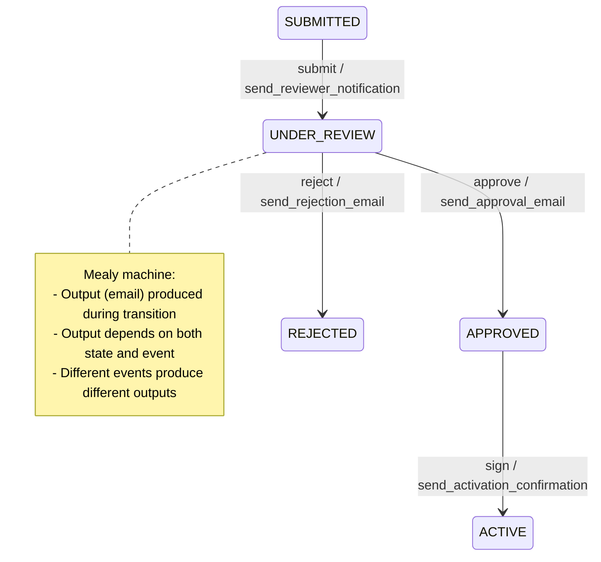
```mermaid
stateDiagram-v2
    SUBMITTED --> UNDER_REVIEW : submit / send_reviewer_notification
    UNDER_REVIEW --> APPROVED : approve / send_approval_email
    UNDER_REVIEW --> REJECTED : reject / send_rejection_email
    APPROVED --> ACTIVE : sign / send_activation_confirmation

    note right of UNDER_REVIEW
      Mealy machine:
      - Output (email) produced during transition
      - Output depends on both state and event
      - Different events produce different outputs
    end note
```

**Characteristics**:

- **Responsive**: Outputs produced immediately upon event
- **Fewer states**: Can encode more complex behavior without additional states
- **Output on transitions**: Each transition can have unique output

**Pseudocode**:

```pseudocode
class MealyContractFSM {
  currentState: State

  process(event: Event): Output {
    // Output depends on current state AND event
    output = outputFunction(currentState, event)
    currentState = transitionFunction(currentState, event)
    return output
  }
}

// Example invocation
output = fsm.process(ApproveEvent)
// If currentState=UNDER_REVIEW, output="Approval email sent"
// If currentState=SUBMITTED, output might be different or error
```

### Moore Machines

**Definition**: An FSM where **outputs depend only on current state**.

**Formal definition**:

```
Moore Machine = (S, s₀, E, O, δ, λ)

where:
  S = finite set of states
  s₀ = initial state
  E = finite set of input events
  O = finite set of outputs
  δ: S × E → S  (transition function)
  λ: S → O      (output function - state only!)
```

**Key characteristic**: Outputs are associated with **states**.

#### Moore Machine Example: Campaign Status Display

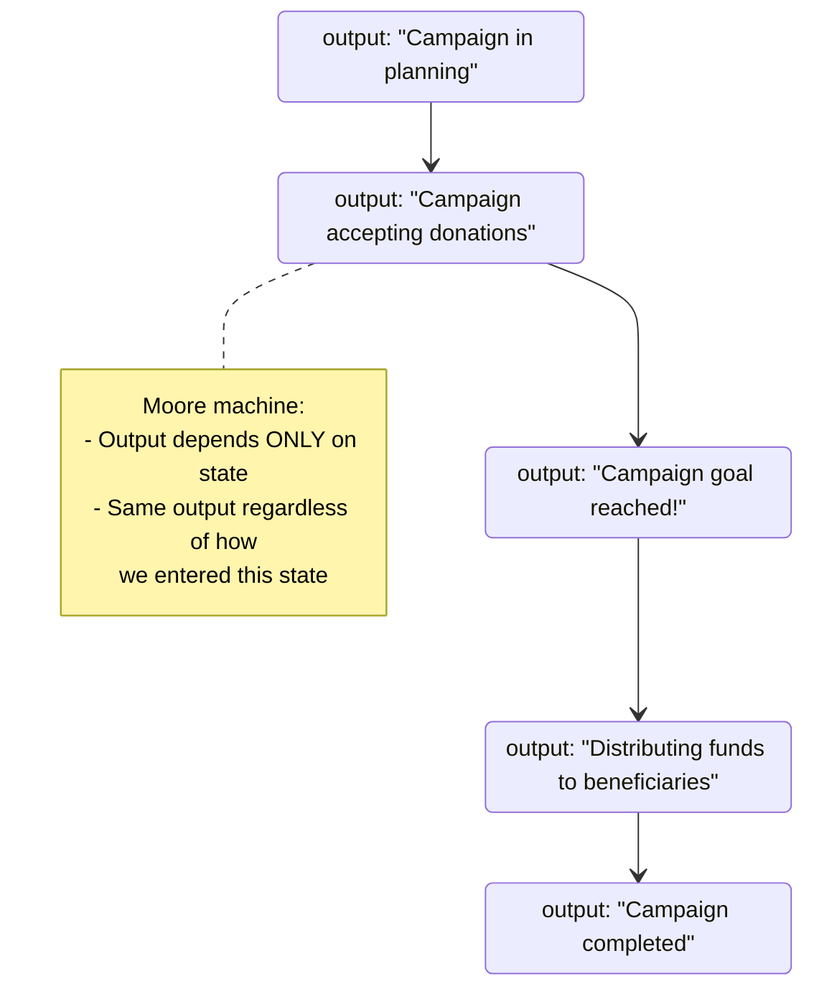
```mermaid
stateDiagram-v2
    PLANNING --> ACTIVE
    ACTIVE --> FUNDED
    FUNDED --> DISTRIBUTING
    DISTRIBUTING --> COMPLETED

    PLANNING : output: "Campaign in planning"
    ACTIVE : output: "Campaign accepting donations"
    FUNDED : output: "Campaign goal reached!"
    DISTRIBUTING : output: "Distributing funds to beneficiaries"
    COMPLETED : output: "Campaign completed"

    note right of ACTIVE
      Moore machine:
      - Output depends ONLY on state
      - Same output regardless of how
        we entered this state
    end note
```

**Characteristics**:

- **Stable outputs**: Output constant while in state
- **More states**: May need additional states to produce different outputs
- **Output on states**: Each state has exactly one output

**Pseudocode**:

```pseudocode
class MooreCampaignFSM {
  currentState: State

  process(event: Event): void {
    currentState = transitionFunction(currentState, event)
  }

  getOutput(): Output {
    // Output depends ONLY on current state
    return outputFunction(currentState)
  }
}

// Example invocation
fsm.process(LaunchEvent)
display = fsm.getOutput()
// display = "Campaign accepting donations" (from ACTIVE state)
```

### Mealy vs. Moore Comparison

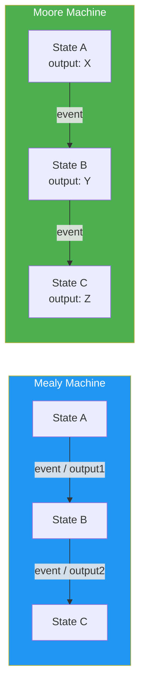
```mermaid
flowchart LR
    subgraph Mealy["Mealy Machine"]
        MS1[State A] -->|event / output1| MS2[State B]
        MS2 -->|event / output2| MS3[State C]
    end

    subgraph Moore["Moore Machine"]
        MO1[State A<br/>output: X] -->|event| MO2[State B<br/>output: Y]
        MO2 -->|event| MO3[State C<br/>output: Z]
    end

    style Mealy fill:#2196F3,color:#fff
    style Moore fill:#4CAF50,color:#fff
```

| Aspect                | Mealy Machine                      | Moore Machine                |
| --------------------- | ---------------------------------- | ---------------------------- |
| **Output depends on** | Current state + Input event        | Current state only           |
| **Output timing**     | During transition (immediate)      | After entering state         |
| **Number of states**  | Typically fewer states             | May need more states         |
| **Output stability**  | Can change during state            | Stable throughout state      |
| **Use case**          | Event-driven responses             | State-based displays/actions |
| **OSE Example**       | Email notifications on transitions | Campaign status display      |

**Practical note**: Most modern FSM libraries support **both** patterns:

- Use Mealy for **transition actions** (e.g., sending notifications during approval)
- Use Moore for **entry actions** (e.g., logging when entering APPROVED state)

## Deterministic vs. Non-Deterministic FSMs

### Deterministic Finite Automaton (DFA)

**Property**: For any state and input, there is **exactly one** valid transition (or no transition).

**Formal**:

```
∀ s ∈ S, ∀ e ∈ E: |{s' | δ(s, e) = s'}| ≤ 1
```

**Example - Zakat Assessment (Deterministic)**:

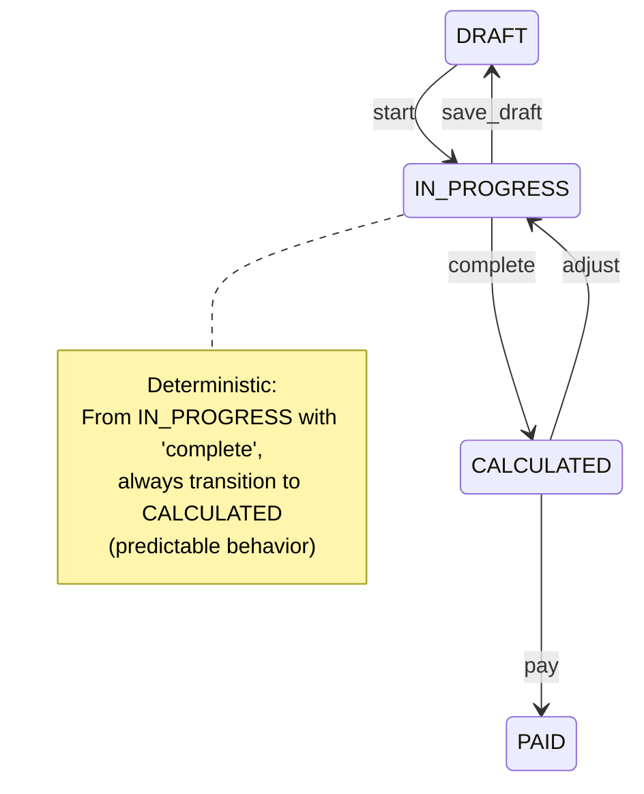
```mermaid
stateDiagram-v2
    DRAFT --> IN_PROGRESS : start
    IN_PROGRESS --> CALCULATED : complete
    IN_PROGRESS --> DRAFT : save_draft
    CALCULATED --> PAID : pay
    CALCULATED --> IN_PROGRESS : adjust

    note right of IN_PROGRESS
      Deterministic:
      From IN_PROGRESS with 'complete',
      always transition to CALCULATED
      (predictable behavior)
    end note
```

**Properties**:

- **Predictable**: Same input always produces same outcome
- **Testable**: Easy to verify all transitions
- **Recommended**: Use DFAs for business workflows

### Non-Deterministic Finite Automaton (NFA)

**Property**: For some state and input, there may be **multiple** valid transitions.

**Example - Contract Review (Non-Deterministic)**:

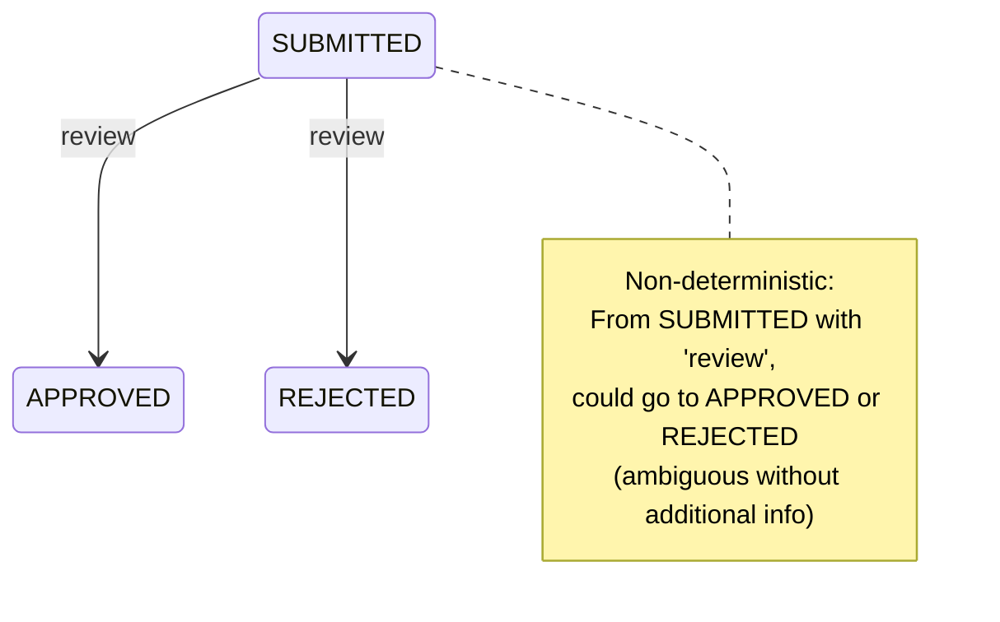
```mermaid
stateDiagram-v2
    SUBMITTED --> APPROVED : review
    SUBMITTED --> REJECTED : review

    note right of SUBMITTED
      Non-deterministic:
      From SUBMITTED with 'review',
      could go to APPROVED or REJECTED
      (ambiguous without additional info)
    end note
```

**Resolution**: Add **guards** to make it deterministic.

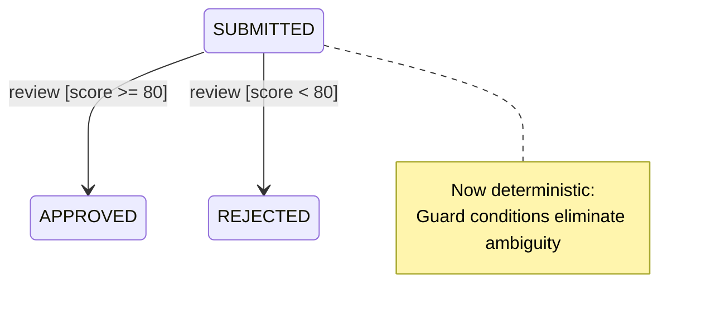
```mermaid
stateDiagram-v2
    SUBMITTED --> APPROVED : review [score >= 80]
    SUBMITTED --> REJECTED : review [score < 80]

    note right of SUBMITTED
      Now deterministic:
      Guard conditions eliminate ambiguity
    end note
```

**Recommendation**: Always design **deterministic FSMs** using guards to resolve ambiguity.

## Hierarchical State Machines (HSM)

### Definition

A **Hierarchical State Machine** (also called **Statechart**) allows states to contain **nested sub-states**.

**Benefit**: Manages complexity by grouping related states and sharing transitions.

### Simple Hierarchical Example: Order Processing

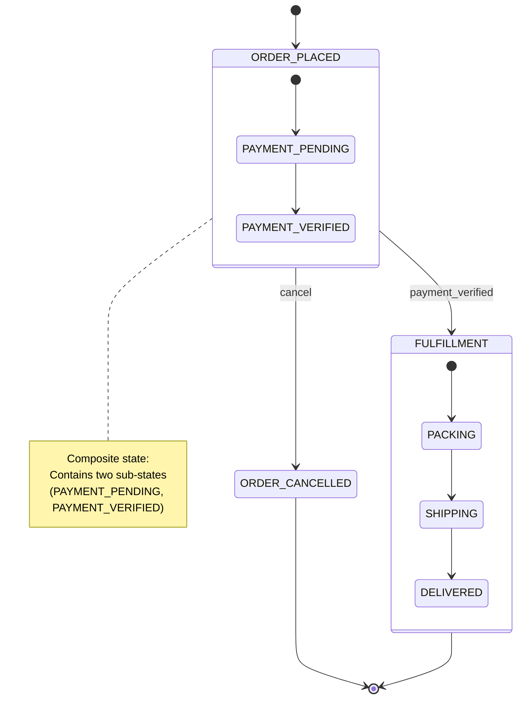
```mermaid
stateDiagram-v2
    [*] --> ORDER_PLACED

    state ORDER_PLACED {
        [*] --> PAYMENT_PENDING
        PAYMENT_PENDING --> PAYMENT_VERIFIED
    }

    ORDER_PLACED --> ORDER_CANCELLED : cancel

    state FULFILLMENT {
        [*] --> PACKING
        PACKING --> SHIPPING
        SHIPPING --> DELIVERED
    }

    ORDER_PLACED --> FULFILLMENT : payment_verified
    FULFILLMENT --> [*]
    ORDER_CANCELLED --> [*]

    note right of ORDER_PLACED
      Composite state:
      Contains two sub-states
      (PAYMENT_PENDING, PAYMENT_VERIFIED)
    end note
```

**Key concepts**:

- **Composite state**: A state containing sub-states (e.g., ORDER_PLACED)
- **Atomic state**: A leaf state with no sub-states (e.g., PAYMENT_PENDING)
- **Entry point**: Default sub-state when entering composite state (marked with [*])
- **Shared transitions**: `cancel` event from any sub-state of ORDER_PLACED goes to ORDER_CANCELLED

### Complex Hierarchical Example: Islamic Contract Lifecycle

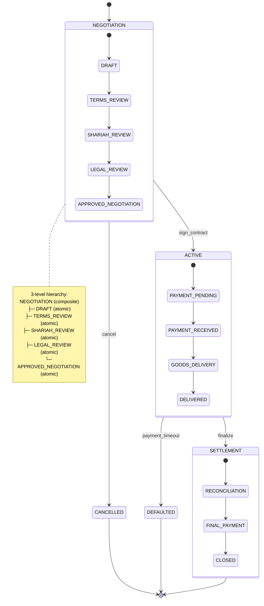
```mermaid
stateDiagram-v2
    [*] --> NEGOTIATION

    state NEGOTIATION {
        [*] --> DRAFT
        DRAFT --> TERMS_REVIEW
        TERMS_REVIEW --> SHARIAH_REVIEW
        SHARIAH_REVIEW --> LEGAL_REVIEW
        LEGAL_REVIEW --> APPROVED_NEGOTIATION
    }

    NEGOTIATION --> ACTIVE : sign_contract

    state ACTIVE {
        [*] --> PAYMENT_PENDING
        PAYMENT_PENDING --> PAYMENT_RECEIVED
        PAYMENT_RECEIVED --> GOODS_DELIVERY
        GOODS_DELIVERY --> DELIVERED
    }

    ACTIVE --> SETTLEMENT : finalize

    state SETTLEMENT {
        [*] --> RECONCILIATION
        RECONCILIATION --> FINAL_PAYMENT
        FINAL_PAYMENT --> CLOSED
    }

    NEGOTIATION --> CANCELLED : cancel
    ACTIVE --> DEFAULTED : payment_timeout
    SETTLEMENT --> [*]
    CANCELLED --> [*]
    DEFAULTED --> [*]

    note right of NEGOTIATION
      3-level hierarchy:
      NEGOTIATION (composite)
        ├─ DRAFT (atomic)
        ├─ TERMS_REVIEW (atomic)
        ├─ SHARIAH_REVIEW (atomic)
        ├─ LEGAL_REVIEW (atomic)
        └─ APPROVED_NEGOTIATION (atomic)
    end note
```

**Advantages of hierarchy**:

1. **Reduced complexity**: Group related states
2. **Shared transitions**: `cancel` from anywhere in NEGOTIATION → CANCELLED
3. **Abstraction levels**: High-level view (3 states) vs. detailed view (11+ states)
4. **Reusability**: Sub-state machines can be reused

### Entry and Exit in Hierarchical FSMs

When transitioning into/out of composite states, **entry/exit actions** execute in specific order.

**Rule**:

- **Entering composite state**: Execute parent entry, then child entry
- **Exiting composite state**: Execute child exit, then parent exit

**Example**:

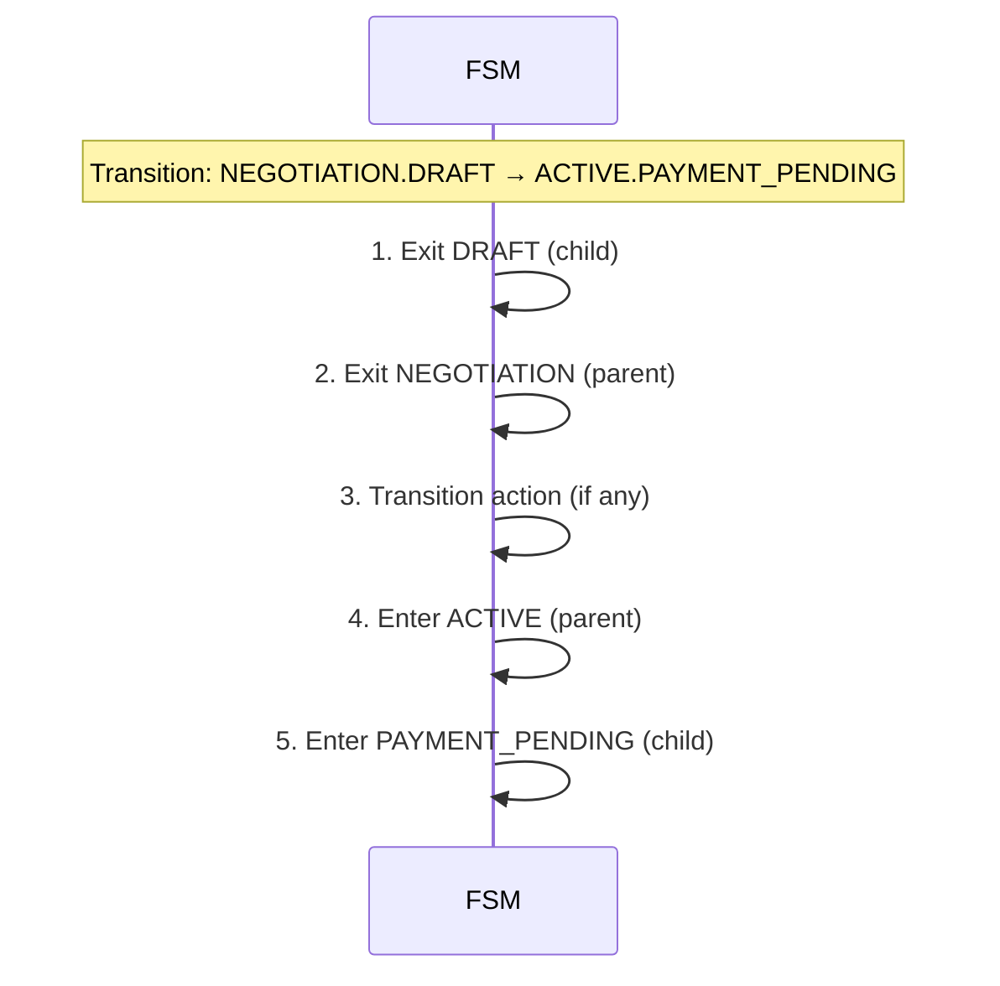
```mermaid
sequenceDiagram
    participant FSM

    Note over FSM: Transition: NEGOTIATION.DRAFT → ACTIVE.PAYMENT_PENDING

    FSM->>FSM: 1. Exit DRAFT (child)
    FSM->>FSM: 2. Exit NEGOTIATION (parent)
    FSM->>FSM: 3. Transition action (if any)
    FSM->>FSM: 4. Enter ACTIVE (parent)
    FSM->>FSM: 5. Enter PAYMENT_PENDING (child)
```

**Pseudocode**:

```pseudocode
state NEGOTIATION:
  entry:
    log("Entered NEGOTIATION")
    initializeNegotiationWorkspace()

  exit:
    log("Exited NEGOTIATION")
    saveNegotiationHistory()

state DRAFT (inside NEGOTIATION):
  entry:
    log("Entered DRAFT")
    createDraftDocument()

  exit:
    log("Exited DRAFT")
    validateDraftData()

// Execution order on transition DRAFT → ACTIVE:
// 1. "Exited DRAFT" + validateDraftData()
// 2. "Exited NEGOTIATION" + saveNegotiationHistory()
// 3. Transition action
// 4. "Entered ACTIVE" + parent entry actions
// 5. "Entered PAYMENT_PENDING" + child entry actions
```

## Concurrent (Orthogonal) Regions

### Definition

**Concurrent regions** (also called **orthogonal regions**) allow an FSM to be in **multiple states simultaneously**.

**Use case**: Model independent aspects of a system that evolve in parallel.

### Example: Multi-Currency Zakat Account

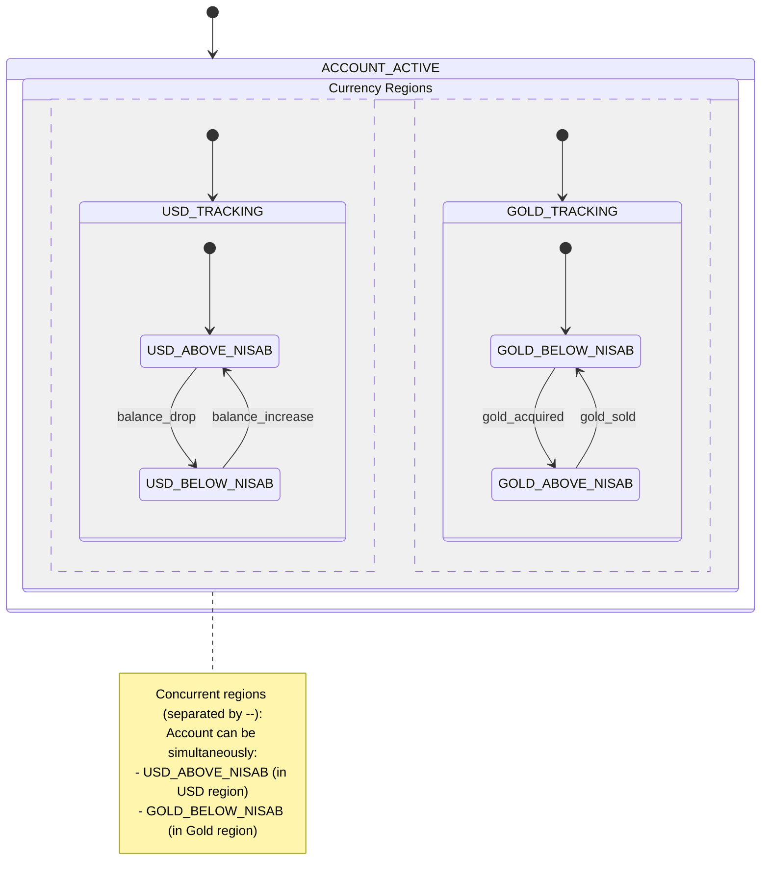
```mermaid
stateDiagram-v2
    [*] --> ACCOUNT_ACTIVE

    state ACCOUNT_ACTIVE {
        state "Currency Regions" as regions

        state regions {
            [*] --> USD_TRACKING
            state USD_TRACKING {
                [*] --> USD_ABOVE_NISAB
                USD_ABOVE_NISAB --> USD_BELOW_NISAB : balance_drop
                USD_BELOW_NISAB --> USD_ABOVE_NISAB : balance_increase
            }

            --

            [*] --> GOLD_TRACKING
            state GOLD_TRACKING {
                [*] --> GOLD_BELOW_NISAB
                GOLD_BELOW_NISAB --> GOLD_ABOVE_NISAB : gold_acquired
                GOLD_ABOVE_NISAB --> GOLD_BELOW_NISAB : gold_sold
            }
        }
    }

    note right of regions
      Concurrent regions (separated by --):
      Account can be simultaneously:
      - USD_ABOVE_NISAB (in USD region)
      - GOLD_BELOW_NISAB (in Gold region)
    end note
```

**Key properties**:

- **Independence**: State changes in one region don't affect other regions
- **Join conditions**: Transitions out of composite state can wait for specific combination of sub-states

### Example: Campaign with Parallel Compliance Checks

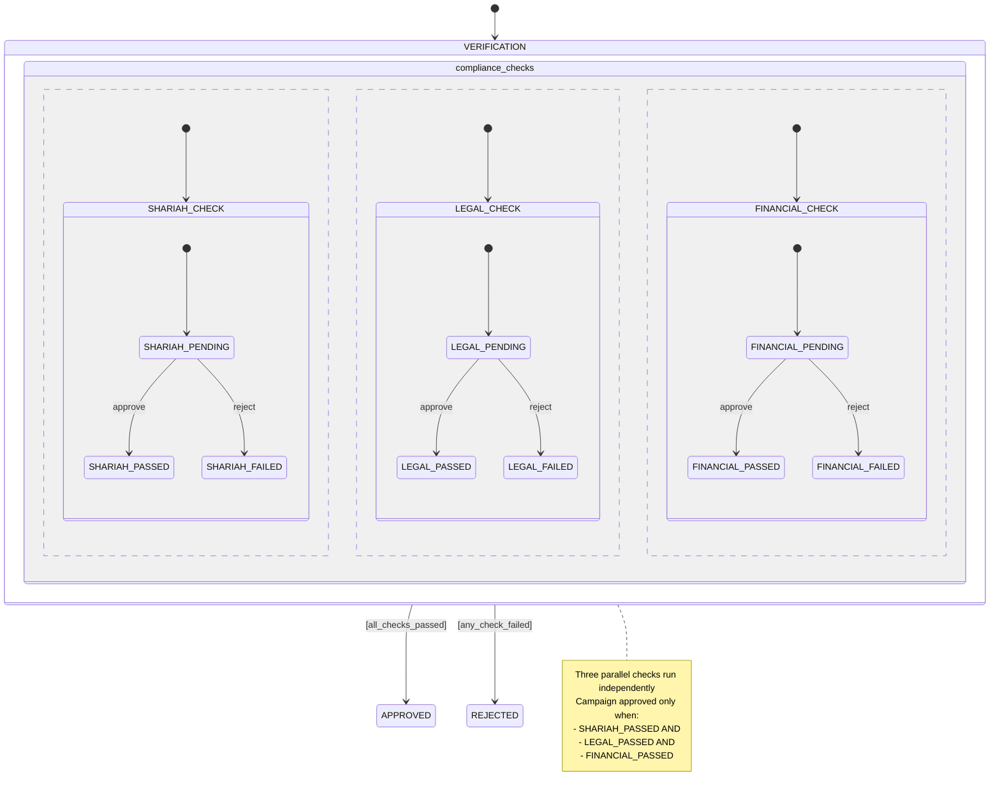
```mermaid
stateDiagram-v2
    [*] --> VERIFICATION

    state VERIFICATION {
        state compliance_checks {
            [*] --> SHARIAH_CHECK
            state SHARIAH_CHECK {
                [*] --> SHARIAH_PENDING
                SHARIAH_PENDING --> SHARIAH_PASSED : approve
                SHARIAH_PENDING --> SHARIAH_FAILED : reject
            }

            --

            [*] --> LEGAL_CHECK
            state LEGAL_CHECK {
                [*] --> LEGAL_PENDING
                LEGAL_PENDING --> LEGAL_PASSED : approve
                LEGAL_PENDING --> LEGAL_FAILED : reject
            }

            --

            [*] --> FINANCIAL_CHECK
            state FINANCIAL_CHECK {
                [*] --> FINANCIAL_PENDING
                FINANCIAL_PENDING --> FINANCIAL_PASSED : approve
                FINANCIAL_PENDING --> FINANCIAL_FAILED : reject
            }
        }
    }

    VERIFICATION --> APPROVED : [all_checks_passed]
    VERIFICATION --> REJECTED : [any_check_failed]

    note right of VERIFICATION
      Three parallel checks run independently
      Campaign approved only when:
      - SHARIAH_PASSED AND
      - LEGAL_PASSED AND
      - FINANCIAL_PASSED
    end note
```

**Join condition**:

```pseudocode
guard all_checks_passed:
  return (
    shariahCheck.state == SHARIAH_PASSED &&
    legalCheck.state == LEGAL_PASSED &&
    financialCheck.state == FINANCIAL_PASSED
  )

guard any_check_failed:
  return (
    shariahCheck.state == SHARIAH_FAILED ||
    legalCheck.state == LEGAL_FAILED ||
    financialCheck.state == FINANCIAL_FAILED
  )
```

## Extended Finite State Machines (EFSM)

### Definition

An **Extended FSM** augments a basic FSM with **variables** (context/extended state) to avoid state explosion.

**Formal definition**:

```
EFSM = (S, s₀, E, V, δ)

where:
  S = finite set of control states
  s₀ = initial state
  E = finite set of events
  V = set of variables (context)
  δ: S × E × (V → Bool) → S × (V → V)
      (transition with guard on variables and actions on variables)
```

### Example: Counter Without EFSM (State Explosion)

**Naive approach** (every count value is a state):

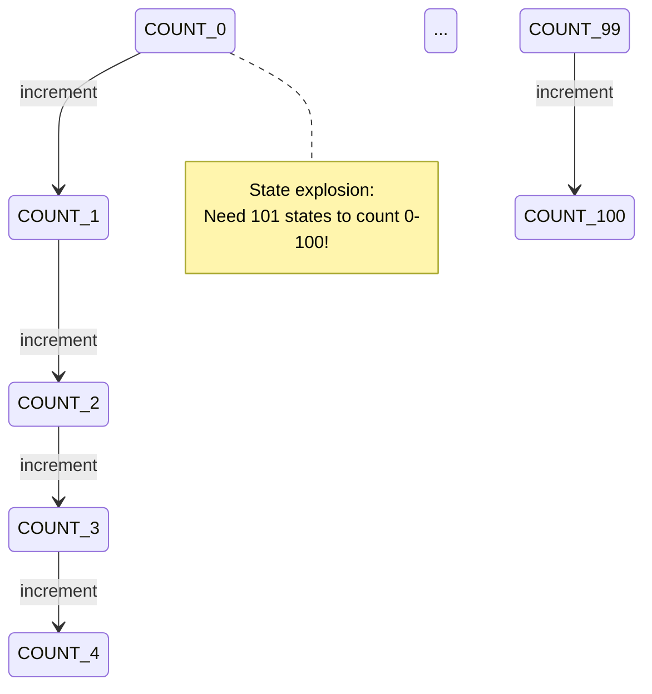
```mermaid
stateDiagram-v2
    COUNT_0 --> COUNT_1 : increment
    COUNT_1 --> COUNT_2 : increment
    COUNT_2 --> COUNT_3 : increment
    COUNT_3 --> COUNT_4 : increment
    ...
    COUNT_99 --> COUNT_100 : increment

    note right of COUNT_0
      State explosion:
      Need 101 states to count 0-100!
    end note
```

### Example: Counter With EFSM (Elegant)

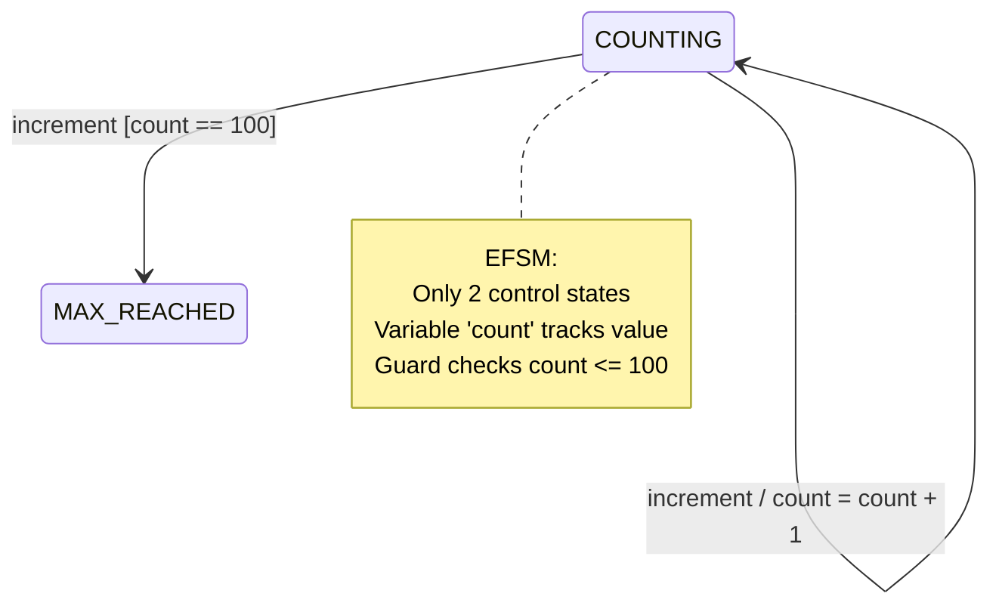
```mermaid
stateDiagram-v2
    COUNTING --> COUNTING : increment / count = count + 1
    COUNTING --> MAX_REACHED : increment [count == 100]

    note right of COUNTING
      EFSM:
      Only 2 control states
      Variable 'count' tracks value
      Guard checks count <= 100
    end note
```

**Pseudocode**:

```pseudocode
// Control state (FSM state)
enum CounterState {
  COUNTING,
  MAX_REACHED
}

// Context (variables)
class CounterContext {
  count: integer = 0
}

// EFSM
class CounterEFSM {
  state: CounterState = COUNTING
  context: CounterContext = new CounterContext()

  increment(): void {
    if state == COUNTING:
      if context.count < 100:
        context.count += 1  // Action: modify variable
      else:
        state = MAX_REACHED  // Transition with guard
}
```

### Real-World EFSM: Zakat Assessment

**Control states** (4):

- DRAFT
- IN_PROGRESS
- CALCULATED
- PAID

**Context variables** (many):

- totalWealth: Money
- goldAmount: Weight
- silverAmount: Weight
- cashOnHand: Money
- nisabThreshold: Money
- zakatAmount: Money
- calculatedAt: DateTime

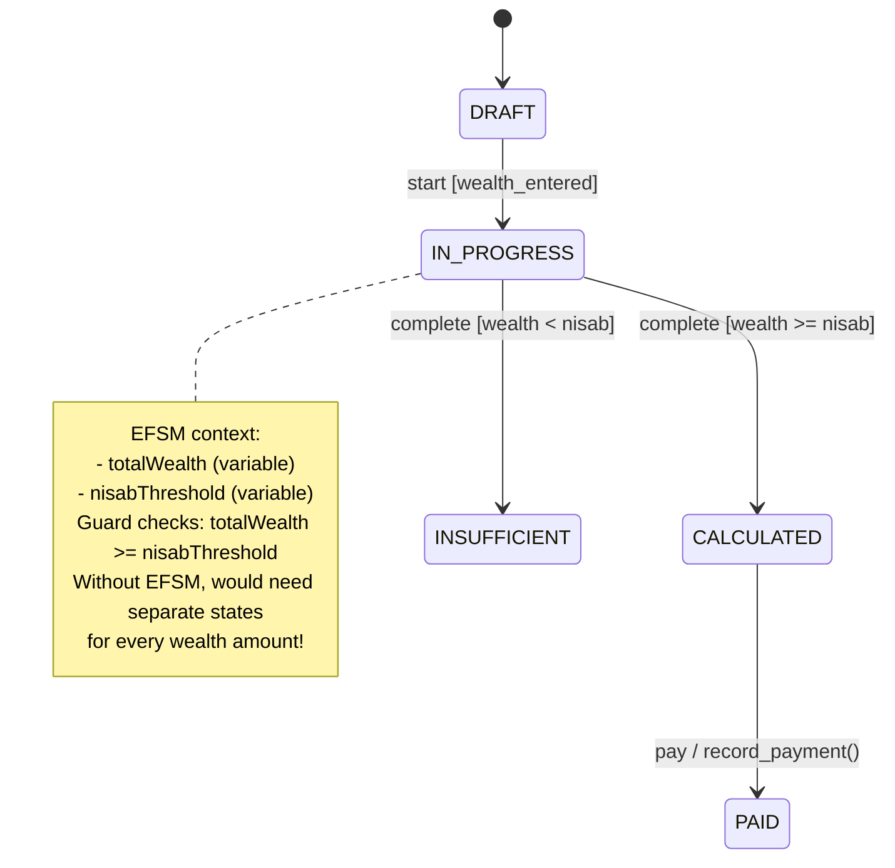
```mermaid
stateDiagram-v2
    [*] --> DRAFT
    DRAFT --> IN_PROGRESS : start [wealth_entered]
    IN_PROGRESS --> CALCULATED : complete [wealth >= nisab]
    IN_PROGRESS --> INSUFFICIENT : complete [wealth < nisab]
    CALCULATED --> PAID : pay / record_payment()

    note right of IN_PROGRESS
      EFSM context:
      - totalWealth (variable)
      - nisabThreshold (variable)
      Guard checks: totalWealth >= nisabThreshold
      Without EFSM, would need separate states
      for every wealth amount!
    end note
```

**Advantages of EFSM**:

1. **Avoid state explosion**: Use variables instead of states for continuous data
2. **Expressive guards**: Complex conditions on variables
3. **Flexible actions**: Modify variables during transitions
4. **Real-world modeling**: Matches how business entities actually work

## Pseudo-States and Transient States

### Pseudo-States

**Pseudo-states** are **not real states** - they are control flow constructs in state diagrams.

#### 1. Initial Pseudo-State

Indicates the starting point.

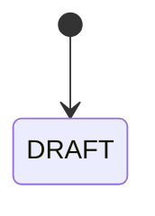
```mermaid
stateDiagram-v2
    [*] --> DRAFT
```

#### 2. Final Pseudo-State

Indicates termination.

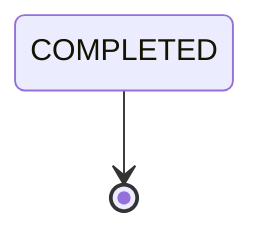
```mermaid
stateDiagram-v2
    COMPLETED --> [*]
```

#### 3. Choice Pseudo-State

Decision point based on guards.

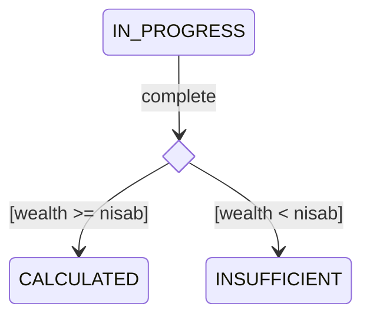
```mermaid
stateDiagram-v2
    state choice <<choice>>

    IN_PROGRESS --> choice : complete
    choice --> CALCULATED : [wealth >= nisab]
    choice --> INSUFFICIENT : [wealth < nisab]
```

#### 4. Junction Pseudo-State

Merges multiple transitions before evaluating guards.

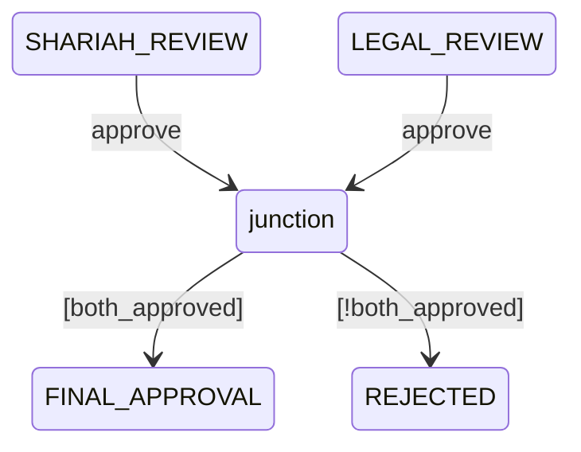
```mermaid
stateDiagram-v2
    state junction <<junction>>

    SHARIAH_REVIEW --> junction : approve
    LEGAL_REVIEW --> junction : approve

    junction --> FINAL_APPROVAL : [both_approved]
    junction --> REJECTED : [!both_approved]
```

#### 5. Fork Pseudo-State

Splits control flow into concurrent regions.

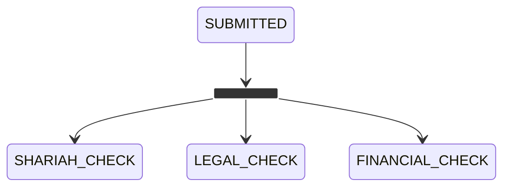
```mermaid
stateDiagram-v2
    state fork <<fork>>

    SUBMITTED --> fork

    fork --> SHARIAH_CHECK
    fork --> LEGAL_CHECK
    fork --> FINANCIAL_CHECK
```

#### 6. Join Pseudo-State

Merges concurrent regions.

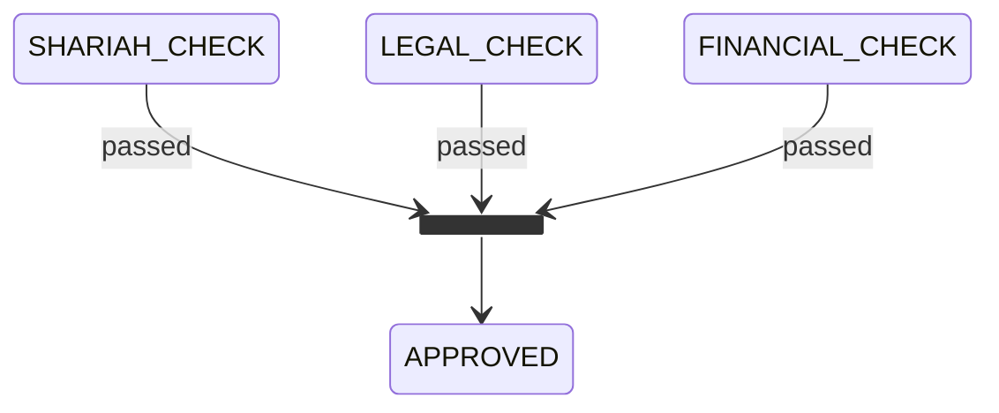
```mermaid
stateDiagram-v2
    state join <<join>>

    SHARIAH_CHECK --> join : passed
    LEGAL_CHECK --> join : passed
    FINANCIAL_CHECK --> join : passed

    join --> APPROVED
```

### Transient States

**Transient states** are real states but the FSM **cannot remain** in them - it immediately transitions out.

**Use case**: Intermediate processing or decision-making.

**Example - Campaign Auto-Extension**:

```mermaid
stateDiagram-v2
    ACTIVE --> EVALUATING_EXTENSION : end_date_reached
    EVALUATING_EXTENSION --> EXTENDED : [goal_not_met && extension_allowed]
    EVALUATING_EXTENSION --> COMPLETED : [goal_met]
    EVALUATING_EXTENSION --> EXPIRED : [goal_not_met && !extension_allowed]

    note right of EVALUATING_EXTENSION
      Transient state:
      FSM evaluates guards and
      immediately transitions out
      (milliseconds in this state)
    end note
```

**Characteristics**:

- **No entry/exit actions** (typically)
- **No do activities**
- **Guards determine next state**
- **Used for decision trees** within FSM

## FSM Type Selection Guide

```mermaid
flowchart TD
    Start([Choose FSM Type]) --> Q1{Need concurrent<br/>independent regions?}

    Q1 -->|Yes| Concurrent[Use Concurrent Regions<br/>Orthogonal FSM]
    Q1 -->|No| Q2{State explosion<br/>risk?}

    Q2 -->|Yes| Q3{Can use variables<br/>instead of states?}
    Q3 -->|Yes| EFSM[Use Extended FSM<br/>Context variables]
    Q3 -->|No| Q4{Can group related<br/>states hierarchically?}

    Q4 -->|Yes| Hierarchical[Use Hierarchical FSM<br/>Composite states]
    Q4 -->|No| Review[Review design<br/>State explosion unavoidable?]

    Q2 -->|No| Q5{Need state grouping<br/>or shared transitions?}
    Q5 -->|Yes| Hierarchical
    Q5 -->|No| Q6{Outputs on transitions<br/>or states?}

    Q6 -->|Transitions| Mealy[Use Mealy Machine<br/>Event-driven outputs]
    Q6 -->|States| Moore[Use Moore Machine<br/>State-based outputs]
    Q6 -->|Both| Hybrid[Use Hybrid<br/>Modern FSM library]

    style Concurrent fill:#4CAF50,color:#fff
    style EFSM fill:#4CAF50,color:#fff
    style Hierarchical fill:#4CAF50,color:#fff
    style Mealy fill:#2196F3,color:#fff
    style Moore fill:#2196F3,color:#fff
    style Hybrid fill:#2196F3,color:#fff
    style Review fill:#FF9800,color:#fff
```

## OSE Domain Examples Summary

| FSM Type          | OSE Example                                            | Key Feature                          |
| ----------------- | ------------------------------------------------------ | ------------------------------------ |
| **Mealy**         | Contract approval notifications                        | Outputs on transitions (emails)      |
| **Moore**         | Campaign status display                                | Outputs on states (status text)      |
| **Hierarchical**  | Contract lifecycle (Negotiation → Active → Settlement) | Nested states group related phases   |
| **Concurrent**    | Multi-currency Zakat tracking                          | Independent regions (USD, Gold)      |
| **EFSM**          | Zakat assessment with wealth variables                 | Avoid state explosion with context   |
| **Pseudo-states** | Campaign auto-extension decision                       | Choice/junction for conditional flow |

## Cross-References

### Software Engineering Principles

- [Simplicity Over Complexity](../../../../../governance/principles/general/simplicity-over-complexity.md) - Start with flat FSM, add hierarchy only when needed; hierarchical FSMs enable modular state composition

### Related FSM Topics

- [Core Concepts and Terminology](ex-so-ar-fistmafs__02-core-concepts-and-terminology.md) - Foundation concepts
- [State Explosion and Mitigation](ex-so-ar-fistmafs__04-state-explosion-and-mitigation.md) - Deep dive on avoiding state explosion
- [Hierarchical and Nested States](ex-so-ar-fistmafs__05-hierarchical-and-nested-states.md) - Comprehensive hierarchical FSM patterns
- [Decision Trees and Guidelines](ex-so-ar-fistmafs__16-decision-trees-and-guidelines.md) - Which FSM type to choose

### Architecture Documentation

- [DDD Aggregates](../domain-driven-design-ddd/ex-so-ar-dodrdedd__09-aggregates.md) - FSMs model aggregate state

### Templates

- Hierarchical State Machine Diagram (TODO: ./templates/ex-so-ar-fsm-te\_\_hierarchical-state-machine-diagram.md) - Template for nested states
- State Machine Specification (TODO: ./templates/ex-so-ar-fsm-te\_\_state-machine-specification.md) - Document FSM type and rationale

## Next Steps

1. **Avoid state explosion**: Read [State Explosion and Mitigation](ex-so-ar-fistmafs__04-state-explosion-and-mitigation.md)
2. **Master hierarchical states**: Read [Hierarchical and Nested States](ex-so-ar-fistmafs__05-hierarchical-and-nested-states.md)
3. **Learn transition mechanics**: Read [Events, Guards, and Actions](ex-so-ar-fistmafs__06-events-guards-and-actions.md)
4. **Design your FSM**: Use State Machine Specification (TODO: ./templates/ex-so-ar-fsm-te\_\_state-machine-specification.md) template

## Summary

This document explored the taxonomy of FSM types:

1. **Mealy vs. Moore**: Outputs on transitions vs. outputs on states
2. **DFA vs. NFA**: Deterministic (preferred) vs. non-deterministic (use guards)
3. **Hierarchical FSMs**: Nested states for grouping and abstraction
4. **Concurrent Regions**: Independent parallel state machines
5. **Extended FSMs (EFSM)**: Variables/context to avoid state explosion
6. **Pseudo-states**: Control flow constructs (choice, junction, fork, join)
7. **Transient States**: Temporary decision states

**Selection guideline**: Start with flat FSM, add complexity incrementally:

- Use EFSM (context variables) to avoid state explosion
- Use hierarchical states to group related states
- Use concurrent regions for independent parallel aspects
- Prefer deterministic FSMs with guards over non-deterministic designs

The next documents provide deep dives into specific design challenges (state explosion, hierarchical composition) and transition mechanics (events, guards, actions).
