# Hierarchical and Nested States

**Hierarchical State Machines** (HSM), also known as **Statecharts**, extend flat FSMs with the ability to **nest states within states**. This powerful pattern manages complexity, enables code reuse, and provides multiple levels of abstraction. This document provides comprehensive guidance on designing and implementing hierarchical FSMs.

## Introduction to Hierarchical State Machines

### Flat FSM Limitations

A **flat FSM** treats all states as peers at the same level.

**Problems with flat FSMs**:

1. **State explosion**: Combinatorial growth when modeling multiple dimensions
2. **Transition duplication**: Many states share identical transitions (e.g., `cancel` works from 10 different states)
3. **No abstraction**: Cannot view system at different levels of detail
4. **Poor modularity**: Cannot reuse state groups across FSMs

### Hierarchical Solution

**Hierarchical FSMs** organize states in a **tree structure**:

- **Composite states** (parent nodes): States containing sub-states
- **Atomic states** (leaf nodes): States with no sub-states
- **Nested transitions**: Transitions at different levels of hierarchy

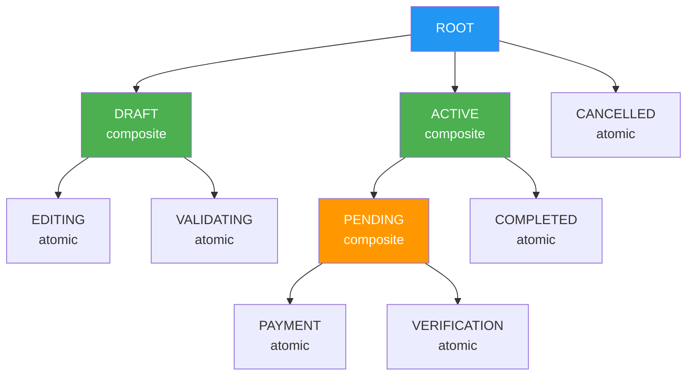

**Benefits**:

- **Reduced states**: Group related states, eliminate redundancy
- **Shared transitions**: Define common transitions once at parent level
- **Multiple views**: High-level (composite states) vs. detailed (atomic states)
- **Modularity**: Composite states can be designed and tested independently

## Composite States and Sub-States

### Terminology

- **Composite state**: A state containing one or more sub-states
- **Atomic state**: A leaf state with no sub-states (cannot be decomposed further)
- **Sub-state**: A state nested within a composite state
- **Default entry**: The initial sub-state when entering a composite state (marked with `[*]`)

### Example: Islamic Contract Lifecycle

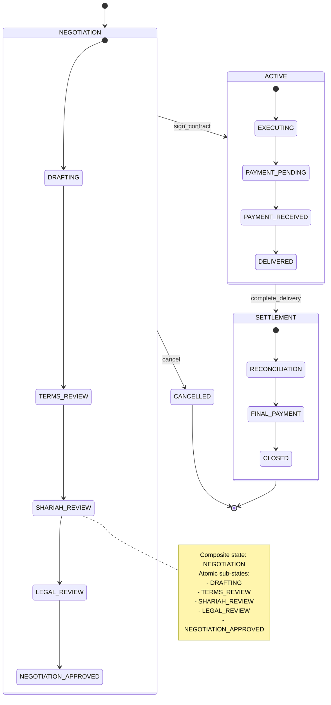

**Structure**:

- **Level 0 (root)**: NEGOTIATION, ACTIVE, SETTLEMENT, CANCELLED
- **Level 1 (NEGOTIATION sub-states)**: DRAFTING, TERMS_REVIEW, SHARIAH_REVIEW, LEGAL_REVIEW, NEGOTIATION_APPROVED
- **Level 1 (ACTIVE sub-states)**: EXECUTING, PAYMENT_PENDING, PAYMENT_RECEIVED, DELIVERED
- **Level 1 (SETTLEMENT sub-states)**: RECONCILIATION, FINAL_PAYMENT, CLOSED

### Shared Transitions

**Key benefit**: Define transition once at composite state level, applies to all sub-states.

**Example - Cancel from Anywhere in Negotiation**:

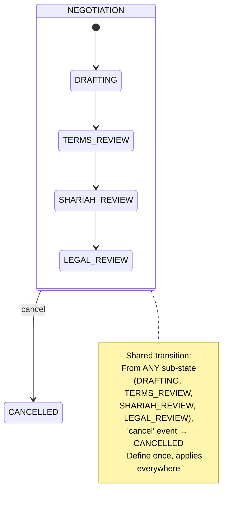

**Without hierarchy** (flat FSM):

```pseudocode
DRAFTING → CANCELLED (on cancel)
TERMS_REVIEW → CANCELLED (on cancel)
SHARIAH_REVIEW → CANCELLED (on cancel)
LEGAL_REVIEW → CANCELLED (on cancel)
// 4 redundant transition definitions!
```

**With hierarchy**:

```pseudocode
NEGOTIATION → CANCELLED (on cancel)
// 1 transition definition, applies to all 4 sub-states
```

## Entry and Exit Semantics in Hierarchies

### Execution Order Rules

When transitioning between hierarchical states, **entry and exit actions** execute in a specific order.

**Rule 1**: Exit from **innermost to outermost** (child → parent)

**Rule 2**: Enter from **outermost to innermost** (parent → child)

### Example: Transition Between Sibling Sub-States

**Scenario**: Transition from NEGOTIATION.DRAFTING → NEGOTIATION.TERMS_REVIEW

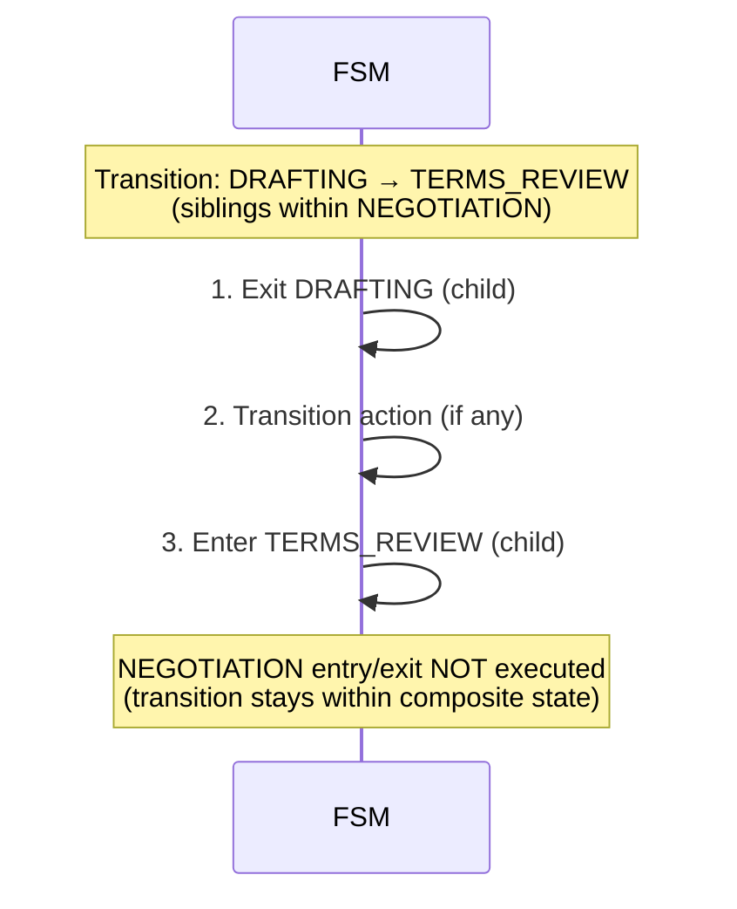

**Key insight**: When transitioning between siblings, **parent state entry/exit do NOT execute**.

### Example: Transition Between Different Composite States

**Scenario**: Transition from NEGOTIATION.LEGAL_REVIEW → ACTIVE.EXECUTING

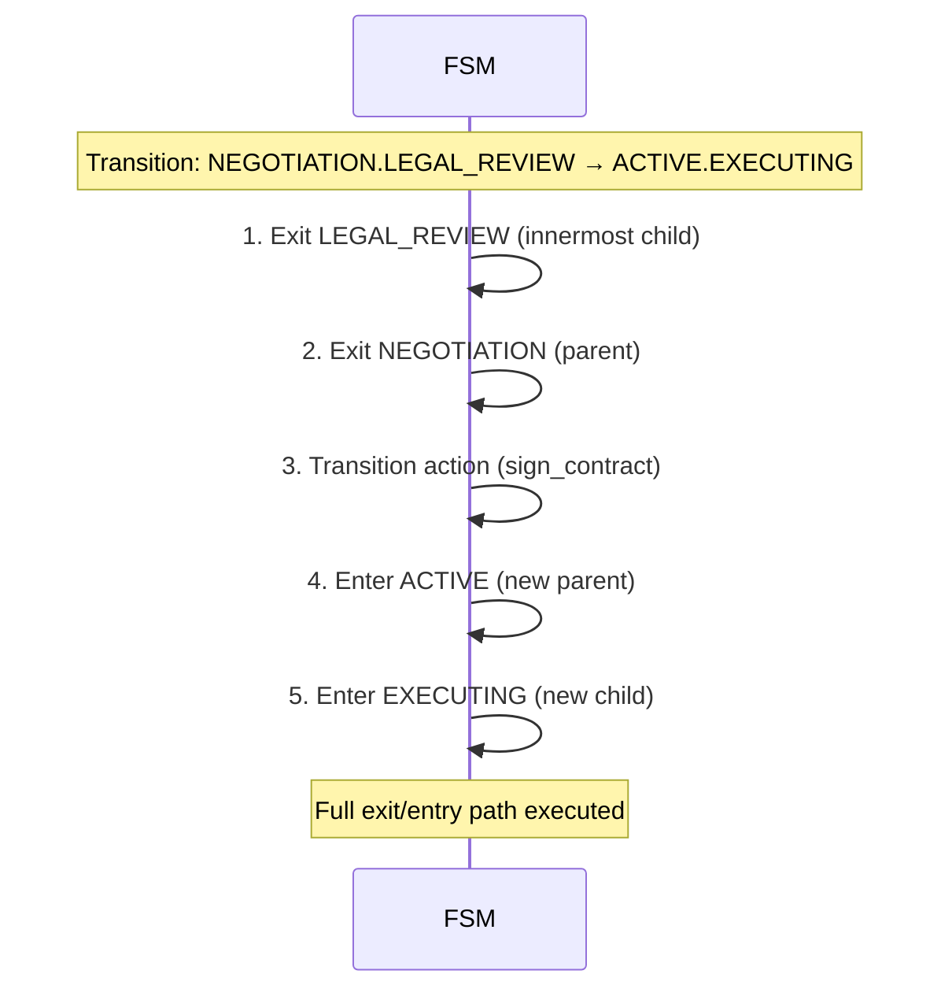

**Key insight**: When transitioning between composite states, **exit all ancestors, then enter all ancestors of target**.

### Pseudocode Example

```pseudocode
state NEGOTIATION:
  entry:
    log("Entered NEGOTIATION")
    initializeNegotiationWorkspace()

  exit:
    log("Exited NEGOTIATION")
    saveNegotiationHistory()

state DRAFTING (within NEGOTIATION):
  entry:
    log("Entered DRAFTING")
    createDraftDocument()

  exit:
    log("Exited DRAFTING")
    validateDraftContent()

state TERMS_REVIEW (within NEGOTIATION):
  entry:
    log("Entered TERMS_REVIEW")
    assignReviewer()

  exit:
    log("Exited TERMS_REVIEW")
    saveReviewComments()

// Transition 1: DRAFTING → TERMS_REVIEW (siblings)
on_event(submit_for_review):
  // Output:
  // "Exited DRAFTING"
  // validateDraftContent()
  // "Entered TERMS_REVIEW"
  // assignReviewer()
  // (NEGOTIATION entry/exit NOT called)

// Transition 2: TERMS_REVIEW → ACTIVE (different composites)
on_event(sign_contract):
  // Output:
  // "Exited TERMS_REVIEW"
  // saveReviewComments()
  // "Exited NEGOTIATION"
  // saveNegotiationHistory()
  // "Entered ACTIVE"
  // initializeActivePhase()
  // "Entered EXECUTING"
  // startContractExecution()
```

### Entry Point Variants

#### Default Entry (most common)

Composite state specifies **default initial sub-state** with `[*]`.

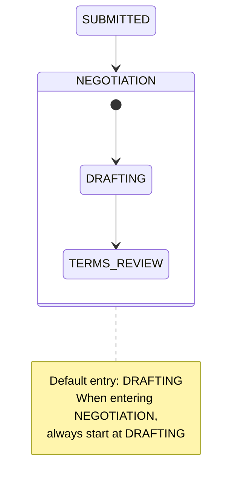

#### Explicit Entry (target specific sub-state)

Transition directly to a **specific sub-state**, bypassing default.

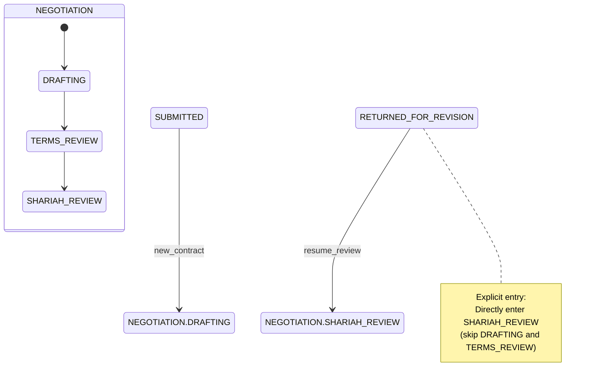

#### History Entry (remember last sub-state)

Composite state remembers **last active sub-state** and re-enters it. See **History States** section below.

## History States

### Problem: Resuming After Interruption

**Scenario**: User is in NEGOTIATION.SHARIAH_REVIEW, pauses to request additional documents, then resumes.

**Without history**:

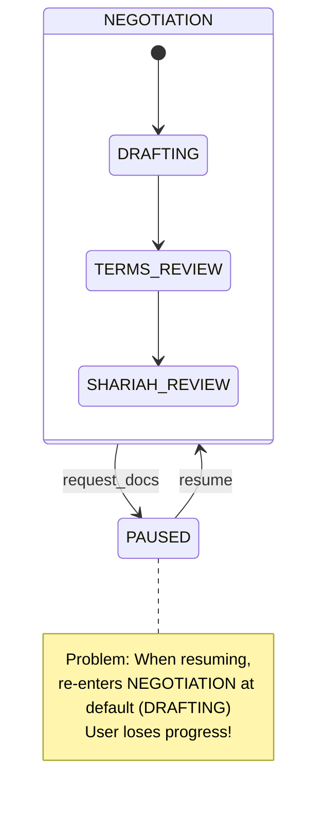

**With history**:

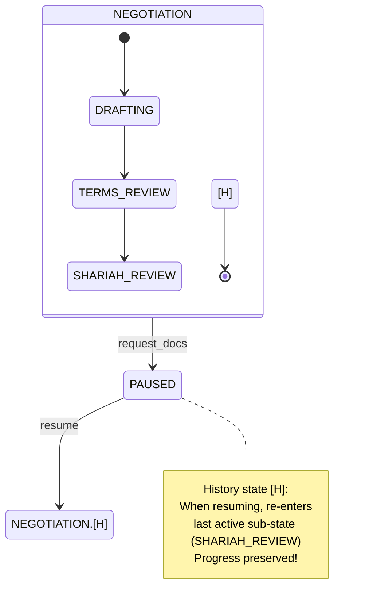

### Shallow History State

**Symbol**: `[H]` or `H*`

**Behavior**: Remember **direct child** sub-state, not nested grandchildren.

**Example**:

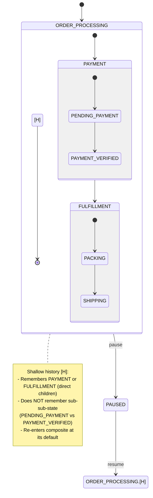

**Behavior**:

- If paused in PAYMENT.PAYMENT_VERIFIED → Resume to PAYMENT (default sub-state: PENDING_PAYMENT)
- If paused in FULFILLMENT.SHIPPING → Resume to FULFILLMENT (default sub-state: PACKING)

### Deep History State

**Symbol**: `[H*]` or `H**`

**Behavior**: Remember **entire sub-state path**, including nested children.

**Example**:

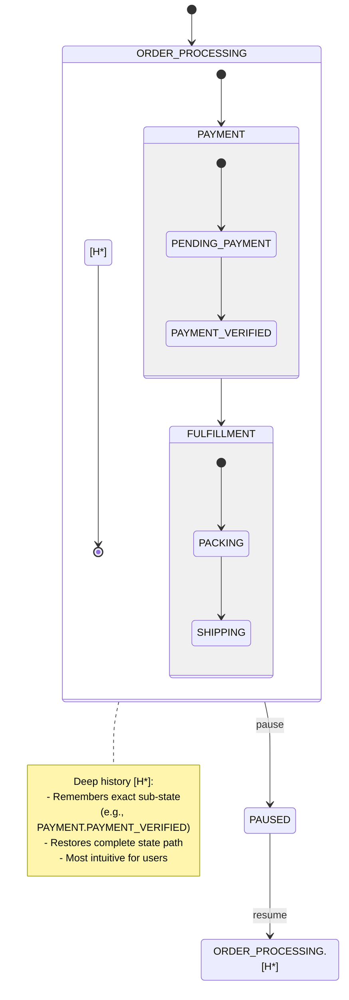

**Behavior**:

- If paused in PAYMENT.PAYMENT_VERIFIED → Resume to PAYMENT.PAYMENT_VERIFIED (exact state)
- If paused in FULFILLMENT.SHIPPING → Resume to FULFILLMENT.SHIPPING (exact state)

### When to Use History States

**Use shallow history when**:

- Remembering high-level phase is sufficient
- Sub-state details are transient
- Re-initialization of sub-state is acceptable

**Use deep history when**:

- User expects to resume exactly where they left off
- All sub-state progress must be preserved
- Typical for user-facing workflows (e.g., multi-step forms, campaign management)

**Example - Zakat Assessment with Deep History**:

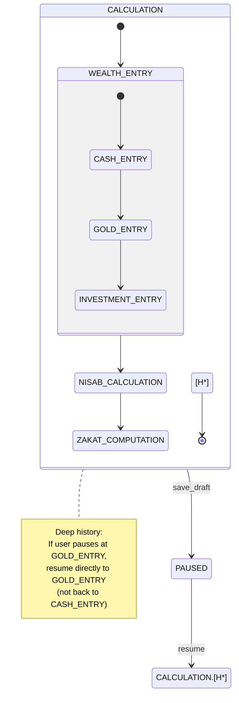

## Internal vs. External Transitions

### External Transition

**Behavior**: Exit source state, execute transition action, enter target state.

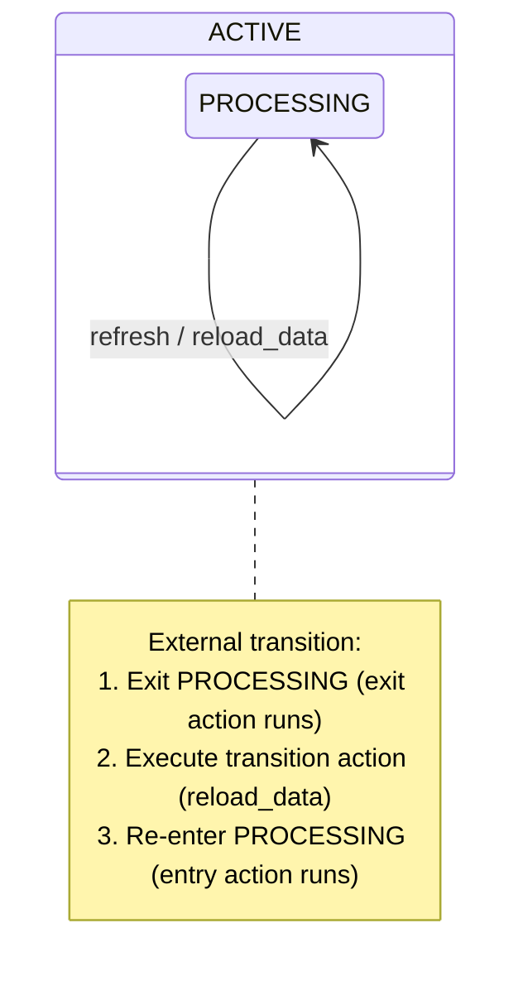

**When to use**: When you want to **reset the state** (re-run entry/exit actions).

### Internal Transition

**Behavior**: Handle event **without exiting/entering** state.

```mermaid
stateDiagram-v2
    state ACTIVE {
        ACTIVE : event / action
    }

    note right of ACTIVE
      Internal transition:
      - Handle event inside state
      - No exit action
      - No entry action
      - More efficient
    end note
```

**Example - Campaign with Internal Transition**:

```pseudocode
state ACTIVE:
  entry:
    log("Campaign activated")
    sendNotifications()
    initializeMetrics()

  exit:
    log("Campaign ended")
    archiveData()

  // Internal transition (no exit/entry)
  on record_donation(amount):
    context.totalRaised += amount
    context.donorCount += 1
    // No exit/entry actions - efficient!

  // External transition (exit/entry)
  on refresh_campaign:
    // Exits ACTIVE, then re-enters
    // Re-runs entry actions (reinitializeMetrics, etc.)
```

**When to use internal transitions**:

- **High-frequency events**: Recording donations, updating counters (don't want to re-run entry/exit)
- **Context updates**: Modifying data without changing state
- **Performance**: Avoid unnecessary entry/exit overhead

## Scope and Visibility in Nested States

### Variable Scope

**Context variables** can be scoped to different levels:

```pseudocode
state NEGOTIATION:
  // Variables scoped to NEGOTIATION
  context:
    negotiationId: UUID
    startDate: Date
    parties: List<Party>

  state SHARIAH_REVIEW (within NEGOTIATION):
    // Variables scoped to SHARIAH_REVIEW
    context:
      reviewerId: UUID
      shariahScore: Integer
      comments: String

    // Can access parent context
    function canApprove():
      return shariahScore >= 80 && parties.all(p => p.verified)
```

**Visibility rules**:

1. **Child states can access parent context**: SHARIAH_REVIEW can read `negotiationId`
2. **Parent states cannot access child context**: NEGOTIATION cannot read `shariahScore`
3. **Siblings cannot access each other's context**: SHARIAH_REVIEW cannot access LEGAL_REVIEW's variables

### Event Handling and Propagation

**Rule**: If a sub-state does not handle an event, it **propagates to parent**.

**Example**:

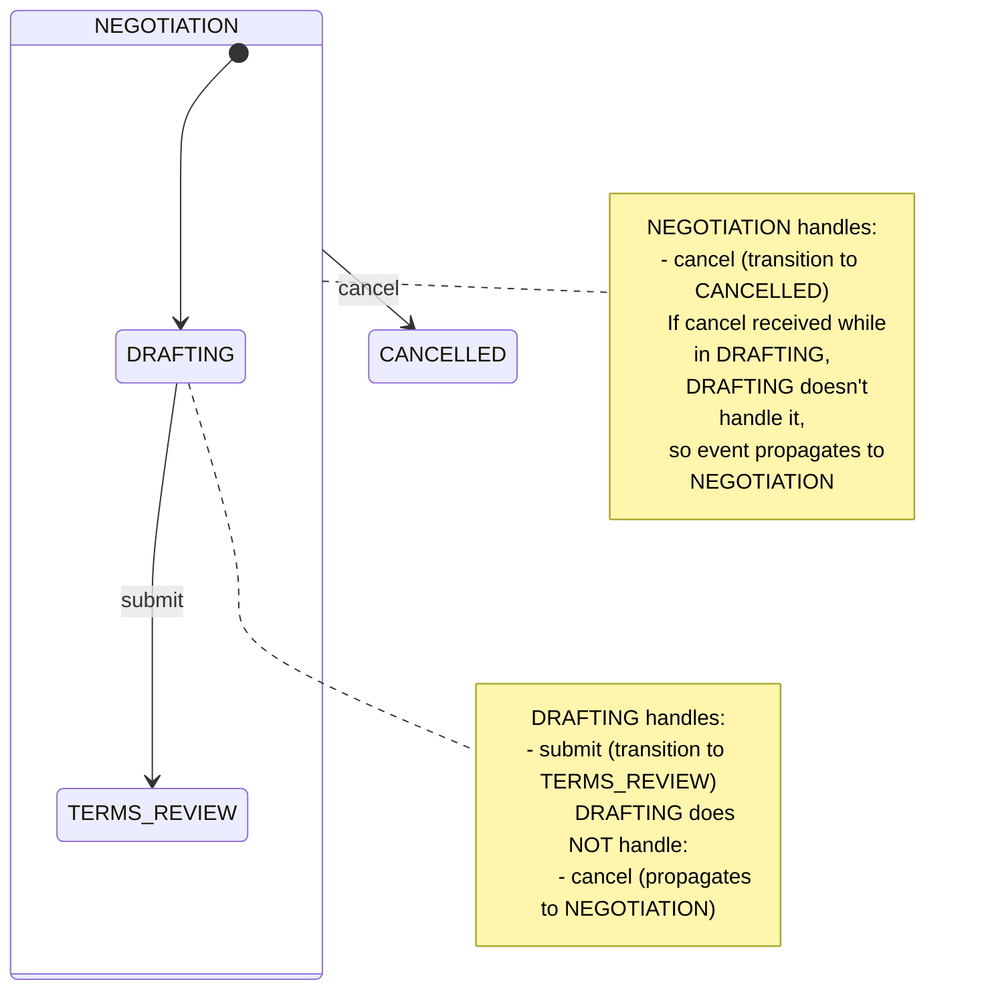

**Pseudocode**:

```pseudocode
state NEGOTIATION:
  on cancel:
    transition_to(CANCELLED)

  state DRAFTING (within NEGOTIATION):
    on submit:
      transition_to(TERMS_REVIEW)

    // No handler for 'cancel'
    // Event propagates to parent (NEGOTIATION)
```

**Benefits**:

- **Default behavior at parent**: Define common transitions once
- **Override in children**: Child can handle event differently if needed
- **Flexibility**: Each level can specialize behavior

## When to Nest vs. Flatten

### Indicators for Nesting (Use Hierarchy)

Use hierarchical states when:

1. **Related states share transitions**: Many states transition to the same target (e.g., `cancel` from all review states)
2. **Logical grouping**: States represent sub-phases of a larger phase (e.g., DRAFTING, TERMS_REVIEW, SHARIAH_REVIEW are all part of NEGOTIATION)
3. **Multiple abstraction levels needed**: Stakeholders need both high-level view (3 phases) and detailed view (15 sub-states)
4. **State explosion**: Flat FSM has 15+ states, many with redundant transitions
5. **Reusability**: A group of states could be reused in multiple contexts

### Indicators for Flattening (Avoid Hierarchy)

Keep FSM flat when:

1. **Simple lifecycle**: 3-7 states, clear linear progression
2. **No shared transitions**: Each state has unique transitions
3. **No natural grouping**: States don't cluster into logical phases
4. **Premature abstraction**: Hierarchy adds complexity without benefit
5. **Performance-critical**: Entry/exit overhead of hierarchy is too high (rare)

### Decision Matrix

| Aspect                 | Use Flat FSM            | Use Hierarchical FSM              |
| ---------------------- | ----------------------- | --------------------------------- |
| **State count**        | 3-7 states              | 8+ states                         |
| **Shared transitions** | Few or none             | Many (e.g., cancel, timeout)      |
| **Logical grouping**   | No natural clusters     | Clear phases/sub-phases           |
| **Abstraction levels** | Single level sufficient | Multiple levels needed            |
| **Redundancy**         | Minimal                 | High (many duplicate transitions) |
| **Complexity**         | Low                     | Medium to high                    |

### Refactoring Example: Flat → Hierarchical

**Before (Flat FSM - 12 states)**:

```
SUBMITTED
LEGAL_REVIEW_PENDING
LEGAL_REVIEW_APPROVED
SHARIAH_REVIEW_PENDING
SHARIAH_REVIEW_APPROVED
FINANCIAL_REVIEW_PENDING
FINANCIAL_REVIEW_APPROVED
MANAGER_APPROVAL_PENDING
MANAGER_APPROVED
DIRECTOR_APPROVAL_PENDING
DIRECTOR_APPROVED
REJECTED

// Each state has: REJECTED (on reject) - 11 redundant transitions!
```

**After (Hierarchical FSM - 8 states with 3 composites)**:

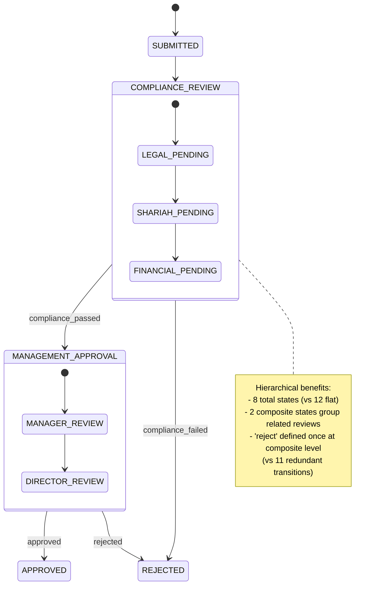

## OSE Domain Example: Comprehensive Zakat Lifecycle

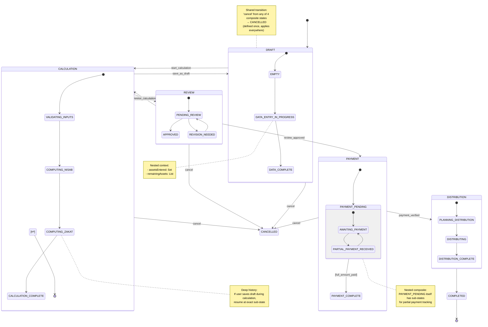

**Hierarchy structure**:

- **Level 0**: DRAFT, CALCULATION, REVIEW, PAYMENT, DISTRIBUTION, COMPLETED, CANCELLED
- **Level 1 (DRAFT)**: EMPTY, DATA_ENTRY_IN_PROGRESS, DATA_COMPLETE
- **Level 1 (CALCULATION)**: VALIDATING_INPUTS, COMPUTING_NISAB, COMPUTING_ZAKAT, CALCULATION_COMPLETE (with deep history)
- **Level 1 (REVIEW)**: PENDING_REVIEW, APPROVED, REVISION_NEEDED
- **Level 1 (PAYMENT)**: PAYMENT_PENDING (composite), PAYMENT_COMPLETE
- **Level 2 (PAYMENT_PENDING)**: AWAITING_PAYMENT, PARTIAL_PAYMENT_RECEIVED
- **Level 1 (DISTRIBUTION)**: PLANNING_DISTRIBUTION, DISTRIBUTING, DISTRIBUTION_COMPLETE

**Total states**: 22 atomic states organized into 6 composite states

**Without hierarchy**: Would need 22+ states at flat level with many redundant `cancel` transitions

## Cross-References

### Software Engineering Principles

- [Simplicity Over Complexity](../../../../../governance/principles/general/simplicity-over-complexity.md) - Start flat, add hierarchy only when needed; composite states enable modular design

### Related FSM Topics

- [FSM Types and Classifications](ex-so-ar-fistmafs__03-fsm-types-and-classifications.md) - Introduction to hierarchical FSMs
- [State Explosion and Mitigation](ex-so-ar-fistmafs__04-state-explosion-and-mitigation.md) - Hierarchy as mitigation strategy
- [Events, Guards, and Actions](ex-so-ar-fistmafs__06-events-guards-and-actions.md) - Event propagation in hierarchies
- [Decision Trees and Guidelines](ex-so-ar-fistmafs__16-decision-trees-and-guidelines.md) - When to use hierarchy

### Architecture Documentation

- [DDD Aggregates](../domain-driven-design-ddd/ex-so-ar-dodrdedd__09-aggregates.md) - Hierarchical FSMs model aggregate lifecycle

### Templates

- [Hierarchical State Machine Diagram](./templates/ex-so-ar-fsm-te__hierarchical-state-machine-diagram.md) - Template for nested state diagrams
- [State Machine Specification](./templates/ex-so-ar-fsm-te__state-machine-specification.md) - Document hierarchical structure

## Next Steps

1. **Learn transition mechanics**: Read [Events, Guards, and Actions](ex-so-ar-fistmafs__06-events-guards-and-actions.md)
2. **Study design patterns**: Read [Design Patterns and Best Practices](ex-so-ar-fistmafs__07-design-patterns-and-best-practices.md)
3. **Choose implementation approach**: Read paradigm-specific chapters (08-11)
4. **Design your FSM**: Use [Hierarchical State Machine Diagram](./templates/ex-so-ar-fsm-te__hierarchical-state-machine-diagram.md) template

## Summary

**Hierarchical State Machines** extend flat FSMs with nested states, providing:

1. **Composite states**: States containing sub-states, organized in tree structure
2. **Entry/exit semantics**: Exit innermost→outermost, enter outermost→innermost
3. **Shared transitions**: Define once at parent, applies to all children
4. **History states**: Shallow `[H]` (direct child) vs. deep `[H*]` (full path)
5. **Internal transitions**: Handle events without exiting/entering (efficient)
6. **Event propagation**: Unhandled events propagate to parent
7. **Scope and visibility**: Children access parent context, not vice versa

**When to use hierarchy**:

- 8+ states with logical grouping
- Many shared transitions (e.g., cancel, timeout)
- Multiple abstraction levels needed

**When to keep flat**:

- 3-7 states, simple linear progression
- Few shared transitions
- No natural grouping

Hierarchical FSMs are essential for managing complexity in enterprise systems while maintaining clarity and maintainability.
