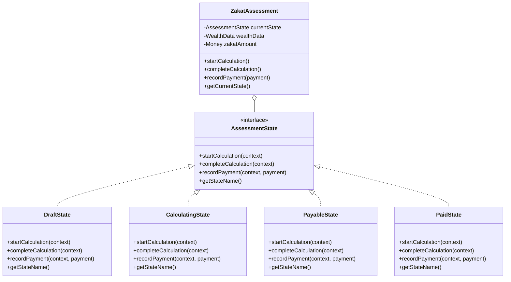
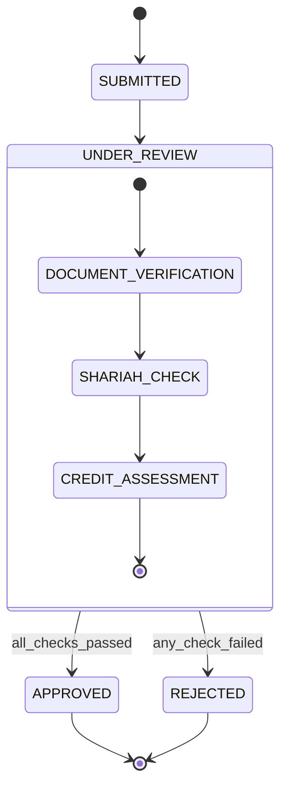

# OOP Implementation Patterns

Object-oriented programming provides several patterns for implementing finite state machines, each with distinct trade-offs in terms of flexibility, type safety, and complexity. This document explores OOP-specific FSM implementation patterns with language-agnostic examples that translate to Java, TypeScript, C#, Python, and other OO languages.

## Pattern 1: State Pattern (Gang of Four)

The State Pattern is the canonical OOP approach to FSM implementation, using polymorphism to encapsulate state-specific behavior.

### Structure

```
Context Class:
  - Holds reference to current State object
  - Delegates behavior to current State
  - Provides methods for state transitions

State Interface/Abstract Class:
  - Defines interface for all state-specific behaviors
  - Declares methods for event handling

Concrete State Classes:
  - Implement state-specific behavior
  - Define transition logic
  - Return next state (or trigger Context state change)
```

### Class Diagram



### Implementation Example

**Context Class**:

```
class ZakatAssessment {
  private currentState: AssessmentState;
  private wealthData: WealthData;
  private zakatAmount: Money;
  private id: string;

  constructor(id: string) {
    this.id = id;
    this.currentState = new DraftState();
    this.wealthData = new WealthData();
    this.zakatAmount = Money.zero();
  }

  // Event handlers (delegate to current state)
  startCalculation(): void {
    this.currentState = this.currentState.startCalculation(this);
  }

  completeCalculation(): void {
    this.currentState = this.currentState.completeCalculation(this);
  }

  recordPayment(payment: Payment): void {
    this.currentState = this.currentState.recordPayment(this, payment);
  }

  // Getters and setters
  getWealthData(): WealthData {
    return this.wealthData;
  }

  setWealthData(data: WealthData): void {
    this.wealthData = data;
  }

  getZakatAmount(): Money {
    return this.zakatAmount;
  }

  setZakatAmount(amount: Money): void {
    this.zakatAmount = amount;
  }

  getCurrentStateName(): string {
    return this.currentState.getStateName();
  }
}
```

**State Interface**:

```
interface AssessmentState {
  startCalculation(context: ZakatAssessment): AssessmentState;
  completeCalculation(context: ZakatAssessment): AssessmentState;
  recordPayment(context: ZakatAssessment, payment: Payment): AssessmentState;
  getStateName(): string;
}
```

**Concrete State: DraftState**:

```
class DraftState implements AssessmentState {
  startCalculation(context: ZakatAssessment): AssessmentState {
    // Guard: wealth data must be complete
    if (!context.getWealthData().isComplete()) {
      throw new InvalidStateTransitionError(
        "Cannot start calculation without complete wealth data"
      );
    }

    // Transition action
    logger.info(`Starting Zakat calculation for ${context.getId()}`);

    // Return next state
    return new CalculatingState();
  }

  completeCalculation(context: ZakatAssessment): AssessmentState {
    // Invalid transition from DRAFT
    throw new InvalidStateTransitionError(
      "Cannot complete calculation from DRAFT state"
    );
  }

  recordPayment(context: ZakatAssessment, payment: Payment): AssessmentState {
    // Invalid transition from DRAFT
    throw new InvalidStateTransitionError(
      "Cannot record payment in DRAFT state"
    );
  }

  getStateName(): string {
    return "DRAFT";
  }
}
```

**Concrete State: CalculatingState**:

```
class CalculatingState implements AssessmentState {
  startCalculation(context: ZakatAssessment): AssessmentState {
    // Invalid transition (already calculating)
    throw new InvalidStateTransitionError(
      "Calculation already in progress"
    );
  }

  completeCalculation(context: ZakatAssessment): AssessmentState {
    // Business logic: calculate Zakat
    let wealthData = context.getWealthData();
    let zakatAmount = zakatCalculationService.calculate(wealthData);

    // Update context
    context.setZakatAmount(zakatAmount);

    // Guard: determine next state based on result
    if (zakatAmount.isPositive()) {
      logger.info(`Zakat calculated: ${zakatAmount}`);
      return new PayableState();
    } else {
      logger.info("Zakat not due (below nisab threshold)");
      return new ExemptState();
    }
  }

  recordPayment(context: ZakatAssessment, payment: Payment): AssessmentState {
    // Invalid transition from CALCULATING
    throw new InvalidStateTransitionError(
      "Cannot record payment while calculation in progress"
    );
  }

  getStateName(): string {
    return "CALCULATING";
  }
}
```

**Concrete State: PayableState**:

```
class PayableState implements AssessmentState {
  startCalculation(context: ZakatAssessment): AssessmentState {
    // Recalculation allowed
    logger.info("Recalculating Zakat (wealth data changed)");
    return new CalculatingState();
  }

  completeCalculation(context: ZakatAssessment): AssessmentState {
    // Invalid transition (already calculated)
    throw new InvalidStateTransitionError(
      "Calculation already complete"
    );
  }

  recordPayment(context: ZakatAssessment, payment: Payment): AssessmentState {
    // Guard: payment must match zakat amount
    if (!payment.getAmount().equals(context.getZakatAmount())) {
      throw new InvalidPaymentError(
        `Payment amount ${payment.getAmount()} does not match ` +
        `Zakat due ${context.getZakatAmount()}`
      );
    }

    // Transition action: record payment
    paymentService.recordPayment(context.getId(), payment);
    logger.info(`Payment recorded: ${payment.getAmount()}`);

    // Return next state
    return new PaidState();
  }

  getStateName(): string {
    return "PAYABLE";
  }
}
```

### Advantages

- **Clear separation**: Each state's behavior is encapsulated in its own class
- **Open/Closed Principle**: Adding new states doesn't modify existing states
- **Type safety**: Compile-time checking of state transitions
- **Testability**: Each state class can be tested independently

### Disadvantages

- **Class proliferation**: One class per state (can be many classes)
- **Context coupling**: State classes often need access to context internals
- **Transition logic scattered**: Transition logic spread across state classes

### When to Use

- Complex state-specific behavior
- States with significantly different implementations
- Strong type safety required
- Object-oriented codebase with good class hierarchy support

## Pattern 2: Enum-Based State Machine

The Enum-Based pattern uses enumerated types for states and centralized transition logic.

### Structure

```
Enum: State
  - DRAFT
  - CALCULATING
  - PAYABLE
  - PAID
  - ...

Context Class:
  - currentState: State (enum)
  - Centralized transition logic (switch/case or map)

Event Handlers:
  - Check current state
  - Apply guard conditions
  - Execute actions
  - Update state
```

### Implementation Example

**State Enum**:

```
enum AssessmentState {
  DRAFT,
  CALCULATING,
  PAYABLE,
  EXEMPT,
  PAID,
  CANCELLED
}
```

**Context with Centralized Logic**:

```
class ZakatAssessment {
  private id: string;
  private currentState: AssessmentState;
  private wealthData: WealthData;
  private zakatAmount: Money;

  constructor(id: string) {
    this.id = id;
    this.currentState = AssessmentState.DRAFT;
    this.wealthData = new WealthData();
    this.zakatAmount = Money.zero();
  }

  startCalculation(): void {
    switch (this.currentState) {
      case AssessmentState.DRAFT:
        // Guard
        if (!this.wealthData.isComplete()) {
          throw new InvalidStateTransitionError(
            "Wealth data incomplete"
          );
        }

        // Transition action
        logger.info(`Starting calculation for ${this.id}`);

        // State change
        this.currentState = AssessmentState.CALCULATING;
        break;

      case AssessmentState.PAYABLE:
        // Recalculation allowed
        logger.info(`Recalculating for ${this.id}`);
        this.currentState = AssessmentState.CALCULATING;
        break;

      default:
        throw new InvalidStateTransitionError(
          `Cannot start calculation from ${this.currentState}`
        );
    }
  }

  completeCalculation(): void {
    switch (this.currentState) {
      case AssessmentState.CALCULATING:
        // Business logic
        this.zakatAmount = zakatCalculationService.calculate(this.wealthData);

        // Guard-based transition
        if (this.zakatAmount.isPositive()) {
          logger.info(`Zakat calculated: ${this.zakatAmount}`);
          this.currentState = AssessmentState.PAYABLE;
        } else {
          logger.info("Zakat not due");
          this.currentState = AssessmentState.EXEMPT;
        }
        break;

      default:
        throw new InvalidStateTransitionError(
          `Cannot complete calculation from ${this.currentState}`
        );
    }
  }

  recordPayment(payment: Payment): void {
    switch (this.currentState) {
      case AssessmentState.PAYABLE:
        // Guard
        if (!payment.getAmount().equals(this.zakatAmount)) {
          throw new InvalidPaymentError("Payment amount mismatch");
        }

        // Transition action
        paymentService.recordPayment(this.id, payment);
        logger.info(`Payment recorded: ${payment.getAmount()}`);

        // State change
        this.currentState = AssessmentState.PAID;
        break;

      default:
        throw new InvalidStateTransitionError(
          `Cannot record payment from ${this.currentState}`
        );
    }
  }

  getCurrentState(): AssessmentState {
    return this.currentState;
  }
}
```

### Advantages

- **Simplicity**: Single class, easy to understand
- **Centralized transitions**: All transition logic in one place
- **Performance**: No polymorphic dispatch overhead
- **Easy to visualize**: State transitions visible in one location

### Disadvantages

- **Large switch statements**: Can become unwieldy with many states
- **Duplication**: Similar logic repeated across event handlers
- **Less encapsulation**: All logic exposed in context class
- **Harder to extend**: Adding states requires modifying multiple methods

### When to Use

- Simple state machines (3-8 states)
- States with similar behavior patterns
- Performance-critical applications
- Small, focused domains

## Pattern 3: Builder Pattern for FSM Construction

The Builder Pattern creates a fluent API for defining FSM structure, separating definition from execution.

### Structure

```
Builder Class:
  - Fluent API methods for defining states, transitions, guards, actions
  - Produces FSM instance

FSM Class:
  - Executes transitions based on builder configuration
  - Maintains current state
  - Processes events
```

### Implementation Example

**FSM Builder**:

```
class FSMBuilder<TState, TEvent, TContext> {
  private states: Map<TState, StateConfig>;
  private initialState: TState;

  constructor() {
    this.states = new Map();
  }

  withInitialState(state: TState): FSMBuilder<TState, TEvent, TContext> {
    this.initialState = state;
    return this;
  }

  addState(state: TState): StateBuilder<TState, TEvent, TContext> {
    let stateConfig = new StateConfig(state);
    this.states.set(state, stateConfig);
    return new StateBuilder(this, stateConfig);
  }

  build(): FSM<TState, TEvent, TContext> {
    if (!this.initialState) {
      throw new Error("Initial state not defined");
    }
    return new FSM(this.states, this.initialState);
  }
}

class StateBuilder<TState, TEvent, TContext> {
  private builder: FSMBuilder<TState, TEvent, TContext>;
  private stateConfig: StateConfig;

  constructor(
    builder: FSMBuilder<TState, TEvent, TContext>,
    stateConfig: StateConfig
  ) {
    this.builder = builder;
    this.stateConfig = stateConfig;
  }

  onEntry(action: (context: TContext) => void): StateBuilder {
    this.stateConfig.entryActions.push(action);
    return this;
  }

  onExit(action: (context: TContext) => void): StateBuilder {
    this.stateConfig.exitActions.push(action);
    return this;
  }

  on(event: TEvent): TransitionBuilder<TState, TEvent, TContext> {
    let transition = new TransitionConfig(event);
    this.stateConfig.transitions.push(transition);
    return new TransitionBuilder(this, transition);
  }

  done(): FSMBuilder<TState, TEvent, TContext> {
    return this.builder;
  }
}

class TransitionBuilder<TState, TEvent, TContext> {
  private stateBuilder: StateBuilder<TState, TEvent, TContext>;
  private transition: TransitionConfig;

  constructor(
    stateBuilder: StateBuilder<TState, TEvent, TContext>,
    transition: TransitionConfig
  ) {
    this.stateBuilder = stateBuilder;
    this.transition = transition;
  }

  guard(predicate: (context: TContext) => boolean): TransitionBuilder {
    this.transition.guard = predicate;
    return this;
  }

  action(action: (context: TContext) => void): TransitionBuilder {
    this.transition.action = action;
    return this;
  }

  target(targetState: TState): StateBuilder<TState, TEvent, TContext> {
    this.transition.targetState = targetState;
    return this.stateBuilder;
  }
}
```

**FSM Execution Engine**:

```
class FSM<TState, TEvent, TContext> {
  private states: Map<TState, StateConfig>;
  private currentState: TState;
  private context: TContext;

  constructor(states: Map<TState, StateConfig>, initialState: TState) {
    this.states = states;
    this.currentState = initialState;
  }

  setContext(context: TContext): void {
    this.context = context;
  }

  handle(event: TEvent): void {
    let stateConfig = this.states.get(this.currentState);
    if (!stateConfig) {
      throw new Error(`State ${this.currentState} not configured`);
    }

    // Find matching transition
    let transition = stateConfig.transitions.find(t =>
      t.event === event &&
      (!t.guard || t.guard(this.context))
    );

    if (!transition) {
      throw new InvalidStateTransitionError(
        `No valid transition for event ${event} in state ${this.currentState}`
      );
    }

    // Execute transition
    this.executeTransition(stateConfig, transition);
  }

  private executeTransition(
    sourceConfig: StateConfig,
    transition: TransitionConfig
  ): void {
    // 1. Execute exit actions
    sourceConfig.exitActions.forEach(action => action(this.context));

    // 2. Execute transition action
    if (transition.action) {
      transition.action(this.context);
    }

    // 3. Update state
    this.currentState = transition.targetState;

    // 4. Execute entry actions
    let targetConfig = this.states.get(this.currentState);
    targetConfig.entryActions.forEach(action => action(this.context));
  }

  getCurrentState(): TState {
    return this.currentState;
  }
}
```

**Usage Example: Zakat Assessment FSM**:

```
enum State {
  DRAFT, CALCULATING, PAYABLE, EXEMPT, PAID
}

enum Event {
  START_CALCULATION, CALCULATION_COMPLETE, RECORD_PAYMENT
}

class AssessmentContext {
  wealthData: WealthData;
  zakatAmount: Money;
  // ... other fields
}

let fsm = new FSMBuilder<State, Event, AssessmentContext>()
  .withInitialState(State.DRAFT)

  .addState(State.DRAFT)
    .onEntry(ctx => logger.info("Entered DRAFT state"))
    .on(Event.START_CALCULATION)
      .guard(ctx => ctx.wealthData.isComplete())
      .action(ctx => logger.info("Starting calculation"))
      .target(State.CALCULATING)
    .done()

  .addState(State.CALCULATING)
    .onEntry(ctx => {
      ctx.zakatAmount = zakatCalculationService.calculate(ctx.wealthData);
    })
    .on(Event.CALCULATION_COMPLETE)
      .guard(ctx => ctx.zakatAmount.isPositive())
      .target(State.PAYABLE)
    .on(Event.CALCULATION_COMPLETE)
      .guard(ctx => !ctx.zakatAmount.isPositive())
      .target(State.EXEMPT)
    .done()

  .addState(State.PAYABLE)
    .onEntry(ctx => logger.info(`Zakat due: ${ctx.zakatAmount}`))
    .on(Event.RECORD_PAYMENT)
      .action(ctx => paymentService.record(ctx))
      .target(State.PAID)
    .done()

  .addState(State.PAID)
    .onEntry(ctx => logger.info("Payment recorded"))
    .done()

  .build();

// Usage
let context = new AssessmentContext();
context.wealthData = loadWealthData();
fsm.setContext(context);

fsm.handle(Event.START_CALCULATION);
fsm.handle(Event.CALCULATION_COMPLETE);
fsm.handle(Event.RECORD_PAYMENT);
```

### Advantages

- **Declarative**: FSM structure clearly visible
- **Fluent API**: Easy to read and write
- **Separation of concerns**: Definition separate from execution
- **Reusability**: Builder can create multiple FSM instances

### Disadvantages

- **Complexity**: Requires builder infrastructure
- **Runtime errors**: Configuration errors caught at runtime, not compile-time
- **Learning curve**: Developers must learn fluent API

### When to Use

- Complex FSMs with many states and transitions
- When FSM definition should be data-driven or configuration-based
- When multiple similar FSMs need to be created
- When FSM structure must be inspected or visualized

## Pattern 4: Hierarchical State Classes

Hierarchical State Pattern uses class inheritance to model state hierarchies.

### Structure

```
Abstract Base State:
  - Common behavior for all states

Composite State (extends Base State):
  - Contains sub-states
  - Delegates to active sub-state

Leaf States (extend Composite State):
  - Specific state behavior
```

### Implementation Example

**OSE Example: Loan Application with Hierarchical States**:



**Implementation**:

```
abstract class LoanApplicationState {
  abstract handle(event: Event, context: LoanContext): LoanApplicationState;
  abstract getStateName(): string;
}

class CompositeState extends LoanApplicationState {
  protected currentSubState: LoanApplicationState;

  handle(event: Event, context: LoanContext): LoanApplicationState {
    // Delegate to sub-state
    let nextSubState = this.currentSubState.handle(event, context);

    if (nextSubState === this.currentSubState) {
      // No sub-state change
      return this;
    } else if (this.isSubStateOf(nextSubState)) {
      // Sub-state transition
      this.currentSubState = nextSubState;
      return this;
    } else {
      // Exiting composite state
      return nextSubState;
    }
  }

  protected abstract isSubStateOf(state: LoanApplicationState): boolean;
}

class UnderReviewState extends CompositeState {
  constructor() {
    super();
    this.currentSubState = new DocumentVerificationState();
  }

  protected isSubStateOf(state: LoanApplicationState): boolean {
    return (
      state instanceof DocumentVerificationState ||
      state instanceof ShariahCheckState ||
      state instanceof CreditAssessmentState
    );
  }

  getStateName(): string {
    return `UNDER_REVIEW.${this.currentSubState.getStateName()}`;
  }
}

class DocumentVerificationState extends LoanApplicationState {
  handle(event: Event, context: LoanContext): LoanApplicationState {
    if (event.type === "documents_verified") {
      if (context.documentsComplete) {
        return new ShariahCheckState();
      } else {
        return new RejectedState("Incomplete documents");
      }
    }
    return this;
  }

  getStateName(): string {
    return "DOCUMENT_VERIFICATION";
  }
}
```

### Advantages

- **Natural hierarchy**: Inheritance models state hierarchy naturally
- **Code reuse**: Common behavior in base classes
- **Entry/exit semantics**: Hierarchical entry/exit actions via constructors/finalizers

### Disadvantages

- **Tight coupling**: Inheritance creates coupling between states
- **Limited flexibility**: Hard to change hierarchy at runtime
- **Complexity**: Deep hierarchies can be hard to understand

### When to Use

- Clear state hierarchies with shared behavior
- States with inheritance relationships
- When entry/exit semantics must cascade through hierarchy

## Cross-References

- [Core Concepts and Terminology](ex-so-ar-fistmafs__02-core-concepts-and-terminology.md): FSM fundamentals
- [Design Patterns and Best Practices](ex-so-ar-fistmafs__07-design-patterns-and-best-practices.md): State Pattern details
- [FP Implementation Patterns](ex-so-ar-fistmafs__09-fp-implementation-patterns.md): Functional programming alternative
- [Testing FSM Implementations](ex-so-ar-fistmafs__12-testing-fsm-implementations.md): Testing OOP FSMs
- [DDD Aggregates](../domain-driven-design-ddd/ex-so-ar-dodrdedd__09-aggregates.md): FSM in DDD entities

## Related Principles

- [Explicit Over Implicit](../../../../../governance/principles/software-engineering/explicit-over-implicit.md): Explicit state transitions and behavior
- [Automation Over Manual](../../../../../governance/principles/software-engineering/automation-over-manual.md): Builder pattern automates FSM construction
- [Reproducibility First](../../../../../governance/principles/software-engineering/reproducibility.md): Consistent state machine behavior across environments

## Next Steps

1. **Compare with FP**: [FP Implementation Patterns](ex-so-ar-fistmafs__09-fp-implementation-patterns.md)
2. **Choose a framework**: [Spring State Machine & XState](ex-so-ar-fistmafs__13-framework-spring-state-machine-xstate.md)
3. **Test your implementation**: [Testing FSM Implementations](ex-so-ar-fistmafs__12-testing-fsm-implementations.md)
4. **Integrate with DDD**: [Integration with DDD and Architecture](ex-so-ar-fistmafs__19-integration-with-ddd-and-architecture.md)
