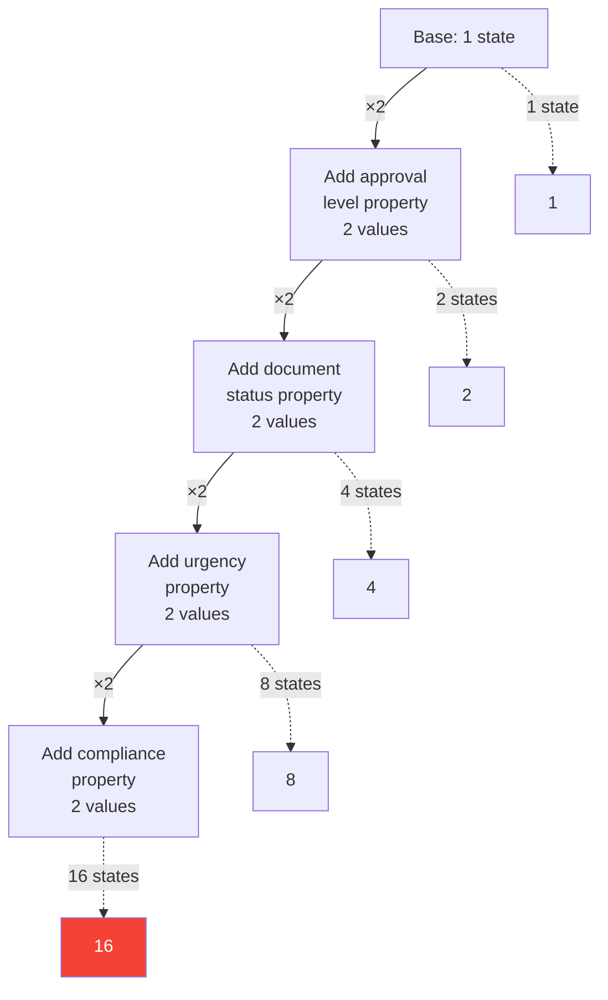
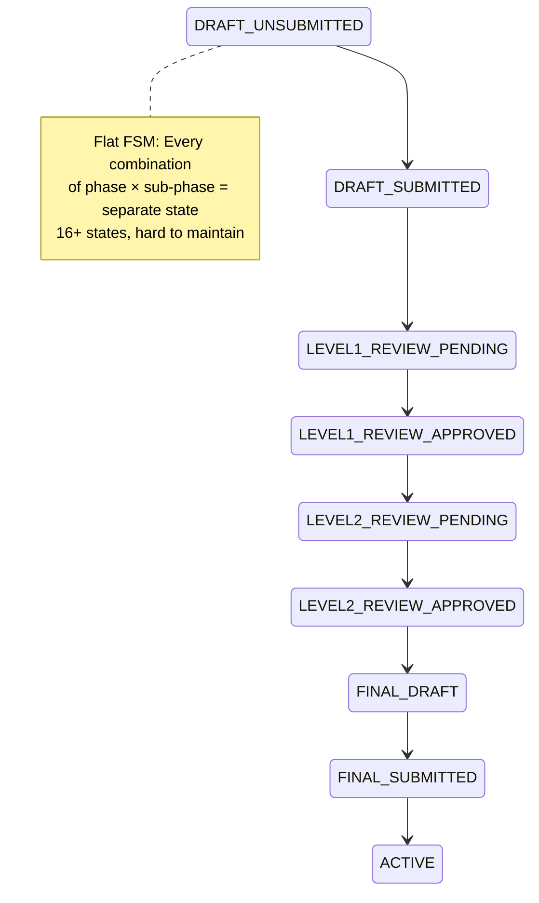
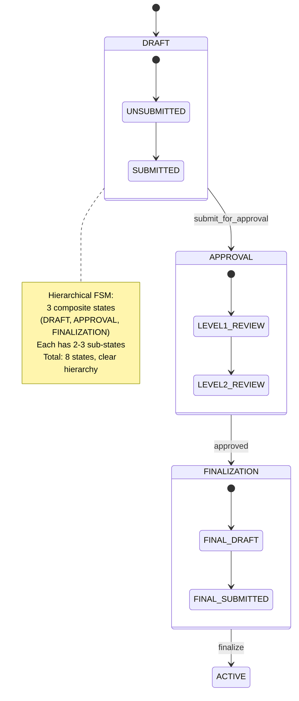
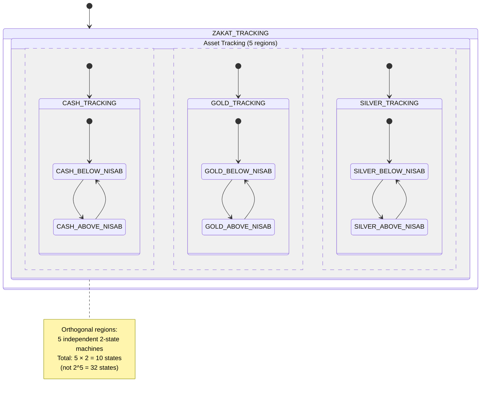
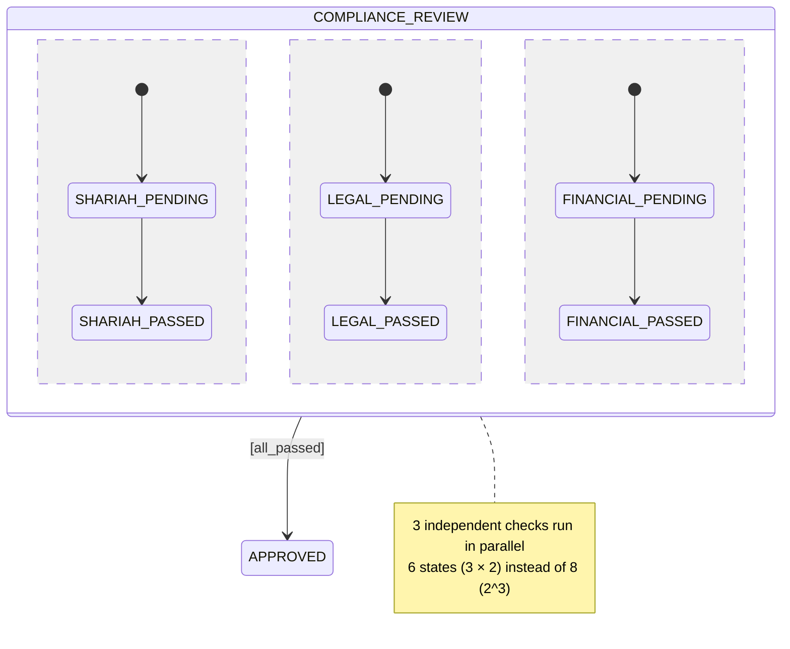
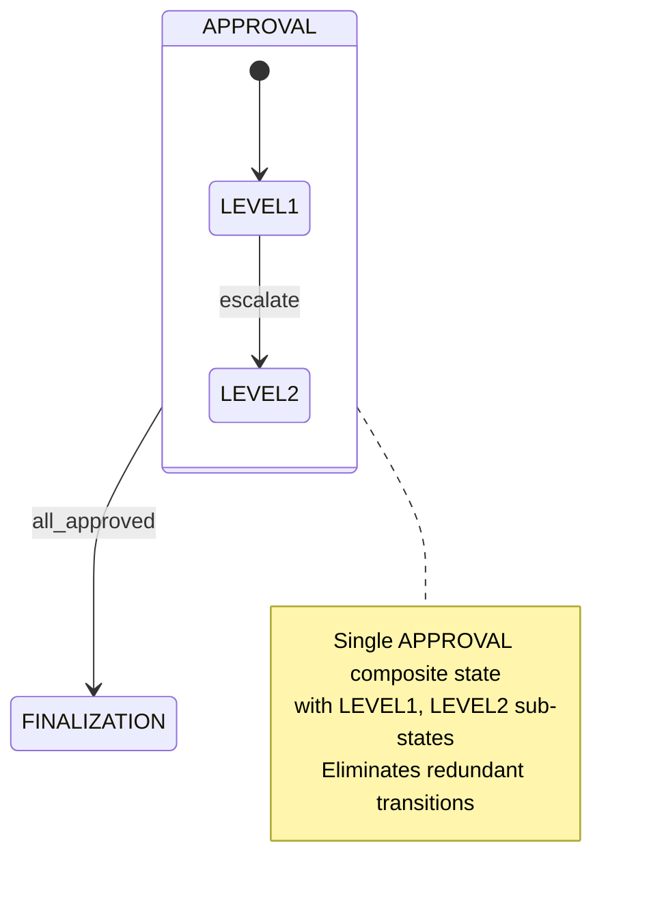

# State Explosion and Mitigation

**State explosion** is one of the most critical challenges in FSM design. This document explains the problem, how to recognize it, and proven strategies to mitigate it while maintaining FSM clarity and maintainability.

## What is State Explosion?

### Definition

**State explosion** occurs when the number of states grows **exponentially** as you model additional dimensions or conditions, making the FSM unmanageable.

**Mathematical expression**:

```
If system has N independent boolean properties:
  Number of states = 2^N

If system has N independent properties with M values each:
  Number of states = M^N
```

### Simple Example: Contract with Approval Levels

**Naive approach** - Create separate state for each combination:

```
Contract states without mitigation:
  - PENDING_LEVEL1_DRAFT
  - PENDING_LEVEL1_REVIEWED
  - PENDING_LEVEL2_DRAFT
  - PENDING_LEVEL2_REVIEWED
  - APPROVED_LEVEL1_DRAFT
  - APPROVED_LEVEL1_REVIEWED
  - APPROVED_LEVEL2_DRAFT
  - APPROVED_LEVEL2_REVIEWED

2 approval levels × 2 document statuses = 4 states
3 approval levels × 2 document statuses = 6 states
4 approval levels × 2 document statuses = 8 states
N approval levels × M document statuses = N × M states
```

**Add urgency flag**:

```
4 approval levels × 2 document statuses × 2 urgency levels = 16 states!
```

**Add compliance status**:

```
4 approval levels × 2 document statuses × 2 urgency × 2 compliance = 32 states!
```

This is **state explosion** - combinatorial growth that becomes unmanageable.

### Visualizing State Explosion



**Problem severity**:

- **4 dimensions**: 16 states
- **5 dimensions**: 32 states
- **6 dimensions**: 64 states
- **10 dimensions**: 1,024 states (unmanageable)

## Calculating State Space Complexity

### Formula 1: Independent Boolean Properties

If you have **N independent boolean conditions**:

```
Total states = 2^N
```

**Example - Zakat Assessment**:

- Has wealth data entered? (yes/no)
- Above nisab threshold? (yes/no)
- Payment recorded? (yes/no)
- Payment verified? (yes/no)

```
4 boolean properties → 2^4 = 16 possible states
```

### Formula 2: Independent Multi-Valued Properties

If you have **N independent properties** with **M₁, M₂, ..., Mₙ values** each:

```
Total states = M₁ × M₂ × ... × Mₙ
```

**Example - Contract**:

- Approval level: {Level1, Level2, Level3, Level4} = 4 values
- Document status: {Draft, Reviewed, Finalized} = 3 values
- Urgency: {Normal, High} = 2 values
- Compliance: {Pending, Passed, Failed} = 3 values

```
Total states = 4 × 3 × 2 × 3 = 72 states!
```

### Recognition Test: Do You Have State Explosion?

Ask these questions:

1. **Combinatorial naming**: Do state names contain multiple dimensions? (e.g., `APPROVED_LEVEL2_URGENT_DRAFT`)
2. **Identical transitions**: Do many states have identical transition patterns?
3. **Copy-paste states**: Are you duplicating state definitions with slight variations?
4. **Hard to visualize**: Can you draw the FSM on one page?
5. **Exponential growth**: Does adding one property double (or more) the state count?

If yes to 2+ questions, you likely have state explosion.

## Mitigation Strategy 1: Hierarchical Decomposition

### Principle

**Separate concerns** using nested states. Group related states under a parent composite state.

### Example: Contract FSM Without Hierarchy (16 States)



### Example: Contract FSM With Hierarchy (8 States)



**State count comparison**:

- **Flat**: 16 states (2 phases × 2 sub-phases × 2 approval levels × 2 finalization stages)
- **Hierarchical**: 8 states (3 composite + 5 atomic sub-states)

**Benefits**:

- **Reduced complexity**: Group related states
- **Shared transitions**: `cancel` from anywhere in DRAFT → CANCELLED
- **Clear abstraction**: High-level view shows 3 phases

### Refactoring to Hierarchical: Step-by-Step

**Step 1**: Identify related states with common prefix/suffix

```
DRAFT_UNSUBMITTED
DRAFT_SUBMITTED
→ Group as "DRAFT" composite state
```

**Step 2**: Create composite state with sub-states

```pseudocode
state DRAFT:
  substates:
    - UNSUBMITTED (initial)
    - SUBMITTED
  transitions:
    UNSUBMITTED → SUBMITTED (on submit)
```

**Step 3**: Define transitions between composite states

```pseudocode
DRAFT → APPROVAL (on submit_for_approval)
```

**Step 4**: Verify shared transitions work

```pseudocode
// From any sub-state of DRAFT, cancel works
DRAFT → CANCELLED (on cancel)
```

## Mitigation Strategy 2: Orthogonal Regions (Concurrent States)

### Principle

If properties are **independent**, model them as **parallel state machines** rather than cross-product states.

### Example: Multi-Asset Zakat Without Orthogonal Regions (32 States)

```
Cash status: {Below_Nisab, Above_Nisab} = 2 states
Gold status: {Below_Nisab, Above_Nisab} = 2 states
Silver status: {Below_Nisab, Above_Nisab} = 2 states
Livestock status: {Below_Nisab, Above_Nisab} = 2 states
Investment status: {Below_Nisab, Above_Nisab} = 2 states

Total: 2^5 = 32 states
(CASH_ABOVE_GOLD_BELOW_SILVER_ABOVE_LIVESTOCK_BELOW_INVESTMENT_ABOVE, etc.)
```

### Example: Multi-Asset Zakat With Orthogonal Regions (10 States)



**State count comparison**:

- **Cross-product (flat)**: 32 states
- **Orthogonal regions**: 10 states (5 regions × 2 states each)

**Benefits**:

- **Linear growth**: Adding 6th asset type → 12 states (not 64)
- **Independence**: Cash state changes don't affect Gold state
- **Clarity**: Each asset type has clear 2-state lifecycle

### When to Use Orthogonal Regions

Use orthogonal regions when:

1. **Properties are independent**: Changes to one don't affect others
2. **No cross-dependencies**: Guards/actions don't require knowing all region states
3. **Parallel workflows**: Multiple processes run simultaneously

**Example - Parallel Compliance Checks**:



## Mitigation Strategy 3: Context Variables (EFSM)

### Principle

Store **continuous or high-cardinality data** in **context variables** instead of creating states for each value.

### Example: Campaign Funding Without Context (101 States)

**Naive approach**:

```
FUNDED_0_PERCENT
FUNDED_1_PERCENT
FUNDED_2_PERCENT
...
FUNDED_99_PERCENT
FUNDED_100_PERCENT

101 states to track funding percentage!
```

### Example: Campaign Funding With Context (3 States)

```mermaid
stateDiagram-v2
    [*] --> ACTIVE

    state ACTIVE {
        note right of ACTIVE
          Context variables:
          - goalAmount: Money
          - totalRaised: Money
          - percentFunded: number (calculated)
        end note
    }

    ACTIVE --> FUNDED : [totalRaised >= goalAmount]
    ACTIVE --> EXPIRED : [endDate passed]

    note right of FUNDED
      Only 3 control states:
      - ACTIVE
      - FUNDED
      - EXPIRED

      Percentage calculated from context:
      percentFunded = (totalRaised / goalAmount) × 100
    end note
```

**State count comparison**:

- **Without context**: 101 states (one per percentage)
- **With context**: 3 control states + 2 context variables

### Example: Contract Approval Level Without Context (100+ States)

**Naive approach**:

```
PENDING_AMOUNT_0_TO_1000
PENDING_AMOUNT_1000_TO_5000
PENDING_AMOUNT_5000_TO_10000
PENDING_AMOUNT_10000_TO_50000
PENDING_AMOUNT_50000_TO_100000
PENDING_AMOUNT_100000_PLUS

Multiply by approval status: 6 × 4 = 24 states just for amount × status
Add currency: 24 × 3 = 72 states
Add urgency: 72 × 2 = 144 states!
```

### Example: Contract Approval Level With Context (4 States)

```mermaid
stateDiagram-v2
    [*] --> SUBMITTED

    state SUBMITTED {
        note right of SUBMITTED
          Context:
          - amount: Money
          - currency: Currency
          - urgencyLevel: UrgencyLevel
        end note
    }

    SUBMITTED --> AUTO_APPROVED : [amount < 10000]
    SUBMITTED --> MANAGER_REVIEW : [amount >= 10000 && amount < 50000]
    SUBMITTED --> DIRECTOR_REVIEW : [amount >= 50000 && amount < 100000]
    SUBMITTED --> BOARD_REVIEW : [amount >= 100000]

    note right of MANAGER_REVIEW
      Only 4 control states:
      - SUBMITTED
      - AUTO_APPROVED
      - MANAGER_REVIEW
      - DIRECTOR_REVIEW
      - BOARD_REVIEW

      Guards check context variables
      No explosion from amount ranges
    end note
```

### When to Use Context Variables

Use context variables (EFSM) when:

1. **Continuous data**: Numbers, dates, amounts (infinite or high-cardinality values)
2. **Derived state**: Calculated properties (e.g., percentage, score)
3. **Business data**: Domain properties not part of lifecycle (e.g., donor name, campaign description)

**Rule of thumb**: If it's **data**, use context. If it's **lifecycle stage**, use state.

## Mitigation Strategy 4: State Table Analysis

### Technique

Create a **state transition table** to identify patterns and redundancy.

### Example: Contract FSM State Table

**Before analysis**:

| From State        | Event    | Guard       | To State        | Action          |
| ----------------- | -------- | ----------- | --------------- | --------------- |
| DRAFT_UNSUBMITTED | submit   | -           | DRAFT_SUBMITTED | save_draft      |
| DRAFT_SUBMITTED   | review   | -           | LEVEL1_PENDING  | assign_reviewer |
| LEVEL1_PENDING    | approve  | score >= 80 | LEVEL1_APPROVED | notify_approver |
| LEVEL1_APPROVED   | escalate | -           | LEVEL2_PENDING  | assign_level2   |
| LEVEL2_PENDING    | approve  | score >= 80 | LEVEL2_APPROVED | notify_approver |
| LEVEL2_APPROVED   | finalize | -           | FINAL_DRAFT     | prepare_final   |
| ...               | ...      | ...         | ...             | ...             |

**Observation**: LEVEL1_PENDING and LEVEL2_PENDING have **identical transition patterns**.

### Refactoring Insight

**Create hierarchy**:



### State Table Compression Techniques

1. **Merge identical transitions**: If two states have same transitions → consider combining
2. **Factor out common guards**: If many transitions have same guard → extract to parent state
3. **Identify default transitions**: If all states handle event X the same way → make it a parent-level transition

## Combined Mitigation Example: Zakat Assessment

### Scenario

Design FSM for Zakat assessment with:

- Lifecycle stages: Draft, Calculation, Review, Payment
- Asset types: Cash, Gold, Silver, Investments, Livestock (5 types)
- Each asset: Above/Below Nisab (2 states per asset)
- Payment status: Pending, Partial, Complete (3 states)

**Naive state count**:

```
4 lifecycle × (2^5 asset combinations) × 3 payment = 4 × 32 × 3 = 384 states!
```

### Refactored FSM (12 States)

```mermaid
stateDiagram-v2
    [*] --> DRAFT

    DRAFT --> CALCULATION : start_assessment

    state CALCULATION {
        note right of CALCULATION
          Context variables:
          - cashAmount: Money
          - goldAmount: Weight
          - silverAmount: Weight
          - investmentValue: Money
          - livestockCount: Integer
          - nisabThresholds: Map<AssetType, Threshold>
          - totalZakatDue: Money
        end note

        [*] --> COLLECTING_DATA
        COLLECTING_DATA --> COMPUTING
        COMPUTING --> CALCULATED
    }

    CALCULATION --> REVIEW : submit_for_review

    state REVIEW {
        [*] --> PENDING_REVIEW
        PENDING_REVIEW --> APPROVED
        PENDING_REVIEW --> REVISION_NEEDED
        REVISION_NEEDED --> PENDING_REVIEW
    }

    REVIEW --> PAYMENT : approved

    state PAYMENT {
        [*] --> PAYMENT_PENDING
        PAYMENT_PENDING --> PAYMENT_COMPLETE : [amount_paid >= total_due]

        note right of PAYMENT_PENDING
          Context tracks payment:
          - amountPaid: Money
          - totalDue: Money
          Guard checks context
        end note
    }

    PAYMENT --> [*]

    note right of CALCULATION
      Hierarchical + Context:
      - 4 composite states (lifecycle)
      - 8 atomic sub-states
      - Context variables for amounts
      - No explosion from asset types
      Total: 12 states vs 384!
    end note
```

**Mitigation techniques applied**:

1. **Hierarchical**: 4 composite states (DRAFT, CALCULATION, REVIEW, PAYMENT)
2. **Context variables**: Asset amounts stored in context, not states
3. **Guards**: Payment completion checked via guard on context
4. **Orthogonal avoided**: Asset types not independent enough (all contribute to total Zakat)

**State count**: 12 states (manageable)

## Anti-Patterns: What NOT to Do

### Anti-Pattern 1: Encoding Data in State Names

```
// ❌ Bad: State names encode data values
CAMPAIGN_GOAL_10000_RAISED_5000
CAMPAIGN_GOAL_10000_RAISED_6000
CAMPAIGN_GOAL_10000_RAISED_7000
...
```

**Fix**: Use context variables.

```
// ✅ Good: States are lifecycle stages, data in context
state ACTIVE:
  context:
    goalAmount: 10000
    totalRaised: 5000  // Variable changes without new states
```

### Anti-Pattern 2: Duplicating State Machines for Each Entity Type

```
// ❌ Bad: Separate FSMs for each currency
ZakatAssessment_USD_FSM
ZakatAssessment_EUR_FSM
ZakatAssessment_GBP_FSM
```

**Fix**: Single FSM with currency in context.

```
// ✅ Good: One FSM, currency as context variable
ZakatAssessment_FSM:
  context:
    currency: Currency  // USD, EUR, GBP, etc.
```

### Anti-Pattern 3: Premature Hierarchical Nesting

```
// ❌ Bad: Over-nested hierarchy for simple FSM
state LIFECYCLE:
  state INITIAL_PHASE:
    state CREATION:
      state DRAFT:
        state EMPTY_DRAFT:
          // Too many levels!
```

**Fix**: Start flat, add hierarchy only when needed.

```
// ✅ Good: Simple flat FSM (for simple cases)
DRAFT → IN_PROGRESS → COMPLETED
```

## Refactoring Checklist

When refactoring to mitigate state explosion:

- [ ] **Identify root cause**: Combinatorial properties? Continuous data? Redundant states?
- [ ] **Choose strategy**:
  - [ ] Hierarchical decomposition for related states
  - [ ] Orthogonal regions for independent parallel concerns
  - [ ] Context variables for data/continuous values
- [ ] **Draw state table**: Identify patterns and redundancy
- [ ] **Refactor incrementally**: One mitigation at a time
- [ ] **Verify behavior**: Ensure refactored FSM preserves original transitions
- [ ] **Test coverage**: Update tests to cover refactored structure
- [ ] **Document rationale**: Explain why hierarchy/context was chosen

## Cross-References

### Software Engineering Principles

- [Simplicity Over Complexity](../../../../../governance/principles/general/simplicity-over-complexity.md) - Avoid premature complexity; hierarchical states enable composition

### Related FSM Topics

- [FSM Types and Classifications](./ex-so-ar-fsm__03-fsm-types-and-classifications.md) - EFSM, hierarchical, concurrent FSMs
- [Hierarchical and Nested States](./ex-so-ar-fsm__05-hierarchical-and-nested-states.md) - Deep dive on hierarchical mitigation
- [Core Concepts and Terminology](./ex-so-ar-fsm__02-core-concepts-and-terminology.md) - Context and extended state
- [Decision Trees and Guidelines](./ex-so-ar-fsm__16-decision-trees-and-guidelines.md) - When to use each mitigation strategy

### Architecture Documentation

- [DDD Aggregates](../domain-driven-design-ddd/ex-so-ar-dodrdedd__09-aggregates.md) - FSMs in aggregate design

### Templates

- [State Machine Specification](./templates/ex-so-ar-fsm-te__state-machine-specification.md) - Document state count and mitigation strategies
- [State Transition Table](./templates/ex-so-ar-fsm-te__state-transition-table.md) - Analyze transition patterns

## Next Steps

1. **Master hierarchical states**: Read [Hierarchical and Nested States](./ex-so-ar-fsm__05-hierarchical-and-nested-states.md)
2. **Learn event mechanics**: Read [Events, Guards, and Actions](./ex-so-ar-fsm__06-events-guards-and-actions.md)
3. **Study design patterns**: Read [Design Patterns and Best Practices](./ex-so-ar-fsm__07-design-patterns-and-best-practices.md)
4. **Refactor your FSM**: Use [State Machine Specification](./templates/ex-so-ar-fsm-te__state-machine-specification.md) template

## Summary

**State explosion** occurs when state count grows exponentially due to combinatorial properties. This document covered:

1. **Recognition**: Calculate state space with formulas (2^N, M₁ × M₂ × ...)
2. **Mitigation strategies**:
   - **Hierarchical decomposition**: Group related states under composite states
   - **Orthogonal regions**: Model independent concerns as parallel FSMs
   - **Context variables (EFSM)**: Store data in context, not states
   - **State table analysis**: Identify redundancy and patterns
3. **Combined approach**: Real-world FSMs often use multiple strategies

**Key principle**: Start with **flat FSM**, add complexity (hierarchy, context, orthogonal regions) **only when state count becomes unmanageable** (>10-15 states).

**Target**: Most enterprise FSMs should have **5-20 states** after applying these mitigation strategies.
