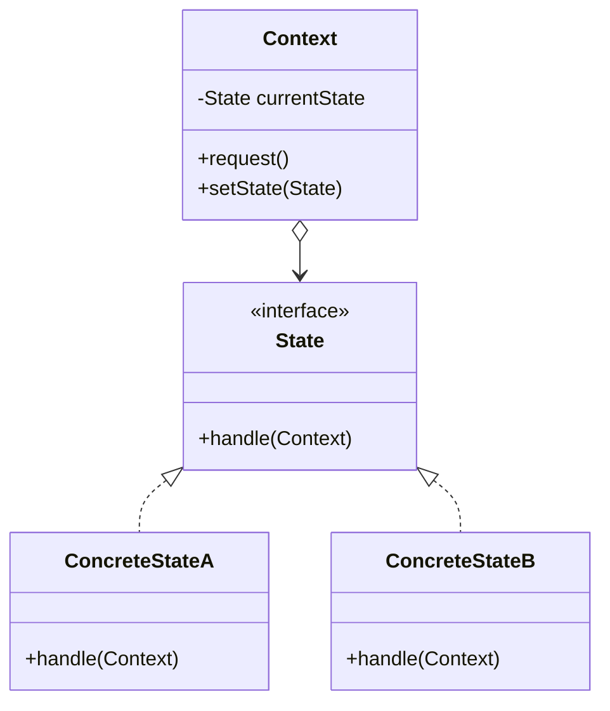
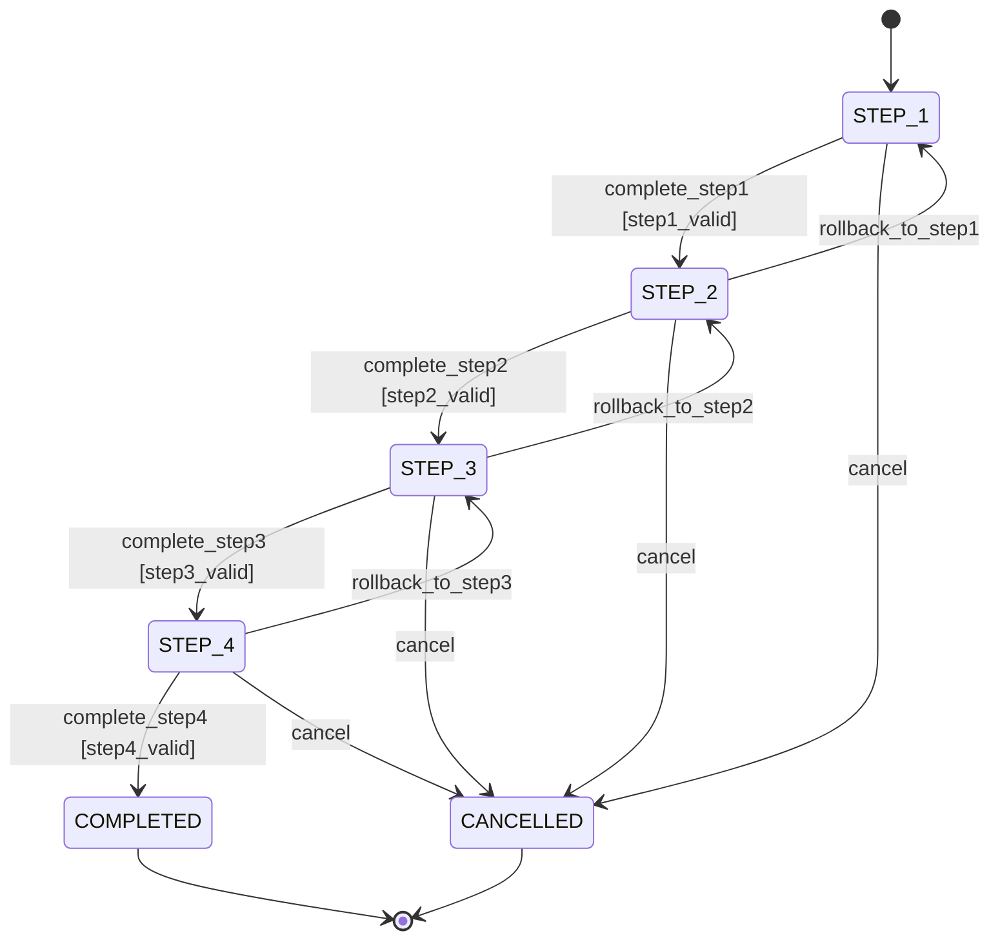
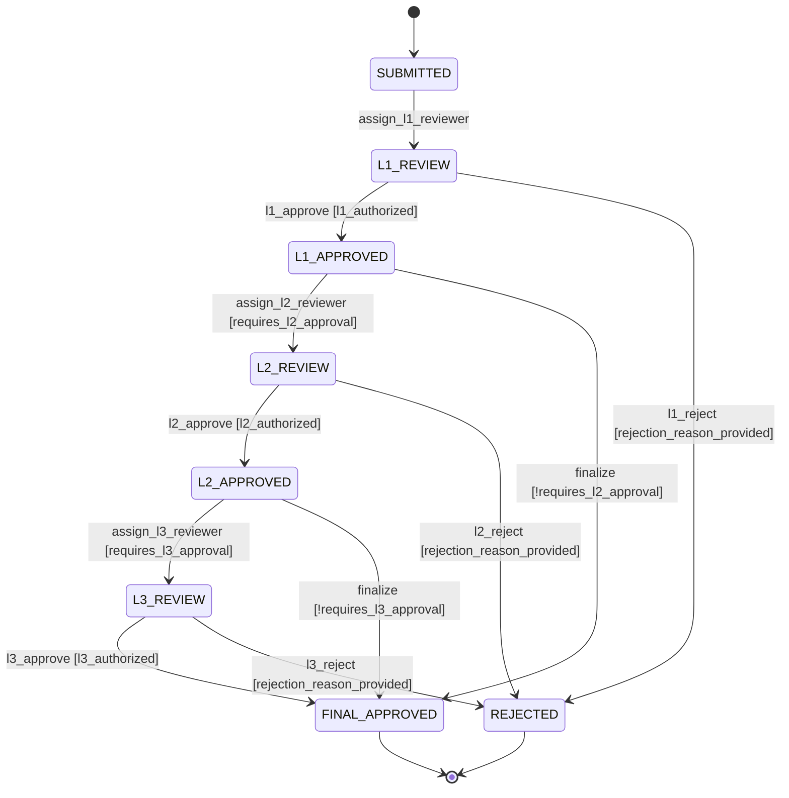
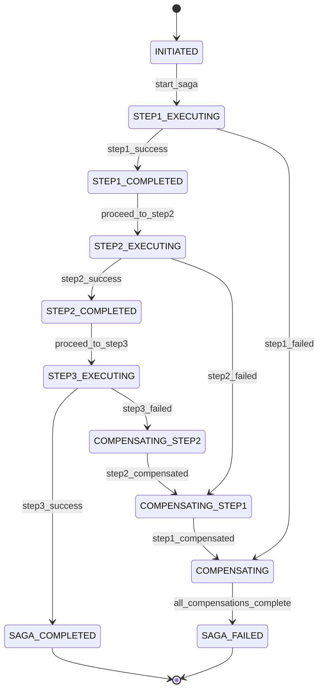
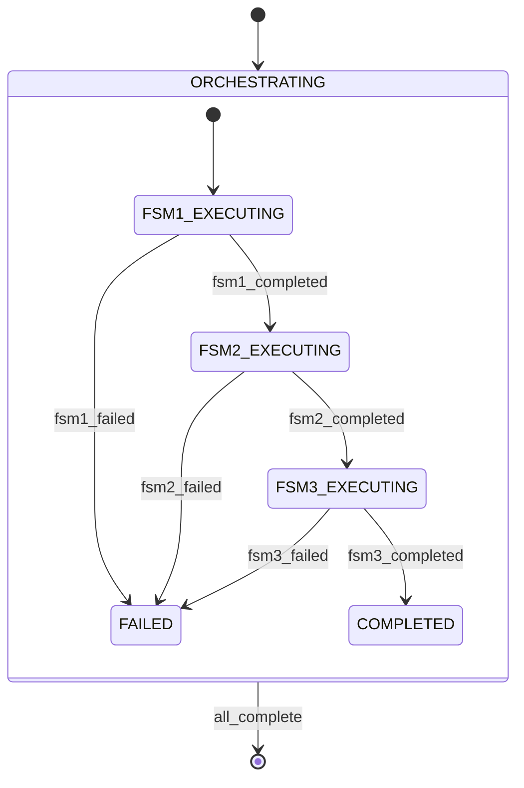

# Design Patterns and Best Practices

Finite state machines are versatile modeling tools, but without disciplined design, they can become difficult to understand, test, and maintain. This document catalogs proven FSM design patterns and best practices drawn from decades of real-world use in workflow systems, embedded systems, and enterprise applications.

## Foundational Patterns

### Pattern 1: State Pattern (Gang of Four)

The **State Pattern** encapsulates state-specific behavior in separate classes, allowing objects to alter their behavior when internal state changes.

**Structure**:

```
Context class:
  - Holds current state reference
  - Delegates behavior to current state object
  - Provides interface for state transitions

State interface:
  - Defines methods for all possible actions

Concrete State classes:
  - Implement state-specific behavior
  - Return next state on transitions
```

**UML**:



**OSE Example - Zakat Assessment State Pattern**:

```
Context: ZakatAssessment
  - currentState: AssessmentState
  - wealthData: WealthData
  - zakatAmount: Money

State Interface: AssessmentState
  - startCalculation(assessment): AssessmentState
  - completeCalculation(assessment): AssessmentState
  - recordPayment(assessment, payment): AssessmentState

Concrete States:
  - DraftState
  - CalculatingState
  - PayableState
  - PaidState

Behavior:
  DraftState.startCalculation():
    - Validates wealth data
    - Returns CalculatingState

  CalculatingState.completeCalculation():
    - Calculates Zakat amount
    - If amount > 0: Returns PayableState
    - If amount == 0: Returns ExemptState

  PayableState.recordPayment():
    - Records payment transaction
    - Returns PaidState
```

**When to use**:

- Object behavior varies significantly by state
- State-specific behavior is complex
- Object-oriented language with polymorphism

**When NOT to use**:

- Simple state machines (3-4 states with minimal behavior differences)
- Functional programming paradigm (use algebraic data types instead)

### Pattern 2: Workflow Pattern (Linear Progression)

The **Workflow Pattern** models sequential processes with checkpoints, allowing progress tracking and partial completion.

**Structure**:



**Characteristics**:

- Predominantly forward progression
- Each step has validation
- Rollback capability to previous checkpoints
- Cancellation possible at any step

**OSE Example - Qard Hasan Loan Application Workflow**:

```
STEP_1: APPLICATION_SUBMITTED
  Actions: validate_applicant_identity()
  Guard: identity_documents_complete

STEP_2: DOCUMENT_VERIFICATION
  Actions: verify_income_proof(), verify_employment()
  Guard: all_documents_verified

STEP_3: SHARIAH_COMPLIANCE_CHECK
  Actions: check_riba_free_income(), verify_lawful_purpose()
  Guard: shariah_compliant

STEP_4: CREDIT_ASSESSMENT
  Actions: calculate_debt_to_income(), assess_repayment_capacity()
  Guard: creditworthy

STEP_5: APPROVAL
  Actions: generate_loan_agreement(), notify_applicant()
  Guard: all_checks_passed

COMPLETED: LOAN_ACTIVE

Rollback Scenarios:
- From CREDIT_ASSESSMENT → DOCUMENT_VERIFICATION: If income documents expired
- From SHARIAH_COMPLIANCE_CHECK → APPLICATION_SUBMITTED: If purpose clarification needed
```

**Best Practices**:

- Each step should be independently testable
- Rollback transitions should preserve context (don't lose user input)
- Cancellation should clean up resources
- Progress percentage calculable from current step

### Pattern 3: Approval Chain Pattern

The **Approval Chain Pattern** models multi-level approval processes with rejection paths and escalation.

**Structure**:



**OSE Example - Murabaha Contract Approval**:

```
Approval Thresholds:
- Amount < 50,000: L1 only
- Amount 50,000-250,000: L1 + L2
- Amount > 250,000: L1 + L2 + L3

Context:
  contract_amount: Money
  risk_score: number
  l1_approved: boolean
  l2_approved: boolean
  l3_approved: boolean

Guards:
  requires_l2_approval = (contract_amount >= 50000 || risk_score > 70)
  requires_l3_approval = (contract_amount > 250000 || risk_score > 90)

States:
  L1_REVIEW: Shariah compliance officer review
  L2_REVIEW: Senior financing manager review
  L3_REVIEW: Executive committee review

Rejection Handling:
  - Any level can reject
  - Rejection includes mandatory reason
  - Rejected applications cannot be resubmitted without modification
```

**Best Practices**:

- Approval levels should be data-driven (threshold-based)
- Each level should have clear authority boundaries
- Rejection reasons should be mandatory
- Audit trail of all approval/rejection decisions

### Pattern 4: Saga Pattern (Distributed Transactions)

The **Saga Pattern** coordinates long-running transactions across multiple services, with compensating actions for rollback.

**Structure**:



**OSE Example - Zakat Distribution Saga**:

```
Saga: Distribute Zakat to Multiple Beneficiaries

Step 1: Reserve funds from Zakat pool
  Forward Action: lock_funds(total_amount)
  Compensation: unlock_funds(total_amount)

Step 2: Transfer to beneficiary 1
  Forward Action: transfer_to_account(beneficiary1, amount1)
  Compensation: reverse_transfer(beneficiary1, amount1)

Step 3: Transfer to beneficiary 2
  Forward Action: transfer_to_account(beneficiary2, amount2)
  Compensation: reverse_transfer(beneficiary2, amount2)

Step 4: Record distribution in ledger
  Forward Action: create_distribution_record()
  Compensation: delete_distribution_record()

Failure Scenario:
  If Step 3 fails (transfer to beneficiary 2):
    1. Compensate Step 2: reverse_transfer(beneficiary1, amount1)
    2. Compensate Step 1: unlock_funds(total_amount)
    3. Result: SAGA_FAILED state
```

**Best Practices**:

- Every forward action must have a compensating action
- Compensations should be idempotent
- Saga state should be persisted (for crash recovery)
- Timeout handling for long-running steps
- Use message queues for step coordination

### Pattern 5: Process Manager Pattern

The **Process Manager Pattern** coordinates multiple independent FSMs, maintaining correlation state across distributed workflows.

**Structure**:



**OSE Example - Campaign Funding Coordination**:

```
Process Manager: CampaignFundingOrchestrator

Coordinates:
  1. PaymentProcessingFSM: Collects donor payments
  2. BeneficiaryVerificationFSM: Verifies beneficiary eligibility
  3. DisbursementFSM: Transfers funds to beneficiaries

Process Manager State:
  - campaign_id: string
  - target_amount: Money
  - collected_amount: Money
  - verified_beneficiaries: list
  - disbursement_schedule: list

Events:
  - payment_received (from PaymentProcessingFSM)
  - beneficiary_verified (from BeneficiaryVerificationFSM)
  - disbursement_completed (from DisbursementFSM)

Coordination Logic:
  IF collected_amount >= target_amount AND verified_beneficiaries.length > 0:
    Start DisbursementFSM for each verified_beneficiary
```

**Best Practices**:

- Process Manager holds correlation ID (e.g., campaign_id)
- Child FSMs are independent and don't know about Process Manager
- Process Manager subscribes to events from child FSMs
- Timeout handling for stuck child FSMs

## Best Practices by Concern

### Design: State Naming Conventions

**Use adjectives or past participles for states**:

```
✅ GOOD:
- DRAFT (adjective)
- SUBMITTED (past participle)
- APPROVED (past participle)
- ACTIVE (adjective)
- CANCELLED (past participle)

❌ BAD:
- SUBMIT (verb - this is an event, not a state)
- APPROVING (present participle - ambiguous)
- ACTIVATE (verb)
```

**OSE Example**:

```
Zakat Assessment States:
✅ DRAFT, CALCULATING, PAYABLE, PAID, EXEMPT
❌ DRAFT, CALCULATE, PAY, PAID, EXEMPT
```

### Design: Event Naming Conventions

**Use verbs or verb phrases for events**:

```
✅ GOOD:
- submit_application
- approve
- payment_received
- timeout_occurred

❌ BAD:
- submission (noun)
- approved (state-like)
- payment (ambiguous)
```

### Design: Guard Clarity

**Guards should read as natural language conditions**:

```
✅ GOOD:
[nisab_threshold_met]
[all_documents_verified]
[shariah_compliant]

❌ BAD:
[check_nisab]  // Sounds like an action
[docs]  // Ambiguous abbreviation
[sc]  // Cryptic
```

### Design: Action Naming

**Actions should use imperative verb phrases**:

```
✅ GOOD:
notify_applicant()
calculate_zakat_amount()
record_payment()

❌ BAD:
notification()  // Noun
zakat_calculation()  // Noun
payment()  // Ambiguous
```

### Implementation: Separate FSM Logic from Business Logic

**Principle**: The FSM should orchestrate state transitions, not implement business rules.

```
❌ BAD: Business logic embedded in FSM

State: CALCULATING
  entry / {
    let gold_value = gold_weight * gold_price_per_gram;
    let cash_value = cash_amount;
    let total_wealth = gold_value + cash_value;
    let nisab = 85 * gold_price_per_gram;
    if (total_wealth >= nisab) {
      zakat_amount = total_wealth * 0.025;
    } else {
      zakat_amount = 0;
    }
  }
```

```
✅ GOOD: Business logic in separate service

State: CALCULATING
  entry / {
    zakat_amount = zakatCalculationService.calculate(wealth_data);
  }

ZakatCalculationService:
  calculate(wealth_data):
    let gold_value = wealth_data.gold_weight * market.gold_price;
    let cash_value = wealth_data.cash_amount;
    let total_wealth = gold_value + cash_value;
    let nisab = market.nisab_threshold;
    if (total_wealth >= nisab) {
      return total_wealth * 0.025;
    } else {
      return 0;
    }
```

**Benefits**:

- Business logic testable independently
- FSM remains simple and focused on orchestration
- Business rules can be reused outside FSM

### Implementation: Immutable State Transitions

**Principle**: Transition functions should return new state, not mutate existing state.

```
❌ BAD: Mutating state

function transition(state, event) {
  if (state.name === "DRAFT" && event === "submit") {
    state.name = "SUBMITTED";  // Mutation
    state.submitted_at = now();
  }
  return state;
}
```

```
✅ GOOD: Immutable transition

function transition(state, event) {
  if (state.name === "DRAFT" && event === "submit") {
    return {
      ...state,
      name: "SUBMITTED",
      submitted_at: now()
    };  // New state object
  }
  return state;
}
```

**Benefits**:

- Easier to reason about
- Time-travel debugging possible
- Event sourcing compatible

### Implementation: Explicit Error States

**Principle**: Model error conditions as explicit states, not exceptions.

```
❌ BAD: Error handling via exceptions

CALCULATING --> PAYABLE : calculation_complete
  entry / {
    try {
      calculate_zakat();
    } catch (error) {
      throw new CalculationException(error);
    }
  }
```

```
✅ GOOD: Explicit error state

stateDiagram-v2
  CALCULATING --> PAYABLE : calculation_success
  CALCULATING --> CALCULATION_FAILED : calculation_error

  state CALCULATION_FAILED {
    entry / log_error()
    entry / notify_admin()
  }

  CALCULATION_FAILED --> DRAFT : reset [user_action]
  CALCULATION_FAILED --> CALCULATING : retry [retry_count < 3]
```

**Benefits**:

- Error recovery modeled explicitly
- Retry logic visible in FSM
- Better observability

### Testing: State Coverage

**Principle**: Every state must be reachable and leaveable in tests.

```
Test Suite for Zakat Assessment FSM:

test("All states are reachable") {
  let visited_states = new Set();

  // Start from initial state
  let fsm = new ZakatAssessmentFSM();
  visited_states.add(fsm.current_state);

  // Exercise all transitions
  fsm.handle("start_calculation");
  visited_states.add(fsm.current_state);

  fsm.handle("calculation_complete");
  visited_states.add(fsm.current_state);

  fsm.handle("record_payment");
  visited_states.add(fsm.current_state);

  // Verify all states visited
  assert(visited_states.contains("DRAFT"));
  assert(visited_states.contains("CALCULATING"));
  assert(visited_states.contains("PAYABLE"));
  assert(visited_states.contains("PAID"));
}
```

### Testing: Transition Coverage

**Principle**: Every valid transition must be exercised in tests.

```
Test Suite:

test("DRAFT to CALCULATING transition") {
  let fsm = new ZakatAssessmentFSM();
  assert(fsm.current_state === "DRAFT");

  fsm.handle("start_calculation");

  assert(fsm.current_state === "CALCULATING");
}

test("CALCULATING to PAYABLE transition") {
  let fsm = createFSMInState("CALCULATING");

  fsm.handle("calculation_complete");

  assert(fsm.current_state === "PAYABLE");
}
```

### Observability: Comprehensive Logging

**Principle**: Log every transition with context.

```
function transition(state, event) {
  let previous_state = state.name;
  let new_state = compute_next_state(state, event);

  logger.info({
    event: "state_transition",
    fsm_id: state.id,
    fsm_type: "ZakatAssessment",
    previous_state: previous_state,
    new_state: new_state.name,
    event: event.type,
    event_payload: event.payload,
    timestamp: now(),
    context: state.context
  });

  return new_state;
}
```

**Log Output Example**:

```
{
  "event": "state_transition",
  "fsm_id": "zakat-2026-001",
  "fsm_type": "ZakatAssessment",
  "previous_state": "CALCULATING",
  "new_state": "PAYABLE",
  "event": "calculation_complete",
  "event_payload": { "zakat_amount": 2500.00 },
  "timestamp": "2026-01-21T10:30:00Z",
  "context": {
    "total_wealth": 100000.00,
    "nisab": 85000.00
  }
}
```

### Versioning: FSM Definition Versioning

**Principle**: FSM definitions evolve. Track versions to support migration.

```
FSM Definition:

{
  "version": "2.0.0",
  "name": "ZakatAssessment",
  "states": [...],
  "transitions": [...],
  "migration": {
    "from_version": "1.0.0",
    "migration_function": migrate_v1_to_v2
  }
}

Migration Function:

function migrate_v1_to_v2(state_v1) {
  // v1.0.0 had state "IN_PROGRESS"
  // v2.0.0 split it into "CALCULATING" and "VALIDATING"

  if (state_v1.name === "IN_PROGRESS") {
    if (state_v1.context.validation_pending) {
      return { ...state_v1, name: "VALIDATING" };
    } else {
      return { ...state_v1, name: "CALCULATING" };
    }
  }
  return state_v1;
}
```

## Anti-Patterns to Avoid

### Anti-Pattern 1: God State Machine

**Problem**: Single FSM handling too many concerns.

```
❌ BAD: Monolithic FSM handling payment, approval, and fulfillment

States: DRAFT, PENDING_PAYMENT, PAID, PENDING_APPROVAL, APPROVED,
        IN_FULFILLMENT, SHIPPED, DELIVERED, COMPLETED
```

**Solution**: Decompose into multiple coordinated FSMs.

```
✅ GOOD: Three FSMs with clear boundaries

PaymentFSM:
  States: PENDING, PAID, REFUNDED

ApprovalFSM:
  States: SUBMITTED, APPROVED, REJECTED

FulfillmentFSM:
  States: QUEUED, IN_PROGRESS, SHIPPED, DELIVERED
```

### Anti-Pattern 2: State Explosion Without Hierarchy

**Problem**: Flat FSM with combinatorial state explosion.

```
❌ BAD: 16 flat states for order processing

PENDING_PAYMENT_NEW_CUSTOMER_DOMESTIC
PENDING_PAYMENT_NEW_CUSTOMER_INTERNATIONAL
PENDING_PAYMENT_RETURNING_CUSTOMER_DOMESTIC
PENDING_PAYMENT_RETURNING_CUSTOMER_INTERNATIONAL
PAID_NEW_CUSTOMER_DOMESTIC
PAID_NEW_CUSTOMER_INTERNATIONAL
...
```

**Solution**: Use hierarchical FSM or context variables.

```
✅ GOOD: Hierarchical FSM with context

State: PENDING_PAYMENT {
  context: {
    customer_type: "NEW" | "RETURNING",
    shipping_region: "DOMESTIC" | "INTERNATIONAL"
  }
}
```

### Anti-Pattern 3: Boolean Flags Instead of States

**Problem**: Using boolean flags to track state instead of explicit FSM states.

```
❌ BAD: Boolean soup

{
  is_submitted: false,
  is_approved: false,
  is_paid: false,
  is_shipped: false
}

// What does is_submitted=true, is_approved=false, is_paid=true mean?
```

**Solution**: Explicit FSM states.

```
✅ GOOD: Explicit state

current_state: "APPROVED_AWAITING_PAYMENT"
```

### Anti-Pattern 4: Missing Terminal States

**Problem**: FSM never reaches a terminal state, making cleanup difficult.

```
❌ BAD: No terminal state

stateDiagram-v2
  ACTIVE --> PAUSED : pause
  PAUSED --> ACTIVE : resume
  ACTIVE --> CANCELLED : cancel
  CANCELLED --> ACTIVE : reactivate
```

**Solution**: Add explicit terminal states.

```
✅ GOOD: Terminal states for completion

stateDiagram-v2
  ACTIVE --> PAUSED : pause
  PAUSED --> ACTIVE : resume
  ACTIVE --> COMPLETED : complete [all_tasks_done]
  ACTIVE --> CANCELLED : cancel
  CANCELLED --> [*]
  COMPLETED --> [*]
```

## Cross-References

- [Core Concepts and Terminology](./ex-so-ar-fsm__02-core-concepts-and-terminology.md): FSM fundamentals
- [State Explosion and Mitigation](./ex-so-ar-fsm__04-state-explosion-and-mitigation.md): Handling complexity
- [Events, Guards, and Actions](./ex-so-ar-fsm__06-events-guards-and-actions.md): Transition mechanics
- [OOP Implementation Patterns](./ex-so-ar-fsm__08-oop-implementation-patterns.md): State Pattern implementation
- [Event-Driven and Reactive FSM](./ex-so-ar-fsm__11-event-driven-and-reactive-fsm.md): Saga pattern details
- [Testing FSM Implementations](./ex-so-ar-fsm__12-testing-fsm-implementations.md): State and transition coverage
- [Best Practices and Common Mistakes](./ex-so-ar-fsm__17-best-practices-and-common-mistakes.md): Comprehensive anti-patterns

## Related Principles

This document demonstrates several core principles:

- [Simplicity Over Complexity](../../../../governance/principles/general/simplicity-over-complexity.md): Decomposing god state machines
- [Explicit Over Implicit](../../../../governance/principles/software-engineering/explicit-over-implicit.md): Explicit states over boolean flags
- [Immutability Over Mutability](../../../../governance/principles/software-engineering/immutability.md): Immutable state transitions
- [Pure Functions Over Side Effects](../../../../governance/principles/software-engineering/pure-functions.md): Testable state transitions with no hidden dependencies

## Next Steps

After understanding design patterns:

1. **Implement in your paradigm**: [OOP Implementation](./ex-so-ar-fsm__08-oop-implementation-patterns.md) or [FP Implementation](./ex-so-ar-fsm__09-fp-implementation-patterns.md)
2. **Learn testing strategies**: [Testing FSM Implementations](./ex-so-ar-fsm__12-testing-fsm-implementations.md)
3. **Integrate with architecture**: [Integration with DDD and Architecture](./ex-so-ar-fsm__18-integration-with-ddd-and-architecture.md)
4. **Choose a framework**: [Spring State Machine & XState](./ex-so-ar-fsm__13-framework-spring-state-machine-xstate.md)
