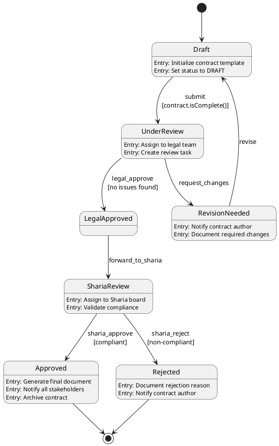

# Declarative and DSL Approaches to Finite State Machines

## Overview

Declarative approaches and Domain-Specific Languages (DSLs) provide powerful abstractions for defining Finite State Machines (FSMs). Rather than imperatively describing how state transitions occur, declarative approaches focus on what states exist and when transitions should happen. This document explores various declarative patterns, DSL design principles, and practical implementations for FSM modeling in enterprise systems.

## Purpose

This explanation provides:

- Understanding of declarative vs. imperative FSM definitions
- Design principles for FSM DSLs
- Common DSL patterns and syntaxes
- Trade-offs between different approaches
- Integration strategies with existing codebases
- Best practices for DSL evolution and maintenance

## Target Audience

- Software architects designing FSM frameworks
- Platform engineers building workflow systems
- Domain experts seeking to model business processes
- Library authors creating FSM abstractions
- Teams evaluating declarative vs. imperative approaches

## Prerequisites

- Understanding of FSM fundamentals (see `ex-so-ar-fsm__01-fundamentals-and-theory.md`)
- Familiarity with implementation patterns (see `ex-so-ar-fsm__04-implementation-patterns-approaches.md`)
- Knowledge of domain modeling concepts
- Experience with configuration formats (JSON, YAML, XML)

## Declarative vs. Imperative FSMs

### Imperative Approach

Imperative FSM definitions describe how to execute state transitions:

```java
// Imperative: How to transition
public class ZakatApplicationFSM {
    private ZakatApplicationState currentState;

    public void handleEvent(ZakatApplicationEvent event) {
        if (currentState == ZakatApplicationState.DRAFT) {
            if (event == ZakatApplicationEvent.SUBMIT) {
                // Explicitly describe the transition process
                validateApplication();
                notifyReviewers();
                currentState = ZakatApplicationState.PENDING_REVIEW;
                logStateChange();
            } else if (event == ZakatApplicationEvent.SAVE_DRAFT) {
                persistDraft();
                // State remains DRAFT
            }
        } else if (currentState == ZakatApplicationState.PENDING_REVIEW) {
            if (event == ZakatApplicationEvent.APPROVE) {
                calculateZakat();
                createPaymentSchedule();
                currentState = ZakatApplicationState.APPROVED;
                notifyApplicant();
            }
            // ... more conditions
        }
        // ... more states
    }
}
```

**Characteristics:**

- Explicit control flow with if-else or switch statements
- State transition logic mixed with business logic
- Harder to visualize overall state machine structure
- More flexible but prone to inconsistencies
- Difficult to validate completeness

### Declarative Approach

Declarative FSM definitions describe what states and transitions exist:

```java
// Declarative: What states and transitions exist
@StateMachineConfiguration
public class ZakatApplicationFSMConfig {

    @States
    public enum ZakatApplicationState {
        DRAFT,
        PENDING_REVIEW,
        APPROVED,
        REJECTED,
        PAYMENT_SCHEDULED,
        COMPLETED
    }

    @Events
    public enum ZakatApplicationEvent {
        SUBMIT,
        APPROVE,
        REJECT,
        SCHEDULE_PAYMENT,
        COMPLETE_PAYMENT
    }

    @Transitions
    public void configure(TransitionConfigurer<ZakatApplicationState, ZakatApplicationEvent> transitions) {
        transitions
            .from(DRAFT).to(PENDING_REVIEW).on(SUBMIT)
                .guard(application -> application.isValid())
                .action(notificationService::notifyReviewers)

            .from(PENDING_REVIEW).to(APPROVED).on(APPROVE)
                .action(zakatService::calculateZakat)
                .action(notificationService::notifyApplicant)

            .from(PENDING_REVIEW).to(REJECTED).on(REJECT)
                .action(notificationService::notifyApplicant)

            .from(APPROVED).to(PAYMENT_SCHEDULED).on(SCHEDULE_PAYMENT)
                .action(paymentService::createSchedule)

            .from(PAYMENT_SCHEDULED).to(COMPLETED).on(COMPLETE_PAYMENT)
                .action(paymentService::recordPayment);
    }
}
```

**Characteristics:**

- Separation of structure from behavior
- Clear visualization of state machine topology
- Easier to validate completeness
- Framework handles transition mechanics
- More constrained but more maintainable

### Comparison Matrix

| Aspect             | Imperative                      | Declarative                                   |
| ------------------ | ------------------------------- | --------------------------------------------- |
| **Code Structure** | Procedural, nested conditionals | Configuration-based, flat structure           |
| **Readability**    | Harder for complex FSMs         | Easier to understand overall flow             |
| **Validation**     | Runtime errors                  | Compile-time or configuration-time validation |
| **Visualization**  | Requires reverse engineering    | Direct mapping to diagrams                    |
| **Flexibility**    | Maximum flexibility             | Constrained by framework                      |
| **Testing**        | Test entire control flow        | Test transitions independently                |
| **Maintenance**    | Higher cognitive load           | Lower cognitive load                          |
| **Learning Curve** | Lower (standard programming)    | Higher (framework-specific)                   |

## DSL Design Principles

### Principle 1: Domain Alignment

DSLs should use terminology from the problem domain, not the implementation domain.

**Good - Domain-Aligned:**

```yaml
# Zakat Campaign FSM
states:
  - name: fundraising
    description: "Campaign is actively collecting donations"
  - name: goal_reached
    description: "Fundraising goal has been met"
  - name: distributing
    description: "Zakat is being distributed to recipients"

transitions:
  - from: fundraising
    to: goal_reached
    when: "donation received AND total >= goal"

  - from: goal_reached
    to: distributing
    when: "distribution approved"
```

**Poor - Implementation-Focused:**

```yaml
# Generic FSM - loses domain meaning
states:
  - name: state_1
    type: active
  - name: state_2
    type: terminal
  - name: state_3
    type: active

transitions:
  - from: state_1
    to: state_2
    condition: "event_a AND flag_b"
```

**Rationale:**

- Domain experts can read and validate the FSM definition
- Reduces translation errors between domain and code
- Serves as living documentation
- Facilitates collaboration between technical and non-technical stakeholders

### Principle 2: Declarative Over Imperative

DSL should describe what should happen, not how it should happen.

**Good - Declarative:**

```json
{
  "stateMachine": "ContractApprovalFSM",
  "transitions": [
    {
      "from": "draft",
      "to": "legal_review",
      "on": "submit_for_review",
      "requires": ["all_sections_complete", "signatures_present"],
      "actions": ["notify_legal_team", "create_review_task"]
    }
  ]
}
```

**Poor - Imperative:**

```json
{
  "stateMachine": "ContractApprovalFSM",
  "transitions": [
    {
      "from": "draft",
      "to": "legal_review",
      "on": "submit_for_review",
      "implementation": "function(contract) { if (contract.sections.every(s => s.complete) && contract.signatures.length > 0) { legalTeam.notify(contract); taskService.create({type: 'review', contract: contract}); return 'legal_review'; } return 'draft'; }"
    }
  ]
}
```

**Rationale:**

- Framework handles execution details
- Configuration is portable across implementations
- Easier to validate and test
- Reduces coupling to specific programming languages

### Principle 3: Composition and Reusability

DSL should support reusable components and composition.

**Example - Reusable Guards:**

```yaml
# Reusable guard definitions
guards:
  is_valid_nisab:
    description: "Checks if wealth exceeds nisab threshold"
    expression: "wealth >= nisab_threshold"

  is_lunar_year_complete:
    description: "Checks if one lunar year has passed"
    expression: "days_since_acquisition >= 354"

  has_eligible_wealth:
    description: "Composite guard for Zakat eligibility"
    all_of:
      - is_valid_nisab
      - is_lunar_year_complete

# Use in transitions
transitions:
  - from: assessing
    to: eligible
    on: assessment_complete
    guard: has_eligible_wealth
```

**Example - Reusable Actions:**

```yaml
actions:
  send_email_notification:
    type: email
    template_id: "notification_template"

  create_audit_log:
    type: audit
    category: "state_transition"

  standard_transition_actions:
    sequence:
      - send_email_notification
      - create_audit_log

transitions:
  - from: pending
    to: approved
    on: approve
    actions: standard_transition_actions
```

**Rationale:**

- Reduces duplication
- Ensures consistency across state machines
- Simplifies maintenance
- Enables building block approach

### Principle 4: Validation and Error Reporting

DSL should enable early validation with clear error messages.

**Example - Schema with Validation:**

```json
{
  "$schema": "https://oseplatform.com/schemas/fsm/v1",
  "stateMachine": {
    "name": "LoanApplicationFSM",
    "version": "1.0.0",
    "states": [
      {
        "name": "draft",
        "type": "initial",
        "validations": {
          "no_outgoing_transitions_to_self": true,
          "at_least_one_outgoing_transition": true
        }
      },
      {
        "name": "approved",
        "type": "final",
        "validations": {
          "no_outgoing_transitions": true
        }
      }
    ],
    "transitions": [
      {
        "from": "draft",
        "to": "approved",
        "on": "approve",
        "validations": {
          "target_state_exists": true,
          "event_defined": true,
          "no_duplicate_transition": true
        }
      }
    ]
  }
}
```

**Validation Rules:**

- All referenced states must be defined
- Exactly one initial state
- At least one final state
- No unreachable states
- No ambiguous transitions (same source + event → multiple targets)
- All events used in transitions are defined
- Guards and actions reference valid functions

**Error Message Example:**

```
FSM Validation Error in LoanApplicationFSM:
  - Line 15: Transition references undefined state "under_review"
  - Line 23: State "rejected" is unreachable from initial state
  - Line 31: Ambiguous transitions from "pending" on event "cancel"
    Transition 1: pending -> cancelled (line 31)
    Transition 2: pending -> archived (line 38)

Suggestion: Add state "under_review" or change transition target to existing state.
```

### Principle 5: Evolvability

DSL should support versioning and backward compatibility.

**Example - Versioned FSM:**

```yaml
fsm_version: "2.0"
backward_compatible_with: ["1.0", "1.5"]

# Migration from v1.0 to v2.0
migrations:
  from_1_0:
    deprecated_states:
      - name: "pending_approval"
        replaced_by: "awaiting_review"
        auto_migrate: true

    new_states:
      - name: "compliance_check"
        insert_before: "awaiting_review"

# Current FSM definition
states:
  - draft
  - compliance_check
  - awaiting_review
  - approved
  - rejected

transitions:
  - from: draft
    to: compliance_check
    on: submit

  - from: compliance_check
    to: awaiting_review
    on: compliance_pass
```

**Rationale:**

- Supports FSM evolution over time
- Allows gradual migration
- Preserves historical data
- Enables A/B testing of FSM versions

## Common DSL Patterns

### Pattern 1: Fluent API DSL

Fluent APIs use method chaining for readable configuration.

**Example - Java Fluent API:**

```java
public class ZakatDistributionFSM {
    public static StateMachine<ZakatState, ZakatEvent> build() {
        return StateMachineBuilder.<ZakatState, ZakatEvent>builder()
            .initialState(ZakatState.COLLECTING)

            .transition()
                .from(ZakatState.COLLECTING)
                .to(ZakatState.VERIFYING_RECIPIENTS)
                .on(ZakatEvent.COLLECTION_COMPLETE)
                .guard(ctx -> ctx.getTotalCollected().compareTo(BigDecimal.ZERO) > 0)
                .action(ctx -> auditService.log("Collection phase completed"))
                .and()

            .transition()
                .from(ZakatState.VERIFYING_RECIPIENTS)
                .to(ZakatState.DISTRIBUTING)
                .on(ZakatEvent.RECIPIENTS_VERIFIED)
                .action(ctx -> distributionService.prepare(ctx.getRecipients()))
                .and()

            .transition()
                .from(ZakatState.DISTRIBUTING)
                .to(ZakatState.COMPLETED)
                .on(ZakatEvent.DISTRIBUTION_COMPLETE)
                .action(ctx -> {
                    reportService.generateReport(ctx);
                    notificationService.notifyDonors(ctx);
                })
                .and()

            .errorTransition()
                .fromAny()
                .to(ZakatState.ERROR)
                .on(ZakatEvent.SYSTEM_ERROR)
                .action(ctx -> errorHandler.handle(ctx.getError()))
                .and()

            .build();
    }
}
```

**Advantages:**

- Type-safe (compile-time checking)
- IDE autocomplete support
- Natural reading flow
- Method chaining enforces correct structure

**Disadvantages:**

- Verbose for large state machines
- Requires rebuilding for configuration changes
- Harder to generate from external sources

### Pattern 2: Annotation-Based DSL

Annotations mark methods as transition handlers.

**Example - Spring State Machine Style:**

```java
@StateMachineComponent
public class ContractWorkflowFSM {

    @OnTransition(from = "DRAFT", to = "LEGAL_REVIEW")
    public void submitForLegalReview(
        @StateContext StateContext<ContractState, ContractEvent> context
    ) {
        Contract contract = context.getMessage()
            .getHeaders()
            .get("contract", Contract.class);

        legalTeam.assignReviewer(contract);
        notificationService.notify(contract.getDraftedBy(),
            "Contract submitted for legal review");
    }

    @OnTransition(from = "LEGAL_REVIEW", to = "SHARIA_REVIEW")
    @Guard("legalReviewCompleteGuard")
    public void moveToShariaReview(
        @StateContext StateContext<ContractState, ContractEvent> context
    ) {
        Contract contract = getContract(context);
        shariaBoard.assignReviewer(contract);
    }

    @Bean
    public Guard<ContractState, ContractEvent> legalReviewCompleteGuard() {
        return ctx -> {
            Contract contract = getContract(ctx);
            return contract.getLegalReview() != null
                && contract.getLegalReview().isApproved();
        };
    }

    @OnTransition(from = "SHARIA_REVIEW", to = "APPROVED")
    @PreAction("recordApprovalAction")
    @PostAction("notifyStakeholdersAction")
    public void approveContract(
        @StateContext StateContext<ContractState, ContractEvent> context
    ) {
        Contract contract = getContract(context);
        contractService.finalize(contract);
    }

    @StatesOnTransition(from = {"LEGAL_REVIEW", "SHARIA_REVIEW"}, to = "REJECTED")
    public void rejectContract(
        @StateContext StateContext<ContractState, ContractEvent> context
    ) {
        Contract contract = getContract(context);
        String rejectionReason = context.getMessage()
            .getHeaders()
            .get("reason", String.class);

        contractService.markRejected(contract, rejectionReason);
        notificationService.notifyRejection(contract);
    }

    @OnStateEntry(state = "DRAFT")
    public void enterDraftState() {
        logger.info("Contract entered draft state");
    }

    @OnStateExit(state = "APPROVED")
    public void exitApprovedState() {
        logger.info("Contract finalized and approved");
    }
}
```

**Advantages:**

- Declarative yet code-based
- Familiar to Java developers
- Framework handles transition mechanics
- Easy to add cross-cutting concerns (logging, metrics)

**Disadvantages:**

- Less visible overall FSM structure
- Scattered transition logic across methods
- Harder to generate diagrams
- Tied to specific language features

### Pattern 3: Configuration File DSL (YAML)

YAML provides human-readable external configuration.

**Example - YAML DSL:**

```yaml
state_machine:
  name: LoanApplicationFSM
  version: "1.0"
  description: "Manages the lifecycle of Sharia-compliant loan applications"

  metadata:
    domain: financing
    owner: financing-team
    audit_required: true

  states:
    - name: draft
      type: initial
      description: "Application is being prepared by the applicant"
      timeout:
        duration: 30d
        transition_to: expired

    - name: submitted
      type: active
      description: "Application submitted and awaiting initial review"
      on_entry:
        - action: notify_reviewers
          params:
            template: new_application

    - name: under_review
      type: active
      description: "Application is being reviewed by finance team"
      on_entry:
        - action: assign_reviewer
        - action: create_review_task

    - name: approved
      type: final
      description: "Application has been approved"
      on_entry:
        - action: generate_loan_agreement
        - action: notify_applicant_approved

    - name: rejected
      type: final
      description: "Application has been rejected"
      on_entry:
        - action: notify_applicant_rejected
        - action: record_rejection_reason

    - name: expired
      type: final
      description: "Application expired due to inactivity"

  events:
    - name: submit
      description: "Applicant submits the application"

    - name: approve
      description: "Reviewer approves the application"

    - name: reject
      description: "Reviewer rejects the application"

    - name: request_info
      description: "Reviewer requests additional information"

    - name: provide_info
      description: "Applicant provides requested information"

  transitions:
    - name: submit_application
      from: draft
      to: submitted
      on: submit
      guards:
        - name: application_complete
          expression: "application.all_sections_filled == true"
        - name: documents_uploaded
          expression: "application.documents.count >= required_documents.count"
      actions:
        - action: validate_application
        - action: calculate_risk_score
        - action: assign_priority

    - name: begin_review
      from: submitted
      to: under_review
      on: auto_transition
      guards:
        - name: reviewer_available
          expression: "available_reviewers.count > 0"

    - name: approve_application
      from: under_review
      to: approved
      on: approve
      guards:
        - name: review_complete
          expression: "review.status == 'complete'"
        - name: sharia_compliant
          expression: "review.sharia_compliance == true"
      actions:
        - action: record_approval
        - action: create_loan_account

    - name: reject_application
      from: under_review
      to: rejected
      on: reject
      actions:
        - action: record_rejection
          params:
            include_reason: true

    - name: request_additional_info
      from: under_review
      to: submitted
      on: request_info
      actions:
        - action: notify_applicant_info_needed
          params:
            required_info: "{{requested_fields}}"

    - name: resubmit_with_info
      from: submitted
      to: under_review
      on: provide_info
      guards:
        - name: info_provided
          expression: "application.pending_info_requests.count == 0"

  global_transitions:
    - name: cancel_application
      from: [draft, submitted, under_review]
      to: cancelled
      on: cancel
      actions:
        - action: notify_cancellation
        - action: cleanup_resources

  error_handling:
    - from: "*"
      to: error
      on: system_error
      actions:
        - action: log_error
        - action: notify_admin
        - action: preserve_state_for_recovery
```

**Advantages:**

- Human-readable and writable
- Language-agnostic
- Easy to version control
- Non-developers can maintain
- Can be generated from modeling tools

**Disadvantages:**

- No compile-time type checking
- Requires runtime parsing and validation
- Action/guard references are strings (no refactoring support)
- Schema validation essential

### Pattern 4: JSON Schema DSL

JSON provides structured, schema-validated configuration.

**Example - JSON DSL with Schema:**

```json
{
  "$schema": "https://oseplatform.com/schemas/fsm/v1.json",
  "stateMachine": {
    "id": "zakat-calculation-fsm",
    "version": "2.1.0",
    "metadata": {
      "domain": "zakat",
      "team": "sharia-compliance",
      "created": "2024-01-15T00:00:00Z",
      "lastModified": "2024-11-20T00:00:00Z"
    },
    "configuration": {
      "persistenceEnabled": true,
      "auditingEnabled": true,
      "maxHistorySize": 100,
      "timeoutBehavior": "transition_to_error"
    },
    "states": [
      {
        "id": "gathering_data",
        "type": "initial",
        "label": "Gathering Wealth Data",
        "description": "Collecting information about assets, debts, and nisab",
        "metadata": {
          "uiColor": "#0077B6",
          "icon": "data-collection"
        },
        "entryActions": ["initializeCalculation", "loadNisabThreshold"],
        "exitActions": ["validateData"],
        "timeout": {
          "duration": 3600000,
          "unit": "milliseconds",
          "targetState": "timeout_expired"
        }
      },
      {
        "id": "calculating",
        "type": "active",
        "label": "Calculating Zakat",
        "description": "Computing zakatable wealth and Zakat amount",
        "entryActions": ["calculateTotalWealth", "subtractDebts", "applyNisabThreshold", "calculateZakatAmount"],
        "metadata": {
          "uiColor": "#00B4D8",
          "icon": "calculator"
        }
      },
      {
        "id": "review_required",
        "type": "active",
        "label": "Manual Review Required",
        "description": "Complex case requiring Sharia scholar review",
        "entryActions": ["assignScholar", "notifyScholar", "createReviewTask"],
        "metadata": {
          "uiColor": "#F77F00",
          "icon": "review",
          "escalationRequired": true
        }
      },
      {
        "id": "completed",
        "type": "final",
        "label": "Calculation Complete",
        "description": "Zakat calculation finalized",
        "entryActions": ["generateReport", "notifyUser", "archiveCalculation"],
        "metadata": {
          "uiColor": "#06D6A0",
          "icon": "check-circle"
        }
      },
      {
        "id": "error",
        "type": "final",
        "label": "Calculation Error",
        "description": "An error occurred during calculation",
        "entryActions": ["logError", "notifyAdmin"],
        "metadata": {
          "uiColor": "#EF476F",
          "icon": "alert-circle"
        }
      }
    ],
    "events": [
      {
        "id": "data_complete",
        "label": "Data Collection Complete",
        "description": "All required wealth data has been gathered"
      },
      {
        "id": "calculation_complete",
        "label": "Calculation Complete",
        "description": "Zakat amount successfully calculated"
      },
      {
        "id": "needs_review",
        "label": "Manual Review Needed",
        "description": "Calculation requires Sharia scholar review"
      },
      {
        "id": "review_complete",
        "label": "Review Complete",
        "description": "Scholar has completed their review"
      },
      {
        "id": "error_occurred",
        "label": "Error Occurred",
        "description": "An error occurred during processing"
      }
    ],
    "transitions": [
      {
        "id": "start_calculation",
        "source": "gathering_data",
        "target": "calculating",
        "event": "data_complete",
        "guards": [
          {
            "name": "allDataPresent",
            "expression": "wealth.assets != null && wealth.debts != null",
            "errorMessage": "Missing required wealth data"
          },
          {
            "name": "nisabLoaded",
            "expression": "nisab.value > 0",
            "errorMessage": "Nisab threshold not loaded"
          }
        ],
        "actions": ["logTransition", "updateTimestamp"],
        "metadata": {
          "probability": 0.95,
          "avgDurationMs": 150
        }
      },
      {
        "id": "automatic_completion",
        "source": "calculating",
        "target": "completed",
        "event": "calculation_complete",
        "guards": [
          {
            "name": "standardCase",
            "expression": "calculation.complexity == 'standard'",
            "errorMessage": "Non-standard case requires review"
          }
        ],
        "actions": ["finalizeCalculation", "persistResults"],
        "metadata": {
          "probability": 0.85
        }
      },
      {
        "id": "require_review",
        "source": "calculating",
        "target": "review_required",
        "event": "needs_review",
        "guards": [
          {
            "name": "complexCase",
            "expression": "calculation.complexity == 'complex' || calculation.edge_cases.length > 0"
          }
        ],
        "actions": ["escalateToReview"],
        "metadata": {
          "probability": 0.15
        }
      },
      {
        "id": "complete_after_review",
        "source": "review_required",
        "target": "completed",
        "event": "review_complete",
        "guards": [
          {
            "name": "reviewApproved",
            "expression": "review.status == 'approved'"
          }
        ],
        "actions": ["applyReviewAdjustments", "finalizeCalculation"],
        "metadata": {
          "avgDurationMs": 86400000
        }
      },
      {
        "id": "handle_error",
        "source": "*",
        "target": "error",
        "event": "error_occurred",
        "actions": ["captureErrorDetails", "attemptRecovery"],
        "metadata": {
          "priority": "high"
        }
      }
    ],
    "guards": {
      "allDataPresent": {
        "type": "expression",
        "language": "jsonpath",
        "expression": "$.wealth.assets && $.wealth.debts"
      },
      "standardCase": {
        "type": "function",
        "reference": "com.oseplatform.zakat.guards.StandardCaseGuard"
      }
    },
    "actions": {
      "initializeCalculation": {
        "type": "service",
        "service": "zakatCalculationService",
        "method": "initialize"
      },
      "notifyUser": {
        "type": "event",
        "eventBus": "notification",
        "eventType": "zakat.calculation.complete"
      }
    }
  }
}
```

**Advantages:**

- Strongly structured
- Excellent tool support
- Schema validation
- Machine-readable
- Easy to generate programmatically

**Disadvantages:**

- Verbose compared to YAML
- Less human-friendly for manual editing
- Comments require workarounds

### Pattern 5: Graphical DSL (Model-Driven)

Visual modeling tools generate FSM definitions.

**Example - PlantUML State Diagram:**



**Generated Code (Target: Java):**

```java
// Auto-generated from ContractApprovalFSM.puml
// DO NOT EDIT MANUALLY - changes will be overwritten

@Generated(value = "PlantUML FSM Generator", date = "2024-11-20")
public class ContractApprovalFSM extends BaseStateMachine<ContractState, ContractEvent> {

    @Override
    protected void configureStates(StateConfigurer<ContractState, ContractEvent> states) {
        states
            .withStates()
                .initial(ContractState.DRAFT)
                .state(ContractState.DRAFT,
                    context -> {
                        initializeContractTemplate(context);
                        setStatusToDraft(context);
                    })
                .state(ContractState.UNDER_REVIEW,
                    context -> {
                        assignToLegalTeam(context);
                        createReviewTask(context);
                    })
                .state(ContractState.REVISION_NEEDED,
                    context -> {
                        notifyContractAuthor(context);
                        documentRequiredChanges(context);
                    })
                .state(ContractState.LEGAL_APPROVED)
                .state(ContractState.SHARIA_REVIEW,
                    context -> {
                        assignToShariaBoard(context);
                        validateCompliance(context);
                    })
                .state(ContractState.APPROVED,
                    context -> {
                        generateFinalDocument(context);
                        notifyAllStakeholders(context);
                        archiveContract(context);
                    })
                .state(ContractState.REJECTED,
                    context -> {
                        documentRejectionReason(context);
                        notifyContractAuthor(context);
                    })
                .end(ContractState.APPROVED)
                .end(ContractState.REJECTED);
    }

    @Override
    protected void configureTransitions(TransitionConfigurer<ContractState, ContractEvent> transitions) {
        transitions
            .withExternal()
                .source(ContractState.DRAFT)
                .target(ContractState.UNDER_REVIEW)
                .event(ContractEvent.SUBMIT)
                .guard(context -> context.getContract().isComplete())
            .and()
            .withExternal()
                .source(ContractState.UNDER_REVIEW)
                .target(ContractState.LEGAL_APPROVED)
                .event(ContractEvent.LEGAL_APPROVE)
                .guard(context -> noIssuesFound(context))
            .and()
            .withExternal()
                .source(ContractState.UNDER_REVIEW)
                .target(ContractState.REVISION_NEEDED)
                .event(ContractEvent.REQUEST_CHANGES)
            // ... more transitions
    }
}
```

**Advantages:**

- Visual representation
- Non-developers can model FSMs
- Automatic code generation
- Consistency between diagram and code
- Documentation built-in

**Disadvantages:**

- Tool dependency
- Generated code may be hard to debug
- Customization limited by tool capabilities
- Potential round-trip engineering issues

## DSL Syntax Comparison

### Use Case: Zakat Campaign Workflow

**Fluent API (Java):**

```java
StateMachine<CampaignState, CampaignEvent> fsm = builder()
    .configure()
        .initialState(FUNDRAISING)
    .and()
    .transition()
        .from(FUNDRAISING).to(GOAL_REACHED).on(GOAL_MET)
        .guard(ctx -> ctx.getTotalDonations().compareTo(ctx.getGoal()) >= 0)
        .action(ctx -> notifyOrganizers(ctx.getCampaign()))
    .and()
    .build();
```

**YAML:**

```yaml
initial_state: fundraising
transitions:
  - from: fundraising
    to: goal_reached
    on: goal_met
    guard: "total_donations >= goal"
    action: notify_organizers
```

**JSON:**

```json
{
  "initialState": "fundraising",
  "transitions": [
    {
      "from": "fundraising",
      "to": "goal_reached",
      "on": "goal_met",
      "guard": {
        "expression": "total_donations >= goal"
      },
      "action": "notify_organizers"
    }
  ]
}
```

**XML:**

```xml
<stateMachine initialState="fundraising">
  <transition from="fundraising" to="goal_reached" event="goal_met">
    <guard expression="total_donations >= goal"/>
    <action ref="notify_organizers"/>
  </transition>
</stateMachine>
```

**Annotation-Based:**

```java
@OnTransition(from = "FUNDRAISING", to = "GOAL_REACHED")
@Guard("goalMetGuard")
public void onGoalReached(@StateContext StateContext ctx) {
    notifyOrganizers(ctx.getCampaign());
}
```

## Integration Strategies

### Strategy 1: Runtime Interpretation

Parse and interpret DSL at runtime.

**Example:**

```java
public class YamlFSMInterpreter {
    private final YamlParser parser;
    private final GuardRegistry guardRegistry;
    private final ActionRegistry actionRegistry;

    public <S, E> StateMachine<S, E> load(String yamlPath) {
        FSMDefinition definition = parser.parse(yamlPath);

        StateMachineBuilder<S, E> builder = new StateMachineBuilder<>();

        // Configure states
        for (StateDefinition stateDef : definition.getStates()) {
            builder.addState(stateDef.getName(), stateDef.getType());

            // Register entry actions
            for (String actionName : stateDef.getEntryActions()) {
                Action<S, E> action = actionRegistry.get(actionName);
                builder.onEntry(stateDef.getName(), action);
            }
        }

        // Configure transitions
        for (TransitionDefinition transDef : definition.getTransitions()) {
            TransitionBuilder<S, E> transition = builder.transition()
                .from(transDef.getFrom())
                .to(transDef.getTo())
                .on(transDef.getEvent());

            // Add guards
            for (String guardName : transDef.getGuards()) {
                Guard<S, E> guard = guardRegistry.get(guardName);
                transition.guard(guard);
            }

            // Add actions
            for (String actionName : transDef.getActions()) {
                Action<S, E> action = actionRegistry.get(actionName);
                transition.action(action);
            }

            transition.build();
        }

        return builder.build();
    }
}
```

**Advantages:**

- Dynamic reconfiguration without recompilation
- Hot-reloading of FSM definitions
- Easy A/B testing

**Disadvantages:**

- Performance overhead
- Runtime errors instead of compile-time errors
- Harder to debug

### Strategy 2: Compile-Time Code Generation

Generate code from DSL during build.

**Example - Gradle Plugin:**

```kotlin
// build.gradle.kts
plugins {
    id("com.oseplatform.fsm-generator") version "1.0.0"
}

fsmGenerator {
    sourceDir = file("src/main/fsm")
    outputDir = file("build/generated/fsm")
    language = "java"
    packageName = "com.oseplatform.fsm.generated"
}
```

**Generated Code Structure:**

```
build/generated/fsm/
├── ZakatApplicationFSM.java
├── ZakatApplicationState.java
├── ZakatApplicationEvent.java
└── ZakatApplicationContext.java
```

**Advantages:**

- Compile-time type safety
- No runtime parsing overhead
- IDE support (autocomplete, refactoring)
- Optimized code

**Disadvantages:**

- Requires rebuild for changes
- Less flexible
- Build process complexity

### Strategy 3: Hybrid Approach

Core FSM structure from DSL, behavior from code.

**Example:**

```yaml
# fsm-structure.yaml - defines topology
states: [draft, submitted, approved, rejected]
transitions:
  - from: draft
    to: submitted
    on: submit
    guard: application_valid_guard
    action: submit_action
  - from: submitted
    to: approved
    on: approve
    guard: review_complete_guard
    action: approval_action
```

```java
// Behavior implementation in code
@Component
public class LoanApplicationBehavior {

    @Guard("application_valid_guard")
    public boolean isApplicationValid(LoanApplication app) {
        return app.hasAllRequiredFields()
            && app.getDocuments().size() >= 3
            && app.getCreditScore() != null;
    }

    @Action("submit_action")
    public void onSubmit(LoanApplication app) {
        legalTeam.assignReviewer(app);
        notificationService.notifySubmission(app);
        auditLog.record("application_submitted", app.getId());
    }

    @Guard("review_complete_guard")
    public boolean isReviewComplete(LoanApplication app) {
        return app.getReview() != null
            && app.getReview().hasDecision();
    }

    @Action("approval_action")
    public void onApproval(LoanApplication app) {
        loanService.createLoanAccount(app);
        notificationService.notifyApproval(app);
    }
}
```

**Advantages:**

- Separation of structure and behavior
- Non-developers can modify structure
- Type-safe behavior implementation
- Best of both worlds

**Disadvantages:**

- Two sources of truth to maintain
- Synchronization between DSL and code required

## Best Practices

### Practice 1: Version DSL Definitions

```yaml
fsm_schema_version: "2.0"
state_machine:
  name: ContractApprovalFSM
  version: "1.3.0"
  created: "2024-01-15"
  last_modified: "2024-11-20"
  changelog:
    - version: "1.3.0"
      date: "2024-11-20"
      changes:
        - "Added sharia_review state"
        - "Split approval into legal and sharia phases"
    - version: "1.2.0"
      date: "2024-06-10"
      changes:
        - "Added revision_needed state"
```

### Practice 2: Use Schema Validation

```java
public class FSMValidator {
    private final SchemaValidator schemaValidator;

    public ValidationResult validate(FSMDefinition fsm) {
        ValidationResult result = new ValidationResult();

        // Schema validation
        result.merge(schemaValidator.validate(fsm));

        // Business rules validation
        result.merge(validateStates(fsm));
        result.merge(validateTransitions(fsm));
        result.merge(validateReachability(fsm));
        result.merge(validateDeterminism(fsm));

        return result;
    }

    private ValidationResult validateStates(FSMDefinition fsm) {
        ValidationResult result = new ValidationResult();

        // Must have exactly one initial state
        long initialCount = fsm.getStates().stream()
            .filter(s -> s.getType() == StateType.INITIAL)
            .count();

        if (initialCount == 0) {
            result.addError("No initial state defined");
        } else if (initialCount > 1) {
            result.addError("Multiple initial states defined");
        }

        // Must have at least one final state
        long finalCount = fsm.getStates().stream()
            .filter(s -> s.getType() == StateType.FINAL)
            .count();

        if (finalCount == 0) {
            result.addWarning("No final states defined - FSM may not terminate");
        }

        return result;
    }

    private ValidationResult validateTransitions(FSMDefinition fsm) {
        ValidationResult result = new ValidationResult();
        Set<String> stateNames = fsm.getStates().stream()
            .map(StateDefinition::getName)
            .collect(Collectors.toSet());

        for (TransitionDefinition transition : fsm.getTransitions()) {
            // Verify source state exists
            if (!stateNames.contains(transition.getFrom())) {
                result.addError(
                    "Transition references undefined source state: "
                    + transition.getFrom()
                );
            }

            // Verify target state exists
            if (!stateNames.contains(transition.getTo())) {
                result.addError(
                    "Transition references undefined target state: "
                    + transition.getTo()
                );
            }
        }

        return result;
    }

    private ValidationResult validateReachability(FSMDefinition fsm) {
        // Graph traversal to find unreachable states
        Set<String> reachable = new HashSet<>();
        Queue<String> queue = new LinkedList<>();

        String initialState = fsm.getStates().stream()
            .filter(s -> s.getType() == StateType.INITIAL)
            .map(StateDefinition::getName)
            .findFirst()
            .orElse(null);

        if (initialState != null) {
            queue.add(initialState);
            reachable.add(initialState);

            while (!queue.isEmpty()) {
                String current = queue.poll();

                for (TransitionDefinition transition : fsm.getTransitions()) {
                    if (transition.getFrom().equals(current)
                        && !reachable.contains(transition.getTo())) {
                        reachable.add(transition.getTo());
                        queue.add(transition.getTo());
                    }
                }
            }
        }

        ValidationResult result = new ValidationResult();
        for (StateDefinition state : fsm.getStates()) {
            if (!reachable.contains(state.getName())) {
                result.addWarning(
                    "State is unreachable: " + state.getName()
                );
            }
        }

        return result;
    }
}
```

### Practice 3: Document Guard and Action Contracts

```yaml
guards:
  application_valid:
    description: "Validates that loan application has all required data"
    input_type: "LoanApplication"
    returns: "boolean"
    preconditions:
      - "application is not null"
    postconditions:
      - "returns true if all required fields present"
      - "returns false otherwise"
    side_effects: "none"

  sharia_compliant:
    description: "Checks if loan terms comply with Sharia principles"
    input_type: "LoanTerms"
    returns: "boolean"
    preconditions:
      - "loan terms are fully specified"
    postconditions:
      - "returns true if no Riba (interest)"
      - "returns false if interest-bearing"
    side_effects: "none"

actions:
  notify_applicant:
    description: "Sends notification to loan applicant"
    input_type: "LoanApplication"
    returns: "void"
    preconditions:
      - "application has valid contact information"
    postconditions:
      - "notification sent via email and SMS"
      - "notification logged in audit trail"
    side_effects:
      - "sends email"
      - "sends SMS"
      - "writes to audit log"

  create_loan_account:
    description: "Creates loan account in system"
    input_type: "ApprovedLoanApplication"
    returns: "LoanAccount"
    preconditions:
      - "application is approved"
      - "applicant has valid identity"
    postconditions:
      - "loan account created with unique ID"
      - "account linked to applicant"
      - "initial balance set to loan amount"
    side_effects:
      - "writes to loan_accounts table"
      - "generates account number"
      - "sends account creation event"
```

### Practice 4: Enable Tracing and Debugging

```yaml
state_machine:
  name: ZakatDistributionFSM

  configuration:
    tracing:
      enabled: true
      level: DEBUG
      include_context: true
      include_guards: true
      include_actions: true

    history:
      enabled: true
      max_entries: 100
      persistence: database

    metrics:
      enabled: true
      track_transition_times: true
      track_state_durations: true
      export_to: prometheus

  transitions:
    - from: collecting
      to: distributing
      on: collection_complete
      metadata:
        trace_id: "trans_001"
        description: "Move from collection to distribution phase"
```

**Generated Trace Output:**

```
[2024-11-20 10:15:23.456] FSM=ZakatDistributionFSM TRACE=trans_001 EVENT=collection_complete
  Current State: collecting
  Event: collection_complete
  Context: {total: 50000, recipients: 25, verified: true}

  Evaluating Guards:
    ✓ has_minimum_amount: true (50000 >= 10000)
    ✓ recipients_verified: true (all 25 recipients verified)

  Executing Actions:
    → prepare_distribution (duration: 45ms)
    → notify_recipients (duration: 120ms)
    → create_distribution_schedule (duration: 80ms)

  Transition Complete: collecting → distributing
  Total Duration: 245ms
```

## Common Pitfalls

### Pitfall 1: Over-Abstraction

**Problem:**

```yaml
# Too generic - loses domain meaning
machine:
  states: [s1, s2, s3, s4]
  transitions:
    - { f: s1, t: s2, e: e1 }
    - { f: s2, t: s3, e: e2 }
    - { f: s3, t: s4, e: e3 }
```

**Solution:**

```yaml
# Domain-specific and readable
state_machine:
  name: LoanApplicationFSM
  states:
    - name: draft
      description: "Application being prepared"
    - name: submitted
      description: "Application submitted for review"
  transitions:
    - from: draft
      to: submitted
      on: submit_application
      description: "Applicant submits completed application"
```

### Pitfall 2: Insufficient Validation

**Problem:**

```java
// No validation - runtime errors likely
StateMachine fsm = YamlLoader.load("fsm.yaml");
fsm.start(); // May fail if FSM is invalid
```

**Solution:**

```java
// Comprehensive validation before use
FSMDefinition definition = YamlLoader.parse("fsm.yaml");
ValidationResult validation = validator.validate(definition);

if (!validation.isValid()) {
    logger.error("FSM validation failed:");
    validation.getErrors().forEach(logger::error);
    throw new InvalidFSMException(validation);
}

StateMachine fsm = builder.build(definition);
```

### Pitfall 3: Tight Coupling to DSL Format

**Problem:**

```java
// Directly coupled to YAML structure
public class YamlFSMHandler {
    public void process(YamlNode node) {
        String state = node.get("state").asString();
        YamlArray transitions = node.get("transitions").asArray();
        // Tightly coupled to YAML structure
    }
}
```

**Solution:**

```java
// Use intermediate domain model
public interface FSMParser {
    FSMDefinition parse(InputStream input);
}

public class YamlFSMParser implements FSMParser {
    public FSMDefinition parse(InputStream input) {
        YamlNode yaml = yamlReader.read(input);
        return convertToFSMDefinition(yaml);
    }
}

public class JsonFSMParser implements FSMParser {
    public FSMDefinition parse(InputStream input) {
        JsonNode json = jsonReader.read(input);
        return convertToFSMDefinition(json);
    }
}

// Client code independent of format
FSMParser parser = getParser(fileExtension);
FSMDefinition definition = parser.parse(inputStream);
```

## Relationship to Domain-Driven Design

### Ubiquitous Language in DSLs

DSLs should reflect the domain's ubiquitous language:

```yaml
# Zakat domain - using Islamic terminology
state_machine: ZakatAssessment
states:
  - nisab_check # Minimum wealth threshold in Islam
  - haul_verification # One lunar year ownership requirement
  - zakatable_calculation
  - distribution_preparation

events:
  - wealth_reported
  - nisab_threshold_met
  - haul_completed
  - zakat_calculated

# NOT generic terms like: threshold_check, waiting_period, calculation, etc.
```

### Bounded Context Alignment

Each bounded context may have its own FSM DSL:

```yaml
# Financing Context
state_machine: LoanApplicationFSM
states: [application, underwriting, approval, disbursement]

# Zakat Context
state_machine: ZakatCalculationFSM
states: [assessment, calculation, distribution, completion]

# Campaign Context
state_machine: CampaignLifecycleFSM
states: [planning, fundraising, distribution, reporting]
```

## Related Documentation

- **FSM Fundamentals**: `ex-so-ar-fsm__01-fundamentals-and-theory.md`
- **Implementation Patterns**: `ex-so-ar-fsm__04-implementation-patterns-approaches.md`
- **Framework Comparison**: `ex-so-ar-fsm__13-framework-spring-state-machine-xstate.md`
- **Testing FSMs**: `ex-so-ar-fsm__12-testing-fsm-implementations.md`
- **DDD Integration**: `ex-so-ar-fsm__18-integration-with-ddd-and-architecture.md`

## Summary

Declarative and DSL approaches to FSM modeling provide significant advantages over imperative implementations:

- **Separation of Concerns**: Structure separate from behavior
- **Domain Alignment**: Use ubiquitous language from business domain
- **Validation**: Early error detection through schema validation
- **Visualization**: Direct mapping between DSL and diagrams
- **Maintainability**: Lower cognitive load for understanding FSMs
- **Tooling**: Better IDE support and code generation opportunities

Key considerations when choosing a DSL approach:

1. **Target Audience**: Who will maintain the FSM definitions?
2. **Complexity**: How complex are your state machines?
3. **Flexibility Needs**: How often will FSMs change?
4. **Type Safety**: How important is compile-time checking?
5. **Tooling**: What development tools are available?

The choice between fluent APIs, configuration files, annotations, or graphical DSLs depends on your specific context, team preferences, and technical requirements. Hybrid approaches often provide the best balance between flexibility and safety.

## Principles Applied

- **Simplicity Over Complexity**: Declarative approaches reduce complexity by separating what from how
- **Explicit Over Implicit**: DSLs make FSM structure explicit and visible
- **Documentation First**: DSL definitions serve as living documentation
- **Consistency and Standards**: DSLs enforce consistent FSM patterns across codebase
