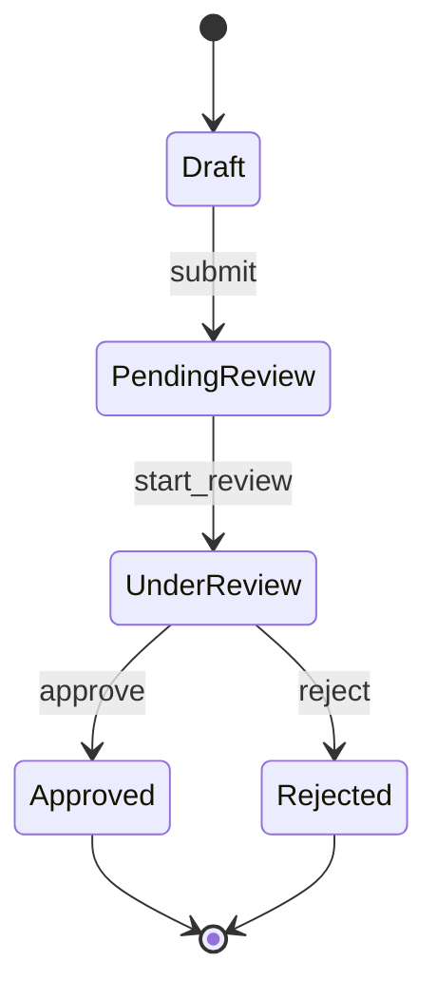
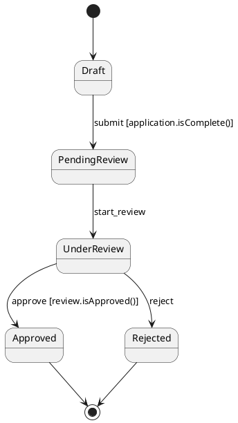
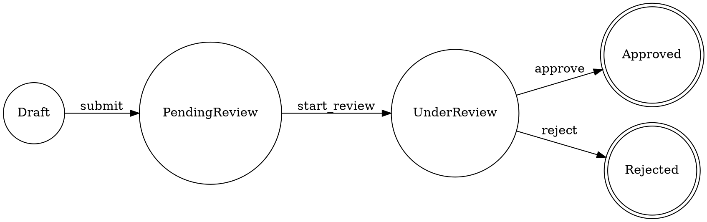

# Debugging and Visualization of Finite State Machines

## Overview

Debugging and visualizing Finite State Machines (FSMs) are critical capabilities for understanding system behavior, diagnosing issues, and communicating workflows to stakeholders. Unlike traditional imperative code where debuggers step through line-by-line execution, FSMs require specialized tools and techniques to inspect state transitions, trace event flows, and visualize machine topology. This document explores comprehensive debugging and visualization strategies for FSM implementations.

## Purpose

This explanation provides:

- Debugging techniques for FSM implementations
- Visualization tools and approaches
- Logging and observability patterns
- State machine inspection strategies
- Time-travel debugging capabilities
- Performance profiling for FSMs
- Common debugging scenarios and solutions

## Target Audience

- Software engineers debugging FSM implementations
- DevOps engineers monitoring state machine systems
- QA engineers investigating workflow failures
- Architects designing observability strategies
- Platform engineers building FSM infrastructure

## Prerequisites

- Understanding of FSM fundamentals (see `ex-so-ar-fsm__01-fundamentals-and-theory.md`)
- Familiarity with implementation patterns (see `ex-so-ar-fsm__04-implementation-patterns-approaches.md`)
- Basic knowledge of logging and monitoring
- Understanding of debugging principles

## Visualization Approaches

### Static Visualization

Static visualization renders FSM structure as diagrams for documentation and design review.

#### Mermaid Diagrams



#### PlantUML State Diagrams



#### Graphviz DOT Format



### Dynamic Visualization

Dynamic visualization shows real-time state machine execution.

#### XState Stately Inspector

```typescript
import { inspect } from "@xstate/inspect";
import { interpret } from "xstate";
import { zakatApplicationMachine } from "./machines";

// Enable inspector in development
if (process.env.NODE_ENV === "development") {
  inspect({
    iframe: false,
  });
}

const service = interpret(zakatApplicationMachine, {
  devTools: true, // Enable visualization
});

service.start();
```

**Features:**

- Real-time state visualization
- Event replay
- State tree exploration
- Context inspection

#### Spring State Machine Visualization

```java
@Configuration
public class StateMachineVisualizationConfig {

    @Bean
    public StateMachineMonitor<ZakatApplicationState, ZakatApplicationEvent> stateMachineMonitor() {
        return new LoggingStateMachineMonitor();
    }

    @Bean
    public StateMachineMonitorAdapter<ZakatApplicationState, ZakatApplicationEvent>
        stateMachineMonitorAdapter() {
        return new StateMachineMonitorAdapter<>() {
            @Override
            public void transition(
                StateContext<ZakatApplicationState, ZakatApplicationEvent> context
            ) {
                logger.info(
                    "Transition: {} -> {} (event: {})",
                    context.getSource().getId(),
                    context.getTarget().getId(),
                    context.getEvent()
                );
            }
        };
    }
}
```

### Code-Generated Visualization

Generate diagrams from FSM code automatically.

```typescript
// Generate diagram from XState machine
import { createMachine } from "xstate";
import { toSCXML } from "@xstate/scxml";

const machine = createMachine({
  id: "zakatApplication",
  initial: "draft",
  states: {
    draft: {
      on: { SUBMIT: "pendingReview" },
    },
    pendingReview: {
      on: { START_REVIEW: "underReview" },
    },
    underReview: {
      on: {
        APPROVE: "approved",
        REJECT: "rejected",
      },
    },
    approved: { type: "final" },
    rejected: { type: "final" },
  },
});

// Export to SCXML format
const scxml = toSCXML(machine);
console.log(scxml);
```

## Logging and Observability

### Structured Logging

```java
@Component
public class ZakatApplicationFSM {
    private static final Logger logger = LoggerFactory.getLogger(ZakatApplicationFSM.class);

    public void submitApplication(ZakatApplicationId applicationId) {
        MDC.put("applicationId", applicationId.value());
        MDC.put("currentState", application.getState().name());

        logger.info(
            "Processing state transition",
            kv("event", "SUBMIT"),
            kv("fromState", application.getState()),
            kv("toState", ZakatApplicationState.PENDING_REVIEW),
            kv("timestamp", Instant.now())
        );

        try {
            // Perform transition
            application.setState(ZakatApplicationState.PENDING_REVIEW);
            repository.save(application);

            logger.info(
                "State transition successful",
                kv("newState", application.getState())
            );
        } catch (Exception e) {
            logger.error(
                "State transition failed",
                kv("error", e.getMessage()),
                kv("cause", e.getCause())
            );
            throw e;
        } finally {
            MDC.clear();
        }
    }
}
```

### Metrics Collection

```java
@Component
public class FSMMetricsCollector {
    private final MeterRegistry meterRegistry;

    public void recordTransition(
        String machineId,
        String fromState,
        String toState,
        String event,
        long durationMs,
        boolean success
    ) {
        Timer.builder("fsm.transition.duration")
            .tag("machine", machineId)
            .tag("fromState", fromState)
            .tag("toState", toState)
            .tag("event", event)
            .tag("success", String.valueOf(success))
            .register(meterRegistry)
            .record(durationMs, TimeUnit.MILLISECONDS);

        Counter.builder("fsm.transition.count")
            .tag("machine", machineId)
            .tag("fromState", fromState)
            .tag("toState", toState)
            .tag("success", String.valueOf(success))
            .register(meterRegistry)
            .increment();
    }

    public void recordStateOccupancy(String machineId, String state, long durationMs) {
        Gauge.builder("fsm.state.occupancy", () -> durationMs)
            .tag("machine", machineId)
            .tag("state", state)
            .register(meterRegistry);
    }
}
```

### Distributed Tracing

```java
@Component
public class TracedZakatApplicationFSM {
    private final Tracer tracer;

    public void submitApplication(ZakatApplicationId applicationId) {
        Span span = tracer.spanBuilder("fsm.transition")
            .setAttribute("machine.id", "zakatApplication")
            .setAttribute("event", "SUBMIT")
            .setAttribute("applicationId", applicationId.value())
            .startSpan();

        try (Scope scope = span.makeCurrent()) {
            span.setAttribute("fromState", application.getState().name());

            // Perform transition
            application.setState(ZakatApplicationState.PENDING_REVIEW);

            span.setAttribute("toState", application.getState().name());
            span.setAttribute("success", true);

            repository.save(application);
        } catch (Exception e) {
            span.recordException(e);
            span.setAttribute("success", false);
            throw e;
        } finally {
            span.end();
        }
    }
}
```

## Debugging Techniques

### State History Tracking

```typescript
interface StateTransition {
  from: string;
  to: string;
  event: string;
  timestamp: number;
  context: any;
}

class FSMDebugger {
  private history: StateTransition[] = [];

  recordTransition(
    from: string,
    to: string,
    event: string,
    context: any
  ) {
    this.history.push({
      from,
      to,
      event,
      timestamp: Date.now(),
      context: JSON.parse(JSON.stringify(context)), // Deep clone
    });
  }

  getHistory(): StateTransition[] {
    return this.history;
  }

  printHistory() {
    console.table(
      this.history.map(t => ({
        Time: new Date(t.timestamp).toISOString(),
        'From': t.from,
        'Event': t.event,
        'To': t.to,
      }))
    );
  }

  findTransitionsByEvent(event: string): StateTransition[] {
    return this.history.filter(t => t.event === event);
  }

  getStateSequence(): string[] {
    const sequence = [this.history[0]?.from];
    this.history.forEach(t => sequence.push(t.to));
    return sequence.filter(Boolean);
  }
}

// Usage
const debugger = new FSMDebugger();

service.onTransition((state, event) => {
  debugger.recordTransition(
    state.history?.value as string,
    state.value as string,
    event.type,
    state.context
  );
});

// Later, inspect history
debugger.printHistory();
```

### Breakpoint Debugging

```typescript
import { createMachine, interpret } from "xstate";

const loanApplicationMachine = createMachine({
  id: "loanApplication",
  initial: "draft",
  states: {
    draft: {
      entry: () => {
        debugger; // Breakpoint on entering draft state
      },
      on: {
        SUBMIT: {
          target: "submitted",
          actions: (context, event) => {
            console.log("Submitting application", context);
            debugger; // Breakpoint on submit action
          },
        },
      },
    },
    submitted: {
      entry: (context) => {
        if (context.requestedAmount > 100000) {
          debugger; // Conditional breakpoint
        }
      },
    },
  },
});
```

### Event Replay

```typescript
class EventRecorder {
  private events: Array<{ type: string; payload?: any }> = [];

  record(event: { type: string; payload?: any }) {
    this.events.push({
      type: event.type,
      payload: JSON.parse(JSON.stringify(event.payload || {})),
    });
  }

  replay(service: any) {
    console.log(`Replaying ${this.events.length} events...`);

    this.events.forEach((event, index) => {
      console.log(`Event ${index + 1}/${this.events.length}:`, event);
      service.send(event);
    });
  }

  export(): string {
    return JSON.stringify(this.events, null, 2);
  }

  import(json: string) {
    this.events = JSON.parse(json);
  }
}

// Usage
const recorder = new EventRecorder();

service.onEvent((event) => {
  recorder.record(event);
});

// Save events for later replay
localStorage.setItem("fsm-events", recorder.export());

// Replay in new session
const savedEvents = localStorage.getItem("fsm-events");
if (savedEvents) {
  recorder.import(savedEvents);
  recorder.replay(service);
}
```

### State Snapshots

```java
@Component
public class StateSnapshotService {

    @Autowired
    private ObjectMapper objectMapper;

    public StateSnapshot captureSnapshot(
        ZakatApplication application,
        StateMachine<ZakatApplicationState, ZakatApplicationEvent> fsm
    ) {
        return StateSnapshot.builder()
            .applicationId(application.getId())
            .currentState(application.getState())
            .context(serializeContext(application))
            .stateMachineState(serializeStateMachineState(fsm))
            .timestamp(Instant.now())
            .build();
    }

    public void restoreSnapshot(StateSnapshot snapshot) {
        ZakatApplication application = repository.findById(snapshot.getApplicationId())
            .orElseThrow();

        application.setState(snapshot.getCurrentState());
        deserializeContext(snapshot.getContext(), application);

        repository.save(application);
    }

    private String serializeContext(ZakatApplication application) {
        try {
            return objectMapper.writeValueAsString(application);
        } catch (JsonProcessingException e) {
            throw new RuntimeException("Failed to serialize context", e);
        }
    }
}
```

## Time-Travel Debugging

### Temporal Time Travel

```typescript
// Temporal workflows support time travel debugging natively
import { Client } from "@temporalio/client";

const client = new Client();

// Get workflow handle
const handle = client.workflow.getHandle("loan-application-001");

// Query workflow history
const history = await handle.fetchHistory();

// View all state transitions
history.events.forEach((event, index) => {
  console.log(`Event ${index}:`, {
    type: event.eventType,
    time: event.eventTime,
    attributes: event.attributes,
  });
});

// Replay workflow from specific point
const replayedState = await client.workflow.replay({
  workflowId: "loan-application-001",
  upToEventId: 50, // Replay up to event 50
});
```

### Custom Time-Travel Implementation

```typescript
interface FSMSnapshot {
  state: string;
  context: any;
  timestamp: number;
  eventIndex: number;
}

class TimeTravelDebugger {
  private snapshots: FSMSnapshot[] = [];
  private currentIndex: number = -1;

  captureSnapshot(state: string, context: any, eventIndex: number) {
    this.snapshots.push({
      state,
      context: JSON.parse(JSON.stringify(context)),
      timestamp: Date.now(),
      eventIndex,
    });
    this.currentIndex = this.snapshots.length - 1;
  }

  goBack(): FSMSnapshot | null {
    if (this.currentIndex > 0) {
      this.currentIndex--;
      return this.snapshots[this.currentIndex];
    }
    return null;
  }

  goForward(): FSMSnapshot | null {
    if (this.currentIndex < this.snapshots.length - 1) {
      this.currentIndex++;
      return this.snapshots[this.currentIndex];
    }
    return null;
  }

  goToTime(timestamp: number): FSMSnapshot | null {
    const index = this.snapshots.findIndex((s) => s.timestamp >= timestamp);
    if (index !== -1) {
      this.currentIndex = index;
      return this.snapshots[index];
    }
    return null;
  }

  getCurrent(): FSMSnapshot {
    return this.snapshots[this.currentIndex];
  }
}
```

## Performance Profiling

### Transition Duration Tracking

```java
@Aspect
@Component
public class FSMPerformanceProfiler {
    private static final Logger logger = LoggerFactory.getLogger(FSMPerformanceProfiler.class);

    @Around("@annotation(com.oseplatform.fsm.Transition)")
    public Object profileTransition(ProceedingJoinPoint joinPoint) throws Throwable {
        long startTime = System.nanoTime();
        String methodName = joinPoint.getSignature().getName();

        try {
            Object result = joinPoint.proceed();
            long duration = System.nanoTime() - startTime;

            logger.info(
                "Transition completed",
                kv("method", methodName),
                kv("durationMs", duration / 1_000_000)
            );

            if (duration > 1_000_000_000) { // > 1 second
                logger.warn(
                    "Slow transition detected",
                    kv("method", methodName),
                    kv("durationMs", duration / 1_000_000)
                );
            }

            return result;
        } catch (Throwable e) {
            long duration = System.nanoTime() - startTime;
            logger.error(
                "Transition failed",
                kv("method", methodName),
                kv("durationMs", duration / 1_000_000),
                kv("error", e.getMessage())
            );
            throw e;
        }
    }
}
```

### State Occupancy Analysis

```typescript
class StateOccupancyTracker {
  private stateEntryTimes = new Map<string, number>();
  private stateOccupancy = new Map<string, number[]>();

  onEnterState(state: string) {
    this.stateEntryTimes.set(state, Date.now());
  }

  onExitState(state: string) {
    const entryTime = this.stateEntryTimes.get(state);
    if (entryTime) {
      const duration = Date.now() - entryTime;

      if (!this.stateOccupancy.has(state)) {
        this.stateOccupancy.set(state, []);
      }

      this.stateOccupancy.get(state)!.push(duration);
      this.stateEntryTimes.delete(state);
    }
  }

  getStatistics() {
    const stats = new Map<
      string,
      {
        count: number;
        totalMs: number;
        avgMs: number;
        minMs: number;
        maxMs: number;
      }
    >();

    for (const [state, durations] of this.stateOccupancy) {
      const count = durations.length;
      const totalMs = durations.reduce((sum, d) => sum + d, 0);
      const avgMs = totalMs / count;
      const minMs = Math.min(...durations);
      const maxMs = Math.max(...durations);

      stats.set(state, { count, totalMs, avgMs, minMs, maxMs });
    }

    return stats;
  }

  printReport() {
    console.log("State Occupancy Report");
    console.log("======================\n");

    for (const [state, stats] of this.getStatistics()) {
      console.log(`State: ${state}`);
      console.log(`  Count: ${stats.count}`);
      console.log(`  Total: ${stats.totalMs.toFixed(2)} ms`);
      console.log(`  Avg: ${stats.avgMs.toFixed(2)} ms`);
      console.log(`  Min: ${stats.minMs.toFixed(2)} ms`);
      console.log(`  Max: ${stats.maxMs.toFixed(2)} ms`);
      console.log("");
    }
  }
}
```

## Common Debugging Scenarios

### Scenario 1: Unexpected State Transition

**Problem**: FSM transitions to wrong state.

**Debugging Approach**:

```typescript
// Add detailed logging to guards
const machine = createMachine({
  states: {
    submitted: {
      on: {
        APPROVE: {
          target: "approved",
          guard: (context) => {
            const result = context.creditScore > 700;
            console.log("[Guard] Checking approval criteria:", {
              creditScore: context.creditScore,
              threshold: 700,
              passed: result,
            });
            return result;
          },
        },
      },
    },
  },
});
```

### Scenario 2: Missing Transition

**Problem**: Event doesn't trigger expected transition.

**Debugging Approach**:

```typescript
service.onEvent((event) => {
  console.log("[Event Received]", {
    event: event.type,
    currentState: service.state.value,
    possibleTransitions: service.state.nextEvents,
  });

  if (!service.state.nextEvents.includes(event.type)) {
    console.warn("[Invalid Event]", {
      event: event.type,
      currentState: service.state.value,
      validEvents: service.state.nextEvents,
    });
  }
});
```

### Scenario 3: Context Mutation

**Problem**: State machine context being mutated unexpectedly.

**Debugging Approach**:

```typescript
import { createMachine, assign } from "xstate";

// Create proxy to detect mutations
function createObservableContext<T extends object>(context: T): T {
  return new Proxy(context, {
    set(target, property, value) {
      console.warn("[Context Mutation Detected]", {
        property,
        oldValue: target[property as keyof T],
        newValue: value,
        stackTrace: new Error().stack,
      });
      target[property as keyof T] = value;
      return true;
    },
  });
}

const machine = createMachine({
  context: createObservableContext({
    applicationId: "",
    amount: 0,
  }),
  // ...
});
```

## Visualization Tools Comparison

| Tool                         | Type    | Features                                    | Best For                |
| ---------------------------- | ------- | ------------------------------------------- | ----------------------- |
| **XState Stately Inspector** | Dynamic | Real-time, event replay, context inspection | Development, debugging  |
| **Mermaid**                  | Static  | Simple syntax, GitHub integration           | Documentation           |
| **PlantUML**                 | Static  | Rich syntax, customization                  | Architecture docs       |
| **Graphviz**                 | Static  | Programmatic generation                     | Code-generated diagrams |
| **Temporal Web UI**          | Dynamic | Workflow history, time-travel               | Production debugging    |
| **Spring State Machine Viz** | Static  | Spring integration                          | Java applications       |

## Best Practices

### Practice 1: Log All Transitions

```java
@Component
public class TransitionLogger {

    @EventListener
    public void onStateChange(StateMachineEvent event) {
        logger.info(
            "State transition occurred",
            kv("machineId", event.getStateMachine().getId()),
            kv("fromState", event.getSource().getId()),
            kv("toState", event.getTarget().getId()),
            kv("event", event.getEvent()),
            kv("timestamp", Instant.now())
        );
    }
}
```

### Practice 2: Version State Machine Definitions

```typescript
const machine = createMachine({
  id: "loanApplication",
  version: "2.1.0", // Track version
  meta: {
    changelog: [
      {
        version: "2.1.0",
        date: "2024-11-20",
        changes: ["Added manual review state"],
      },
      {
        version: "2.0.0",
        date: "2024-10-15",
        changes: ["Restructured approval flow"],
      },
    ],
  },
  // ...
});
```

### Practice 3: Export State Machine Definitions

```typescript
import { createMachine } from "xstate";
import fs from "fs";

// Export machine definition as JSON
const machineDefinition = machine.definition;
fs.writeFileSync("loan-application-fsm.json", JSON.stringify(machineDefinition, null, 2));

// Export as Mermaid diagram
function toMermaid(machine: any): string {
  let diagram = "stateDiagram-v2\n";

  function addState(stateNode: any, prefix = "") {
    const stateName = prefix + stateNode.key;

    // Add transitions
    for (const [event, transitions] of Object.entries(stateNode.on || {})) {
      const targets = Array.isArray(transitions) ? transitions : [transitions];
      for (const transition of targets) {
        const target = transition.target || transition;
        diagram += `  ${stateName} --> ${target}: ${event}\n`;
      }
    }

    // Add child states
    for (const childNode of Object.values(stateNode.states || {})) {
      addState(childNode as any, stateName + ".");
    }
  }

  addState(machine.definition);
  return diagram;
}

const mermaidDiagram = toMermaid(machine);
fs.writeFileSync("loan-application-fsm.mmd", mermaidDiagram);
```

## Related Documentation

- **FSM Fundamentals**: `ex-so-ar-fsm__01-fundamentals-and-theory.md`
- **Implementation Patterns**: `ex-so-ar-fsm__04-implementation-patterns-approaches.md`
- **Testing FSMs**: `ex-so-ar-fsm__12-testing-fsm-implementations.md`
- **Best Practices**: `ex-so-ar-fsm__17-best-practices.md`

## Summary

Effective FSM debugging and visualization requires:

- **Multiple Visualization Approaches**: Static diagrams for documentation, dynamic tools for debugging
- **Comprehensive Logging**: Structured logs for all transitions, events, and context changes
- **Performance Monitoring**: Track transition durations and state occupancy
- **Time-Travel Debugging**: Replay events and inspect historical states
- **Tooling Integration**: Leverage framework-specific tools (XState Inspector, Temporal UI)

Key practices:

1. Always log state transitions with full context
2. Use visualization tools during development
3. Implement event replay for bug reproduction
4. Track performance metrics for optimization
5. Version state machine definitions
6. Export machine definitions for documentation

Proper debugging and visualization capabilities transform FSMs from black boxes into transparent, understandable systems.

## Principles Applied

- **Explicit Over Implicit**: Clear visualization makes FSM behavior explicit
- **Documentation First**: Diagrams serve as living documentation
- **Automation Over Manual**: Automated logging and visualization
- **Robustness and Reliability**: Comprehensive debugging enables reliable systems
