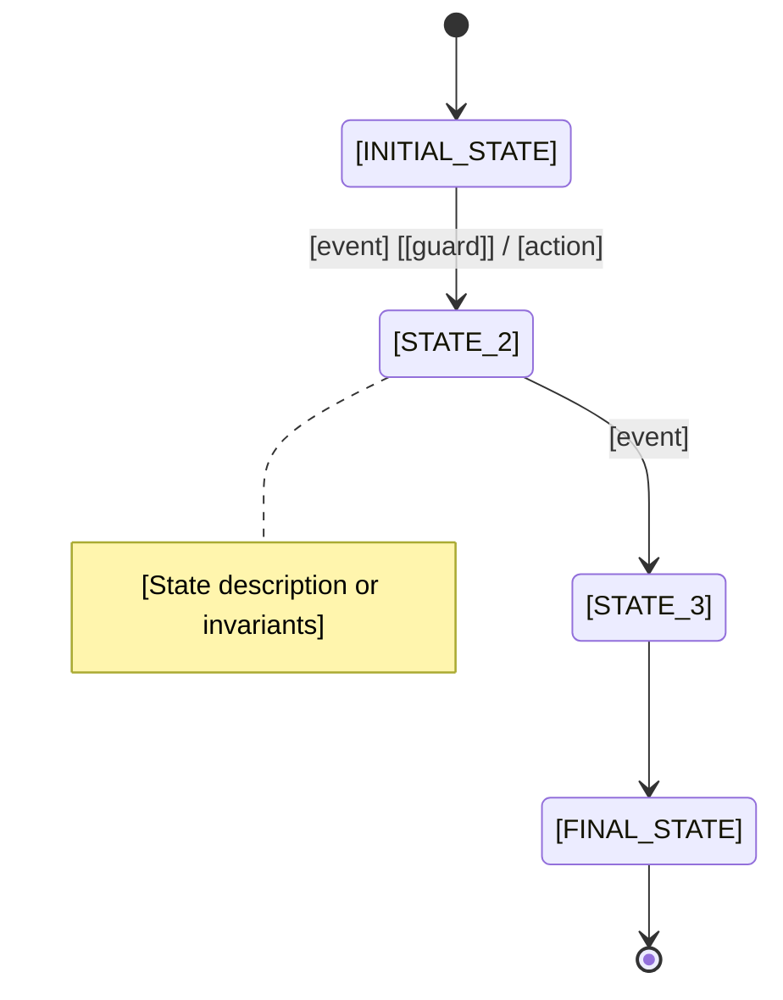

# Template: Blank State Machine Diagram

## Purpose

This template provides a complete structure for documenting a Finite State Machine using:

- **Mermaid state diagram syntax** for visual representation
- **WCAG AA compliant color palette** for accessibility
- **State table** documenting all states and their properties
- **Transition table** documenting all valid transitions
- **Legend and notation guide** for diagram clarity

Use this template to create clear, professional FSM documentation that can be:

- Rendered in Markdown viewers (GitHub, GitLab, documentation sites)
- Included in technical specifications
- Shared with stakeholders for review
- Used as living documentation that stays synchronized with code

## When to Use This Template

Use this template when:

- Starting FSM design (design-first approach)
- Documenting an existing FSM (documentation-after approach)
- Creating technical specifications for FSM implementation
- Communicating FSM design to stakeholders
- Generating visual documentation from code

**Prerequisite**: Basic understanding of FSM concepts (states, transitions, events, guards, actions). See [Core Concepts and Terminology](../ex-so-ar-fsm__02-core-concepts-and-terminology.md).

## Template Structure

### Section 1: Overview

Brief description of the FSM's purpose and context.

### Section 2: Mermaid State Diagram

Visual representation using Mermaid syntax with WCAG AA colors.

### Section 3: Legend and Notation

Explanation of diagram symbols, colors, and notation.

### Section 4: State Table

Tabular documentation of all states with entry/exit actions.

### Section 5: Transition Table

Tabular documentation of all transitions with events, guards, and actions.

---

## Template Content

````markdown
---
title: "[FSM Name] State Machine Diagram"
description: State machine for [brief description of entity/process]
tags:
  - explanation
  - software
  - architecture
  - fsm
  - diagram
  - [domain-tag]
last_updated: [YYYY-MM-DD]
---

# [FSM Name] State Machine Diagram

## Overview

**Entity/Process**: [Name of entity or business process]

**Purpose**: [1-2 sentence description of what this FSM models]

**Domain**: [OSE domain area - e.g., Zakat, Contracts, Campaigns, Loans]

**Complexity**: [Simple | Medium | Complex] - [Brief justification]

**FSM Type**: [Flat | Hierarchical | Concurrent | EFSM]

## State Diagram


````

### Color Palette (WCAG AA Compliant)

This diagram uses the OSE-standard color palette for accessibility:

- **Blue (#2196F3)**: Normal states
- **Green (#4CAF50)**: Success/completion states
- **Orange (#FF9800)**: Warning/caution states
- **Red (#f44336)**: Error/rejection states
- **Purple (#9C27B0)**: Special/composite states

**Color reference**: See [DDD Color Palette](../../domain-driven-design-ddd/templates/ex-so-ar-dodrdedd-te__color-palette.md)

## Legend and Notation

| Symbol                   | Meaning              | Description                               |
| ------------------------ | -------------------- | ----------------------------------------- |
| `[*]`                    | Initial pseudo-state | Entry point when FSM starts               |
| `[*]` (at end)           | Final pseudo-state   | Terminal state (FSM ends)                 |
| `STATE_NAME`             | State                | A discrete condition or phase             |
| `→`                      | Transition           | Directed edge from source to target state |
| `event [guard] / action` | Transition label     | Event triggers, guard conditions, actions |
| `note right of STATE`    | Annotation           | Additional state documentation            |

### Transition Notation

**Format**: `source_state --> target_state : event [guard] / action`

**Components**:

- **event**: Trigger that causes transition (required)
- **[guard]**: Boolean condition in square brackets (optional)
- **/action**: Side effect executed during transition (optional)

**Examples**:

- `DRAFT --> SUBMITTED : submit` - Simple transition
- `SUBMITTED --> APPROVED : approve [score >= 80]` - Transition with guard
- `APPROVED --> ACTIVE : activate / send_notification` - Transition with action
- `ACTIVE --> COMPLETED : complete [all_tasks_done] / finalize_report` - All components

## State Table

| State Name    | Type         | Description             | Entry Action      | Exit Action      | Invariants                  |
| ------------- | ------------ | ----------------------- | ----------------- | ---------------- | --------------------------- |
| [STATE_1]     | Initial      | [Purpose of this state] | [Action on entry] | [Action on exit] | [Conditions that must hold] |
| [STATE_2]     | Intermediate | [Purpose of this state] | [Action on entry] | [Action on exit] | [Conditions that must hold] |
| [FINAL_STATE] | Final        | [Purpose of this state] | [Action on entry] | N/A              | [Conditions that must hold] |

### State Details

#### [STATE_1] (Initial State)

- **Purpose**: [Detailed description]
- **Entry condition**: Always (initial state)
- **Exit condition**: [When and why entity leaves this state]
- **Allowed operations**: [What can be done while in this state]
- **Validations**: [Any validation rules specific to this state]
- **Context variables**: [Which context vars are relevant]

#### [STATE_2]

- **Purpose**: [Detailed description]
- **Entry condition**: [From which states can enter]
- **Exit condition**: [To which states can exit]
- **Allowed operations**: [What can be done while in this state]
- **Validations**: [Any validation rules specific to this state]
- **Context variables**: [Which context vars are relevant]

#### [FINAL_STATE] (Terminal State)

- **Purpose**: [Detailed description]
- **Entry condition**: [From which states can enter]
- **Exit condition**: None (terminal state)
- **Immutability**: [What is immutable after reaching this state]
- **Audit significance**: [Why this state matters for audit/compliance]

## Transition Table

| From State | Event        | Guard             | To State      | Action        | Description            |
| ---------- | ------------ | ----------------- | ------------- | ------------- | ---------------------- |
| [STATE_1]  | [event_name] | -                 | [STATE_2]     | [action_name] | [What happens and why] |
| [STATE_2]  | [event_name] | [guard_condition] | [STATE_3]     | [action_name] | [What happens and why] |
| [STATE_3]  | [event_name] | -                 | [FINAL_STATE] | [action_name] | [What happens and why] |

### Invalid Transitions

The following transitions are **explicitly disallowed**:

| From State    | Event           | Reason                                     |
| ------------- | --------------- | ------------------------------------------ |
| [STATE_3]     | [invalid_event] | [Business rule preventing this transition] |
| [FINAL_STATE] | [any_event]     | Terminal state - no outgoing transitions   |

### Guard Specifications

| Guard Name   | Condition            | Rationale                           |
| ------------ | -------------------- | ----------------------------------- |
| [guard_name] | [Boolean expression] | [Business rule this guard enforces] |

**Example**:

| Guard Name            | Condition                                                  | Rationale                                             |
| --------------------- | ---------------------------------------------------------- | ----------------------------------------------------- |
| `nisab_threshold_met` | `totalWealth >= nisabThreshold`                            | Zakat only obligatory when wealth exceeds Nisab       |
| `shariah_compliant`   | `contract.hasRiba == false && contract.hasGharar == false` | Islamic contracts must avoid interest and uncertainty |

### Action Specifications

| Action Name   | Side Effect    | Idempotent? | Error Handling           |
| ------------- | -------------- | ----------- | ------------------------ |
| [action_name] | [What it does] | [Yes/No]    | [How errors are handled] |

**Example**:

| Action Name         | Side Effect                  | Idempotent? | Error Handling                       |
| ------------------- | ---------------------------- | ----------- | ------------------------------------ |
| `send_notification` | Sends email to stakeholders  | No          | Log failure, do not block transition |
| `record_payment`    | Inserts payment record in DB | Yes         | Fail transition on error             |

## Context Variables (EFSM)

If this FSM uses extended state (context variables):

| Variable Name | Type   | Purpose          | Initial Value   | Mutability                |
| ------------- | ------ | ---------------- | --------------- | ------------------------- |
| [var_name]    | [Type] | [What it tracks] | [Initial value] | [Which states can modify] |

**Example**:

| Variable Name | Type  | Purpose                                          | Initial Value | Mutability                               |
| ------------- | ----- | ------------------------------------------------ | ------------- | ---------------------------------------- |
| `totalWealth` | Money | Sum of all assets for Zakat calculation          | 0             | Modified in IN_PROGRESS state            |
| `zakatAmount` | Money | Calculated Zakat due (2.5% of qualifying wealth) | 0             | Set in CALCULATED state, immutable after |
| `paidAmount`  | Money | Amount of Zakat paid                             | 0             | Incremented in PAYMENT state             |

## Business Rules

Key business rules enforced by this FSM:

1. **[Rule 1]**: [Description and how FSM enforces it]
2. **[Rule 2]**: [Description and how FSM enforces it]
3. **[Rule 3]**: [Description and how FSM enforces it]

**Example**:

1. **Nisab threshold**: Zakat only calculated if `totalWealth >= nisabThreshold` (enforced by guard on transition to CALCULATED)
2. **Immutability after payment**: Once in PAID state, assessment cannot be modified (enforced by no transitions from PAID back to earlier states)
3. **Audit trail**: Every state transition must be logged with timestamp and actor (enforced by transition actions)

## Related Documentation

- **[Related FSM or Feature]**: [Link to related documentation]
- **Business requirements**: [Link to requirements doc]
- **Implementation**: [Link to code or implementation guide]
- **Test cases**: [Link to test documentation]

## Notes and Assumptions

- [Any important notes about this FSM]
- [Assumptions made during design]
- [Known limitations or future enhancements]

---

## Diagram Maintenance

**Last updated**: [YYYY-MM-DD]

**Last updated by**: [Name or team]

**Change history**:

- [YYYY-MM-DD]: [Brief description of change]
- [YYYY-MM-DD]: [Brief description of change]

**Synchronization**: This diagram should be kept synchronized with:

- Implementation code: [Path to FSM implementation]
- Test cases: [Path to FSM tests]
- API specification: [Link if applicable]

````

---

## Filled Example: Zakat Assessment FSM

Below is a complete example using this template for a Zakat Assessment FSM.

```markdown
---
title: "Zakat Assessment State Machine Diagram"
description: State machine for Zakat obligatory charity assessment lifecycle from draft to payment
tags:
  - explanation
  - software
  - architecture
  - fsm
  - diagram
  - zakat
  - islamic-finance
last_updated: 2026-01-21
---

# Zakat Assessment State Machine Diagram

## Overview

**Entity/Process**: Zakat Assessment

**Purpose**: Models the lifecycle of a Zakat assessment from initial draft through wealth calculation, review, and payment recording.

**Domain**: Zakat (Islamic obligatory charity)

**Complexity**: Medium - 5 states with context variables for wealth tracking

**FSM Type**: EFSM (Extended FSM with context for wealth amounts)

## State Diagram

```mermaid
stateDiagram-v2
    [*] --> DRAFT

    DRAFT --> IN_PROGRESS : start_calculation [wealth_data_entered]
    DRAFT --> CANCELLED : cancel

    IN_PROGRESS --> CALCULATED : complete_calculation [nisab_met]
    IN_PROGRESS --> INSUFFICIENT : complete_calculation [!nisab_met]
    IN_PROGRESS --> DRAFT : save_draft

    CALCULATED --> PAID : record_payment [amount_verified]
    CALCULATED --> IN_PROGRESS : adjust_calculation

    INSUFFICIENT --> DRAFT : update_wealth
    PAID --> [*]
    CANCELLED --> [*]

    note right of DRAFT
      User creates assessment
      Can edit all wealth fields
      No validation enforced yet
    end note

    note right of IN_PROGRESS
      Calculation in progress
      Wealth data validated
      Nisab threshold checked
    end note

    note right of CALCULATED
      Zakat amount determined
      Amount is frozen
      Payment can be recorded
    end note

    note right of PAID
      Payment confirmed
      Assessment immutable
      Audit record created
    end note
````

### Color Palette (WCAG AA Compliant)

This diagram uses the OSE-standard color palette:

- **Blue (#2196F3)**: DRAFT, IN_PROGRESS (normal workflow states)
- **Green (#4CAF50)**: CALCULATED, PAID (success states)
- **Orange (#FF9800)**: INSUFFICIENT (caution - below Nisab)
- **Red (#f44336)**: CANCELLED (error/termination)

## Legend and Notation

| Symbol                   | Meaning              | Description                              |
| ------------------------ | -------------------- | ---------------------------------------- |
| `[*]`                    | Initial pseudo-state | Assessment creation entry point          |
| `[*]` (at end)           | Final pseudo-state   | Assessment finalized (PAID or CANCELLED) |
| `STATE_NAME`             | State                | Assessment lifecycle stage               |
| `→`                      | Transition           | State change triggered by event          |
| `event [guard] / action` | Transition label     | Event with optional guard and action     |
| `note right of STATE`    | Annotation           | State-specific documentation             |

## State Table

| State Name   | Type         | Description                       | Entry Action                          | Exit Action            | Invariants                     |
| ------------ | ------------ | --------------------------------- | ------------------------------------- | ---------------------- | ------------------------------ |
| DRAFT        | Initial      | User creates and edits assessment | `log("Assessment created")`           | `validateWealthData()` | Can be incomplete              |
| IN_PROGRESS  | Intermediate | Calculation underway              | `lockEditing()`, `startCalculation()` | `unlockEditing()`      | Wealth data valid              |
| CALCULATED   | Intermediate | Zakat amount computed             | `freezeAmount()`, `generateReceipt()` | -                      | `zakatAmount > 0`              |
| INSUFFICIENT | Intermediate | Wealth below Nisab threshold      | `notifyUser("Below Nisab")`           | -                      | `totalWealth < nisabThreshold` |
| PAID         | Final        | Payment recorded                  | `recordAudit()`, `sendReceipt()`      | N/A                    | `paidAmount >= zakatAmount`    |
| CANCELLED    | Final        | Assessment cancelled              | `recordCancellation()`                | N/A                    | N/A                            |

### State Details

#### DRAFT (Initial State)

- **Purpose**: User creates new assessment and enters wealth data
- **Entry condition**: Always (initial state when assessment created)
- **Exit condition**: User starts calculation (→ IN_PROGRESS) or cancels (→ CANCELLED)
- **Allowed operations**: Create, read, update wealth data fields
- **Validations**: None (permissive editing state)
- **Context variables**: `totalWealth`, `cashAmount`, `goldAmount`, `silverAmount`, etc. (all editable)

#### IN_PROGRESS

- **Purpose**: System validates data and calculates Zakat
- **Entry condition**: From DRAFT with `wealth_data_entered` guard
- **Exit condition**: Calculation completes → CALCULATED or INSUFFICIENT, or user saves draft → DRAFT
- **Allowed operations**: View calculation progress, save draft
- **Validations**: Wealth data completeness, Nisab threshold check
- **Context variables**: `totalWealth` (readonly), `nisabThreshold` (readonly)

#### CALCULATED

- **Purpose**: Zakat amount determined and frozen
- **Entry condition**: From IN_PROGRESS with `nisab_met` guard (wealth >= Nisab)
- **Exit condition**: Payment recorded → PAID, or user adjusts → IN_PROGRESS
- **Allowed operations**: View receipt, record payment
- **Validations**: `zakatAmount == totalWealth * 0.025` (2.5%)
- **Context variables**: `zakatAmount` (readonly, frozen)

#### INSUFFICIENT

- **Purpose**: Wealth below Nisab (Zakat not obligatory)
- **Entry condition**: From IN_PROGRESS with `!nisab_met` guard
- **Exit condition**: User updates wealth → DRAFT
- **Allowed operations**: View explanation, update wealth data
- **Validations**: `totalWealth < nisabThreshold`
- **Context variables**: `deficitAmount = nisabThreshold - totalWealth` (calculated)

#### PAID (Terminal State)

- **Purpose**: Payment confirmed, assessment finalized
- **Entry condition**: From CALCULATED with `amount_verified` guard
- **Exit condition**: None (terminal)
- **Immutability**: All fields immutable, audit log only
- **Audit significance**: Permanent record for compliance

#### CANCELLED (Terminal State)

- **Purpose**: Assessment cancelled before completion
- **Entry condition**: From DRAFT
- **Exit condition**: None (terminal)
- **Immutability**: All fields immutable
- **Audit significance**: Record of cancellation for audit trail

## Transition Table

| From State   | Event                  | Guard                 | To State     | Action                                | Description                        |
| ------------ | ---------------------- | --------------------- | ------------ | ------------------------------------- | ---------------------------------- |
| DRAFT        | `start_calculation`    | `wealth_data_entered` | IN_PROGRESS  | `lockEditing()`, `startCalculation()` | User initiates calculation         |
| DRAFT        | `cancel`               | -                     | CANCELLED    | `recordCancellation()`                | User cancels assessment            |
| IN_PROGRESS  | `complete_calculation` | `nisab_met`           | CALCULATED   | `freezeAmount()`, `generateReceipt()` | Calculation complete, above Nisab  |
| IN_PROGRESS  | `complete_calculation` | `!nisab_met`          | INSUFFICIENT | `notifyUser("Below Nisab")`           | Calculation complete, below Nisab  |
| IN_PROGRESS  | `save_draft`           | -                     | DRAFT        | `saveProgress()`                      | User saves draft mid-calculation   |
| CALCULATED   | `record_payment`       | `amount_verified`     | PAID         | `recordAudit()`, `sendReceipt()`      | Payment recorded and verified      |
| CALCULATED   | `adjust_calculation`   | -                     | IN_PROGRESS  | `unlockAmount()`                      | User adjusts wealth data           |
| INSUFFICIENT | `update_wealth`        | -                     | DRAFT        | -                                     | User updates wealth to recalculate |

### Invalid Transitions

| From State | Event                | Reason                                                                          |
| ---------- | -------------------- | ------------------------------------------------------------------------------- |
| CALCULATED | `cancel`             | Cannot cancel after calculation (must go to PAID or adjust back to IN_PROGRESS) |
| PAID       | `adjust_calculation` | Immutable terminal state                                                        |
| PAID       | `cancel`             | Cannot cancel finalized assessment                                              |
| CANCELLED  | `start_calculation`  | Terminal state, no resurrection                                                 |

### Guard Specifications

| Guard Name            | Condition                                                 | Rationale                                   |
| --------------------- | --------------------------------------------------------- | ------------------------------------------- |
| `wealth_data_entered` | `cashAmount >= 0 && goldAmount >= 0 && silverAmount >= 0` | Cannot calculate without wealth data        |
| `nisab_met`           | `totalWealth >= nisabThreshold`                           | Zakat only obligatory above Nisab threshold |
| `amount_verified`     | `paidAmount >= zakatAmount && paymentMethod != null`      | Payment must cover full amount              |

### Action Specifications

| Action Name          | Side Effect                     | Idempotent? | Error Handling              |
| -------------------- | ------------------------------- | ----------- | --------------------------- |
| `lockEditing()`      | Sets `isEditable = false` flag  | Yes         | No errors expected          |
| `startCalculation()` | Triggers async calculation job  | No          | Retry on failure            |
| `freezeAmount()`     | Sets `zakatAmount` as immutable | Yes         | No errors expected          |
| `generateReceipt()`  | Creates PDF receipt             | No          | Log failure, continue       |
| `recordAudit()`      | Inserts audit log entry         | Yes         | Fail transition on DB error |
| `sendReceipt()`      | Emails receipt to user          | No          | Log failure, do not block   |

## Context Variables (EFSM)

| Variable Name     | Type           | Purpose                                      | Initial Value | Mutability                        |
| ----------------- | -------------- | -------------------------------------------- | ------------- | --------------------------------- |
| `totalWealth`     | Money          | Sum of all assets                            | 0.00          | Editable in DRAFT, readonly after |
| `cashAmount`      | Money          | Cash holdings                                | 0.00          | Editable in DRAFT                 |
| `goldAmount`      | Weight (grams) | Gold holdings                                | 0.00          | Editable in DRAFT                 |
| `silverAmount`    | Weight (grams) | Silver holdings                              | 0.00          | Editable in DRAFT                 |
| `investmentValue` | Money          | Investment portfolio value                   | 0.00          | Editable in DRAFT                 |
| `nisabThreshold`  | Money          | Minimum wealth for Zakat obligation          | 3500.00 USD   | Readonly (system config)          |
| `zakatAmount`     | Money          | Calculated Zakat (2.5% of qualifying wealth) | 0.00          | Set in CALCULATED, immutable      |
| `paidAmount`      | Money          | Amount paid                                  | 0.00          | Set in PAID                       |
| `paidAt`          | DateTime       | Payment timestamp                            | null          | Set in PAID                       |

## Business Rules

1. **Nisab threshold**: Zakat only obligatory if `totalWealth >= nisabThreshold` (currently 3500 USD, equivalent to 85g gold)
2. **2.5% rate**: Zakat amount is always 2.5% of qualifying wealth (`zakatAmount = totalWealth * 0.025`)
3. **Immutability after payment**: Once PAID, no modifications allowed (enforced by terminal state)
4. **Audit trail**: Every state transition logged with timestamp, actor, from_state, to_state
5. **Annual obligation**: Assessments reset annually (Hawl - one lunar year)

## Related Documentation

- **Zakat calculation rules**: [Islamic Jurisprudence Reference](../../../../../docs/explanation/islamic-finance/zakat/)
- **Implementation**: `apps/ose-platform/src/domain/zakat/assessment-fsm.ts`
- **Test cases**: `apps/ose-platform/tests/zakat/assessment-fsm.test.ts`
- **API endpoints**: `POST /api/v1/zakat/assessments`, `PATCH /api/v1/zakat/assessments/:id/state`

## Notes and Assumptions

- Nisab threshold updates annually based on gold price (requires recalculation for all DRAFT assessments)
- Multi-currency support: All amounts converted to USD at time of calculation
- Partial payments not supported in v1 (future enhancement)
- Assumption: User has single assessment per lunar year (no overlapping assessments)

---

## Diagram Maintenance

**Last updated**: 2026-01-21

**Last updated by**: OSE Platform Team

**Change history**:

- 2026-01-21: Initial FSM design with 5 states
- 2026-01-15: Added INSUFFICIENT state for below-Nisab cases
- 2026-01-10: Added context variables for wealth tracking

**Synchronization**: This diagram is synchronized with:

- Implementation: `apps/ose-platform/src/domain/zakat/assessment-fsm.ts`
- Tests: `apps/ose-platform/tests/zakat/assessment-fsm.test.ts`
- API spec: `apps/ose-platform/docs/api/zakat-endpoints.md`

```

---

## Usage Instructions

### Step 1: Copy Template

Copy the template section above (between the markdown code blocks) into your new file.

### Step 2: Replace Placeholders

Replace all placeholders (marked with `[BRACKETS]`):

- `[FSM Name]`: Name of your FSM (e.g., "Contract Approval")
- `[STATE_NAME]`: Actual state names (e.g., "DRAFT", "APPROVED")
- `[event]`: Event names (e.g., "submit", "approve")
- `[guard]`: Guard conditions (e.g., "score >= 80")
- `[action]`: Action names (e.g., "send_email", "log_audit")
- `[YYYY-MM-DD]`: Current date
- All other bracketed placeholders with your content

### Step 3: Create Mermaid Diagram

Draw your FSM using Mermaid `stateDiagram-v2` syntax:

1. Start with `[*] --> INITIAL_STATE`
2. Add all transitions: `STATE_A --> STATE_B : event [guard] / action`
3. End with terminal states: `FINAL_STATE --> [*]`
4. Add notes for complex states: `note right of STATE_NAME`
5. Test diagram in [Mermaid Live Editor](https://mermaid.live/)

### Step 4: Fill State Table

Document each state:

- **State name**: UPPER_SNAKE_CASE convention
- **Type**: Initial, Intermediate, or Final
- **Description**: 1-sentence purpose
- **Entry/Exit actions**: What happens when entering/exiting
- **Invariants**: Conditions that must hold while in state

### Step 5: Fill Transition Table

Document each transition:

- **From/To states**: Source and target
- **Event**: Trigger name
- **Guard**: Boolean condition (or "-" if none)
- **Action**: Side effect (or "-" if none)
- **Description**: What happens and why

### Step 6: Validate

- [ ] All states in diagram appear in state table
- [ ] All transitions in diagram appear in transition table
- [ ] All guards have specifications
- [ ] All actions have specifications
- [ ] Context variables documented (if EFSM)
- [ ] Business rules clearly stated
- [ ] Diagram renders correctly in Mermaid Live Editor

## Tips and Best Practices

1. **Start simple**: Begin with 3-5 core states, expand later
2. **Use consistent naming**: UPPER_SNAKE_CASE for states, lowercase_snake_case for events/actions
3. **Document guards**: Every guard should have a specification explaining the business rule
4. **Annotate complex states**: Use notes in Mermaid for states with complex logic
5. **Keep diagram readable**: If more than 10 states, consider hierarchical decomposition
6. **Sync with code**: Diagram should match implementation; use CI to validate
7. **Version control**: Track changes in git, use PRs for FSM design reviews

## Related Templates

- **[Hierarchical State Machine Diagram](./ex-so-ar-fsm-te__hierarchical-state-machine-diagram.md)** - For nested states
- **[State Transition Table](./ex-so-ar-fsm-te__state-transition-table.md)** - Tabular format only
- **[State Machine Specification](./ex-so-ar-fsm-te__state-machine-specification.md)** - Full formal specification

## Related Documentation

- **[Core Concepts and Terminology](../ex-so-ar-fsm__02-core-concepts-and-terminology.md)** - FSM fundamentals
- **[FSM Types and Classifications](../ex-so-ar-fsm__03-fsm-types-and-classifications.md)** - Choosing FSM type
- **[Decision Trees and Guidelines](../ex-so-ar-fsm__16-decision-trees-and-guidelines.md)** - When to use FSMs
```
