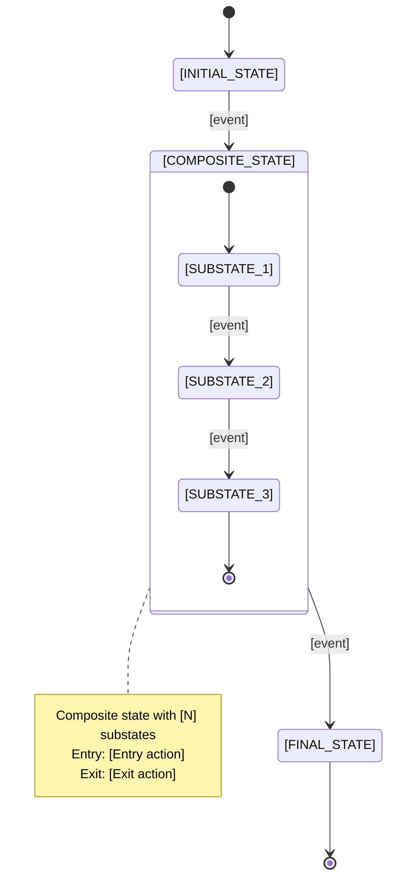
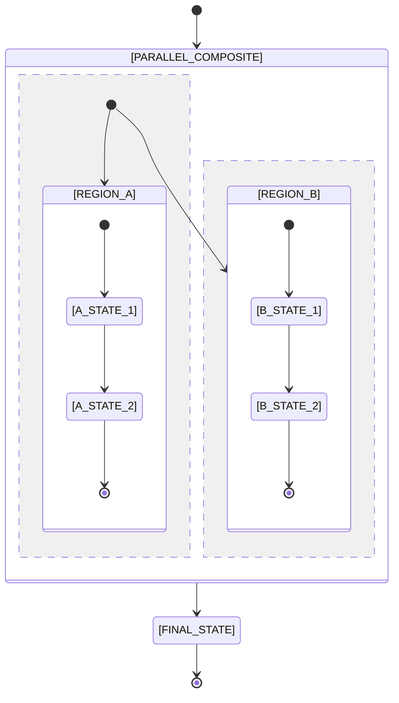
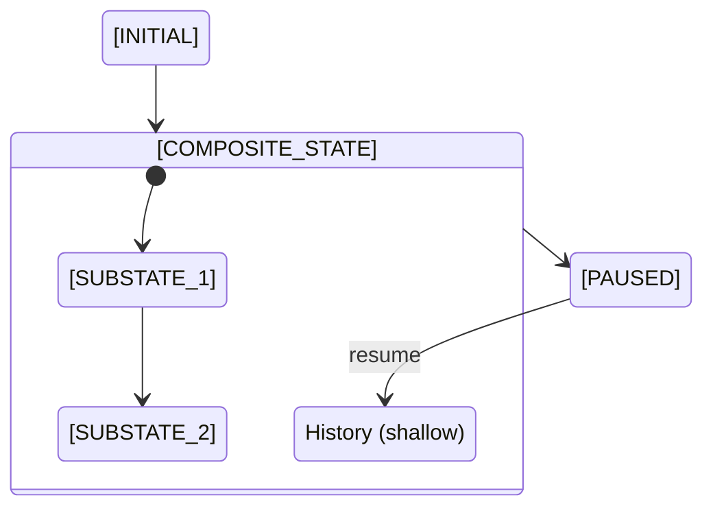
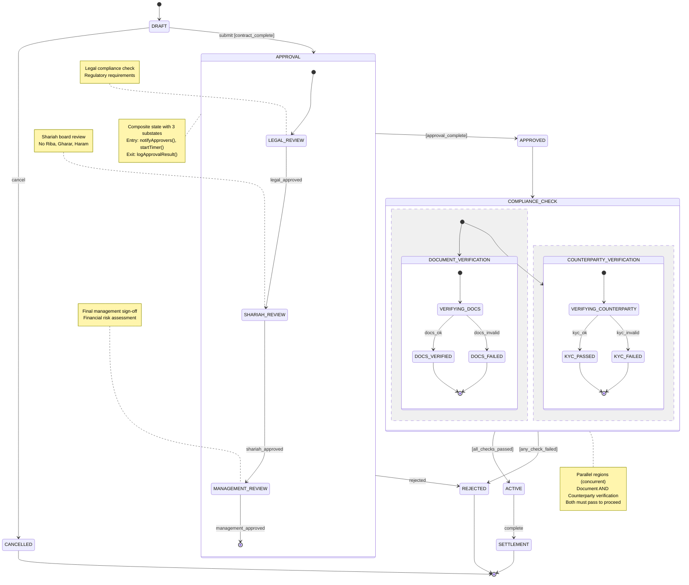

# Template: Hierarchical State Machine Diagram

## Purpose

This template provides a complete structure for documenting **Hierarchical (Nested) Finite State Machines** where:

- **Composite states** contain nested substates
- **Parallel regions** model independent concurrent behavior
- **Entry/exit points** control substate navigation
- **History states** enable resumption of interrupted workflows

Hierarchical FSMs help manage complexity by:

- Reducing state explosion through state decomposition
- Enabling state reuse across different contexts
- Modeling orthogonal concerns with parallel regions
- Providing clear entry/exit semantics for nested states

## When to Use This Template

Use this template when your FSM exhibits:

- **State explosion**: Flat FSM has 8+ states that share common behavior
- **Nested workflows**: States contain their own mini-workflows (e.g., `APPROVAL` has `LEGAL_REVIEW`, `SHARIAH_REVIEW`, `MANAGEMENT_REVIEW`)
- **Parallel concerns**: Independent aspects that can progress simultaneously (e.g., contract lifecycle AND compliance checks)
- **Resumable workflows**: Need to remember substates when re-entering composite states

**Prerequisite**: Understanding of basic FSM concepts (states, transitions) and hierarchical state patterns. See [Hierarchical and Nested States](../ex-so-ar-fsm__05-hierarchical-and-nested-states.md).

## Template Structure

### Section 1: Overview

Brief description of the hierarchical FSM, complexity rationale, and hierarchy depth.

### Section 2: State Hierarchy Diagram

Visual representation using Mermaid with nested state syntax.

### Section 3: State Hierarchy Table

Tabular view showing parent-child relationships and hierarchy levels.

### Section 4: Composite State Details

Documentation of each composite state with entry/exit semantics.

### Section 5: Parallel Regions

Documentation of orthogonal concurrent regions if applicable.

### Section 6: History States

Documentation of shallow/deep history states for workflow resumption.

---

## Template Content

````markdown
---
title: "[FSM Name] Hierarchical State Machine"
description: Hierarchical state machine for [entity/process] with nested substates and parallel regions
tags:
  - explanation
  - software
  - architecture
  - fsm
  - hierarchical
  - [domain-tag]
last_updated: [YYYY-MM-DD]
---

# [FSM Name] Hierarchical State Machine

## Overview

**Entity/Process**: [Name of entity or business process]

**Purpose**: [1-2 sentence description of what this FSM models]

**Domain**: [OSE domain area - e.g., Zakat, Contracts, Campaigns, Loans]

**Complexity**: [High | Very High] - [Justification for hierarchical approach]

**FSM Type**: Hierarchical FSM with [X] composite states and [Y] parallel regions

**Hierarchy Depth**: [Maximum nesting level - e.g., 2 levels (parent → child)]

**State Count**: [Total states including substates]

**Rationale for Hierarchy**: [Why hierarchical instead of flat - e.g., "Reduces 50 states to 15 through composition"]

## State Hierarchy Diagram


````

### Parallel Regions Syntax

If your FSM has concurrent orthogonal regions:

````markdown

````

### History State Syntax

For resumable workflows:

````markdown

````

**Legend**: `[H]` represents shallow history (resume to last active substate), `[H*]` represents deep history (resume to deeply nested substate).

## State Hierarchy Table

| Level | State Name          | Parent State      | Type               | Description                             |
| ----- | ------------------- | ----------------- | ------------------ | --------------------------------------- |
| 0     | [TOP_LEVEL_STATE_1] | -                 | Simple             | [Purpose]                               |
| 1     | [COMPOSITE_STATE]   | -                 | Composite          | [Purpose - contains substates]          |
| 2     | [SUBSTATE_1]        | [COMPOSITE_STATE] | Simple (nested)    | [Purpose]                               |
| 2     | [SUBSTATE_2]        | [COMPOSITE_STATE] | Simple (nested)    | [Purpose]                               |
| 2     | [SUBSTATE_3]        | [COMPOSITE_STATE] | Simple (nested)    | [Purpose]                               |
| 1     | [PARALLEL_STATE]    | -                 | Composite/Parallel | [Purpose - contains orthogonal regions] |
| 2     | [REGION_A]          | [PARALLEL_STATE]  | Region             | [Independent concern A]                 |
| 3     | [A_STATE_1]         | [REGION_A]        | Simple (nested)    | [Purpose]                               |
| 2     | [REGION_B]          | [PARALLEL_STATE]  | Region             | [Independent concern B]                 |
| 3     | [B_STATE_1]         | [REGION_B]        | Simple (nested)    | [Purpose]                               |
| 0     | [FINAL_STATE]       | -                 | Final              | [Terminal state]                        |

**Note**: Level 0 = top-level states, Level 1+ = nested substates

## Composite State Details

### [COMPOSITE_STATE] (Composite State)

**Purpose**: [What does this composite state represent]

**Entry semantics**:

- **Entry action**: [Action executed when entering composite state - runs BEFORE substate entry]
- **Default substate**: [Initial substate entered when no history]
- **Entry point**: [Named entry point if custom entry path exists]

**Exit semantics**:

- **Exit action**: [Action executed when exiting composite state - runs AFTER substate exit]
- **Exit point**: [Named exit point if custom exit path exists]
- **Completion event**: [Event triggered when all substates reach final pseudo-state]

**Substates**:

1. **[SUBSTATE_1]**: [Purpose]
2. **[SUBSTATE_2]**: [Purpose]
3. **[SUBSTATE_3]**: [Purpose]

**Transition types**:

- **External transitions**: Leave composite state (trigger exit action) then re-enter
- **Internal transitions**: Stay within composite state (no entry/exit actions)
- **Local transitions**: Transition within same substate region

**History state**: [Yes/No - if yes, specify shallow or deep]

**Example**:

**APPROVAL (Composite State)**

**Purpose**: Multi-level approval workflow requiring legal, Shariah, and management sign-off

**Entry semantics**:

- **Entry action**: `notifyApprovers()`, `startApprovalTimer()`
- **Default substate**: `LEGAL_REVIEW`
- **Entry point**: None (always start at `LEGAL_REVIEW`)

**Exit semantics**:

- **Exit action**: `logApprovalCompletion()`, `cancelApprovalTimer()`
- **Exit point**: `approved` (on successful completion) or `rejected` (on any rejection)
- **Completion event**: `approval_completed` when `MANAGEMENT_APPROVED` reached

**Substates**:

1. **LEGAL_REVIEW**: Legal team reviews contract for regulatory compliance
2. **SHARIAH_REVIEW**: Shariah board reviews for Islamic compliance
3. **MANAGEMENT_APPROVED**: Management approves contract financing

**Transition types**:

- External: `reject` event exits entire APPROVAL composite state
- Internal: `request_clarification` stays within APPROVAL (no re-entry)

**History state**: No

### [PARALLEL_STATE] (Composite State with Parallel Regions)

**Purpose**: [What orthogonal concerns does this model]

**Regions**:

1. **[REGION_A]**: [Independent concern A - e.g., Document Processing]
2. **[REGION_B]**: [Independent concern B - e.g., Background Verification]

**Completion semantics**: Composite state exits when **all regions** reach their final states (implicit AND join)

**Example**:

**COMPLIANCE_CHECK (Parallel Composite)**

**Purpose**: Concurrent compliance validation across multiple independent domains

**Regions**:

1. **SHARIAH_COMPLIANCE**: Validates Islamic finance compliance (no Riba, Gharar)
2. **LEGAL_COMPLIANCE**: Validates regulatory compliance (KYC, AML)
3. **FINANCIAL_COMPLIANCE**: Validates financial health (credit score, income)

**Completion semantics**: All three regions must reach `PASSED` before contract proceeds to `ACTIVE`

## Transition Table

### Top-Level Transitions

| From State          | Event              | Guard | To State          | Action   | Description               |
| ------------------- | ------------------ | ----- | ----------------- | -------- | ------------------------- |
| [TOP_LEVEL_STATE_1] | [event]            | -     | [COMPOSITE_STATE] | [action] | [What happens]            |
| [COMPOSITE_STATE]   | [completion_event] | -     | [FINAL_STATE]     | [action] | Composite state completed |
| [COMPOSITE_STATE]   | [error_event]      | -     | [ERROR_STATE]     | [action] | Exit composite on error   |

### Substate Transitions (within [COMPOSITE_STATE])

| From State   | Event   | Guard | To State     | Action   | Transition Type | Description    |
| ------------ | ------- | ----- | ------------ | -------- | --------------- | -------------- |
| [SUBSTATE_1] | [event] | -     | [SUBSTATE_2] | [action] | Local           | [What happens] |
| [SUBSTATE_2] | [event] | -     | [SUBSTATE_3] | [action] | Local           | [What happens] |
| [SUBSTATE_3] | [event] | -     | [*]          | [action] | Completion      | Substate done  |

**Transition types**:

- **Local**: Within same composite state, does not trigger parent entry/exit
- **External**: Exits composite state, triggers parent exit action
- **Internal**: Responds to event without changing state

### Parallel Region Transitions

#### Region A Transitions

| From State  | Event   | Guard | To State    | Action   | Description    |
| ----------- | ------- | ----- | ----------- | -------- | -------------- |
| [A_STATE_1] | [event] | -     | [A_STATE_2] | [action] | [What happens] |
| [A_STATE_2] | [event] | -     | [*]         | [action] | Region A done  |

#### Region B Transitions

| From State  | Event   | Guard | To State    | Action   | Description    |
| ----------- | ------- | ----- | ----------- | -------- | -------------- |
| [B_STATE_1] | [event] | -     | [B_STATE_2] | [action] | [What happens] |
| [B_STATE_2] | [event] | -     | [*]         | [action] | Region B done  |

**Synchronization**: Parent composite state exits only when **all regions** complete.

## History States

### [COMPOSITE_STATE] History

**Type**: [Shallow | Deep]

**Purpose**: [Why resumption is needed - e.g., "User can pause approval workflow and resume later"]

**Behavior**:

- **Shallow history**: Resume to last active direct substate of composite state
- **Deep history**: Resume to last active deeply nested substate (recursive)

**Activation**: History activated when re-entering composite state via `[H]` or `[H*]` pseudo-state

**Example**: After `PAUSED` state, event `resume` transitions back to composite state at last active substate.

**Example**:

**APPROVAL History (Shallow)**

**Purpose**: Approvers can save draft and resume approval later without restarting from `LEGAL_REVIEW`

**Behavior**: If workflow paused at `SHARIAH_REVIEW`, resuming via history returns directly to `SHARIAH_REVIEW`

**Activation**: `PAUSED --> APPROVAL [H] : resume`

## Guard and Action Specifications

### Guards

| Guard Name     | Condition                | Rationale                               |
| -------------- | ------------------------ | --------------------------------------- |
| [guard_name]   | [Boolean expression]     | [Business rule this guard enforces]     |
| [nested_guard] | [Condition in substates] | [Why this guard is needed in hierarchy] |

### Actions

| Action Name           | Scope               | Side Effect    | Idempotent? | Error Handling       |
| --------------------- | ------------------- | -------------- | ----------- | -------------------- |
| [parent_entry_action] | Composite entry     | [What it does] | [Yes/No]    | [How errors handled] |
| [parent_exit_action]  | Composite exit      | [What it does] | [Yes/No]    | [How errors handled] |
| [substate_action]     | Substate transition | [What it does] | [Yes/No]    | [How errors handled] |

**Action execution order**:

1. Source state exit action (innermost to outermost if nested)
2. Transition action
3. Target state entry action (outermost to innermost if nested)

**Example**:

Transition from `COMPOSITE_STATE.SUBSTATE_2` to `NEXT_COMPOSITE.SUBSTATE_A`:

1. Exit `SUBSTATE_2` → Exit `COMPOSITE_STATE`
2. Execute transition action
3. Enter `NEXT_COMPOSITE` → Enter `SUBSTATE_A`

## Business Rules

Key business rules enforced by this hierarchical FSM:

1. **[Rule 1]**: [Description and how hierarchy enforces it]
2. **[Rule 2]**: [Description - e.g., "All substates must complete before composite exits"]
3. **[Rule 3]**: [Description - e.g., "Parallel regions must all reach final state"]

**Example**:

1. **Sequential approval**: Contract must pass `LEGAL_REVIEW`, `SHARIAH_REVIEW`, and `MANAGEMENT_APPROVED` in order (enforced by substate sequence)
2. **Rejection at any level**: Any rejection immediately exits `APPROVAL` composite state (enforced by external transition)
3. **Parallel compliance**: All compliance checks (Shariah, Legal, Financial) must pass concurrently (enforced by parallel regions with AND join)

## Hierarchy Design Decisions

### Why Hierarchical Instead of Flat?

**Problem**: [Describe state explosion or complexity in flat FSM]

**Solution**: [How hierarchy reduces states or improves clarity]

**Metrics**:

- **Flat FSM**: [X] states, [Y] transitions
- **Hierarchical FSM**: [A] composite states, [B] substates, [C] transitions
- **Reduction**: [Percentage or ratio improvement]

**Example**:

**Problem**: Contract approval with 3 approval stages × 5 document states = 15 flat states

**Solution**: 1 `APPROVAL` composite with 3 substates + 1 `DOCUMENT_PROCESSING` composite with 5 substates = 8 total states

**Reduction**: 15 → 8 states (47% reduction)

### When to Nest vs Flatten

**Nest when**:

- Substates share common entry/exit behavior
- Substates are conceptually grouped (e.g., all approval stages)
- Need to remember substate position (history state)

**Flatten when**:

- States have no shared behavior
- Nesting depth exceeds 2 levels (readability suffers)
- Substates have many cross-cutting transitions

## Related Documentation

- **Flat FSM version**: [Link to equivalent flat FSM for comparison]
- **Implementation**: [Link to code]
- **Test cases**: [Link to tests]
- **Business requirements**: [Link to requirements doc]

## Notes and Assumptions

- [Important notes about hierarchy design choices]
- [Assumptions about execution order]
- [Known limitations - e.g., "Framework X does not support deep history"]

---

## Diagram Maintenance

**Last updated**: [YYYY-MM-DD]

**Last updated by**: [Name or team]

**Change history**:

- [YYYY-MM-DD]: [Brief description of change]

**Synchronization**: This diagram should be synchronized with:

- Implementation code: [Path to FSM implementation]
- Test cases: [Path to FSM tests]

````

---

## Filled Example: Islamic Contract Approval FSM

Below is a complete example for an Islamic contract approval workflow with nested states and parallel regions.

```markdown
---
title: "Islamic Contract Approval Hierarchical State Machine"
description: Hierarchical FSM for Islamic contract approval with nested approval workflow and parallel compliance checks
tags:
  - explanation
  - software
  - architecture
  - fsm
  - hierarchical
  - islamic-contracts
  - islamic-finance
last_updated: 2026-01-21
---

# Islamic Contract Approval Hierarchical State Machine

## Overview

**Entity/Process**: Islamic Contract (Murabaha/Ijara/Mudarabah)

**Purpose**: Models the complete lifecycle of an Islamic financial contract from draft through multi-stage approval, parallel compliance checks, activation, and settlement.

**Domain**: Islamic Contracts (Murabaha cost-plus financing, Ijara leasing, Mudarabah profit-sharing)

**Complexity**: High - Requires hierarchical decomposition to manage approval workflow and concurrent compliance

**FSM Type**: Hierarchical FSM with 2 composite states and 1 parallel region

**Hierarchy Depth**: 2 levels (parent composite → child substates)

**State Count**: 14 total states (4 top-level, 10 nested)

**Rationale for Hierarchy**: Reduces 24 flat states to 14 by grouping approval stages and parallel compliance concerns

## State Hierarchy Diagram


````

## State Hierarchy Table

| Level | State Name                | Parent State              | Type               | Description                                     |
| ----- | ------------------------- | ------------------------- | ------------------ | ----------------------------------------------- |
| 0     | DRAFT                     | -                         | Initial            | Contract creation and editing                   |
| 0     | APPROVAL                  | -                         | Composite          | Multi-stage approval workflow                   |
| 1     | LEGAL_REVIEW              | APPROVAL                  | Simple (nested)    | Legal team reviews regulatory compliance        |
| 1     | SHARIAH_REVIEW            | APPROVAL                  | Simple (nested)    | Shariah board reviews Islamic compliance        |
| 1     | MANAGEMENT_REVIEW         | APPROVAL                  | Simple (nested)    | Management approves financing                   |
| 0     | APPROVED                  | -                         | Simple             | Approval completed, pending compliance          |
| 0     | COMPLIANCE_CHECK          | -                         | Composite/Parallel | Concurrent verification workflows               |
| 1     | DOCUMENT_VERIFICATION     | COMPLIANCE_CHECK          | Region             | Independent document verification               |
| 2     | VERIFYING_DOCS            | DOCUMENT_VERIFICATION     | Simple (nested)    | Document validation in progress                 |
| 2     | DOCS_VERIFIED             | DOCUMENT_VERIFICATION     | Simple (nested)    | Documents verified successfully                 |
| 2     | DOCS_FAILED               | DOCUMENT_VERIFICATION     | Simple (nested)    | Document verification failed                    |
| 1     | COUNTERPARTY_VERIFICATION | COMPLIANCE_CHECK          | Region             | Independent counterparty checks                 |
| 2     | VERIFYING_COUNTERPARTY    | COUNTERPARTY_VERIFICATION | Simple (nested)    | KYC/AML verification in progress                |
| 2     | KYC_PASSED                | COUNTERPARTY_VERIFICATION | Simple (nested)    | KYC/AML passed                                  |
| 2     | KYC_FAILED                | COUNTERPARTY_VERIFICATION | Simple (nested)    | KYC/AML failed                                  |
| 0     | ACTIVE                    | -                         | Simple             | Contract active and enforceable                 |
| 0     | SETTLEMENT                | -                         | Simple             | Contract completed and settled                  |
| 0     | REJECTED                  | -                         | Final              | Contract rejected (from approval or compliance) |
| 0     | CANCELLED                 | -                         | Final              | Contract cancelled before completion            |

## Composite State Details

### APPROVAL (Composite State)

**Purpose**: Multi-level approval workflow requiring sequential sign-off from legal, Shariah board, and management

**Entry semantics**:

- **Entry action**: `notifyApprovers()`, `startApprovalTimer()`
- **Default substate**: `LEGAL_REVIEW`
- **Entry point**: None (always start at `LEGAL_REVIEW`)

**Exit semantics**:

- **Exit action**: `logApprovalResult()`, `cancelApprovalTimer()`
- **Exit point**: Implicit (exits when `MANAGEMENT_REVIEW` completes or rejection occurs)
- **Completion event**: `approval_complete` when `MANAGEMENT_REVIEW` approves

**Substates**:

1. **LEGAL_REVIEW**: Legal team reviews contract for regulatory compliance (SEC, DFSA, etc.)
2. **SHARIAH_REVIEW**: Shariah board reviews for Islamic compliance (no Riba/interest, no Gharar/uncertainty, no Haram/prohibited goods)
3. **MANAGEMENT_REVIEW**: Management reviews and approves contract financing and terms

**Transition types**:

- **External**: `rejected` event exits entire APPROVAL composite state immediately
- **Internal**: None in this design
- **Local**: Sequential progression through substates (`legal_approved` → `shariah_approved` → `management_approved`)

**History state**: No (rejections restart from `LEGAL_REVIEW`)

### COMPLIANCE_CHECK (Composite State with Parallel Regions)

**Purpose**: Concurrent compliance validation across document verification and counterparty KYC/AML checks

**Regions**:

1. **DOCUMENT_VERIFICATION**: Validates contract documents (completeness, signatures, terms)
2. **COUNTERPARTY_VERIFICATION**: Validates counterparty KYC/AML compliance

**Completion semantics**: Both regions must reach their final states before composite state exits. If either fails, entire compliance check fails.

**Entry semantics**:

- **Entry action**: `startComplianceChecks()`, `fork()` (split into parallel regions)
- **Default substates**: `VERIFYING_DOCS` and `VERIFYING_COUNTERPARTY` (concurrent start)

**Exit semantics**:

- **Exit action**: `join()` (wait for both regions), `logComplianceResult()`
- **Completion event**: `all_checks_passed` if both regions pass, `any_check_failed` if either fails

**Synchronization**: Implicit AND join (both regions must complete)

## Transition Table

### Top-Level Transitions

| From State       | Event               | Guard               | To State         | Action                                      | Description                              |
| ---------------- | ------------------- | ------------------- | ---------------- | ------------------------------------------- | ---------------------------------------- |
| DRAFT            | `submit`            | `contract_complete` | APPROVAL         | `validateContract()`, `submitForApproval()` | User submits complete contract           |
| DRAFT            | `cancel`            | -                   | CANCELLED        | `recordCancellation()`                      | User cancels draft                       |
| APPROVAL         | `approval_complete` | -                   | APPROVED         | `notifyContractApproved()`                  | Approval workflow completed successfully |
| APPROVAL         | `rejected`          | -                   | REJECTED         | `notifyRejection()`, `recordReason()`       | Rejected during approval workflow        |
| APPROVED         | (automatic)         | -                   | COMPLIANCE_CHECK | `startComplianceChecks()`                   | Automatic transition to compliance       |
| COMPLIANCE_CHECK | `all_checks_passed` | -                   | ACTIVE           | `activateContract()`, `notifyParties()`     | All compliance checks passed             |
| COMPLIANCE_CHECK | `any_check_failed`  | -                   | REJECTED         | `notifyFailure()`, `recordIssue()`          | Any compliance check failed              |
| ACTIVE           | `complete`          | -                   | SETTLEMENT       | `initiateSettlement()`                      | Contract obligations fulfilled           |
| SETTLEMENT       | (automatic)         | -                   | [*]              | `finalizeContract()`, `archiveRecords()`    | Contract settled and closed              |

### Substate Transitions (within APPROVAL)

| From State        | Event                 | Guard | To State          | Action                 | Transition Type | Description                        |
| ----------------- | --------------------- | ----- | ----------------- | ---------------------- | --------------- | ---------------------------------- |
| LEGAL_REVIEW      | `legal_approved`      | -     | SHARIAH_REVIEW    | `notifyShariahBoard()` | Local           | Legal review passed                |
| LEGAL_REVIEW      | `legal_rejected`      | -     | (parent exits)    | `notifyRejection()`    | External        | Legal review rejected              |
| SHARIAH_REVIEW    | `shariah_approved`    | -     | MANAGEMENT_REVIEW | `notifyManagement()`   | Local           | Shariah review passed              |
| SHARIAH_REVIEW    | `shariah_rejected`    | -     | (parent exits)    | `notifyRejection()`    | External        | Shariah review rejected            |
| MANAGEMENT_REVIEW | `management_approved` | -     | [*]               | `setApproved()`        | Completion      | Management approved, exit APPROVAL |
| MANAGEMENT_REVIEW | `management_rejected` | -     | (parent exits)    | `notifyRejection()`    | External        | Management rejected                |

**Note**: Any `rejected` event exits the entire `APPROVAL` composite state, triggering parent exit action.

### Parallel Region Transitions

#### DOCUMENT_VERIFICATION Region

| From State     | Event          | Guard | To State      | Action                   | Description                   |
| -------------- | -------------- | ----- | ------------- | ------------------------ | ----------------------------- |
| VERIFYING_DOCS | `docs_ok`      | -     | DOCS_VERIFIED | `markDocsVerified()`     | Documents validated           |
| VERIFYING_DOCS | `docs_invalid` | -     | DOCS_FAILED   | `recordDocIssues()`      | Documents invalid             |
| DOCS_VERIFIED  | (automatic)    | -     | [*]           | -                        | Region completes successfully |
| DOCS_FAILED    | (automatic)    | -     | [*]           | `flagComplianceFailed()` | Region completes with failure |

#### COUNTERPARTY_VERIFICATION Region

| From State             | Event         | Guard | To State   | Action                   | Description                   |
| ---------------------- | ------------- | ----- | ---------- | ------------------------ | ----------------------------- |
| VERIFYING_COUNTERPARTY | `kyc_ok`      | -     | KYC_PASSED | `markKYCPassed()`        | KYC/AML checks passed         |
| VERIFYING_COUNTERPARTY | `kyc_invalid` | -     | KYC_FAILED | `recordKYCIssues()`      | KYC/AML checks failed         |
| KYC_PASSED             | (automatic)   | -     | [*]        | -                        | Region completes successfully |
| KYC_FAILED             | (automatic)   | -     | [*]        | `flagComplianceFailed()` | Region completes with failure |

**Synchronization**: Parent `COMPLIANCE_CHECK` waits for both regions to reach their final states. If either region ends in a failure state, `any_check_failed` event fires.

## History States

This FSM does not use history states. Rationale:

- **Approval workflow**: Rejections restart from `LEGAL_REVIEW` to ensure all stages re-evaluated
- **Compliance checks**: Must run fresh on each attempt (no resumption)

If resumption were needed (e.g., pause/resume approval), shallow history could be added:

```mermaid
APPROVAL --> PAUSED : pause
PAUSED --> APPROVAL[H] : resume
```

This would resume to the last active approval substate.

## Guard and Action Specifications

### Guards

| Guard Name          | Condition                                       | Rationale                                |
| ------------------- | ----------------------------------------------- | ---------------------------------------- |
| `contract_complete` | `contract.hasAllFields() && contract.isValid()` | Only complete contracts can be submitted |

### Actions

| Action Name               | Scope               | Side Effect                             | Idempotent? | Error Handling                 |
| ------------------------- | ------------------- | --------------------------------------- | ----------- | ------------------------------ |
| `notifyApprovers()`       | Composite entry     | Sends email to all approvers            | No          | Log failure, continue          |
| `startApprovalTimer()`    | Composite entry     | Starts 30-day approval timeout          | Yes         | Fail transition if timer fails |
| `logApprovalResult()`     | Composite exit      | Writes audit log entry                  | Yes         | Fail transition on DB error    |
| `notifyShariahBoard()`    | Substate transition | Sends notification to Shariah board     | No          | Log failure, continue          |
| `startComplianceChecks()` | Composite entry     | Initiates parallel compliance workflows | No          | Retry on failure               |
| `activateContract()`      | Transition          | Marks contract as legally binding       | Yes         | Fail transition on error       |

**Action execution order** (example: transitioning from `APPROVAL.SHARIAH_REVIEW` to `APPROVED`):

1. Exit `SHARIAH_REVIEW` (substate exit action if any)
2. Exit `APPROVAL` (composite exit action: `logApprovalResult()`, `cancelApprovalTimer()`)
3. Transition action: `notifyContractApproved()`
4. Enter `APPROVED` (entry action if any)

## Business Rules

1. **Sequential approval**: Contract must pass legal, Shariah, and management reviews in order (enforced by substate sequence in `APPROVAL`)
2. **Rejection at any stage**: Any rejection immediately exits entire approval workflow (enforced by external transitions)
3. **Concurrent compliance**: Document and counterparty checks run concurrently (enforced by parallel regions)
4. **Both compliance checks must pass**: If either compliance check fails, contract rejected (enforced by AND join semantics)
5. **No skipping approval stages**: Cannot skip from `LEGAL_REVIEW` directly to `MANAGEMENT_REVIEW` (enforced by explicit transition paths)
6. **Immutable after activation**: Once `ACTIVE`, contract terms cannot change (enforced by no transitions back to earlier states)

## Hierarchy Design Decisions

### Why Hierarchical Instead of Flat?

**Problem**: Flat FSM would have 3 approval states + 4 compliance states + 5 lifecycle states = 12 states with complex cross-cutting transitions. Adding error handling and retry states would explode to 24+ states.

**Solution**: 2 composite states (`APPROVAL` with 3 substates, `COMPLIANCE_CHECK` with 2 parallel regions of 3 substates each) + 6 top-level states = 14 total states with clear boundaries.

**Metrics**:

- **Flat FSM**: 24 states, 50+ transitions (estimated)
- **Hierarchical FSM**: 14 states, 28 transitions
- **Reduction**: 42% fewer states, 44% fewer transitions

**Benefits**:

- Approval stages share entry/exit logic (`notifyApprovers()`, `logApprovalResult()`)
- Parallel compliance checks clearly separated
- Rejection logic simplified (exit composite state)

### When to Nest vs Flatten

**Nested**:

- `APPROVAL`: All substates share common entry/exit behavior (notification, logging)
- `COMPLIANCE_CHECK`: Parallel regions model independent concerns

**Flattened**:

- Top-level lifecycle states (`DRAFT`, `APPROVED`, `ACTIVE`, `SETTLEMENT`) have no shared behavior

## Related Documentation

- **Flat FSM version**: [Contract Approval Flat FSM](./ex-so-ar-fsm-diagram__contract-approval-flat.md) (comparison)
- **Implementation**: `apps/ose-platform/src/domain/contracts/contract-fsm.ts`
- **Test cases**: `apps/ose-platform/tests/contracts/contract-fsm.test.ts`
- **Business requirements**: [Islamic Contract Workflow Requirements](../../../../../docs/reference/ose-platform/contracts/workflow.md)
- **Shariah compliance**: [Islamic Finance Principles](../../../../../docs/explanation/islamic-finance/principles.md)

## Notes and Assumptions

- Approval timer (30 days) requires background job to expire contracts
- Parallel compliance checks assume independent systems (Document Service, KYC Service)
- No history state: Rejections require re-approval from start (business policy)
- Assumption: Spring State Machine framework supports parallel regions (verified)

---

## Diagram Maintenance

**Last updated**: 2026-01-21

**Last updated by**: OSE Platform Team

**Change history**:

- 2026-01-21: Initial hierarchical FSM design with 2 composite states
- 2026-01-18: Added parallel compliance regions
- 2026-01-15: Split flat approval states into nested substates

**Synchronization**: This diagram is synchronized with:

- Implementation: `apps/ose-platform/src/domain/contracts/contract-fsm.ts`
- Tests: `apps/ose-platform/tests/contracts/contract-fsm.test.ts`
- API spec: `apps/ose-platform/docs/api/contract-endpoints.md`

````

---

## Usage Instructions

### Step 1: Copy Template

Copy the template section above into your new file.

### Step 2: Identify Composite States

Determine which states should be composite:

- **Grouping criterion**: Substates share common entry/exit behavior
- **Hierarchy depth**: Aim for 2 levels maximum (parent → child)
- **Substate count**: 3-7 substates per composite (more suggests further decomposition)

### Step 3: Identify Parallel Regions

Determine if concurrent behavior exists:

- **Independence test**: Can concerns progress simultaneously without coordination?
- **Completion semantics**: Do all regions need to complete (AND join) or any region (OR join)?

### Step 4: Draw Hierarchy

Use Mermaid nested state syntax:

```mermaid
state COMPOSITE {
    [*] --> SUBSTATE_A
    SUBSTATE_A --> SUBSTATE_B
}
````

For parallel regions:

```mermaid
state PARALLEL {
    state REGION_A {
        ...
    }
    --
    state REGION_B {
        ...
    }
}
```

### Step 5: Document Entry/Exit Semantics

For each composite state, specify:

- Entry action (runs before substate entry)
- Exit action (runs after substate exit)
- Default substate (where to start)
- Completion event (what triggers when substates finish)

### Step 6: Define Transition Types

Classify each transition:

- **Local**: Within same composite, no parent entry/exit
- **External**: Exits composite, triggers parent exit/entry
- **Internal**: Responds to event without state change

### Step 7: Validate Hierarchy

- [ ] All substates have clear parent
- [ ] Hierarchy depth ≤ 2 levels
- [ ] Entry/exit actions clearly specified
- [ ] Parallel regions have AND/OR join semantics documented
- [ ] History states justified (if used)
- [ ] Diagram renders in Mermaid Live Editor

## Tips and Best Practices

1. **Start flat, refactor to hierarchy**: Begin with flat FSM, then group states with shared behavior
2. **Limit nesting depth**: More than 2 levels hurts readability
3. **Use parallel regions sparingly**: Only when concerns are truly independent
4. **Document entry/exit order**: Make action execution order explicit
5. **Avoid deep history unless necessary**: Shallow history is simpler and often sufficient
6. **Consider framework support**: Not all FSM libraries support full hierarchical features
7. **Test composite boundaries**: Ensure entry/exit actions execute correctly

## Related Templates

- **[Blank State Machine Diagram](./ex-so-ar-fsm-te__blank-state-machine-diagram.md)** - For flat FSMs
- **[State Machine Specification](./ex-so-ar-fsm-te__state-machine-specification.md)** - Formal specification with hierarchy
- **[Implementation Checklist](./ex-so-ar-fsm-te__implementation-checklist.md)** - Implementation guide

## Related Documentation

- **[Hierarchical and Nested States](../ex-so-ar-fsm__05-hierarchical-and-nested-states.md)** - Detailed theory
- **[State Explosion and Mitigation](../ex-so-ar-fsm__04-state-explosion-and-mitigation.md)** - When to use hierarchy
- **[FSM Types and Classifications](../ex-so-ar-fsm__03-fsm-types-and-classifications.md)** - Composite states, parallel regions
