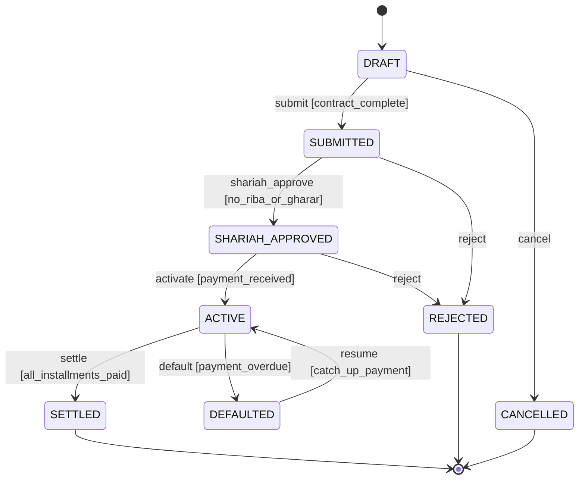

# Template: Starter Full FSM Documentation

## Purpose

All-in-one FSM documentation combining diagram, specification, transition table, testing strategy, and implementation notes. Complete example: Murabaha Contract FSM.

## When to Use

- Starting new FSM project (comprehensive starter)
- Small-to-medium FSMs (5-10 states)
- Need single-source FSM documentation
- Documentation-first development

## Template Structure

1. Overview
2. State Diagram
3. Specification
4. Transition Table
5. Testing Strategy
6. Implementation Notes
7. Deployment Guide

## Filled Example: Murabaha Contract FSM

````markdown
---
title: "Murabaha Contract FSM - Complete Documentation"
---

# Murabaha Contract State Machine

## 1. Overview

**Entity**: Murabaha Sale Contract (Islamic cost-plus financing)

**Purpose**: Manages Murabaha contract lifecycle from draft to settlement

**Domain**: Islamic Finance - Murabaha

**FSM Type**: Flat FSM (5 states)

**Business Context**: Murabaha is Islamic cost-plus sale where institution buys asset and sells to customer at markup, allowing customer to pay in installments without interest (Riba).

## 2. State Diagram


````

## 3. Specification

### States

| State            | Type         | Entry Action                              | Exit Action      | Invariant                      |
| ---------------- | ------------ | ----------------------------------------- | ---------------- | ------------------------------ |
| DRAFT            | Initial      | `initializeContract()`                    | `validateData()` | None                           |
| SUBMITTED        | Intermediate | `notifyShariahBoard()`                    | -                | `hasAllRequiredFields == true` |
| SHARIAH_APPROVED | Intermediate | `generateAgreement()`                     | -                | `shariahCompliant == true`     |
| ACTIVE           | Intermediate | `startInstallments()`                     | -                | `firstPaymentReceived == true` |
| SETTLED          | Final        | `closeAccount()`, `sendReceipt()`         | N/A              | `totalPaid >= totalOwed`       |
| REJECTED         | Final        | `notifyRejection()`                       | N/A              | N/A                            |
| CANCELLED        | Final        | `recordCancellation()`                    | N/A              | N/A                            |
| DEFAULTED        | Intermediate | `notifyDefault()`, `initiateCollection()` | -                | `missedPayments >= 2`          |

### Events & Guards

| Event             | Guard                   | Description               |
| ----------------- | ----------------------- | ------------------------- |
| `submit`          | `contract_complete`     | Customer submits contract |
| `shariah_approve` | `no_riba_or_gharar`     | Shariah board approves    |
| `activate`        | `payment_received`      | First payment received    |
| `settle`          | `all_installments_paid` | All payments complete     |
| `default`         | `payment_overdue`       | Missed 2+ payments        |
| `resume`          | `catch_up_payment`      | Default cured             |

### Actions

| Action                 | Side Effect              | Idempotent | Error Handling  |
| ---------------------- | ------------------------ | ---------- | --------------- |
| `notifyShariahBoard()` | Sends review request     | No         | Log, continue   |
| `generateAgreement()`  | Creates PDF contract     | Yes        | Fail transition |
| `startInstallments()`  | Creates payment schedule | Yes        | Fail transition |
| `closeAccount()`       | Marks account closed     | Yes        | Fail transition |

## 4. Transition Table

| ID  | From             | Event             | Guard                   | To               | Action                 | Error Handling |
| --- | ---------------- | ----------------- | ----------------------- | ---------------- | ---------------------- | -------------- |
| T01 | DRAFT            | `submit`          | `contract_complete`     | SUBMITTED        | `validateContract()`   | Retry          |
| T02 | DRAFT            | `cancel`          | -                       | CANCELLED        | `recordCancellation()` | N/A            |
| T03 | SUBMITTED        | `shariah_approve` | `no_riba_or_gharar`     | SHARIAH_APPROVED | `generateAgreement()`  | Fail           |
| T04 | SUBMITTED        | `reject`          | -                       | REJECTED         | `notifyRejection()`    | N/A            |
| T05 | SHARIAH_APPROVED | `activate`        | `payment_received`      | ACTIVE           | `startInstallments()`  | Fail           |
| T06 | ACTIVE           | `settle`          | `all_installments_paid` | SETTLED          | `closeAccount()`       | Fail           |
| T07 | ACTIVE           | `default`         | `payment_overdue`       | DEFAULTED        | `initiateCollection()` | N/A            |
| T08 | DEFAULTED        | `resume`          | `catch_up_payment`      | ACTIVE           | `resumeSchedule()`     | Retry          |

## 5. Testing Strategy

### Test Coverage

- **States**: 8/8 (100%)
- **Transitions**: 8/8 (100%)
- **Guards**: 5/5 (100%)
- **Actions**: 10/10 (100%)

### Key Test Cases

**State Coverage**:

- ST-01: DRAFT reachable (create contract)
- ST-02: SETTLED reachable (happy path workflow)
- ST-03: DEFAULTED reachable (missed payments)

**Transition Coverage**:

- TR-01: DRAFT → SUBMITTED (valid submission)
- TR-05: SHARIAH_APPROVED → ACTIVE (first payment)
- TR-08: DEFAULTED → ACTIVE (resume)

**Guard Testing**:

- GD-01: `contract_complete` with all fields (true)
- GD-02: `contract_complete` with missing field (false)
- GD-03: `no_riba_or_gharar` without Riba (true)

**Invalid Transitions**:

- IT-01: SETTLED → `submit` (expect exception)
- IT-02: ACTIVE → `cancel` (expect exception)

## 6. Implementation Notes

### Technology Stack

- **Language**: Java 17
- **Framework**: Spring State Machine 3.2
- **Persistence**: PostgreSQL
- **Audit**: Separate audit table

### Key Classes

- `MurabahaContract` (JPA Entity)
- `MurabahaState` (Enum)
- `MurabahaEvent` (Enum)
- `MurabahaStateMachineConfig` (Spring Config)

### Database Schema

```sql
CREATE TABLE murabaha_contracts (
    id UUID PRIMARY KEY,
    status VARCHAR(50) NOT NULL,
    total_amount DECIMAL(15,2),
    installments_paid INTEGER,
    version INTEGER,
    created_at TIMESTAMP,
    updated_at TIMESTAMP
);

CREATE TABLE contract_state_transitions (
    id UUID PRIMARY KEY,
    contract_id UUID REFERENCES murabaha_contracts(id),
    from_state VARCHAR(50),
    to_state VARCHAR(50),
    event VARCHAR(50),
    actor VARCHAR(100),
    transitioned_at TIMESTAMP
);
```

### Concurrency

- Optimistic locking via `@Version`
- Retry on `OptimisticLockException`

## 7. Deployment Guide

### Pre-Deployment

- [ ] DB migrations applied
- [ ] Feature flag enabled: `murabaha.fsm.enabled`
- [ ] Monitoring dashboards created

### Deployment Steps

1. Deploy to staging
2. Run smoke tests
3. Deploy to production
4. Monitor for 24 hours

### Rollback Plan

1. Disable feature flag
2. Rollback code deployment
3. Restore database snapshot if needed

## 8. Business Rules

1. **No Riba (interest)**: Murabaha must have fixed markup, no variable interest
2. **Asset ownership**: Institution must own asset before selling to customer
3. **Payment schedule**: Fixed installments agreed upfront
4. **Default handling**: Grace period before collection process
5. **Shariah compliance**: All contracts reviewed by Shariah board

## 9. Related Documentation

- Shariah Guidelines: `docs/islamic-finance/murabaha-principles.md`
- API Endpoints: `docs/api/murabaha-contracts.md`
- User Guide: `docs/user-guide/murabaha-workflow.md`

---

## Maintenance

**Last Updated**: 2026-01-21

**Owner**: OSE Platform Team

**Review Schedule**: Quarterly

```

---

## Usage Instructions

1. Copy template
2. Fill all 9 sections systematically
3. Use as single-source documentation
4. Keep synchronized with code
5. Review/update quarterly

## Related Templates

All other templates combined into this starter template.
```
