# Behavior-Driven Development (BDD) Documentation

Comprehensive documentation on Behavior-Driven Development patterns, principles, and practices for building software through concrete examples and stakeholder collaboration. This documentation covers Gherkin syntax, Three Amigos practice, Example Mapping, and BDD integration with Test-Driven Development and Domain-Driven Design, with examples from finance and business domains.

## What is Behavior-Driven Development?

Behavior-Driven Development (BDD) is a collaborative software development approach that extends Test-Driven Development by emphasizing communication between developers, QA engineers, and business stakeholders through concrete examples. Introduced by Dan North in 2003, BDD uses natural language to specify expected behavior before writing code, ensuring all team members share a common understanding of requirements.

**Key Principles:**

- **Collaboration First**: Three Amigos (Business, Development, QA) work together to define requirements
- **Concrete Examples**: Specification by Example reduces ambiguity and misunderstanding
- **Outside-In Development**: Start from user needs and work inward to implementation
- **Living Documentation**: Executable specifications that stay synchronized with code
- **Ubiquitous Language**: Shared vocabulary between technical and non-technical team members
- **Stakeholder Involvement**: Domain experts actively participate in requirements discovery

### The BDD Workflow

```mermaid
graph TD
    A[🤝 DISCOVERY:<br/>Three Amigos Session<br/>Business + Dev + QA] --> B[💡 FORMULATION:<br/>Write Gherkin<br/>Given-When-Then]
    B --> C[⚙️ AUTOMATION:<br/>Step Definitions<br/>Connect to Code]
    C --> D[🧪 EXECUTION:<br/>Run Scenarios<br/>Red → Green]
    D --> E[📚 LIVING DOCS:<br/>Scenarios = Specs<br/>Always Up-to-Date]
    E --> F{Requirements<br/>Change?}
    F -->|Yes| A
    F -->|No| G[✅ Done]

    style A fill:#029E73,stroke:#000000,color:#FFFFFF
    style B fill:#0173B2,stroke:#000000,color:#FFFFFF
    style C fill:#CA9161,stroke:#000000,color:#FFFFFF
    style D fill:#DE8F05,stroke:#000000,color:#FFFFFF
    style E fill:#CC78BC,stroke:#000000,color:#FFFFFF
    style G fill:#029E73,stroke:#000000,color:#FFFFFF
```



**The Workflow Explained:**

1. **🤝 DISCOVERY** - Three Amigos collaborate to explore feature requirements through examples
2. **💡 FORMULATION** - Write concrete scenarios in Gherkin (Given-When-Then format)
3. **⚙️ AUTOMATION** - Implement step definitions that connect scenarios to application code
4. **🧪 EXECUTION** - Run automated scenarios (BDD tests guide TDD implementation)
5. **📚 LIVING DOCS** - Scenarios become executable documentation that must stay current
6. **🔄 ITERATE** - When requirements evolve, update scenarios and repeat

**Core Philosophy:**

BDD is not about tools (like Cucumber)—it's about **conversation**. The real value comes from:

1. **Discovering requirements** through collaborative conversation before implementation
2. **Reducing ambiguity** by using concrete examples instead of abstract descriptions
3. **Building shared understanding** across the entire team, not just developers
4. **Maintaining living documentation** that never goes stale because it must pass for code to work
5. **Focusing on behavior** (what the system does) rather than implementation details (how it works)

### History and Evolution

- **2003**: Dan North introduces Behavior-Driven Development while teaching TDD, addressing confusion about "where to start" and "what to test"
- **2003-2004**: Dan North creates JBehave, the first BDD framework
- **2006**: Dan North publishes "Introducing BDD" article formalizing the methodology
- **2008**: Aslak Hellesøy creates Cucumber and introduces Gherkin (Given-When-Then syntax) for natural language specifications
- **2011**: Gojko Adzic publishes "Specification by Example" - formalizes collaborative requirements discovery
- **2015**: Matt Wynne introduces Example Mapping technique through article (presented earlier at BDDX 2014)
- **2015+**: BDD expands beyond Cucumber - BDD principles applied to various testing frameworks and languages
- **2020+**: BDD integrates with modern practices (DDD, microservices, API-first development)

### When to Use BDD: Decision Matrix

Use this matrix to determine if BDD is appropriate for your project. Score each dimension from 1-5, then calculate total.

| Dimension                   | Score 1-2 (Low)                          | Score 3 (Medium)                     | Score 4-5 (High)                                              |
| --------------------------- | ---------------------------------------- | ------------------------------------ | ------------------------------------------------------------- |
| **Stakeholder Involvement** | Solo developer, no domain experts        | Occasional stakeholder input         | Active domain experts, frequent collaboration                 |
| **Requirements Complexity** | Simple, well-understood features         | Moderate complexity, some edge cases | Complex rules with many scenarios and edge cases              |
| **Team Distribution**       | Co-located team, easy face-to-face       | Partially distributed, some async    | Fully distributed, async communication required               |
| **Domain Complexity**       | Technical domain, minimal business logic | Moderate business rules              | Complex business domain requiring expert knowledge            |
| **Communication Barriers**  | Shared understanding, clear terms        | Occasional misunderstandings         | Frequent miscommunication, ambiguous requirements             |
| **Documentation Need**      | Code comments sufficient                 | Basic docs needed for onboarding     | Living documentation critical (regulatory, audit, compliance) |

**Scoring Guide:**

- **24-30 points**: BDD strongly recommended - high complexity, stakeholder involvement critical
- **16-23 points**: BDD recommended - clear collaboration and documentation value
- **10-15 points**: BDD optional - evaluate based on team preference and learning goals
- **6-9 points**: Consider lightweight collaboration instead of full BDD

**Example: Tax Calculation System with Compliance Scholars**

- Stakeholder Involvement: **5** (Compliance scholars must validate religious rules)
- Requirements Complexity: **5** (multiple asset types, threshold thresholds, Hawl calculations, exemptions)
- Team Distribution: **4** (developers + scholars potentially in different locations)
- Domain Complexity: **5** (Islamic jurisprudence requires expert interpretation)
- Communication Barriers: **4** (technical vs. religious terminology, translation between domains)
- Documentation Need: **5** (regulatory reporting, audit trail, religious compliance)

**Total: 29 points** → BDD strongly recommended

### When to Use BDD

BDD is ideal for:

- **Complex business domains** requiring domain expert collaboration (Islamic finance, healthcare, compliance)
- **Stakeholder-driven projects** where business validates each feature (product companies, consulting projects)
- **Distributed teams** needing asynchronous communication and clear requirements (remote teams, outsourcing)
- **Regulatory compliance** requiring auditable specifications (financial services, healthcare, legal)
- **Long-lived systems** where living documentation prevents knowledge loss over time
- **Cross-functional teams** with developers, QA, product owners, domain experts
- **API development** where contract clarity prevents integration issues

### When NOT to Use BDD

BDD may not be appropriate for:

- **Solo developer projects** without stakeholders (personal projects, internal tools)
- **Purely technical systems** with no business logic (infrastructure, devops tooling)
- **Simple CRUD applications** where behavior is obvious (basic admin panels)
- **Prototypes and spikes** where requirements are exploratory (proof of concepts)
- **Teams without buy-in** - BDD requires collaboration, not just tool adoption
- **Pure algorithm work** where correctness is mathematical, not behavioral (cryptography, data structures)

**Note**: Even in these cases, **some** collaboration and concrete examples are valuable. The question is whether to adopt full BDD practices (Three Amigos, Example Mapping, Gherkin scenarios) or lightweight alternatives.

## BDD and Software Engineering Principles

BDD benefits stem from alignment with core software engineering principles:

| BDD Practice                     | Principle                                                                                                         | How They Connect                                                      |
| -------------------------------- | ----------------------------------------------------------------------------------------------------------------- | --------------------------------------------------------------------- |
| Given-When-Then structure        | **[Explicit Over Implicit](../../../../../governance/principles/software-engineering/explicit-over-implicit.md)** | Three-phase pattern makes test intent explicit; no hidden assumptions |
| Specification by Example         | **[Explicit Over Implicit](../../../../../governance/principles/software-engineering/explicit-over-implicit.md)** | Concrete examples replace ambiguous requirements                      |
| 25-minute Example Mapping        | **[Simplicity Over Complexity](../../../../../governance/principles/general/simplicity-over-complexity.md)**      | Time-box constraint prevents over-engineering                         |
| Living Documentation             | **[Automation Over Manual](../../../../../governance/principles/software-engineering/automation-over-manual.md)** | Scenarios execute automatically; no manual verification               |
| Feature files in version control | **[Reproducibility First](../../../../../governance/principles/software-engineering/reproducibility.md)**         | Specifications reproducible across teams and time                     |
| Scenario independence            | **[Immutability Over Mutability](../../../../../governance/principles/software-engineering/immutability.md)**     | No shared mutable state between scenarios                             |
| Three Amigos (3 perspectives)    | **[Simplicity Over Complexity](../../../../../governance/principles/general/simplicity-over-complexity.md)**      | Just enough roles; avoids bloated stakeholder meetings                |
| Ubiquitous language              | **[Explicit Over Implicit](../../../../../governance/principles/software-engineering/explicit-over-implicit.md)** | Same explicit terminology in conversations, docs, and code            |
| CI/CD integration                | **[Automation Over Manual](../../../../../governance/principles/software-engineering/automation-over-manual.md)** | Automated scenario execution replaces manual regression testing       |
| Gherkin in version control       | **[Reproducibility First](../../../../../governance/principles/software-engineering/reproducibility.md)**         | Version-controlled specifications ensure reproducible requirements    |
| Deterministic Given steps        | **[Reproducibility First](../../../../../governance/principles/software-engineering/reproducibility.md)**         | Same preconditions always produce same outcomes                       |
| Outside-in development           | **[Explicit Over Implicit](../../../../../governance/principles/software-engineering/explicit-over-implicit.md)** | Start with explicit acceptance criteria, not implicit implementation  |

See [Software Engineering Principles](../../../../../governance/principles/software-engineering/README.md) for foundational philosophy.

## Documentation Structure

This documentation is organized into foundation (core concepts), collaboration (BDD's unique value), implementation (technical practices), integration (with other methodologies), and meta-guidance.

### Foundation

Core BDD concepts and philosophy:

- **[01. Introduction and Philosophy](./ex-so-de-bdd__01-introduction-and-philosophy.md)** - Overview, history, when to use BDD, decision matrix, benefits, BDD vs. TDD
- **[02. Gherkin Syntax and Scenarios](./ex-so-de-bdd__02-gherkin-syntax-and-scenarios.md)** - Feature files, scenarios, Given-When-Then keywords, Background, Scenario Outline
- **[03. Given-When-Then Pattern](./ex-so-de-bdd__03-given-when-then-pattern.md)** - GWT structure, context/action/outcome, common patterns
- **[README (this file)]** - Navigation, decision matrix, learning paths

### Collaboration

BDD's unique value through stakeholder involvement:

- **[04. Three Amigos Practice](./ex-so-de-bdd__04-three-amigos-practice.md)** - Business/Dev/QA collaboration, session structure, facilitation, Islamic Finance with Compliance scholars
- **[05. Example Mapping](./ex-so-de-bdd__05-example-mapping.md)** - Color-coded cards (blue/yellow/green/red), 25-minute sessions, visual discovery, facilitating workshops
- **[06. Specification by Example](./ex-so-de-bdd__06-specification-by-example.md)** - Concrete examples over abstract requirements, living documentation, example-driven design
- **[07. Discovery and Formulation](./ex-so-de-bdd__07-discovery-and-formulation.md)** - Outside-in development, discovering requirements through conversation, formulation vs. automation

### Implementation

Technical BDD practices and automation:

- **[08. Feature Files and Organization](./ex-so-de-bdd__08-feature-files-and-organization.md)** - Directory structure, feature file anatomy, organizing by bounded context, naming conventions
- **[09. Step Definitions](./ex-so-de-bdd__09-step-definitions.md)** - Implementing Given/When/Then steps, reusable steps, parameter binding, step organization
- **[10. Living Documentation](./ex-so-de-bdd__10-living-documentation.md)** - Executable specifications, documentation dashboards, keeping specs current, reporting
- **[11. BDD Frameworks](./ex-so-de-bdd__11-bdd-frameworks.md)** - Cucumber, SpecFlow, Behave, Jest-Cucumber comparison, choosing frameworks
- **[12. Automation Strategies](./ex-so-de-bdd__12-automation-strategies.md)** - CI/CD integration, test data management, parallel execution, maintenance strategies

### Integration

BDD with other methodologies and architectures:

- **[13. BDD and TDD](./ex-so-de-bdd__13-bdd-and-tdd.md)** - Complementary relationship, outside-in with inner TDD loop, acceptance + unit tests
- **[14. BDD and DDD](./ex-so-de-bdd__14-bdd-and-ddd.md)** - Ubiquitous language in scenarios, features per bounded context, domain events
- **[15. BDD in Nx Monorepo](./ex-so-de-bdd__15-bdd-in-nx-monorepo.md)** - Running BDD tests with Nx, affected features, organizing in monorepo

### Meta & Guidance

Best practices and common issues:

- **[16. FAQ](./ex-so-de-bdd__16-faq.md)** - Common questions, misconceptions, troubleshooting BDD adoption

### Templates

Reusable templates for applying BDD:

- **[Templates Directory](./templates/)** - Practical templates for BDD artifacts:
  - **[Feature File Template](./templates/ex-so-de-bdd-te__feature-file-template.md)** - Islamic Finance Tax calculation example
  - **[Scenario Template](./templates/ex-so-de-bdd-te__scenario-template.md)** - Given-When-Then structure with Islamic Finance domain
  - **[User Story with Acceptance Criteria](./templates/ex-so-de-bdd-te__user-story-with-acceptance-criteria.md)** - Story format + Gherkin scenarios
  - **[Example Mapping Session](./templates/ex-so-de-bdd-te__example-mapping-session.md)** - Color-coded cards, Tax rules/examples/questions
  - **[Step Definition Template](./templates/ex-so-de-bdd-te__step-definition-template.md)** - TypeScript/JavaScript implementation patterns
  - **[Scenario Outline Template](./templates/ex-so-de-bdd-te__scenario-outline-template.md)** - Data-driven scenarios with Examples table
  - **[Three Amigos Session Template](./templates/ex-so-de-bdd-te__three-amigos-session-template.md)** - Agenda, participants, outputs

## Learning Paths

Choose a learning path based on your goals and available time.

### 5-Minute Quick Start: Should I Use BDD?

**Goal**: Determine if BDD is appropriate for your project.

**Path**:

1. Read [Decision Matrix](#when-to-use-bdd-decision-matrix) above
2. Review [When to Use BDD](#when-to-use-bdd) vs. [When NOT to Use BDD](#when-not-to-use-bdd)

**Outcome**: Clear decision on adopting BDD with quantitative scoring.

### 30-Minute Practical: Write Your First Feature

**Goal**: Understand Gherkin and write your first BDD scenario.

**Path**:

1. **Core Syntax**
   - [Gherkin Syntax and Scenarios](./ex-so-de-bdd__02-gherkin-syntax-and-scenarios.md) - Feature files and scenario structure
   - [Given-When-Then Pattern](./ex-so-de-bdd__03-given-when-then-pattern.md) - Context/action/outcome pattern

2. **Apply**
   - Write one feature file for Tax threshold threshold validation
   - Include 2-3 scenarios: happy path, below threshold, edge case
   - Follow Given-When-Then structure

**Outcome**: Working feature file following Gherkin syntax, hands-on experience with BDD scenarios.

### 2-Hour Deep Dive: Master BDD

**Goal**: Comprehensive understanding of BDD collaboration and implementation.

**Foundation**:

1. [Introduction and Philosophy](./ex-so-de-bdd__01-introduction-and-philosophy.md)
2. [Gherkin Syntax and Scenarios](./ex-so-de-bdd__02-gherkin-syntax-and-scenarios.md)
3. [Given-When-Then Pattern](./ex-so-de-bdd__03-given-when-then-pattern.md)

**Collaboration**:

1. [Three Amigos Practice](./ex-so-de-bdd__04-three-amigos-practice.md) - Cross-functional collaboration
2. [Example Mapping](./ex-so-de-bdd__05-example-mapping.md) - Visual requirements discovery
3. [Specification by Example](./ex-so-de-bdd__06-specification-by-example.md) - Concrete over abstract

**Implementation**:

1. [Feature Files and Organization](./ex-so-de-bdd__08-feature-files-and-organization.md)
2. [Step Definitions](./ex-so-de-bdd__09-step-definitions.md)
3. [BDD Frameworks](./ex-so-de-bdd__11-bdd-frameworks.md)

**Best Practices**:

**Outcome**: Full understanding of BDD collaboration, Gherkin syntax, and automation strategies.

### By Role: Product Owner, Developer, QA, Architect

**For Product Owners**:

Focus on collaboration and requirements:

1. [Introduction and Philosophy](./ex-so-de-bdd__01-introduction-and-philosophy.md) - Understanding BDD value
2. [Three Amigos Practice](./ex-so-de-bdd__04-three-amigos-practice.md) - Facilitating collaborative sessions
3. [Example Mapping](./ex-so-de-bdd__05-example-mapping.md) - Visual requirements workshop
4. [Specification by Example](./ex-so-de-bdd__06-specification-by-example.md) - Concrete examples technique
5. [Gherkin Syntax](./ex-so-de-bdd__02-gherkin-syntax-and-scenarios.md) - Writing acceptance criteria
6. [Living Documentation](./ex-so-de-bdd__10-living-documentation.md) - Keeping specs current

**For Developers**:

Focus on implementation and automation:

1. [Introduction and Philosophy](./ex-so-de-bdd__01-introduction-and-philosophy.md)
2. [Gherkin Syntax and Scenarios](./ex-so-de-bdd__02-gherkin-syntax-and-scenarios.md)
3. [Given-When-Then Pattern](./ex-so-de-bdd__03-given-when-then-pattern.md)
4. [Feature Files and Organization](./ex-so-de-bdd__08-feature-files-and-organization.md)
5. [Step Definitions](./ex-so-de-bdd__09-step-definitions.md) - Implementing steps
6. [BDD Frameworks](./ex-so-de-bdd__11-bdd-frameworks.md) - Choosing tools
7. [Automation Strategies](./ex-so-de-bdd__12-automation-strategies.md)
8. [BDD and TDD](./ex-so-de-bdd__13-bdd-and-tdd.md) - Complementary practices
9. [BDD and DDD](./ex-so-de-bdd__14-bdd-and-ddd.md) - Domain modeling
10. [BDD in Nx Monorepo](./ex-so-de-bdd__15-bdd-in-nx-monorepo.md)

**For QA Engineers**:

Focus on testing strategy and automation:

1. [Introduction and Philosophy](./ex-so-de-bdd__01-introduction-and-philosophy.md)
2. [Three Amigos Practice](./ex-so-de-bdd__04-three-amigos-practice.md) - Collaborative testing
3. [Gherkin Syntax and Scenarios](./ex-so-de-bdd__02-gherkin-syntax-and-scenarios.md)
4. [Example Mapping](./ex-so-de-bdd__05-example-mapping.md) - Discovering edge cases
5. [Feature Files and Organization](./ex-so-de-bdd__08-feature-files-and-organization.md)
6. [Step Definitions](./ex-so-de-bdd__09-step-definitions.md)
7. [BDD Frameworks](./ex-so-de-bdd__11-bdd-frameworks.md)
8. [Automation Strategies](./ex-so-de-bdd__12-automation-strategies.md)
9. [Living Documentation](./ex-so-de-bdd__10-living-documentation.md)

**For Software Architects**:

Focus on strategic BDD and integration:

1. [Introduction and Philosophy](./ex-so-de-bdd__01-introduction-and-philosophy.md) - BDD adoption strategy
2. [Discovery and Formulation](./ex-so-de-bdd__07-discovery-and-formulation.md) - Outside-in development
3. [BDD and DDD](./ex-so-de-bdd__14-bdd-and-ddd.md) - Strategic alignment
4. [Feature Files and Organization](./ex-so-de-bdd__08-feature-files-and-organization.md) - Architectural organization
5. [BDD in Nx Monorepo](./ex-so-de-bdd__15-bdd-in-nx-monorepo.md) - Monorepo testing architecture
6. [Living Documentation](./ex-so-de-bdd__10-living-documentation.md) - Documentation strategy

### By Team Structure: Co-located vs. Distributed

**For Co-located Teams**:

Leverage face-to-face collaboration:

1. [Three Amigos Practice](./ex-so-de-bdd__04-three-amigos-practice.md) - In-person collaboration sessions
2. [Example Mapping](./ex-so-de-bdd__05-example-mapping.md) - Physical card-based workshops
3. [Specification by Example](./ex-so-de-bdd__06-specification-by-example.md)
4. [Discovery and Formulation](./ex-so-de-bdd__07-discovery-and-formulation.md)
5. [Gherkin Syntax](./ex-so-de-bdd__02-gherkin-syntax-and-scenarios.md) - Documenting conversations
6. [Living Documentation](./ex-so-de-bdd__10-living-documentation.md)

**For Distributed Teams**:

Emphasize asynchronous collaboration and clear documentation:

1. [Introduction and Philosophy](./ex-so-de-bdd__01-introduction-and-philosophy.md) - Understanding BDD value for distributed teams
2. [Gherkin Syntax and Scenarios](./ex-so-de-bdd__02-gherkin-syntax-and-scenarios.md) - Clear written specs
3. [Specification by Example](./ex-so-de-bdd__06-specification-by-example.md) - Concrete examples reduce ambiguity
4. [Three Amigos Practice](./ex-so-de-bdd__04-three-amigos-practice.md) - Remote collaboration techniques
5. [Example Mapping](./ex-so-de-bdd__05-example-mapping.md) - Virtual workshops (Miro, Mural)
6. [Living Documentation](./ex-so-de-bdd__10-living-documentation.md) - Shared source of truth
7. [Feature Files and Organization](./ex-so-de-bdd__08-feature-files-and-organization.md)

### By Domain: Islamic Finance, Business Logic, APIs

**For Islamic Finance Applications**:

BDD with Compliance scholars and complex rules:

1. [Introduction and Philosophy](./ex-so-de-bdd__01-introduction-and-philosophy.md) - BDD for religious compliance
2. [Three Amigos Practice](./ex-so-de-bdd__04-three-amigos-practice.md) - Collaborating with Compliance scholars
3. [Example Mapping](./ex-so-de-bdd__05-example-mapping.md) - Discovering Tax edge cases
4. [Specification by Example](./ex-so-de-bdd__06-specification-by-example.md) - Concrete Tax calculations
5. [BDD and DDD](./ex-so-de-bdd__14-bdd-and-ddd.md) - Ubiquitous language for Islamic Finance
6. [Given-When-Then Pattern](./ex-so-de-bdd__03-given-when-then-pattern.md) - Tax scenario patterns

**Example Domains Covered**:

- **Tax Calculation**: Threshold thresholds (85g gold, 595g silver), 2.5% rate, Hawl (lunar year) requirement, asset exemptions
- **Permitted Certification**: Supply chain compliance, ingredient validation, certification authority verification
- **Loan Contracts**: Cost-plus financing, disclosed markup, asset ownership verification
- **Interest Detection**: Interest prohibition, profit-sharing validation, contract compliance
- **Takaful**: Risk-sharing models, surplus distribution, Compliance compliance
- **Donation**: Endowment management, beneficiary allocation, perpetual trusts

## Relationship to Other Documentation

BDD integrates with other software design approaches in this repository:

### Test-Driven Development (TDD)

**[Test-Driven Development Documentation](../test-driven-development-tdd/README.md)**

- **Complementary Practices**: BDD (acceptance tests, behavior specification) + TDD (unit tests, design technique)
- **Outside-In Development**: BDD scenarios → TDD implementation
- **Double Loop**: Outer BDD loop (acceptance criteria) + Inner TDD loop (unit-level design)
- **Shared Philosophy**: Test-first, small steps, refactoring with safety net
- **Different Focus**: BDD (stakeholder collaboration, behavior) vs. TDD (developer-focused, design)

**Key Integration**: File 13 provides comprehensive guidance on using BDD and TDD together.

### Domain-Driven Design (DDD)

**[Domain-Driven Design Documentation](../../architecture/domain-driven-design-ddd/README.md)**

- **Ubiquitous Language**: BDD scenarios use DDD terminology (Tax, Threshold, Hawl, Loan)
- **Features per Bounded Context**: Feature files align with bounded context boundaries
- **Domain Events**: Scenarios capture domain events (TaxCalculated, CertificationApproved)
- **Aggregate Testing**: BDD scenarios verify aggregate invariants and business rules
- **Strategic Alignment**: BDD Discovery sessions inform strategic DDD design

**Key Integration**: File 14 shows how BDD naturally aligns with DDD practices.

### C4 Architecture Model

**[C4 Architecture Model Documentation](../../architecture/c4-architecture-model/README.md)**

- **System Context Level**: BDD scenarios test external system integrations
- **Container Level**: Feature files map to containers (services, applications)
- **Component Level**: Step definitions interact with components
- **BDD Documentation**: Living documentation complements C4 diagrams

### Functional Programming

**[Functional Programming Principles](../../../../../governance/development/pattern/functional-programming.md)**

- **Pure Step Definitions**: Step implementations as pure functions
- **Immutable Test Data**: Test data builders using immutable data structures
- **Property-Based Testing**: BDD scenarios + property-based testing for comprehensive coverage
- **Railway-Oriented Programming**: Step definitions handle validation and errors

### Implementation Workflow

**[Implementation Workflow](../../../../../governance/development/workflow/implementation.md)**

BDD aligns with "Make it work → Make it right → Make it fast":

1. **Make it work** (Discovery): Collaborate on scenarios, implement step definitions
2. **Make it right** (Refactoring): Improve step definitions and domain code
3. **Make it fast** (Optimization): Optimize slow scenarios, parallel execution

## Domain Examples Throughout Documentation

Examples focus on **Compliance-compliant business systems**:

### Core Domain: Tax Calculation

Islamic almsgiving with precise jurisprudence rules:

**Example Feature**:

```gherkin
Feature: Tax Threshold Threshold Validation

  Scenario: Wealth meets gold threshold threshold
    Given a Muslim individual owns 100 grams of gold
    And the threshold threshold for gold is 85 grams
    And one lunar year (Hawl) has passed since acquisition
    When Tax calculation is performed
    Then Tax should be obligatory
    And Tax amount should be 2.5 grams of gold

  Scenario: Wealth below threshold threshold
    Given a Muslim individual owns 50 grams of gold
    And the threshold threshold for gold is 85 grams
    When Tax calculation is performed
    Then Tax should not be obligatory
    And Tax amount should be 0 grams
```

### Supporting Domain: Permitted Certification

Product compliance verification:

**Example Scenario**:

```gherkin
Scenario: Certify product with permitted ingredients
  Given a product "Organic Dates" with ingredients:
    | Ingredient | Status |
    | Dates      | Permitted  |
    | Water      | Permitted  |
  When certification authority verifies ingredients
  Then product should receive permitted certification
  And certification should be valid for 12 months
```

## Further Learning Resources

### Books

- **Gojko Adzic, "Specification by Example" (2011)** - Collaborative requirements discovery
- **Matt Wynne & Aslak Hellesøy, "The Cucumber Book" (2017)** - Practical BDD with Cucumber
- **Seb Rose, Gaspar Nagy & Matt Wynne, "BDD in Action" (2015)** - Behavior-Driven Development at scale
- **Emily Bache, "The Coding Dojo Handbook" (2013)** - Includes BDD katas and exercises
- **Dan North, "Introducing BDD" (2006)** - Original BDD article

### Online Resources

- **Cucumber Documentation**: [cucumber.io/docs/bdd](https://cucumber.io/docs/bdd/) - Comprehensive BDD and Gherkin guide
- **BDD Best Practices**: [cucumber.io/docs/bdd/better-gherkin](https://cucumber.io/docs/bdd/better-gherkin/)
- **Example Mapping**: [cucumber.io/blog/example-mapping-introduction](https://cucumber.io/blog/example-mapping-introduction/)
- **Dan North's Blog**: Original BDD writings and philosophy

### Related Repository Documentation

- **[Test-Driven Development](../test-driven-development-tdd/README.md)** - Complementary TDD practices
- **[Domain-Driven Design](../../architecture/domain-driven-design-ddd/README.md)** - Ubiquitous language and domain modeling
- **[C4 Architecture Model](../../architecture/c4-architecture-model/README.md)** - Architectural context for BDD
- **[Functional Programming Principles](../../../../../governance/development/pattern/functional-programming.md)** - Pure functions in step definitions
- **[Nx Monorepo Documentation](../../../../../docs/reference/re__monorepo-structure.md)** - Running BDD tests in monorepo
- **Gherkin Acceptance Criteria Skill** (`.claude/skills/plan-writing-gherkin-criteria/SKILL.md`) - Writing Gherkin for plans

## Getting Started

Ready to apply BDD to your project? Start here:

1. **Assess suitability**: Use [Decision Matrix](#when-to-use-bdd-decision-matrix) to score your project
2. **Learn Gherkin**: Read [Gherkin Syntax](./ex-so-de-bdd__02-gherkin-syntax-and-scenarios.md) and write first scenario
3. **Run Three Amigos**: Schedule session using [Three Amigos Template](./templates/ex-so-de-bdd-te__three-amigos-session-template.md)
4. **Try Example Mapping**: Visual workshop using [Example Mapping Guide](./ex-so-de-bdd__05-example-mapping.md)
5. **Choose framework**: Review [BDD Frameworks](./ex-so-de-bdd__11-bdd-frameworks.md) comparison
6. **Write first feature**: Use [Feature File Template](./templates/ex-so-de-bdd-te__feature-file-template.md)
7. **Implement steps**: Follow [Step Definitions Guide](./ex-so-de-bdd__09-step-definitions.md)

## Related Principles

BDD practices demonstrate alignment with core software engineering principles:

- **[Explicit Over Implicit](../../../../../governance/principles/software-engineering/explicit-over-implicit.md)** - Given-When-Then structure explicitly declares preconditions, actions, expectations. Specification by Example replaces ambiguous abstractions with concrete scenarios. Ubiquitous language makes domain terminology explicit across all communication.

- **[Simplicity Over Complexity](../../../../../governance/principles/general/simplicity-over-complexity.md)** - Example Mapping's 25-minute time-box prevents over-analysis. Three Amigos (3 roles) provides just enough perspectives without bloated meetings. Gherkin syntax prioritizes readability over complex notation.

- **[Automation Over Manual](../../../../../governance/principles/software-engineering/automation-over-manual.md)** - Living documentation automates specification verification. CI/CD integration automates scenario execution, replacing manual regression testing. Executable specifications ensure documentation stays current automatically.

- **[Reproducibility First](../../../../../governance/principles/software-engineering/reproducibility.md)** - Version-controlled feature files enable reproducible specifications across teams and time. Deterministic Given steps ensure same preconditions produce same outcomes. No flaky tests—scenarios pass consistently.

- **[Immutability Over Mutability](../../../../../governance/principles/software-engineering/immutability.md)** - Independent scenarios avoid shared mutable state. Each scenario establishes its own preconditions without depending on prior scenario state changes.

See [Software Engineering Principles](../../../../../governance/principles/software-engineering/README.md) for comprehensive documentation of foundational principles guiding BDD.

## Document Metadata

- **Category**: Explanation
- **Subcategory**: Software Design
- **Tags**: Behavior-Driven Development, BDD, Gherkin, Given-When-Then, Three Amigos, Example Mapping, Specification by Example, Living Documentation, Collaboration, Islamic Finance
- **Last Updated**: 2026-01-20
- **Status**: Active
- **Related Documentation**:
  - [Test-Driven Development](../test-driven-development-tdd/README.md)
  - [Domain-Driven Design](../../architecture/domain-driven-design-ddd/README.md)
  - [C4 Architecture Model](../../architecture/c4-architecture-model/README.md)
  - [Functional Programming Principles](../../../../../governance/development/pattern/functional-programming.md)
  - [Implementation Workflow](../../../../../governance/development/workflow/implementation.md)
- **Islamic Finance Examples**: Tax, Permitted Certification, Loan, Interest Detection, Takaful, Donation
- **Learning Paths**: 7 paths covering quick start, practical application, deep dive, role-specific, team structure, and domain-specific guidance
