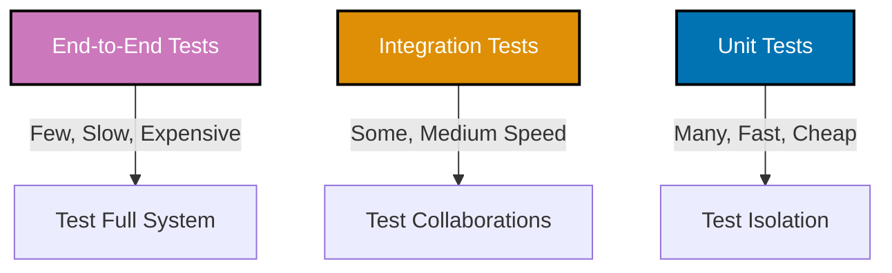
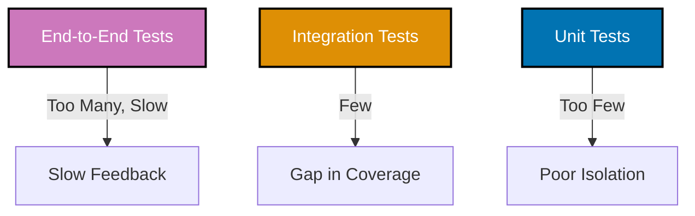

# Test-Driven Development: Test Types and Testing Pyramid

## Overview

Not all tests are created equal. Different types of tests serve different purposes, have different characteristics, and belong in different proportions in your test suite. Understanding these differences is essential to building an effective testing strategy.

The **Testing Pyramid** is a conceptual model that helps teams balance their testing portfolio. It recommends many fast, isolated unit tests at the base; fewer integration tests in the middle; and even fewer slow, end-to-end tests at the top. This distribution maximizes confidence while minimizing cost and execution time.

This document explores three primary test types (unit, integration, end-to-end), their characteristics, when to use each, and how to structure your test suite following the pyramid principle.

## The Testing Pyramid

The Testing Pyramid was popularized by Mike Cohn in his book "Succeeding with Agile" (2009) and has become the standard model for test suite composition.

### Pyramid Structure

**Color Legend**: Purple (E2E Tests), Orange (Integration Tests), Blue (Unit Tests) - all WCAG AA compliant and color-blind friendly.



**Levels from Bottom to Top:**

1. **Unit Tests** (Base, 60-70% of tests)
   - **What**: Test individual functions, classes, or modules in isolation
   - **Speed**: Milliseconds per test
   - **Scope**: Single component, no dependencies
   - **Goal**: Verify logic correctness, edge cases, error handling

2. **Integration Tests** (Middle, 20-30% of tests)
   - **What**: Test interactions between multiple components
   - **Speed**: Seconds per test
   - **Scope**: Database, APIs, file system, bounded context integration
   - **Goal**: Verify components work together correctly

3. **End-to-End (E2E) Tests** (Top, 5-10% of tests)
   - **What**: Test complete user workflows through entire system
   - **Speed**: Minutes per test
   - **Scope**: Full application stack (UI, backend, database, external services)
   - **Goal**: Verify critical user journeys work in production-like environment

### Why a Pyramid (Not a Square or Inverted Pyramid)?

**Pyramid Shape Benefits:**

- **Fast feedback**: Base of unit tests runs in seconds, catching most bugs quickly
- **Cost-effective**: Unit tests are cheapest to write and maintain
- **Debuggability**: Failures in unit tests pinpoint exact problem immediately
- **Stability**: Unit tests rarely have false positives (flaky tests)

**Anti-Pattern: Inverted Pyramid (Ice Cream Cone)**

**Color Legend**: Same as pyramid above - Purple (E2E), Orange (Integration), Blue (Unit).



**Problems with Inverted Pyramid:**

- **Slow feedback**: Waiting hours for E2E tests to complete
- **High maintenance**: E2E tests break frequently due to environmental issues
- **Debugging difficulty**: Failure in E2E test could be caused by dozens of components
- **Flakiness**: Network timeouts, timing issues, browser quirks

**Example**: A team with 10 unit tests, 50 integration tests, 200 E2E tests. Test suite takes 4 hours to run, fails 20% of the time due to flakiness, and developers stop trusting tests.

**Solution**: Rebalance to pyramid shape: 800 unit tests, 150 integration tests, 30 E2E tests. Test suite runs in 10 minutes, failures are meaningful.

## Unit Tests: Foundation of the Pyramid

### Definition

**Unit Test**: Tests a single "unit" of code in complete isolation from dependencies.

**Characteristics:**

- **Fast**: Runs in milliseconds (no I/O, no network, no database)
- **Isolated**: Uses test doubles (mocks, stubs) for dependencies
- **Deterministic**: Same input always produces same output
- **Focused**: Tests one behavior per test
- **Independent**: Can run in any order, in parallel

**What is a "Unit"?**

- **Functional Programming**: A pure function
- **Object-Oriented Programming**: A class or module
- **Domain-Driven Design**: A value object or entity

The key is **isolation**—the unit is tested independently of the rest of the system.

### Example: Testing Money Value Object (Unit Test)

```typescript
// GOOD EXAMPLE: Unit test for Money value object
describe("Money", () => {
  describe("Addition", () => {
    it("should add two amounts in same currency", () => {
      // Arrange
      const five = Money.usd(5);
      const three = Money.usd(3);

      // Act
      const sum = five.add(three);

      // Assert
      expect(sum.equals(Money.usd(8))).toBe(true);
    });

    it("should throw error when adding different currencies", () => {
      // Arrange
      const usd = Money.usd(10);
      const eur = Money.eur(5);

      // Act & Assert
      expect(() => usd.add(eur)).toThrow(CurrencyMismatchError);
    });
  });

  describe("Comparison", () => {
    it("should return true when amount and currency are equal", () => {
      expect(Money.usd(10).equals(Money.usd(10))).toBe(true);
    });

    it("should return false when amounts differ", () => {
      expect(Money.usd(10).equals(Money.usd(5))).toBe(false);
    });

    it("should return false when currencies differ", () => {
      expect(Money.usd(10).equals(Money.eur(10))).toBe(false);
    });
  });

  describe("Multiplication", () => {
    it("should multiply amount by positive percentage", () => {
      const money = Money.usd(100);
      const result = money.multiply(0.025); // 2.5%

      expect(result.equals(Money.usd(2.5))).toBe(true);
    });

    it("should throw error when multiplying by negative percentage", () => {
      const money = Money.usd(100);
      expect(() => money.multiply(-0.5)).toThrow("Cannot multiply by negative");
    });
  });
});

// Implementation
class Money {
  constructor(
    readonly amount: number,
    readonly currency: string,
  ) {
    if (amount < 0) throw new Error("Money cannot be negative");
  }

  static usd(amount: number): Money {
    return new Money(amount, "USD");
  }

  static eur(amount: number): Money {
    return new Money(amount, "EUR");
  }

  add(other: Money): Money {
    if (this.currency !== other.currency) {
      throw new CurrencyMismatchError();
    }
    return new Money(this.amount + other.amount, this.currency);
  }

  multiply(percentage: number): Money {
    if (percentage < 0) {
      throw new Error("Cannot multiply by negative");
    }
    return new Money(this.amount * percentage, this.currency);
  }

  equals(other: Money): boolean {
    return this.amount === other.amount && this.currency === other.currency;
  }
}

// Tests run in <10ms, no dependencies, fully isolated ✅
```

### When to Use Unit Tests

**Use unit tests for:**

1. **Business logic**: Calculations, validations, transformations
   - Example: Zakat calculation formulas, nisab threshold checks
2. **Domain models**: Value objects, entities with invariants
   - Example: Money, HijriDate, ZakatRate
3. **Utilities and helpers**: Pure functions without side effects
   - Example: Date formatting, currency conversion, string manipulation
4. **Edge cases and error handling**: Boundary conditions, invalid inputs
   - Example: Negative amounts, null values, empty arrays
5. **Algorithms**: Sorting, filtering, searching
   - Example: Finding eligible assets for zakat, calculating Hawl period

**Don't use unit tests for:**

- Database queries (use integration tests)
- HTTP API calls (use integration or contract tests)
- File system operations (use integration tests)
- External service integration (use integration tests)
- UI rendering (use component tests or E2E tests)

### Unit Test Characteristics

| Characteristic   | Unit Tests                                |
| ---------------- | ----------------------------------------- |
| **Speed**        | Milliseconds (1-10ms per test)            |
| **Dependencies** | Mocked/stubbed - no real I/O              |
| **Scope**        | Single function, class, or module         |
| **Feedback**     | Immediate (seconds for hundreds of tests) |
| **Maintenance**  | Low - changes only when behavior changes  |
| **Debugging**    | Easy - failure pinpoints exact problem    |
| **Flakiness**    | Very low - deterministic                  |
| **Cost**         | Low - cheap to write and maintain         |

## Integration Tests: Middle of the Pyramid

### Definition

**Integration Test**: Tests collaboration between multiple components, often including real external dependencies.

**Characteristics:**

- **Medium speed**: Runs in seconds (includes I/O - database, file system, network)
- **Real dependencies**: Uses actual database, APIs, or file system (not mocks)
- **Cross-boundary**: Tests communication between bounded contexts, layers, or services
- **Broader scope**: Multiple components working together
- **Environment-dependent**: Requires test database, test containers, or test APIs

**What Integrations to Test:**

- **Repository + Database**: Verify persistence and retrieval work correctly
- **Service + External API**: Verify third-party API integration
- **Bounded Context + Bounded Context**: Verify inter-context communication (contract testing)
- **Application + Message Queue**: Verify event publishing and consumption

### Example: Testing ZakatRepository (Integration Test)

```typescript
// GOOD EXAMPLE: Integration test for ZakatRepository with database
describe("ZakatRepository Integration", () => {
  let repository: ZakatRepository;
  let database: TestDatabase;

  beforeEach(async () => {
    // Set up test database (real database, not mock)
    database = await TestDatabase.create();
    await database.migrate();
    repository = new ZakatRepository(database);
  });

  afterEach(async () => {
    await database.cleanup();
  });

  it("should save and retrieve zakat assessment", async () => {
    // Arrange
    const assessment = new ZakatAssessment(
      AssessmentId.generate(),
      Money.fromGold(100, "grams"),
      Money.fromGold(85, "grams"),
      HijriDate.now(),
    );

    // Act: Save to database
    await repository.save(assessment);

    // Retrieve from database
    const retrieved = await repository.findById(assessment.id);

    // Assert: Verify round-trip
    expect(retrieved).toBeDefined();
    expect(retrieved!.id.equals(assessment.id)).toBe(true);
    expect(retrieved!.wealth.equals(assessment.wealth)).toBe(true);
    expect(retrieved!.nisab.equals(assessment.nisab)).toBe(true);
  });

  it("should find assessments by date range", async () => {
    // Arrange: Insert 3 assessments
    const date1 = HijriDate.of(1445, 1, 1);
    const date2 = HijriDate.of(1445, 6, 1);
    const date3 = HijriDate.of(1446, 1, 1);

    await repository.save(createAssessment(date1));
    await repository.save(createAssessment(date2));
    await repository.save(createAssessment(date3));

    // Act: Query by date range
    const results = await repository.findByDateRange(HijriDate.of(1445, 1, 1), HijriDate.of(1445, 12, 30));

    // Assert: Only 2 assessments in range
    expect(results.length).toBe(2);
    expect(results[0].calculatedAt.equals(date1)).toBe(true);
    expect(results[1].calculatedAt.equals(date2)).toBe(true);
  });

  it("should update existing assessment", async () => {
    // Arrange
    const assessment = createAssessment(HijriDate.now());
    await repository.save(assessment);

    // Act: Modify and save again
    const modified = assessment.recalculate(Money.fromGold(200, "grams"));
    await repository.save(modified);

    // Retrieve
    const retrieved = await repository.findById(assessment.id);

    // Assert: Updated value persisted
    expect(retrieved!.wealth.equals(Money.fromGold(200, "grams"))).toBe(true);
  });
});

// Implementation uses real database connection
class ZakatRepository {
  constructor(private db: Database) {}

  async save(assessment: ZakatAssessment): Promise<void> {
    await this.db.query(
      `INSERT INTO zakat_assessments (id, wealth_amount, wealth_currency, nisab_amount, nisab_currency, calculated_at)
       VALUES ($1, $2, $3, $4, $5, $6)
       ON CONFLICT (id) DO UPDATE SET
         wealth_amount = $2, wealth_currency = $3, nisab_amount = $4, nisab_currency = $5`,
      [
        assessment.id.value,
        assessment.wealth.amount,
        assessment.wealth.currency,
        assessment.nisab.amount,
        assessment.nisab.currency,
        assessment.calculatedAt.toISOString(),
      ],
    );
  }

  async findById(id: AssessmentId): Promise<ZakatAssessment | null> {
    const result = await this.db.query("SELECT * FROM zakat_assessments WHERE id = $1", [id.value]);
    return result.rows[0] ? this.mapToEntity(result.rows[0]) : null;
  }

  async findByDateRange(start: HijriDate, end: HijriDate): Promise<ZakatAssessment[]> {
    const result = await this.db.query(
      "SELECT * FROM zakat_assessments WHERE calculated_at BETWEEN $1 AND $2 ORDER BY calculated_at",
      [start.toISOString(), end.toISOString()],
    );
    return result.rows.map((row) => this.mapToEntity(row));
  }

  private mapToEntity(row: any): ZakatAssessment {
    // Map database row to domain entity
    return new ZakatAssessment(
      AssessmentId.fromString(row.id),
      new Money(row.wealth_amount, row.wealth_currency),
      new Money(row.nisab_amount, row.nisab_currency),
      HijriDate.fromISOString(row.calculated_at),
    );
  }
}

// Tests run in ~500ms (database setup + queries), verify real persistence ✅
```

### When to Use Integration Tests

**Use integration tests for:**

1. **Repository/DAO patterns**: Verify database persistence and queries work
   - Example: ZakatRepository, HalalCertificationRepository
2. **External API integration**: Verify third-party service calls
   - Example: Halal certification authority API, currency exchange rate API
3. **Message queue integration**: Verify event publishing and consumption
   - Example: Publishing ZakatCalculated domain events to RabbitMQ
4. **Bounded context integration**: Verify communication between contexts
   - Example: Zakat context calling Accounting context for wealth data
5. **File system operations**: Verify file read/write, CSV parsing
   - Example: Importing zakat data from CSV files

**Don't use integration tests for:**

- Pure business logic (use unit tests)
- Full end-to-end user workflows (use E2E tests)
- UI rendering (use component or E2E tests)

### Integration Test Characteristics

| Characteristic   | Integration Tests                            |
| ---------------- | -------------------------------------------- |
| **Speed**        | Seconds (100-2000ms per test)                |
| **Dependencies** | Real - database, APIs, file system           |
| **Scope**        | Multiple components, cross-boundary          |
| **Feedback**     | Minutes for entire suite                     |
| **Maintenance**  | Medium - may break due to schema changes     |
| **Debugging**    | Medium - failure could be in multiple places |
| **Flakiness**    | Medium - network/timing issues possible      |
| **Cost**         | Medium - more setup, slower execution        |

### Integration Test Best Practices

**1. Use Test Containers for Databases**

```typescript
// Use Docker containers for isolated database tests
import { GenericContainer } from "testcontainers";

describe("ZakatRepository", () => {
  let container: StartedTestContainer;
  let db: Database;

  beforeAll(async () => {
    // Start PostgreSQL in Docker container
    container = await new GenericContainer("postgres:15")
      .withExposedPorts(5432)
      .withEnvironment({ POSTGRES_PASSWORD: "test" })
      .start();

    const port = container.getMappedPort(5432);
    db = await Database.connect(`postgresql://localhost:${port}/test`);
    await db.migrate();
  });

  afterAll(async () => {
    await db.close();
    await container.stop();
  });

  // Tests use isolated database instance ✅
});
```

**2. Clean State Between Tests**

```typescript
describe("ZakatRepository", () => {
  beforeEach(async () => {
    // Clear database before each test
    await database.query("TRUNCATE TABLE zakat_assessments CASCADE");
  });

  // Each test starts with clean state ✅
});
```

**3. Test Contract, Not Implementation**

```typescript
// GOOD: Test repository contract (public API)
it("should find assessment by ID", async () => {
  const assessment = createAssessment();
  await repository.save(assessment);

  const found = await repository.findById(assessment.id);

  expect(found).toBeDefined();
  expect(found!.id.equals(assessment.id)).toBe(true);
});

// BAD: Test SQL queries directly
it("should execute correct SQL query", async () => {
  const spy = jest.spyOn(db, "query");
  await repository.findById(someId);

  expect(spy).toHaveBeenCalledWith("SELECT * FROM zakat_assessments WHERE id = $1", [someId]);
});
```

## End-to-End (E2E) Tests: Top of the Pyramid

### Definition

**End-to-End Test**: Tests complete user workflows through the entire system, from UI to database.

**Characteristics:**

- **Slow**: Runs in minutes (full application stack, browser automation)
- **Real environment**: Uses production-like setup (UI, backend, database, external services)
- **User perspective**: Simulates actual user interactions (clicks, form submissions)
- **Broad scope**: Entire application or critical user journeys
- **Environment-heavy**: Requires full deployment, test data, external service stubs

**What E2E Tests Verify:**

- Critical user workflows work correctly (happy paths)
- UI, backend, database, and external services integrate correctly
- System behaves as expected from user's perspective
- Major user journeys don't break after deployments

### Example: Testing Zakat Calculation Workflow (E2E Test)

```typescript
// GOOD EXAMPLE: E2E test for complete Zakat assessment workflow
import { test, expect } from "@playwright/test";

test.describe("Zakat Assessment Workflow", () => {
  test("should complete full zakat assessment for gold assets", async ({ page }) => {
    // Navigate to application
    await page.goto("https://localhost:3000/zakat/assessment");

    // Step 1: User selects asset type
    await page.click('button:text("Add Asset")');
    await page.selectOption('select[name="assetType"]', "gold");
    await page.fill('input[name="amount"]', "100");
    await page.selectOption('select[name="unit"]', "grams");
    await page.click('button:text("Add")');

    // Verify asset appears in list
    await expect(page.locator(".asset-list")).toContainText("100 grams of gold");

    // Step 2: User triggers calculation
    await page.click('button:text("Calculate Zakat")');

    // Step 3: Verify results displayed
    await expect(page.locator(".nisab-threshold")).toContainText("Nisab: 85 grams");
    await expect(page.locator(".zakat-amount")).toContainText("Zakat Due: 2.5 grams");
    await expect(page.locator(".zakat-percentage")).toContainText("2.5%");

    // Step 4: User saves assessment
    await page.click('button:text("Save Assessment")');

    // Verify success message
    await expect(page.locator(".success-message")).toContainText("Assessment saved successfully");

    // Step 5: Verify assessment appears in history
    await page.click('a:text("Assessment History")');
    await expect(page.locator(".assessment-history")).toContainText("100 grams");
    await expect(page.locator(".assessment-history")).toContainText("2.5 grams");
  });

  test("should show error when wealth below nisab threshold", async ({ page }) => {
    await page.goto("https://localhost:3000/zakat/assessment");

    // Add asset below nisab (50 grams, nisab is 85 grams)
    await page.click('button:text("Add Asset")');
    await page.selectOption('select[name="assetType"]', "gold");
    await page.fill('input[name="amount"]', "50");
    await page.click('button:text("Add")');

    // Calculate
    await page.click('button:text("Calculate Zakat")');

    // Verify "no zakat due" message
    await expect(page.locator(".zakat-result")).toContainText("Wealth below nisab threshold");
    await expect(page.locator(".zakat-amount")).toContainText("0 grams");
  });
});

// Test runs in ~30 seconds per scenario
// Verifies: UI rendering, form handling, API calls, database persistence, calculations
```

### When to Use E2E Tests

**Use E2E tests for:**

1. **Critical user journeys**: Login, checkout, payment, key workflows
   - Example: Complete zakat assessment workflow (add assets → calculate → save)
2. **Happy path verification**: Most common user scenarios
   - Example: User with gold above nisab calculates zakat successfully
3. **Smoke tests after deployment**: Verify system is functional
   - Example: Can access application, database is accessible, external APIs respond
4. **Cross-cutting concerns**: Security, authentication, authorization flows
   - Example: User login → access protected routes → logout

**Don't use E2E tests for:**

- Edge cases and error handling (use unit tests - faster and more precise)
- Business logic validation (use unit tests)
- Database query correctness (use integration tests)
- Performance testing (use dedicated performance tests)

**Rule of Thumb**: Only E2E test workflows that **must work** for the business to function. Everything else belongs lower in the pyramid.

### E2E Test Characteristics

| Characteristic   | E2E Tests                                        |
| ---------------- | ------------------------------------------------ |
| **Speed**        | Minutes (10-60 seconds per test)                 |
| **Dependencies** | All real - full application stack                |
| **Scope**        | Complete user workflows, entire system           |
| **Feedback**     | Hours for large suites                           |
| **Maintenance**  | High - UI changes break tests frequently         |
| **Debugging**    | Hard - failure could be anywhere in stack        |
| **Flakiness**    | High - timing issues, network, browser rendering |
| **Cost**         | High - expensive to write, slow to execute       |

### E2E Test Best Practices

**1. Test Critical Paths Only**

```typescript
// GOOD: Test critical user journey
test("should complete checkout and payment", async ({ page }) => {
  // User adds item, goes to checkout, pays - core business flow ✅
});

// BAD: Test every possible path
test("should show validation error for invalid email in profile", async ({ page }) => {
  // This edge case should be a unit test ❌
});
```

**2. Use Page Object Model**

```typescript
// GOOD: Extract page interactions into Page Objects
class ZakatAssessmentPage {
  constructor(private page: Page) {}

  async addGoldAsset(grams: number): Promise<void> {
    await this.page.click('button:text("Add Asset")');
    await this.page.selectOption('select[name="assetType"]', "gold");
    await this.page.fill('input[name="amount"]', grams.toString());
    await this.page.click('button:text("Add")');
  }

  async calculate(): Promise<void> {
    await this.page.click('button:text("Calculate Zakat")');
  }

  async getZakatAmount(): Promise<string> {
    return this.page.locator(".zakat-amount").textContent();
  }
}

// Test becomes readable
test("should calculate zakat for gold", async ({ page }) => {
  const assessmentPage = new ZakatAssessmentPage(page);
  await assessmentPage.addGoldAsset(100);
  await assessmentPage.calculate();

  expect(await assessmentPage.getZakatAmount()).toContain("2.5 grams");
});
```

**3. Minimize E2E Test Count**

```typescript
// GOOD: 20-30 E2E tests covering critical journeys
// - User registration and login
// - Zakat assessment workflow
// - Report generation
// - Payment processing

// BAD: 500 E2E tests covering every edge case
// - Tests take hours to run
// - Flakiness becomes unmanageable
// - CI/CD pipeline blocked constantly
```

## Test Distribution: Balancing the Pyramid

### Recommended Distribution

For a typical application:

- **Unit Tests**: 60-70% of total tests (~700-800 tests)
- **Integration Tests**: 20-30% of total tests (~200-300 tests)
- **E2E Tests**: 5-10% of total tests (~30-50 tests)

**Example for 1,000 total tests:**

- 700 unit tests (run in 10 seconds)
- 250 integration tests (run in 5 minutes)
- 50 E2E tests (run in 20 minutes)

**Total execution time**: ~25 minutes for full suite
**Fast feedback**: 10 seconds for unit tests (run on every save)

### Zakat Calculation Module: Pyramid Example

**Unit Tests (70%, ~140 tests)**:

- Money value object (20 tests)
- ZakatRate value object (10 tests)
- NisabThreshold value object (15 tests)
- HijriDate value object (20 tests)
- ZakatCalculator business logic (30 tests)
- Asset classification logic (15 tests)
- Hawl period calculations (20 tests)
- Edge cases and error handling (10 tests)

**Integration Tests (25%, ~50 tests)**:

- ZakatRepository database persistence (15 tests)
- Halal certification API integration (10 tests)
- ZakatService orchestrating multiple components (15 tests)
- Event publishing to message queue (10 tests)

**E2E Tests (5%, ~10 tests)**:

- Complete zakat assessment workflow (3 tests)
- Asset management UI interactions (3 tests)
- Report generation and download (2 tests)
- User authentication and authorization (2 tests)

**Result**: 200 total tests, pyramid shape maintained, fast feedback ✅

## Summary

### Test Types Comparison

| Aspect           | Unit Tests   | Integration Tests   | E2E Tests   |
| ---------------- | ------------ | ------------------- | ----------- |
| **Scope**        | Single unit  | Multiple components | Full system |
| **Dependencies** | Mocked       | Real (DB, APIs)     | All real    |
| **Speed**        | Milliseconds | Seconds             | Minutes     |
| **Feedback**     | Immediate    | Fast                | Slow        |
| **Maintenance**  | Low          | Medium              | High        |
| **Flakiness**    | Very low     | Medium              | High        |
| **Debugging**    | Easy         | Medium              | Hard        |
| **Cost**         | Low          | Medium              | High        |
| **Proportion**   | 60-70%       | 20-30%              | 5-10%       |

### Testing Pyramid Principles

1. **Many fast unit tests** at the base for logic and edge cases
2. **Some medium-speed integration tests** for component interactions
3. **Few slow E2E tests** for critical user journeys
4. **Invert at your peril**: Too many E2E tests = slow, flaky, expensive test suite
5. **Trust the pyramid**: It's proven across thousands of projects

### When to Use Each Test Type

**Use Unit Tests For:**

- Business logic and calculations
- Domain models (value objects, entities)
- Pure functions and utilities
- Edge cases and error handling
- Algorithms and transformations

**Use Integration Tests For:**

- Database persistence and queries
- External API integration
- Message queue publishing/consuming
- Bounded context integration
- File system operations

**Use E2E Tests For:**

- Critical user workflows (happy paths)
- Smoke tests after deployment
- Cross-cutting concerns (auth, security)
- UI and backend integration for key features

### Next Steps

- **[Unit Testing Fundamentals](./ex-so-de-tedrdeve__04-unit-testing-fundamentals.md)**: Deep dive into unit testing techniques
- **[Integration Testing](./ex-so-de-tedrdeve__09-integration-testing.md)**: Contract testing, database integration
- **[End-to-End Testing](./ex-so-de-tedrdeve__10-end-to-end-testing.md)**: Playwright, user journeys, Page Object Model

## Document Metadata

- **Category**: Explanation
- **Subcategory**: Software Design > Test-Driven Development
- **Tags**: Testing Pyramid, Unit Tests, Integration Tests, E2E Tests, Test Strategy, Test Types, Mike Cohn
- **Related Files**:
  - [README](./README.md) - Documentation overview
  - [02. Red-Green-Refactor Cycle](./ex-so-de-tedrdeve__02-red-green-refactor-cycle.md) - TDD workflow
  - [04. Unit Testing Fundamentals](./ex-so-de-tedrdeve__04-unit-testing-fundamentals.md) - Detailed unit testing
  - [09. Integration Testing](./ex-so-de-tedrdeve__09-integration-testing.md) - Integration test patterns
  - [10. End-to-End Testing](./ex-so-de-tedrdeve__10-end-to-end-testing.md) - E2E testing with Playwright
- **Prerequisites**: [02. Red-Green-Refactor Cycle](./ex-so-de-tedrdeve__02-red-green-refactor-cycle.md)
- **Next Steps**: [04. Unit Testing Fundamentals](./ex-so-de-tedrdeve__04-unit-testing-fundamentals.md)
