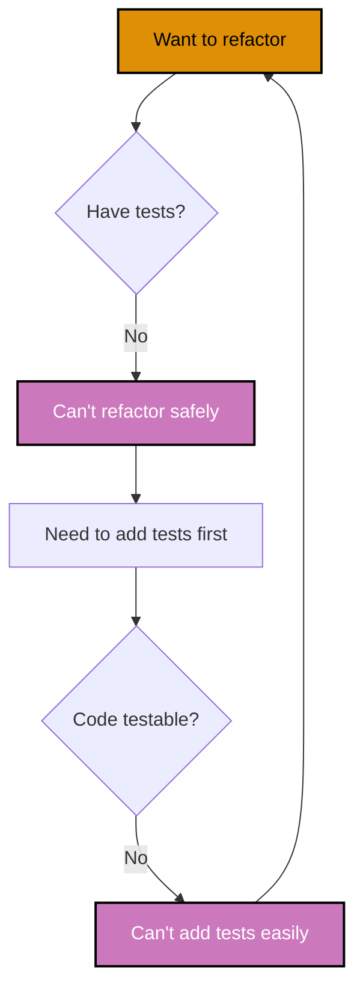
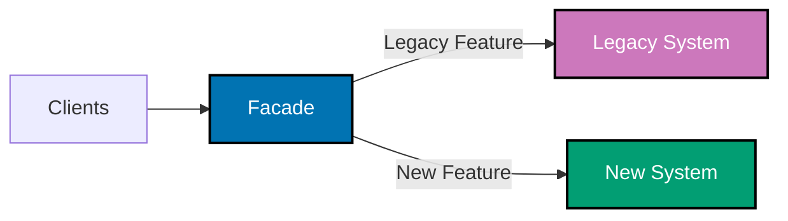

# Test-Driven Development: Legacy Code and Characterization Tests

## Overview

Legacy code—code without tests—presents a unique challenge. You can't safely refactor without tests, but you can't easily add tests because the code wasn't designed for testability. This chicken-and-egg problem requires specialized techniques.

**Characterization tests** (also called **approval tests** or **golden master tests**) document existing behavior before making changes. Instead of specifying correct behavior, they capture current behavior—warts and all. Once behavior is locked down, you can refactor safely.

This document covers techniques for testing legacy code: characterization tests, the seam model for breaking dependencies, dependency-breaking techniques (sprout method/class, wrap method/class), and the Strangler Fig pattern for gradual migration.

## The Legacy Code Challenge

### Definition of Legacy Code

**Michael Feathers** (Working Effectively with Legacy Code): "Legacy code is code without tests."

**Characteristics:**

- No test coverage
- Tightly coupled dependencies
- Long methods (100+ lines)
- Global state, singletons
- Hard to instantiate classes
- Fear of making changes

### The Dilemma

**Color Legend**: Orange (Warning/Action), Purple (Problem State) - all WCAG AA compliant.



**Solution**: Break the cycle with characterization tests and dependency-breaking techniques.

## Characterization Tests

### What Are Characterization Tests?

**Characterization test**: Test that documents current behavior, regardless of whether it's correct.

**Purpose**:

1. Create safety net before refactoring
2. Document actual behavior (not specified behavior)
3. Detect unintended changes

**When to use:**

- Testing legacy code without specifications
- Unclear what "correct" behavior is
- Need to preserve existing behavior during refactoring

### Example: Legacy Zakat Calculator

```typescript
// LEGACY CODE: Untested, unclear logic
class LegacyZakatCalculator {
  calculate(wealth: number, goldPrice: number): number {
    let nisab = 85 * goldPrice;
    if (wealth < nisab) {
      return 0;
    }

    let zakat = wealth * 0.025;

    // Mystery adjustment (why?)
    if (wealth > 100000) {
      zakat = zakat * 1.1;
    }

    // Round to 2 decimals
    return Math.round(zakat * 100) / 100;
  }
}

// CHARACTERIZATION TEST: Document current behavior
describe("LegacyZakatCalculator - Characterization", () => {
  let calculator: LegacyZakatCalculator;

  beforeEach(() => {
    calculator = new LegacyZakatCalculator();
  });

  it("should return 0 when wealth below nisab", () => {
    const result = calculator.calculate(1000, 65.5);

    expect(result).toBe(0); // Characterizes current behavior ✅
  });

  it("should calculate 2.5% when wealth >= nisab", () => {
    const result = calculator.calculate(10000, 65.5);

    expect(result).toBeCloseTo(250, 2); // 10000 * 0.025 = 250
  });

  it("should apply 10% bonus when wealth > 100000", () => {
    const result = calculator.calculate(150000, 65.5);

    // 150000 * 0.025 = 3750
    // 3750 * 1.1 = 4125
    expect(result).toBeCloseTo(4125, 2);
  });

  it("should round to 2 decimal places", () => {
    const result = calculator.calculate(1234.567, 65.5);

    expect(result).toBe(30.86); // Not 30.8641425
  });
});
```

**Key points:**

- Tests capture actual behavior, even if wrong (10% bonus is suspicious)
- Tests allow safe refactoring
- After refactoring, can update tests to specify correct behavior

### Approval Testing (Golden Master)

**Approval testing**: Compare current output to approved baseline.

```typescript
import { toMatchFile } from "jest-file-snapshot";

describe("HalalCertificationReport - Approval Test", () => {
  it("should match approved report format", () => {
    const products = [
      { name: "Product A", status: "APPROVED", certNumber: "HALAL-001" },
      { name: "Product B", status: "PENDING", certNumber: null },
    ];

    const report = generateHalalCertificationReport(products);

    // Compare to approved baseline
    expect(report).toMatchFile("./snapshots/halal-report.approved.txt");
  });
});

// First run: Creates halal-report.approved.txt
// Subsequent runs: Compares output to approved file
// If different: Test fails, review diff, approve if intentional
```

**Benefits:**

- Captures complex output (HTML, PDFs, reports)
- Easy to review changes (diff tools)
- Locks down behavior comprehensively

## The Seam Model

### What Is a Seam?

**Seam** (Michael Feathers): A place where you can alter behavior without editing code in that place.

**Types of seams:**

1. **Object seam**: Replace object with test double
2. **Preprocessor seam**: Conditional compilation
3. **Link seam**: Link different implementations

### Object Seam Example

```typescript
// LEGACY: Hard-coded dependency ❌
class LegacyMurabahaService {
  process(contractId: string): void {
    const db = new ProductionDatabase(); // Hard-coded ❌
    const contract = db.findContract(contractId);
    // ...
  }
}

// SEAM: Inject dependency ✅
class MurabahaService {
  constructor(private db: Database) {} // Seam: Injectable ✅

  process(contractId: string): void {
    const contract = this.db.findContract(contractId);
    // ...
  }
}

// TEST: Use fake at seam
describe("MurabahaService", () => {
  it("should process contract", () => {
    const fakeDb = new FakeDatabase();
    fakeDb.addContract(buildMurabahaContract());

    const service = new MurabahaService(fakeDb); // Use fake ✅

    service.process("CONTRACT-001");
    // Assertions...
  });
});
```

## Dependency-Breaking Techniques

### Sprout Method

**Sprout Method**: Extract new logic into separate method that can be tested.

```typescript
// BEFORE: Untestable method
class LegacyZakatService {
  processAssessment(userId: string): void {
    // 200 lines of tangled logic ❌
    const user = globalUserRepository.find(userId);
    const wealth = calculateWealth(user); // Can't test ❌
    const zakat = wealth * 0.025;
    globalZakatRepository.save(userId, zakat);
    sendEmail(user.email, zakat); // Side effect ❌
  }
}

// AFTER: Sprout method
class LegacyZakatService {
  processAssessment(userId: string): void {
    const user = globalUserRepository.find(userId);
    const wealth = calculateWealth(user);

    // SPROUTED: New testable method ✅
    const zakat = this.calculateZakat(wealth);

    globalZakatRepository.save(userId, zakat);
    sendEmail(user.email, zakat);
  }

  // NEW: Pure, testable method ✅
  private calculateZakat(wealth: number): number {
    return wealth * 0.025;
  }
}

// TEST: Test sprouted method
describe("LegacyZakatService - Sprouted Method", () => {
  it("should calculate zakat at 2.5%", () => {
    const service = new LegacyZakatService();

    const zakat = service["calculateZakat"](1000); // Access private ✅

    expect(zakat).toBe(25);
  });
});
```

**Benefits:**

- Add new functionality with tests
- Don't touch untested legacy code
- Gradually grow tested codebase

### Sprout Class

**Sprout Class**: Extract complex logic into new class that can be tested.

```typescript
// BEFORE: Complex calculation embedded in service
class LegacyHalalCertificationService {
  evaluate(product: Product): string {
    // 300 lines of ingredient validation logic ❌
    // ...complex, untested code...
  }
}

// AFTER: Sprout class
class IngredientValidator {
  validate(ingredients: string[]): ValidationResult {
    const haramIngredients = ["pork", "alcohol", "blood"];

    const violations = ingredients.filter((ing) => haramIngredients.includes(ing.toLowerCase()));

    return {
      isValid: violations.length === 0,
      violations,
    };
  }
}

class LegacyHalalCertificationService {
  private ingredientValidator = new IngredientValidator(); // Use sprouted class ✅

  evaluate(product: Product): string {
    // Use validated logic
    const result = this.ingredientValidator.validate(product.ingredients);

    if (!result.isValid) {
      return "REJECTED: " + result.violations.join(", ");
    }

    // ... rest of legacy logic ...
    return "APPROVED";
  }
}

// TEST: Test sprouted class in isolation ✅
describe("IngredientValidator", () => {
  let validator: IngredientValidator;

  beforeEach(() => {
    validator = new IngredientValidator();
  });

  it("should approve halal ingredients", () => {
    const result = validator.validate(["chicken", "salt", "pepper"]);

    expect(result.isValid).toBe(true);
  });

  it("should reject haram ingredients", () => {
    const result = validator.validate(["chicken", "pork"]);

    expect(result.isValid).toBe(false);
    expect(result.violations).toEqual(["pork"]);
  });
});
```

### Wrap Method

**Wrap Method**: Wrap existing method to add new behavior.

```typescript
// BEFORE: Can't add logging without touching untested code
class LegacyMurabahaContract {
  activate(): void {
    // 100 lines of activation logic ❌
  }
}

// AFTER: Wrap method
class LegacyMurabahaContract {
  activate(): void {
    this.activateAndLog(); // Wrap ✅
  }

  private activateAndLog(): void {
    this.logActivation(); // New behavior ✅
    this.doActivate(); // Original logic renamed ✅
  }

  private doActivate(): void {
    // Original 100 lines unchanged ✅
  }

  private logActivation(): void {
    console.log("Contract activated");
  }
}

// TEST: Test wrapper
describe("LegacyMurabahaContract - Wrapper", () => {
  it("should log activation", () => {
    const contract = new LegacyMurabahaContract();
    const logSpy = jest.spyOn(console, "log");

    contract.activate();

    expect(logSpy).toHaveBeenCalledWith("Contract activated");
  });
});
```

### Wrap Class (Decorator)

**Wrap Class**: Wrap entire class to add new behavior.

```typescript
// LEGACY: Can't change
class LegacyZakatRepository {
  save(userId: string, amount: number): void {
    // Legacy implementation ❌
  }
}

// WRAPPER: Add new behavior
class LoggingZakatRepository {
  constructor(private legacy: LegacyZakatRepository) {}

  save(userId: string, amount: number): void {
    console.log(`Saving zakat for user ${userId}: ${amount}`);
    this.legacy.save(userId, amount); // Delegate ✅
  }
}

// TEST: Test wrapper
describe("LoggingZakatRepository", () => {
  it("should log before saving", () => {
    const legacyRepo = new LegacyZakatRepository();
    const wrapper = new LoggingZakatRepository(legacyRepo);
    const logSpy = jest.spyOn(console, "log");

    wrapper.save("USER-001", 25);

    expect(logSpy).toHaveBeenCalledWith("Saving zakat for user USER-001: 25");
  });
});
```

## Strangler Fig Pattern

### Gradual Migration Strategy

**Strangler Fig** (Martin Fowler): Gradually replace legacy system by wrapping it and routing traffic to new implementation.

**Color Legend**: Blue (Facade), Purple (Legacy), Teal (New System) - all WCAG AA compliant.



### Example: Migrating Zakat Calculator

```typescript
// PHASE 1: Create facade
class ZakatCalculatorFacade {
  private legacyCalculator = new LegacyZakatCalculator();
  private newCalculator = new ModernZakatCalculator();

  calculate(wealth: Money, nisab: Money): Money {
    // Route to new implementation when ready
    if (this.isNewCalculatorEnabled()) {
      return this.newCalculator.calculate(wealth, nisab);
    }

    // Fall back to legacy
    const legacyResult = this.legacyCalculator.calculate(wealth.amount, nisab.amount);
    return Money.usd(legacyResult);
  }

  private isNewCalculatorEnabled(): boolean {
    return process.env.USE_NEW_CALCULATOR === "true";
  }
}

// PHASE 2: Test both implementations produce same results
describe("ZakatCalculatorFacade - Strangler", () => {
  it("should produce same results from legacy and new", () => {
    const legacyCalc = new LegacyZakatCalculator();
    const newCalc = new ModernZakatCalculator();

    const testCases = [
      { wealth: 1000, nisab: 85 },
      { wealth: 50000, nisab: 5567.5 },
      { wealth: 100, nisab: 5567.5 },
    ];

    testCases.forEach((testCase) => {
      const legacyResult = legacyCalc.calculate(testCase.wealth, testCase.nisab);
      const newResult = newCalc.calculate(Money.usd(testCase.wealth), Money.usd(testCase.nisab));

      expect(newResult.amount).toBeCloseTo(legacyResult, 2);
    });
  });
});

// PHASE 3: Gradually route traffic to new implementation
// PHASE 4: Remove legacy when 100% migrated
```

## Working with Untestable Code

### Breaking Global Dependencies

```typescript
// LEGACY: Global singleton ❌
class GlobalDatabase {
  private static instance: GlobalDatabase;

  static getInstance(): GlobalDatabase {
    if (!this.instance) {
      this.instance = new GlobalDatabase();
    }
    return this.instance;
  }

  save(data: any): void {
    // Real database call ❌
  }
}

class LegacyService {
  process(): void {
    const db = GlobalDatabase.getInstance(); // Can't fake ❌
    db.save({});
  }
}

// REFACTORED: Inject dependency ✅
class ModernService {
  constructor(private db: Database) {} // Injectable ✅

  process(): void {
    this.db.save({});
  }
}

// TEST: Use fake
describe("ModernService", () => {
  it("should save data", () => {
    const fakeDb = new FakeDatabase();
    const service = new ModernService(fakeDb);

    service.process();

    expect(fakeDb.savedData).toHaveLength(1);
  });
});
```

### Breaking Constructor Dependencies

```typescript
// LEGACY: Constructor creates dependencies ❌
class LegacyMurabahaService {
  private emailService: EmailService;

  constructor() {
    this.emailService = new RealEmailService(); // Hard-coded ❌
  }
}

// REFACTORED: Constructor accepts dependencies ✅
class ModernMurabahaService {
  constructor(private emailService: EmailService) {} // Injected ✅
}

// TEST: Inject fake
describe("ModernMurabahaService", () => {
  it("should send email", () => {
    const fakeEmail = new FakeEmailService();
    const service = new ModernMurabahaService(fakeEmail);

    service.notifyCustomer();

    expect(fakeEmail.sentEmails).toHaveLength(1);
  });
});
```

## Summary

Testing legacy code requires specialized techniques:

**Characterization Tests:**

- Document current behavior (right or wrong)
- Create safety net before refactoring
- Approval testing for complex outputs
- Use golden master for regression detection

**Seam Model:**

- Find places to alter behavior without editing code
- Object seams (dependency injection)
- Enable testing without large-scale rewrites

**Dependency-Breaking Techniques:**

1. **Sprout Method**: Extract new logic into testable method
2. **Sprout Class**: Extract complex logic into new class
3. **Wrap Method**: Wrap existing method to add behavior
4. **Wrap Class**: Decorator pattern for new functionality

**Strangler Fig Pattern:**

- Gradually replace legacy system
- Facade routes to legacy or new implementation
- Test equivalence before migrating
- Remove legacy when 100% migrated

**Breaking Dependencies:**

- Replace global singletons with injection
- Extract dependencies from constructors
- Use seams to inject fakes in tests

**Best Practices:**

1. Start with characterization tests (lock down behavior)
2. Identify seams (where to inject fakes)
3. Use dependency-breaking techniques (sprout, wrap)
4. Gradually migrate using Strangler Fig
5. Don't fix everything at once (incremental improvement)
6. Refactor under test coverage
7. Update tests to specify correct behavior after refactoring

Legacy code is manageable with the right techniques. Start small, add tests incrementally, and gradually improve design.

## Related Documentation

- **[02. Red-Green-Refactor Cycle](./ex-so-de-tedrdeve__02-red-green-refactor-cycle.md)** - Refactoring discipline
- **[05. Test Doubles](./ex-so-de-tedrdeve__05-test-doubles.md)** - Fakes for breaking dependencies
- **[14. Refactoring with Tests](./ex-so-de-tedrdeve__14-refactoring-with-tests.md)** - Safe refactoring patterns
- **[15. Testing Anti-Patterns](./ex-so-de-tedrdeve__15-testing-anti-patterns.md)** - Avoiding testability pitfalls
