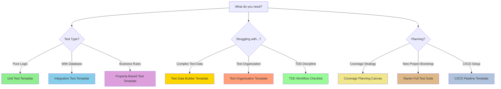

# TDD Templates

## Metadata

- **Parent Directory**: [Test-Driven Development (TDD)](../README.md)
- **Main Topic**: [Test-Driven Development (TDD)](../README.md)
- **Use Case**: Ready-to-use templates for practicing TDD with various test types
- **Complexity**: Beginner to Advanced

## Overview

Stop staring at blank test files. Start with proven templates.

This directory provides immediately usable templates for practicing Test-Driven Development (TDD) following the Red-Green-Refactor cycle. Templates cover unit tests, integration tests, property-based tests, test organization, and complete test suites. Each template includes Islamic Finance examples (Tax, Permitted certification, Loan contracts) that demonstrate TDD practices in a real-world domain.

These templates serve as starting points for teams adopting TDD or individuals learning the practice. Copy templates, replace placeholders with your domain-specific content, and adapt to your project's needs. Templates enforce TDD discipline through structured workflows and checklists.

## Available Templates

### 1. Unit Test Template

**File**: [ex-so-de-tedrdeve-te\_\_unit-test-template.md](./ex-so-de-tedrdeve-te__unit-test-template.md)

**Purpose**: Standardized structure for testing isolated units using AAA pattern

**When to Use**:

- Testing pure functions and business logic
- Verifying value objects and domain entities
- Testing class methods in isolation
- Writing fast, focused tests without external dependencies

**Contains**:

- AAA (Arrange-Act-Assert) pattern structure
- Test organization with `describe` blocks
- Happy path, edge cases, and error scenarios
- Test naming conventions and best practices
- Islamic Finance example: Tax calculation for gold/silver

### 2. Integration Test Template

**File**: [ex-so-de-tedrdeve-te\_\_integration-test-template.md](./ex-so-de-tedrdeve-te__integration-test-template.md)

**Purpose**: Test component interactions with real infrastructure dependencies

**When to Use**:

- Testing repository implementations with real databases
- Verifying API endpoints with database operations
- Testing message queue producers and consumers
- Validating external service integrations
- Testing transaction boundaries and rollback behavior

**Contains**:

- Test container setup for databases
- Integration test lifecycle (setup, teardown, isolation)
- Real dependency configuration (database, message queues)
- Transaction management and cleanup patterns
- Islamic Finance example: Permitted certification persistence

### 3. Property-Based Test Template

**File**: [ex-so-de-tedrdeve-te\_\_property-based-test-template.md](./ex-so-de-tedrdeve-te__property-based-test-template.md)

**Purpose**: Test invariants with automatically generated test cases

**When to Use**:

- Testing business rules that must always hold (invariants)
- Discovering edge cases you didn't think of
- Testing mathematical properties (commutativity, associativity)
- Validating data transformation consistency
- Testing parsers, serializers, encoders/decoders

**Contains**:

- Property-based testing with fast-check library
- Arbitrary generation for domain types
- Invariant specification and verification
- Shrinking strategies for counterexample discovery
- Islamic Finance example: Tax calculation invariants

### 4. Test Data Builder Template

**File**: [ex-so-de-tedrdeve-te\_\_test-data-builder-template.md](./ex-so-de-tedrdeve-te__test-data-builder-template.md)

**Purpose**: Fluent API for constructing test data with sensible defaults

**When to Use**:

- Creating complex domain objects in tests
- Reducing test setup duplication
- Making test intent clear through fluent API
- Managing test data variations across scenarios

**Contains**:

- Builder pattern implementation with fluent API
- Sensible defaults for valid objects
- Method chaining for customization
- Factory methods for common scenarios
- Islamic Finance example: Loan contract builders

### 5. Test Organization Template

**File**: [ex-so-de-tedrdeve-te\_\_test-organization-template.md](./ex-so-de-tedrdeve-te__test-organization-template.md)

**Purpose**: Project structure and conventions for organizing test suites

**When to Use**:

- Setting up test structure for new project
- Reorganizing existing test suite
- Establishing team conventions for test organization
- Defining test categorization strategy (unit, integration, e2e)

**Contains**:

- Directory structure for different test types
- Test file naming conventions
- Test categorization and tagging strategy
- Test suite configuration and setup
- Islamic Finance example: Multi-module test organization

### 6. TDD Workflow Checklist

**File**: [ex-so-de-tedrdeve-te\_\_tdd-workflow-checklist.md](./ex-so-de-tedrdeve-te__tdd-workflow-checklist.md)

**Purpose**: Step-by-step checklist for practicing Red-Green-Refactor discipline

**When to Use**:

- Learning TDD for the first time
- Maintaining TDD discipline during development
- Onboarding new team members to TDD
- Preventing common TDD mistakes (skipping tests, writing code first)

**Contains**:

- Environment setup checklist
- Pre-TDD session planning steps
- Red-Green-Refactor cycle checklist
- Post-cycle verification steps
- Common mistakes and how to avoid them

### 7. Coverage Planning Canvas

**File**: [ex-so-de-tedrdeve-te\_\_coverage-planning-canvas.md](./ex-so-de-tedrdeve-te__coverage-planning-canvas.md)

**Purpose**: Systematically plan comprehensive test coverage for modules

**When to Use**:

- Starting new module or feature
- Auditing existing code for coverage gaps
- Planning test strategy for complex domain logic
- Defining "done" criteria for features
- Conducting test-driven design sessions

**Contains**:

- Module overview and risk assessment
- Component inventory and categorization
- Test scenario identification matrix
- Coverage targets based on risk and complexity
- Islamic Finance example: Tax module coverage planning

### 8. Starter Full Test Suite Template

**File**: [ex-so-de-tedrdeve-te\_\_starter-full-test-suite.md](./ex-so-de-tedrdeve-te__starter-full-test-suite.md)

**Purpose**: Complete, ready-to-use test suite starter for new features

**When to Use**:

- Bootstrapping test suite for greenfield project
- Demonstrating comprehensive testing approach
- Learning how different test types work together
- Establishing test suite patterns for team

**Contains**:

- Complete working example (unit, integration, property-based)
- Test data builders and utilities
- Test configuration and setup
- CI/CD integration examples
- Islamic Finance example: Permitted certification complete test suite

### 9. CI/CD Pipeline Template

**File**: [ex-so-de-tedrdeve-te\_\_ci-cd-pipeline-template.md](./ex-so-de-tedrdeve-te__ci-cd-pipeline-template.md)

**Purpose**: Continuous Integration configuration for TDD workflows

**When to Use**:

- Setting up automated test execution in CI/CD
- Configuring test parallelization and optimization
- Establishing quality gates based on test results
- Integrating test reporting and coverage tracking

**Contains**:

- GitHub Actions, GitLab CI, and Jenkins configurations
- Test execution strategies (parallel, sequential)
- Coverage reporting and quality gates
- Notification and failure handling
- Islamic Finance example: Multi-service test pipeline

## Quick Start: Most Popular Templates

New to TDD? Start with these three templates in order:

1. **TDD Workflow Checklist** - Learn the Red-Green-Refactor discipline
2. **Unit Test Template** - Write your first test with AAA pattern
3. **Test Data Builder Template** - Simplify test data creation

Building a complete feature? Use this sequence:

1. **Coverage Planning Canvas** - Plan what to test
2. **Starter Full Test Suite** - Bootstrap your test suite
3. **CI/CD Pipeline Template** - Automate test execution

## How to Use These Templates

### Step 1: Choose Template Based on Need

| Need                              | Use Template                 |
| --------------------------------- | ---------------------------- |
| Write unit test for pure function | Unit Test Template           |
| Test with real database           | Integration Test Template    |
| Test business invariants          | Property-Based Test Template |
| Create complex test data easily   | Test Data Builder Template   |
| Organize test suite structure     | Test Organization Template   |
| Learn TDD Red-Green-Refactor      | TDD Workflow Checklist       |
| Plan comprehensive coverage       | Coverage Planning Canvas     |
| Bootstrap complete test suite     | Starter Full Test Suite      |
| Set up automated testing in CI    | CI/CD Pipeline Template      |

### Step 2: Copy Template

```bash
# Copy template to your project
cp templates/ex-so-de-tedrdeve-te__unit-test-template.md \
   src/lib/my-component.spec.ts

# Or reference template structure when creating new files
```

### Step 3: Replace Placeholders

Templates use placeholders in square brackets:

- `[ComponentUnderTest]` → Your class/function name (e.g., `TaxCalculator`)
- `[Method or Feature Name]` → Method being tested (e.g., `calculateTax`)
- `[should do expected behavior]` → Test description (e.g., `should calculate 2.5% tax on gold above threshold`)
- `[dependency]` → External dependencies (e.g., `TaxRepository`)
- `[input]` → Test input data (e.g., `{ assetType: 'gold', amount: 100 }`)

### Step 4: Customize for Your Domain

Replace Islamic Finance examples with your domain:

- **Islamic Finance**: Tax, Loan, Permitted, Asset → **Your Domain**: Your business concepts
- **Compliance Advisor**: Domain expert → **Your Expert**: Your domain expert role
- **Asset types (gold, silver)**: Your data entities
- **Compliance rules**: Your business rules

### Step 5: Follow TDD Discipline

Use the TDD Workflow Checklist to ensure proper Red-Green-Refactor cycle:

1. **Red**: Write failing test first (assert expected behavior)
2. **Green**: Write minimal code to make test pass
3. **Refactor**: Improve code while keeping tests green

## Template Selection Flowchart



## Template Customization Guide

### For Islamic Finance Projects

Templates already include Islamic Finance examples:

- **Tax calculation**: Threshold thresholds, Hawl (lunar year), 2.5% rate
- **Loan contracts**: Cost disclosure, profit margin, asset ownership
- **Permitted certification**: Ingredient verification, supplier validation
- **Asset management**: Gold, silver, real estate, business inventory

Use these directly or adapt to specific Fiqh school (Madhab) requirements.

### For Other Domains

Replace Islamic Finance concepts with your domain:

**E-commerce Example**:

```typescript
// Template (Islamic Finance - Tax)
describe("TaxCalculator", () => {
  it("should calculate 2.5% tax on gold above 85g threshold", () => {
    const calculator = new TaxCalculator();
    const result = calculator.calculate({ asset: "gold", amount: 100 });
    expect(result.taxAmount).toBe(2.5);
  });
});

// Adapted (E-commerce)
describe("ShippingCalculator", () => {
  it("should apply free shipping on orders above $50 threshold", () => {
    const calculator = new ShippingCalculator();
    const result = calculator.calculate({ orderTotal: 75 });
    expect(result.shippingCost).toBe(0);
  });
});
```

**Healthcare Example**:

```typescript
// Template (Islamic Finance - Permitted)
describe("CertificationValidator", () => {
  it("should mark product as certified when all ingredients are permitted", () => {
    const validator = new CertificationValidator();
    const result = validator.validate(permitedProduct);
    expect(result.certified).toBe(true);
  });
});

// Adapted (Healthcare)
describe("PrescriptionValidator", () => {
  it("should approve prescription when all medications are formulary-approved", () => {
    const validator = new PrescriptionValidator();
    const result = validator.validate(validPrescription);
    expect(result.approved).toBe(true);
  });
});
```

## Template Organization by TDD Phase

Templates are organized by TDD lifecycle:

```
Planning Phase:
  → Coverage Planning Canvas
  → TDD Workflow Checklist
  → Test Organization Template

Red-Green-Refactor Phase:
  → Unit Test Template
  → Integration Test Template
  → Property-Based Test Template
  → Test Data Builder Template

Automation Phase:
  → Starter Full Test Suite Template
  → CI/CD Pipeline Template
```

## Template Quality Guidelines

All templates follow these TDD principles:

1. **Test First**: Write test before implementation (Red phase)
2. **Minimal Code**: Write least code to pass test (Green phase)
3. **Refactor Safely**: Improve design while tests stay green
4. **Fast Feedback**: Unit tests run in milliseconds
5. **Isolated**: Tests don't depend on external state
6. **Repeatable**: Tests produce same result every time
7. **Self-Validating**: Tests clearly pass or fail
8. **Timely**: Tests written just before production code

## Related Documentation

- **TDD Core Concepts**: [Introduction and Philosophy](../ex-so-de-tedrdeve__01-introduction-and-philosophy.md)
- **TDD Cycle**: [Red-Green-Refactor Cycle](../ex-so-de-tedrdeve__02-red-green-refactor-cycle.md)
- **Unit Testing**: [Unit Testing Fundamentals](../ex-so-de-tedrdeve__04-unit-testing-fundamentals.md)
- **Test Types**: [Test Types and Pyramid](../ex-so-de-tedrdeve__03-test-types-and-pyramid.md)
- **Best Practices**: [TDD Best Practices](../ex-so-de-tedrdeve__18-best-practices.md)
- **Anti-patterns**: [TDD Antipatterns](../ex-so-de-tedrdeve__19-anti-patterns.md)
- **FAQ**: [Frequently Asked Questions](../ex-so-de-tedrdeve__17-faq.md)

## Contributing New Templates

To add new templates to this collection:

1. **Identify Need**: What TDD practice lacks good template?
2. **Create Template**: Write template with placeholders and examples
3. **Add Islamic Finance Example**: Demonstrate with real-world scenario
4. **Document Usage**: When to use, what it contains, how to customize
5. **Link to Main Docs**: Reference from README and related docs

## Related Principles

TDD templates embody software engineering principles:

- **[Explicit Over Implicit](../../../../../../governance/principles/software-engineering/explicit-over-implicit.md)** - Tests explicitly document expected behavior through assertions. Templates enforce explicit AAA structure and clear test naming.
- **[Simplicity Over Complexity](../../../../../../governance/principles/general/simplicity-over-complexity.md)** - Red-Green-Refactor enforces minimal implementation. Templates provide essential structure without over-engineering.
- **[Reproducibility First](../../../../../../governance/principles/software-engineering/reproducibility.md)** - Tests verify reproducible behavior. Templates include test containers, builders, and isolation patterns for consistent test execution.
- **[Pure Functions Over Side Effects](../../../../../../governance/principles/software-engineering/pure-functions.md)** - Unit test templates emphasize testing pure functions with deterministic inputs and outputs.

See [Software Engineering Principles](../../../../../../governance/principles/software-engineering/README.md) for comprehensive documentation.

## Summary

**Available Templates (9)**:

1. **Unit Test Template**: AAA pattern for isolated unit testing
2. **Integration Test Template**: Test with real infrastructure dependencies
3. **Property-Based Test Template**: Test invariants with generated cases
4. **Test Data Builder Template**: Fluent API for test data construction
5. **Test Organization Template**: Project structure and conventions
6. **TDD Workflow Checklist**: Red-Green-Refactor discipline guide
7. **Coverage Planning Canvas**: Systematic coverage planning
8. **Starter Full Test Suite**: Complete test suite bootstrap
9. **CI/CD Pipeline Template**: Automated test execution configuration

**Quick Start**: TDD Workflow Checklist → Unit Test Template → Test Data Builder Template

**Usage**: Copy template → Replace placeholders → Customize for domain → Follow Red-Green-Refactor

**Examples**: All templates include Islamic Finance examples (Tax, Loan, Permitted, Assets)

Use these templates to accelerate TDD adoption, maintain test-first discipline, and build comprehensive test suites with confidence.
