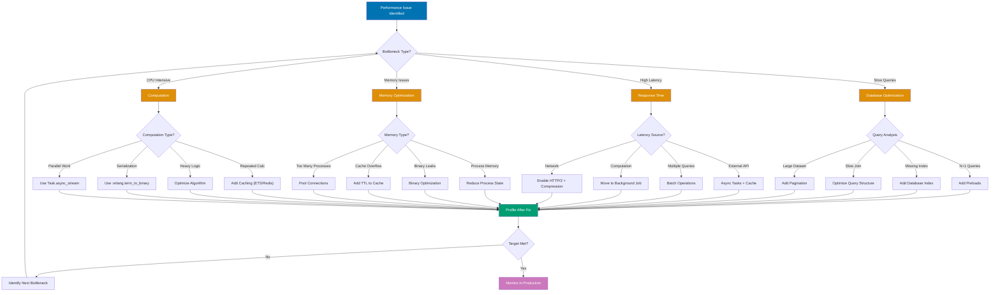

# Phoenix Performance Guide

## Quick Reference

**Navigation**: [Stack Libraries](../README.md) > [Elixir Phoenix](./README.md) > Performance

### At a Glance

| Performance Area   | Technique                     | Tools/Libraries              |
| ------------------ | ----------------------------- | ---------------------------- |
| Query Optimization | Preloading, indexes, batching | Ecto, pg_stat_statements     |
| Caching            | In-memory, distributed        | ETS, Cachex, Redis           |
| Connection Pooling | DB pools, HTTP pools          | DBConnection, Finch          |
| Profiling          | Runtime analysis              | :observer, :fprof, Telemetry |
| Load Testing       | Stress testing                | k6, Bombardier               |
| Scaling            | Clustering, load balancing    | libcluster, HAProxy          |

## Overview

Phoenix applications can handle millions of concurrent connections, but performance optimization is crucial for maintaining low latency and high throughput, especially when processing Islamic financial calculations like Zakat, Murabaha contracts, and charitable donations.

**Target Audience**: Developers optimizing Phoenix application performance for production workloads.

**Versions**: Phoenix 1.7+, Elixir 1.14+, Ecto 3.10+

### Performance Optimization Strategy



**Optimization Process**:

1. **Identify bottleneck**: Use profiling tools (`:observer`, `:fprof`, Telemetry)
2. **Categorize issue**: Database, latency, memory, or CPU
3. **Apply targeted fix**: Choose appropriate optimization from decision tree
4. **Profile after fix**: Measure improvement with same tools
5. **Iterate**: If target not met, find next bottleneck
6. **Monitor production**: Set up alerts for regressions

**Profiling Tools**:

- **`:observer`** - Real-time system monitoring (processes, memory, CPU)
- **`:fprof`** - Function-level profiling
- **Telemetry** - Custom metrics and monitoring
- **EXPLAIN ANALYZE** - Database query analysis
- **k6/Bombardier** - Load testing

## Table of Contents

1. [Query Optimization](#query-optimization)
2. [Caching Strategies](#caching-strategies)
3. [Connection Pooling](#connection-pooling)
4. [Profiling and Monitoring](#profiling-and-monitoring)
5. [Load Testing](#load-testing)
6. [Horizontal Scaling](#horizontal-scaling)
7. [Memory Optimization](#memory-optimization)
8. [Response Time Optimization](#response-time-optimization)

## Query Optimization

### N+1 Query Prevention

The N+1 problem occurs when loading associations in a loop, causing excessive database queries.

**❌ FAIL - N+1 Query Problem**

```elixir
# BAD: N+1 queries - 1 query for donations + N queries for charities
defmodule BadQueries do
  def list_donations_with_charities do
    Repo.all(Donation)
    |> Enum.map(fn donation ->
      # Each iteration triggers a separate query!
      charity = Repo.get!(Charity, donation.charity_id)
      %{donation | charity: charity}
    end)
  end

  # Generates queries like:
  # SELECT * FROM donations; -- 1 query
  # SELECT * FROM charities WHERE id = 1; -- Query for each donation!
  # SELECT * FROM charities WHERE id = 2;
  # SELECT * FROM charities WHERE id = 3;
  # ...
end
```

**✅ PASS - Preload with JOIN**

```elixir
# GOOD: Single query with JOIN
defmodule GoodQueries do
  import Ecto.Query

  def list_donations_with_charities do
    Donation
    |> preload(:charity)
    |> Repo.all()
  end

  # Generates single query:
  # SELECT d.*, c.* FROM donations d
  # LEFT JOIN charities c ON c.id = d.charity_id;

  # Alternative: Manual join for more control
  def list_donations_with_charities_manual do
    from(d in Donation,
      join: c in assoc(d, :charity),
      preload: [charity: c]
    )
    |> Repo.all()
  end
end
```

**Islamic Finance Example**: Optimizing Zakat Calculations with Preloading

```elixir
defmodule OsePlatform.Zakat.Queries do
  import Ecto.Query

  # ❌ BAD: N+1 problem
  def list_calculations_bad(user_id) do
    user = Repo.get!(User, user_id)

    Repo.all(
      from c in Calculation,
        where: c.user_id == ^user_id
    )
    |> Enum.map(fn calculation ->
      # Separate query for each calculation!
      assets = Repo.all(from a in Asset, where: a.calculation_id == ^calculation.id)
      liabilities = Repo.all(from l in Liability, where: l.calculation_id == ^calculation.id)

      %{calculation | assets: assets, liabilities: liabilities}
    end)
  end

  # ✅ GOOD: Preload all associations
  def list_calculations_good(user_id) do
    from(c in Calculation,
      where: c.user_id == ^user_id,
      preload: [:assets, :liabilities, :distributions],
      order_by: [desc: c.inserted_at]
    )
    |> Repo.all()
  end

  # ✅ BEST: Selective preloading with nested associations
  def list_calculations_with_distributions(user_id) do
    from(c in Calculation,
      where: c.user_id == ^user_id,
      preload: [
        :assets,
        :liabilities,
        distributions: [charity: :category]
      ]
    )
    |> Repo.all()
  end
end
```

### Database Indexes

Indexes dramatically improve query performance for WHERE, JOIN, and ORDER BY clauses.

```elixir
# Migration with indexes
defmodule OsePlatform.Repo.Migrations.AddIndexesToDonations do
  use Ecto.Migration

  def change do
    # Index for filtering by charity
    create index(:donations, [:charity_id])

    # Index for filtering by donor
    create index(:donations, [:donor_id])

    # Composite index for common query pattern
    create index(:donations, [:charity_id, :status])

    # Index for date range queries
    create index(:donations, [:created_at])

    # Unique index for idempotency
    create unique_index(:donations, [:transaction_id])

    # Partial index for active donations only
    create index(:donations, [:charity_id],
      where: "status = 'active'",
      name: :active_donations_by_charity
    )

    # Full-text search index
    execute """
    CREATE INDEX donations_donor_name_idx ON donations
    USING gin(to_tsvector('english', donor_name))
    """
  end
end
```

**Islamic Finance Example**: Indexes for Zakat Calculations

```elixir
defmodule OsePlatform.Repo.Migrations.AddIndexesToZakat do
  use Ecto.Migration

  def change do
    # Frequently queried by user and year
    create index(:zakat_calculations, [:user_id, :year])

    # Index for finding recent calculations
    create index(:zakat_calculations, [:inserted_at])

    # Index for status filtering
    create index(:zakat_calculations, [:status])

    # Composite index for common reporting queries
    create index(:zakat_distributions, [:charity_id, :distributed_at])

    # Murabaha contract lookups
    create index(:murabaha_contracts, [:customer_id, :status])
    create index(:murabaha_contracts, [:contract_number], unique: true)

    # Optimize payment queries
    create index(:murabaha_payments, [:contract_id, :due_date])
    create index(:murabaha_payments, [:status, :due_date])
  end
end
```

### Query Analysis with EXPLAIN

Use EXPLAIN to understand query execution plans and identify bottlenecks.

```elixir
defmodule OsePlatform.Zakat.QueryAnalyzer do
  import Ecto.Query

  def analyze_calculation_query(user_id) do
    query = from(c in Calculation,
      where: c.user_id == ^user_id,
      where: c.year == 2024,
      preload: [:assets, :liabilities]
    )

    # Get query execution plan
    {sql, params} = Repo.to_sql(:all, query)

    IO.puts("SQL: #{sql}")
    IO.puts("Params: #{inspect(params)}")

    # Run EXPLAIN
    Ecto.Adapters.SQL.query!(
      Repo,
      "EXPLAIN ANALYZE #{sql}",
      params
    )
  end

  # Expected output analysis:
  # - Seq Scan = BAD (full table scan)
  # - Index Scan = GOOD (using index)
  # - Bitmap Index Scan = GOOD (using multiple indexes)
  # - cost=0.00..10.00 = LOW cost is better
  # - rows=100 = Estimate vs actual rows
end
```

### Batching

Batch operations to reduce database round trips.

**❌ FAIL - Individual Inserts**

```elixir
# BAD: N database queries
def create_many_donations_bad(donations_data) do
  Enum.map(donations_data, fn data ->
    %Donation{}
    |> Donation.changeset(data)
    |> Repo.insert!()  # Separate INSERT for each!
  end)
end
```

**✅ PASS - Batch Insert**

```elixir
# GOOD: Single INSERT with multiple rows
def create_many_donations_good(donations_data) do
  now = DateTime.utc_now() |> DateTime.truncate(:second)

  donations = Enum.map(donations_data, fn data ->
    %{
      charity_id: data.charity_id,
      donor_id: data.donor_id,
      amount: data.amount,
      inserted_at: now,
      updated_at: now
    }
  end)

  Repo.insert_all(Donation, donations)
end

# With validation and changesets
def create_many_donations_validated(donations_data) do
  changesets = Enum.map(donations_data, fn data ->
    Donation.changeset(%Donation{}, data)
  end)

  # Check all changesets are valid
  if Enum.all?(changesets, & &1.valid?) do
    now = DateTime.utc_now() |> DateTime.truncate(:second)

    donations = Enum.map(changesets, fn cs ->
      cs.changes
      |> Map.put(:inserted_at, now)
      |> Map.put(:updated_at, now)
    end)

    Repo.insert_all(Donation, donations)
  else
    {:error, :invalid_changesets}
  end
end
```

### Selective Loading

Only load fields you need using `select`.

```elixir
defmodule OsePlatform.Zakat.OptimizedQueries do
  import Ecto.Query

  # ❌ BAD: Loading all fields
  def list_calculation_ids_bad(user_id) do
    from(c in Calculation, where: c.user_id == ^user_id)
    |> Repo.all()
    |> Enum.map(& &1.id)  # Loaded all fields but only need id!
  end

  # ✅ GOOD: Select only needed fields
  def list_calculation_ids_good(user_id) do
    from(c in Calculation,
      where: c.user_id == ^user_id,
      select: c.id
    )
    |> Repo.all()
  end

  # ✅ GOOD: Select multiple specific fields
  def list_calculation_summaries(user_id) do
    from(c in Calculation,
      where: c.user_id == ^user_id,
      select: %{
        id: c.id,
        year: c.year,
        total_zakat: c.total_zakat,
        status: c.status
      }
    )
    |> Repo.all()
  end

  # ✅ GOOD: Use select_merge for partial struct
  def list_calculations_with_totals(user_id) do
    from(c in Calculation,
      where: c.user_id == ^user_id,
      select: [:id, :year, :total_zakat],
      select_merge: %{
        asset_count: fragment("(SELECT COUNT(*) FROM assets WHERE calculation_id = ?)", c.id)
      }
    )
    |> Repo.all()
  end
end
```

## Caching Strategies

### ETS (Erlang Term Storage)

ETS provides fast in-memory caching within a single node.

```elixir
defmodule OsePlatform.Cache do
  @table_name :ose_platform_cache

  def start_link do
    # Create ETS table
    :ets.new(@table_name, [:set, :public, :named_table, read_concurrency: true])
    {:ok, self()}
  end

  def put(key, value, ttl_seconds \\ 3600) do
    expires_at = System.system_time(:second) + ttl_seconds
    :ets.insert(@table_name, {key, value, expires_at})
    :ok
  end

  def get(key) do
    case :ets.lookup(@table_name, key) do
      [{^key, value, expires_at}] ->
        if System.system_time(:second) < expires_at do
          {:ok, value}
        else
          :ets.delete(@table_name, key)
          :error
        end

      [] ->
        :error
    end
  end

  def delete(key) do
    :ets.delete(@table_name, key)
    :ok
  end

  # Periodic cleanup of expired entries
  def cleanup_expired do
    now = System.system_time(:second)

    :ets.select_delete(@table_name, [
      {{:"$1", :"$2", :"$3"}, [{:<, :"$3", now}], [true]}
    ])
  end
end
```

**Islamic Finance Example**: Caching Nisab Rates

```elixir
defmodule OsePlatform.Zakat.NisabCache do
  use GenServer

  @cache_table :nisab_rates
  @update_interval :timer.hours(1)  # Update every hour

  def start_link(_) do
    GenServer.start_link(__MODULE__, [], name: __MODULE__)
  end

  def init(_) do
    :ets.new(@cache_table, [:set, :public, :named_table, read_concurrency: true])
    schedule_update()
    fetch_and_cache_rates()
    {:ok, %{}}
  end

  def get_nisab_rate(metal_type) do
    case :ets.lookup(@cache_table, metal_type) do
      [{^metal_type, rate, updated_at}] ->
        {:ok, %{rate: rate, updated_at: updated_at}}

      [] ->
        {:error, :not_found}
    end
  end

  def handle_info(:update_rates, state) do
    fetch_and_cache_rates()
    schedule_update()
    {:noreply, state}
  end

  defp fetch_and_cache_rates do
    # Fetch current gold and silver prices
    rates = %{
      gold: fetch_gold_rate(),
      silver: fetch_silver_rate()
    }

    now = DateTime.utc_now()

    Enum.each(rates, fn {metal, rate} ->
      :ets.insert(@cache_table, {metal, rate, now})
    end)
  end

  defp schedule_update do
    Process.send_after(self(), :update_rates, @update_interval)
  end

  defp fetch_gold_rate do
    # API call to get current gold price
    # Cached to avoid repeated API calls
    Decimal.new("65.00")  # Price per gram in USD
  end

  defp fetch_silver_rate do
    Decimal.new("0.80")  # Price per gram in USD
  end
end
```

### Cachex for Advanced Caching

Cachex provides TTL, limits, and distributed caching features.

```elixir
# Add to mix.exs
{:cachex, "~> 3.6"}

# Supervisor setup
defmodule OsePlatform.Application do
  use Application

  def start(_type, _args) do
    children = [
      # Cache for calculation results
      {Cachex, name: :zakat_calculations_cache, limit: 5000},

      # Cache for donation summaries
      {Cachex, name: :donation_stats_cache, limit: 1000},

      # Cache for user sessions
      {Cachex, name: :user_sessions_cache, limit: 10000}
    ]

    opts = [strategy: :one_for_one, name: OsePlatform.Supervisor]
    Supervisor.start_link(children, opts)
  end
end
```

```elixir
defmodule OsePlatform.Zakat.CachedCalculations do
  @cache :zakat_calculations_cache

  def get_calculation(calculation_id) do
    Cachex.fetch(@cache, calculation_id, fn _key ->
      case Repo.get(Calculation, calculation_id) |> Repo.preload([:assets, :liabilities]) do
        nil -> {:ignore, nil}
        calculation -> {:commit, calculation, ttl: :timer.minutes(15)}
      end
    end)
  end

  def invalidate_calculation(calculation_id) do
    Cachex.del(@cache, calculation_id)
  end

  def get_user_calculations(user_id) do
    Cachex.fetch(@cache, "user_#{user_id}", fn _key ->
      calculations = Repo.all(
        from c in Calculation,
          where: c.user_id == ^user_id,
          preload: [:assets, :liabilities]
      )

      {:commit, calculations, ttl: :timer.minutes(5)}
    end)
  end
end
```

**Islamic Finance Example**: Caching Expensive Reports

```elixir
defmodule OsePlatform.Reports.CachedReports do
  @cache :donation_stats_cache

  def get_charity_monthly_report(charity_id, year, month) do
    key = "charity_report:#{charity_id}:#{year}:#{month}"

    Cachex.fetch(@cache, key, fn _key ->
      report = generate_charity_report(charity_id, year, month)
      {:commit, report, ttl: :timer.hours(24)}
    end)
  end

  defp generate_charity_report(charity_id, year, month) do
    # Expensive aggregation query
    from(d in Donation,
      where: d.charity_id == ^charity_id,
      where: fragment("EXTRACT(YEAR FROM ?) = ?", d.donated_at, ^year),
      where: fragment("EXTRACT(MONTH FROM ?) = ?", d.donated_at, ^month),
      select: %{
        total_amount: sum(d.amount),
        donation_count: count(d.id),
        unique_donors: fragment("COUNT(DISTINCT ?)", d.donor_id),
        avg_donation: avg(d.amount)
      }
    )
    |> Repo.one()
  end
end
```

### Redis Integration

For distributed caching across multiple nodes.

```elixir
# Add to mix.exs
{:redix, "~> 1.2"}

# Supervisor setup
children = [
  {Redix, host: "localhost", port: 6379, name: :redix}
]

# Cache module
defmodule OsePlatform.RedisCache do
  def get(key) do
    case Redix.command(:redix, ["GET", key]) do
      {:ok, nil} -> :error
      {:ok, value} -> {:ok, :erlang.binary_to_term(value)}
      {:error, _} -> :error
    end
  end

  def put(key, value, ttl_seconds \\ 3600) do
    serialized = :erlang.term_to_binary(value)

    Redix.command(:redix, ["SETEX", key, ttl_seconds, serialized])
  end

  def delete(key) do
    Redix.command(:redix, ["DEL", key])
  end

  # Atomic increment for counters
  def increment(key, amount \\ 1) do
    Redix.command(:redix, ["INCRBY", key, amount])
  end
end
```

**Islamic Finance Example**: Distributed Counter for Donations

```elixir
defmodule OsePlatform.Donations.Stats do
  alias OsePlatform.RedisCache

  def track_donation(charity_id, amount) do
    today = Date.utc_today() |> Date.to_string()

    # Increment counters atomically
    RedisCache.increment("donations:#{charity_id}:count:#{today}")
    RedisCache.increment("donations:#{charity_id}:amount:#{today}", Decimal.to_integer(amount))
  end

  def get_daily_stats(charity_id, date) do
    date_str = Date.to_string(date)

    with {:ok, count} <- RedisCache.get("donations:#{charity_id}:count:#{date_str}"),
         {:ok, amount} <- RedisCache.get("donations:#{charity_id}:amount:#{date_str}") do
      {:ok, %{count: count, amount: amount}}
    else
      _ -> {:error, :not_found}
    end
  end
end
```

### HTTP Caching Headers

```elixir
defmodule OsePlatformWeb.CacheHeaders do
  import Plug.Conn

  def init(opts), do: opts

  def call(conn, opts) do
    cache_control = Keyword.get(opts, :cache_control, "public, max-age=3600")

    conn
    |> put_resp_header("cache-control", cache_control)
    |> put_resp_header("vary", "Accept-Encoding")
  end
end

# In router
pipeline :cached_api do
  plug :accepts, ["json"]
  plug OsePlatformWeb.CacheHeaders, cache_control: "public, max-age=300"
end

scope "/api/public", OsePlatformWeb.API.Public do
  pipe_through :cached_api

  get "/charities", CharityController, :index
  get "/nisab-rates", NisabController, :current
end

# ETags for conditional requests
defmodule OsePlatformWeb.ETag do
  def generate_etag(data) do
    :crypto.hash(:md5, :erlang.term_to_binary(data))
    |> Base.encode16(case: :lower)
  end

  def put_etag(conn, data) do
    etag = generate_etag(data)

    conn
    |> put_resp_header("etag", ~s("#{etag}"))
    |> maybe_send_not_modified(etag)
  end

  defp maybe_send_not_modified(conn, etag) do
    case get_req_header(conn, "if-none-match") do
      [~s("#{^etag}")] ->
        conn
        |> send_resp(304, "")
        |> halt()

      _ ->
        conn
    end
  end
end
```

## Connection Pooling

### Database Connection Pooling

```elixir
# config/config.exs
config :ose_platform, OsePlatform.Repo,
  pool_size: 10,  # Number of connections
  queue_target: 50,  # Target queue time in ms
  queue_interval: 1000,  # Interval to check queue
  timeout: 15_000,  # Checkout timeout
  ownership_timeout: 120_000  # For long-running operations

# Monitoring pool usage
defmodule OsePlatform.Repo do
  use Ecto.Repo,
    otp_app: :ose_platform,
    adapter: Ecto.Adapters.Postgres

  def pool_status do
    :sys.get_state(OsePlatform.Repo.Pool)
  end

  def pool_size do
    config()[:pool_size]
  end
end
```

### HTTP Client Pooling with Finch

```elixir
# Add to mix.exs
{:finch, "~> 0.16"}

# Supervisor
children = [
  {Finch,
   name: OseFinch,
   pools: %{
     default: [size: 10, count: 1],
     # Pool for external API
     "https://api.nisab-rates.com" => [size: 5, count: 2],
     # Pool for payment gateway
     "https://payment-gateway.com" => [size: 20, count: 3, protocol: :http2]
   }}
]

# Usage
defmodule OsePlatform.ExternalAPI do
  def fetch_nisab_rate do
    :get
    |> Finch.build("https://api.nisab-rates.com/v1/gold")
    |> Finch.request(OseFinch)
    |> case do
      {:ok, %{status: 200, body: body}} ->
        Jason.decode(body)

      {:error, _} = error ->
        error
    end
  end
end
```

## Profiling and Monitoring

### Using :observer

```elixir
# In iex session
:observer.start()

# Key metrics to watch:
# - Memory usage
# - Process count
# - Scheduler utilization
# - ETS table sizes
# - Message queue lengths
```

### Using :fprof for Function Profiling

```elixir
defmodule OsePlatform.Profiler do
  def profile_calculation(user_id) do
    :fprof.trace([:start, {:procs, self()}])

    # Run the code to profile
    OsePlatform.Zakat.calculate_zakat(user_id)

    :fprof.trace(:stop)
    :fprof.profile()
    :fprof.analyse([:callers, {:sort, :own}, {:totals, true}])
  end
end
```

### Telemetry for Production Monitoring

```elixir
defmodule OsePlatform.Telemetry do
  require Logger

  def setup do
    :telemetry.attach_many(
      "ose-platform-telemetry",
      [
        [:ose_platform, :repo, :query],
        [:phoenix, :endpoint, :stop],
        [:phoenix, :router_dispatch, :stop],
        [:ose_platform, :zakat, :calculate]
      ],
      &handle_event/4,
      nil
    )
  end

  def handle_event([:ose_platform, :repo, :query], measurements, metadata, _config) do
    if measurements.total_time > 100_000_000 do  # > 100ms
      Logger.warning("Slow query detected",
        query: metadata.query,
        time_ms: measurements.total_time / 1_000_000
      )
    end
  end

  def handle_event([:phoenix, :endpoint, :stop], measurements, metadata, _config) do
    Logger.info("Request completed",
      path: metadata.conn.request_path,
      status: metadata.conn.status,
      duration_ms: measurements.duration / 1_000_000
    )
  end

  def handle_event([:ose_platform, :zakat, :calculate], measurements, metadata, _config) do
    Logger.info("Zakat calculated",
      user_id: metadata.user_id,
      amount: metadata.amount,
      duration_ms: measurements.duration / 1_000_000
    )
  end
end
```

## Load Testing

### Using k6 for Load Testing

```javascript
// load_test.js
import http from "k6/http";
import { check, sleep } from "k6";

export let options = {
  stages: [
    { duration: "30s", target: 20 }, // Ramp up to 20 users
    { duration: "1m", target: 50 }, // Ramp up to 50 users
    { duration: "30s", target: 0 }, // Ramp down
  ],
  thresholds: {
    http_req_duration: ["p(95)<500"], // 95% of requests < 500ms
    http_req_failed: ["rate<0.01"], // Error rate < 1%
  },
};

export default function () {
  // Test donation creation
  let payload = JSON.stringify({
    donation: {
      charity_id: 1,
      amount: "100.00",
      currency: "USD",
    },
  });

  let params = {
    headers: {
      "Content-Type": "application/json",
      Authorization: "Bearer YOUR_TOKEN",
    },
  };

  let res = http.post("http://localhost:4000/api/v1/donations", payload, params);

  check(res, {
    "status is 201": (r) => r.status === 201,
    "response time < 500ms": (r) => r.timings.duration < 500,
  });

  sleep(1);
}
```

**Run load test:**

```bash
k6 run load_test.js
```

### Bombardier for HTTP Benchmarking

```bash
# Install bombardier
go install github.com/codesenberg/bombardier@latest

# Simple load test
bombardier -c 100 -n 10000 http://localhost:4000/api/v1/charities

# With custom headers
bombardier \
  -c 100 \
  -n 10000 \
  -H "Authorization: Bearer TOKEN" \
  -m POST \
  -f body.json \
  http://localhost:4000/api/v1/donations
```

## Horizontal Scaling

### Clustering with libcluster

```elixir
# Add to mix.exs
{:libcluster, "~> 3.3"}

# config/config.exs
config :libcluster,
  topologies: [
    k8s: [
      strategy: Cluster.Strategy.Kubernetes,
      config: [
        mode: :dns,
        kubernetes_node_basename: "ose-platform",
        kubernetes_selector: "app=ose-platform",
        kubernetes_namespace: "production",
        polling_interval: 10_000
      ]
    ]
  ]

# Application supervisor
children = [
  {Cluster.Supervisor, [topologies, [name: OsePlatform.ClusterSupervisor]]},
  # ... other children
]
```

### Load Balancing

```nginx
# nginx.conf
upstream phoenix_backend {
    least_conn;  # Load balancing method

    server 10.0.1.10:4000 max_fails=3 fail_timeout=30s;
    server 10.0.1.11:4000 max_fails=3 fail_timeout=30s;
    server 10.0.1.12:4000 max_fails=3 fail_timeout=30s;

    keepalive 32;
}

server {
    listen 80;
    server_name oseplatform.com;

    location / {
        proxy_pass http://phoenix_backend;
        proxy_http_version 1.1;
        proxy_set_header Upgrade $http_upgrade;
        proxy_set_header Connection "upgrade";
        proxy_set_header Host $host;
        proxy_set_header X-Real-IP $remote_addr;
        proxy_set_header X-Forwarded-For $proxy_add_x_forwarded_for;
        proxy_set_header X-Forwarded-Proto $scheme;

        # Timeouts
        proxy_connect_timeout 60s;
        proxy_send_timeout 60s;
        proxy_read_timeout 60s;
    }
}
```

## Memory Optimization

### Monitoring Memory Usage

```elixir
defmodule OsePlatform.MemoryMonitor do
  use GenServer
  require Logger

  def start_link(_) do
    GenServer.start_link(__MODULE__, [], name: __MODULE__)
  end

  def init(_) do
    schedule_check()
    {:ok, %{}}
  end

  def handle_info(:check_memory, state) do
    memory = :erlang.memory()

    Logger.info("Memory usage",
      total_mb: memory[:total] / 1_024 / 1_024,
      processes_mb: memory[:processes] / 1_024 / 1_024,
      ets_mb: memory[:ets] / 1_024 / 1_024,
      binary_mb: memory[:binary] / 1_024 / 1_024
    )

    schedule_check()
    {:noreply, state}
  end

  defp schedule_check do
    Process.send_after(self(), :check_memory, :timer.minutes(1))
  end
end
```

### Binary Optimization

```elixir
# ❌ BAD: Creating many intermediate strings
def process_large_file_bad(file_path) do
  File.read!(file_path)
  |> String.split("\n")
  |> Enum.map(&String.trim/1)
  |> Enum.filter(&(&1 != ""))
  |> Enum.map(&process_line/1)
end

# ✅ GOOD: Streaming to avoid loading entire file
def process_large_file_good(file_path) do
  File.stream!(file_path)
  |> Stream.map(&String.trim/1)
  |> Stream.reject(&(&1 == ""))
  |> Stream.map(&process_line/1)
  |> Enum.to_list()
end
```

## Response Time Optimization

### Async Task for Parallel Processing

```elixir
defmodule OsePlatform.ParallelProcessing do
  # ❌ SLOW: Sequential processing
  def fetch_dashboard_data_slow(user_id) do
    donations = fetch_donations(user_id)
    calculations = fetch_calculations(user_id)
    distributions = fetch_distributions(user_id)

    %{
      donations: donations,
      calculations: calculations,
      distributions: distributions
    }
  end

  # ✅ FAST: Parallel processing
  def fetch_dashboard_data_fast(user_id) do
    tasks = [
      Task.async(fn -> fetch_donations(user_id) end),
      Task.async(fn -> fetch_calculations(user_id) end),
      Task.async(fn -> fetch_distributions(user_id) end)
    ]

    [donations, calculations, distributions] = Task.await_many(tasks, 5000)

    %{
      donations: donations,
      calculations: calculations,
      distributions: distributions
    }
  end

  defp fetch_donations(user_id), do: # ... query
  defp fetch_calculations(user_id), do: # ... query
  defp fetch_distributions(user_id), do: # ... query
end
```

### Database Read Replicas

```elixir
# config/config.exs
config :ose_platform, OsePlatform.Repo,
  # Primary (write)
  url: System.get_env("DATABASE_URL"),
  pool_size: 10

config :ose_platform, OsePlatform.ReadRepo,
  # Read replica
  url: System.get_env("DATABASE_READ_URL"),
  pool_size: 20,  # Larger pool for reads
  priv: "priv/repo"  # Share migrations

# Usage
defmodule OsePlatform.Donations do
  # Write operations use primary
  def create_donation(attrs) do
    %Donation{}
    |> Donation.changeset(attrs)
    |> Repo.insert()
  end

  # Read operations use replica
  def list_donations(filters) do
    Donation
    |> apply_filters(filters)
    |> ReadRepo.all()
  end
end
```

## Performance Checklist

### Pre-Production Performance Review

- [ ] All queries have appropriate indexes
- [ ] N+1 queries eliminated with preloading
- [ ] Expensive queries cached appropriately
- [ ] Database connection pool sized correctly
- [ ] Slow queries (>100ms) identified and optimized
- [ ] ETS/Cachex used for frequently accessed data
- [ ] HTTP caching headers configured
- [ ] Load testing completed successfully
- [ ] Memory usage monitored and optimized
- [ ] Telemetry events instrumented
- [ ] Database read replicas configured (if needed)
- [ ] CDN configured for static assets
- [ ] Response times meet SLA (<500ms p95)
- [ ] Clustering configured for horizontal scaling
- [ ] Load balancer configured

## Related Documentation

- **[Data Access](./ex-so-plwe-elph__data-access.md)** - Ecto query patterns and optimizations
- **[Deployment](./ex-so-plwe-elph__deployment.md)** - Scaling and deployment strategies
- **[Observability](./ex-so-plwe-elph__observability.md)** - Monitoring and metrics
- **[Configuration](./ex-so-plwe-elph__configuration.md)** - Performance-related configuration

---

**Last Updated**: 2026-01-25
