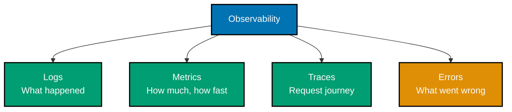

# Next.js Observability and Monitoring

This document provides comprehensive guidance on observability and monitoring for Next.js applications. Effective observability enables rapid incident detection, debugging, and performance optimization in production environments. Understanding monitoring tools and practices ensures application reliability and excellent user experience.

**Prerequisites**: Familiarity with [deployment](./ex-so-plwe-fene__deployment.md), [performance](./ex-so-plwe-fene__performance.md), and [Server Components](./ex-so-plwe-fene__server-components.md).

## 🎯 Observability Pillars



## 🚨 Error Handling

### Error Boundaries

```typescript
// app/error.tsx (Global error boundary)
'use client';

import { useEffect } from 'react';

export default function Error({
  error,
  reset,
}: {
  error: Error & { digest?: string };
  reset: () => void;
}) {
  useEffect(() => {
    // Log error to monitoring service
    console.error('Application error:', error);
  }, [error]);

  return (
    <div className="error-container">
      <h2>Something went wrong</h2>
      <p>{error.message}</p>
      <button onClick={reset}>Try again</button>
    </div>
  );
}

// app/zakat/error.tsx (Route-specific error boundary)
'use client';

export default function ZakatError({
  error,
  reset,
}: {
  error: Error & { digest?: string };
  reset: () => void;
}) {
  return (
    <div>
      <h2>Failed to load zakat calculator</h2>
      <p>{error.message}</p>
      <button onClick={reset}>Try again</button>
    </div>
  );
}
```

### Not Found Pages

```typescript
// app/not-found.tsx
export default function NotFound() {
  return (
    <div>
      <h1>404 - Page Not Found</h1>
      <p>The page you are looking for does not exist.</p>
      <a href="/">Return Home</a>
    </div>
  );
}

// app/murabaha/[id]/not-found.tsx
export default function ContractNotFound() {
  return (
    <div>
      <h2>Contract Not Found</h2>
      <p>The requested Murabaha contract does not exist.</p>
      <a href="/murabaha">View all contracts</a>
    </div>
  );
}
```

## 📊 Sentry Integration

### Install Sentry

```bash
npm install @sentry/nextjs
```

### Sentry Configuration

```typescript
// sentry.client.config.ts
import * as Sentry from "@sentry/nextjs";

Sentry.init({
  dsn: process.env.NEXT_PUBLIC_SENTRY_DSN,
  environment: process.env.NODE_ENV,
  tracesSampleRate: 1.0,
  replaysOnErrorSampleRate: 1.0,
  replaysSessionSampleRate: 0.1,

  integrations: [
    new Sentry.BrowserTracing({
      tracingOrigins: ["localhost", "oseplatform.com", /^\//],
    }),
    new Sentry.Replay({
      maskAllText: true,
      blockAllMedia: true,
    }),
  ],

  beforeSend(event, hint) {
    // Filter out sensitive data
    if (event.request?.cookies) {
      delete event.request.cookies;
    }
    return event;
  },
});

// sentry.server.config.ts
import * as Sentry from "@sentry/nextjs";

Sentry.init({
  dsn: process.env.NEXT_PUBLIC_SENTRY_DSN,
  environment: process.env.NODE_ENV,
  tracesSampleRate: 1.0,

  integrations: [new Sentry.Integrations.Http({ tracing: true }), new Sentry.Integrations.Prisma({ client: db })],
});

// sentry.edge.config.ts
import * as Sentry from "@sentry/nextjs";

Sentry.init({
  dsn: process.env.NEXT_PUBLIC_SENTRY_DSN,
  tracesSampleRate: 1.0,
});
```

### Sentry in Next.js Config

```typescript
// next.config.ts
import { withSentryConfig } from "@sentry/nextjs";

const nextConfig = {
  // Your Next.js config
};

export default withSentryConfig(
  nextConfig,
  {
    silent: true,
    org: "ose-platform",
    project: "nextjs",
  },
  {
    widenClientFileUpload: true,
    transpileClientSDK: true,
    tunnelRoute: "/monitoring",
    hideSourceMaps: true,
    disableLogger: true,
  },
);
```

### Error Tracking in Components

```typescript
// app/_components/ZakatForm.tsx
'use client';

import * as Sentry from '@sentry/nextjs';
import { useState } from 'react';

export function ZakatForm() {
  const [error, setError] = useState<string | null>(null);

  async function handleSubmit(formData: FormData) {
    try {
      const result = await calculateZakat(formData);
      // Process result
    } catch (error) {
      // Capture error in Sentry
      Sentry.captureException(error, {
        tags: {
          component: 'ZakatForm',
          action: 'calculateZakat',
        },
        extra: {
          wealth: formData.get('wealth'),
          nisab: formData.get('nisab'),
        },
      });

      setError('Failed to calculate zakat');
    }
  }

  return (
    <form action={handleSubmit}>
      {error && <p className="error">{error}</p>}
      {/* Form fields */}
    </form>
  );
}
```

### Server-Side Error Tracking

```typescript
// app/_actions/contract-actions.ts
"use server";

import * as Sentry from "@sentry/nextjs";

export async function createContract(formData: FormData) {
  try {
    const contract = await db.contract.create({
      data: {
        principalAmount: Number(formData.get("principalAmount")),
      },
    });

    return { success: true, contractId: contract.id };
  } catch (error) {
    // Capture server-side error
    Sentry.captureException(error, {
      tags: {
        serverAction: "createContract",
      },
      user: {
        id: "user-id-here",
      },
    });

    return { success: false, error: "Failed to create contract" };
  }
}
```

## 📝 Logging Strategies

### Structured Logging

```typescript
// lib/logger.ts
import pino from "pino";

export const logger = pino({
  level: process.env.LOG_LEVEL || "info",
  formatters: {
    level: (label) => {
      return { level: label };
    },
  },
  transport:
    process.env.NODE_ENV === "development"
      ? {
          target: "pino-pretty",
          options: {
            colorize: true,
          },
        }
      : undefined,
});

// Usage
logger.info({ userId: "123", action: "create-contract" }, "Contract created");
logger.error({ error, contractId: "456" }, "Failed to update contract");
```

### Server Component Logging

```typescript
// app/zakat/page.tsx
import { logger } from '@/lib/logger';

export default async function ZakatPage() {
  try {
    logger.info('Fetching zakat rates');

    const rates = await fetchZakatRates();

    logger.info({ rates }, 'Zakat rates fetched successfully');

    return <ZakatCalculator rates={rates} />;
  } catch (error) {
    logger.error({ error }, 'Failed to fetch zakat rates');
    throw error;
  }
}
```

### API Route Logging

```typescript
// app/api/contracts/route.ts
import { NextRequest, NextResponse } from "next/server";
import { logger } from "@/lib/logger";

export async function POST(request: NextRequest) {
  const requestId = crypto.randomUUID();

  logger.info(
    {
      requestId,
      method: "POST",
      url: request.url,
    },
    "Contract creation request",
  );

  try {
    const body = await request.json();

    logger.debug({ requestId, body }, "Request body parsed");

    const contract = await createContract(body);

    logger.info({ requestId, contractId: contract.id }, "Contract created successfully");

    return NextResponse.json(contract, { status: 201 });
  } catch (error) {
    logger.error({ requestId, error }, "Contract creation failed");

    return NextResponse.json({ error: "Internal server error" }, { status: 500 });
  }
}
```

## 📈 Performance Monitoring

### Web Vitals Tracking

```typescript
// app/layout.tsx
'use client';

import { useReportWebVitals } from 'next/web-vitals';

export function WebVitals() {
  useReportWebVitals((metric) => {
    // Send to analytics
    if (metric.label === 'web-vital') {
      console.log(metric);

      // Send to analytics service
      fetch('/api/analytics/vitals', {
        method: 'POST',
        body: JSON.stringify(metric),
      });
    }
  });

  return null;
}

// app/layout.tsx
export default function RootLayout({ children }: { children: React.ReactNode }) {
  return (
    <html>
      <body>
        {children}
        <WebVitals />
      </body>
    </html>
  );
}
```

### Vercel Analytics

```typescript
// app/layout.tsx
import { Analytics } from '@vercel/analytics/react';
import { SpeedInsights } from '@vercel/speed-insights/next';

export default function RootLayout({ children }: { children: React.ReactNode }) {
  return (
    <html>
      <body>
        {children}
        <Analytics />
        <SpeedInsights />
      </body>
    </html>
  );
}
```

### Custom Performance Metrics

```typescript
// lib/performance.ts
export function measurePerformance(metricName: string, startTime: number) {
  const duration = Date.now() - startTime;

  // Send to monitoring service
  fetch("/api/metrics", {
    method: "POST",
    body: JSON.stringify({
      metric: metricName,
      duration,
      timestamp: new Date().toISOString(),
    }),
  });

  return duration;
}

// Usage
const startTime = Date.now();
const result = await expensiveOperation();
measurePerformance("expensiveOperation", startTime);
```

## 🔍 Debugging Tools

### Next.js DevTools

Next.js has built-in development tools for debugging.

**Enable in development**:

- React DevTools automatically available
- Network inspection in browser DevTools
- Server-side logs in terminal
- Next.js build analyzer for bundle inspection

### React DevTools

```typescript
// app/layout.tsx
export default function RootLayout({ children }: { children: React.ReactNode }) {
  return (
    <html>
      <head>
        {/* React DevTools automatically loads in development */}
      </head>
      <body>{children}</body>
    </html>
  );
}
```

### Source Maps in Production

```typescript
// next.config.ts
const nextConfig = {
  // Enable source maps for production (Sentry)
  productionBrowserSourceMaps: true,

  // Configure source map strategy
  webpack: (config, { dev }) => {
    if (!dev) {
      config.devtool = "source-map";
    }
    return config;
  },
};

export default nextConfig;
```

## 📊 User Analytics

### Google Analytics 4

```typescript
// lib/gtag.ts
export const GA_TRACKING_ID = process.env.NEXT_PUBLIC_GA_ID;

// Log page view
export const pageview = (url: string) => {
  if (typeof window !== 'undefined' && GA_TRACKING_ID) {
    window.gtag('config', GA_TRACKING_ID, {
      page_path: url,
    });
  }
};

// Log event
export const event = ({ action, category, label, value }: {
  action: string;
  category: string;
  label: string;
  value?: number;
}) => {
  if (typeof window !== 'undefined' && GA_TRACKING_ID) {
    window.gtag('event', action, {
      event_category: category,
      event_label: label,
      value: value,
    });
  }
};

// app/layout.tsx
import Script from 'next/script';
import { GA_TRACKING_ID } from '@/lib/gtag';

export default function RootLayout({ children }: { children: React.ReactNode }) {
  return (
    <html>
      <head>
        {GA_TRACKING_ID && (
          <>
            <Script
              strategy="afterInteractive"
              src={`https://www.googletagmanager.com/gtag/js?id=${GA_TRACKING_ID}`}
            />
            <Script
              id="google-analytics"
              strategy="afterInteractive"
              dangerouslySetInnerHTML={{
                __html: `
                  window.dataLayer = window.dataLayer || [];
                  function gtag(){dataLayer.push(arguments);}
                  gtag('js', new Date());
                  gtag('config', '${GA_TRACKING_ID}', {
                    page_path: window.location.pathname,
                  });
                `,
              }}
            />
          </>
        )}
      </head>
      <body>{children}</body>
    </html>
  );
}
```

### Custom Event Tracking

```typescript
// app/_components/ZakatForm.tsx
'use client';

import { event } from '@/lib/gtag';

export function ZakatForm() {
  async function handleSubmit(formData: FormData) {
    const result = await calculateZakat(formData);

    // Track event
    event({
      action: 'calculate_zakat',
      category: 'engagement',
      label: 'Zakat Calculator',
      value: result.zakatAmount,
    });
  }

  return <form action={handleSubmit}>{/* Form fields */}</form>;
}
```

## 🎯 Application Performance Monitoring

### Custom APM Integration

```typescript
// lib/apm.ts
import * as Sentry from '@sentry/nextjs';

export function startTransaction(name: string) {
  return Sentry.startTransaction({
    op: 'custom',
    name,
  });
}

// Usage in Server Component
export default async function MurabahaPage() {
  const transaction = startTransaction('fetch-contracts');

  try {
    const contracts = await fetchContracts();
    transaction.setStatus('ok');
    return <ContractList contracts={contracts} />;
  } catch (error) {
    transaction.setStatus('internal_error');
    throw error;
  } finally {
    transaction.finish();
  }
}
```

### Database Query Monitoring

```typescript
// lib/db.ts
import { PrismaClient } from "@prisma/client";
import { logger } from "@/lib/logger";

const prisma = new PrismaClient({
  log: [
    {
      emit: "event",
      level: "query",
    },
  ],
});

prisma.$on("query", (e) => {
  logger.debug(
    {
      query: e.query,
      duration: e.duration,
      timestamp: e.timestamp,
    },
    "Database query executed",
  );

  // Alert on slow queries
  if (e.duration > 1000) {
    logger.warn({ query: e.query, duration: e.duration }, "Slow query detected");
  }
});

export { prisma as db };
```

## 🔔 Alerting

### Health Check Monitoring

```typescript
// app/api/health/route.ts
import { NextResponse } from "next/server";
import { db } from "@/lib/db";

export async function GET() {
  const checks = {
    database: false,
    timestamp: new Date().toISOString(),
    uptime: process.uptime(),
  };

  try {
    // Check database
    await db.$queryRaw`SELECT 1`;
    checks.database = true;

    return NextResponse.json({
      status: "healthy",
      checks,
    });
  } catch (error) {
    return NextResponse.json(
      {
        status: "unhealthy",
        checks,
        error: "Database connection failed",
      },
      { status: 503 },
    );
  }
}
```

### Uptime Monitoring

Use services like:

- **UptimeRobot** - Free uptime monitoring
- **Pingdom** - Synthetic monitoring
- **StatusCake** - Multi-location monitoring
- **Better Uptime** - Modern uptime monitoring

## 📊 Monitoring Dashboard

### Custom Metrics Endpoint

```typescript
// app/api/metrics/route.ts
import { NextRequest, NextResponse } from "next/server";
import { logger } from "@/lib/logger";

const metrics = {
  requestCount: 0,
  errorCount: 0,
  totalResponseTime: 0,
};

export async function POST(request: NextRequest) {
  const body = await request.json();

  metrics.requestCount += 1;
  metrics.totalResponseTime += body.duration || 0;

  if (body.error) {
    metrics.errorCount += 1;
  }

  logger.info({ metrics }, "Metrics updated");

  return NextResponse.json({ success: true });
}

export async function GET() {
  return NextResponse.json({
    ...metrics,
    averageResponseTime: metrics.requestCount > 0 ? metrics.totalResponseTime / metrics.requestCount : 0,
    errorRate: metrics.requestCount > 0 ? (metrics.errorCount / metrics.requestCount) * 100 : 0,
  });
}
```

## 🔗 Related Documentation

**Next.js Core**:

- [Deployment](./ex-so-plwe-fene__deployment.md) - Production deployment strategies
- [Performance](./ex-so-plwe-fene__performance.md) - Performance optimization
- [Security](./ex-so-plwe-fene__security.md) - Security best practices
- [Testing](./ex-so-plwe-fene__testing.md) - Testing strategies

**Official Resources**:

- [Sentry Next.js](https://docs.sentry.io/platforms/javascript/guides/nextjs/)
- [Vercel Analytics](https://vercel.com/docs/analytics)
- [Next.js Instrumentation](https://nextjs.org/docs/app/building-your-application/optimizing/instrumentation)

---

This comprehensive observability guide covers monitoring, debugging, and analytics for Next.js applications. Implement these practices to maintain application health, rapidly detect issues, and deliver excellent user experiences in production.
