# Next.js Rendering Strategies

This document provides comprehensive guidance on Next.js rendering strategies. Next.js supports multiple rendering methods that can be mixed within the same application, allowing you to choose the optimal strategy for each route based on data freshness requirements, performance needs, and user experience goals.

**Prerequisites**: Familiarity with [Server Components](./ex-so-plwe-fene__server-components.md), [Next.js routing](./ex-so-plwe-fene__routing.md), and [React fundamentals](../fe-react/README.md).

## 🎯 Rendering Strategies Overview

Next.js 14+ with App Router supports five main rendering strategies:

```mermaid
%% Color Palette: Blue #0173B2, Orange #DE8F05, Teal #029E73, Purple #CC78BC, Brown #CA9161
%% All colors are color-blind friendly and meet WCAG AA contrast standards

graph TD
    A["Rendering Strategies"]:::blue
    B["Static Generation #40;SSG#41;"]:::teal
    C["Server-Side Rendering #40;SSR#41;"]:::orange
    D["Incremental Static Regeneration #40;ISR#41;"]:::purple
    E["Client-Side Rendering #40;CSR#41;"]:::brown
    F["Streaming SSR"]:::teal
    G["Partial Prerendering #40;PPR#41;"]:::purple

    A --> B
    A --> C
    A --> D
    A --> E
    A --> F
    A --> G

    B --> B1["Build Time"]
    B --> B2["Best Performance"]
    B --> B3["Static Content"]

    C --> C1["Request Time"]
    C --> C2["Dynamic Data"]
    C --> C3["Personalized Content"]

    D --> D1["Build + Revalidate"]
    D --> D2["Background Updates"]
    D --> D3["Semi-Static Content"]

    E --> E1["Browser Runtime"]
    E --> E2["Interactive Features"]
    E --> E3["Client State"]

    F --> F1["Progressive Rendering"]
    F --> F2["Faster TTFB"]
    F --> F3["Suspense Boundaries"]

    G --> G1["Static Shell + Dynamic"]
    G --> G2["Best of Both"]
    G --> G3["Preview Feature"]

    classDef blue fill:#0173B2,stroke:#000000,color:#FFFFFF,stroke-width:2px
    classDef orange fill:#DE8F05,stroke:#000000,color:#FFFFFF,stroke-width:2px
    classDef teal fill:#029E73,stroke:#000000,color:#FFFFFF,stroke-width:2px
    classDef purple fill:#CC78BC,stroke:#000000,color:#000000,stroke-width:2px
    classDef brown fill:#CA9161,stroke:#000000,color:#FFFFFF,stroke-width:2px
```



## 📄 Static Site Generation (SSG)

### What is SSG?

Static Site Generation pre-renders pages at **build time**. The HTML is generated once during the build process and reused for each request.

**Characteristics**:

- HTML generated at build time
- Fastest possible load time
- Served from CDN
- No server computation on request
- Best for content that doesn't change often

### Basic Static Generation

By default, Server Components in Next.js are statically generated if they don't use dynamic functions.

```typescript
// app/zakat/page.tsx (Static by default)
export default async function ZakatPage() {
  // Static data fetching (cached at build time)
  const rates = await fetch('https://api.example.com/zakat-rates').then((res) => res.json());

  return (
    <div>
      <h1>Zakat Calculator</h1>
      <p>Current gold nisab: ${rates.goldNisab}</p>
      <p>Last updated: {rates.lastUpdated}</p>
    </div>
  );
}
```

### Generating Static Params (Dynamic Routes)

Use `generateStaticParams` to pre-render dynamic routes at build time.

```typescript
// app/murabaha/[id]/page.tsx
interface Contract {
  id: string;
  title: string;
  principalAmount: number;
}

// Generate static paths at build time
export async function generateStaticParams() {
  const contracts = await fetch('https://api.example.com/contracts')
    .then((res) => res.json());

  return contracts.map((contract: Contract) => ({
    id: contract.id,
  }));
}

// This page is statically generated for each contract
export default async function ContractPage({ params }: { params: { id: string } }) {
  const contract = await fetch(`https://api.example.com/contracts/${params.id}`)
    .then((res) => res.json());

  return (
    <div>
      <h1>{contract.title}</h1>
      <p>Principal Amount: ${contract.principalAmount}</p>
    </div>
  );
}
```

### Static Metadata

Generate metadata at build time for SEO.

```typescript
// app/murabaha/[id]/page.tsx
import type { Metadata } from "next";

export async function generateMetadata({ params }: { params: { id: string } }): Promise<Metadata> {
  const contract = await fetch(`https://api.example.com/contracts/${params.id}`).then((res) => res.json());

  return {
    title: `Murabaha Contract #${contract.id}`,
    description: `View details for contract with principal amount $${contract.principalAmount}`,
  };
}

export default async function ContractPage({ params }: { params: { id: string } }) {
  // Page content
}
```

### When to Use SSG

✅ **Use SSG for**:

- Marketing pages
- Blog posts
- Documentation
- Product listings (that don't change frequently)
- About pages
- Landing pages

**Example**: Zakat education content

```typescript
// app/zakat/learn/page.tsx
export default function ZakatLearnPage() {
  return (
    <article>
      <h1>Understanding Zakat</h1>
      <p>Zakat is one of the Five Pillars of Islam...</p>
      {/* Static educational content */}
    </article>
  );
}
```

## 🔄 Server-Side Rendering (SSR)

### What is SSR?

Server-Side Rendering generates HTML on **each request** on the server.

**Characteristics**:

- HTML generated on each request
- Always fresh data
- Slower than SSG (server computation per request)
- Personalized content
- Good for frequently changing data

### Forcing Dynamic Rendering

Use dynamic functions to opt into SSR:

```typescript
// app/dashboard/page.tsx
import { cookies, headers } from 'next/headers';

export default async function DashboardPage() {
  // Using cookies() forces dynamic rendering
  const token = cookies().get('auth-token');

  // Fetch user-specific data
  const userData = await fetch('https://api.example.com/user', {
    headers: {
      Authorization: `Bearer ${token?.value}`,
    },
  }).then((res) => res.json());

  return (
    <div>
      <h1>Welcome, {userData.name}</h1>
      <p>Your dashboard data as of {new Date().toLocaleString()}</p>
    </div>
  );
}
```

### Dynamic Functions

These functions force dynamic rendering:

- `cookies()` - Read request cookies
- `headers()` - Read request headers
- `searchParams` - Read URL search parameters
- `fetch()` with `cache: 'no-store'` - No caching
- Dynamic segments without `generateStaticParams`

```typescript
// app/search/page.tsx
export default async function SearchPage({
  searchParams,
}: {
  searchParams: { q: string };
}) {
  // searchParams makes this page dynamic
  const query = searchParams.q;

  const results = await fetch(`https://api.example.com/search?q=${query}`, {
    cache: 'no-store', // Force fresh data
  }).then((res) => res.json());

  return (
    <div>
      <h1>Search Results for: {query}</h1>
      <ul>
        {results.map((result: any) => (
          <li key={result.id}>{result.title}</li>
        ))}
      </ul>
    </div>
  );
}
```

### Route Segment Config

Explicitly configure rendering behavior:

```typescript
// app/dashboard/page.tsx

// Force dynamic rendering
export const dynamic = "force-dynamic";

// Or auto (default)
export const dynamic = "auto";

// Or force static
export const dynamic = "force-static";

export default async function DashboardPage() {
  // Page content
}
```

### When to Use SSR

✅ **Use SSR for**:

- User dashboards
- Personalized content
- Real-time data displays
- Search results
- Shopping carts
- User-specific pages

**Example**: User-specific zakat history

```typescript
// app/zakat/history/page.tsx
import { auth } from '@/lib/auth';

export const dynamic = 'force-dynamic';

export default async function ZakatHistoryPage() {
  const session = await auth();

  if (!session) {
    redirect('/login');
  }

  // Fetch user-specific data
  const calculations = await db.zakatCalculation.findMany({
    where: { userId: session.user.id },
    orderBy: { createdAt: 'desc' },
  });

  return (
    <div>
      <h1>Your Zakat Calculation History</h1>
      <ul>
        {calculations.map((calc) => (
          <li key={calc.id}>
            ${calc.zakatAmount} - {calc.createdAt.toLocaleDateString()}
          </li>
        ))}
      </ul>
    </div>
  );
}
```

## 🔁 Incremental Static Regeneration (ISR)

### What is ISR?

ISR allows you to update static pages **after build time** without rebuilding the entire site.

**Characteristics**:

- Static generation with background revalidation
- Fast like SSG
- Fresh data like SSR (eventually)
- Background updates
- Best of both worlds

### Time-Based Revalidation

Revalidate pages after a time interval:

```typescript
// app/murabaha/page.tsx

// Revalidate every hour (3600 seconds)
export const revalidate = 3600;

export default async function MurabahaPage() {
  const contracts = await fetch('https://api.example.com/contracts')
    .then((res) => res.json());

  return (
    <div>
      <h1>Murabaha Contracts</h1>
      <p>Data refreshed every hour</p>
      <ContractList contracts={contracts} />
    </div>
  );
}
```

### Per-Request Revalidation

Configure revalidation for individual fetch requests:

```typescript
// app/zakat/page.tsx
export default async function ZakatPage() {
  // Revalidate every 30 minutes
  const rates = await fetch('https://api.example.com/rates', {
    next: { revalidate: 1800 },
  }).then((res) => res.json());

  // Never cache (always fresh)
  const liveRates = await fetch('https://api.example.com/live-rates', {
    cache: 'no-store',
  }).then((res) => res.json());

  return (
    <div>
      <h2>Standard Rates (updated every 30 min)</h2>
      <p>Gold: ${rates.gold}</p>

      <h2>Live Rates (real-time)</h2>
      <p>Gold: ${liveRates.gold}</p>
    </div>
  );
}
```

### On-Demand Revalidation

Manually revalidate specific paths after mutations:

```typescript
// app/_actions/contract-actions.ts
"use server";

import { revalidatePath, revalidateTag } from "next/cache";

export async function createContract(formData: FormData) {
  const contract = await db.contract.create({
    data: {
      principalAmount: Number(formData.get("principalAmount")),
    },
  });

  // Revalidate specific path
  revalidatePath("/murabaha");

  // Or revalidate by tag
  revalidateTag("contracts");

  return contract;
}
```

### Cache Tags

Tag fetch requests for targeted revalidation:

```typescript
// app/murabaha/page.tsx
export default async function MurabahaPage() {
  const contracts = await fetch('https://api.example.com/contracts', {
    next: { tags: ['contracts'] },
  }).then((res) => res.json());

  return <ContractList contracts={contracts} />;
}

// Later, revalidate all tagged requests
// revalidateTag('contracts');
```

### When to Use ISR

✅ **Use ISR for**:

- Product catalogs
- Blog posts with comments
- News articles
- Pricing pages
- E-commerce product pages
- Content that updates periodically

**Example**: Zakat rates updated daily

```typescript
// app/zakat/rates/page.tsx

// Revalidate daily (86400 seconds)
export const revalidate = 86400;

export default async function ZakatRatesPage() {
  const rates = await fetch('https://api.example.com/zakat-rates')
    .then((res) => res.json());

  return (
    <div>
      <h1>Current Zakat Rates</h1>
      <p>Updated daily at midnight</p>
      <p>Gold Nisab: ${rates.goldNisab}</p>
      <p>Silver Nisab: ${rates.silverNisab}</p>
    </div>
  );
}
```

## 💻 Client-Side Rendering (CSR)

### What is CSR?

Client-Side Rendering fetches and renders data in the browser using JavaScript.

**Characteristics**:

- Rendering happens in browser
- JavaScript required
- Slower initial render
- Good for interactive features
- Private/user-specific data

### Using Client Components

Mark components with `'use client'` for CSR:

```typescript
// app/_components/LiveDonations.tsx
'use client';

import { useState, useEffect } from 'react';

export function LiveDonations() {
  const [donations, setDonations] = useState([]);
  const [loading, setLoading] = useState(true);

  useEffect(() => {
    fetch('/api/donations/live')
      .then((res) => res.json())
      .then((data) => {
        setDonations(data);
        setLoading(false);
      });
  }, []);

  if (loading) return <div>Loading...</div>;

  return (
    <div>
      <h2>Live Donations</h2>
      <ul>
        {donations.map((donation: any) => (
          <li key={donation.id}>{donation.amount}</li>
        ))}
      </ul>
    </div>
  );
}
```

### Using React Query for CSR

Recommended approach for client-side data fetching:

```typescript
// app/_components/ContractList.tsx
'use client';

import { useQuery } from '@tanstack/react-query';

export function ContractList() {
  const { data, isLoading, error } = useQuery({
    queryKey: ['contracts'],
    queryFn: async () => {
      const res = await fetch('/api/contracts');
      return res.json();
    },
    refetchInterval: 30000, // Refetch every 30 seconds
  });

  if (isLoading) return <div>Loading contracts...</div>;
  if (error) return <div>Error loading contracts</div>;

  return (
    <ul>
      {data.map((contract: any) => (
        <li key={contract.id}>{contract.title}</li>
      ))}
    </ul>
  );
}
```

### When to Use CSR

✅ **Use CSR for**:

- Real-time updates (live chat, notifications)
- Interactive dashboards
- Client-side state management
- User interactions (forms, modals)
- Third-party widgets
- Browser-specific features

**Example**: Real-time zakat donations tracker

```typescript
// app/_components/DonationTracker.tsx
'use client';

import { useState, useEffect } from 'react';

export function DonationTracker() {
  const [total, setTotal] = useState(0);

  useEffect(() => {
    const ws = new WebSocket('wss://api.example.com/donations');

    ws.onmessage = (event) => {
      const donation = JSON.parse(event.data);
      setTotal((prev) => prev + donation.amount);
    };

    return () => ws.close();
  }, []);

  return (
    <div>
      <h2>Total Donations Today</h2>
      <p>${total.toFixed(2)}</p>
    </div>
  );
}
```

## 🌊 Streaming SSR

### What is Streaming?

Streaming allows sending HTML progressively from server to client, rendering parts of the page as data becomes available.

**Characteristics**:

- Progressive rendering
- Faster Time to First Byte (TTFB)
- Better perceived performance
- Uses React Suspense
- Incremental hydration

### Using Suspense for Streaming

```typescript
// app/dashboard/page.tsx
import { Suspense } from 'react';

export default function DashboardPage() {
  return (
    <div>
      <h1>Dashboard</h1>

      {/* Fast content renders immediately */}
      <QuickStats />

      {/* Slow content streams when ready */}
      <Suspense fallback={<LoadingSkeleton />}>
        <SlowContracts />
      </Suspense>

      <Suspense fallback={<LoadingSkeleton />}>
        <SlowAnalytics />
      </Suspense>
    </div>
  );
}

async function SlowContracts() {
  // Slow database query (2 seconds)
  const contracts = await fetchContracts();
  return <ContractsTable contracts={contracts} />;
}

async function SlowAnalytics() {
  // Slow aggregation (3 seconds)
  const analytics = await fetchAnalytics();
  return <AnalyticsChart data={analytics} />;
}
```

### Loading.tsx for Automatic Streaming

Next.js automatically streams with `loading.tsx`:

```typescript
// app/murabaha/loading.tsx
export default function Loading() {
  return (
    <div>
      <div className="h-8 bg-gray-200 rounded w-1/3 animate-pulse" />
      <div className="h-4 bg-gray-200 rounded w-full animate-pulse mt-4" />
    </div>
  );
}

// app/murabaha/page.tsx
export default async function MurabahaPage() {
  const contracts = await fetchContracts(); // Automatically wrapped in Suspense
  return <ContractList contracts={contracts} />;
}
```

### When to Use Streaming

✅ **Use Streaming for**:

- Pages with slow data fetching
- Multiple independent data sources
- Improving perceived performance
- Large pages with varied data needs
- Dashboards with multiple widgets

## 🎭 Partial Prerendering (PPR)

### What is PPR?

Partial Prerendering (preview feature) combines static and dynamic rendering in the same route, serving a static shell instantly while streaming dynamic content.

**Characteristics**:

- Static shell served instantly
- Dynamic content streams in
- Best of SSG and SSR
- Experimental feature (Next.js 14+)
- Requires opt-in

### Enabling PPR

```typescript
// next.config.ts
const nextConfig = {
  experimental: {
    ppr: true,
  },
};

export default nextConfig;
```

### Using PPR

```typescript
// app/dashboard/page.tsx
export const experimental_ppr = true;

export default function DashboardPage() {
  return (
    <div>
      {/* Static shell (prerendered) */}
      <header>
        <h1>Dashboard</h1>
        <nav>{/* Static navigation */}</nav>
      </header>

      {/* Dynamic content (streamed) */}
      <Suspense fallback={<LoadingSkeleton />}>
        <UserData />
      </Suspense>

      {/* Static content (prerendered) */}
      <footer>{/* Static footer */}</footer>
    </div>
  );
}

async function UserData() {
  const session = await auth();
  const userData = await fetchUserData(session.user.id);
  return <UserProfile data={userData} />;
}
```

## 🎯 Strategy Selection Guide

### Decision Matrix

| Use Case        | Strategy  | Reason                     |
| --------------- | --------- | -------------------------- |
| Marketing pages | SSG       | Static, fast, SEO          |
| Blog posts      | ISR       | Static with updates        |
| User dashboard  | SSR       | Personalized, fresh        |
| Product catalog | ISR       | Semi-static, updates       |
| Search results  | SSR       | Dynamic, query-based       |
| Real-time data  | CSR       | Live updates, WebSocket    |
| Documentation   | SSG       | Static, version-controlled |
| Pricing page    | ISR       | Updates periodically       |
| Shopping cart   | SSR       | User-specific, dynamic     |
| News feed       | Streaming | Multiple data sources      |

### Performance Comparison


### Hybrid Approach

Mix strategies in the same application:

```typescript
// app/layout.tsx (Static)
export default function RootLayout({ children }: { children: React.ReactNode }) {
  return (
    <html>
      <body>
        <Header /> {/* Static */}
        {children}
        <Footer /> {/* Static */}
      </body>
    </html>
  );
}

// app/page.tsx (Static)
export default function HomePage() {
  return <LandingPage />;
}

// app/zakat/page.tsx (ISR)
export const revalidate = 3600;
export default async function ZakatPage() {
  const rates = await fetchRates();
  return <ZakatCalculator rates={rates} />;
}

// app/dashboard/page.tsx (SSR)
export const dynamic = 'force-dynamic';
export default async function DashboardPage() {
  const userData = await fetchUserData();
  return <Dashboard data={userData} />;
}
```

## 🔗 Related Documentation

**Next.js Core**:

- [Server Components](./ex-so-plwe-fene__server-components.md) - RSC architecture
- [Data Fetching](./ex-so-plwe-fene__data-fetching.md) - Data fetching patterns
- [Routing](./ex-so-plwe-fene__routing.md) - App Router fundamentals
- [Performance](./ex-so-plwe-fene__performance.md) - Optimization strategies

**React Foundation**:

- [React with TypeScript](../fe-react/README.md) - React fundamentals

**Official Resources**:

- [Rendering Fundamentals](https://nextjs.org/docs/app/building-your-application/rendering)
- [Data Fetching](https://nextjs.org/docs/app/building-your-application/data-fetching)

---

This comprehensive rendering strategies guide helps you choose the optimal rendering method for each route in your Next.js application. Understanding these strategies is crucial for building performant, scalable applications with excellent user experience.
