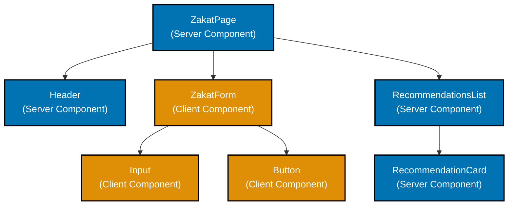

# React Server Components in Next.js

This document provides comprehensive guidance for using React Server Components (RSC) in Next.js 14+. Server Components are a fundamental shift in how React applications work, enabling direct backend access, zero-bundle JavaScript for server-rendered components, and improved performance.

**Prerequisites**: This guide assumes familiarity with [React fundamentals](../fe-react/README.md), [TypeScript](../../prog-lang/typescript/README.md), and [Next.js routing](./ex-so-plwe-fene__routing.md).

## 🖥️ Server Components Fundamentals

### What Are Server Components?

React Server Components run exclusively on the server and never send their JavaScript to the client browser.

**Key Characteristics**:

- **Server-Only Execution** - Code runs only on server, never sent to client
- **Direct Backend Access** - Can directly access databases, file systems, internal APIs
- **Zero Client JavaScript** - No JavaScript bundle impact for Server Components
- **Automatic Code Splitting** - Only Client Components sent to browser
- **Security** - Sensitive operations stay on server

### Default Behavior in Next.js

In Next.js App Router, **all components are Server Components by default** unless marked with `'use client'`.

```typescript
// app/zakat/page.tsx (Server Component by default)
import { fetchZakatRates } from '@/lib/db';

export default async function ZakatPage() {
  // ✅ Direct database access - runs on server
  const rates = await fetchZakatRates();

  return (
    <div>
      <h1>Zakat Calculator</h1>
      <p>Current gold nisab: ${rates.goldNisab}</p>
    </div>
  );
}
```

### When to Use Server Components

Use Server Components (default) when:

- ✅ Fetching data from databases or APIs
- ✅ Accessing server-only resources (environment variables, file system)
- ✅ Keeping sensitive logic on server (API keys, business logic)
- ✅ Reducing client JavaScript bundle size
- ✅ Rendering static content
- ✅ No interactivity needed

### When to Use Client Components

Use Client Components (`'use client'`) when:

- ✅ Using React hooks (useState, useEffect, useContext)
- ✅ Handling user interactions (onClick, onChange)
- ✅ Using browser APIs (localStorage, window, document)
- ✅ Using third-party libraries that depend on browser APIs
- ✅ Creating interactive forms
- ✅ Using React Context

## 🔀 Server vs Client Components

### Component Boundary

The `'use client'` directive marks the boundary between Server and Client Components.

```typescript
// app/_components/ZakatForm.tsx (Client Component)
'use client';

import { useState } from 'react';

export function ZakatForm({ rates }: { rates: ZakatRates }) {
  const [wealth, setWealth] = useState(0);

  return (
    <form>
      <input
        type="number"
        value={wealth}
        onChange={(e) => setWealth(Number(e.target.value))}
      />
      <button type="submit">Calculate</button>
    </form>
  );
}
```

**Important**: `'use client'` doesn't mean the component only runs on the client. It means:

- The component is **serializable** and can be sent to the client
- The component can use client-side features (hooks, browser APIs)
- The component will be **hydrated** on the client

### Composition Pattern

**Recommended**: Server Component as wrapper, Client Component for interactivity.

```typescript
// app/zakat/page.tsx (Server Component)
import { fetchZakatRates } from '@/lib/db';
import { ZakatForm } from '@/components/ZakatForm';

export default async function ZakatPage() {
  // Server-side data fetching
  const rates = await fetchZakatRates();
  const recommendations = await fetchRecommendations();

  return (
    <div>
      <h1>Zakat Calculator</h1>

      {/* Server Component - no interactivity */}
      <div>
        <p>Gold Nisab: ${rates.goldNisab}</p>
        <p>Silver Nisab: ${rates.silverNisab}</p>
      </div>

      {/* Client Component - interactive form */}
      <ZakatForm rates={rates} />

      {/* Server Component - static recommendations */}
      <RecommendationsList recommendations={recommendations} />
    </div>
  );
}
```

### Visual Component Tree



## 📦 Props Passing Between Components

### Server Component to Client Component

Server Components can pass props to Client Components, including:

- ✅ Serializable data (strings, numbers, booleans, arrays, objects)
- ✅ Promises (rendered as Suspense boundaries)
- ✅ Other Server Components as children

```typescript
// app/murabaha/page.tsx (Server Component)
import { fetchContracts } from '@/lib/db';
import { ContractList } from '@/components/ContractList';

export default async function MurabahaPage() {
  const contracts = await fetchContracts();

  return (
    <div>
      <h1>Murabaha Contracts</h1>
      {/* Pass serializable data to Client Component */}
      <ContractList contracts={contracts} />
    </div>
  );
}

// app/_components/ContractList.tsx (Client Component)
'use client';

import { useState } from 'react';

interface ContractListProps {
  contracts: Contract[];
}

export function ContractList({ contracts }: ContractListProps) {
  const [selectedId, setSelectedId] = useState<string | null>(null);

  return (
    <ul>
      {contracts.map((contract) => (
        <li key={contract.id} onClick={() => setSelectedId(contract.id)}>
          {contract.name} - ${contract.principalAmount}
        </li>
      ))}
    </ul>
  );
}
```

### Client Component to Server Component

Client Components **cannot** import Server Components directly, but they can:

- ✅ Receive Server Components as `children` prop
- ✅ Receive Server Components as any prop

```typescript
// app/_components/InteractiveWrapper.tsx (Client Component)
'use client';

import { useState } from 'react';

interface InteractiveWrapperProps {
  children: React.ReactNode;
}

export function InteractiveWrapper({ children }: InteractiveWrapperProps) {
  const [isOpen, setIsOpen] = useState(true);

  return (
    <div>
      <button onClick={() => setIsOpen(!isOpen)}>Toggle</button>
      {isOpen && <div>{children}</div>}
    </div>
  );
}

// app/zakat/page.tsx (Server Component)
import { fetchZakatRates } from '@/lib/db';
import { InteractiveWrapper } from '@/components/InteractiveWrapper';

export default async function ZakatPage() {
  const rates = await fetchZakatRates();

  return (
    <InteractiveWrapper>
      {/* This Server Component is passed as children */}
      <div>
        <h2>Current Rates</h2>
        <p>Gold Nisab: ${rates.goldNisab}</p>
        <p>Silver Nisab: ${rates.silverNisab}</p>
      </div>
    </InteractiveWrapper>
  );
}
```

### Props That Cannot Be Passed

**❌ Cannot pass** to Client Components:

- Functions (except Server Actions with `'use server'`)
- Class instances
- Symbols
- Non-serializable objects

```typescript
// ❌ WRONG - Cannot pass function to Client Component
<ClientComponent onSubmit={async () => { await saveToDb(); }} />

// ✅ CORRECT - Use Server Action
<ClientComponent onSubmit={saveToDbAction} />
```

## 🔒 Server-Only Code

Use `server-only` package to ensure code only runs on server.

```bash
npm install server-only
```

```typescript
// lib/db.ts (Server-only code)
import "server-only";

export async function fetchZakatRates() {
  const DATABASE_URL = process.env.DATABASE_URL; // Server-only env var
  // Database access code
}
```

**Benefits**:

- **Build-time Error** - If accidentally imported in Client Component, build fails
- **Security** - Prevents sensitive code from being bundled for client
- **Clarity** - Makes server-only modules explicit

### Client-Only Code

Similarly, use `client-only` package for client-specific code.

```bash
npm install client-only
```

```typescript
// lib/analytics.ts (Client-only code)
import "client-only";

export function trackEvent(eventName: string) {
  if (typeof window !== "undefined") {
    window.gtag("event", eventName);
  }
}
```

## 🎯 Server Actions

Server Actions are asynchronous functions that run on the server but can be called from Client Components.

### Defining Server Actions

**Option 1**: Inline with `'use server'` directive

```typescript
// app/_components/ZakatForm.tsx (Client Component)
'use client';

export function ZakatForm() {
  async function submitZakat(formData: FormData) {
    'use server'; // Marks this function as Server Action

    const wealth = Number(formData.get('wealth'));
    const nisab = Number(formData.get('nisab'));

    // Runs on server
    await saveZakatCalculation({ wealth, nisab });
  }

  return (
    <form action={submitZakat}>
      <input name="wealth" type="number" />
      <input name="nisab" type="number" />
      <button type="submit">Calculate</button>
    </form>
  );
}
```

**Option 2**: Separate file with `'use server'` directive (recommended)

```typescript
// app/_actions/zakat-actions.ts (Server Actions file)
'use server';

import { revalidatePath } from 'next/cache';
import { db } from '@/lib/db';

export async function submitZakat(formData: FormData) {
  const wealth = Number(formData.get('wealth'));
  const nisab = Number(formData.get('nisab'));

  const zakatAmount = wealth >= nisab ? wealth * 0.025 : 0;

  await db.zakat.create({
    data: { wealth, nisab, zakatAmount },
  });

  revalidatePath('/zakat/history');

  return { success: true, zakatAmount };
}

// app/_components/ZakatForm.tsx (Client Component)
'use client';

import { submitZakat } from '@/actions/zakat-actions';

export function ZakatForm() {
  return (
    <form action={submitZakat}>
      <input name="wealth" type="number" />
      <input name="nisab" type="number" />
      <button type="submit">Calculate</button>
    </form>
  );
}
```

### Server Action Return Values

Server Actions can return serializable values.

```typescript
// app/_actions/murabaha-actions.ts
"use server";

import { z } from "zod";

const contractSchema = z.object({
  principalAmount: z.number().positive(),
  profitMargin: z.number().min(0).max(100),
  termMonths: z.number().int().positive(),
});

export async function createContract(formData: FormData) {
  // Validate input
  const validatedData = contractSchema.parse({
    principalAmount: Number(formData.get("principalAmount")),
    profitMargin: Number(formData.get("profitMargin")),
    termMonths: Number(formData.get("termMonths")),
  });

  // Calculate total
  const totalAmount = validatedData.principalAmount * (1 + validatedData.profitMargin / 100);

  // Save to database
  const contract = await db.murabahaContract.create({
    data: {
      ...validatedData,
      totalAmount,
      status: "pending",
    },
  });

  // Revalidate cache
  revalidatePath("/murabaha");

  // Return serializable data
  return {
    success: true,
    contractId: contract.id,
    totalAmount,
  };
}
```

### Calling Server Actions Programmatically

```typescript
// app/_components/MurabahaForm.tsx (Client Component)
'use client';

import { useState } from 'react';
import { createContract } from '@/actions/murabaha-actions';

export function MurabahaForm() {
  const [isPending, setIsPending] = useState(false);
  const [result, setResult] = useState<{ contractId: string; totalAmount: number } | null>(null);

  async function handleSubmit(e: React.FormEvent<HTMLFormElement>) {
    e.preventDefault();

    setIsPending(true);
    try {
      const formData = new FormData(e.currentTarget);
      const response = await createContract(formData);

      if (response.success) {
        setResult({
          contractId: response.contractId,
          totalAmount: response.totalAmount,
        });
      }
    } catch (error) {
      console.error('Failed to create contract:', error);
    } finally {
      setIsPending(false);
    }
  }

  return (
    <form onSubmit={handleSubmit}>
      <input name="principalAmount" type="number" required />
      <input name="profitMargin" type="number" required />
      <input name="termMonths" type="number" required />
      <button type="submit" disabled={isPending}>
        {isPending ? 'Creating...' : 'Create Contract'}
      </button>

      {result && (
        <div>
          <p>Contract Created: {result.contractId}</p>
          <p>Total Amount: ${result.totalAmount.toFixed(2)}</p>
        </div>
      )}
    </form>
  );
}
```

## 📊 Data Fetching in Server Components

### Direct Database Access

Server Components can directly access databases without API routes.

```typescript
// app/zakat/history/page.tsx (Server Component)
import { db } from '@/lib/db';

export default async function ZakatHistoryPage() {
  // Direct database access
  const calculations = await db.zakatCalculation.findMany({
    orderBy: { createdAt: 'desc' },
    take: 10,
  });

  return (
    <div>
      <h1>Zakat Calculation History</h1>
      <ul>
        {calculations.map((calc) => (
          <li key={calc.id}>
            Wealth: ${calc.wealth}, Zakat: ${calc.zakatAmount} - {calc.createdAt.toLocaleDateString()}
          </li>
        ))}
      </ul>
    </div>
  );
}
```

### Parallel Data Fetching

Fetch multiple data sources in parallel using `Promise.all()`.

```typescript
// app/dashboard/page.tsx (Server Component)
export default async function DashboardPage() {
  // Parallel data fetching
  const [contracts, donations, zakatCalculations] = await Promise.all([
    fetchContracts(),
    fetchDonations(),
    fetchZakatCalculations(),
  ]);

  return (
    <div>
      <h1>Dashboard</h1>
      <ContractsSummary contracts={contracts} />
      <DonationsSummary donations={donations} />
      <ZakatSummary calculations={zakatCalculations} />
    </div>
  );
}
```

### Sequential Data Fetching

Fetch data sequentially when one depends on another.

```typescript
// app/murabaha/[id]/details/page.tsx (Server Component)
export default async function ContractDetailsPage({ params }: { params: { id: string } }) {
  // First fetch
  const contract = await fetchContract(params.id);

  // Second fetch depends on first
  const payments = await fetchPayments(contract.id);
  const auditLogs = await fetchAuditLogs(contract.id);

  return (
    <div>
      <ContractHeader contract={contract} />
      <PaymentSchedule payments={payments} />
      <AuditLog logs={auditLogs} />
    </div>
  );
}
```

### Request Memoization

Next.js automatically deduplicates `fetch` requests with the same URL and options within a single render pass.

```typescript
// app/murabaha/page.tsx
async function fetchContracts() {
  // This fetch is automatically memoized
  const res = await fetch('https://api.example.com/contracts');
  return res.json();
}

export default async function MurabahaPage() {
  // These three calls make only ONE network request
  const contracts1 = await fetchContracts();
  const contracts2 = await fetchContracts();
  const contracts3 = await fetchContracts();

  return <ContractList contracts={contracts1} />;
}
```

## 🎨 Composition Patterns

### Pattern 1: Wrapper Pattern

Client Component wraps Server Components as children.

```typescript
// app/_components/Tabs.tsx (Client Component)
'use client';

import { useState } from 'react';

export function Tabs({ children }: { children: React.ReactNode }) {
  const [activeTab, setActiveTab] = useState(0);

  return (
    <div>
      <div className="tabs">
        <button onClick={() => setActiveTab(0)}>Tab 1</button>
        <button onClick={() => setActiveTab(1)}>Tab 2</button>
      </div>
      <div>{children}</div>
    </div>
  );
}

// app/dashboard/page.tsx (Server Component)
import { Tabs } from '@/components/Tabs';

export default async function DashboardPage() {
  const data = await fetchDashboardData();

  return (
    <Tabs>
      <DashboardContent data={data} />
    </Tabs>
  );
}
```

### Pattern 2: Slot Pattern

Client Component receives multiple Server Components as props.

```typescript
// app/_components/Modal.tsx (Client Component)
'use client';

import { useState } from 'react';

interface ModalProps {
  trigger: React.ReactNode;
  content: React.ReactNode;
}

export function Modal({ trigger, content }: ModalProps) {
  const [isOpen, setIsOpen] = useState(false);

  return (
    <>
      <div onClick={() => setIsOpen(true)}>{trigger}</div>
      {isOpen && (
        <dialog open>
          {content}
          <button onClick={() => setIsOpen(false)}>Close</button>
        </dialog>
      )}
    </>
  );
}

// app/zakat/page.tsx (Server Component)
import { Modal } from '@/components/Modal';

export default async function ZakatPage() {
  const details = await fetchZakatDetails();

  return (
    <Modal
      trigger={<button>View Details</button>}
      content={<ZakatDetails details={details} />}
    />
  );
}
```

### Pattern 3: Provider Pattern

Use React Context in Client Components for shared state.

```typescript
// app/_components/ThemeProvider.tsx (Client Component)
'use client';

import { createContext, useContext, useState } from 'react';

const ThemeContext = createContext<{ theme: string; setTheme: (theme: string) => void } | null>(null);

export function ThemeProvider({ children }: { children: React.ReactNode }) {
  const [theme, setTheme] = useState('light');

  return <ThemeContext.Provider value={{ theme, setTheme }}>{children}</ThemeContext.Provider>;
}

export function useTheme() {
  const context = useContext(ThemeContext);
  if (!context) throw new Error('useTheme must be used within ThemeProvider');
  return context;
}

// app/layout.tsx (Root Server Component)
import { ThemeProvider } from '@/components/ThemeProvider';

export default function RootLayout({ children }: { children: React.ReactNode }) {
  return (
    <html>
      <body>
        <ThemeProvider>{children}</ThemeProvider>
      </body>
    </html>
  );
}
```

## 🚀 Streaming and Suspense

Server Components support streaming with React Suspense.

```typescript
// app/dashboard/page.tsx (Server Component)
import { Suspense } from 'react';

export default function DashboardPage() {
  return (
    <div>
      <h1>Dashboard</h1>

      {/* Fast content renders immediately */}
      <QuickStats />

      {/* Slow content streams in when ready */}
      <Suspense fallback={<div>Loading contracts...</div>}>
        <ContractsList />
      </Suspense>

      <Suspense fallback={<div>Loading analytics...</div>}>
        <AnalyticsDashboard />
      </Suspense>
    </div>
  );
}

async function ContractsList() {
  // Slow database query
  const contracts = await fetchContracts(); // 2 seconds
  return <ContractsTable contracts={contracts} />;
}

async function AnalyticsDashboard() {
  // Slow aggregation query
  const analytics = await fetchAnalytics(); // 3 seconds
  return <AnalyticsChart data={analytics} />;
}
```

## 🔧 Third-Party Library Compatibility

Many React libraries don't support Server Components. Use strategies to integrate them.

### Strategy 1: Mark Library Components as Client Components

```typescript
// app/_components/Chart.tsx (Client Component wrapper)
'use client';

import { Chart as ChartJS } from 'react-chartjs-2'; // Third-party library

export function Chart(props: ChartProps) {
  return <ChartJS {...props} />;
}

// app/analytics/page.tsx (Server Component)
import { Chart } from '@/components/Chart';

export default async function AnalyticsPage() {
  const data = await fetchAnalyticsData();

  return (
    <div>
      <h1>Analytics</h1>
      <Chart data={data} />
    </div>
  );
}
```

### Strategy 2: Dynamic Import with ssr: false

For libraries that rely on browser-only APIs.

```typescript
// app/dashboard/page.tsx (Server Component)
import dynamic from 'next/dynamic';

const InteractiveMap = dynamic(() => import('@/components/InteractiveMap'), {
  ssr: false, // Disable server-side rendering
  loading: () => <p>Loading map...</p>,
});

export default function DashboardPage() {
  return (
    <div>
      <h1>Dashboard</h1>
      <InteractiveMap />
    </div>
  );
}
```

## 🔗 Related Documentation

**Next.js Core**:

- [Next.js Routing](./ex-so-plwe-fene__routing.md) - App Router fundamentals
- [Rendering Strategies](./ex-so-plwe-fene__rendering-strategies.md) - SSR, SSG, ISR
- [Data Fetching](./ex-so-plwe-fene__data-fetching.md) - Comprehensive data fetching guide
- [Best Practices](./ex-so-plwe-fene__best-practices.md) - Production standards

**React Foundation**:

- [React with TypeScript](../fe-react/README.md) - React fundamentals

**Official Resources**:

- [React Server Components](https://nextjs.org/docs/app/building-your-application/rendering/server-components)
- [Client Components](https://nextjs.org/docs/app/building-your-application/rendering/client-components)
- [Server Actions](https://nextjs.org/docs/app/building-your-application/data-fetching/server-actions-and-mutations)

---

This comprehensive guide covers React Server Components in Next.js 14+. Use these patterns consistently to build performant, scalable applications with optimal server/client boundaries.
