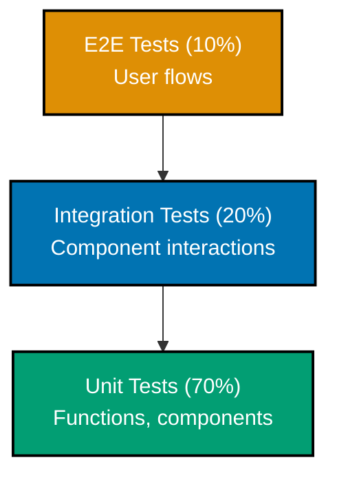

# Next.js Testing Guide

This document provides comprehensive guidance on testing Next.js applications with TypeScript. Testing ensures code quality, prevents regressions, and enables confident refactoring. Next.js works well with modern testing tools like Vitest for unit tests and Playwright for end-to-end tests.

**Prerequisites**: Familiarity with [Server Components](./ex-so-plwe-fene__server-components.md), [React testing practices](../fe-react/ex-so-plwe-fera__testing.md), and [TypeScript](../../prog-lang/typescript/README.md).

## 🧪 Testing Strategy

### Testing Pyramid



**Testing Levels**:

- **Unit Tests (70%)** - Individual functions, components, utilities
- **Integration Tests (20%)** - Component interactions, API calls
- **E2E Tests (10%)** - Critical user flows, happy paths

## 🔧 Test Setup

### Install Testing Dependencies

```bash
# Vitest for unit/integration tests
npm install -D vitest @vitest/ui

# React Testing Library
npm install -D @testing-library/react @testing-library/jest-dom @testing-library/user-event

# Playwright for E2E tests
npm install -D @playwright/test

# JSDOM for DOM environment
npm install -D jsdom

# Happy DOM (faster alternative)
npm install -D happy-dom
```

### Vitest Configuration

```typescript
// vitest.config.ts
import { defineConfig } from "vitest/config";
import react from "@vitejs/plugin-react";
import path from "path";

export default defineConfig({
  plugins: [react()],
  test: {
    environment: "jsdom",
    globals: true,
    setupFiles: ["./vitest.setup.ts"],
    coverage: {
      provider: "v8",
      reporter: ["text", "json", "html"],
      exclude: ["node_modules/", ".next/", "coverage/", "**/*.config.{js,ts}", "**/*.d.ts"],
    },
  },
  resolve: {
    alias: {
      "@": path.resolve(__dirname, "./"),
    },
  },
});
```

### Vitest Setup File

```typescript
// vitest.setup.ts
import "@testing-library/jest-dom";
import { cleanup } from "@testing-library/react";
import { afterEach } from "vitest";

// Cleanup after each test
afterEach(() => {
  cleanup();
});

// Mock Next.js router
vi.mock("next/navigation", () => ({
  useRouter: () => ({
    push: vi.fn(),
    replace: vi.fn(),
    prefetch: vi.fn(),
  }),
  usePathname: () => "/",
  useSearchParams: () => new URLSearchParams(),
}));
```

## 🧩 Unit Testing Components

### Testing Server Components

```typescript
// app/zakat/_components/ZakatRates.test.tsx
import { describe, it, expect } from 'vitest';
import { render, screen } from '@testing-library/react';
import { ZakatRates } from './ZakatRates';

describe('ZakatRates', () => {
  it('displays gold and silver nisab rates', () => {
    const rates = {
      goldNisab: 5000,
      silverNisab: 3500,
    };

    render(<ZakatRates rates={rates} />);

    expect(screen.getByText(/gold nisab: \$5000/i)).toBeInTheDocument();
    expect(screen.getByText(/silver nisab: \$3500/i)).toBeInTheDocument();
  });

  it('formats currency correctly', () => {
    const rates = {
      goldNisab: 1234.56,
      silverNisab: 9876.54,
    };

    render(<ZakatRates rates={rates} />);

    expect(screen.getByText(/\$1,234\.56/)).toBeInTheDocument();
    expect(screen.getByText(/\$9,876\.54/)).toBeInTheDocument();
  });
});
```

### Testing Client Components

```typescript
// app/_components/ZakatForm.test.tsx
import { describe, it, expect, vi } from 'vitest';
import { render, screen, fireEvent, waitFor } from '@testing-library/react';
import userEvent from '@testing-library/user-event';
import { ZakatForm } from './ZakatForm';

describe('ZakatForm', () => {
  it('renders form fields correctly', () => {
    render(<ZakatForm rates={{ goldNisab: 5000, silverNisab: 3500 }} />);

    expect(screen.getByLabelText(/wealth/i)).toBeInTheDocument();
    expect(screen.getByLabelText(/nisab/i)).toBeInTheDocument();
    expect(screen.getByRole('button', { name: /calculate/i })).toBeInTheDocument();
  });

  it('calculates zakat correctly', async () => {
    const user = userEvent.setup();

    render(<ZakatForm rates={{ goldNisab: 5000, silverNisab: 3500 }} />);

    const wealthInput = screen.getByLabelText(/wealth/i);
    const nisabInput = screen.getByLabelText(/nisab/i);
    const submitButton = screen.getByRole('button', { name: /calculate/i });

    await user.type(wealthInput, '10000');
    await user.type(nisabInput, '5000');
    await user.click(submitButton);

    await waitFor(() => {
      expect(screen.getByText(/zakat amount: \$250/i)).toBeInTheDocument();
    });
  });

  it('displays error for invalid input', async () => {
    const user = userEvent.setup();

    render(<ZakatForm rates={{ goldNisab: 5000, silverNisab: 3500 }} />);

    const wealthInput = screen.getByLabelText(/wealth/i);
    const submitButton = screen.getByRole('button', { name: /calculate/i });

    await user.type(wealthInput, '-1000'); // Invalid negative value
    await user.click(submitButton);

    await waitFor(() => {
      expect(screen.getByText(/wealth must be positive/i)).toBeInTheDocument();
    });
  });
});
```

### Testing with User Interactions

```typescript
// app/_components/ContractForm.test.tsx
import { describe, it, expect, vi } from 'vitest';
import { render, screen } from '@testing-library/react';
import userEvent from '@testing-library/user-event';
import { ContractForm } from './ContractForm';

describe('ContractForm', () => {
  it('submits form with valid data', async () => {
    const user = userEvent.setup();
    const mockSubmit = vi.fn();

    render(<ContractForm onSubmit={mockSubmit} />);

    await user.type(screen.getByLabelText(/principal amount/i), '100000');
    await user.type(screen.getByLabelText(/profit margin/i), '5');
    await user.type(screen.getByLabelText(/term months/i), '12');
    await user.click(screen.getByRole('button', { name: /create contract/i }));

    expect(mockSubmit).toHaveBeenCalledWith({
      principalAmount: 100000,
      profitMargin: 5,
      termMonths: 12,
    });
  });

  it('disables submit button while pending', async () => {
    const user = userEvent.setup();
    const slowSubmit = vi.fn(() => new Promise((resolve) => setTimeout(resolve, 1000)));

    render(<ContractForm onSubmit={slowSubmit} />);

    const submitButton = screen.getByRole('button', { name: /create contract/i });

    await user.click(submitButton);

    expect(submitButton).toBeDisabled();
    expect(screen.getByText(/creating.../i)).toBeInTheDocument();
  });
});
```

## 🔄 Testing Server Actions

```typescript
// app/_actions/zakat-actions.test.ts
import { describe, it, expect, vi, beforeEach } from "vitest";
import { calculateZakat } from "./zakat-actions";
import { db } from "@/lib/db";

// Mock database
vi.mock("@/lib/db", () => ({
  db: {
    zakatCalculation: {
      create: vi.fn(),
    },
  },
}));

// Mock Next.js cache functions
vi.mock("next/cache", () => ({
  revalidatePath: vi.fn(),
}));

describe("calculateZakat", () => {
  beforeEach(() => {
    vi.clearAllMocks();
  });

  it("calculates zakat for eligible wealth", async () => {
    const mockCreate = vi.mocked(db.zakatCalculation.create);
    mockCreate.mockResolvedValue({
      id: "1",
      wealth: 10000,
      nisab: 5000,
      zakatAmount: 250,
      eligible: true,
      calculatedAt: new Date(),
    });

    const formData = new FormData();
    formData.append("wealth", "10000");
    formData.append("nisab", "5000");

    const result = await calculateZakat(formData);

    expect(result.success).toBe(true);
    expect(result.zakatAmount).toBe(250);
    expect(mockCreate).toHaveBeenCalledWith({
      data: expect.objectContaining({
        wealth: 10000,
        nisab: 5000,
        zakatAmount: 250,
      }),
    });
  });

  it("returns zero zakat for ineligible wealth", async () => {
    const formData = new FormData();
    formData.append("wealth", "3000");
    formData.append("nisab", "5000");

    const result = await calculateZakat(formData);

    expect(result.success).toBe(true);
    expect(result.zakatAmount).toBe(0);
  });

  it("validates input data", async () => {
    const formData = new FormData();
    formData.append("wealth", "-1000"); // Invalid
    formData.append("nisab", "5000");

    const result = await calculateZakat(formData);

    expect(result.success).toBe(false);
    expect(result.error).toContain("validation");
  });
});
```

## 🌐 Testing Route Handlers

```typescript
// app/api/contracts/route.test.ts
import { describe, it, expect, vi } from "vitest";
import { GET, POST } from "./route";
import { NextRequest } from "next/server";

describe("/api/contracts", () => {
  describe("GET", () => {
    it("returns list of contracts", async () => {
      const request = new NextRequest("http://localhost:3000/api/contracts");

      const response = await GET(request);
      const data = await response.json();

      expect(response.status).toBe(200);
      expect(Array.isArray(data)).toBe(true);
    });

    it("supports pagination", async () => {
      const request = new NextRequest("http://localhost:3000/api/contracts?page=2&limit=10");

      const response = await GET(request);
      const data = await response.json();

      expect(data.pagination).toEqual({
        page: 2,
        limit: 10,
        totalCount: expect.any(Number),
        totalPages: expect.any(Number),
      });
    });
  });

  describe("POST", () => {
    it("creates new contract", async () => {
      const request = new NextRequest("http://localhost:3000/api/contracts", {
        method: "POST",
        body: JSON.stringify({
          principalAmount: 100000,
          profitMargin: 5,
          termMonths: 12,
        }),
      });

      const response = await POST(request);
      const data = await response.json();

      expect(response.status).toBe(201);
      expect(data).toHaveProperty("id");
      expect(data.principalAmount).toBe(100000);
    });

    it("validates input data", async () => {
      const request = new NextRequest("http://localhost:3000/api/contracts", {
        method: "POST",
        body: JSON.stringify({
          principalAmount: -1000, // Invalid
        }),
      });

      const response = await POST(request);

      expect(response.status).toBe(400);
    });
  });
});
```

## 🔗 Integration Testing

### Testing Component Interactions

```typescript
// app/murabaha/_components/ContractList.test.tsx
import { describe, it, expect } from 'vitest';
import { render, screen } from '@testing-library/react';
import userEvent from '@testing-library/user-event';
import { ContractList } from './ContractList';

describe('ContractList Integration', () => {
  const mockContracts = [
    { id: '1', title: 'Contract 1', principalAmount: 10000, status: 'active' },
    { id: '2', title: 'Contract 2', principalAmount: 20000, status: 'pending' },
  ];

  it('displays all contracts', () => {
    render(<ContractList contracts={mockContracts} />);

    expect(screen.getByText('Contract 1')).toBeInTheDocument();
    expect(screen.getByText('Contract 2')).toBeInTheDocument();
  });

  it('filters contracts by status', async () => {
    const user = userEvent.setup();

    render(<ContractList contracts={mockContracts} />);

    const filterSelect = screen.getByLabelText(/filter by status/i);
    await user.selectOptions(filterSelect, 'active');

    expect(screen.getByText('Contract 1')).toBeInTheDocument();
    expect(screen.queryByText('Contract 2')).not.toBeInTheDocument();
  });

  it('sorts contracts by amount', async () => {
    const user = userEvent.setup();

    render(<ContractList contracts={mockContracts} />);

    const sortButton = screen.getByRole('button', { name: /sort by amount/i });
    await user.click(sortButton);

    const contractElements = screen.getAllByRole('listitem');
    expect(contractElements[0]).toHaveTextContent('Contract 2'); // Higher amount first
    expect(contractElements[1]).toHaveTextContent('Contract 1');
  });
});
```

## 🎭 End-to-End Testing with Playwright

### Playwright Configuration

```typescript
// playwright.config.ts
import { defineConfig, devices } from "@playwright/test";

export default defineConfig({
  testDir: "./tests/e2e",
  fullyParallel: true,
  forbidOnly: !!process.env.CI,
  retries: process.env.CI ? 2 : 0,
  workers: process.env.CI ? 1 : undefined,
  reporter: "html",

  use: {
    baseURL: "http://localhost:3000",
    trace: "on-first-retry",
    screenshot: "only-on-failure",
  },

  projects: [
    {
      name: "chromium",
      use: { ...devices["Desktop Chrome"] },
    },
    {
      name: "firefox",
      use: { ...devices["Desktop Firefox"] },
    },
    {
      name: "webkit",
      use: { ...devices["Desktop Safari"] },
    },
    {
      name: "Mobile Chrome",
      use: { ...devices["Pixel 5"] },
    },
  ],

  webServer: {
    command: "npm run dev",
    url: "http://localhost:3000",
    reuseExistingServer: !process.env.CI,
  },
});
```

### E2E Test Examples

```typescript
// tests/e2e/zakat-calculator.spec.ts
import { test, expect } from "@playwright/test";

test.describe("Zakat Calculator", () => {
  test("complete zakat calculation flow", async ({ page }) => {
    await page.goto("/zakat");

    // Fill form
    await page.fill('input[name="wealth"]', "10000");
    await page.fill('input[name="nisab"]', "5000");
    await page.fill('input[name="email"]', "test@example.com");

    // Submit
    await page.click('button:has-text("Calculate Zakat")');

    // Verify result
    await expect(page.locator("text=Zakat Amount: $250")).toBeVisible();
    await expect(page.locator("text=Eligible: Yes")).toBeVisible();
  });

  test("validates required fields", async ({ page }) => {
    await page.goto("/zakat");

    // Submit without filling form
    await page.click('button:has-text("Calculate Zakat")');

    // Verify validation errors
    await expect(page.locator("text=Wealth is required")).toBeVisible();
    await expect(page.locator("text=Nisab is required")).toBeVisible();
  });

  test("persists calculation history", async ({ page }) => {
    await page.goto("/zakat");

    // Complete calculation
    await page.fill('input[name="wealth"]', "10000");
    await page.fill('input[name="nisab"]', "5000");
    await page.fill('input[name="email"]', "test@example.com");
    await page.click('button:has-text("Calculate Zakat")');

    // Navigate to history
    await page.click('a:has-text("View History")');

    // Verify history entry
    await expect(page.locator("text=$250")).toBeVisible();
  });
});
```

### Testing Authentication Flows

```typescript
// tests/e2e/auth.spec.ts
import { test, expect } from "@playwright/test";

test.describe("Authentication", () => {
  test("login flow", async ({ page }) => {
    await page.goto("/login");

    await page.fill('input[name="email"]', "user@example.com");
    await page.fill('input[name="password"]', "Password123!");
    await page.click('button:has-text("Sign In")');

    // Verify redirect to dashboard
    await expect(page).toHaveURL("/dashboard");
    await expect(page.locator("text=Welcome, User")).toBeVisible();
  });

  test("protects authenticated routes", async ({ page }) => {
    await page.goto("/dashboard");

    // Should redirect to login
    await expect(page).toHaveURL("/login");
  });

  test("logout flow", async ({ page, context }) => {
    // Login first
    await page.goto("/login");
    await page.fill('input[name="email"]', "user@example.com");
    await page.fill('input[name="password"]', "Password123!");
    await page.click('button:has-text("Sign In")');

    // Logout
    await page.click('button:has-text("Sign Out")');

    // Verify redirect to home
    await expect(page).toHaveURL("/");

    // Try to access dashboard
    await page.goto("/dashboard");
    await expect(page).toHaveURL("/login");
  });
});
```

## 🎨 Snapshot Testing

```typescript
// app/_components/ZakatCard.test.tsx
import { describe, it, expect } from 'vitest';
import { render } from '@testing-library/react';
import { ZakatCard } from './ZakatCard';

describe('ZakatCard Snapshots', () => {
  it('matches snapshot for eligible calculation', () => {
    const { container } = render(
      <ZakatCard
        calculation={{
          id: '1',
          wealth: 10000,
          nisab: 5000,
          zakatAmount: 250,
          eligible: true,
          calculatedAt: new Date('2026-01-29'),
        }}
      />
    );

    expect(container).toMatchSnapshot();
  });

  it('matches snapshot for ineligible calculation', () => {
    const { container } = render(
      <ZakatCard
        calculation={{
          id: '2',
          wealth: 3000,
          nisab: 5000,
          zakatAmount: 0,
          eligible: false,
          calculatedAt: new Date('2026-01-29'),
        }}
      />
    );

    expect(container).toMatchSnapshot();
  });
});
```

## 📊 Code Coverage

### Coverage Configuration

```typescript
// vitest.config.ts
export default defineConfig({
  test: {
    coverage: {
      provider: "v8",
      reporter: ["text", "json", "html", "lcov"],
      include: ["app/**/*.{ts,tsx}", "lib/**/*.{ts,tsx}"],
      exclude: [
        "node_modules/",
        ".next/",
        "coverage/",
        "**/*.config.{js,ts}",
        "**/*.d.ts",
        "**/*.test.{ts,tsx}",
        "**/*.spec.{ts,tsx}",
      ],
      thresholds: {
        lines: 80,
        functions: 80,
        branches: 80,
        statements: 80,
      },
    },
  },
});
```

### Generate Coverage Report

```bash
# Run tests with coverage
npm run test:coverage

# View HTML report
open coverage/index.html
```

## 🧪 Testing Best Practices

### Test Structure (AAA Pattern)

```typescript
test("calculates total contract amount", () => {
  // Arrange
  const principalAmount = 100000;
  const profitMargin = 5;

  // Act
  const result = calculateTotalAmount(principalAmount, profitMargin);

  // Assert
  expect(result).toBe(105000);
});
```

### Descriptive Test Names

```typescript
// ✅ GOOD - Descriptive test names
test("displays error message when principal amount is negative");
test("calculates zakat amount as 2.5% of eligible wealth");
test("redirects to login page when user is not authenticated");

// ❌ BAD - Vague test names
test("should work");
test("test 1");
test("handles edge case");
```

### Test Isolation

```typescript
describe("ContractService", () => {
  beforeEach(() => {
    // Reset state before each test
    vi.clearAllMocks();
    resetDatabase();
  });

  test("creates contract", async () => {
    // Test is isolated and doesn't depend on other tests
    const contract = await createContract({ principalAmount: 10000 });
    expect(contract.id).toBeDefined();
  });
});
```

## 🔗 Related Documentation

**Next.js Core**:

- [Server Components](./ex-so-plwe-fene__server-components.md) - Testing Server Components
- [Data Fetching](./ex-so-plwe-fene__data-fetching.md) - Mocking data fetching
- [Best Practices](./ex-so-plwe-fene__best-practices.md) - Production standards

**React Testing**:

- [React Testing](../fe-react/ex-so-plwe-fera__testing.md) - React testing patterns

**Official Resources**:

- [Vitest Documentation](https://vitest.dev/)
- [Playwright Documentation](https://playwright.dev/)
- [React Testing Library](https://testing-library.com/react)

---

This comprehensive testing guide covers all aspects of testing Next.js applications. Implement these testing strategies to ensure code quality, prevent regressions, and enable confident refactoring in your Next.js projects.
