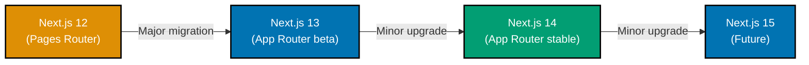

# Next.js Version Migration Guide

This document provides comprehensive guidance on migrating between Next.js versions. Upgrading Next.js ensures access to latest features, performance improvements, and security updates. Understanding migration strategies, breaking changes, and codemods enables smooth version transitions with minimal disruption.

**Prerequisites**: Familiarity with [Next.js fundamentals](./README.md), [routing](./ex-so-plwe-fene__routing.md), and [Server Components](./ex-so-plwe-fene__server-components.md).

## 🗺️ Migration Paths



## 📦 Pages Router to App Router Migration

### Migration Strategy

**Incremental Adoption** (Recommended):

1. Keep Pages Router (`pages/` directory)
2. Add App Router alongside (`app/` directory)
3. Migrate routes incrementally
4. Test thoroughly before removing Pages Router

### Step 1: Create App Directory

```bash
# Project structure before migration
my-app/
├── pages/
│   ├── index.tsx
│   ├── zakat/
│   │   └── index.tsx
│   └── api/
│       └── contracts.ts

# Add App Router alongside
my-app/
├── pages/              # Keep existing
├── app/                # Add new
│   └── layout.tsx      # Root layout
```

### Step 2: Create Root Layout

```typescript
// app/layout.tsx (required)
export default function RootLayout({ children }: { children: React.ReactNode }) {
  return (
    <html lang="en">
      <body>{children}</body>
    </html>
  );
}
```

### Step 3: Migrate Routes Incrementally

**Before (Pages Router)**:

```typescript
// pages/zakat/index.tsx
import { GetServerSideProps } from 'next';

interface ZakatPageProps {
  rates: ZakatRates;
}

export const getServerSideProps: GetServerSideProps<ZakatPageProps> = async () => {
  const rates = await fetchZakatRates();

  return {
    props: { rates },
  };
};

export default function ZakatPage({ rates }: ZakatPageProps) {
  return (
    <div>
      <h1>Zakat Calculator</h1>
      <p>Gold Nisab: ${rates.goldNisab}</p>
    </div>
  );
}
```

**After (App Router)**:

```typescript
// app/zakat/page.tsx
import { fetchZakatRates } from '@/lib/data';

export default async function ZakatPage() {
  // Direct async/await in Server Component
  const rates = await fetchZakatRates();

  return (
    <div>
      <h1>Zakat Calculator</h1>
      <p>Gold Nisab: ${rates.goldNisab}</p>
    </div>
  );
}
```

### Step 4: Migrate Data Fetching

**Pages Router → App Router Data Fetching**:

| Pages Router         | App Router                                        | Notes                |
| -------------------- | ------------------------------------------------- | -------------------- |
| `getServerSideProps` | `async` Server Component                          | Direct data fetching |
| `getStaticProps`     | `async` Server Component + `generateStaticParams` | Static generation    |
| `getStaticPaths`     | `generateStaticParams`                            | Dynamic routes       |
| `getInitialProps`    | Server Component (avoid)                          | Legacy pattern       |

**Static Generation Migration**:

```typescript
// Before (Pages Router)
export const getStaticProps = async () => {
  const rates = await fetchZakatRates();
  return { props: { rates }, revalidate: 3600 };
};

export const getStaticPaths = async () => {
  const contracts = await fetchContracts();
  return {
    paths: contracts.map((c) => ({ params: { id: c.id } })),
    fallback: false,
  };
};

// After (App Router)
export const revalidate = 3600; // ISR

export async function generateStaticParams() {
  const contracts = await fetchContracts();
  return contracts.map((c) => ({ id: c.id }));
}

export default async function ContractPage({ params }: { params: { id: string } }) {
  const contract = await fetchContract(params.id);
  return <ContractDetails contract={contract} />;
}
```

### Step 5: Migrate API Routes

**Before (Pages Router)**:

```typescript
// pages/api/contracts.ts
import type { NextApiRequest, NextApiResponse } from "next";

export default async function handler(req: NextApiRequest, res: NextApiResponse) {
  if (req.method === "GET") {
    const contracts = await fetchContracts();
    res.status(200).json(contracts);
  } else {
    res.status(405).json({ error: "Method not allowed" });
  }
}
```

**After (App Router)**:

```typescript
// app/api/contracts/route.ts
import { NextRequest, NextResponse } from "next/server";

export async function GET(request: NextRequest) {
  const contracts = await fetchContracts();
  return NextResponse.json(contracts);
}
```

### Step 6: Migrate Client Components

**Before (Pages Router)**:

```typescript
// pages/zakat/index.tsx
import { useState } from 'react';

export default function ZakatPage() {
  const [wealth, setWealth] = useState(0);

  return (
    <input
      type="number"
      value={wealth}
      onChange={(e) => setWealth(Number(e.target.value))}
    />
  );
}
```

**After (App Router)**:

```typescript
// app/zakat/_components/ZakatForm.tsx
'use client'; // Mark as Client Component

import { useState } from 'react';

export function ZakatForm() {
  const [wealth, setWealth] = useState(0);

  return (
    <input
      type="number"
      value={wealth}
      onChange={(e) => setWealth(Number(e.target.value))}
    />
  );
}
```

### Step 7: Test Migration

```bash
# Run development server with both routers
npm run dev

# Test pages in both directories
# Pages Router: http://localhost:3000/old-route
# App Router: http://localhost:3000/new-route

# Run tests
npm run test

# Build for production
npm run build
```

### Step 8: Remove Pages Router (Optional)

After successful migration and testing:

```bash
# Remove Pages Router directory
rm -rf pages/

# Update next.config.ts if needed
# Build and deploy
npm run build
```

## 🔄 Next.js 12 to 13 Migration

### Key Changes in Next.js 13

- App Router introduced (beta)
- React Server Components
- New Metadata API
- Turbopack (alpha)
- Font optimization with `next/font`
- Image optimization improvements

### Step 1: Update Dependencies

```bash
npm install next@13 react@latest react-dom@latest

# Update TypeScript (if using)
npm install -D typescript@latest @types/react@latest @types/react-dom@latest
```

### Step 2: Update next.config.js

```javascript
// next.config.js
/** @type {import('next').NextConfig} */
const nextConfig = {
  experimental: {
    appDir: true, // Enable App Router
  },
};

module.exports = nextConfig;
```

### Step 3: Migrate to next/font

```typescript
// Before (Next.js 12)
import Head from 'next/head';

export default function Home() {
  return (
    <>
      <Head>
        <link href="https://fonts.googleapis.com/css2?family=Inter&display=swap" rel="stylesheet" />
      </Head>
      <main>Content</main>
    </>
  );
}

// After (Next.js 13)
import { Inter } from 'next/font/google';

const inter = Inter({ subsets: ['latin'] });

export default function RootLayout({ children }: { children: React.ReactNode }) {
  return (
    <html className={inter.className}>
      <body>{children}</body>
    </html>
  );
}
```

### Step 4: Update Image Component

```typescript
// Before (Next.js 12)
import Image from 'next/image';

<Image src="/hero.jpg" width={1200} height={600} />

// After (Next.js 13) - Improved API
import Image from 'next/image';

<Image src="/hero.jpg" alt="Hero image" width={1200} height={600} />
// Alt text now required
```

## 🚀 Next.js 13 to 14 Migration

### Key Changes in Next.js 14

- Server Actions stable
- Partial Prerendering (preview)
- Turbopack improvements
- Enhanced caching strategies
- Metadata API improvements

### Step 1: Update Dependencies

```bash
npm install next@14 react@latest react-dom@latest
```

### Step 2: Update Server Actions

```typescript
// Next.js 13 (unstable)
// next.config.js
experimental: {
  serverActions: true,
}

// Next.js 14 (stable) - No config needed
// app/_actions/zakat-actions.ts
'use server';

export async function calculateZakat(formData: FormData) {
  // Server Action code
}
```

### Step 3: Update Metadata API

```typescript
// Next.js 13 - Basic metadata
export const metadata = {
  title: "Zakat Calculator",
  description: "Calculate your zakat",
};

// Next.js 14 - Enhanced metadata with templates
export const metadata = {
  title: {
    template: "%s | OSE Platform",
    default: "OSE Platform",
  },
  description: "Calculate your zakat obligations",
  openGraph: {
    title: "Zakat Calculator",
    description: "Calculate your zakat",
    images: ["/og-image.png"],
  },
};
```

## 🛠️ Codemods for Automated Migration

Next.js provides codemods to automate common migration tasks.

### Available Codemods

```bash
# List available codemods
npx @next/codemod --help

# Transform to App Router
npx @next/codemod@latest app-router-recipe

# New Link component (Next.js 13)
npx @next/codemod@latest new-link

# Image imports (Next.js 13)
npx @next/codemod@latest next-image-to-legacy-image

# Remove <a> from <Link>
npx @next/codemod@latest new-link ./pages

# Transform next/image imports
npx @next/codemod@latest next-image-experimental ./pages
```

### Example: New Link Codemod

```bash
# Before
<Link href="/zakat">
  <a>Zakat Calculator</a>
</Link>

# Run codemod
npx @next/codemod@latest new-link ./pages

# After
<Link href="/zakat">
  Zakat Calculator
</Link>
```

## 🔍 Breaking Changes Checklist

### Pages Router → App Router

- [ ] `_app.tsx` replaced with `app/layout.tsx`
- [ ] `_document.tsx` functionality in `app/layout.tsx`
- [ ] Data fetching methods replaced with async Server Components
- [ ] `getStaticPaths` replaced with `generateStaticParams`
- [ ] `useRouter` from `next/router` → `next/navigation`
- [ ] Client Components need `'use client'` directive
- [ ] API routes moved to `app/api/*/route.ts`
- [ ] Middleware updated for App Router patterns

### Next.js 12 → 13

- [ ] `next/image` requires `alt` attribute
- [ ] Font optimization with `next/font` instead of Google Fonts CDN
- [ ] `Link` component doesn't need `<a>` child
- [ ] SWC compiler default (Babel deprecated)

### Next.js 13 → 14

- [ ] Server Actions stable (no experimental flag)
- [ ] Updated caching behavior
- [ ] Turbopack improvements (optional)
- [ ] Metadata API enhancements

## 📊 Testing Migration

### Migration Testing Strategy

1. **Unit Tests**: Test components in isolation
2. **Integration Tests**: Test data fetching and interactions
3. **E2E Tests**: Test complete user flows
4. **Visual Regression**: Compare screenshots before/after
5. **Performance Tests**: Verify no performance degradation

### Migration Test Example

```typescript
// tests/migration/zakat-page.test.tsx
import { render, screen } from "@testing-library/react";
import { describe, it, expect } from "vitest";
import ZakatPage from "@/app/zakat/page";

describe("Zakat Page Migration", () => {
  it("renders zakat calculator after migration", async () => {
    render(await ZakatPage());

    expect(screen.getByText(/zakat calculator/i)).toBeInTheDocument();
    expect(screen.getByRole("button", { name: /calculate/i })).toBeInTheDocument();
  });

  it("maintains data fetching functionality", async () => {
    const page = await ZakatPage();
    render(page);

    // Verify rates are fetched and displayed
    expect(screen.getByText(/gold nisab/i)).toBeInTheDocument();
  });
});
```

## 🔄 Incremental Adoption Pattern

### Hybrid Approach

Run both Pages Router and App Router simultaneously during migration.

```
my-app/
├── pages/              # Legacy Pages Router
│   ├── index.tsx       # /
│   └── about.tsx       # /about
├── app/                # New App Router
│   ├── layout.tsx
│   ├── zakat/
│   │   └── page.tsx    # /zakat (new)
│   └── murabaha/
│       └── page.tsx    # /murabaha (new)
```

**Route Priority**: App Router takes precedence over Pages Router for same route.

### Feature Flags for Migration

```typescript
// lib/feature-flags.ts
export const featureFlags = {
  useAppRouter: process.env.NEXT_PUBLIC_USE_APP_ROUTER === "true",
};

// pages/zakat/index.tsx
import { featureFlags } from "@/lib/feature-flags";
import { useRouter } from "next/router";
import { useEffect } from "react";

export default function ZakatPageLegacy() {
  const router = useRouter();

  useEffect(() => {
    if (featureFlags.useAppRouter) {
      router.push("/zakat"); // Redirect to App Router version
    }
  }, [router]);

  // Legacy page content
}
```

## 📝 Migration Checklist

### Pre-Migration

- [ ] Review Next.js upgrade guide
- [ ] Check third-party library compatibility
- [ ] Create feature branch for migration
- [ ] Document current application behavior
- [ ] Set up monitoring for comparison
- [ ] Create rollback plan

### During Migration

- [ ] Update Next.js and React versions
- [ ] Run codemods for automated transformations
- [ ] Create root `app/layout.tsx`
- [ ] Migrate routes incrementally
- [ ] Update data fetching patterns
- [ ] Convert Client Components with `'use client'`
- [ ] Migrate API routes to Route Handlers
- [ ] Update imports (useRouter, Link, etc.)
- [ ] Test each migrated route
- [ ] Update TypeScript types
- [ ] Fix linting errors
- [ ] Update documentation

### Post-Migration

- [ ] Run full test suite
- [ ] Perform E2E testing
- [ ] Check bundle size
- [ ] Verify Core Web Vitals
- [ ] Load test production build
- [ ] Deploy to staging
- [ ] Monitor error rates
- [ ] Verify analytics tracking
- [ ] Remove Pages Router (optional)
- [ ] Update team documentation

## 🔗 Related Documentation

**Next.js Core**:

- [Routing](./ex-so-plwe-fene__routing.md) - App Router fundamentals
- [Server Components](./ex-so-plwe-fene__server-components.md) - RSC patterns
- [Best Practices](./ex-so-plwe-fene__best-practices.md) - Production standards
- [Testing](./ex-so-plwe-fene__testing.md) - Testing migration

**Official Resources**:

- [Upgrade Guide](https://nextjs.org/docs/app/building-your-application/upgrading)
- [App Router Migration](https://nextjs.org/docs/app/building-your-application/upgrading/app-router-migration)
- [Codemods](https://nextjs.org/docs/app/building-your-application/upgrading/codemods)

---

This comprehensive migration guide covers upgrading Next.js versions from Pages Router to App Router and across major versions. Use incremental adoption strategies, leverage codemods, and test thoroughly to ensure smooth migrations with minimal disruption to production applications.
