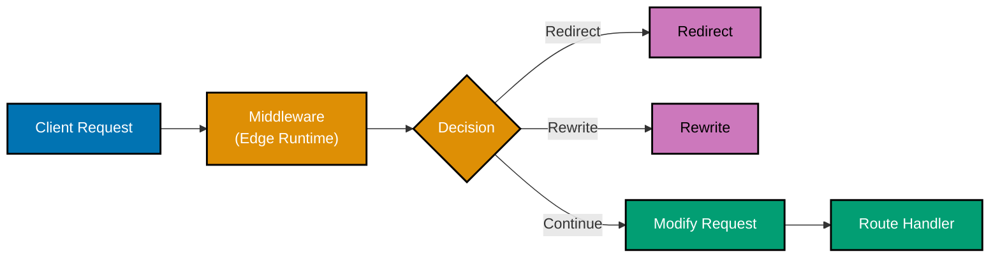

# Next.js Middleware

## Quick Reference

**Core Concepts**:

- [Middleware Fundamentals](#middleware-fundamentals) - Execution model
- [Request Modification](#request-and-response-modification) - Headers, cookies
- [Authentication](#authentication-patterns) - Route protection
- [Redirects & Rewrites](#redirects-and-rewrites) - URL transformation
- [Matcher Configuration](#matcher-configuration) - Route matching

**Advanced**:

- [NextResponse API](#nextresponse-api) - Response utilities
- [Geolocation](#geolocation-and-ab-testing) - Location-based routing
- [Bot Detection](#bot-detection) - Traffic filtering
- [Rate Limiting](#rate-limiting) - Throttling requests
- [Edge Runtime Limitations](#edge-runtime-limitations) - Constraints

## Overview

**Middleware** in Next.js runs on the Edge runtime before a request is completed, allowing you to modify request/response, redirect, rewrite, or set headers. Middleware executes for every matched route, making it ideal for authentication, logging, and request modification.

**Key Features**:

- **Edge Runtime** - Runs globally at the edge
- **Pre-request execution** - Runs before route handlers
- **Request/Response modification** - Transform requests and responses
- **Conditional routing** - Redirect or rewrite based on logic
- **Zero cold starts** - Always ready

This guide covers Next.js 14+ middleware patterns for enterprise applications.

## Middleware Fundamentals

### Basic Middleware

```typescript
// middleware.ts (root level)
import { NextResponse } from "next/server";
import type { NextRequest } from "next/server";

export function middleware(request: NextRequest) {
  console.log("Middleware executed for:", request.url);

  // Continue to the route
  return NextResponse.next();
}

// Configure which routes middleware applies to
export const config = {
  matcher: ["/dashboard/:path*", "/api/:path*"],
};
```

### Execution Flow



## Request and Response Modification

### Reading Request Data

```typescript
// middleware.ts
import { NextResponse } from "next/server";
import type { NextRequest } from "next/server";

export function middleware(request: NextRequest) {
  // URL information
  const url = request.nextUrl;
  console.log("Path:", url.pathname);
  console.log("Search params:", url.searchParams.get("query"));

  // Headers
  const userAgent = request.headers.get("user-agent");
  const referer = request.headers.get("referer");

  // Cookies
  const token = request.cookies.get("auth-token");

  // Geo information (Edge runtime)
  const country = request.geo?.country;
  const city = request.geo?.city;

  return NextResponse.next();
}
```

### Setting Response Headers

```typescript
// middleware.ts
import { NextResponse } from "next/server";
import type { NextRequest } from "next/server";

export function middleware(request: NextRequest) {
  const response = NextResponse.next();

  // Add custom headers
  response.headers.set("x-custom-header", "my-value");
  response.headers.set("x-pathname", request.nextUrl.pathname);

  // Security headers
  response.headers.set("x-frame-options", "DENY");
  response.headers.set("x-content-type-options", "nosniff");

  return response;
}
```

### Setting Cookies

```typescript
// middleware.ts
import { NextResponse } from "next/server";
import type { NextRequest } from "next/server";

export function middleware(request: NextRequest) {
  const response = NextResponse.next();

  // Set cookie
  response.cookies.set("visited", "true", {
    maxAge: 60 * 60 * 24 * 365, // 1 year
    httpOnly: true,
    secure: process.env.NODE_ENV === "production",
  });

  // Delete cookie
  response.cookies.delete("old-cookie");

  return response;
}
```

## Authentication Patterns

### Basic Authentication Check

```typescript
// middleware.ts
import { NextResponse } from "next/server";
import type { NextRequest } from "next/server";

export function middleware(request: NextRequest) {
  const token = request.cookies.get("auth-token");

  // Protect routes
  if (!token) {
    const loginUrl = new URL("/login", request.url);
    loginUrl.searchParams.set("callbackUrl", request.nextUrl.pathname);
    return NextResponse.redirect(loginUrl);
  }

  return NextResponse.next();
}

export const config = {
  matcher: ["/dashboard/:path*", "/profile/:path*"],
};
```

### JWT Verification

```typescript
// middleware.ts
import { NextResponse } from "next/server";
import type { NextRequest } from "next/server";
import { jwtVerify } from "jose";

const secret = new TextEncoder().encode(process.env.JWT_SECRET);

export async function middleware(request: NextRequest) {
  const token = request.cookies.get("auth-token")?.value;

  if (!token) {
    return NextResponse.redirect(new URL("/login", request.url));
  }

  try {
    const { payload } = await jwtVerify(token, secret);

    // Add user info to request headers for downstream consumption
    const requestHeaders = new Headers(request.headers);
    requestHeaders.set("x-user-id", payload.sub as string);
    requestHeaders.set("x-user-role", payload.role as string);

    return NextResponse.next({
      request: {
        headers: requestHeaders,
      },
    });
  } catch (error) {
    console.error("JWT verification failed:", error);
    return NextResponse.redirect(new URL("/login", request.url));
  }
}

export const config = {
  matcher: ["/dashboard/:path*", "/api/protected/:path*"],
};
```

### OSE Platform: Role-Based Access

```typescript
// middleware.ts
import { NextResponse } from "next/server";
import type { NextRequest } from "next/server";
import { jwtVerify } from "jose";

const secret = new TextEncoder().encode(process.env.JWT_SECRET);

const publicPaths = ["/login", "/register", "/about", "/pricing"];
const adminPaths = ["/admin"];

export async function middleware(request: NextRequest) {
  const { pathname } = request.nextUrl;

  // Allow public paths
  if (publicPaths.some((path) => pathname.startsWith(path))) {
    return NextResponse.next();
  }

  // Check authentication
  const token = request.cookies.get("auth-token")?.value;

  if (!token) {
    const loginUrl = new URL("/login", request.url);
    loginUrl.searchParams.set("callbackUrl", pathname);
    return NextResponse.redirect(loginUrl);
  }

  try {
    const { payload } = await jwtVerify(token, secret);

    // Check admin access
    if (adminPaths.some((path) => pathname.startsWith(path))) {
      if (payload.role !== "admin") {
        return NextResponse.redirect(new URL("/unauthorized", request.url));
      }
    }

    // Pass user info to route handlers
    const requestHeaders = new Headers(request.headers);
    requestHeaders.set("x-user-id", payload.sub as string);
    requestHeaders.set("x-user-role", payload.role as string);
    requestHeaders.set("x-user-email", payload.email as string);

    return NextResponse.next({
      request: {
        headers: requestHeaders,
      },
    });
  } catch (error) {
    console.error("Authentication failed:", error);

    // Clear invalid token
    const response = NextResponse.redirect(new URL("/login", request.url));
    response.cookies.delete("auth-token");
    return response;
  }
}

export const config = {
  matcher: ["/dashboard/:path*", "/zakat/:path*", "/murabaha/:path*", "/waqf/:path*", "/admin/:path*", "/api/:path*"],
};
```

## Redirects and Rewrites

### Simple Redirects

```typescript
// middleware.ts
import { NextResponse } from "next/server";
import type { NextRequest } from "next/server";

export function middleware(request: NextRequest) {
  const { pathname } = request.nextUrl;

  // Redirect old blog to new blog
  if (pathname.startsWith("/old-blog")) {
    const newPath = pathname.replace("/old-blog", "/blog");
    return NextResponse.redirect(new URL(newPath, request.url));
  }

  // Redirect non-www to www
  if (request.nextUrl.hostname === "example.com") {
    return NextResponse.redirect(new URL(pathname, `https://www.example.com${pathname}`));
  }

  return NextResponse.next();
}
```

### URL Rewrites

```typescript
// middleware.ts
import { NextResponse } from "next/server";
import type { NextRequest } from "next/server";

export function middleware(request: NextRequest) {
  const { pathname } = request.nextUrl;

  // Rewrite /docs to /documentation (user sees /docs, server serves /documentation)
  if (pathname.startsWith("/docs")) {
    const newPath = pathname.replace("/docs", "/documentation");
    return NextResponse.rewrite(new URL(newPath, request.url));
  }

  // Rewrite API calls to external API
  if (pathname.startsWith("/api/v2")) {
    return NextResponse.rewrite(new URL(pathname, "https://api.external.com"));
  }

  return NextResponse.next();
}
```

### Conditional Redirects

```typescript
// middleware.ts
import { NextResponse } from "next/server";
import type { NextRequest } from "next/server";

export function middleware(request: NextRequest) {
  const { pathname } = request.nextUrl;
  const token = request.cookies.get("auth-token");

  // Redirect authenticated users away from auth pages
  if (pathname === "/login" && token) {
    return NextResponse.redirect(new URL("/dashboard", request.url));
  }

  // Redirect unauthenticated users to login
  if (pathname.startsWith("/dashboard") && !token) {
    const loginUrl = new URL("/login", request.url);
    loginUrl.searchParams.set("callbackUrl", pathname);
    return NextResponse.redirect(loginUrl);
  }

  return NextResponse.next();
}
```

## Matcher Configuration

### Path Patterns

```typescript
export const config = {
  matcher: [
    // Match specific paths
    "/dashboard",
    "/profile",

    // Match with wildcard
    "/api/:path*",

    // Match multiple segments
    "/blog/:category/:slug",

    // Exclude paths (negative lookahead)
    "/((?!api|_next/static|_next/image|favicon.ico).*)",

    // Match with regex
    "/items/((?!new$)[^/]+)",
  ],
};
```

### Conditional Matching

```typescript
// middleware.ts
import { NextResponse } from "next/server";
import type { NextRequest } from "next/server";

export function middleware(request: NextRequest) {
  const { pathname } = request.nextUrl;

  // Skip middleware for static files
  if (
    pathname.startsWith("/_next") ||
    pathname.startsWith("/static") ||
    pathname.includes(".") // has file extension
  ) {
    return NextResponse.next();
  }

  // Your middleware logic
  return NextResponse.next();
}
```

## NextResponse API

### Available Methods

```typescript
// Continue to route
NextResponse.next();

// Redirect
NextResponse.redirect(new URL("/new-path", request.url));

// Rewrite
NextResponse.rewrite(new URL("/internal-path", request.url));

// JSON response (stop at middleware)
NextResponse.json({ error: "Unauthorized" }, { status: 401 });

// Custom response
new NextResponse("Custom body", {
  status: 200,
  headers: {
    "content-type": "text/plain",
  },
});
```

## Geolocation and A/B Testing

### Geolocation-Based Routing

```typescript
// middleware.ts
import { NextResponse } from "next/server";
import type { NextRequest } from "next/server";

export function middleware(request: NextRequest) {
  const country = request.geo?.country || "US";

  // Redirect based on country
  if (country === "ID" && !request.nextUrl.pathname.startsWith("/id")) {
    return NextResponse.redirect(new URL("/id", request.url));
  }

  // Set country cookie
  const response = NextResponse.next();
  response.cookies.set("user-country", country);

  return response;
}
```

### A/B Testing

```typescript
// middleware.ts
import { NextResponse } from "next/server";
import type { NextRequest } from "next/server";

const COOKIE_NAME = "ab-test-variant";

export function middleware(request: NextRequest) {
  // Get or assign A/B test variant
  let variant = request.cookies.get(COOKIE_NAME)?.value;

  if (!variant) {
    // Randomly assign variant
    variant = Math.random() < 0.5 ? "A" : "B";
  }

  const response =
    variant === "A"
      ? NextResponse.rewrite(new URL("/variants/a", request.url))
      : NextResponse.rewrite(new URL("/variants/b", request.url));

  // Set variant cookie
  response.cookies.set(COOKIE_NAME, variant, {
    maxAge: 60 * 60 * 24 * 30, // 30 days
  });

  return response;
}

export const config = {
  matcher: "/landing",
};
```

## Bot Detection

### Basic Bot Detection

```typescript
// middleware.ts
import { NextResponse } from "next/server";
import type { NextRequest } from "next/server";

const botPatterns = [/bot/i, /crawl/i, /spider/i, /slurp/i, /bingbot/i, /googlebot/i];

export function middleware(request: NextRequest) {
  const userAgent = request.headers.get("user-agent") || "";

  const isBot = botPatterns.some((pattern) => pattern.test(userAgent));

  if (isBot) {
    // Serve different content for bots (SEO optimized)
    return NextResponse.rewrite(new URL("/bot-view", request.url));
  }

  return NextResponse.next();
}
```

## Rate Limiting

### Simple Rate Limiting

```typescript
// middleware.ts
import { NextResponse } from "next/server";
import type { NextRequest } from "next/server";

// In-memory store (use Redis in production)
const rateLimitMap = new Map<string, { count: number; resetAt: number }>();

export function middleware(request: NextRequest) {
  const ip = request.ip || "unknown";
  const now = Date.now();
  const limit = 100; // requests
  const window = 60 * 1000; // 1 minute

  const record = rateLimitMap.get(ip);

  if (!record || now > record.resetAt) {
    rateLimitMap.set(ip, { count: 1, resetAt: now + window });
    return NextResponse.next();
  }

  if (record.count >= limit) {
    return NextResponse.json({ error: "Too many requests" }, { status: 429 });
  }

  record.count++;
  return NextResponse.next();
}

export const config = {
  matcher: "/api/:path*",
};
```

## OSE Platform: Complete Middleware

```typescript
// middleware.ts
import { NextResponse } from "next/server";
import type { NextRequest } from "next/server";
import { jwtVerify } from "jose";

const secret = new TextEncoder().encode(process.env.JWT_SECRET);

// Public routes that don't require authentication
const publicPaths = ["/", "/about", "/pricing", "/contact", "/login", "/register", "/forgot-password", "/blog"];

// Admin-only routes
const adminPaths = ["/admin"];

// API routes that don't require authentication
const publicApiPaths = ["/api/auth", "/api/public"];

export async function middleware(request: NextRequest) {
  const { pathname } = request.nextUrl;

  // Skip static files
  if (pathname.startsWith("/_next") || pathname.startsWith("/static") || pathname.includes(".")) {
    return NextResponse.next();
  }

  // Allow public paths
  if (publicPaths.some((path) => pathname === path || pathname.startsWith(`${path}/`))) {
    return NextResponse.next();
  }

  // Allow public API paths
  if (publicApiPaths.some((path) => pathname.startsWith(path))) {
    return NextResponse.next();
  }

  // Check authentication
  const token = request.cookies.get("auth-token")?.value;

  if (!token) {
    // Redirect to login for protected pages
    if (!pathname.startsWith("/api")) {
      const loginUrl = new URL("/login", request.url);
      loginUrl.searchParams.set("callbackUrl", pathname);
      return NextResponse.redirect(loginUrl);
    }

    // Return 401 for API routes
    return NextResponse.json({ error: "Unauthorized" }, { status: 401 });
  }

  try {
    // Verify JWT
    const { payload } = await jwtVerify(token, secret);

    // Check admin access
    if (adminPaths.some((path) => pathname.startsWith(path))) {
      if (payload.role !== "admin") {
        // Redirect to unauthorized page
        if (!pathname.startsWith("/api")) {
          return NextResponse.redirect(new URL("/unauthorized", request.url));
        }

        // Return 403 for API routes
        return NextResponse.json({ error: "Forbidden" }, { status: 403 });
      }
    }

    // Pass user info to route handlers via headers
    const requestHeaders = new Headers(request.headers);
    requestHeaders.set("x-user-id", payload.sub as string);
    requestHeaders.set("x-user-role", payload.role as string);
    requestHeaders.set("x-user-email", payload.email as string);

    // Add security headers
    const response = NextResponse.next({
      request: {
        headers: requestHeaders,
      },
    });

    response.headers.set("x-frame-options", "DENY");
    response.headers.set("x-content-type-options", "nosniff");
    response.headers.set("referrer-policy", "strict-origin-when-cross-origin");
    response.headers.set("permissions-policy", "camera=(), microphone=(), geolocation=()");

    return response;
  } catch (error) {
    console.error("JWT verification failed:", error);

    // Clear invalid token
    const response = pathname.startsWith("/api")
      ? NextResponse.json({ error: "Invalid token" }, { status: 401 })
      : NextResponse.redirect(new URL("/login", request.url));

    response.cookies.delete("auth-token");
    return response;
  }
}

export const config = {
  matcher: ["/((?!_next/static|_next/image|favicon.ico).*)"],
};
```

## Edge Runtime Limitations

### What You Cannot Use

❌ **Node.js APIs**: fs, path, crypto (Node.js version), child_process
❌ **Native Modules**: bcrypt, sharp, canvas
❌ **Large Dependencies**: Most npm packages over 1MB

### What You Can Use

✅ **Web APIs**: fetch, Headers, Request, Response
✅ **Crypto API**: Web Crypto API
✅ **Edge-Compatible Libraries**: jose, nanoid, zod

### Workarounds

```typescript
// ❌ Don't use Node.js crypto
import crypto from "crypto";

// ✅ Use Web Crypto API
const hash = await crypto.subtle.digest("SHA-256", new TextEncoder().encode("data"));
```

## Best Practices

### ✅ Do

- **Keep middleware fast** - Runs on every request
- **Use Edge-compatible APIs** - Web standards only
- **Cache expensive operations** - Minimize compute
- **Use proper matchers** - Avoid running on every route
- **Add security headers** - Protect all routes
- **Log errors** - Debug production issues
- **Test JWT verification** - Ensure auth works

### ❌ Don't

- **Don't use Node.js APIs** - Edge runtime limitations
- **Don't perform heavy computation** - Slow requests
- **Don't fetch from database** - Use caching or tokens
- **Don't skip error handling** - Catch all errors
- **Don't log sensitive data** - Protect user privacy
- **Don't return full errors** - Leak implementation details

## Related Documentation

**Core Next.js**:

- [Routing](ex-so-plwe-tsne__routing.md) - Route configuration
- [API Routes](ex-so-plwe-tsne__api-routes.md) - Backend endpoints
- [Security](ex-so-plwe-tsne__security.md) - Security patterns

**Patterns**:

- [Best Practices](ex-so-plwe-tsne__best-practices.md) - Production standards

---

**Last Updated**: 2026-01-26
**Next.js Version**: 14+ (Edge Middleware stable)
