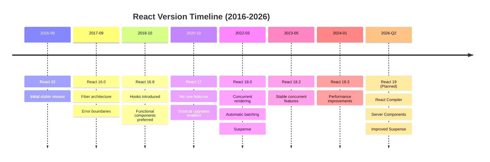

# React with TypeScript Framework

**Understanding-oriented documentation** for React with TypeScript framework in the open-sharia-enterprise platform.

## Overview

React with TypeScript is a powerful combination for building modern, type-safe frontend applications. React provides a component-based UI library with a declarative approach, while TypeScript adds static typing, enhanced IDE support, and compile-time error detection. Together, they enable building scalable, maintainable user interfaces with excellent developer experience.

This documentation covers React 18+ with TypeScript 5+ and Vite 5+ for building production-ready single-page applications (SPAs), dashboards, and interactive frontends.

**Version**: React 18+ (targeting latest stable release)
**TypeScript Version**: TypeScript 5+
**Build Tool**: Vite 5+
**Package Manager**: npm/pnpm

## Framework Standards

**This documentation is the authoritative reference** for React with TypeScript usage standards in the open-sharia-enterprise platform.

All React applications MUST follow the patterns and practices documented here:

1. **[Idioms](ex-so-plwe-fere__idioms.md)** - React + TypeScript-specific patterns
2. **[Best Practices](ex-so-plwe-fere__best-practices.md)** - Framework standards
3. **[Anti-Patterns](ex-so-plwe-fere__anti-patterns.md)** - Common mistakes to avoid
4. **[Component Architecture](ex-so-plwe-fere__component-architecture.md)** - Component design principles
5. **[Configuration](ex-so-plwe-fere__configuration.md)** - Build and environment configuration

**For Agents**: Reference this documentation when building React applications.

**Language Standards**: Also follow [TypeScript](../../prog-lang/typescript/README.md) language standards.

### Quick Standards Reference

- **Project Structure**: See [Architecture Integration](#architecture-integration)
- **Components**: See [Component Architecture](ex-so-plwe-fere__component-architecture.md)
- **State Management**: See [State Management](ex-so-plwe-fere__state-management.md)
- **Data Fetching**: See [Data Fetching](ex-so-plwe-fere__data-fetching.md)
- **Security**: See [Security](ex-so-plwe-fere__security.md)
- **Testing**: See [Testing](ex-so-plwe-fere__testing.md)

## Software Engineering Principles

React with TypeScript usage in this platform follows the five software engineering principles from [governance/principles/software-engineering/](../../../../../governance/principles/software-engineering/README.md):

1. **[Automation Over Manual](../../../../../governance/principles/software-engineering/automation-over-manual.md)** - React automates through Vite hot module replacement, automatic TypeScript compilation, ESLint/Prettier integration, automated testing with Vitest
2. **[Explicit Over Implicit](../../../../../governance/principles/software-engineering/explicit-over-implicit.md)** - React with TypeScript enforces through explicit prop types, clear component interfaces, explicit state declarations, visible dependencies
3. **[Immutability Over Mutability](../../../../../governance/principles/software-engineering/immutability.md)** - Use immutable state updates, functional components, pure functions for state transformations, readonly TypeScript types
4. **[Pure Functions Over Side Effects](../../../../../governance/principles/software-engineering/pure-functions.md)** - Apply functional component model: pure render functions, side effects in hooks (useEffect), predictable state transformations
5. **[Reproducibility First](../../../../../governance/principles/software-engineering/reproducibility.md)** - React enables through version pinning (package-lock.json), Vite configuration, environment-specific builds, Docker containerization

**See Also**: [Component Architecture](ex-so-plwe-fere__component-architecture.md) for FP patterns with React.

## Quick Reference

**Jump to:**

- [Overview](#overview) - React with TypeScript in the platform
- [Software Engineering Principles](#software-engineering-principles) - Five core principles
- [React Version Strategy](#react-version-strategy) - Version timeline and management
- [Documentation Structure](#documentation-structure) - Guide to documentation files
- [Key Capabilities](#key-capabilities) - Framework features
- [Use Cases](#use-cases) - When to use React
- [Architecture Integration](#architecture-integration) - Component architecture, state patterns
- [Development Workflow](#development-workflow) - Setup, configuration, testing
- [Learning Path](#learning-path) - Recommended reading order
- [Code Examples from Platform](#code-examples-from-platform) - Real implementations
- [Integration with Other Documentation](#integration-with-other-documentation) - Cross-references
- [React Ecosystem](#react-ecosystem) - React libraries and tools
- [Tools and Development Environment](#tools-and-development-environment) - Build tools, IDEs
- [Resources and References](#resources-and-references) - External resources
- [Related Documentation](#related-documentation) - Cross-references

**Core Documentation:**

- [Idioms](ex-so-plwe-fere__idioms.md) - React + TypeScript patterns (hooks, components, context)
- [Best Practices](ex-so-plwe-fere__best-practices.md) - Framework coding standards
- [Anti-Patterns](ex-so-plwe-fere__anti-patterns.md) - Common React mistakes
- [Component Architecture](ex-so-plwe-fere__component-architecture.md) - Component design patterns
- [Configuration](ex-so-plwe-fere__configuration.md) - Vite config, environment variables
- [State Management](ex-so-plwe-fere__state-management.md) - useState, useReducer, Context, Zustand
- [Data Fetching](ex-so-plwe-fere__data-fetching.md) - API calls, React Query, SWR
- [Hooks](ex-so-plwe-fere__hooks.md) - Custom hooks patterns and built-in hooks
- [REST APIs](ex-so-plwe-fere__rest-apis.md) - Consuming REST APIs with Fetch/Axios
- [Security](ex-so-plwe-fere__security.md) - XSS prevention, CSRF, authentication
- [Testing](ex-so-plwe-fere__testing.md) - Vitest, React Testing Library
- [Observability](ex-so-plwe-fere__observability.md) - Error boundaries, Sentry, analytics
- [Performance](ex-so-plwe-fere__performance.md) - Code splitting, lazy loading, memoization
- [Deployment](ex-so-plwe-fere__deployment.md) - Vercel, Docker, CDN deployment
- [Version Migration](ex-so-plwe-fere__version-migration.md) - Upgrading React versions

## React Version Strategy



**Platform Strategy**: React 18.3+ (current) → React 19 (future)

### Current Version: React 18.3+

**Platform Standard**: React 18.3 is the target version for all React projects.

**Rationale**:

- Concurrent rendering for responsive UIs
- Automatic batching for better performance
- Suspense for data fetching
- Improved TypeScript support
- Stable hook APIs
- Server Components preparation (experimental)

**Key Features**:

- **Concurrent Rendering** - Non-blocking rendering for better UX
- **Automatic Batching** - Multiple setState calls batched automatically
- **startTransition** - Mark non-urgent updates
- **useDeferredValue** - Defer expensive re-renders
- **useId** - Generate unique IDs for accessibility
- **Suspense** - Declarative loading states

### Future: React 19

**Expected**: Q2 2026 (speculative)

**Anticipated Changes**:

- React Compiler for automatic optimization
- Server Components as default
- Enhanced Suspense with streaming SSR
- Improved concurrent features
- Better TypeScript integration
- Actions and useActionState for forms

## Documentation Structure

### [React with TypeScript Idioms](ex-so-plwe-fere__idioms.md)

Framework-specific patterns for writing idiomatic React applications with TypeScript.

**Covers**:

- Functional components with TypeScript
- Hook patterns (useState, useEffect, useCallback, useMemo)
- Custom hooks for reusable logic
- Context API for state sharing
- Component composition patterns
- Props with TypeScript interfaces
- Generic components
- Ref forwarding and useImperativeHandle
- Event handling with TypeScript
- Conditional rendering patterns

### [React Best Practices](ex-so-plwe-fere__best-practices.md)

Proven approaches for building production-ready React applications.

**Covers**:

- Component organization and file structure
- State management strategies
- Performance optimization (memoization, code splitting)
- Accessibility (ARIA, semantic HTML, keyboard navigation)
- Error handling and boundaries
- Testing strategies
- TypeScript best practices for React
- Code splitting and lazy loading
- Environment variable management
- API integration patterns

### [React Anti-Patterns](ex-so-plwe-fere__anti-patterns.md)

Common mistakes and problematic patterns to avoid.

**Covers**:

- Prop drilling anti-pattern
- Unnecessary re-renders
- Missing dependency arrays in hooks
- Mutating state directly
- Using indexes as keys
- Overusing useEffect
- Missing error boundaries
- Inline function definitions in JSX
- Not leveraging TypeScript types
- State duplication

### Documentation Organization

```mermaid
%% Color Palette: Blue #0173B2, Orange #DE8F05, Teal #029E73, Purple #CC78BC
%% All colors are color-blind friendly and meet WCAG AA contrast standards

flowchart TD
    A["React Documentation"]:::blue
    B["Core Patterns"]:::teal
    C["Application Layers"]:::teal
    D["Advanced Topics"]:::purple
    E["Integration"]:::orange

    A --> B
    A --> C
    A --> D
    A --> E

    B --> B1["Idioms"]
    B --> B2["Best Practices"]
    B --> B3["Anti-Patterns"]

    C --> C1["Component Architecture"]
    C --> C2["State Management"]
    C --> C3["Data Fetching"]
    C --> C4["Hooks"]

    D --> D1["Security"]
    D --> D2["Testing"]
    D --> D3["Observability"]
    D --> D4["Performance"]

    E --> E1["REST APIs"]
    E --> E2["Deployment"]
    E --> E3["Version Migration"]

    classDef blue fill:#0173B2,stroke:#000000,color:#FFFFFF,stroke-width:2px
    classDef orange fill:#DE8F05,stroke:#000000,color:#FFFFFF,stroke-width:2px
    classDef teal fill:#029E73,stroke:#000000,color:#FFFFFF,stroke-width:2px
    classDef purple fill:#CC78BC,stroke:#000000,color:#000000,stroke-width:2px
```



### Specialized Topics

Deep-dive documentation on critical React areas:

#### [Component Architecture](ex-so-plwe-fere__component-architecture.md)

Comprehensive guide to component design and organization.

**Covers**:

- Atomic design principles (atoms, molecules, organisms)
- Container vs Presentational components
- Compound component pattern
- Render props and higher-order components (HOCs)
- Component composition strategies
- Props interface design with TypeScript
- Component file structure
- Feature-based organization
- Design system integration
- Storybook for component documentation

#### [State Management](ex-so-plwe-fere__state-management.md)

Comprehensive guide to state management in React applications.

**Covers**:

- Local state with useState
- Complex state with useReducer
- Context API for global state
- Zustand for lightweight state management
- React Query for server state
- State colocation principles
- Avoiding prop drilling
- State lifting patterns
- Derived state patterns
- State persistence strategies

#### [Data Fetching](ex-so-plwe-fere__data-fetching.md)

Comprehensive guide to fetching and managing server data.

**Covers**:

- Fetch API and Axios
- React Query for server state management
- SWR (stale-while-revalidate)
- Error handling strategies
- Loading states and suspense
- Optimistic updates
- Caching strategies
- Pagination and infinite scroll
- Prefetching data
- Authentication with tokens

#### [Custom Hooks](ex-so-plwe-fere__hooks.md)

Comprehensive guide to React hooks and custom hook patterns.

**Covers**:

- Built-in hooks (useState, useEffect, useContext, useReducer, etc.)
- Custom hook creation patterns
- Hook composition
- useCallback and useMemo optimization
- Hook testing strategies
- Hook dependency arrays
- Hook ordering rules
- Common custom hooks (useLocalStorage, useDebounce, useFetch)
- TypeScript with hooks
- Hook best practices

#### [REST APIs Integration](ex-so-plwe-fere__rest-apis.md)

Comprehensive guide to consuming REST APIs in React applications.

**Covers**:

- Fetch API basics
- Axios configuration
- Request/response interceptors
- Error handling
- TypeScript types for API responses
- Authentication headers
- CORS handling
- API client abstraction
- Request cancellation
- Rate limiting and retries
- Financial examples: Zakat API, Murabaha API calls

#### [Security](ex-so-plwe-fere__security.md)

Comprehensive guide to React application security.

**Covers**:

- XSS (Cross-Site Scripting) prevention
- CSRF protection
- Content Security Policy (CSP)
- Authentication patterns (JWT, OAuth2)
- Secure token storage
- HTTPS enforcement
- Input sanitization
- Dependency vulnerability scanning
- Security headers
- Third-party script safety

#### [Testing](ex-so-plwe-fere__testing.md)

Comprehensive guide to testing React applications.

**Covers**:

- Vitest for unit testing
- React Testing Library for component testing
- Testing hooks with @testing-library/react-hooks
- Integration testing strategies
- E2E testing with Playwright
- Mocking API calls
- Testing custom hooks
- Snapshot testing
- Coverage requirements
- TDD workflow with React

#### [Observability](ex-so-plwe-fere__observability.md)

Comprehensive guide to monitoring and debugging React applications.

**Covers**:

- Error boundaries for graceful error handling
- Sentry integration for error tracking
- React DevTools for debugging
- Performance monitoring with Web Vitals
- User analytics (Google Analytics, Mixpanel)
- Logging strategies
- Source maps for production debugging
- Performance profiling
- Custom error reporting
- User session replay

#### [Performance Optimization](ex-so-plwe-fere__performance.md)

Comprehensive guide to optimizing React application performance.

**Covers**:

- Code splitting with React.lazy
- Route-based code splitting
- Memoization (React.memo, useMemo, useCallback)
- Virtual scrolling for large lists
- Image optimization and lazy loading
- Bundle size optimization
- Web Vitals monitoring (LCP, FID, CLS)
- React Profiler usage
- Avoiding unnecessary re-renders
- Debouncing and throttling

#### [Deployment](ex-so-plwe-fere__deployment.md)

Comprehensive guide to deploying React applications.

**Covers**:

- Vercel deployment (recommended)
- Docker containerization
- CDN deployment (Cloudflare, AWS CloudFront)
- Environment-specific builds
- CI/CD with GitHub Actions
- Build optimization
- Static site generation
- Progressive Web App (PWA) setup
- Monitoring and rollback strategies
- Zero-downtime deployments

#### [Version Migration](ex-so-plwe-fere__version-migration.md)

Comprehensive guide to upgrading React versions.

**Covers**:

- React 16 to React 17 migration
- React 17 to React 18 migration
- Concurrent features adoption
- Breaking changes and deprecations
- Codemod usage for automated migration
- Testing migration changes
- TypeScript compatibility updates
- Third-party library compatibility
- Step-by-step migration checklist

## Key Capabilities

### Component Model

React's declarative component model enables building complex UIs from small, reusable pieces:

- **Functional Components** - Modern, hooks-based components
- **JSX** - JavaScript syntax extension for describing UI
- **Props** - Data flow from parent to child
- **State** - Component-local reactive data
- **Lifecycle** - Hooks for side effects (useEffect)
- **Composition** - Building complex UIs from simple components

### Hooks

React Hooks enable state and side effects in functional components:

- **useState** - Local component state
- **useEffect** - Side effects and lifecycle
- **useContext** - Consume context values
- **useReducer** - Complex state management
- **useCallback** - Memoize functions
- **useMemo** - Memoize expensive calculations
- **useRef** - Mutable references
- **Custom Hooks** - Reusable stateful logic

### TypeScript Integration

TypeScript provides type safety and excellent developer experience:

- **Component Props** - Type-safe prop interfaces
- **Event Handlers** - Typed event handlers
- **Hooks** - Type inference for hooks
- **Generic Components** - Reusable typed components
- **API Responses** - Type-safe API integration
- **State** - Typed state management

### Routing

React Router for client-side navigation:

- **Declarative Routing** - Route configuration
- **Nested Routes** - Hierarchical routing
- **Lazy Loading** - Code splitting by route
- **Route Protection** - Authentication guards
- **URL Parameters** - Dynamic routes

### Forms

Form handling and validation:

- **Controlled Components** - React-controlled form inputs
- **React Hook Form** - Performant form library
- **Validation** - Schema validation with Zod/Yup
- **Error Handling** - Field-level error messages
- **File Uploads** - Multi-part form data

## Use Cases

**Use React when you need:**

✅ Single-page applications (SPAs) with rich interactions
✅ Admin dashboards and data-heavy interfaces
✅ Real-time collaborative applications
✅ Progressive Web Apps (PWAs)
✅ Component-based UI architecture
✅ Strong TypeScript integration
✅ Large ecosystem and community support
✅ Interactive forms with complex validation
✅ Mobile-responsive web applications

**Consider alternatives when:**

❌ Building static content-heavy websites - use Next.js/Hugo instead
❌ SEO is critical from day one - use Next.js with SSR/SSG
❌ You need native mobile apps - use React Native instead
❌ Server-side rendering is required - use Next.js/Remix
❌ Team has no JavaScript/TypeScript experience - consider server-rendered apps

## Architecture Integration

### Component Architecture

Typical React application structure aligned with atomic design:

```
src/
├── components/              # Reusable UI components
│   ├── atoms/              # Basic building blocks (Button, Input)
│   ├── molecules/          # Simple component groups (FormField, Card)
│   ├── organisms/          # Complex components (Header, DonationForm)
│   └── templates/          # Page layouts
├── features/               # Feature-based modules
│   ├── zakat/              # Zakat calculation feature
│   │   ├── components/    # Feature-specific components
│   │   ├── hooks/         # Custom hooks for this feature
│   │   ├── api/           # API calls for this feature
│   │   ├── types.ts       # TypeScript types
│   │   └── index.tsx      # Feature entry point
│   ├── murabaha/          # Murabaha contracts feature
│   └── donations/         # Donations feature
├── shared/                 # Shared utilities
│   ├── hooks/             # Reusable custom hooks
│   ├── utils/             # Utility functions
│   ├── types/             # Shared TypeScript types
│   └── constants.ts       # Application constants
├── api/                    # API client and configuration
│   ├── client.ts          # Axios/Fetch configuration
│   ├── endpoints.ts       # API endpoint definitions
│   └── interceptors.ts    # Request/response interceptors
├── store/                  # State management (if using Zustand/Redux)
│   ├── slices/            # State slices
│   └── index.ts           # Store configuration
├── routes/                 # Route definitions
│   ├── AppRoutes.tsx      # Route configuration
│   └── PrivateRoute.tsx   # Authentication guards
├── layouts/                # Page layouts
│   ├── MainLayout.tsx
│   └── AuthLayout.tsx
└── pages/                  # Page components
    ├── HomePage.tsx
    ├── ZakatCalculatorPage.tsx
    └── DonationDashboardPage.tsx
```

### Functional Programming Patterns

Apply functional principles in React applications:

**Immutable State Updates**:

```typescript
// ❌ Bad - Mutating state
const [items, setItems] = useState<Item[]>([]);
items.push(newItem); // WRONG!

// ✅ Good - Immutable update
setItems([...items, newItem]);

// ✅ Good - Using functional update
setItems((prevItems) => [...prevItems, newItem]);
```

**Pure Components**:

```typescript
// Pure component - same props always produce same output
interface ZakatResultProps {
  wealth: number;
  nisab: number;
  zakatAmount: number;
}

const ZakatResult: React.FC<ZakatResultProps> = ({ wealth, nisab, zakatAmount }) => {
  const eligible = wealth >= nisab;

  return (
    <div>
      <p>Wealth: ${wealth}</p>
      <p>Nisab: ${nisab}</p>
      <p>Eligible: {eligible ? 'Yes' : 'No'}</p>
      {eligible && <p>Zakat Amount: ${zakatAmount}</p>}
    </div>
  );
};
```

**Custom Hooks for Side Effects**:

```typescript
// Encapsulate side effects in custom hooks
function useZakatCalculation(wealth: number, nisab: number) {
  const [result, setResult] = useState<ZakatCalculation | null>(null);
  const [loading, setLoading] = useState(false);
  const [error, setError] = useState<Error | null>(null);

  useEffect(() => {
    const calculate = async () => {
      setLoading(true);
      try {
        const response = await api.calculateZakat({ wealth, nisab });
        setResult(response.data);
      } catch (err) {
        setError(err as Error);
      } finally {
        setLoading(false);
      }
    };

    if (wealth > 0 && nisab > 0) {
      calculate();
    }
  }, [wealth, nisab]);

  return { result, loading, error };
}
```

## Development Workflow

### Project Setup

**Create new React + TypeScript application with Vite:**

```bash
# Using npm
npm create vite@latest zakat-calculator -- --template react-ts

# Using pnpm (recommended)
pnpm create vite zakat-calculator --template react-ts

# Navigate and install dependencies
cd zakat-calculator
pnpm install

# Start development server
pnpm dev
```

**Using Nx workspace:**

```bash
# Generate React app in Nx workspace
nx generate @nx/react:application zakat-calculator

# Development server
nx serve zakat-calculator

# Build for production
nx build zakat-calculator

# Run tests
nx test zakat-calculator
```

### Configuration

**vite.config.ts**:

```typescript
import { defineConfig } from "vite";
import react from "@vitejs/plugin-react";
import path from "path";

export default defineConfig({
  plugins: [react()],
  resolve: {
    alias: {
      "@": path.resolve(__dirname, "./src"),
      "@components": path.resolve(__dirname, "./src/components"),
      "@features": path.resolve(__dirname, "./src/features"),
      "@shared": path.resolve(__dirname, "./src/shared"),
    },
  },
  server: {
    port: 3000,
    proxy: {
      "/api": {
        target: "http://localhost:8080",
        changeOrigin: true,
      },
    },
  },
  build: {
    outDir: "dist",
    sourcemap: true,
    rollupOptions: {
      output: {
        manualChunks: {
          vendor: ["react", "react-dom", "react-router-dom"],
        },
      },
    },
  },
});
```

**Environment Variables (.env)**:

```bash
# .env.development
VITE_API_BASE_URL=http://localhost:8080/api
VITE_APP_NAME=Zakat Calculator

# .env.production
VITE_API_BASE_URL=https://api.oseplatform.com
VITE_APP_NAME=Zakat Calculator
```

**TypeScript Configuration (tsconfig.json)**:

```json
{
  "compilerOptions": {
    "target": "ES2020",
    "useDefineForClassFields": true,
    "lib": ["ES2020", "DOM", "DOM.Iterable"],
    "module": "ESNext",
    "skipLibCheck": true,

    "moduleResolution": "bundler",
    "allowImportingTsExtensions": true,
    "resolveJsonModule": true,
    "isolatedModules": true,
    "noEmit": true,
    "jsx": "react-jsx",

    "strict": true,
    "noUnusedLocals": true,
    "noUnusedParameters": true,
    "noFallthroughCasesInSwitch": true,

    "baseUrl": ".",
    "paths": {
      "@/*": ["./src/*"],
      "@components/*": ["./src/components/*"],
      "@features/*": ["./src/features/*"],
      "@shared/*": ["./src/shared/*"]
    }
  },
  "include": ["src"],
  "references": [{ "path": "./tsconfig.node.json" }]
}
```

### Testing Strategy

**1. Component Tests** (React Testing Library):

```typescript
import { render, screen, fireEvent } from '@testing-library/react';
import { describe, it, expect } from 'vitest';
import { ZakatCalculator } from './ZakatCalculator';

describe('ZakatCalculator', () => {
  it('calculates zakat correctly', () => {
    render(<ZakatCalculator />);

    const wealthInput = screen.getByLabelText('Wealth Amount');
    const nisabInput = screen.getByLabelText('Nisab Threshold');
    const calculateButton = screen.getByRole('button', { name: 'Calculate' });

    fireEvent.change(wealthInput, { target: { value: '10000' } });
    fireEvent.change(nisabInput, { target: { value: '5000' } });
    fireEvent.click(calculateButton);

    expect(screen.getByText(/Zakat Amount: \$250/)).toBeInTheDocument();
    expect(screen.getByText(/Eligible: Yes/)).toBeInTheDocument();
  });

  it('shows not eligible when wealth below nisab', () => {
    render(<ZakatCalculator />);

    fireEvent.change(screen.getByLabelText('Wealth Amount'), {
      target: { value: '3000' },
    });
    fireEvent.change(screen.getByLabelText('Nisab Threshold'), {
      target: { value: '5000' },
    });
    fireEvent.click(screen.getByRole('button', { name: 'Calculate' }));

    expect(screen.getByText(/Eligible: No/)).toBeInTheDocument();
  });
});
```

**2. Hook Tests**:

```typescript
import { renderHook, waitFor } from "@testing-library/react";
import { describe, it, expect, vi } from "vitest";
import { useZakatCalculation } from "./useZakatCalculation";

describe("useZakatCalculation", () => {
  it("calculates zakat when wealth and nisab provided", async () => {
    const { result } = renderHook(() => useZakatCalculation(10000, 5000));

    expect(result.current.loading).toBe(true);

    await waitFor(() => {
      expect(result.current.loading).toBe(false);
    });

    expect(result.current.result).toEqual({
      zakatAmount: 250,
      eligible: true,
    });
  });
});
```

**3. Integration Tests** (Playwright):

```typescript
import { test, expect } from "@playwright/test";

test("complete zakat calculation flow", async ({ page }) => {
  await page.goto("http://localhost:3000");

  await page.fill('input[name="wealth"]', "10000");
  await page.fill('input[name="nisab"]', "5000");
  await page.click('button:has-text("Calculate")');

  await expect(page.locator("text=Zakat Amount: $250")).toBeVisible();
  await expect(page.locator("text=Eligible: Yes")).toBeVisible();
});
```

## Learning Path

### 1. Start with Idioms

Read [React Idioms](ex-so-plwe-fere__idioms.md) to understand framework patterns:

- Functional components with TypeScript
- Hook patterns (useState, useEffect, etc.)
- Custom hooks
- Context API
- Component composition

### 2. Apply Best Practices

Read [React Best Practices](ex-so-plwe-fere__best-practices.md) for production standards:

- Component organization
- State management strategies
- Performance optimization
- Accessibility compliance
- Error handling
- Testing strategies

### 3. Avoid Anti-Patterns

Read [React Anti-Patterns](ex-so-plwe-fere__anti-patterns.md) to prevent common mistakes:

- Prop drilling
- Unnecessary re-renders
- Missing dependencies
- Mutating state
- Key anti-patterns

### 4. Deep Dive into Architecture

Read complementary documentation:

- [Component Architecture](ex-so-plwe-fere__component-architecture.md)
- [State Management](ex-so-plwe-fere__state-management.md)
- [Data Fetching](ex-so-plwe-fere__data-fetching.md)

## Code Examples from Platform

### Complete Zakat Calculator Component

```typescript
import React, { useState } from 'react';
import { calculateZakat } from '@shared/utils/zakat';

interface ZakatCalculation {
  wealth: number;
  nisab: number;
  zakatAmount: number;
  eligible: boolean;
}

export const ZakatCalculator: React.FC = () => {
  const [wealth, setWealth] = useState<string>('');
  const [nisab, setNisab] = useState<string>('');
  const [result, setResult] = useState<ZakatCalculation | null>(null);

  const handleCalculate = () => {
    const wealthNum = parseFloat(wealth);
    const nisabNum = parseFloat(nisab);

    if (isNaN(wealthNum) || isNaN(nisabNum)) {
      return;
    }

    const eligible = wealthNum >= nisabNum;
    const zakatAmount = eligible ? wealthNum * 0.025 : 0;

    setResult({
      wealth: wealthNum,
      nisab: nisabNum,
      zakatAmount,
      eligible,
    });
  };

  return (
    <div className="zakat-calculator">
      <h2>Zakat Calculator</h2>

      <div className="form-group">
        <label htmlFor="wealth">Wealth Amount ($)</label>
        <input
          id="wealth"
          type="number"
          value={wealth}
          onChange={(e) => setWealth(e.target.value)}
          placeholder="Enter your wealth"
        />
      </div>

      <div className="form-group">
        <label htmlFor="nisab">Nisab Threshold ($)</label>
        <input
          id="nisab"
          type="number"
          value={nisab}
          onChange={(e) => setNisab(e.target.value)}
          placeholder="Enter nisab threshold"
        />
      </div>

      <button onClick={handleCalculate}>Calculate Zakat</button>

      {result && (
        <div className="result">
          <h3>Result</h3>
          <p>
            <strong>Eligible:</strong> {result.eligible ? 'Yes' : 'No'}
          </p>
          {result.eligible && (
            <p>
              <strong>Zakat Amount:</strong> ${result.zakatAmount.toFixed(2)}
            </p>
          )}
        </div>
      )}
    </div>
  );
};
```

### Custom Hook for API Data Fetching

```typescript
import { useState, useEffect } from "react";
import axios, { AxiosError } from "axios";

interface UseFetchResult<T> {
  data: T | null;
  loading: boolean;
  error: Error | null;
  refetch: () => void;
}

export function useFetch<T>(url: string): UseFetchResult<T> {
  const [data, setData] = useState<T | null>(null);
  const [loading, setLoading] = useState(true);
  const [error, setError] = useState<Error | null>(null);
  const [refetchKey, setRefetchKey] = useState(0);

  useEffect(() => {
    const fetchData = async () => {
      setLoading(true);
      setError(null);

      try {
        const response = await axios.get<T>(url);
        setData(response.data);
      } catch (err) {
        setError(err as AxiosError);
      } finally {
        setLoading(false);
      }
    };

    fetchData();
  }, [url, refetchKey]);

  const refetch = () => {
    setRefetchKey((prev) => prev + 1);
  };

  return { data, loading, error, refetch };
}
```

### Murabaha Contract Form with Validation

```typescript
import React from 'react';
import { useForm } from 'react-hook-form';
import { zodResolver } from '@hookform/resolvers/zod';
import { z } from 'zod';

const murabahaSchema = z.object({
  assetCost: z.number().positive('Asset cost must be positive'),
  downPayment: z.number().min(0, 'Down payment cannot be negative'),
  profitRate: z.number().min(0).max(100, 'Profit rate must be 0-100%'),
  termMonths: z.number().int().positive('Term must be positive'),
});

type MurabahaFormData = z.infer<typeof murabahaSchema>;

export const MurabahaContractForm: React.FC = () => {
  const {
    register,
    handleSubmit,
    formState: { errors },
  } = useForm<MurabahaFormData>({
    resolver: zodResolver(murabahaSchema),
  });

  const onSubmit = (data: MurabahaFormData) => {
    console.log('Contract data:', data);
    // API call to create contract
  };

  return (
    <form onSubmit={handleSubmit(onSubmit)}>
      <h2>Murabaha Contract Application</h2>

      <div>
        <label htmlFor="assetCost">Asset Cost ($)</label>
        <input id="assetCost" type="number" {...register('assetCost', { valueAsNumber: true })} />
        {errors.assetCost && <span className="error">{errors.assetCost.message}</span>}
      </div>

      <div>
        <label htmlFor="downPayment">Down Payment ($)</label>
        <input
          id="downPayment"
          type="number"
          {...register('downPayment', { valueAsNumber: true })}
        />
        {errors.downPayment && <span className="error">{errors.downPayment.message}</span>}
      </div>

      <div>
        <label htmlFor="profitRate">Profit Rate (%)</label>
        <input
          id="profitRate"
          type="number"
          step="0.1"
          {...register('profitRate', { valueAsNumber: true })}
        />
        {errors.profitRate && <span className="error">{errors.profitRate.message}</span>}
      </div>

      <div>
        <label htmlFor="termMonths">Term (Months)</label>
        <input
          id="termMonths"
          type="number"
          {...register('termMonths', { valueAsNumber: true })}
        />
        {errors.termMonths && <span className="error">{errors.termMonths.message}</span>}
      </div>

      <button type="submit">Submit Application</button>
    </form>
  );
};
```

### Donation Dashboard with React Query

```typescript
import React from 'react';
import { useQuery } from '@tanstack/react-query';
import axios from 'axios';

interface Donation {
  id: string;
  amount: number;
  category: string;
  donorName: string;
  date: string;
}

interface DonationSummary {
  total: number;
  count: number;
  categories: Record<string, number>;
}

const fetchDonations = async (): Promise<Donation[]> => {
  const { data } = await axios.get('/api/v1/donations');
  return data;
};

const fetchSummary = async (): Promise<DonationSummary> => {
  const { data } = await axios.get('/api/v1/donations/summary');
  return data;
};

export const DonationDashboard: React.FC = () => {
  const {
    data: donations,
    isLoading: donationsLoading,
    error: donationsError,
  } = useQuery({
    queryKey: ['donations'],
    queryFn: fetchDonations,
  });

  const {
    data: summary,
    isLoading: summaryLoading,
    error: summaryError,
  } = useQuery({
    queryKey: ['donations', 'summary'],
    queryFn: fetchSummary,
  });

  if (donationsLoading || summaryLoading) {
    return <div>Loading...</div>;
  }

  if (donationsError || summaryError) {
    return <div>Error loading donations</div>;
  }

  return (
    <div className="donation-dashboard">
      <h1>Donation Dashboard</h1>

      <div className="summary">
        <div className="summary-card">
          <h3>Total Donations</h3>
          <p>${summary?.total.toFixed(2)}</p>
        </div>
        <div className="summary-card">
          <h3>Total Count</h3>
          <p>{summary?.count}</p>
        </div>
      </div>

      <div className="categories">
        <h2>By Category</h2>
        {Object.entries(summary?.categories || {}).map(([category, amount]) => (
          <div key={category} className="category-item">
            <span>{category}</span>
            <span>${amount.toFixed(2)}</span>
          </div>
        ))}
      </div>

      <div className="donations-list">
        <h2>Recent Donations</h2>
        <table>
          <thead>
            <tr>
              <th>Donor</th>
              <th>Amount</th>
              <th>Category</th>
              <th>Date</th>
            </tr>
          </thead>
          <tbody>
            {donations?.map((donation) => (
              <tr key={donation.id}>
                <td>{donation.donorName}</td>
                <td>${donation.amount.toFixed(2)}</td>
                <td>{donation.category}</td>
                <td>{new Date(donation.date).toLocaleDateString()}</td>
              </tr>
            ))}
          </tbody>
        </table>
      </div>
    </div>
  );
};
```

## Integration with Other Documentation

### Architecture Patterns

- **[Domain-Driven Design](../../architecture/domain-driven-design-ddd/README.md)** - DDD patterns in frontend
- **[C4 Architecture Model](../../architecture/c4-architecture-model/README.md)** - System documentation

### Development Practices

- **[Test-Driven Development](../../development/test-driven-development-tdd/README.md)** - TDD with React
- **[Behavior-Driven Development](../../development/behavior-driven-development-bdd/README.md)** - BDD with Cucumber
- **[Functional Programming](../../../../../governance/development/pattern/functional-programming.md)** - FP principles

### Code Quality

- **[Code Quality Standards](../../../../../governance/development/quality/code.md)** - Quality requirements
- **[Implementation Workflow](../../../../../governance/development/workflow/implementation.md)** - Development process
- **[Commit Messages](../../../../../governance/development/workflow/commit-messages.md)** - Conventional Commits

## React Ecosystem

### Core React

**React Core**:

- React - Component library
- React DOM - Browser rendering
- React Hooks - Stateful logic in functional components
- React DevTools - Debugging extension

### State Management

**Local State**:

- useState - Built-in local state
- useReducer - Complex state management
- Context API - Global state without libraries

**External Libraries**:

- Zustand - Lightweight state management (recommended)
- React Query / TanStack Query - Server state management
- Jotai - Atomic state management
- Redux Toolkit - Traditional Redux with less boilerplate

### Routing

- React Router v6 - Client-side routing (recommended)
- TanStack Router - Type-safe routing
- Wouter - Minimalist routing

### Data Fetching

- React Query / TanStack Query - Server state (recommended)
- SWR - Stale-while-revalidate pattern
- Axios - HTTP client
- Fetch API - Native browser API

### Forms

- React Hook Form - Performant forms (recommended)
- Formik - Comprehensive form library
- Zod - Schema validation
- Yup - Schema validation

### UI Components

- shadcn/ui - Accessible component primitives (recommended)
- Material-UI (MUI) - Comprehensive component library
- Ant Design - Enterprise UI library
- Chakra UI - Accessible component system

### Testing

- Vitest - Fast unit testing (recommended)
- React Testing Library - Component testing
- Playwright - E2E testing
- Cypress - E2E testing (alternative)

### Build Tools

- Vite - Fast development and build (recommended)
- Create React App - Official scaffolding (deprecated)
- Next.js - Full-stack React framework

## Tools and Development Environment

### Package Managers

**pnpm** (Recommended):

```bash
pnpm create vite my-app --template react-ts
pnpm install
pnpm dev
```

**npm** (Alternative):

```bash
npm create vite@latest my-app -- --template react-ts
npm install
npm run dev
```

**yarn** (Alternative):

```bash
yarn create vite my-app --template react-ts
yarn
yarn dev
```

### Development Environment

**VS Code** (Recommended):

- ESLint extension
- Prettier extension
- ES7+ React/Redux/React-Native snippets
- TypeScript and JavaScript Language Features
- Auto Import extension
- Path Intellisense

**WebStorm** (Alternative):

- Built-in React and TypeScript support
- Excellent refactoring tools
- Integrated testing runner

### Code Quality Tools

- **ESLint** - Linting (with typescript-eslint)
- **Prettier** - Code formatting
- **TypeScript** - Static type checking
- **Vitest** - Unit testing
- **React DevTools** - Component inspection

### Reproducible React Development

**Version Management**:

```json
{
  "engines": {
    "node": ">=18.0.0",
    "npm": ">=9.0.0"
  },
  "volta": {
    "node": "20.11.0",
    "npm": "10.2.4"
  }
}
```

**Dependency Pinning**:

```bash
# Use package-lock.json (npm) or pnpm-lock.yaml (pnpm)
# Commit lock file to git
git add package-lock.json
git commit -m "chore: update dependencies"
```

**Docker Development Container**:

```dockerfile
FROM node:20-alpine

WORKDIR /app

# Copy package files
COPY package.json pnpm-lock.yaml ./

# Install dependencies
RUN corepack enable pnpm && pnpm install --frozen-lockfile

# Copy source
COPY . .

# Expose development port
EXPOSE 3000

# Start development server
CMD ["pnpm", "dev", "--host"]
```

## Resources and References

### Official Documentation

- [React Documentation](https://react.dev/)
- [TypeScript Documentation](https://www.typescriptlang.org/docs/)
- [Vite Documentation](https://vitejs.dev/)
- [React Router Documentation](https://reactrouter.com/)

### Best Practices

- [React TypeScript Cheatsheet](https://react-typescript-cheatsheet.netlify.app/)
- [Patterns.dev - React Patterns](https://www.patterns.dev/posts#react)
- [Kent C. Dodds - React Articles](https://kentcdodds.com/blog?q=react)

### Books

- "Learning React" by Alex Banks and Eve Porcello
- "React and React Native" by Adam Boduch
- "Fluent React" by Tejas Kumar

### Migration Guides

- [React 18 Upgrade Guide](https://react.dev/blog/2022/03/08/react-18-upgrade-guide)
- [React 17 to 18 Migration](https://react.dev/blog/2022/03/29/react-v18)

## Related Documentation

### Core React Documentation

- **[React Idioms](ex-so-plwe-fere__idioms.md)** - Framework patterns
- **[React Best Practices](ex-so-plwe-fere__best-practices.md)** - Production standards
- **[React Anti-Patterns](ex-so-plwe-fere__anti-patterns.md)** - Common mistakes

### Application Layer Documentation

- **[Component Architecture](ex-so-plwe-fere__component-architecture.md)** - Component design
- **[State Management](ex-so-plwe-fere__state-management.md)** - State patterns
- **[Data Fetching](ex-so-plwe-fere__data-fetching.md)** - API integration
- **[Hooks](ex-so-plwe-fere__hooks.md)** - Custom hooks

### Advanced Topics

- **[Security](ex-so-plwe-fere__security.md)** - React security
- **[Testing](ex-so-plwe-fere__testing.md)** - Testing strategies
- **[Observability](ex-so-plwe-fere__observability.md)** - Monitoring and debugging
- **[Performance](ex-so-plwe-fere__performance.md)** - Optimization

### Integration Documentation

- **[REST APIs](ex-so-plwe-fere__rest-apis.md)** - API consumption
- **[Deployment](ex-so-plwe-fere__deployment.md)** - Deployment strategies
- **[Version Migration](ex-so-plwe-fere__version-migration.md)** - Upgrading versions

### Platform Documentation

- **[Libraries and Frameworks Index](../README.md)** - Parent frameworks documentation
- **[TypeScript Programming Language](../../prog-lang/typescript/README.md)** - TypeScript standards
- **[Software Design Index](../../README.md)** - Software documentation root
- **[Monorepo Structure](../../../../reference/re__monorepo-structure.md)** - Nx workspace organization

---

**Last Updated**: 2026-01-29
**React Version**: 18.3+ (TypeScript 5+, Vite 5+)
**Maintainers**: Platform Documentation Team
