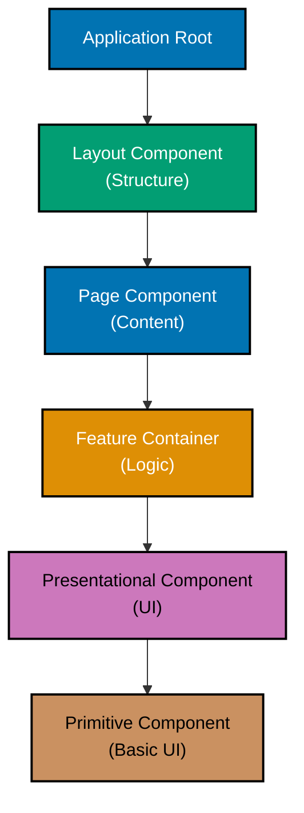
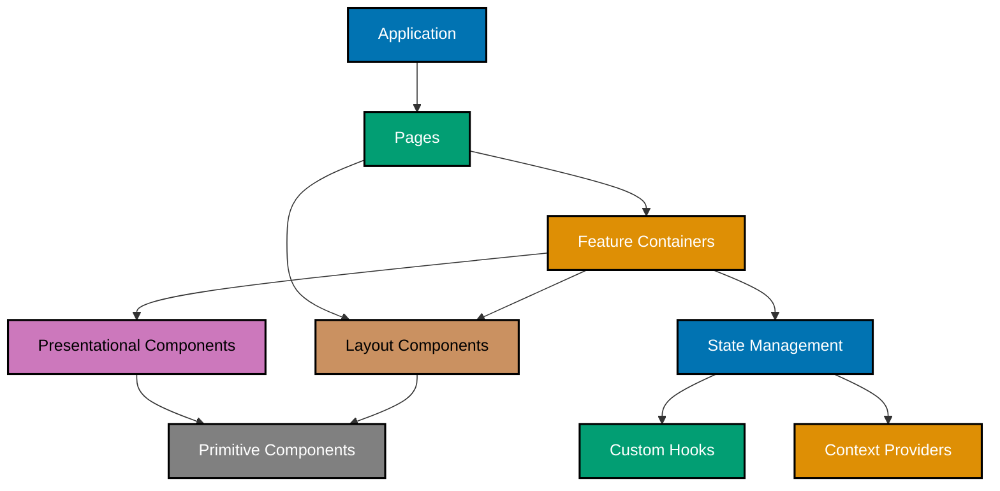

# React Component Architecture

React component architecture defines how you structure, compose, and organize components in an application. Well-designed component architecture leads to maintainable, testable, and scalable codebases.

This document explains core component concepts, design patterns, and architectural principles for building React applications, using Sharia-compliant financial components (Zakat calculators, Murabaha contracts) as practical examples.

## 📦 Component Types

React supports multiple component paradigms, each serving different purposes in your architecture.

### Presentational vs Container Components

**Presentational Components** focus on how things look:

```typescript
interface ZakatResultsDisplayProps {
  totalWealth: number;
  nisabThreshold: number;
  zakatAmount: number;
  isEligible: boolean;
}

export function ZakatResultsDisplay({
  totalWealth,
  nisabThreshold,
  zakatAmount,
  isEligible,
}: ZakatResultsDisplayProps) {
  return (
    <div className="results-card">
      <h2>Zakat Calculation Results</h2>
      <dl>
        <dt>Total Wealth</dt>
        <dd>{totalWealth.toFixed(2)}</dd>
        <dt>Nisab Threshold</dt>
        <dd>{nisabThreshold.toFixed(2)}</dd>
        <dt>Zakat Amount (2.5%)</dt>
        <dd>{zakatAmount.toFixed(2)}</dd>
      </dl>
      {isEligible ? (
        <p className="eligible">Zakat is obligatory</p>
      ) : (
        <p className="not-eligible">Below nisab threshold</p>
      )}
    </div>
  );
}
```

**Container Components** manage state and logic:

```typescript
export function ZakatCalculatorContainer() {
  const [assets, setAssets] = useState<AssetEntry[]>([]);
  const [liabilities, setLiabilities] = useState<number>(0);

  const calculation = useZakatCalculation(assets, liabilities);

  const handleAddAsset = (asset: AssetEntry) => {
    setAssets([...assets, asset]);
  };

  return (
    <div>
      <AssetEntryForm onSubmit={handleAddAsset} />
      <AssetList assets={assets} onRemove={handleRemoveAsset} />
      <ZakatResultsDisplay {...calculation} />
    </div>
  );
}
```

**Benefits**:

- Clear separation of concerns
- Presentational components highly reusable
- Container logic easier to test
- Components easier to understand

### Server vs Client Components (React Server Components)

**Server Components** render on the server:

```typescript
// app/murabaha/contracts/page.tsx (Server Component)
import { fetchContracts } from '@/lib/api';

export default async function MurabahaContractsPage() {
  // Fetches data on server, no client-side hydration needed
  const contracts = await fetchContracts();

  return (
    <div>
      <h1>Murabaha Contracts</h1>
      <ContractList contracts={contracts} />
    </div>
  );
}
```

**Client Components** run in browser:

```typescript
'use client';

import { useState } from 'react';

export function ContractFilters() {
  const [status, setStatus] = useState<string>('all');
  const [dateRange, setDateRange] = useState<DateRange | null>(null);

  return (
    <div>
      <StatusSelect value={status} onChange={setStatus} />
      <DateRangePicker value={dateRange} onChange={setDateRange} />
    </div>
  );
}
```

**When to use each**:

- **Server Components**: Data fetching, static content, SEO-critical pages
- **Client Components**: Interactivity, state management, browser APIs

### Component Composition Patterns



## 🧩 Component Composition

Component composition allows building complex UIs from simple, reusable pieces.

### Children Props Pattern

The most fundamental composition pattern:

```typescript
interface CardProps {
  children: React.ReactNode;
  title?: string;
}

export function Card({ children, title }: CardProps) {
  return (
    <div className="card">
      {title && <h3>{title}</h3>}
      <div className="card-content">{children}</div>
    </div>
  );
}

// Usage
<Card title="Zakat Summary">
  <ZakatResultsDisplay {...calculation} />
</Card>;
```

### Slot Pattern (Multiple Composition Points)

Provide multiple composition points:

```typescript
interface MurabahaContractCardProps {
  header: React.ReactNode;
  details: React.ReactNode;
  actions: React.ReactNode;
}

export function MurabahaContractCard({
  header,
  details,
  actions,
}: MurabahaContractCardProps) {
  return (
    <div className="contract-card">
      <div className="card-header">{header}</div>
      <div className="card-details">{details}</div>
      <div className="card-actions">{actions}</div>
    </div>
  );
}

// Usage
<MurabahaContractCard
  header={<ContractHeader id={contract.id} status={contract.status} />}
  details={<ContractDetails {...contract} />}
  actions={<ContractActions contractId={contract.id} />}
/>;
```

### Render Props Pattern

Pass rendering control to parent:

```typescript
interface DataFetcherProps<T> {
  url: string;
  children: (data: T | null, loading: boolean, error: Error | null) => React.ReactNode;
}

export function DataFetcher<T>({ url, children }: DataFetcherProps<T>) {
  const [data, setData] = useState<T | null>(null);
  const [loading, setLoading] = useState(true);
  const [error, setError] = useState<Error | null>(null);

  useEffect(() => {
    fetch(url)
      .then((res) => res.json())
      .then(setData)
      .catch(setError)
      .finally(() => setLoading(false));
  }, [url]);

  return <>{children(data, loading, error)}</>;
}

// Usage
<DataFetcher<Contract[]> url="/api/contracts">
  {(contracts, loading, error) => {
    if (loading) return <LoadingSpinner />;
    if (error) return <ErrorMessage error={error} />;
    return <ContractList contracts={contracts} />;
  }}
</DataFetcher>;
```

## 🎛️ Prop Design

Well-designed props create clear, maintainable component APIs.

### Interface Design Principles

**Be specific about prop types**:

```typescript
// ❌ Avoid: Generic types
interface ZakatCalculatorProps {
  data: any;
  onChange: Function;
}

// ✅ Good: Specific types
interface ZakatCalculatorProps {
  assets: AssetEntry[];
  liabilities: number;
  onAssetsChange: (assets: AssetEntry[]) => void;
  onLiabilitiesChange: (liabilities: number) => void;
}
```

**Use discriminated unions for variants**:

```typescript
type ContractStatus =
  | { type: 'draft'; savedAt: Date }
  | { type: 'active'; startDate: Date; endDate: Date }
  | { type: 'completed'; completedAt: Date; finalAmount: number }
  | { type: 'cancelled'; reason: string };

interface ContractCardProps {
  id: string;
  status: ContractStatus;
}

export function ContractCard({ id, status }: ContractCardProps) {
  switch (status.type) {
    case 'draft':
      return <DraftCard id={id} savedAt={status.savedAt} />;
    case 'active':
      return <ActiveCard id={id} dates={{ start: status.startDate, end: status.endDate }} />;
    case 'completed':
      return <CompletedCard id={id} amount={status.finalAmount} />;
    case 'cancelled':
      return <CancelledCard id={id} reason={status.reason} />;
  }
}
```

### Optional Props and Defaults

**Use optional props appropriately**:

```typescript
interface ButtonProps {
  children: React.ReactNode;
  onClick: () => void;
  variant?: 'primary' | 'secondary' | 'danger';
  size?: 'small' | 'medium' | 'large';
  disabled?: boolean;
}

export function Button({
  children,
  onClick,
  variant = 'primary',
  size = 'medium',
  disabled = false,
}: ButtonProps) {
  return (
    <button
      className={`btn btn-${variant} btn-${size}`}
      onClick={onClick}
      disabled={disabled}
    >
      {children}
    </button>
  );
}
```

### Prop Forwarding

**Forward native element props**:

```typescript
interface InputProps extends React.ComponentPropsWithoutRef<'input'> {
  label: string;
  error?: string;
}

export function Input({ label, error, ...inputProps }: InputProps) {
  return (
    <div className="input-group">
      <label>{label}</label>
      <input {...inputProps} aria-invalid={!!error} />
      {error && <span className="error">{error}</span>}
    </div>
  );
}

// Usage supports all native input props
<Input
  label="Asset Value"
  type="number"
  value={value}
  onChange={handleChange}
  placeholder="Enter amount"
  required
/>;
```

## ⚙️ Component Lifecycle with Hooks

Modern React uses hooks for lifecycle management.

### Component Mounting

```typescript
export function MurabahaContractForm() {
  // Runs once on mount
  useEffect(() => {
    console.log('Component mounted');

    // Cleanup on unmount
    return () => {
      console.log('Component unmounted');
    };
  }, []); // Empty deps = mount/unmount only

  return <form>{/* form fields */}</form>;
}
```

### Data Fetching on Mount

```typescript
export function ContractDetails({ contractId }: { contractId: string }) {
  const [contract, setContract] = useState<Contract | null>(null);
  const [loading, setLoading] = useState(true);

  useEffect(() => {
    let cancelled = false;

    async function fetchContract() {
      try {
        const data = await fetch(`/api/contracts/${contractId}`).then((r) => r.json());
        if (!cancelled) {
          setContract(data);
        }
      } finally {
        if (!cancelled) {
          setLoading(false);
        }
      }
    }

    fetchContract();

    // Cleanup: prevent state updates after unmount
    return () => {
      cancelled = true;
    };
  }, [contractId]);

  if (loading) return <LoadingSpinner />;
  if (!contract) return <ErrorMessage message="Contract not found" />;

  return <div>{/* render contract */}</div>;
}
```

### Component Updates

```typescript
export function ZakatCalculator() {
  const [assets, setAssets] = useState<AssetEntry[]>([]);
  const [result, setResult] = useState<ZakatResult | null>(null);

  // Runs on every assets change
  useEffect(() => {
    const calculated = calculateZakat(assets);
    setResult(calculated);
  }, [assets]); // Re-run when assets change

  return <div>{/* UI */}</div>;
}
```

### Cleanup and Subscriptions

```typescript
export function LivePriceDisplay({ symbol }: { symbol: string }) {
  const [price, setPrice] = useState<number | null>(null);

  useEffect(() => {
    // Subscribe to WebSocket
    const ws = new WebSocket(`wss://api.example.com/prices/${symbol}`);

    ws.onmessage = (event) => {
      setPrice(JSON.parse(event.data).price);
    };

    // Cleanup: close WebSocket on unmount
    return () => {
      ws.close();
    };
  }, [symbol]);

  return <div>Current price: {price}</div>;
}
```

## 📍 State Co-location

Place state as close as possible to where it's used.

### Local State (Component-Level)

```typescript
export function AssetEntryForm({ onSubmit }: { onSubmit: (asset: AssetEntry) => void }) {
  // State used only in this component
  const [name, setName] = useState('');
  const [value, setValue] = useState(0);
  const [type, setType] = useState<AssetType>('cash');

  const handleSubmit = (e: React.FormEvent) => {
    e.preventDefault();
    onSubmit({ name, value, type });
    // Reset local state
    setName('');
    setValue(0);
  };

  return <form onSubmit={handleSubmit}>{/* form fields */}</form>;
}
```

### Lifted State (Shared Between Siblings)

```typescript
export function ZakatCalculatorContainer() {
  // State shared between AssetList and ResultsDisplay
  const [assets, setAssets] = useState<AssetEntry[]>([]);

  return (
    <div>
      <AssetEntryForm onSubmit={(asset) => setAssets([...assets, asset])} />
      <AssetList assets={assets} />
      <ZakatResultsDisplay assets={assets} />
    </div>
  );
}
```

### Global State (Application-Wide)

```typescript
// Using Context for global state
const UserContext = createContext<User | null>(null);

export function UserProvider({ children }: { children: React.ReactNode }) {
  const [user, setUser] = useState<User | null>(null);

  return <UserContext.Provider value={user}>{children}</UserContext.Provider>;
}

// Any component can access user
export function UserProfile() {
  const user = useContext(UserContext);
  return <div>{user?.name}</div>;
}
```

**State co-location principle**: Start with local state, lift only when necessary.

## 🎨 Component Patterns

Advanced patterns for complex scenarios.

### Compound Components

Components that work together with shared state:

```typescript
interface TabsContextValue {
  activeTab: string;
  setActiveTab: (tab: string) => void;
}

const TabsContext = createContext<TabsContextValue | null>(null);

export function Tabs({ children, defaultTab }: { children: React.ReactNode; defaultTab: string }) {
  const [activeTab, setActiveTab] = useState(defaultTab);

  return (
    <TabsContext.Provider value={{ activeTab, setActiveTab }}>
      <div className="tabs">{children}</div>
    </TabsContext.Provider>
  );
}

export function TabList({ children }: { children: React.ReactNode }) {
  return <div className="tab-list">{children}</div>;
}

export function Tab({ id, children }: { id: string; children: React.ReactNode }) {
  const context = useContext(TabsContext);
  if (!context) throw new Error('Tab must be used within Tabs');

  return (
    <button
      className={context.activeTab === id ? 'active' : ''}
      onClick={() => context.setActiveTab(id)}
    >
      {children}
    </button>
  );
}

export function TabPanel({ id, children }: { id: string; children: React.ReactNode }) {
  const context = useContext(TabsContext);
  if (!context) throw new Error('TabPanel must be used within Tabs');

  return context.activeTab === id ? <div className="tab-panel">{children}</div> : null;
}

// Usage
<Tabs defaultTab="assets">
  <TabList>
    <Tab id="assets">Assets</Tab>
    <Tab id="liabilities">Liabilities</Tab>
    <Tab id="results">Results</Tab>
  </TabList>

  <TabPanel id="assets">
    <AssetsList />
  </TabPanel>
  <TabPanel id="liabilities">
    <LiabilitiesList />
  </TabPanel>
  <TabPanel id="results">
    <ZakatResults />
  </TabPanel>
</Tabs>;
```

### Higher-Order Components (HOCs)

Wrap components to add behavior:

```typescript
export function withAuthentication<P extends object>(
  Component: React.ComponentType<P>
): React.ComponentType<P> {
  return function AuthenticatedComponent(props: P) {
    const user = useAuth();

    if (!user) {
      return <Redirect to="/login" />;
    }

    return <Component {...props} />;
  };
}

// Usage
const ProtectedDashboard = withAuthentication(Dashboard);
```

### Custom Hooks for Logic Reuse

Extract component logic into reusable hooks:

```typescript
export function useZakatCalculation(assets: AssetEntry[], liabilities: number) {
  const [result, setResult] = useState<ZakatResult | null>(null);

  useEffect(() => {
    const totalAssets = assets.reduce((sum, asset) => sum + asset.value, 0);
    const netWealth = totalAssets - liabilities;
    const nisab = getNisabThreshold(); // Fetch from API or config

    const isEligible = netWealth >= nisab;
    const zakatAmount = isEligible ? netWealth * 0.025 : 0;

    setResult({
      totalAssets,
      totalLiabilities: liabilities,
      netWealth,
      nisab,
      isEligible,
      zakatAmount,
    });
  }, [assets, liabilities]);

  return result;
}

// Usage in multiple components
export function ZakatCalculator() {
  const [assets, setAssets] = useState<AssetEntry[]>([]);
  const [liabilities, setLiabilities] = useState(0);

  const calculation = useZakatCalculation(assets, liabilities);

  return <ZakatResultsDisplay {...calculation} />;
}
```

## 📐 Layout Components

Layout components provide UI structure without domain logic.

### Container Component

```typescript
export function Container({ children, maxWidth = 'lg' }: { children: React.ReactNode; maxWidth?: 'sm' | 'md' | 'lg' | 'xl' }) {
  return <div className={`container container-${maxWidth}`}>{children}</div>;
}
```

### Grid Layout

```typescript
interface GridProps {
  children: React.ReactNode;
  columns?: number;
  gap?: number;
}

export function Grid({ children, columns = 3, gap = 4 }: GridProps) {
  return (
    <div
      style={{
        display: 'grid',
        gridTemplateColumns: `repeat(${columns}, 1fr)`,
        gap: `${gap * 0.25}rem`,
      }}
    >
      {children}
    </div>
  );
}

// Usage
<Grid columns={2} gap={6}>
  <AssetCard />
  <LiabilityCard />
  <ZakatResultCard />
</Grid>;
```

### Stack Layout

```typescript
export function Stack({
  children,
  direction = 'vertical',
  spacing = 4,
}: {
  children: React.ReactNode;
  direction?: 'vertical' | 'horizontal';
  spacing?: number;
}) {
  return (
    <div
      style={{
        display: 'flex',
        flexDirection: direction === 'vertical' ? 'column' : 'row',
        gap: `${spacing * 0.25}rem`,
      }}
    >
      {children}
    </div>
  );
}
```

## 🔤 TypeScript Patterns

TypeScript enhances component type safety.

### Generic Components

```typescript
interface SelectProps<T> {
  options: T[];
  value: T;
  onChange: (value: T) => void;
  getLabel: (option: T) => string;
  getValue: (option: T) => string;
}

export function Select<T>({ options, value, onChange, getLabel, getValue }: SelectProps<T>) {
  return (
    <select
      value={getValue(value)}
      onChange={(e) => {
        const selected = options.find((opt) => getValue(opt) === e.target.value);
        if (selected) onChange(selected);
      }}
    >
      {options.map((option) => (
        <option key={getValue(option)} value={getValue(option)}>
          {getLabel(option)}
        </option>
      ))}
    </select>
  );
}

// Type-safe usage
<Select<AssetType>
  options={['cash', 'gold', 'property', 'stock']}
  value={assetType}
  onChange={setAssetType}
  getLabel={(t) => t.toUpperCase()}
  getValue={(t) => t}
/>;
```

### Type Guards

```typescript
interface BaseContract {
  id: string;
  type: 'murabaha' | 'ijara' | 'mudaraba';
}

interface MurabahaContract extends BaseContract {
  type: 'murabaha';
  costPrice: number;
  profitMargin: number;
}

interface IjaraContract extends BaseContract {
  type: 'ijara';
  monthlyRent: number;
  duration: number;
}

function isMurabaha(contract: BaseContract): contract is MurabahaContract {
  return contract.type === 'murabaha';
}

function isIjara(contract: BaseContract): contract is IjaraContract {
  return contract.type === 'ijara';
}

export function ContractCard({ contract }: { contract: BaseContract }) {
  if (isMurabaha(contract)) {
    // TypeScript knows contract is MurabahaContract
    return <MurabahaCard costPrice={contract.costPrice} profitMargin={contract.profitMargin} />;
  }

  if (isIjara(contract)) {
    // TypeScript knows contract is IjaraContract
    return <IjaraCard monthlyRent={contract.monthlyRent} duration={contract.duration} />;
  }

  return <GenericContractCard contract={contract} />;
}
```

### Utility Types

```typescript
// Pick specific props
type ButtonBaseProps = Pick<React.ComponentPropsWithoutRef<"button">, "onClick" | "disabled" | "type">;

// Omit specific props
type InputWithoutValue = Omit<React.ComponentPropsWithoutRef<"input">, "value" | "onChange">;

// Partial props for optional overrides
interface ThemeConfig {
  primaryColor: string;
  secondaryColor: string;
  fontSize: number;
}

interface ThemedComponentProps {
  themeOverrides?: Partial<ThemeConfig>;
}
```

## 🧪 Component Testing

Testing strategies for components.

### Unit Tests (Component in Isolation)

```typescript
import { render, screen } from '@testing-library/react';
import { ZakatResultsDisplay } from './ZakatResultsDisplay';

describe('ZakatResultsDisplay', () => {
  it('displays eligible status when wealth exceeds nisab', () => {
    render(
      <ZakatResultsDisplay
        totalWealth={10000}
        nisabThreshold={5000}
        zakatAmount={250}
        isEligible={true}
      />
    );

    expect(screen.getByText(/zakat is obligatory/i)).toBeInTheDocument();
    expect(screen.getByText(/250/)).toBeInTheDocument();
  });

  it('displays not eligible status when wealth below nisab', () => {
    render(
      <ZakatResultsDisplay
        totalWealth={3000}
        nisabThreshold={5000}
        zakatAmount={0}
        isEligible={false}
      />
    );

    expect(screen.getByText(/below nisab threshold/i)).toBeInTheDocument();
  });
});
```

### Integration Tests (Component with Dependencies)

```typescript
import { render, screen, fireEvent, waitFor } from '@testing-library/react';
import { ZakatCalculatorContainer } from './ZakatCalculatorContainer';

describe('ZakatCalculatorContainer', () => {
  it('calculates zakat when assets are added', async () => {
    render(<ZakatCalculatorContainer />);

    // Add asset
    fireEvent.change(screen.getByLabelText(/asset name/i), {
      target: { value: 'Savings Account' },
    });
    fireEvent.change(screen.getByLabelText(/asset value/i), {
      target: { value: '10000' },
    });
    fireEvent.click(screen.getByRole('button', { name: /add asset/i }));

    // Check results
    await waitFor(() => {
      expect(screen.getByText(/zakat amount/i)).toBeInTheDocument();
      expect(screen.getByText(/250/)).toBeInTheDocument();
    });
  });
});
```

### Testing Custom Hooks

```typescript
import { renderHook } from "@testing-library/react";
import { useZakatCalculation } from "./useZakatCalculation";

describe("useZakatCalculation", () => {
  it("calculates zakat correctly", () => {
    const assets = [
      { name: "Cash", value: 5000, type: "cash" as const },
      { name: "Gold", value: 3000, type: "gold" as const },
    ];

    const { result } = renderHook(() => useZakatCalculation(assets, 1000));

    expect(result.current?.netWealth).toBe(7000);
    expect(result.current?.zakatAmount).toBe(175); // 7000 * 0.025
  });
});
```

## ⚡ Performance Considerations

Optimize component performance for better user experience.

### React.memo (Prevent Unnecessary Re-renders)

```typescript
interface ExpensiveChartProps {
  data: ChartDataPoint[];
}

// Component re-renders only when data changes
export const ExpensiveChart = React.memo(function ExpensiveChart({ data }: ExpensiveChartProps) {
  // Complex rendering logic
  return <canvas>{/* render chart */}</canvas>;
});
```

### useMemo (Memoize Expensive Computations)

```typescript
export function ContractDashboard({ contracts }: { contracts: Contract[] }) {
  // Only recalculate when contracts change
  const statistics = useMemo(() => {
    return {
      totalActive: contracts.filter((c) => c.status === 'active').length,
      totalValue: contracts.reduce((sum, c) => sum + c.value, 0),
      averageValue: contracts.length > 0 ? contracts.reduce((sum, c) => sum + c.value, 0) / contracts.length : 0,
    };
  }, [contracts]);

  return (
    <div>
      <StatCard label="Active Contracts" value={statistics.totalActive} />
      <StatCard label="Total Value" value={statistics.totalValue} />
      <StatCard label="Average Value" value={statistics.averageValue} />
    </div>
  );
}
```

### useCallback (Memoize Functions)

```typescript
export function ContractList({ contracts }: { contracts: Contract[] }) {
  const [selectedId, setSelectedId] = useState<string | null>(null);

  // Function reference stays stable across re-renders
  const handleSelect = useCallback(
    (id: string) => {
      setSelectedId(id);
    },
    [] // No dependencies = function never changes
  );

  return (
    <div>
      {contracts.map((contract) => (
        <ContractCard key={contract.id} contract={contract} onSelect={handleSelect} />
      ))}
    </div>
  );
}
```

### Code Splitting (Lazy Loading)

```typescript
import { lazy, Suspense } from 'react';

// Component loaded only when needed
const HeavyReportComponent = lazy(() => import('./HeavyReportComponent'));

export function DashboardPage() {
  const [showReport, setShowReport] = useState(false);

  return (
    <div>
      <button onClick={() => setShowReport(true)}>Load Report</button>

      {showReport && (
        <Suspense fallback={<LoadingSpinner />}>
          <HeavyReportComponent />
        </Suspense>
      )}
    </div>
  );
}
```

### Virtualization (Large Lists)

```typescript
import { FixedSizeList } from 'react-window';

interface ContractListProps {
  contracts: Contract[];
}

export function VirtualizedContractList({ contracts }: ContractListProps) {
  const Row = ({ index, style }: { index: number; style: React.CSSProperties }) => (
    <div style={style}>
      <ContractCard contract={contracts[index]} />
    </div>
  );

  return (
    <FixedSizeList
      height={600}
      itemCount={contracts.length}
      itemSize={120}
      width="100%"
    >
      {Row}
    </FixedSizeList>
  );
}
```

## 🏗️ Component Architecture Diagram



## 📚 References

- [React Documentation](https://react.dev/) - Official React documentation
- [React TypeScript Cheatsheet](https://react-typescript-cheatsheet.netlify.app/) - TypeScript patterns for React
- [Testing Library](https://testing-library.com/react) - Component testing best practices
- [Patterns.dev](https://www.patterns.dev/) - Modern React design patterns

**Related Documentation**:

- [Accessibility First Principle](../../../../governance/principles/content/accessibility-first.md) - Foundational accessibility requirements
- [Functional Programming Convention](../../../../governance/development/pattern/functional-programming.md) - Functional patterns in React

---

This document provides comprehensive guidance on React component architecture. Apply these patterns and principles to build maintainable, testable, and scalable React applications for Sharia-compliant enterprise systems.
