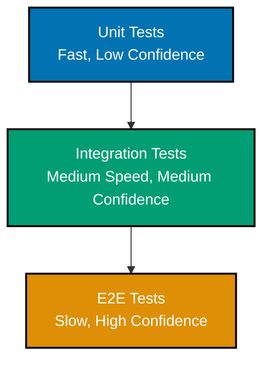
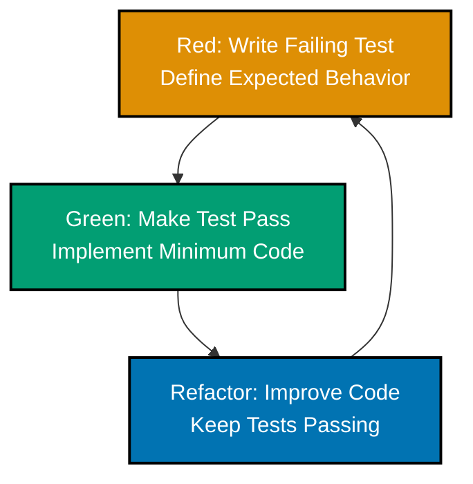

# React Testing

This document provides comprehensive guidance on testing React applications, covering testing strategies, tools, and best practices for building reliable, maintainable test suites.

## 🎯 Testing Strategy

### Testing Pyramid

The testing pyramid guides test distribution for optimal coverage and feedback speed.



**Test Distribution Guidelines:**

- **70%** - Unit tests (functions, hooks, utilities)
- **20%** - Integration tests (component interactions)
- **10%** - E2E tests (critical user journeys)

### What to Test

**High Priority:**

- User interactions and workflows
- Critical business logic (Zakat calculations, Murabaha terms)
- Error handling and edge cases
- Accessibility features (keyboard navigation, ARIA attributes)
- Data transformations and validations

**Low Priority:**

- Implementation details (internal state, private methods)
- Third-party library behavior
- Static content rendering
- Trivial getters/setters

**Never Test:**

- React internals
- External libraries (already tested by maintainers)
- Auto-generated code

## ⚙️ Vitest Setup

### Installation

```bash
npm install -D vitest @vitest/ui jsdom
npm install -D @testing-library/react @testing-library/jest-dom
npm install -D @testing-library/user-event
```

### Configuration

Create `vitest.config.ts`:

```typescript
import { defineConfig } from "vitest/config";
import react from "@vitejs/plugin-react";
import path from "path";

export default defineConfig({
  plugins: [react()],
  test: {
    globals: true,
    environment: "jsdom",
    setupFiles: ["./src/test/setup.ts"],
    coverage: {
      provider: "v8",
      reporter: ["text", "json", "html"],
      exclude: ["node_modules/", "src/test/", "**/*.d.ts", "**/*.config.*", "**/mockData/"],
      thresholds: {
        lines: 80,
        functions: 80,
        branches: 80,
        statements: 80,
      },
    },
  },
  resolve: {
    alias: {
      "@": path.resolve(__dirname, "./src"),
    },
  },
});
```

### TypeScript Integration

Add to `tsconfig.json`:

```json
{
  "compilerOptions": {
    "types": ["vitest/globals", "@testing-library/jest-dom"]
  }
}
```

### Test Setup File

Create `src/test/setup.ts`:

```typescript
import "@testing-library/jest-dom";
import { cleanup } from "@testing-library/react";
import { afterEach } from "vitest";

// Cleanup after each test
afterEach(() => {
  cleanup();
});

// Mock window.matchMedia
Object.defineProperty(window, "matchMedia", {
  writable: true,
  value: vi.fn().mockImplementation((query) => ({
    matches: false,
    media: query,
    onchange: null,
    addListener: vi.fn(),
    removeListener: vi.fn(),
    addEventListener: vi.fn(),
    removeEventListener: vi.fn(),
    dispatchEvent: vi.fn(),
  })),
});

// Mock IntersectionObserver
global.IntersectionObserver = class IntersectionObserver {
  constructor() {}
  disconnect() {}
  observe() {}
  takeRecords() {
    return [];
  }
  unobserve() {}
} as any;
```

## 🧪 React Testing Library

### Core Philosophy

React Testing Library encourages testing components the way users interact with them.

**Guiding Principles:**

- Test behavior, not implementation
- Query by accessibility roles, labels, and text (not test IDs)
- Avoid testing internal state
- Use userEvent for realistic interactions

### Rendering Components

```typescript
import { render, screen } from '@testing-library/react';
import { describe, it, expect } from 'vitest';
import { ZakatCalculator } from './ZakatCalculator';

describe('ZakatCalculator', () => {
  it('renders calculator form', () => {
    render(<ZakatCalculator />);

    expect(screen.getByRole('heading', { name: /zakat calculator/i })).toBeInTheDocument();
    expect(screen.getByLabelText(/total assets/i)).toBeInTheDocument();
    expect(screen.getByRole('button', { name: /calculate/i })).toBeInTheDocument();
  });
});
```

### Query Priority

Use queries in this order:

1. **Accessible to everyone** (preferred):

- `getByRole` - Buttons, inputs, headings
- `getByLabelText` - Form fields
- `getByPlaceholderText` - Inputs with placeholders
- `getByText` - Non-interactive text
- `getByDisplayValue` - Form inputs with values

1. **Semantic queries**:

- `getByAltText` - Images
- `getByTitle` - Elements with title attribute

1. **Test IDs** (last resort):

- `getByTestId` - Use only when accessibility queries fail

```typescript
// ✅ Good - Accessible query
const button = screen.getByRole("button", { name: /submit/i });

// ❌ Avoid - Test ID
const button = screen.getByTestId("submit-button");
```

## 🧩 Unit Testing

### Testing Pure Functions

```typescript
import { describe, it, expect } from "vitest";
import { calculateZakat, isNisabMet } from "./zakatFormulas";

describe("zakatFormulas", () => {
  describe("calculateZakat", () => {
    it("calculates 2.5% of wealth above nisab", () => {
      const wealth = 100000;
      const nisab = 85000;

      const result = calculateZakat(wealth, nisab);

      expect(result).toBe(2500); // 2.5% of 100000
    });

    it("returns 0 when wealth is below nisab", () => {
      const wealth = 50000;
      const nisab = 85000;

      const result = calculateZakat(wealth, nisab);

      expect(result).toBe(0);
    });

    it("handles zero wealth", () => {
      expect(calculateZakat(0, 85000)).toBe(0);
    });

    it("handles negative wealth gracefully", () => {
      expect(() => calculateZakat(-1000, 85000)).toThrow("Wealth cannot be negative");
    });
  });

  describe("isNisabMet", () => {
    it("returns true when wealth meets nisab", () => {
      expect(isNisabMet(85000, 85000)).toBe(true);
      expect(isNisabMet(100000, 85000)).toBe(true);
    });

    it("returns false when wealth is below nisab", () => {
      expect(isNisabMet(50000, 85000)).toBe(false);
    });
  });
});
```

### Testing Custom Hooks

```typescript
import { renderHook, waitFor } from "@testing-library/react";
import { describe, it, expect, vi } from "vitest";
import { useZakatCalculation } from "./useZakatCalculation";

describe("useZakatCalculation", () => {
  it("calculates zakat based on input values", () => {
    const { result } = renderHook(() => useZakatCalculation());

    // Initial state
    expect(result.current.zakatAmount).toBe(0);
    expect(result.current.isCalculating).toBe(false);

    // Trigger calculation
    result.current.calculate(100000, 85000);

    expect(result.current.zakatAmount).toBe(2500);
  });

  it("handles async calculations", async () => {
    const { result } = renderHook(() => useZakatCalculation());

    result.current.calculateAsync(100000, 85000);

    expect(result.current.isCalculating).toBe(true);

    await waitFor(() => {
      expect(result.current.isCalculating).toBe(false);
    });

    expect(result.current.zakatAmount).toBe(2500);
  });

  it("updates when dependencies change", () => {
    const { result, rerender } = renderHook(({ wealth, nisab }) => useZakatCalculation(wealth, nisab), {
      initialProps: { wealth: 100000, nisab: 85000 },
    });

    expect(result.current.zakatAmount).toBe(2500);

    // Update props
    rerender({ wealth: 200000, nisab: 85000 });

    expect(result.current.zakatAmount).toBe(5000);
  });
});
```

### Testing Utilities

```typescript
import { describe, it, expect } from "vitest";
import { formatCurrency, parseHijriDate } from "./formatters";

describe("formatters", () => {
  describe("formatCurrency", () => {
    it("formats numbers as currency", () => {
      expect(formatCurrency(1234.56)).toBe("$1,234.56");
      expect(formatCurrency(0)).toBe("$0.00");
      expect(formatCurrency(1000000)).toBe("$1,000,000.00");
    });

    it("handles different locales", () => {
      expect(formatCurrency(1234.56, "id-ID", "IDR")).toBe("Rp1.234,56");
    });
  });

  describe("parseHijriDate", () => {
    it("parses Hijri date strings", () => {
      const result = parseHijriDate("1446-07-15");

      expect(result.year).toBe(1446);
      expect(result.month).toBe(7);
      expect(result.day).toBe(15);
    });

    it("throws error for invalid dates", () => {
      expect(() => parseHijriDate("invalid")).toThrow("Invalid Hijri date format");
    });
  });
});
```

## 🎨 Component Testing

### Basic Component Tests

```typescript
import { render, screen } from '@testing-library/react';
import userEvent from '@testing-library/user-event';
import { describe, it, expect, vi } from 'vitest';
import { DonationForm } from './DonationForm';

describe('DonationForm', () => {
  it('renders all form fields', () => {
    render(<DonationForm onSubmit={vi.fn()} />);

    expect(screen.getByLabelText(/amount/i)).toBeInTheDocument();
    expect(screen.getByLabelText(/recipient/i)).toBeInTheDocument();
    expect(screen.getByRole('button', { name: /donate/i })).toBeInTheDocument();
  });

  it('validates required fields', async () => {
    const user = userEvent.setup();
    const onSubmit = vi.fn();

    render(<DonationForm onSubmit={onSubmit} />);

    // Submit without filling fields
    await user.click(screen.getByRole('button', { name: /donate/i }));

    expect(screen.getByText(/amount is required/i)).toBeInTheDocument();
    expect(onSubmit).not.toHaveBeenCalled();
  });

  it('submits valid form data', async () => {
    const user = userEvent.setup();
    const onSubmit = vi.fn();

    render(<DonationForm onSubmit={onSubmit} />);

    // Fill form
    await user.type(screen.getByLabelText(/amount/i), '1000');
    await user.selectOptions(screen.getByLabelText(/recipient/i), 'orphanage');

    // Submit
    await user.click(screen.getByRole('button', { name: /donate/i }));

    expect(onSubmit).toHaveBeenCalledWith({
      amount: 1000,
      recipient: 'orphanage',
    });
  });
});
```

### Testing User Interactions

```typescript
import { render, screen } from '@testing-library/react';
import userEvent from '@testing-library/user-event';
import { describe, it, expect } from 'vitest';
import { MurabahaCalculator } from './MurabahaCalculator';

describe('MurabahaCalculator - User Interactions', () => {
  it('updates profit calculation when inputs change', async () => {
    const user = userEvent.setup();

    render(<MurabahaCalculator />);

    const costInput = screen.getByLabelText(/cost price/i);
    const profitInput = screen.getByLabelText(/profit margin/i);

    // Enter cost price
    await user.clear(costInput);
    await user.type(costInput, '100000');

    // Enter profit margin
    await user.clear(profitInput);
    await user.type(profitInput, '10');

    // Verify calculated selling price
    expect(screen.getByText(/selling price: 110,000/i)).toBeInTheDocument();
  });

  it('handles keyboard navigation', async () => {
    const user = userEvent.setup();

    render(<MurabahaCalculator />);

    // Tab through form
    await user.tab();
    expect(screen.getByLabelText(/cost price/i)).toHaveFocus();

    await user.tab();
    expect(screen.getByLabelText(/profit margin/i)).toHaveFocus();

    await user.tab();
    expect(screen.getByRole('button', { name: /calculate/i })).toHaveFocus();
  });

  it('shows validation errors on blur', async () => {
    const user = userEvent.setup();

    render(<MurabahaCalculator />);

    const costInput = screen.getByLabelText(/cost price/i);

    // Focus and blur without entering value
    await user.click(costInput);
    await user.tab();

    expect(screen.getByText(/cost price is required/i)).toBeInTheDocument();
  });
});
```

### Testing Conditional Rendering

```typescript
import { render, screen } from '@testing-library/react';
import userEvent from '@testing-library/user-event';
import { describe, it, expect } from 'vitest';
import { ZakatSummary } from './ZakatSummary';

describe('ZakatSummary - Conditional Rendering', () => {
  it('shows loading state', () => {
    render(<ZakatSummary isLoading={true} zakatAmount={null} />);

    expect(screen.getByRole('status')).toBeInTheDocument();
    expect(screen.getByText(/calculating/i)).toBeInTheDocument();
  });

  it('shows error state', () => {
    const error = 'Failed to calculate zakat';

    render(<ZakatSummary isLoading={false} error={error} zakatAmount={null} />);

    expect(screen.getByRole('alert')).toBeInTheDocument();
    expect(screen.getByText(error)).toBeInTheDocument();
  });

  it('shows success state with amount', () => {
    render(<ZakatSummary isLoading={false} zakatAmount={2500} error={null} />);

    expect(screen.getByText(/your zakat: 2,500/i)).toBeInTheDocument();
    expect(screen.queryByRole('status')).not.toBeInTheDocument();
    expect(screen.queryByRole('alert')).not.toBeInTheDocument();
  });

  it('shows nisab not met message', () => {
    render(<ZakatSummary isLoading={false} zakatAmount={0} error={null} />);

    expect(screen.getByText(/wealth is below nisab threshold/i)).toBeInTheDocument();
  });
});
```

## 🔗 Integration Testing

### Testing Component Composition

```typescript
import { render, screen, waitFor } from '@testing-library/react';
import userEvent from '@testing-library/user-event';
import { describe, it, expect, vi } from 'vitest';
import { ZakatCalculatorPage } from './ZakatCalculatorPage';

describe('ZakatCalculatorPage - Integration', () => {
  it('completes full calculation workflow', async () => {
    const user = userEvent.setup();

    render(<ZakatCalculatorPage />);

    // Step 1: Enter assets
    await user.type(screen.getByLabelText(/cash/i), '50000');
    await user.type(screen.getByLabelText(/gold/i), '30000');
    await user.type(screen.getByLabelText(/investments/i), '20000');

    // Step 2: Enter liabilities
    await user.type(screen.getByLabelText(/debts/i), '5000');

    // Step 3: Calculate
    await user.click(screen.getByRole('button', { name: /calculate zakat/i }));

    // Verify calculation
    await waitFor(() => {
      expect(screen.getByText(/total assets: 100,000/i)).toBeInTheDocument();
      expect(screen.getByText(/total liabilities: 5,000/i)).toBeInTheDocument();
      expect(screen.getByText(/net wealth: 95,000/i)).toBeInTheDocument();
      expect(screen.getByText(/your zakat: 2,375/i)).toBeInTheDocument();
    });
  });

  it('handles form reset', async () => {
    const user = userEvent.setup();

    render(<ZakatCalculatorPage />);

    // Fill form
    await user.type(screen.getByLabelText(/cash/i), '50000');
    await user.click(screen.getByRole('button', { name: /calculate/i }));

    // Verify result shown
    expect(screen.getByText(/your zakat/i)).toBeInTheDocument();

    // Reset
    await user.click(screen.getByRole('button', { name: /reset/i }));

    // Verify form cleared
    expect(screen.getByLabelText(/cash/i)).toHaveValue('');
    expect(screen.queryByText(/your zakat/i)).not.toBeInTheDocument();
  });
});
```

### Testing Data Flow

```typescript
import { render, screen, waitFor } from '@testing-library/react';
import userEvent from '@testing-library/user-event';
import { describe, it, expect } from 'vitest';
import { QueryClient, QueryClientProvider } from '@tanstack/react-query';
import { ContractList } from './ContractList';

describe('ContractList - Data Flow', () => {
  const createWrapper = () => {
    const queryClient = new QueryClient({
      defaultOptions: {
        queries: { retry: false },
      },
    });

    return ({ children }: { children: React.ReactNode }) => (
      <QueryClientProvider client={queryClient}>
        {children}
      </QueryClientProvider>
    );
  };

  it('fetches and displays contracts', async () => {
    render(<ContractList />, { wrapper: createWrapper() });

    // Verify loading state
    expect(screen.getByRole('status')).toBeInTheDocument();

    // Wait for data
    await waitFor(() => {
      expect(screen.getByText(/murabaha contract #1001/i)).toBeInTheDocument();
      expect(screen.getByText(/murabaha contract #1002/i)).toBeInTheDocument();
    });
  });

  it('handles pagination', async () => {
    const user = userEvent.setup();

    render(<ContractList />, { wrapper: createWrapper() });

    // Wait for initial page
    await waitFor(() => {
      expect(screen.getByText(/page 1 of 3/i)).toBeInTheDocument();
    });

    // Navigate to next page
    await user.click(screen.getByRole('button', { name: /next page/i }));

    await waitFor(() => {
      expect(screen.getByText(/page 2 of 3/i)).toBeInTheDocument();
    });
  });
});
```

## 🌐 E2E Testing

### Playwright Setup

```bash
npm install -D @playwright/test
npx playwright install
```

Create `playwright.config.ts`:

```typescript
import { defineConfig, devices } from "@playwright/test";

export default defineConfig({
  testDir: "./e2e",
  fullyParallel: true,
  forbidOnly: !!process.env.CI,
  retries: process.env.CI ? 2 : 0,
  workers: process.env.CI ? 1 : undefined,
  reporter: "html",
  use: {
    baseURL: "http://localhost:3000",
    trace: "on-first-retry",
  },
  projects: [
    {
      name: "chromium",
      use: { ...devices["Desktop Chrome"] },
    },
    {
      name: "firefox",
      use: { ...devices["Desktop Firefox"] },
    },
    {
      name: "webkit",
      use: { ...devices["Desktop Safari"] },
    },
  ],
  webServer: {
    command: "npm run dev",
    url: "http://localhost:3000",
    reuseExistingServer: !process.env.CI,
  },
});
```

### E2E Test Examples

```typescript
import { test, expect } from "@playwright/test";

test.describe("Zakat Calculator E2E", () => {
  test("complete zakat calculation flow", async ({ page }) => {
    // Navigate to calculator
    await page.goto("/zakat-calculator");

    // Verify page loaded
    await expect(page.getByRole("heading", { name: /zakat calculator/i })).toBeVisible();

    // Fill form
    await page.getByLabel(/cash/i).fill("50000");
    await page.getByLabel(/gold/i).fill("30000");
    await page.getByLabel(/investments/i).fill("20000");
    await page.getByLabel(/debts/i).fill("5000");

    // Submit
    await page.getByRole("button", { name: /calculate zakat/i }).click();

    // Verify results
    await expect(page.getByText(/your zakat: 2,375/i)).toBeVisible();

    // Verify can download report
    const downloadPromise = page.waitForEvent("download");
    await page.getByRole("button", { name: /download report/i }).click();
    const download = await downloadPromise;
    expect(download.suggestedFilename()).toContain("zakat-report");
  });

  test("validates form inputs", async ({ page }) => {
    await page.goto("/zakat-calculator");

    // Try to submit empty form
    await page.getByRole("button", { name: /calculate/i }).click();

    // Verify validation errors
    await expect(page.getByText(/cash is required/i)).toBeVisible();
  });

  test("persists data on page reload", async ({ page }) => {
    await page.goto("/zakat-calculator");

    // Fill form
    await page.getByLabel(/cash/i).fill("50000");

    // Reload page
    await page.reload();

    // Verify data persisted
    await expect(page.getByLabel(/cash/i)).toHaveValue("50000");
  });
});
```

### Cross-Browser Testing

```typescript
import { test, expect, devices } from "@playwright/test";

test.describe("Mobile Responsive", () => {
  test.use({ ...devices["iPhone 13"] });

  test("zakat calculator on mobile", async ({ page }) => {
    await page.goto("/zakat-calculator");

    // Verify mobile layout
    await expect(page.locator(".mobile-menu")).toBeVisible();

    // Fill form using mobile interactions
    await page.getByLabel(/cash/i).tap();
    await page.keyboard.type("50000");

    // Verify results
    await page.getByRole("button", { name: /calculate/i }).tap();
    await expect(page.getByText(/your zakat/i)).toBeVisible();
  });
});
```

## 🎣 Custom Hooks Testing

### Testing Hooks with @testing-library/react

```typescript
import { renderHook, waitFor } from "@testing-library/react";
import { describe, it, expect, vi } from "vitest";
import { useContractValidation } from "./useContractValidation";

describe("useContractValidation", () => {
  it("validates contract data", () => {
    const { result } = renderHook(() => useContractValidation());

    const validContract = {
      costPrice: 100000,
      profitMargin: 10,
      term: 12,
    };

    const errors = result.current.validate(validContract);

    expect(errors).toEqual({});
  });

  it("returns errors for invalid data", () => {
    const { result } = renderHook(() => useContractValidation());

    const invalidContract = {
      costPrice: -100,
      profitMargin: 150,
      term: 0,
    };

    const errors = result.current.validate(invalidContract);

    expect(errors.costPrice).toBe("Cost price must be positive");
    expect(errors.profitMargin).toBe("Profit margin cannot exceed 100%");
    expect(errors.term).toBe("Term must be at least 1 month");
  });

  it("handles async validation", async () => {
    const { result } = renderHook(() => useContractValidation());

    const contract = {
      costPrice: 100000,
      profitMargin: 10,
      term: 12,
    };

    result.current.validateAsync(contract);

    expect(result.current.isValidating).toBe(true);

    await waitFor(() => {
      expect(result.current.isValidating).toBe(false);
    });

    expect(result.current.errors).toEqual({});
  });
});
```

### Testing Hooks with Context

```typescript
import { renderHook } from '@testing-library/react';
import { describe, it, expect } from 'vitest';
import { AuthProvider } from './AuthContext';
import { useAuth } from './useAuth';

describe('useAuth', () => {
  const wrapper = ({ children }: { children: React.ReactNode }) => (
    <AuthProvider>{children}</AuthProvider>
  );

  it('provides authentication state', () => {
    const { result } = renderHook(() => useAuth(), { wrapper });

    expect(result.current.user).toBeNull();
    expect(result.current.isAuthenticated).toBe(false);
  });

  it('updates authentication state on login', async () => {
    const { result } = renderHook(() => useAuth(), { wrapper });

    await result.current.login('user@example.com', 'password');

    expect(result.current.isAuthenticated).toBe(true);
    expect(result.current.user).toEqual({
      email: 'user@example.com',
      role: 'user',
    });
  });
});
```

## 🎭 Mocking

### API Mocking with MSW

Install MSW:

```bash
npm install -D msw
```

Create `src/mocks/handlers.ts`:

```typescript
import { http, HttpResponse } from "msw";

export const handlers = [
  // Get contracts
  http.get("/api/contracts", () => {
    return HttpResponse.json([
      { id: 1001, type: "murabaha", amount: 100000 },
      { id: 1002, type: "murabaha", amount: 200000 },
    ]);
  }),

  // Create contract
  http.post("/api/contracts", async ({ request }) => {
    const body = await request.json();
    return HttpResponse.json({ id: 1003, ...body }, { status: 201 });
  }),

  // Error scenario
  http.get("/api/contracts/:id", ({ params }) => {
    const { id } = params;

    if (id === "9999") {
      return HttpResponse.json({ error: "Contract not found" }, { status: 404 });
    }

    return HttpResponse.json({ id, type: "murabaha", amount: 100000 });
  }),
];
```

Create `src/mocks/server.ts`:

```typescript
import { setupServer } from "msw/node";
import { handlers } from "./handlers";

export const server = setupServer(...handlers);
```

Update `src/test/setup.ts`:

```typescript
import { beforeAll, afterEach, afterAll } from "vitest";
import { server } from "../mocks/server";

beforeAll(() => server.listen());
afterEach(() => server.resetHandlers());
afterAll(() => server.close());
```

### Using MSW in Tests

```typescript
import { render, screen, waitFor } from '@testing-library/react';
import { describe, it, expect } from 'vitest';
import { http, HttpResponse } from 'msw';
import { server } from '../mocks/server';
import { ContractList } from './ContractList';

describe('ContractList with MSW', () => {
  it('fetches and displays contracts', async () => {
    render(<ContractList />);

    await waitFor(() => {
      expect(screen.getByText(/contract #1001/i)).toBeInTheDocument();
      expect(screen.getByText(/contract #1002/i)).toBeInTheDocument();
    });
  });

  it('handles API errors', async () => {
    // Override handler for this test
    server.use(
      http.get('/api/contracts', () => {
        return HttpResponse.json(
          { error: 'Internal Server Error' },
          { status: 500 }
        );
      })
    );

    render(<ContractList />);

    await waitFor(() => {
      expect(screen.getByText(/failed to load contracts/i)).toBeInTheDocument();
    });
  });

  it('handles empty response', async () => {
    server.use(
      http.get('/api/contracts', () => {
        return HttpResponse.json([]);
      })
    );

    render(<ContractList />);

    await waitFor(() => {
      expect(screen.getByText(/no contracts found/i)).toBeInTheDocument();
    });
  });
});
```

### Component Mocking

```typescript
import { render, screen } from '@testing-library/react';
import { describe, it, expect, vi } from 'vitest';

// Mock child component
vi.mock('./ZakatSummary', () => ({
  ZakatSummary: ({ zakatAmount }: { zakatAmount: number }) => (
    <div data-testid="zakat-summary">Zakat: {zakatAmount}</div>
  ),
}));

import { ZakatCalculatorPage } from './ZakatCalculatorPage';

describe('ZakatCalculatorPage with mocked ZakatSummary', () => {
  it('renders with mocked summary component', () => {
    render(<ZakatCalculatorPage />);

    expect(screen.getByTestId('zakat-summary')).toBeInTheDocument();
  });
});
```

### Mocking External Libraries

```typescript
import { describe, it, expect, vi } from "vitest";

// Mock date-fns
vi.mock("date-fns", () => ({
  format: vi.fn(() => "2024-01-15"),
  parseISO: vi.fn((date: string) => new Date(date)),
}));

import { formatDate } from "./dateUtils";

describe("dateUtils with mocked date-fns", () => {
  it("formats dates using mocked library", () => {
    const result = formatDate("2024-01-15");

    expect(result).toBe("2024-01-15");
  });
});
```

## 📸 Snapshot Testing

### When to Use Snapshots

**Use snapshots for:**

- Static UI components (headers, footers, badges)
- Complex data structures (API responses, configuration objects)
- Generated markup (markdown rendering, HTML sanitization)

**Avoid snapshots for:**

- Components with dynamic content
- Components with user interactions
- Testing implementation details

### Snapshot Examples

```typescript
import { render } from '@testing-library/react';
import { describe, it, expect } from 'vitest';
import { Badge } from './Badge';

describe('Badge snapshots', () => {
  it('matches snapshot for success variant', () => {
    const { container } = render(<Badge variant="success">Approved</Badge>);

    expect(container.firstChild).toMatchSnapshot();
  });

  it('matches snapshot for error variant', () => {
    const { container } = render(<Badge variant="error">Rejected</Badge>);

    expect(container.firstChild).toMatchSnapshot();
  });
});
```

### Inline Snapshots

```typescript
import { render } from "@testing-library/react";
import { describe, it, expect } from "vitest";
import { formatContractData } from "./contractUtils";

describe("formatContractData", () => {
  it("formats contract object correctly", () => {
    const contract = {
      id: 1001,
      costPrice: 100000,
      profitMargin: 10,
    };

    const result = formatContractData(contract);

    expect(result).toMatchInlineSnapshot(`
      {
        "id": 1001,
        "costPrice": "100,000",
        "profitMargin": "10%",
        "sellingPrice": "110,000",
      }
    `);
  });
});
```

## ♿ Accessibility Testing

### jest-axe Setup

```bash
npm install -D jest-axe
```

### Testing with jest-axe

```typescript
import { render } from '@testing-library/react';
import { axe, toHaveNoViolations } from 'jest-axe';
import { describe, it, expect } from 'vitest';
import { DonationForm } from './DonationForm';

expect.extend(toHaveNoViolations);

describe('DonationForm accessibility', () => {
  it('has no accessibility violations', async () => {
    const { container } = render(<DonationForm onSubmit={() => {}} />);

    const results = await axe(container);

    expect(results).toHaveNoViolations();
  });
});
```

### ARIA Attribute Testing

```typescript
import { render, screen } from '@testing-library/react';
import { describe, it, expect } from 'vitest';
import { LoadingSpinner } from './LoadingSpinner';

describe('LoadingSpinner ARIA', () => {
  it('has correct ARIA attributes', () => {
    render(<LoadingSpinner message="Loading contracts..." />);

    const spinner = screen.getByRole('status');

    expect(spinner).toHaveAttribute('aria-live', 'polite');
    expect(spinner).toHaveAttribute('aria-busy', 'true');
    expect(screen.getByText(/loading contracts/i)).toBeInTheDocument();
  });
});
```

### Keyboard Navigation Testing

```typescript
import { render, screen } from '@testing-library/react';
import userEvent from '@testing-library/user-event';
import { describe, it, expect } from 'vitest';
import { Modal } from './Modal';

describe('Modal keyboard navigation', () => {
  it('traps focus within modal', async () => {
    const user = userEvent.setup();

    render(
      <Modal isOpen={true} onClose={() => {}}>
        <button>First</button>
        <button>Second</button>
        <button>Close</button>
      </Modal>
    );

    const firstButton = screen.getByRole('button', { name: /first/i });
    const closeButton = screen.getByRole('button', { name: /close/i });

    firstButton.focus();

    // Tab forward
    await user.tab();
    expect(screen.getByRole('button', { name: /second/i })).toHaveFocus();

    await user.tab();
    expect(closeButton).toHaveFocus();

    // Tab wraps to first
    await user.tab();
    expect(firstButton).toHaveFocus();

    // Shift+Tab backwards
    await user.tab({ shift: true });
    expect(closeButton).toHaveFocus();
  });

  it('closes on Escape key', async () => {
    const user = userEvent.setup();
    const onClose = vi.fn();

    render(
      <Modal isOpen={true} onClose={onClose}>
        <p>Modal content</p>
      </Modal>
    );

    await user.keyboard('{Escape}');

    expect(onClose).toHaveBeenCalled();
  });
});
```

## 📊 Test Coverage

### Istanbul/V8 Configuration

Coverage is configured in `vitest.config.ts`:

```typescript
export default defineConfig({
  test: {
    coverage: {
      provider: "v8",
      reporter: ["text", "json", "html"],
      exclude: ["node_modules/", "src/test/", "**/*.d.ts", "**/*.config.*", "**/mockData/", "**/*.stories.tsx"],
      thresholds: {
        lines: 80,
        functions: 80,
        branches: 80,
        statements: 80,
      },
    },
  },
});
```

### Running Coverage

```bash
# Run tests with coverage
npm run test:coverage

# View HTML report
open coverage/index.html
```

### Coverage Best Practices

**Set realistic thresholds:**

- Start at 70% and increase gradually
- Aim for 80% for business-critical modules
- Don't chase 100% coverage at the expense of test quality

**Focus on meaningful coverage:**

- Test critical paths and edge cases
- Don't write tests just to increase coverage percentage
- Use coverage reports to identify untested code, not as a quality metric

**Exclude appropriate files:**

- Test files themselves
- Type definitions
- Configuration files
- Auto-generated code
- Mock data

## 🔴 TDD Workflow

### Red-Green-Refactor Cycle



### TDD Example: Zakat Calculator

**Step 1: Red (Write failing test)**

```typescript
import { describe, it, expect } from "vitest";
import { calculateZakat } from "./zakatCalculator";

describe("calculateZakat", () => {
  it("calculates 2.5% of wealth above nisab", () => {
    const result = calculateZakat({ wealth: 100000, nisab: 85000 });

    expect(result).toBe(2500);
  });
});
```

Test fails: `calculateZakat is not defined`

**Step 2: Green (Make it pass)**

```typescript
export function calculateZakat(params: { wealth: number; nisab: number }): number {
  const { wealth, nisab } = params;

  if (wealth < nisab) {
    return 0;
  }

  return wealth * 0.025;
}
```

Test passes: ✅

**Step 3: Refactor (Improve code)**

```typescript
const ZAKAT_RATE = 0.025;

export function calculateZakat(params: { wealth: number; nisab: number }): number {
  const { wealth, nisab } = params;

  if (wealth < nisab) {
    return 0;
  }

  return wealth * ZAKAT_RATE;
}
```

Test still passes: ✅

**Step 4: Add more tests (Red again)**

```typescript
describe("calculateZakat", () => {
  it("calculates 2.5% of wealth above nisab", () => {
    expect(calculateZakat({ wealth: 100000, nisab: 85000 })).toBe(2500);
  });

  it("returns 0 when wealth is below nisab", () => {
    expect(calculateZakat({ wealth: 50000, nisab: 85000 })).toBe(0);
  });

  it("throws error for negative wealth", () => {
    expect(() => calculateZakat({ wealth: -1000, nisab: 85000 })).toThrow("Wealth cannot be negative");
  });
});
```

Last test fails, implement validation...

### TDD with React Components

**Step 1: Write component test**

```typescript
import { render, screen } from '@testing-library/react';
import userEvent from '@testing-library/user-event';
import { describe, it, expect } from 'vitest';
import { DonationButton } from './DonationButton';

describe('DonationButton', () => {
  it('shows amount when clicked', async () => {
    const user = userEvent.setup();

    render(<DonationButton amount={1000} />);

    await user.click(screen.getByRole('button', { name: /donate/i }));

    expect(screen.getByText(/donating: 1,000/i)).toBeInTheDocument();
  });
});
```

**Step 2: Implement component**

```typescript
import { useState } from 'react';

interface DonationButtonProps {
  amount: number;
}

export function DonationButton({ amount }: DonationButtonProps) {
  const [showAmount, setShowAmount] = useState(false);

  return (
    <div>
      <button onClick={() => setShowAmount(true)}>Donate</button>
      {showAmount && <p>Donating: {amount.toLocaleString()}</p>}
    </div>
  );
}
```

**Step 3: Refactor for reusability**

```typescript
import { useState } from 'react';

interface DonationButtonProps {
  amount: number;
  onDonate?: (amount: number) => void;
}

export function DonationButton({ amount, onDonate }: DonationButtonProps) {
  const [showAmount, setShowAmount] = useState(false);

  const handleClick = () => {
    setShowAmount(true);
    onDonate?.(amount);
  };

  return (
    <div>
      <button onClick={handleClick}>Donate</button>
      {showAmount && <p>Donating: {amount.toLocaleString()}</p>}
    </div>
  );
}
```

## 🎓 Testing Best Practices

### General Guidelines

1. **Test behavior, not implementation** - Focus on what the component does, not how
2. **Follow AAA pattern** - Arrange, Act, Assert
3. **One assertion per test** - Keep tests focused and maintainable
4. **Use descriptive test names** - Test names should document behavior
5. **Keep tests independent** - Tests should not depend on each other
6. **Mock external dependencies** - Isolate code under test
7. **Avoid testing third-party libraries** - Trust library maintainers
8. **Write tests for edge cases** - Empty arrays, null values, boundary conditions

### React-Specific Guidelines

1. **Query by accessibility attributes** - Use roles, labels, and text content
2. **Use userEvent over fireEvent** - Simulates real user interactions
3. **Test user workflows** - Focus on how users interact with UI
4. **Avoid testing implementation details** - Don't test state, props, or internal methods
5. **Use waitFor for async operations** - Handle loading states properly
6. **Test error boundaries** - Verify error handling and recovery
7. **Test loading states** - Verify skeleton screens and spinners
8. **Test keyboard navigation** - Ensure accessibility for keyboard users

### Common Pitfalls

❌ **Don't query by className or component name:**

```typescript
// Bad
const button = container.querySelector(".submit-button");
const component = container.querySelector("DonationForm");
```

✅ **Query by accessibility attributes:**

```typescript
// Good
const button = screen.getByRole("button", { name: /submit/i });
const form = screen.getByRole("form", { name: /donation/i });
```

❌ **Don't test implementation details:**

```typescript
// Bad - Testing internal state
expect(component.state.isLoading).toBe(true);
```

✅ **Test observable behavior:**

```typescript
// Good - Testing what user sees
expect(screen.getByRole("status")).toBeInTheDocument();
```

❌ **Don't use waitFor for everything:**

```typescript
// Bad - Unnecessary waitFor
await waitFor(() => {
  expect(screen.getByText("Static text")).toBeInTheDocument();
});
```

✅ **Use waitFor only for async operations:**

```typescript
// Good - Waiting for async data
await waitFor(() => {
  expect(screen.getByText("Loaded data")).toBeInTheDocument();
});

// Good - Immediate query
expect(screen.getByText("Static text")).toBeInTheDocument();
```

## 📚 Additional Resources

**Official Documentation:**

- [React Testing Library](https://testing-library.com/docs/react-testing-library/intro/)
- [Vitest](https://vitest.dev/)
- [Playwright](https://playwright.dev/)
- [MSW (Mock Service Worker)](https://mswjs.io/)
- [jest-axe](https://github.com/nickcolley/jest-axe)

**Testing Philosophy:**

- [Kent C. Dodds - Testing Implementation Details](https://kentcdodds.com/blog/testing-implementation-details)
- [Testing Trophy](https://kentcdodds.com/blog/the-testing-trophy-and-testing-classifications)

**Related Documents:**

- [React + TypeScript Best Practices](ex-so-plwe-fere__best-practices.md)
- [React Component Architecture](ex-so-plwe-fere__component-architecture.md)
- [React State Management](ex-so-plwe-fere__state-management.md)

---

**Summary**: This guide provides comprehensive testing strategies for React applications using Vitest, React Testing Library, Playwright, and MSW. Focus on testing user behavior rather than implementation details, maintain a healthy testing pyramid distribution, and use TDD workflow to build reliable applications.
