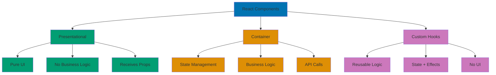

# React Component Architecture

## Quick Reference

**Navigation**: [Stack Libraries](../README.md) > [TypeScript React](./README.md) > Component Architecture

**Related Guides**:

- [Idioms](./ex-so-plwe-tsre__idioms.md) - React coding patterns
- [Best Practices](./ex-so-plwe-tsre__best-practices.md) - Production standards
- [State Management](./ex-so-plwe-tsre__state-management.md) - State patterns
- [TypeScript](./ex-so-plwe-tsre__typescript.md) - Type safety patterns

## Overview

Component architecture is the foundation of scalable React applications. This guide covers design patterns, composition strategies, and organizational approaches that enable maintainability, testability, and reusability.

**Target Audience**: Developers building production React applications, particularly for Islamic finance platforms requiring complex business logic, domain separation, and long-term maintainability.

**React Version**: React 18.2+ with TypeScript 5+

## Component Types

React components follow a clear hierarchy based on their responsibilities:



**Architecture Layers**:

- **Presentational** - Focused on how things look
- **Container** - Focused on how things work
- **Custom Hooks** - Extract and reuse stateful logic

### Presentational Components

Pure components focused on rendering UI without business logic:

```typescript
// Presentational component - pure UI
interface ZakatDisplayProps {
  wealth: number;
  nisab: number;
  zakatAmount: number;
  currency: string;
}

export const ZakatDisplay: React.FC<ZakatDisplayProps> = ({
  wealth,
  nisab,
  zakatAmount,
  currency,
}) => {
  const isZakatRequired = wealth >= nisab;

  return (
    <div className="zakat-display">
      <div className="wealth-summary">
        <h3>Wealth Summary</h3>
        <dl>
          <dt>Total Wealth:</dt>
          <dd>{formatCurrency(wealth, currency)}</dd>

          <dt>Nisab Threshold:</dt>
          <dd>{formatCurrency(nisab, currency)}</dd>

          <dt>Status:</dt>
          <dd className={isZakatRequired ? 'required' : 'not-required'}>
            {isZakatRequired ? 'Zakat Required' : 'Below Nisab'}
          </dd>
        </dl>
      </div>

      {isZakatRequired && (
        <div className="zakat-amount">
          <h3>Zakat Due</h3>
          <p className="amount">{formatCurrency(zakatAmount, currency)}</p>
          <p className="rate">2.5% of total wealth</p>
        </div>
      )}
    </div>
  );
};

// Helper function (could be in separate utils)
function formatCurrency(amount: number, currency: string): string {
  return new Intl.NumberFormat('en-US', {
    style: 'currency',
    currency,
  }).format(amount);
}
```

### Container Components

Components managing state and business logic:

```typescript
// Container component - manages state and logic
interface ZakatCalculatorContainerProps {
  userId: string;
  onCalculationComplete?: (calculation: ZakatCalculation) => void;
}

export const ZakatCalculatorContainer: React.FC<ZakatCalculatorContainerProps> = ({
  userId,
  onCalculationComplete,
}) => {
  // State management
  const [assets, setAssets] = useState<Asset[]>([]);
  const [nisabRate, setNisabRate] = useState<number>(0);
  const [loading, setLoading] = useState(true);
  const [error, setError] = useState<Error | null>(null);

  // Fetch nisab rate on mount
  useEffect(() => {
    const fetchNisabRate = async () => {
      try {
        const rate = await zakatApi.getCurrentNisabRate();
        setNisabRate(rate);
      } catch (err) {
        setError(err as Error);
      } finally {
        setLoading(false);
      }
    };

    fetchNisabRate();
  }, []);

  // Business logic
  const calculateZakat = useCallback((assetList: Asset[]) => {
    const totalWealth = assetList.reduce((sum, asset) => sum + asset.value, 0);
    const isEligible = totalWealth >= nisabRate;
    const zakatAmount = isEligible ? totalWealth * 0.025 : 0;

    const calculation: ZakatCalculation = {
      userId,
      wealth: totalWealth,
      nisab: nisabRate,
      zakatAmount,
      isEligible,
      calculatedAt: new Date(),
    };

    onCalculationComplete?.(calculation);
    return calculation;
  }, [userId, nisabRate, onCalculationComplete]);

  // Event handlers
  const handleAssetsChange = (newAssets: Asset[]) => {
    setAssets(newAssets);
    calculateZakat(newAssets);
  };

  if (loading) {
    return <LoadingSpinner />;
  }

  if (error) {
    return <ErrorMessage error={error} />;
  }

  // Render presentational components
  return (
    <div className="zakat-calculator-container">
      <AssetForm assets={assets} onChange={handleAssetsChange} />
      <ZakatDisplay
        wealth={assets.reduce((sum, a) => sum + a.value, 0)}
        nisab={nisabRate}
        zakatAmount={calculateZakat(assets).zakatAmount}
        currency="USD"
      />
    </div>
  );
};
```

### Custom Hooks (Logic Extraction)

Extract reusable logic into custom hooks:

```typescript
// Custom hook for Zakat calculation logic
interface UseZakatCalculationOptions {
  userId: string;
  autoSave?: boolean;
}

interface UseZakatCalculationReturn {
  assets: Asset[];
  calculation: ZakatCalculation | null;
  nisabRate: number;
  loading: boolean;
  error: Error | null;
  addAsset: (asset: Asset) => void;
  removeAsset: (assetId: string) => void;
  updateAsset: (assetId: string, updates: Partial<Asset>) => void;
  recalculate: () => void;
  saveCalculation: () => Promise<void>;
}

export function useZakatCalculation(
  options: UseZakatCalculationOptions
): UseZakatCalculationReturn {
  const { userId, autoSave = false } = options;

  const [assets, setAssets] = useState<Asset[]>([]);
  const [nisabRate, setNisabRate] = useState<number>(0);
  const [calculation, setCalculation] = useState<ZakatCalculation | null>(null);
  const [loading, setLoading] = useState(true);
  const [error, setError] = useState<Error | null>(null);

  // Fetch nisab rate
  useEffect(() => {
    const fetchNisab = async () => {
      try {
        const rate = await zakatApi.getCurrentNisabRate();
        setNisabRate(rate);
      } catch (err) {
        setError(err as Error);
      } finally {
        setLoading(false);
      }
    };

    fetchNisab();
  }, []);

  // Calculate zakat whenever assets change
  const recalculate = useCallback(() => {
    const totalWealth = assets.reduce((sum, asset) => sum + asset.value, 0);
    const isEligible = totalWealth >= nisabRate;
    const zakatAmount = isEligible ? totalWealth * 0.025 : 0;

    const newCalculation: ZakatCalculation = {
      userId,
      wealth: totalWealth,
      nisab: nisabRate,
      zakatAmount,
      isEligible,
      calculatedAt: new Date(),
    };

    setCalculation(newCalculation);

    if (autoSave && isEligible) {
      saveCalculation();
    }
  }, [assets, nisabRate, userId, autoSave]);

  // Auto-recalculate when assets or nisab changes
  useEffect(() => {
    if (nisabRate > 0) {
      recalculate();
    }
  }, [assets, nisabRate, recalculate]);

  const addAsset = useCallback((asset: Asset) => {
    setAssets(prev => [...prev, asset]);
  }, []);

  const removeAsset = useCallback((assetId: string) => {
    setAssets(prev => prev.filter(a => a.id !== assetId));
  }, []);

  const updateAsset = useCallback((assetId: string, updates: Partial<Asset>) => {
    setAssets(prev =>
      prev.map(asset =>
        asset.id === assetId ? { ...asset, ...updates } : asset
      )
    );
  }, []);

  const saveCalculation = useCallback(async () => {
    if (!calculation) return;

    try {
      await zakatApi.saveCalculation(calculation);
    } catch (err) {
      setError(err as Error);
      throw err;
    }
  }, [calculation]);

  return {
    assets,
    calculation,
    nisabRate,
    loading,
    error,
    addAsset,
    removeAsset,
    updateAsset,
    recalculate,
    saveCalculation,
  };
}

// Usage in component
export const ZakatCalculatorWithHook: React.FC<{ userId: string }> = ({ userId }) => {
  const {
    assets,
    calculation,
    loading,
    error,
    addAsset,
    removeAsset,
    updateAsset,
    saveCalculation,
  } = useZakatCalculation({ userId, autoSave: true });

  if (loading) return <LoadingSpinner />;
  if (error) return <ErrorMessage error={error} />;

  return (
    <div>
      <AssetList assets={assets} onUpdate={updateAsset} onRemove={removeAsset} />
      <AssetForm onSubmit={addAsset} />
      {calculation && <ZakatDisplay {...calculation} />}
      <button onClick={saveCalculation}>Save Calculation</button>
    </div>
  );
};
```

## Composition Patterns

### Component Composition

Building complex UIs through component composition:

```typescript
// Base card component
interface CardProps {
  children: React.ReactNode;
  className?: string;
}

export const Card: React.FC<CardProps> = ({ children, className = '' }) => (
  <div className={`card ${className}`}>{children}</div>
);

// Card header component
interface CardHeaderProps {
  title: string;
  subtitle?: string;
  actions?: React.ReactNode;
}

export const CardHeader: React.FC<CardHeaderProps> = ({ title, subtitle, actions }) => (
  <div className="card-header">
    <div className="card-title-section">
      <h3>{title}</h3>
      {subtitle && <p className="subtitle">{subtitle}</p>}
    </div>
    {actions && <div className="card-actions">{actions}</div>}
  </div>
);

// Card body component
interface CardBodyProps {
  children: React.ReactNode;
}

export const CardBody: React.FC<CardBodyProps> = ({ children }) => (
  <div className="card-body">{children}</div>
);

// Card footer component
interface CardFooterProps {
  children: React.ReactNode;
}

export const CardFooter: React.FC<CardFooterProps> = ({ children }) => (
  <div className="card-footer">{children}</div>
);

// Composed usage
export const DonationCard: React.FC<{ donation: Donation }> = ({ donation }) => (
  <Card className="donation-card">
    <CardHeader
      title={donation.campaignName}
      subtitle={`by ${donation.donorName}`}
      actions={
        <button onClick={() => console.log('Edit')}>Edit</button>
      }
    />
    <CardBody>
      <p className="amount">{formatCurrency(donation.amount)}</p>
      <p className="date">{formatDate(donation.createdAt)}</p>
      {donation.message && <p className="message">{donation.message}</p>}
    </CardBody>
    <CardFooter>
      <span className="status">{donation.status}</span>
    </CardFooter>
  </Card>
);
```

### Render Props Pattern

Share code between components using render props:

```typescript
// Mouse tracker with render props
interface MouseTrackerProps {
  children: (position: { x: number; y: number }) => React.ReactNode;
}

export const MouseTracker: React.FC<MouseTrackerProps> = ({ children }) => {
  const [position, setPosition] = useState({ x: 0, y: 0 });

  useEffect(() => {
    const handleMouseMove = (e: MouseEvent) => {
      setPosition({ x: e.clientX, y: e.clientY });
    };

    window.addEventListener('mousemove', handleMouseMove);
    return () => window.removeEventListener('mousemove', handleMouseMove);
  }, []);

  return <>{children(position)}</>;
};

// Usage
export const MouseDisplay: React.FC = () => (
  <MouseTracker>
    {({ x, y }) => (
      <div>
        Mouse position: ({x}, {y})
      </div>
    )}
  </MouseTracker>
);

// Data fetcher with render props
interface DataFetcherProps<T> {
  url: string;
  children: (state: {
    data: T | null;
    loading: boolean;
    error: Error | null;
  }) => React.ReactNode;
}

export function DataFetcher<T>({ url, children }: DataFetcherProps<T>) {
  const { data, loading, error } = useFetch<T>(url);
  return <>{children({ data, loading, error })}</>;
}

// Usage
export const DonationsList: React.FC = () => (
  <DataFetcher<Donation[]> url="/api/donations">
    {({ data, loading, error }) => {
      if (loading) return <LoadingSpinner />;
      if (error) return <ErrorMessage error={error} />;
      if (!data) return null;

      return (
        <ul>
          {data.map(donation => (
            <li key={donation.id}>
              {donation.campaignName}: {donation.amount}
            </li>
          ))}
        </ul>
      );
    }}
  </DataFetcher>
);
```

### Higher-Order Components (HOC)

Reuse component logic through HOCs:

```typescript
// HOC for authentication requirement
function withAuth<P extends object>(
  Component: React.ComponentType<P>
): React.FC<P> {
  return function AuthenticatedComponent(props: P) {
    const { user, loading } = useAuth();

    if (loading) {
      return <LoadingSpinner />;
    }

    if (!user) {
      return <Navigate to="/login" />;
    }

    return <Component {...props} />;
  };
}

// Usage
const ProtectedDashboard = withAuth(Dashboard);

// HOC for error boundary
function withErrorBoundary<P extends object>(
  Component: React.ComponentType<P>,
  FallbackComponent: React.ComponentType<{ error: Error }>
): React.ComponentType<P> {
  return class extends React.Component<P, { hasError: boolean; error: Error | null }> {
    constructor(props: P) {
      super(props);
      this.state = { hasError: false, error: null };
    }

    static getDerivedStateFromError(error: Error) {
      return { hasError: true, error };
    }

    render() {
      if (this.state.hasError && this.state.error) {
        return <FallbackComponent error={this.state.error} />;
      }

      return <Component {...this.props} />;
    }
  };
}

// Usage
const SafeDonationForm = withErrorBoundary(
  DonationForm,
  ({ error }) => <div>Error: {error.message}</div>
);
```

### Compound Components Pattern

Create components that work together implicitly:

```typescript
// Context for compound component communication
interface TabsContextValue {
  activeTab: string;
  setActiveTab: (tab: string) => void;
}

const TabsContext = React.createContext<TabsContextValue | undefined>(undefined);

function useTabs() {
  const context = useContext(TabsContext);
  if (!context) {
    throw new Error('Tabs compound components must be used within Tabs');
  }
  return context;
}

// Root Tabs component
interface TabsProps {
  defaultTab: string;
  children: React.ReactNode;
}

export const Tabs: React.FC<TabsProps> & {
  TabList: typeof TabList;
  Tab: typeof Tab;
  TabPanels: typeof TabPanels;
  TabPanel: typeof TabPanel;
} = ({ defaultTab, children }) => {
  const [activeTab, setActiveTab] = useState(defaultTab);

  return (
    <TabsContext.Provider value={{ activeTab, setActiveTab }}>
      <div className="tabs">{children}</div>
    </TabsContext.Provider>
  );
};

// TabList component
interface TabListProps {
  children: React.ReactNode;
}

const TabList: React.FC<TabListProps> = ({ children }) => (
  <div className="tab-list" role="tablist">
    {children}
  </div>
);

// Tab component
interface TabProps {
  id: string;
  children: React.ReactNode;
}

const Tab: React.FC<TabProps> = ({ id, children }) => {
  const { activeTab, setActiveTab } = useTabs();
  const isActive = activeTab === id;

  return (
    <button
      className={`tab ${isActive ? 'active' : ''}`}
      role="tab"
      aria-selected={isActive}
      onClick={() => setActiveTab(id)}
    >
      {children}
    </button>
  );
};

// TabPanels component
interface TabPanelsProps {
  children: React.ReactNode;
}

const TabPanels: React.FC<TabPanelsProps> = ({ children }) => (
  <div className="tab-panels">{children}</div>
);

// TabPanel component
interface TabPanelProps {
  id: string;
  children: React.ReactNode;
}

const TabPanel: React.FC<TabPanelProps> = ({ id, children }) => {
  const { activeTab } = useTabs();

  if (activeTab !== id) return null;

  return (
    <div className="tab-panel" role="tabpanel">
      {children}</div>
  );
};

// Attach sub-components
Tabs.TabList = TabList;
Tabs.Tab = Tab;
Tabs.TabPanels = TabPanels;
Tabs.TabPanel = TabPanel;

// Usage
export const ZakatDashboard: React.FC = () => (
  <Tabs defaultTab="calculator">
    <Tabs.TabList>
      <Tabs.Tab id="calculator">Calculator</Tabs.Tab>
      <Tabs.Tab id="history">History</Tabs.Tab>
      <Tabs.Tab id="reports">Reports</Tabs.Tab>
    </Tabs.TabList>

    <Tabs.TabPanels>
      <Tabs.TabPanel id="calculator">
        <ZakatCalculator />
      </Tabs.TabPanel>
      <Tabs.TabPanel id="history">
        <ZakatHistory />
      </Tabs.TabPanel>
      <Tabs.TabPanel id="reports">
        <ZakatReports />
      </Tabs.TabPanel>
    </Tabs.TabPanels>
  </Tabs>
);
```

## Component Organization

### Feature-Based Organization

Organize components by feature/domain:

```
src/
├── features/
│   ├── zakat/
│   │   ├── components/
│   │   │   ├── ZakatCalculator.tsx
│   │   │   ├── ZakatDisplay.tsx
│   │   │   ├── AssetForm.tsx
│   │   │   └── index.ts
│   │   ├── hooks/
│   │   │   ├── useZakatCalculation.ts
│   │   │   ├── useNisabRate.ts
│   │   │   └── index.ts
│   │   ├── types/
│   │   │   └── index.ts
│   │   ├── api/
│   │   │   └── zakatApi.ts
│   │   └── utils/
│   │       └── calculations.ts
│   │
│   ├── donations/
│   │   ├── components/
│   │   ├── hooks/
│   │   ├── types/
│   │   └── api/
│   │
│   └── murabaha/
│       ├── components/
│       ├── hooks/
│       ├── types/
│       └── api/
│
├── shared/
│   ├── components/
│   │   ├── Button.tsx
│   │   ├── Card.tsx
│   │   ├── LoadingSpinner.tsx
│   │   └── ErrorMessage.tsx
│   ├── hooks/
│   │   ├── useFetch.ts
│   │   └── useAuth.ts
│   └── utils/
│       └── formatting.ts
│
└── core/
    ├── providers/
    ├── routes/
    └── config/
```

### Component File Structure

Consistent file structure for components:

```typescript
// ZakatCalculator.tsx

// 1. Imports
import React, { useState, useEffect, useCallback } from 'react';
import { zakatApi } from '../api/zakatApi';
import { Asset, ZakatCalculation } from '../types';
import { AssetForm } from './AssetForm';
import { ZakatDisplay } from './ZakatDisplay';
import { LoadingSpinner } from '@/shared/components/LoadingSpinner';
import { ErrorMessage } from '@/shared/components/ErrorMessage';

// 2. Types
interface ZakatCalculatorProps {
  userId: string;
  onCalculationComplete?: (calculation: ZakatCalculation) => void;
}

// 3. Component
export const ZakatCalculator: React.FC<ZakatCalculatorProps> = ({
  userId,
  onCalculationComplete,
}) => {
  // State
  const [assets, setAssets] = useState<Asset[]>([]);
  const [loading, setLoading] = useState(false);
  const [error, setError] = useState<Error | null>(null);

  // Effects
  useEffect(() => {
    // Effect logic
  }, []);

  // Handlers
  const handleAssetsChange = useCallback((newAssets: Asset[]) => {
    setAssets(newAssets);
  }, []);

  // Render
  if (loading) return <LoadingSpinner />;
  if (error) return <ErrorMessage error={error} />;

  return (
    <div className="zakat-calculator">
      {/* JSX */}
    </div>
  );
};

// 4. Helper functions (if not exported)
function calculateTotal(assets: Asset[]): number {
  return assets.reduce((sum, asset) => sum + asset.value, 0);
}

// 5. Default export (if needed)
export default ZakatCalculator;
```

## Specialized Patterns

### Portal Pattern

Render components outside the DOM hierarchy:

```typescript
import { createPortal } from 'react-dom';

interface ModalProps {
  isOpen: boolean;
  onClose: () => void;
  children: React.ReactNode;
}

export const Modal: React.FC<ModalProps> = ({ isOpen, onClose, children }) => {
  useEffect(() => {
    if (isOpen) {
      document.body.style.overflow = 'hidden';
    }

    return () => {
      document.body.style.overflow = 'unset';
    };
  }, [isOpen]);

  if (!isOpen) return null;

  return createPortal(
    <div className="modal-overlay" onClick={onClose}>
      <div className="modal-content" onClick={e => e.stopPropagation()}>
        <button className="modal-close" onClick={onClose}>
          ×
        </button>
        {children}
      </div>
    </div>,
    document.body
  );
};

// Usage
export const DonationPage: React.FC = () => {
  const [isModalOpen, setIsModalOpen] = useState(false);

  return (
    <div>
      <button onClick={() => setIsModalOpen(true)}>Make Donation</button>

      <Modal isOpen={isModalOpen} onClose={() => setIsModalOpen(false)}>
        <DonationForm onSubmit={() => setIsModalOpen(false)} />
      </Modal>
    </div>
  );
};
```

### Slot Pattern

Flexible component composition with named slots:

```typescript
interface PageLayoutProps {
  header?: React.ReactNode;
  sidebar?: React.ReactNode;
  content: React.ReactNode;
  footer?: React.ReactNode;
}

export const PageLayout: React.FC<PageLayoutProps> = ({
  header,
  sidebar,
  content,
  footer,
}) => (
  <div className="page-layout">
    {header && <header className="page-header">{header}</header>}

    <div className="page-main">
      {sidebar && <aside className="page-sidebar">{sidebar}</aside>}
      <main className="page-content">{content}</main>
    </div>

    {footer && <footer className="page-footer">{footer}</footer>}
  </div>
);

// Usage
export const DashboardPage: React.FC = () => (
  <PageLayout
    header={<DashboardHeader />}
    sidebar={<DashboardSidebar />}
    content={<DashboardContent />}
    footer={<DashboardFooter />}
  />
);
```

### Provider Pattern

Share context throughout component tree:

```typescript
// Theme provider example
interface ThemeContextValue {
  theme: 'light' | 'dark';
  toggleTheme: () => void;
}

const ThemeContext = React.createContext<ThemeContextValue | undefined>(undefined);

export function useTheme() {
  const context = useContext(ThemeContext);
  if (!context) {
    throw new Error('useTheme must be used within ThemeProvider');
  }
  return context;
}

interface ThemeProviderProps {
  children: React.ReactNode;
}

export const ThemeProvider: React.FC<ThemeProviderProps> = ({ children }) => {
  const [theme, setTheme] = useState<'light' | 'dark'>('light');

  const toggleTheme = useCallback(() => {
    setTheme(prev => (prev === 'light' ? 'dark' : 'light'));
  }, []);

  useEffect(() => {
    document.documentElement.setAttribute('data-theme', theme);
  }, [theme]);

  return (
    <ThemeContext.Provider value={{ theme, toggleTheme }}>
      {children}
    </ThemeContext.Provider>
  );
};

// Multi-provider composition
export const AppProviders: React.FC<{ children: React.ReactNode }> = ({ children }) => (
  <ThemeProvider>
    <AuthProvider>
      <I18nProvider>
        <ToastProvider>
          {children}
        </ToastProvider>
      </I18nProvider>
    </AuthProvider>
  </ThemeProvider>
);
```

## Performance Considerations

### Component Memoization

Prevent unnecessary re-renders:

```typescript
// Memoize expensive component
export const DonationCard = React.memo<{ donation: Donation }>(
  ({ donation }) => {
    console.log('DonationCard render');

    return (
      <Card>
        <CardHeader title={donation.campaignName} />
        <CardBody>
          <p>{formatCurrency(donation.amount)}</p>
        </CardBody>
      </Card>
    );
  },
  // Custom comparison function (optional)
  (prevProps, nextProps) => {
    return prevProps.donation.id === nextProps.donation.id &&
           prevProps.donation.amount === nextProps.donation.amount;
  }
);

// Memoize expensive calculations
export const ZakatSummary: React.FC<{ donations: Donation[] }> = ({ donations }) => {
  const totalAmount = useMemo(
    () => donations.reduce((sum, d) => sum + d.amount, 0),
    [donations]
  );

  const zakatDue = useMemo(
    () => totalAmount * 0.025,
    [totalAmount]
  );

  return (
    <div>
      <p>Total: {totalAmount}</p>
      <p>Zakat: {zakatDue}</p>
    </div>
  );
};
```

### Code Splitting

Lazy load components for better performance:

```typescript
import { lazy, Suspense } from 'react';

// Lazy load heavy components
const ZakatReportViewer = lazy(() => import('./ZakatReportViewer'));
const DonationCharts = lazy(() => import('./DonationCharts'));

export const DashboardPage: React.FC = () => (
  <div className="dashboard">
    <h1>Dashboard</h1>

    <Suspense fallback={<LoadingSpinner />}>
      <DonationCharts />
    </Suspense>

    <Suspense fallback={<div>Loading report...</div>}>
      <ZakatReportViewer />
    </Suspense>
  </div>
);
```

## Related Documentation

- **[Idioms](./ex-so-plwe-tsre__idioms.md)** - React coding patterns
- **[Best Practices](./ex-so-plwe-tsre__best-practices.md)** - Production standards
- **[State Management](./ex-so-plwe-tsre__state-management.md)** - State patterns
- **[Hooks](./ex-so-plwe-tsre__hooks.md)** - React Hooks guide
- **[Performance](./ex-so-plwe-tsre__performance.md)** - Optimization techniques
- **[Testing](./ex-so-plwe-tsre__testing.md)** - Component testing strategies

---

**Last Updated**: 2026-01-25
