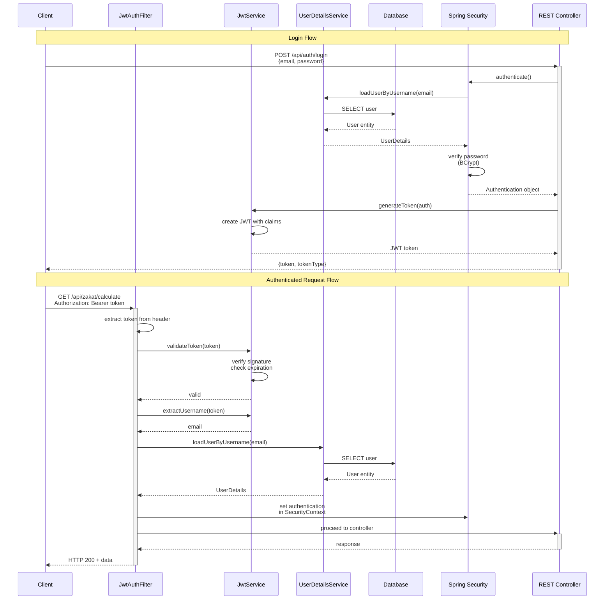

# Spring Boot Security

Security is critical for production Spring Boot applications. This guide covers comprehensive security practices including CSRF protection, XSS prevention, input validation, authentication, authorization, and defenses against the OWASP Top 10 vulnerabilities using Spring Security.

## 📋 Quick Reference

- [CSRF Protection](#-csrf-protection) - Cross-Site Request Forgery prevention
- [XSS Prevention](#-xss-prevention) - Cross-Site Scripting defenses
- [Input Validation](#-input-validation) - Bean Validation and custom validators
- [Authentication](#-authentication) - JWT and OAuth2 authentication
- [Authorization](#-authorization) - Role-based access control
- [SQL Injection Prevention](#-sql-injection-prevention) - Database security
- [Security Headers](#-security-headers) - HTTP security headers
- [Rate Limiting](#-rate-limiting) - API abuse prevention
- [Secrets Management](#-secrets-management) - Configuration security
- [OWASP Top 10](#-owasp-top-10) - Common vulnerability defenses
- [OSE Platform Examples](#-ose-platform-examples) - Islamic finance security patterns
- [Security Checklist](#-security-checklist) - Production deployment checklist
- [Related Documentation](#-related-documentation) - Cross-references

## 🛡️ CSRF Protection

**Cross-Site Request Forgery (CSRF)** attacks trick authenticated users into performing unwanted actions. Spring Security provides built-in CSRF protection enabled by default.

### Built-in CSRF Protection

Spring Security automatically protects form-based applications:

```java
// SecurityConfig.java
package com.oseplatform.config;

import org.springframework.context.annotation.Bean;
import org.springframework.context.annotation.Configuration;
import org.springframework.security.config.annotation.web.builders.HttpSecurity;
import org.springframework.security.config.annotation.web.configuration.EnableWebSecurity;
import org.springframework.security.web.SecurityFilterChain;
import org.springframework.security.web.csrf.CookieCsrfTokenRepository;

@Configuration
@EnableWebSecurity
public class SecurityConfig {

    @Bean
    public SecurityFilterChain filterChain(HttpSecurity http) throws Exception {
        http
            .csrf(csrf -> csrf
                // Store CSRF token in cookie for JavaScript access
                .csrfTokenRepository(CookieCsrfTokenRepository.withHttpOnlyFalse())
            )
            .authorizeHttpRequests(auth -> auth
                .requestMatchers("/api/public/**").permitAll()
                .anyRequest().authenticated()
            );

        return http.build();
    }
}
```

### CSRF Protection for REST APIs

For stateless REST APIs, disable CSRF or implement custom token-based protection:

```java
// SecurityConfig.java
@Configuration
@EnableWebSecurity
public class SecurityConfig {

    @Bean
    public SecurityFilterChain filterChain(HttpSecurity http) throws Exception {
        http
            .csrf(csrf -> csrf
                // Disable CSRF for stateless API endpoints
                .ignoringRequestMatchers("/api/v1/**")
            )
            .authorizeHttpRequests(auth -> auth
                .requestMatchers("/api/v1/**").authenticated()
                .anyRequest().permitAll()
            )
            .oauth2ResourceServer(oauth2 -> oauth2.jwt(jwt -> {}))
            .sessionManagement(session -> session
                .sessionCreationPolicy(SessionCreationPolicy.STATELESS)
            );

        return http.build();
    }
}
```

### Custom CSRF Token for Stateless APIs

```java
// CsrfTokenService.java
package com.oseplatform.security;

import org.springframework.stereotype.Service;
import javax.crypto.Mac;
import javax.crypto.spec.SecretKeySpec;
import java.security.SecureRandom;
import java.util.Base64;

@Service
public class CsrfTokenService {

    private static final String ALGORITHM = "HmacSHA256";
    private final String secret;

    public CsrfTokenService() {
        // In production, load from secure configuration
        this.secret = System.getenv("CSRF_SECRET");
    }

    public String generateToken() {
        SecureRandom random = new SecureRandom();
        byte[] tokenBytes = new byte[32];
        random.nextBytes(tokenBytes);
        return Base64.getUrlEncoder().withoutPadding().encodeToString(tokenBytes);
    }

    public String hashToken(String token) {
        try {
            SecretKeySpec keySpec = new SecretKeySpec(secret.getBytes(), ALGORITHM);
            Mac mac = Mac.getInstance(ALGORITHM);
            mac.init(keySpec);
            byte[] hash = mac.doFinal(token.getBytes());
            return Base64.getUrlEncoder().withoutPadding().encodeToString(hash);
        } catch (Exception e) {
            throw new RuntimeException("Failed to hash CSRF token", e);
        }
    }

    public boolean verifyToken(String token, String hashedToken) {
        String computedHash = hashToken(token);
        return computedHash.equals(hashedToken);
    }
}
```

```java
// CsrfController.java
package com.oseplatform.controller;

import com.oseplatform.security.CsrfTokenService;
import org.springframework.http.ResponseCookie;
import org.springframework.http.ResponseEntity;
import org.springframework.web.bind.annotation.GetMapping;
import org.springframework.web.bind.annotation.RequestMapping;
import org.springframework.web.bind.annotation.RestController;

import java.util.Map;

@RestController
@RequestMapping("/api/csrf")
public class CsrfController {

    private final CsrfTokenService csrfTokenService;

    public CsrfController(CsrfTokenService csrfTokenService) {
        this.csrfTokenService = csrfTokenService;
    }

    @GetMapping("/token")
    public ResponseEntity<Map<String, String>> getCsrfToken() {
        String token = csrfTokenService.generateToken();
        String hashedToken = csrfTokenService.hashToken(token);

        // Set hashed token in HTTP-only cookie
        ResponseCookie cookie = ResponseCookie.from("X-CSRF-TOKEN", hashedToken)
            .httpOnly(true)
            .secure(true)
            .sameSite("Strict")
            .maxAge(3600)
            .path("/")
            .build();

        return ResponseEntity.ok()
            .header("Set-Cookie", cookie.toString())
            .body(Map.of("csrfToken", token));
    }
}
```

### OSE Platform Example: Zakat Calculation Endpoint

```java
// ZakatController.java
package com.oseplatform.zakat.controller;

import com.oseplatform.zakat.dto.ZakatCalculationRequest;
import com.oseplatform.zakat.dto.ZakatCalculationResponse;
import com.oseplatform.zakat.service.ZakatService;
import jakarta.validation.Valid;
import org.springframework.security.core.Authentication;
import org.springframework.web.bind.annotation.*;

@RestController
@RequestMapping("/api/v1/zakat")
public class ZakatController {

    private final ZakatService zakatService;

    public ZakatController(ZakatService zakatService) {
        this.zakatService = zakatService;
    }

    // CSRF-protected by default (form-based auth)
    @PostMapping("/calculate")
    public ZakatCalculationResponse calculate(
        @Valid @RequestBody ZakatCalculationRequest request,
        Authentication authentication
    ) {
        String userId = authentication.getName();
        return zakatService.calculateZakat(userId, request);
    }
}
```

## 🔒 XSS Prevention

**Cross-Site Scripting (XSS)** allows attackers to inject malicious scripts. Spring Boot provides automatic protection through template engines and proper output encoding.

### Template Engine Protection (Thymeleaf)

Thymeleaf automatically escapes HTML by default:

```html
<!-- zakat-form.html -->
<!DOCTYPE html>
<html xmlns:th="http://www.thymeleaf.org">
  <head>
    <title>Zakat Calculator</title>
  </head>
  <body>
    <!-- Thymeleaf automatically escapes userInput -->
    <h2 th:text="${userName}">User Name</h2>

    <!-- If userInput contains: <script>alert('XSS')</script> -->
    <!-- Thymeleaf renders: &lt;script&gt;alert('XSS')&lt;/script&gt; -->

    <!-- To render unescaped HTML (dangerous, avoid unless necessary) -->
    <!-- <div th:utext="${trustedHtml}"></div> -->
  </body>
</html>
```

### Input Sanitization with OWASP Java Encoder

```xml
<!-- pom.xml -->
<dependency>
    <groupId>org.owasp.encoder</groupId>
    <artifactId>encoder</artifactId>
    <version>1.2.3</version>
</dependency>
```

```java
// SanitizationService.java
package com.oseplatform.security;

import org.owasp.encoder.Encode;
import org.springframework.stereotype.Service;

@Service
public class SanitizationService {

    public String sanitizeHtml(String input) {
        if (input == null) {
            return null;
        }
        // Encode for HTML context
        return Encode.forHtml(input);
    }

    public String sanitizeJavaScript(String input) {
        if (input == null) {
            return null;
        }
        // Encode for JavaScript context
        return Encode.forJavaScript(input);
    }

    public String sanitizeUrl(String input) {
        if (input == null) {
            return null;
        }
        // Encode for URL context
        return Encode.forUriComponent(input);
    }

    public String sanitizeHtmlAttribute(String input) {
        if (input == null) {
            return null;
        }
        // Encode for HTML attribute context
        return Encode.forHtmlAttribute(input);
    }
}
```

### REST API Output Encoding

```java
// MurabahaController.java
package com.oseplatform.murabaha.controller;

import com.oseplatform.murabaha.dto.MurabahaApplicationResponse;
import com.oseplatform.security.SanitizationService;
import org.springframework.web.bind.annotation.*;

@RestController
@RequestMapping("/api/v1/murabaha")
public class MurabahaController {

    private final SanitizationService sanitizationService;

    public MurabahaController(SanitizationService sanitizationService) {
        this.sanitizationService = sanitizationService;
    }

    @GetMapping("/{id}")
    public MurabahaApplicationResponse getApplication(@PathVariable Long id) {
        // Fetch application from database
        var application = // ... fetch from service

        // Sanitize user-provided fields before returning
        application.setProductName(
            sanitizationService.sanitizeHtml(application.getProductName())
        );
        application.setNotes(
            sanitizationService.sanitizeHtml(application.getNotes())
        );

        return application;
    }
}
```

### Content Security Policy Headers

```java
// SecurityHeadersConfig.java
package com.oseplatform.config;

import org.springframework.context.annotation.Bean;
import org.springframework.context.annotation.Configuration;
import org.springframework.security.config.annotation.web.builders.HttpSecurity;
import org.springframework.security.web.SecurityFilterChain;

@Configuration
public class SecurityHeadersConfig {

    @Bean
    public SecurityFilterChain filterChain(HttpSecurity http) throws Exception {
        http
            .headers(headers -> headers
                .contentSecurityPolicy(csp -> csp
                    .policyDirectives(
                        "default-src 'self'; " +
                        "script-src 'self' 'unsafe-inline'; " +
                        "style-src 'self' 'unsafe-inline'; " +
                        "img-src 'self' data: https:; " +
                        "font-src 'self'; " +
                        "connect-src 'self'; " +
                        "frame-ancestors 'none';"
                    )
                )
            );

        return http.build();
    }
}
```

## ✅ Input Validation

**Server-side validation** is critical - never trust client input. Spring Boot provides Bean Validation (JSR-380).

### Bean Validation with Hibernate Validator

```xml
<!-- pom.xml -->
<dependency>
    <groupId>org.springframework.boot</groupId>
    <artifactId>spring-boot-starter-validation</artifactId>
</dependency>
```

```java
// ZakatCalculationRequest.java
package com.oseplatform.zakat.dto;

import jakarta.validation.constraints.*;
import java.math.BigDecimal;

public class ZakatCalculationRequest {

    @NotNull(message = "Wealth amount is required")
    @Positive(message = "Wealth must be positive")
    @DecimalMax(value = "1000000000", message = "Wealth exceeds maximum")
    private BigDecimal wealth;

    @NotNull(message = "Nisab threshold is required")
    @Positive(message = "Nisab must be positive")
    @DecimalMax(value = "1000000", message = "Nisab exceeds maximum")
    private BigDecimal nisab;

    @NotBlank(message = "User ID is required")
    @Size(min = 36, max = 36, message = "Invalid user ID format")
    private String userId;

    @NotNull(message = "Currency is required")
    @Pattern(regexp = "^[A-Z]{3}$", message = "Currency must be 3-letter ISO code")
    private String currency;

    // Getters and setters
    public BigDecimal getWealth() { return wealth; }
    public void setWealth(BigDecimal wealth) { this.wealth = wealth; }

    public BigDecimal getNisab() { return nisab; }
    public void setNisab(BigDecimal nisab) { this.nisab = nisab; }

    public String getUserId() { return userId; }
    public void setUserId(String userId) { this.userId = userId; }

    public String getCurrency() { return currency; }
    public void setCurrency(String currency) { this.currency = currency; }
}
```

```java
// ZakatController.java (with validation)
@RestController
@RequestMapping("/api/v1/zakat")
public class ZakatController {

    private final ZakatService zakatService;

    public ZakatController(ZakatService zakatService) {
        this.zakatService = zakatService;
    }

    @PostMapping("/calculate")
    public ResponseEntity<ZakatCalculationResponse> calculate(
        @Valid @RequestBody ZakatCalculationRequest request
    ) {
        // Validation happens automatically before method execution
        var response = zakatService.calculateZakat(request);
        return ResponseEntity.ok(response);
    }
}
```

### Global Validation Error Handling

```java
// GlobalExceptionHandler.java
package com.oseplatform.exception;

import org.springframework.http.HttpStatus;
import org.springframework.http.ResponseEntity;
import org.springframework.validation.FieldError;
import org.springframework.web.bind.MethodArgumentNotValidException;
import org.springframework.web.bind.annotation.ExceptionHandler;
import org.springframework.web.bind.annotation.RestControllerAdvice;

import java.time.Instant;
import java.util.HashMap;
import java.util.Map;

@RestControllerAdvice
public class GlobalExceptionHandler {

    @ExceptionHandler(MethodArgumentNotValidException.class)
    public ResponseEntity<ValidationErrorResponse> handleValidationException(
        MethodArgumentNotValidException ex
    ) {
        Map<String, String> errors = new HashMap<>();

        ex.getBindingResult().getAllErrors().forEach((error) -> {
            String fieldName = ((FieldError) error).getField();
            String errorMessage = error.getDefaultMessage();
            errors.put(fieldName, errorMessage);
        });

        ValidationErrorResponse response = new ValidationErrorResponse(
            "Validation failed",
            errors,
            Instant.now()
        );

        return ResponseEntity.status(HttpStatus.BAD_REQUEST).body(response);
    }

    public record ValidationErrorResponse(
        String message,
        Map<String, String> errors,
        Instant timestamp
    ) {}
}
```

### Custom Validators

```java
// IslamicDate.java (custom annotation)
package com.oseplatform.validation;

import jakarta.validation.Constraint;
import jakarta.validation.Payload;
import java.lang.annotation.*;

@Target({ElementType.FIELD, ElementType.PARAMETER})
@Retention(RetentionPolicy.RUNTIME)
@Constraint(validatedBy = IslamicDateValidator.class)
@Documented
public @interface IslamicDate {
    String message() default "Invalid Islamic date format";
    Class<?>[] groups() default {};
    Class<? extends Payload>[] payload() default {};
}
```

```java
// IslamicDateValidator.java
package com.oseplatform.validation;

import jakarta.validation.ConstraintValidator;
import jakarta.validation.ConstraintValidatorContext;
import java.util.regex.Pattern;

public class IslamicDateValidator implements ConstraintValidator<IslamicDate, String> {

    private static final Pattern ISLAMIC_DATE_PATTERN =
        Pattern.compile("^\\d{1,2}/\\d{1,2}/\\d{4}H$");

    @Override
    public boolean isValid(String value, ConstraintValidatorContext context) {
        if (value == null) {
            return true; // Use @NotNull for null checks
        }

        return ISLAMIC_DATE_PATTERN.matcher(value).matches();
    }
}
```

```java
// WaqfDonationRequest.java (using custom validator)
package com.oseplatform.waqf.dto;

import com.oseplatform.validation.IslamicDate;
import jakarta.validation.constraints.*;
import java.math.BigDecimal;

public class WaqfDonationRequest {

    @NotNull(message = "Donation amount is required")
    @Positive(message = "Donation must be positive")
    @DecimalMax(value = "10000000", message = "Donation exceeds maximum")
    private BigDecimal amount;

    @NotBlank(message = "Project ID is required")
    private String projectId;

    @IslamicDate(message = "Invalid Islamic date format (use DD/MM/YYYYH)")
    private String donationDate;

    @Email(message = "Invalid email format")
    private String donorEmail;

    // Getters and setters
    public BigDecimal getAmount() { return amount; }
    public void setAmount(BigDecimal amount) { this.amount = amount; }

    public String getProjectId() { return projectId; }
    public void setProjectId(String projectId) { this.projectId = projectId; }

    public String getDonationDate() { return donationDate; }
    public void setDonationDate(String donationDate) { this.donationDate = donationDate; }

    public String getDonorEmail() { return donorEmail; }
    public void setDonorEmail(String donorEmail) { this.donorEmail = donorEmail; }
}
```

### Cross-Field Validation

```java
// MurabahaApplicationRequest.java
package com.oseplatform.murabaha.dto;

import com.oseplatform.validation.ValidMurabahaApplication;
import jakarta.validation.constraints.*;
import java.math.BigDecimal;

@ValidMurabahaApplication
public class MurabahaApplicationRequest {

    @NotBlank(message = "Product name is required")
    @Size(min = 3, max = 100, message = "Product name must be 3-100 characters")
    private String productName;

    @NotNull(message = "Purchase price is required")
    @Positive(message = "Purchase price must be positive")
    private BigDecimal purchasePrice;

    @NotNull(message = "Down payment is required")
    @PositiveOrZero(message = "Down payment must be zero or positive")
    private BigDecimal downPayment;

    @NotNull(message = "Term is required")
    @Min(value = 6, message = "Minimum term is 6 months")
    @Max(value = 60, message = "Maximum term is 60 months")
    private Integer termMonths;

    // Getters and setters
    public String getProductName() { return productName; }
    public void setProductName(String productName) { this.productName = productName; }

    public BigDecimal getPurchasePrice() { return purchasePrice; }
    public void setPurchasePrice(BigDecimal purchasePrice) { this.purchasePrice = purchasePrice; }

    public BigDecimal getDownPayment() { return downPayment; }
    public void setDownPayment(BigDecimal downPayment) { this.downPayment = downPayment; }

    public Integer getTermMonths() { return termMonths; }
    public void setTermMonths(Integer termMonths) { this.termMonths = termMonths; }
}
```

```java
// ValidMurabahaApplication.java
package com.oseplatform.validation;

import jakarta.validation.Constraint;
import jakarta.validation.Payload;
import java.lang.annotation.*;

@Target(ElementType.TYPE)
@Retention(RetentionPolicy.RUNTIME)
@Constraint(validatedBy = MurabahaApplicationValidator.class)
@Documented
public @interface ValidMurabahaApplication {
    String message() default "Down payment cannot exceed purchase price";
    Class<?>[] groups() default {};
    Class<? extends Payload>[] payload() default {};
}
```

```java
// MurabahaApplicationValidator.java
package com.oseplatform.validation;

import com.oseplatform.murabaha.dto.MurabahaApplicationRequest;
import jakarta.validation.ConstraintValidator;
import jakarta.validation.ConstraintValidatorContext;

public class MurabahaApplicationValidator
    implements ConstraintValidator<ValidMurabahaApplication, MurabahaApplicationRequest> {

    @Override
    public boolean isValid(MurabahaApplicationRequest request, ConstraintValidatorContext context) {
        if (request.getPurchasePrice() == null || request.getDownPayment() == null) {
            return true; // Let @NotNull handle null checks
        }

        // Down payment must not exceed purchase price
        if (request.getDownPayment().compareTo(request.getPurchasePrice()) > 0) {
            context.disableDefaultConstraintViolation();
            context.buildConstraintViolationWithTemplate(
                "Down payment cannot exceed purchase price"
            ).addPropertyNode("downPayment").addConstraintViolation();
            return false;
        }

        return true;
    }
}
```

## 🔐 Authentication

Spring Security provides comprehensive authentication support with JWT, OAuth2, and session-based authentication.

### JWT Authentication Flow



**Authentication Steps**:

1. **Login** (top half):
   - Client sends credentials
   - AuthenticationManager verifies password
   - JwtService generates token with user claims
   - Client receives JWT token

2. **Authenticated Request** (bottom half):
   - Client includes `Authorization: Bearer <token>` header
   - JwtAuthFilter extracts and validates token
   - UserDetailsService loads user from database
   - SecurityContext populated with authentication
   - Controller method executes with authenticated user

**JWT Token Structure**:

```
eyJhbGciOiJIUzI1NiJ9.eyJzdWIiOiJ1c2VyQG9zZS5jb20iLCJhdXRob3JpdGllcyI6WyJST0xFX1VTRVIiXX0.signature
    ^                  ^                                                                                ^
   Header            Payload                                                                       Signature
```

**Security Features**:

- Tokens signed with secret key (HMAC-SHA256)
- Expiration time enforced
- Stateless (no server-side session)
- Revocation via blacklist (optional)

### JWT Authentication with Spring Security

```xml
<!-- pom.xml -->
<dependency>
    <groupId>io.jsonwebtoken</groupId>
    <artifactId>jjwt-api</artifactId>
    <version>0.12.3</version>
</dependency>
<dependency>
    <groupId>io.jsonwebtoken</groupId>
    <artifactId>jjwt-impl</artifactId>
    <version>0.12.3</version>
    <scope>runtime</scope>
</dependency>
<dependency>
    <groupId>io.jsonwebtoken</groupId>
    <artifactId>jjwt-jackson</artifactId>
    <version>0.12.3</version>
    <scope>runtime</scope>
</dependency>
```

```java
// JwtService.java
package com.oseplatform.security;

import io.jsonwebtoken.*;
import io.jsonwebtoken.security.Keys;
import org.springframework.beans.factory.annotation.Value;
import org.springframework.security.core.Authentication;
import org.springframework.security.core.userdetails.UserDetails;
import org.springframework.stereotype.Service;

import javax.crypto.SecretKey;
import java.time.Instant;
import java.time.temporal.ChronoUnit;
import java.util.Date;

@Service
public class JwtService {

    private final SecretKey secretKey;
    private final long expirationMinutes;

    public JwtService(
        @Value("${jwt.secret}") String secret,
        @Value("${jwt.expiration-minutes}") long expirationMinutes
    ) {
        this.secretKey = Keys.hmacShaKeyFor(secret.getBytes());
        this.expirationMinutes = expirationMinutes;
    }

    public String generateToken(Authentication authentication) {
        UserDetails userDetails = (UserDetails) authentication.getPrincipal();
        Instant now = Instant.now();
        Instant expiration = now.plus(expirationMinutes, ChronoUnit.MINUTES);

        return Jwts.builder()
            .subject(userDetails.getUsername())
            .claim("authorities", userDetails.getAuthorities())
            .issuedAt(Date.from(now))
            .expiration(Date.from(expiration))
            .signWith(secretKey)
            .compact();
    }

    public String extractUsername(String token) {
        return extractClaims(token).getSubject();
    }

    public boolean validateToken(String token) {
        try {
            extractClaims(token);
            return true;
        } catch (JwtException | IllegalArgumentException e) {
            return false;
        }
    }

    private Claims extractClaims(String token) {
        return Jwts.parser()
            .verifyWith(secretKey)
            .build()
            .parseSignedClaims(token)
            .getPayload();
    }
}
```

```java
// JwtAuthenticationFilter.java
package com.oseplatform.security;

import jakarta.servlet.FilterChain;
import jakarta.servlet.ServletException;
import jakarta.servlet.http.HttpServletRequest;
import jakarta.servlet.http.HttpServletResponse;
import org.springframework.security.authentication.UsernamePasswordAuthenticationToken;
import org.springframework.security.core.context.SecurityContextHolder;
import org.springframework.security.core.userdetails.UserDetails;
import org.springframework.security.core.userdetails.UserDetailsService;
import org.springframework.security.web.authentication.WebAuthenticationDetailsSource;
import org.springframework.stereotype.Component;
import org.springframework.web.filter.OncePerRequestFilter;

import java.io.IOException;

@Component
public class JwtAuthenticationFilter extends OncePerRequestFilter {

    private final JwtService jwtService;
    private final UserDetailsService userDetailsService;

    public JwtAuthenticationFilter(
        JwtService jwtService,
        UserDetailsService userDetailsService
    ) {
        this.jwtService = jwtService;
        this.userDetailsService = userDetailsService;
    }

    @Override
    protected void doFilterInternal(
        HttpServletRequest request,
        HttpServletResponse response,
        FilterChain filterChain
    ) throws ServletException, IOException {
        String authHeader = request.getHeader("Authorization");

        if (authHeader == null || !authHeader.startsWith("Bearer ")) {
            filterChain.doFilter(request, response);
            return;
        }

        String token = authHeader.substring(7);

        if (jwtService.validateToken(token)) {
            String username = jwtService.extractUsername(token);
            UserDetails userDetails = userDetailsService.loadUserByUsername(username);

            UsernamePasswordAuthenticationToken authentication =
                new UsernamePasswordAuthenticationToken(
                    userDetails,
                    null,
                    userDetails.getAuthorities()
                );

            authentication.setDetails(
                new WebAuthenticationDetailsSource().buildDetails(request)
            );

            SecurityContextHolder.getContext().setAuthentication(authentication);
        }

        filterChain.doFilter(request, response);
    }
}
```

```java
// AuthController.java
package com.oseplatform.auth.controller;

import com.oseplatform.auth.dto.LoginRequest;
import com.oseplatform.auth.dto.LoginResponse;
import com.oseplatform.security.JwtService;
import jakarta.validation.Valid;
import org.springframework.http.ResponseEntity;
import org.springframework.security.authentication.AuthenticationManager;
import org.springframework.security.authentication.UsernamePasswordAuthenticationToken;
import org.springframework.security.core.Authentication;
import org.springframework.web.bind.annotation.*;

@RestController
@RequestMapping("/api/v1/auth")
public class AuthController {

    private final AuthenticationManager authenticationManager;
    private final JwtService jwtService;

    public AuthController(
        AuthenticationManager authenticationManager,
        JwtService jwtService
    ) {
        this.authenticationManager = authenticationManager;
        this.jwtService = jwtService;
    }

    @PostMapping("/login")
    public ResponseEntity<LoginResponse> login(@Valid @RequestBody LoginRequest request) {
        Authentication authentication = authenticationManager.authenticate(
            new UsernamePasswordAuthenticationToken(
                request.getEmail(),
                request.getPassword()
            )
        );

        String token = jwtService.generateToken(authentication);

        return ResponseEntity.ok(new LoginResponse(token, "Bearer"));
    }
}
```

### OAuth2 Resource Server

```yaml
# application.yml
spring:
  security:
    oauth2:
      resourceserver:
        jwt:
          issuer-uri: https://auth.oseplatform.com
          jwk-set-uri: https://auth.oseplatform.com/.well-known/jwks.json
```

```java
// OAuth2SecurityConfig.java
package com.oseplatform.config;

import org.springframework.context.annotation.Bean;
import org.springframework.context.annotation.Configuration;
import org.springframework.security.config.annotation.web.builders.HttpSecurity;
import org.springframework.security.config.http.SessionCreationPolicy;
import org.springframework.security.web.SecurityFilterChain;

@Configuration
public class OAuth2SecurityConfig {

    @Bean
    public SecurityFilterChain filterChain(HttpSecurity http) throws Exception {
        http
            .csrf(csrf -> csrf.disable())
            .authorizeHttpRequests(auth -> auth
                .requestMatchers("/api/public/**").permitAll()
                .requestMatchers("/api/v1/zakat/**").hasAuthority("SCOPE_zakat:calculate")
                .requestMatchers("/api/v1/admin/**").hasAuthority("SCOPE_admin")
                .anyRequest().authenticated()
            )
            .oauth2ResourceServer(oauth2 -> oauth2
                .jwt(jwt -> jwt
                    .jwtAuthenticationConverter(jwtAuthenticationConverter())
                )
            )
            .sessionManagement(session -> session
                .sessionCreationPolicy(SessionCreationPolicy.STATELESS)
            );

        return http.build();
    }

    private JwtAuthenticationConverter jwtAuthenticationConverter() {
        JwtGrantedAuthoritiesConverter grantedAuthoritiesConverter =
            new JwtGrantedAuthoritiesConverter();
        grantedAuthoritiesConverter.setAuthoritiesClaimName("permissions");
        grantedAuthoritiesConverter.setAuthorityPrefix("SCOPE_");

        JwtAuthenticationConverter converter = new JwtAuthenticationConverter();
        converter.setJwtGrantedAuthoritiesConverter(grantedAuthoritiesConverter);
        return converter;
    }
}
```

### Password Encoding

```java
// PasswordConfig.java
package com.oseplatform.config;

import org.springframework.context.annotation.Bean;
import org.springframework.context.annotation.Configuration;
import org.springframework.security.crypto.bcrypt.BCryptPasswordEncoder;
import org.springframework.security.crypto.password.PasswordEncoder;

@Configuration
public class PasswordConfig {

    @Bean
    public PasswordEncoder passwordEncoder() {
        // BCrypt with strength 12 (2^12 iterations)
        return new BCryptPasswordEncoder(12);
    }
}
```

```java
// UserService.java
package com.oseplatform.user.service;

import com.oseplatform.user.entity.User;
import com.oseplatform.user.repository.UserRepository;
import org.springframework.security.crypto.password.PasswordEncoder;
import org.springframework.stereotype.Service;

@Service
public class UserService {

    private final UserRepository userRepository;
    private final PasswordEncoder passwordEncoder;

    public UserService(UserRepository userRepository, PasswordEncoder passwordEncoder) {
        this.userRepository = userRepository;
        this.passwordEncoder = passwordEncoder;
    }

    public User registerUser(String email, String password) {
        // Hash password before storing
        String hashedPassword = passwordEncoder.encode(password);

        User user = new User();
        user.setEmail(email);
        user.setPassword(hashedPassword);

        return userRepository.save(user);
    }

    public boolean verifyPassword(String rawPassword, String hashedPassword) {
        return passwordEncoder.matches(rawPassword, hashedPassword);
    }
}
```

## 🔑 Authorization

Role-Based Access Control (RBAC) and method-level security with Spring Security.

### Authorization Decision Flow

```mermaid
%% Color Palette: Blue #0173B2, Orange #DE8F05, Teal #029E73, Purple #CC78BC
%% All colors are color-blind friendly and meet WCAG AA contrast standards

graph TD
    A[Method Call] --> B[@PreAuthorize<br/>Interceptor]
    B --> C{Authenticated?}
    C -->|No| D[AccessDeniedException<br/>401 Unauthorized]
    C -->|Yes| E{Expression Type?}

    E -->|hasRole| F{User has Role?}
    E -->|hasAuthority| G{User has Authority?}
    E -->|Custom Expression| H[Evaluate SpEL]

    F -->|Yes| I[Allow Access]
    F -->|No| J[AccessDeniedException<br/>403 Forbidden]

    G -->|Yes| I
    G -->|No| J

    H --> K{Expression Result?}
    K -->|true| I
    K -->|false| J

    I --> L[Execute Method]
    L --> M{@PostAuthorize?}
    M -->|No| N[Return Result]
    M -->|Yes| O{Post-condition Met?}

    O -->|Yes| N
    O -->|No| P[AccessDeniedException<br/>403 Forbidden]

    style A fill:#0173B2,color:#fff
    style B fill:#029E73,color:#fff
    style D fill:#DE8F05,color:#fff
    style I fill:#CC78BC,color:#fff
    style J fill:#DE8F05,color:#fff
    style L fill:#CC78BC,color:#fff
    style N fill:#0173B2,color:#fff
    style P fill:#DE8F05,color:#fff
```

**Authorization Checks**:

1. **Pre-Authorization** (before method execution):
   - `@PreAuthorize("hasRole('ADMIN')")` - Check user role
   - `@PreAuthorize("hasAuthority('zakat:calculate')")` - Check authority
   - `@PreAuthorize("#userId == authentication.name")` - Custom expression
   - `@PreAuthorize("@permissionEvaluator.canAccess(#id)")` - Custom bean

2. **Post-Authorization** (after method execution):
   - `@PostAuthorize("returnObject.userId == authentication.name")` - Check result
   - Used for filtering returned objects
   - Throws exception if condition fails

**Common Expressions**:

| Expression                        | Description                   |
| --------------------------------- | ----------------------------- |
| `hasRole('ADMIN')`                | User has ROLE_ADMIN authority |
| `hasAnyRole('ADMIN', 'USER')`     | User has any of the roles     |
| `hasAuthority('zakat:read')`      | User has specific authority   |
| `isAuthenticated()`               | User is authenticated         |
| `permitAll()`                     | Allow all access              |
| `#userId == authentication.name`  | Compare method parameter      |
| `returnObject.id == principal.id` | Compare return value          |

**Decision Outcomes**:

- **Allow** (purple): Method executes normally
- **Deny** (orange): AccessDeniedException thrown
  - 401 if not authenticated
  - 403 if authenticated but lacking permissions

### Method Security with @PreAuthorize

```java
// MethodSecurityConfig.java
package com.oseplatform.config;

import org.springframework.context.annotation.Configuration;
import org.springframework.security.config.annotation.method.configuration.EnableMethodSecurity;

@Configuration
@EnableMethodSecurity(prePostEnabled = true)
public class MethodSecurityConfig {
}
```

```java
// ZakatService.java
package com.oseplatform.zakat.service;

import com.oseplatform.zakat.dto.ZakatCalculationRequest;
import com.oseplatform.zakat.dto.ZakatCalculationResponse;
import org.springframework.security.access.prepost.PreAuthorize;
import org.springframework.stereotype.Service;

@Service
public class ZakatService {

    // Only authenticated users can calculate zakat
    @PreAuthorize("isAuthenticated()")
    public ZakatCalculationResponse calculateZakat(ZakatCalculationRequest request) {
        // Calculate zakat...
        return new ZakatCalculationResponse(/* ... */);
    }

    // Only users with ADMIN role can access all calculations
    @PreAuthorize("hasRole('ADMIN')")
    public List<ZakatCalculationResponse> getAllCalculations() {
        // Fetch all calculations...
        return List.of();
    }

    // Users can only access their own calculations
    @PreAuthorize("hasRole('USER') and #userId == authentication.name")
    public List<ZakatCalculationResponse> getUserCalculations(String userId) {
        // Fetch user's calculations...
        return List.of();
    }
}
```

### @PostAuthorize for Result Filtering

```java
// MurabahaService.java
package com.oseplatform.murabaha.service;

import com.oseplatform.murabaha.entity.MurabahaApplication;
import org.springframework.security.access.prepost.PostAuthorize;
import org.springframework.security.access.prepost.PreAuthorize;
import org.springframework.stereotype.Service;

@Service
public class MurabahaService {

    // Ensure returned application belongs to authenticated user
    @PostAuthorize("returnObject.userId == authentication.name or hasRole('ADMIN')")
    public MurabahaApplication getApplication(Long id) {
        // Fetch application...
        return new MurabahaApplication(/* ... */);
    }

    // Only application owner or admin can approve
    @PreAuthorize("@murabahaPermissionEvaluator.canApprove(#id, authentication)")
    public void approveApplication(Long id) {
        // Approve application...
    }
}
```

### Custom Permission Evaluator

```java
// MurabahaPermissionEvaluator.java
package com.oseplatform.security;

import com.oseplatform.murabaha.repository.MurabahaApplicationRepository;
import org.springframework.security.core.Authentication;
import org.springframework.stereotype.Component;

@Component("murabahaPermissionEvaluator")
public class MurabahaPermissionEvaluator {

    private final MurabahaApplicationRepository repository;

    public MurabahaPermissionEvaluator(MurabahaApplicationRepository repository) {
        this.repository = repository;
    }

    public boolean canApprove(Long applicationId, Authentication authentication) {
        // Check if user is admin
        boolean isAdmin = authentication.getAuthorities().stream()
            .anyMatch(auth -> auth.getAuthority().equals("ROLE_ADMIN"));

        if (isAdmin) {
            return true;
        }

        // Check if user owns the application
        return repository.findById(applicationId)
            .map(app -> app.getUserId().equals(authentication.getName()))
            .orElse(false);
    }
}
```

### Role Hierarchy

```java
// RoleHierarchyConfig.java
package com.oseplatform.config;

import org.springframework.context.annotation.Bean;
import org.springframework.context.annotation.Configuration;
import org.springframework.security.access.hierarchicalroles.RoleHierarchy;
import org.springframework.security.access.hierarchicalroles.RoleHierarchyImpl;

@Configuration
public class RoleHierarchyConfig {

    @Bean
    public RoleHierarchy roleHierarchy() {
        RoleHierarchyImpl roleHierarchy = new RoleHierarchyImpl();

        // ADMIN > MODERATOR > USER
        String hierarchy = """
            ROLE_ADMIN > ROLE_MODERATOR
            ROLE_MODERATOR > ROLE_USER
        """;

        roleHierarchy.setHierarchy(hierarchy);
        return roleHierarchy;
    }
}
```

### OSE Platform Example: Waqf Project Management

```java
// WaqfProjectService.java
package com.oseplatform.waqf.service;

import com.oseplatform.waqf.entity.WaqfProject;
import org.springframework.security.access.prepost.PreAuthorize;
import org.springframework.stereotype.Service;

import java.util.List;

@Service
public class WaqfProjectService {

    // Anyone can view projects
    @PreAuthorize("permitAll()")
    public List<WaqfProject> getAllProjects() {
        // Fetch all projects...
        return List.of();
    }

    // Only authenticated users can donate
    @PreAuthorize("isAuthenticated()")
    public void donateToProject(Long projectId, BigDecimal amount) {
        // Process donation...
    }

    // Only admins can create projects
    @PreAuthorize("hasRole('ADMIN')")
    public WaqfProject createProject(WaqfProject project) {
        // Create project...
        return project;
    }

    // Only admins can update projects
    @PreAuthorize("hasRole('ADMIN')")
    public WaqfProject updateProject(Long id, WaqfProject project) {
        // Update project...
        return project;
    }

    // Only admins can delete projects
    @PreAuthorize("hasRole('ADMIN')")
    public void deleteProject(Long id) {
        // Delete project...
    }
}
```

## 🛡️ SQL Injection Prevention

Spring Data JPA and proper query parameterization prevent SQL injection attacks.

### Using JPA Repositories (Safe by Default)

```java
// ZakatCalculationRepository.java
package com.oseplatform.zakat.repository;

import com.oseplatform.zakat.entity.ZakatCalculation;
import org.springframework.data.jpa.repository.JpaRepository;
import org.springframework.stereotype.Repository;

import java.util.List;

@Repository
public interface ZakatCalculationRepository extends JpaRepository<ZakatCalculation, Long> {

    // Spring Data JPA generates safe parameterized queries
    List<ZakatCalculation> findByUserId(String userId);

    List<ZakatCalculation> findByUserIdAndYear(String userId, int year);

    // Method names are parsed into safe queries
    List<ZakatCalculation> findByUserIdAndAmountGreaterThan(String userId, BigDecimal amount);
}
```

### Using @Query with Named Parameters (Safe)

```java
// MurabahaApplicationRepository.java
package com.oseplatform.murabaha.repository;

import com.oseplatform.murabaha.entity.MurabahaApplication;
import org.springframework.data.jpa.repository.JpaRepository;
import org.springframework.data.jpa.repository.Query;
import org.springframework.data.repository.query.Param;
import org.springframework.stereotype.Repository;

import java.math.BigDecimal;
import java.util.List;

@Repository
public interface MurabahaApplicationRepository extends JpaRepository<MurabahaApplication, Long> {

    // Named parameters prevent SQL injection
    @Query("SELECT m FROM MurabahaApplication m WHERE m.userId = :userId AND m.status = :status")
    List<MurabahaApplication> findByUserIdAndStatus(
        @Param("userId") String userId,
        @Param("status") String status
    );

    // Complex query with multiple parameters
    @Query("""
        SELECT m FROM MurabahaApplication m
        WHERE m.userId = :userId
        AND m.purchasePrice BETWEEN :minPrice AND :maxPrice
        AND m.status IN :statuses
        ORDER BY m.createdAt DESC
    """)
    List<MurabahaApplication> findApplicationsByPriceRange(
        @Param("userId") String userId,
        @Param("minPrice") BigDecimal minPrice,
        @Param("maxPrice") BigDecimal maxPrice,
        @Param("statuses") List<String> statuses
    );
}
```

### Native Queries with Parameter Binding (Safe)

```java
// WaqfProjectRepository.java
package com.oseplatform.waqf.repository;

import com.oseplatform.waqf.entity.WaqfProject;
import org.springframework.data.jpa.repository.JpaRepository;
import org.springframework.data.jpa.repository.Query;
import org.springframework.data.repository.query.Param;
import org.springframework.stereotype.Repository;

import java.util.List;

@Repository
public interface WaqfProjectRepository extends JpaRepository<WaqfProject, Long> {

    // Native query with named parameters (safe)
    @Query(value = """
        SELECT * FROM waqf_projects
        WHERE category = :category
        AND total_donations >= :minDonations
        AND status = 'ACTIVE'
        ORDER BY created_at DESC
        LIMIT :limit
    """, nativeQuery = true)
    List<WaqfProject> findTopProjectsByCategory(
        @Param("category") String category,
        @Param("minDonations") BigDecimal minDonations,
        @Param("limit") int limit
    );
}
```

### Avoiding String Concatenation (Dangerous)

```java
// BAD - Vulnerable to SQL injection
@Service
public class UnsafeService {

    @PersistenceContext
    private EntityManager entityManager;

    // NEVER DO THIS
    public List<ZakatCalculation> findByUserId(String userId) {
        String query = "SELECT z FROM ZakatCalculation z WHERE z.userId = '" + userId + "'";
        return entityManager.createQuery(query, ZakatCalculation.class).getResultList();
    }
}

// GOOD - Use parameter binding
@Service
public class SafeService {

    @PersistenceContext
    private EntityManager entityManager;

    public List<ZakatCalculation> findByUserId(String userId) {
        String query = "SELECT z FROM ZakatCalculation z WHERE z.userId = :userId";
        return entityManager.createQuery(query, ZakatCalculation.class)
            .setParameter("userId", userId)
            .getResultList();
    }
}
```

### Using JdbcTemplate with PreparedStatements

```java
// ZakatReportService.java
package com.oseplatform.zakat.service;

import org.springframework.jdbc.core.JdbcTemplate;
import org.springframework.stereotype.Service;

import java.math.BigDecimal;
import java.util.List;
import java.util.Map;

@Service
public class ZakatReportService {

    private final JdbcTemplate jdbcTemplate;

    public ZakatReportService(JdbcTemplate jdbcTemplate) {
        this.jdbcTemplate = jdbcTemplate;
    }

    // JdbcTemplate uses PreparedStatement internally (safe)
    public List<Map<String, Object>> getAnnualZakatReport(String userId, int year) {
        String sql = """
            SELECT
                MONTH(calculation_date) as month,
                SUM(amount) as total_zakat,
                COUNT(*) as calculation_count
            FROM zakat_calculations
            WHERE user_id = ? AND YEAR(calculation_date) = ?
            GROUP BY MONTH(calculation_date)
            ORDER BY month
        """;

        return jdbcTemplate.queryForList(sql, userId, year);
    }
}
```

## 🔒 Security Headers

Spring Security provides comprehensive HTTP security headers protection.

### Enabling Security Headers

```java
// SecurityHeadersConfig.java
package com.oseplatform.config;

import org.springframework.context.annotation.Bean;
import org.springframework.context.annotation.Configuration;
import org.springframework.security.config.annotation.web.builders.HttpSecurity;
import org.springframework.security.web.SecurityFilterChain;

@Configuration
public class SecurityHeadersConfig {

    @Bean
    public SecurityFilterChain filterChain(HttpSecurity http) throws Exception {
        http
            .headers(headers -> headers
                // Enable all default security headers
                .defaultsDisabled()
                // X-Content-Type-Options: nosniff
                .contentTypeOptions(contentType -> {})
                // X-Frame-Options: DENY
                .frameOptions(frame -> frame.deny())
                // X-XSS-Protection: 1; mode=block
                .xssProtection(xss -> xss.headerValue(XXssProtectionHeaderWriter.HeaderValue.ENABLED_MODE_BLOCK))
                // Strict-Transport-Security
                .httpStrictTransportSecurity(hsts -> hsts
                    .includeSubDomains(true)
                    .maxAgeInSeconds(31536000) // 1 year
                )
                // Content-Security-Policy
                .contentSecurityPolicy(csp -> csp
                    .policyDirectives(
                        "default-src 'self'; " +
                        "script-src 'self'; " +
                        "style-src 'self' 'unsafe-inline'; " +
                        "img-src 'self' data: https:; " +
                        "font-src 'self'; " +
                        "connect-src 'self'; " +
                        "frame-ancestors 'none'; " +
                        "base-uri 'self'; " +
                        "form-action 'self';"
                    )
                )
                // Referrer-Policy: no-referrer
                .referrerPolicy(referrer -> referrer
                    .policy(ReferrerPolicyHeaderWriter.ReferrerPolicy.NO_REFERRER)
                )
                // Permissions-Policy
                .permissionsPolicy(permissions -> permissions
                    .policy("geolocation=(), microphone=(), camera=()")
                )
            );

        return http.build();
    }
}
```

### Custom Security Headers

```java
// CustomSecurityHeadersFilter.java
package com.oseplatform.security;

import jakarta.servlet.*;
import jakarta.servlet.http.HttpServletResponse;
import org.springframework.stereotype.Component;

import java.io.IOException;

@Component
public class CustomSecurityHeadersFilter implements Filter {

    @Override
    public void doFilter(
        ServletRequest request,
        ServletResponse response,
        FilterChain chain
    ) throws IOException, ServletException {
        HttpServletResponse httpResponse = (HttpServletResponse) response;

        // Custom security headers
        httpResponse.setHeader("X-Custom-Security", "enabled");
        httpResponse.setHeader("Cache-Control", "no-store, no-cache, must-revalidate");
        httpResponse.setHeader("Pragma", "no-cache");

        chain.doFilter(request, response);
    }
}
```

## ⏱️ Rate Limiting

Protect APIs from abuse with rate limiting using Bucket4j and Redis.

### Bucket4j Configuration

```xml
<!-- pom.xml -->
<dependency>
    <groupId>com.bucket4j</groupId>
    <artifactId>bucket4j-core</artifactId>
    <version>8.7.0</version>
</dependency>
<dependency>
    <groupId>com.bucket4j</groupId>
    <artifactId>bucket4j-redis</artifactId>
    <version>8.7.0</version>
</dependency>
```

```java
// RateLimitingService.java
package com.oseplatform.security;

import io.github.bucket4j.*;
import org.springframework.stereotype.Service;

import java.time.Duration;
import java.util.Map;
import java.util.concurrent.ConcurrentHashMap;

@Service
public class RateLimitingService {

    private final Map<String, Bucket> cache = new ConcurrentHashMap<>();

    public Bucket resolveBucket(String key) {
        return cache.computeIfAbsent(key, k -> createNewBucket());
    }

    private Bucket createNewBucket() {
        // 10 requests per minute
        Bandwidth limit = Bandwidth.builder()
            .capacity(10)
            .refillIntervally(10, Duration.ofMinutes(1))
            .build();

        return Bucket.builder()
            .addLimit(limit)
            .build();
    }
}
```

```java
// RateLimitingFilter.java
package com.oseplatform.security;

import io.github.bucket4j.Bucket;
import io.github.bucket4j.ConsumptionProbe;
import jakarta.servlet.*;
import jakarta.servlet.http.HttpServletRequest;
import jakarta.servlet.http.HttpServletResponse;
import org.springframework.stereotype.Component;

import java.io.IOException;

@Component
public class RateLimitingFilter implements Filter {

    private final RateLimitingService rateLimitingService;

    public RateLimitingFilter(RateLimitingService rateLimitingService) {
        this.rateLimitingService = rateLimitingService;
    }

    @Override
    public void doFilter(
        ServletRequest request,
        ServletResponse response,
        FilterChain chain
    ) throws IOException, ServletException {
        HttpServletRequest httpRequest = (HttpServletRequest) request;
        HttpServletResponse httpResponse = (HttpServletResponse) response;

        // Use IP address as rate limit key
        String key = httpRequest.getRemoteAddr();
        Bucket bucket = rateLimitingService.resolveBucket(key);

        ConsumptionProbe probe = bucket.tryConsumeAndReturnRemaining(1);

        if (probe.isConsumed()) {
            // Add rate limit headers
            httpResponse.addHeader("X-Rate-Limit-Remaining", String.valueOf(probe.getRemainingTokens()));
            chain.doFilter(request, response);
        } else {
            // Rate limit exceeded
            httpResponse.setStatus(429); // Too Many Requests
            httpResponse.addHeader("X-Rate-Limit-Retry-After-Seconds",
                String.valueOf(probe.getNanosToWaitForRefill() / 1_000_000_000));
            httpResponse.getWriter().write("Rate limit exceeded. Please try again later.");
        }
    }
}
```

### OSE Platform Example: Zakat Calculation Rate Limiting

```java
// ZakatRateLimitingInterceptor.java
package com.oseplatform.zakat.interceptor;

import com.oseplatform.security.RateLimitingService;
import io.github.bucket4j.Bucket;
import io.github.bucket4j.ConsumptionProbe;
import jakarta.servlet.http.HttpServletRequest;
import jakarta.servlet.http.HttpServletResponse;
import org.springframework.stereotype.Component;
import org.springframework.web.servlet.HandlerInterceptor;

@Component
public class ZakatRateLimitingInterceptor implements HandlerInterceptor {

    private final RateLimitingService rateLimitingService;

    public ZakatRateLimitingInterceptor(RateLimitingService rateLimitingService) {
        this.rateLimitingService = rateLimitingService;
    }

    @Override
    public boolean preHandle(
        HttpServletRequest request,
        HttpServletResponse response,
        Object handler
    ) throws Exception {
        // More lenient rate limit for zakat calculations: 20 per minute
        String key = "zakat:" + request.getRemoteAddr();
        Bucket bucket = rateLimitingService.resolveBucket(key);

        ConsumptionProbe probe = bucket.tryConsumeAndReturnRemaining(1);

        if (probe.isConsumed()) {
            response.addHeader("X-Rate-Limit-Remaining", String.valueOf(probe.getRemainingTokens()));
            return true;
        } else {
            response.setStatus(429);
            response.addHeader("X-Rate-Limit-Retry-After-Seconds",
                String.valueOf(probe.getNanosToWaitForRefill() / 1_000_000_000));
            response.getWriter().write("Zakat calculation rate limit exceeded. Please wait before retrying.");
            return false;
        }
    }
}
```

## 🔐 Secrets Management

Secure management of sensitive configuration using Spring Boot and external secret stores.

### Environment Variables

```yaml
# application.yml
spring:
  datasource:
    url: ${DB_URL}
    username: ${DB_USERNAME}
    password: ${DB_PASSWORD}

jwt:
  secret: ${JWT_SECRET}
  expiration-minutes: ${JWT_EXPIRATION:60}

oauth2:
  client-id: ${OAUTH2_CLIENT_ID}
  client-secret: ${OAUTH2_CLIENT_SECRET}
```

### Spring Cloud Vault Integration

```xml
<!-- pom.xml -->
<dependency>
    <groupId>org.springframework.cloud</groupId>
    <artifactId>spring-cloud-starter-vault-config</artifactId>
</dependency>
```

```yaml
# bootstrap.yml
spring:
  cloud:
    vault:
      uri: https://vault.oseplatform.com
      authentication: APPROLE
      app-role:
        role-id: ${VAULT_ROLE_ID}
        secret-id: ${VAULT_SECRET_ID}
      kv:
        enabled: true
        backend: secret
        default-context: ose-platform
```

### AWS Secrets Manager Integration

```xml
<!-- pom.xml -->
<dependency>
    <groupId>io.awspring.cloud</groupId>
    <artifactId>spring-cloud-aws-secrets-manager-config</artifactId>
</dependency>
```

```java
// SecretsConfig.java
package com.oseplatform.config;

import org.springframework.beans.factory.annotation.Value;
import org.springframework.context.annotation.Configuration;

@Configuration
public class SecretsConfig {

    // Loaded from AWS Secrets Manager
    @Value("${database.password}")
    private String databasePassword;

    @Value("${jwt.secret}")
    private String jwtSecret;

    @Value("${stripe.api.key}")
    private String stripeApiKey;
}
```

### Never Commit Secrets

```gitignore
# .gitignore

# Environment files
.env
.env.local
.env.production

# Application configuration with secrets
application-local.yml
application-dev.yml
application-prod.yml

# IDE files that might contain secrets
.idea/
.vscode/
*.iml
```

## 🛡️ OWASP Top 10

Defenses against the OWASP Top 10 web application security risks.

### A01:2021 – Broken Access Control

```java
// Use Spring Security @PreAuthorize
@PreAuthorize("hasRole('ADMIN') or #userId == authentication.name")
public void deleteUserData(String userId) {
    // Only admins or the user themselves can delete data
}
```

### A02:2021 – Cryptographic Failures

```java
// Use strong encryption with AES-256
@Service
public class EncryptionService {

    private final SecretKey secretKey;

    public EncryptionService(@Value("${encryption.key}") String key) {
        this.secretKey = new SecretKeySpec(Base64.getDecoder().decode(key), "AES");
    }

    public String encrypt(String plaintext) {
        try {
            Cipher cipher = Cipher.getInstance("AES/GCM/NoPadding");
            byte[] iv = new byte[12];
            new SecureRandom().nextBytes(iv);
            GCMParameterSpec parameterSpec = new GCMParameterSpec(128, iv);

            cipher.init(Cipher.ENCRYPT_MODE, secretKey, parameterSpec);
            byte[] ciphertext = cipher.doFinal(plaintext.getBytes(StandardCharsets.UTF_8));

            // Combine IV and ciphertext
            byte[] combined = new byte[iv.length + ciphertext.length];
            System.arraycopy(iv, 0, combined, 0, iv.length);
            System.arraycopy(ciphertext, 0, combined, iv.length, ciphertext.length);

            return Base64.getEncoder().encodeToString(combined);
        } catch (Exception e) {
            throw new RuntimeException("Encryption failed", e);
        }
    }
}
```

### A03:2021 – Injection

```java
// Use parameterized queries (covered in SQL Injection Prevention section)
@Query("SELECT m FROM Murabaha m WHERE m.userId = :userId")
List<Murabaha> findByUserId(@Param("userId") String userId);
```

### A04:2021 – Insecure Design

```java
// Implement secure multi-factor authentication
@Service
public class TwoFactorAuthService {

    public String generateTotpSecret() {
        SecureRandom random = new SecureRandom();
        byte[] bytes = new byte[20];
        random.nextBytes(bytes);
        return Base32.encode(bytes);
    }

    public boolean verifyTotp(String secret, String code) {
        // Use Google Authenticator-compatible TOTP
        Totp totp = new Totp(secret);
        return totp.verify(code);
    }
}
```

### A05:2021 – Security Misconfiguration

```yaml
# application-prod.yml - Secure production configuration
spring:
  security:
    require-ssl: true

server:
  error:
    include-stacktrace: never
    include-message: never

logging:
  level:
    org.springframework.security: WARN
```

### A06:2021 – Vulnerable and Outdated Components

```xml
<!-- pom.xml - Keep dependencies updated -->
<plugin>
    <groupId>org.owasp</groupId>
    <artifactId>dependency-check-maven</artifactId>
    <version>8.4.0</version>
    <executions>
        <execution>
            <goals>
                <goal>check</goal>
            </goals>
        </execution>
    </executions>
</plugin>
```

### A07:2021 – Identification and Authentication Failures

```java
// Implement account lockout after failed login attempts
@Service
public class LoginAttemptService {

    private final Map<String, Integer> attemptsCache = new ConcurrentHashMap<>();
    private static final int MAX_ATTEMPTS = 5;

    public void loginSucceeded(String key) {
        attemptsCache.remove(key);
    }

    public void loginFailed(String key) {
        int attempts = attemptsCache.getOrDefault(key, 0);
        attemptsCache.put(key, attempts + 1);
    }

    public boolean isBlocked(String key) {
        return attemptsCache.getOrDefault(key, 0) >= MAX_ATTEMPTS;
    }
}
```

### A08:2021 – Software and Data Integrity Failures

```java
// Verify digital signatures for critical data
@Service
public class SignatureVerificationService {

    public boolean verifySignature(byte[] data, byte[] signature, PublicKey publicKey) {
        try {
            Signature sig = Signature.getInstance("SHA256withRSA");
            sig.initVerify(publicKey);
            sig.update(data);
            return sig.verify(signature);
        } catch (Exception e) {
            return false;
        }
    }
}
```

### A09:2021 – Security Logging and Monitoring Failures

```java
// SecurityAuditLogger.java
package com.oseplatform.security;

import org.slf4j.Logger;
import org.slf4j.LoggerFactory;
import org.springframework.stereotype.Component;

@Component
public class SecurityAuditLogger {

    private static final Logger logger = LoggerFactory.getLogger("SECURITY_AUDIT");

    public void logAuthenticationSuccess(String username, String ipAddress) {
        logger.info("Authentication successful - User: {}, IP: {}", username, ipAddress);
    }

    public void logAuthenticationFailure(String username, String ipAddress, String reason) {
        logger.warn("Authentication failed - User: {}, IP: {}, Reason: {}", username, ipAddress, reason);
    }

    public void logAuthorizationFailure(String username, String resource, String action) {
        logger.warn("Authorization denied - User: {}, Resource: {}, Action: {}", username, resource, action);
    }

    public void logSuspiciousActivity(String username, String activity, String details) {
        logger.error("Suspicious activity detected - User: {}, Activity: {}, Details: {}",
            username, activity, details);
    }
}
```

### A10:2021 – Server-Side Request Forgery (SSRF)

```java
// Validate and sanitize URLs
@Service
public class UrlValidationService {

    private static final Set<String> ALLOWED_PROTOCOLS = Set.of("http", "https");
    private static final Set<String> BLOCKED_HOSTS = Set.of("localhost", "127.0.0.1", "169.254.169.254");

    public boolean isUrlSafe(String urlString) {
        try {
            URL url = new URL(urlString);

            // Check protocol
            if (!ALLOWED_PROTOCOLS.contains(url.getProtocol())) {
                return false;
            }

            // Check for blocked hosts (prevent SSRF to internal services)
            String host = url.getHost().toLowerCase();
            if (BLOCKED_HOSTS.contains(host) || host.startsWith("192.168.") || host.startsWith("10.")) {
                return false;
            }

            return true;
        } catch (MalformedURLException e) {
            return false;
        }
    }
}
```

## 💼 OSE Platform Examples

Comprehensive security examples for Islamic finance operations.

### Zakat Calculation Security

```java
// ZakatSecurityService.java
package com.oseplatform.zakat.security;

import com.oseplatform.zakat.dto.ZakatCalculationRequest;
import org.springframework.security.access.prepost.PreAuthorize;
import org.springframework.stereotype.Service;

import java.math.BigDecimal;

@Service
public class ZakatSecurityService {

    // Verify zakat calculation ownership
    @PreAuthorize("#request.userId == authentication.name or hasRole('ADMIN')")
    public boolean canCalculateZakat(ZakatCalculationRequest request) {
        return true;
    }

    // Validate nisab threshold (prevent manipulation)
    public boolean isValidNisab(BigDecimal nisab, String currency) {
        // Fetch current nisab from trusted source
        BigDecimal officialNisab = fetchOfficialNisab(currency);

        // Nisab must be within 10% of official value
        BigDecimal tolerance = officialNisab.multiply(BigDecimal.valueOf(0.1));
        BigDecimal minNisab = officialNisab.subtract(tolerance);
        BigDecimal maxNisab = officialNisab.add(tolerance);

        return nisab.compareTo(minNisab) >= 0 && nisab.compareTo(maxNisab) <= 0;
    }

    private BigDecimal fetchOfficialNisab(String currency) {
        // Fetch from trusted API or database
        return BigDecimal.valueOf(5000); // Example value
    }
}
```

### Murabaha Application Security

```java
// MurabahaSecurityService.java
package com.oseplatform.murabaha.security;

import com.oseplatform.murabaha.entity.MurabahaApplication;
import org.springframework.security.access.prepost.PreAuthorize;
import org.springframework.stereotype.Service;

import java.math.BigDecimal;

@Service
public class MurabahaSecurityService {

    // Only application owner can view
    @PreAuthorize("#application.userId == authentication.name or hasRole('ADMIN')")
    public boolean canViewApplication(MurabahaApplication application) {
        return true;
    }

    // Only admin can approve applications
    @PreAuthorize("hasRole('ADMIN')")
    public boolean canApproveApplication(Long applicationId) {
        return true;
    }

    // Validate profit margin (Islamic finance compliance)
    public boolean isValidProfitMargin(BigDecimal purchasePrice, BigDecimal sellingPrice) {
        BigDecimal profitMargin = sellingPrice.subtract(purchasePrice)
            .divide(purchasePrice, 4, RoundingMode.HALF_UP);

        // Profit margin must be reasonable (max 30%)
        return profitMargin.compareTo(BigDecimal.valueOf(0.30)) <= 0;
    }

    // Prevent duplicate applications
    public boolean hasDuplicateApplication(String userId, String productName) {
        // Check for existing pending applications
        // Return false if no duplicates found
        return false;
    }
}
```

### Waqf Donation Security

```java
// WaqfSecurityService.java
package com.oseplatform.waqf.security;

import com.oseplatform.waqf.dto.WaqfDonationRequest;
import org.springframework.security.access.prepost.PreAuthorize;
import org.springframework.stereotype.Service;

import java.math.BigDecimal;

@Service
public class WaqfSecurityService {

    // Verify donation integrity
    public boolean verifyDonation(WaqfDonationRequest request, String userId) {
        // Verify user owns the donation
        if (!request.getDonorId().equals(userId)) {
            return false;
        }

        // Validate donation amount (min 10, max 1,000,000)
        BigDecimal amount = request.getAmount();
        if (amount.compareTo(BigDecimal.TEN) < 0 ||
            amount.compareTo(BigDecimal.valueOf(1_000_000)) > 0) {
            return false;
        }

        // Verify project exists and is active
        return isProjectActive(request.getProjectId());
    }

    // Only authenticated users can donate
    @PreAuthorize("isAuthenticated()")
    public boolean canDonate() {
        return true;
    }

    // Admin and project managers can view donation details
    @PreAuthorize("hasAnyRole('ADMIN', 'PROJECT_MANAGER')")
    public boolean canViewDonationDetails(Long donationId) {
        return true;
    }

    private boolean isProjectActive(String projectId) {
        // Check project status in database
        return true;
    }
}
```

### Audit Logging for Islamic Finance Operations

```java
// IslamicFinanceAuditService.java
package com.oseplatform.audit;

import org.slf4j.Logger;
import org.slf4j.LoggerFactory;
import org.springframework.stereotype.Service;

import java.math.BigDecimal;
import java.time.Instant;

@Service
public class IslamicFinanceAuditService {

    private static final Logger auditLogger = LoggerFactory.getLogger("ISLAMIC_FINANCE_AUDIT");

    public void logZakatCalculation(String userId, BigDecimal wealth, BigDecimal zakatAmount) {
        auditLogger.info(
            "Zakat calculated - User: {}, Wealth: {}, Zakat: {}, Timestamp: {}",
            userId, wealth, zakatAmount, Instant.now()
        );
    }

    public void logMurabahaApplication(String userId, String productName, BigDecimal purchasePrice) {
        auditLogger.info(
            "Murabaha application submitted - User: {}, Product: {}, Price: {}, Timestamp: {}",
            userId, productName, purchasePrice, Instant.now()
        );
    }

    public void logMurabahaApproval(String adminId, Long applicationId, String decision) {
        auditLogger.info(
            "Murabaha application reviewed - Admin: {}, ApplicationId: {}, Decision: {}, Timestamp: {}",
            adminId, applicationId, decision, Instant.now()
        );
    }

    public void logWaqfDonation(String userId, String projectId, BigDecimal amount) {
        auditLogger.info(
            "Waqf donation processed - User: {}, Project: {}, Amount: {}, Timestamp: {}",
            userId, projectId, amount, Instant.now()
        );
    }

    public void logSuspiciousIslamicFinanceActivity(String userId, String activity, String details) {
        auditLogger.error(
            "Suspicious Islamic finance activity - User: {}, Activity: {}, Details: {}, Timestamp: {}",
            userId, activity, details, Instant.now()
        );
    }
}
```

## ✅ Security Checklist

Production deployment security checklist for Spring Boot applications.

### Configuration Security

- [ ] **HTTPS Enabled** - All traffic uses TLS 1.2+
- [ ] **HSTS Configured** - HTTP Strict Transport Security enabled
- [ ] **Security Headers** - CSP, X-Frame-Options, X-Content-Type-Options configured
- [ ] **CSRF Protection** - Enabled for form-based endpoints
- [ ] **Secrets Externalized** - No secrets in source code or configuration files

### Authentication & Authorization

- [ ] **Strong Password Policy** - Min 12 characters, complexity requirements
- [ ] **Password Hashing** - BCrypt with strength 12+
- [ ] **JWT Validation** - Signature verification, expiration checks
- [ ] **OAuth2 Configured** - Proper scopes and permissions
- [ ] **Session Management** - Secure session configuration, timeout settings
- [ ] **MFA Enabled** - Multi-factor authentication for sensitive operations

### Input Validation

- [ ] **Bean Validation** - All DTOs validated with constraints
- [ ] **Custom Validators** - Domain-specific validation logic
- [ ] **File Upload Validation** - Size, type, content validation
- [ ] **SQL Injection Prevention** - Parameterized queries only
- [ ] **XSS Prevention** - Input sanitization, output encoding

### API Security

- [ ] **Rate Limiting** - API abuse prevention
- [ ] **CORS Configuration** - Restricted origins
- [ ] **API Authentication** - JWT or OAuth2 for all endpoints
- [ ] **Method Security** - @PreAuthorize on sensitive operations
- [ ] **Request Size Limits** - Max payload size configured

### Logging & Monitoring

- [ ] **Security Audit Logging** - Authentication, authorization events logged
- [ ] **Error Handling** - No sensitive data in error messages
- [ ] **Log Sanitization** - User input sanitized in logs
- [ ] **Monitoring Alerts** - Failed login attempts, suspicious activity

### Dependency Management

- [ ] **Dependencies Updated** - Regular security updates
- [ ] **Vulnerability Scanning** - OWASP Dependency Check configured
- [ ] **License Compliance** - All dependencies reviewed

### Database Security

- [ ] **Connection Encryption** - TLS for database connections
- [ ] **Least Privilege** - Database user has minimal permissions
- [ ] **Backup Encryption** - Database backups encrypted
- [ ] **SQL Injection Prevention** - Verified no string concatenation

### Deployment Security

- [ ] **Environment Variables** - Secrets loaded from environment
- [ ] **Vault Integration** - Production secrets in Vault/Secrets Manager
- [ ] **Container Security** - Base images scanned for vulnerabilities
- [ ] **Network Segmentation** - Database not publicly accessible

## 🔗 Related Documentation

- [Spring Boot Best Practices](./ex-so-plwe-jvspbo__best-practices.md) - Production standards and patterns
- [Spring Boot REST APIs](./ex-so-plwe-jvspbo__rest-apis.md) - RESTful API design and implementation
- [Spring Boot Data Access](./ex-so-plwe-jvspbo__data-access.md) - JPA, transactions, and database patterns
- [Spring Boot Configuration](./ex-so-plwe-jvspbo__configuration.md) - Application configuration and profiles

---

**Next Steps:**

- Review [Testing](./ex-so-plwe-jvspbo__testing.md) for security testing patterns
- Explore [Observability](./ex-so-plwe-jvspbo__observability.md) for security monitoring
- Check [Configuration](./ex-so-plwe-jvspbo__configuration.md) for secrets management

---

**Last Updated**: 2026-01-26
