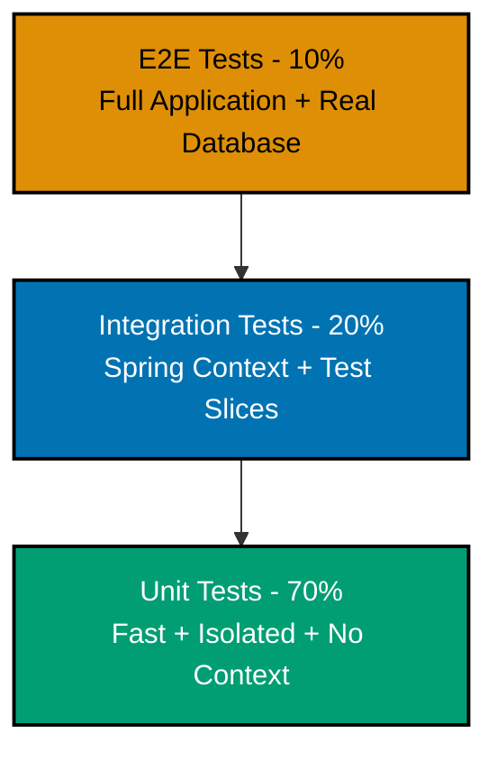

# Spring Boot Testing

## 📋 Quick Reference

- [Overview](#overview)
- [Unit Testing](#unit-testing)
- [Service Layer Testing](#service-layer-testing)
- [Controller Testing (@WebMvcTest)](#controller-testing-webmvctest)
- [Repository Testing (@DataJpaTest)](#repository-testing-datajpatest)
- [Integration Testing (@SpringBootTest)](#integration-testing-springboottest)
- [Test Configuration](#test-configuration)
- [Advanced Testing Techniques](#advanced-testing-techniques)
- [Testing Best Practices](#testing-best-practices)
- [OSE Platform Testing Examples](#ose-platform-testing-examples)
- [Related Documentation](#related-documentation)

## Overview

Testing is fundamental to Spring Boot application quality. This guide covers the complete testing spectrum from fast unit tests to comprehensive integration tests, with practical OSE Platform examples for Zakat, Murabaha, and Waqf domains.

### Testing Pyramid

Spring Boot supports a layered testing approach:



1. **Unit Tests** (70% of tests) - Fast, isolated, no Spring context
2. **Integration Tests** (20% of tests) - Spring context, test slices
3. **End-to-End Tests** (10% of tests) - Full application, real database

### Key Testing Annotations

| Annotation        | Purpose          | Spring Context | Speed   |
| ----------------- | ---------------- | -------------- | ------- |
| `@Test` (JUnit)   | Unit test        | No             | Fastest |
| `@WebMvcTest`     | Controller slice | Partial        | Fast    |
| `@DataJpaTest`    | Repository slice | Partial        | Fast    |
| `@SpringBootTest` | Full integration | Full           | Slow    |
| `@TestContainers` | Real database    | Full           | Slower  |

### Required Dependencies

```xml
<dependencies>
    <!-- JUnit 5 (included in spring-boot-starter-test) -->
    <dependency>
        <groupId>org.springframework.boot</groupId>
        <artifactId>spring-boot-starter-test</artifactId>
        <scope>test</scope>
    </dependency>

    <!-- TestContainers for real database testing -->
    <dependency>
        <groupId>org.testcontainers</groupId>
        <artifactId>postgresql</artifactId>
        <version>1.19.3</version>
        <scope>test</scope>
    </dependency>

    <!-- REST Assured for API testing (optional) -->
    <dependency>
        <groupId>io.rest-assured</groupId>
        <artifactId>rest-assured</artifactId>
        <version>5.4.0</version>
        <scope>test</scope>
    </dependency>
</dependencies>
```

**Note**: `spring-boot-starter-test` includes JUnit 5, Mockito, AssertJ, Hamcrest, and Spring Test.

## Unit Testing

Unit tests verify individual classes in isolation without Spring context. They're the fastest tests and should form the majority of your test suite.

### Testing Value Objects

Value objects (immutable domain objects) are ideal candidates for unit testing:

```java
import org.junit.jupiter.api.Test;
import static org.assertj.core.api.Assertions.*;

class MoneyTest {

    @Test
    void constructor_validInputs_createsInstance() {
        // Arrange & Act
        Money money = new Money(BigDecimal.TEN, "USD");

        // Assert
        assertThat(money.amount()).isEqualByComparingTo(BigDecimal.TEN);
        assertThat(money.currency()).isEqualTo("USD");
    }

    @Test
    void add_sameCurrency_addsAmounts() {
        // Arrange
        Money m1 = new Money(new BigDecimal("10.50"), "USD");
        Money m2 = new Money(new BigDecimal("5.25"), "USD");

        // Act
        Money result = m1.add(m2);

        // Assert
        assertThat(result.amount()).isEqualByComparingTo(new BigDecimal("15.75"));
        assertThat(result.currency()).isEqualTo("USD");
    }

    @Test
    void add_differentCurrencies_throwsException() {
        // Arrange
        Money usd = new Money(BigDecimal.TEN, "USD");
        Money eur = new Money(BigDecimal.TEN, "EUR");

        // Act & Assert
        assertThatThrownBy(() -> usd.add(eur))
            .isInstanceOf(IllegalArgumentException.class)
            .hasMessage("Cannot add different currencies: USD and EUR");
    }

    @Test
    void multiply_byFactor_multipliesAmount() {
        // Arrange
        Money money = new Money(new BigDecimal("10.00"), "USD");

        // Act
        Money result = money.multiply(new BigDecimal("2.5"));

        // Assert
        assertThat(result.amount()).isEqualByComparingTo(new BigDecimal("25.00"));
        assertThat(result.currency()).isEqualTo("USD");
    }
}
```

### Testing Domain Logic

Test business logic in domain entities:

```java
class ZakatCalculationTest {

    @Test
    void calculateZakat_wealthAboveNisab_calculates2Point5Percent() {
        // Arrange
        ZakatCalculation calculation = new ZakatCalculation(
            new Money(new BigDecimal("10000"), "USD"),  // wealth
            new Money(new BigDecimal("5000"), "USD")     // nisab threshold
        );

        // Act
        Money zakat = calculation.calculateZakat();

        // Assert
        assertThat(zakat.amount()).isEqualByComparingTo(new BigDecimal("250.00"));
        assertThat(calculation.isZakatDue()).isTrue();
    }

    @Test
    void calculateZakat_wealthBelowNisab_returnsZero() {
        // Arrange
        ZakatCalculation calculation = new ZakatCalculation(
            new Money(new BigDecimal("3000"), "USD"),   // wealth
            new Money(new BigDecimal("5000"), "USD")    // nisab threshold
        );

        // Act
        Money zakat = calculation.calculateZakat();

        // Assert
        assertThat(zakat.amount()).isEqualByComparingTo(BigDecimal.ZERO);
        assertThat(calculation.isZakatDue()).isFalse();
    }

    @Test
    void calculateZakat_wealthEqualsNisab_calculates2Point5Percent() {
        // Arrange
        ZakatCalculation calculation = new ZakatCalculation(
            new Money(new BigDecimal("5000"), "USD"),
            new Money(new BigDecimal("5000"), "USD")
        );

        // Act
        Money zakat = calculation.calculateZakat();

        // Assert
        assertThat(zakat.amount()).isEqualByComparingTo(new BigDecimal("125.00"));
        assertThat(calculation.isZakatDue()).isTrue();
    }
}
```

### Testing Utilities

Test utility classes and helper methods:

```java
class InstallmentScheduleCalculatorTest {

    private InstallmentScheduleCalculator calculator = new InstallmentScheduleCalculator();

    @Test
    void calculate_12Months_creates12Installments() {
        // Arrange
        Money principal = new Money(new BigDecimal("12000"), "USD");
        BigDecimal profitRate = new BigDecimal("0.10"); // 10%
        int months = 12;

        // Act
        List<Installment> schedule = calculator.calculate(principal, profitRate, months);

        // Assert
        assertThat(schedule).hasSize(12);

        // Each installment should be approximately $1100 (principal + profit divided by 12)
        Money expectedMonthly = new Money(new BigDecimal("1100.00"), "USD");
        assertThat(schedule.get(0).amount().amount())
            .isCloseTo(expectedMonthly.amount(), within(new BigDecimal("1.00")));
    }

    @Test
    void calculate_totalInstallments_equalsPrincipalPlusProfit() {
        // Arrange
        Money principal = new Money(new BigDecimal("10000"), "USD");
        BigDecimal profitRate = new BigDecimal("0.15"); // 15%
        int months = 24;

        // Act
        List<Installment> schedule = calculator.calculate(principal, profitRate, months);

        // Assert
        BigDecimal totalPaid = schedule.stream()
            .map(i -> i.amount().amount())
            .reduce(BigDecimal.ZERO, BigDecimal::add);

        BigDecimal expectedTotal = new BigDecimal("11500.00"); // 10000 + 1500
        assertThat(totalPaid).isCloseTo(expectedTotal, within(new BigDecimal("0.01")));
    }
}
```

### Testing DTOs

Test DTO validation and mapping:

```java
class ZakatCalculationRequestTest {

    private Validator validator = Validation.buildDefaultValidatorFactory().getValidator();

    @Test
    void validate_allFieldsValid_noViolations() {
        // Arrange
        ZakatCalculationRequest request = new ZakatCalculationRequest(
            new BigDecimal("10000"),
            "USD",
            LocalDate.now()
        );

        // Act
        Set<ConstraintViolation<ZakatCalculationRequest>> violations = validator.validate(request);

        // Assert
        assertThat(violations).isEmpty();
    }

    @Test
    void validate_negativeWealth_hasViolation() {
        // Arrange
        ZakatCalculationRequest request = new ZakatCalculationRequest(
            new BigDecimal("-100"),  // ❌ Negative wealth
            "USD",
            LocalDate.now()
        );

        // Act
        Set<ConstraintViolation<ZakatCalculationRequest>> violations = validator.validate(request);

        // Assert
        assertThat(violations).hasSize(1);
        assertThat(violations.iterator().next().getMessage())
            .contains("must be greater than or equal to 0");
    }

    @Test
    void validate_invalidCurrency_hasViolation() {
        // Arrange
        ZakatCalculationRequest request = new ZakatCalculationRequest(
            new BigDecimal("10000"),
            "INVALID",  // ❌ Invalid currency code
            LocalDate.now()
        );

        // Act
        Set<ConstraintViolation<ZakatCalculationRequest>> violations = validator.validate(request);

        // Assert
        assertThat(violations).hasSize(1);
        assertThat(violations.iterator().next().getMessage())
            .contains("must be a valid ISO 4217 currency code");
    }
}
```

## Service Layer Testing

Service layer tests verify business logic with mocked dependencies using Mockito.

### Basic Service Testing

```java
import org.junit.jupiter.api.Test;
import org.junit.jupiter.api.extension.ExtendWith;
import org.mockito.InjectMocks;
import org.mockito.Mock;
import org.mockito.junit.jupiter.MockitoExtension;

import static org.assertj.core.api.Assertions.*;
import static org.mockito.Mockito.*;

@ExtendWith(MockitoExtension.class)
class ZakatCalculationServiceTest {

    @Mock
    private ZakatCalculationRepository repository;

    @Mock
    private NisabThresholdService nisabService;

    @InjectMocks
    private ZakatCalculationService service;

    @Test
    void create_validRequest_savesCalculation() {
        // Arrange
        ZakatCalculationRequest request = new ZakatCalculationRequest(
            new BigDecimal("10000"),
            "USD",
            LocalDate.now()
        );

        Money nisab = new Money(new BigDecimal("5000"), "USD");
        when(nisabService.getCurrentNisab("USD")).thenReturn(nisab);

        ZakatCalculationEntity entity = new ZakatCalculationEntity();
        entity.setId("calc-123");
        when(repository.save(any(ZakatCalculationEntity.class))).thenReturn(entity);

        // Act
        ZakatCalculationResponse response = service.create(request);

        // Assert
        assertThat(response.getId()).isEqualTo("calc-123");
        verify(nisabService).getCurrentNisab("USD");
        verify(repository).save(any(ZakatCalculationEntity.class));
    }

    @Test
    void findById_existingId_returnsCalculation() {
        // Arrange
        String id = "calc-456";
        ZakatCalculationEntity entity = new ZakatCalculationEntity();
        entity.setId(id);
        entity.setWealth(new BigDecimal("10000"));
        entity.setCurrency("USD");

        when(repository.findById(id)).thenReturn(Optional.of(entity));

        // Act
        Optional<ZakatCalculationResponse> result = service.findById(id);

        // Assert
        assertThat(result).isPresent();
        assertThat(result.get().getId()).isEqualTo(id);
        verify(repository).findById(id);
    }

    @Test
    void findById_nonExistentId_returnsEmpty() {
        // Arrange
        String id = "non-existent";
        when(repository.findById(id)).thenReturn(Optional.empty());

        // Act
        Optional<ZakatCalculationResponse> result = service.findById(id);

        // Assert
        assertThat(result).isEmpty();
        verify(repository).findById(id);
    }
}
```

### Testing with Argument Captors

Verify exact arguments passed to mocked dependencies:

```java
@ExtendWith(MockitoExtension.class)
class MurabahaApplicationServiceTest {

    @Mock
    private MurabahaApplicationRepository repository;

    @Mock
    private InstallmentScheduleCalculator installmentCalculator;

    @InjectMocks
    private MurabahaApplicationService service;

    @Captor
    private ArgumentCaptor<MurabahaApplicationEntity> entityCaptor;

    @Test
    void create_validRequest_savesWithCorrectValues() {
        // Arrange
        MurabahaApplicationRequest request = new MurabahaApplicationRequest(
            new BigDecimal("50000"),
            "USD",
            new BigDecimal("0.10"),  // 10% profit
            24  // 24 months
        );

        List<Installment> schedule = List.of(/* ... */);
        when(installmentCalculator.calculate(any(), any(), anyInt())).thenReturn(schedule);

        MurabahaApplicationEntity savedEntity = new MurabahaApplicationEntity();
        savedEntity.setId("app-789");
        when(repository.save(any())).thenReturn(savedEntity);

        // Act
        MurabahaApplicationResponse response = service.create(request);

        // Assert
        verify(repository).save(entityCaptor.capture());

        MurabahaApplicationEntity capturedEntity = entityCaptor.getValue();
        assertThat(capturedEntity.getPrincipal()).isEqualByComparingTo(new BigDecimal("50000"));
        assertThat(capturedEntity.getCurrency()).isEqualTo("USD");
        assertThat(capturedEntity.getProfitRate()).isEqualByComparingTo(new BigDecimal("0.10"));
        assertThat(capturedEntity.getDurationMonths()).isEqualTo(24);
        assertThat(capturedEntity.getStatus()).isEqualTo(ApplicationStatus.PENDING);
    }
}
```

### Testing Exception Handling

Verify service error handling:

```java
@ExtendWith(MockitoExtension.class)
class WaqfDonationServiceTest {

    @Mock
    private WaqfDonationRepository repository;

    @Mock
    private WaqfProjectRepository projectRepository;

    @InjectMocks
    private WaqfDonationService service;

    @Test
    void createDonation_projectNotFound_throwsException() {
        // Arrange
        WaqfDonationRequest request = new WaqfDonationRequest(
            "non-existent-project",
            new BigDecimal("100"),
            "USD"
        );

        when(projectRepository.findById("non-existent-project"))
            .thenReturn(Optional.empty());

        // Act & Assert
        assertThatThrownBy(() -> service.createDonation(request))
            .isInstanceOf(ResourceNotFoundException.class)
            .hasMessage("WaqfProject not found with id: non-existent-project");

        verify(projectRepository).findById("non-existent-project");
        verify(repository, never()).save(any());  // Should not attempt to save
    }

    @Test
    void createDonation_projectInactive_throwsException() {
        // Arrange
        WaqfDonationRequest request = new WaqfDonationRequest(
            "inactive-project",
            new BigDecimal("100"),
            "USD"
        );

        WaqfProjectEntity project = new WaqfProjectEntity();
        project.setId("inactive-project");
        project.setStatus(ProjectStatus.INACTIVE);  // ❌ Inactive project

        when(projectRepository.findById("inactive-project"))
            .thenReturn(Optional.of(project));

        // Act & Assert
        assertThatThrownBy(() -> service.createDonation(request))
            .isInstanceOf(InvalidStateException.class)
            .hasMessage("Cannot donate to inactive project: inactive-project");

        verify(repository, never()).save(any());
    }
}
```

## Controller Testing (@WebMvcTest)

Controller tests verify HTTP layer behavior using MockMvc without starting a server.

### Basic Controller Testing

```java
import org.junit.jupiter.api.Test;
import org.springframework.beans.factory.annotation.Autowired;
import org.springframework.boot.test.autoconfigure.web.servlet.WebMvcTest;
import org.springframework.boot.test.mock.mockito.MockBean;
import org.springframework.http.MediaType;
import org.springframework.test.web.servlet.MockMvc;

import static org.mockito.Mockito.*;
import static org.springframework.test.web.servlet.request.MockMvcRequestBuilders.*;
import static org.springframework.test.web.servlet.result.MockMvcResultMatchers.*;

@WebMvcTest(ZakatCalculationController.class)
class ZakatCalculationControllerTest {

    @Autowired
    private MockMvc mockMvc;

    @MockBean
    private ZakatCalculationService service;

    @Test
    void create_validRequest_returns201Created() throws Exception {
        // Arrange
        ZakatCalculationResponse response = new ZakatCalculationResponse(
            "calc-123",
            new BigDecimal("10000"),
            "USD",
            new BigDecimal("250"),
            true,
            LocalDate.now()
        );

        when(service.create(any(ZakatCalculationRequest.class))).thenReturn(response);

        String requestJson = """
            {
                "wealth": 10000,
                "currency": "USD",
                "calculationDate": "2026-01-26"
            }
            """;

        // Act & Assert
        mockMvc.perform(post("/api/v1/zakat/calculations")
                .contentType(MediaType.APPLICATION_JSON)
                .content(requestJson))
            .andExpect(status().isCreated())
            .andExpect(header().exists("Location"))
            .andExpect(jsonPath("$.id").value("calc-123"))
            .andExpect(jsonPath("$.wealth").value(10000))
            .andExpect(jsonPath("$.zakatAmount").value(250))
            .andExpect(jsonPath("$.zakatDue").value(true));

        verify(service).create(any(ZakatCalculationRequest.class));
    }

    @Test
    void getById_existingId_returns200Ok() throws Exception {
        // Arrange
        String id = "calc-456";
        ZakatCalculationResponse response = new ZakatCalculationResponse(
            id,
            new BigDecimal("10000"),
            "USD",
            new BigDecimal("250"),
            true,
            LocalDate.now()
        );

        when(service.findById(id)).thenReturn(Optional.of(response));

        // Act & Assert
        mockMvc.perform(get("/api/v1/zakat/calculations/{id}", id))
            .andExpect(status().isOk())
            .andExpect(jsonPath("$.id").value(id))
            .andExpect(jsonPath("$.wealth").value(10000));

        verify(service).findById(id);
    }

    @Test
    void getById_nonExistentId_returns404NotFound() throws Exception {
        // Arrange
        String id = "non-existent";
        when(service.findById(id)).thenReturn(Optional.empty());

        // Act & Assert
        mockMvc.perform(get("/api/v1/zakat/calculations/{id}", id))
            .andExpect(status().isNotFound())
            .andExpect(jsonPath("$.message").value("ZakatCalculation not found with id: non-existent"));

        verify(service).findById(id);
    }
}
```

### Testing Request Validation

```java
@WebMvcTest(ZakatCalculationController.class)
class ZakatCalculationControllerValidationTest {

    @Autowired
    private MockMvc mockMvc;

    @MockBean
    private ZakatCalculationService service;

    @Test
    void create_negativeWealth_returns400BadRequest() throws Exception {
        // Arrange
        String requestJson = """
            {
                "wealth": -100,
                "currency": "USD",
                "calculationDate": "2026-01-26"
            }
            """;

        // Act & Assert
        mockMvc.perform(post("/api/v1/zakat/calculations")
                .contentType(MediaType.APPLICATION_JSON)
                .content(requestJson))
            .andExpect(status().isBadRequest())
            .andExpect(jsonPath("$.errors.wealth").exists())
            .andExpect(jsonPath("$.errors.wealth").value(containsString("must be greater than or equal to 0")));

        verify(service, never()).create(any());
    }

    @Test
    void create_invalidCurrency_returns400BadRequest() throws Exception {
        // Arrange
        String requestJson = """
            {
                "wealth": 10000,
                "currency": "INVALID",
                "calculationDate": "2026-01-26"
            }
            """;

        // Act & Assert
        mockMvc.perform(post("/api/v1/zakat/calculations")
                .contentType(MediaType.APPLICATION_JSON)
                .content(requestJson))
            .andExpect(status().isBadRequest())
            .andExpect(jsonPath("$.errors.currency").exists());

        verify(service, never()).create(any());
    }

    @Test
    void create_missingRequiredField_returns400BadRequest() throws Exception {
        // Arrange
        String requestJson = """
            {
                "wealth": 10000
            }
            """;

        // Act & Assert
        mockMvc.perform(post("/api/v1/zakat/calculations")
                .contentType(MediaType.APPLICATION_JSON)
                .content(requestJson))
            .andExpect(status().isBadRequest())
            .andExpect(jsonPath("$.errors").exists());

        verify(service, never()).create(any());
    }
}
```

### Testing with Security

```java
import org.springframework.security.test.context.support.WithMockUser;

@WebMvcTest(MurabahaApplicationController.class)
class MurabahaApplicationControllerSecurityTest {

    @Autowired
    private MockMvc mockMvc;

    @MockBean
    private MurabahaApplicationService service;

    @Test
    void create_noAuthentication_returns401Unauthorized() throws Exception {
        // Arrange
        String requestJson = """
            {
                "principal": 50000,
                "currency": "USD",
                "profitRate": 0.10,
                "durationMonths": 24
            }
            """;

        // Act & Assert
        mockMvc.perform(post("/api/v1/murabaha/applications")
                .contentType(MediaType.APPLICATION_JSON)
                .content(requestJson))
            .andExpect(status().isUnauthorized());

        verify(service, never()).create(any());
    }

    @Test
    @WithMockUser(username = "user@example.com", roles = "USER")
    void create_withAuthentication_returns201Created() throws Exception {
        // Arrange
        MurabahaApplicationResponse response = new MurabahaApplicationResponse(
            "app-789",
            new BigDecimal("50000"),
            "USD",
            ApplicationStatus.PENDING
        );

        when(service.create(any())).thenReturn(response);

        String requestJson = """
            {
                "principal": 50000,
                "currency": "USD",
                "profitRate": 0.10,
                "durationMonths": 24
            }
            """;

        // Act & Assert
        mockMvc.perform(post("/api/v1/murabaha/applications")
                .contentType(MediaType.APPLICATION_JSON)
                .content(requestJson))
            .andExpect(status().isCreated())
            .andExpect(jsonPath("$.id").value("app-789"));

        verify(service).create(any());
    }

    @Test
    @WithMockUser(username = "admin@example.com", roles = "ADMIN")
    void approve_withAdminRole_returns200Ok() throws Exception {
        // Arrange
        String id = "app-789";
        when(service.approve(id)).thenReturn(new MurabahaApplicationResponse(
            id,
            new BigDecimal("50000"),
            "USD",
            ApplicationStatus.APPROVED
        ));

        // Act & Assert
        mockMvc.perform(post("/api/v1/murabaha/applications/{id}/approve", id))
            .andExpect(status().isOk())
            .andExpect(jsonPath("$.status").value("APPROVED"));
    }

    @Test
    @WithMockUser(username = "user@example.com", roles = "USER")
    void approve_withUserRole_returns403Forbidden() throws Exception {
        // Arrange
        String id = "app-789";

        // Act & Assert
        mockMvc.perform(post("/api/v1/murabaha/applications/{id}/approve", id))
            .andExpect(status().isForbidden());

        verify(service, never()).approve(any());
    }
}
```

## Repository Testing (@DataJpaTest)

Repository tests verify data access layer with an embedded database.

### Basic Repository Testing

```java
import org.junit.jupiter.api.Test;
import org.springframework.beans.factory.annotation.Autowired;
import org.springframework.boot.test.autoconfigure.orm.jpa.DataJpaTest;
import org.springframework.boot.test.autoconfigure.orm.jpa.TestEntityManager;

import static org.assertj.core.api.Assertions.*;

@DataJpaTest
class ZakatCalculationRepositoryTest {

    @Autowired
    private TestEntityManager entityManager;

    @Autowired
    private ZakatCalculationRepository repository;

    @Test
    void save_validEntity_persistsToDatabase() {
        // Arrange
        ZakatCalculationEntity entity = new ZakatCalculationEntity();
        entity.setWealth(new BigDecimal("10000"));
        entity.setCurrency("USD");
        entity.setZakatAmount(new BigDecimal("250"));
        entity.setCalculationDate(LocalDate.now());

        // Act
        ZakatCalculationEntity saved = repository.save(entity);
        entityManager.flush();
        entityManager.clear();

        // Assert
        ZakatCalculationEntity found = entityManager.find(ZakatCalculationEntity.class, saved.getId());
        assertThat(found).isNotNull();
        assertThat(found.getWealth()).isEqualByComparingTo(new BigDecimal("10000"));
        assertThat(found.getCurrency()).isEqualTo("USD");
    }

    @Test
    void findById_existingId_returnsEntity() {
        // Arrange
        ZakatCalculationEntity entity = new ZakatCalculationEntity();
        entity.setWealth(new BigDecimal("10000"));
        entity.setCurrency("USD");
        entity.setZakatAmount(new BigDecimal("250"));
        entity.setCalculationDate(LocalDate.now());

        String id = entityManager.persistAndGetId(entity, String.class);
        entityManager.flush();
        entityManager.clear();

        // Act
        Optional<ZakatCalculationEntity> result = repository.findById(id);

        // Assert
        assertThat(result).isPresent();
        assertThat(result.get().getWealth()).isEqualByComparingTo(new BigDecimal("10000"));
    }
}
```

### Testing Custom Queries

```java
@DataJpaTest
class WaqfDonationRepositoryTest {

    @Autowired
    private TestEntityManager entityManager;

    @Autowired
    private WaqfDonationRepository repository;

    @Test
    void findByProjectId_existingProject_returnsDonations() {
        // Arrange
        WaqfProjectEntity project = new WaqfProjectEntity();
        project.setName("Masjid Construction");
        String projectId = entityManager.persistAndGetId(project, String.class);

        WaqfDonationEntity donation1 = new WaqfDonationEntity();
        donation1.setProjectId(projectId);
        donation1.setAmount(new BigDecimal("100"));
        donation1.setCurrency("USD");
        entityManager.persist(donation1);

        WaqfDonationEntity donation2 = new WaqfDonationEntity();
        donation2.setProjectId(projectId);
        donation2.setAmount(new BigDecimal("200"));
        donation2.setCurrency("USD");
        entityManager.persist(donation2);

        entityManager.flush();
        entityManager.clear();

        // Act
        List<WaqfDonationEntity> donations = repository.findByProjectId(projectId);

        // Assert
        assertThat(donations).hasSize(2);
        assertThat(donations)
            .extracting(WaqfDonationEntity::getAmount)
            .containsExactlyInAnyOrder(new BigDecimal("100"), new BigDecimal("200"));
    }

    @Test
    void sumDonationsByProjectId_multipleDonations_returnsTotal() {
        // Arrange
        WaqfProjectEntity project = new WaqfProjectEntity();
        project.setName("School Building");
        String projectId = entityManager.persistAndGetId(project, String.class);

        WaqfDonationEntity donation1 = new WaqfDonationEntity();
        donation1.setProjectId(projectId);
        donation1.setAmount(new BigDecimal("150.50"));
        donation1.setCurrency("USD");
        entityManager.persist(donation1);

        WaqfDonationEntity donation2 = new WaqfDonationEntity();
        donation2.setProjectId(projectId);
        donation2.setAmount(new BigDecimal("249.50"));
        donation2.setCurrency("USD");
        entityManager.persist(donation2);

        entityManager.flush();

        // Act
        BigDecimal total = repository.sumDonationsByProjectId(projectId);

        // Assert
        assertThat(total).isEqualByComparingTo(new BigDecimal("400.00"));
    }

    @Test
    void findByProjectId_emptyResult_returnsEmptyList() {
        // Arrange
        String nonExistentProjectId = "non-existent";

        // Act
        List<WaqfDonationEntity> donations = repository.findByProjectId(nonExistentProjectId);

        // Assert
        assertThat(donations).isEmpty();
    }
}
```

### Testing Pagination

```java
@DataJpaTest
class MurabahaApplicationRepositoryTest {

    @Autowired
    private TestEntityManager entityManager;

    @Autowired
    private MurabahaApplicationRepository repository;

    @Test
    void findAll_withPagination_returnsRequestedPage() {
        // Arrange
        for (int i = 0; i < 25; i++) {
            MurabahaApplicationEntity entity = new MurabahaApplicationEntity();
            entity.setPrincipal(new BigDecimal("10000"));
            entity.setCurrency("USD");
            entity.setStatus(ApplicationStatus.PENDING);
            entityManager.persist(entity);
        }
        entityManager.flush();

        PageRequest pageRequest = PageRequest.of(1, 10);  // Page 2, size 10

        // Act
        Page<MurabahaApplicationEntity> page = repository.findAll(pageRequest);

        // Assert
        assertThat(page.getNumber()).isEqualTo(1);
        assertThat(page.getSize()).isEqualTo(10);
        assertThat(page.getTotalElements()).isEqualTo(25);
        assertThat(page.getTotalPages()).isEqualTo(3);
        assertThat(page.getContent()).hasSize(10);
    }
}
```

## Integration Testing (@SpringBootTest)

Integration tests verify full application behavior with complete Spring context.

### Basic Integration Testing

```java
import org.junit.jupiter.api.Test;
import org.springframework.beans.factory.annotation.Autowired;
import org.springframework.boot.test.context.SpringBootTest;
import org.springframework.boot.test.web.client.TestRestTemplate;
import org.springframework.http.HttpStatus;
import org.springframework.http.ResponseEntity;
import org.springframework.test.context.TestPropertySource;
import org.testcontainers.containers.PostgreSQLContainer;
import org.testcontainers.junit.jupiter.Container;
import org.testcontainers.junit.jupiter.Testcontainers;

@SpringBootTest(webEnvironment = SpringBootTest.WebEnvironment.RANDOM_PORT)
@Testcontainers
@TestPropertySource(properties = {
    "spring.jpa.hibernate.ddl-auto=create-drop"
})
class ZakatCalculationIntegrationTest {

    @Container
    static PostgreSQLContainer<?> postgres = new PostgreSQLContainer<>("postgres:16")
        .withDatabaseName("testdb")
        .withUsername("test")
        .withPassword("test");

    @DynamicPropertySource
    static void configureDatabase(DynamicPropertyRegistry registry) {
        registry.add("spring.datasource.url", postgres::getJdbcUrl);
        registry.add("spring.datasource.username", postgres::getUsername);
        registry.add("spring.datasource.password", postgres::getPassword);
    }

    @Autowired
    private TestRestTemplate restTemplate;

    @Test
    void createCalculation_endToEnd_persistsAndReturns() {
        // Arrange
        ZakatCalculationRequest request = new ZakatCalculationRequest(
            new BigDecimal("10000"),
            "USD",
            LocalDate.now()
        );

        // Act - Create
        ResponseEntity<ZakatCalculationResponse> createResponse = restTemplate.postForEntity(
            "/api/v1/zakat/calculations",
            request,
            ZakatCalculationResponse.class
        );

        // Assert - Create
        assertThat(createResponse.getStatusCode()).isEqualTo(HttpStatus.CREATED);
        assertThat(createResponse.getHeaders().getLocation()).isNotNull();

        ZakatCalculationResponse created = createResponse.getBody();
        assertThat(created.getId()).isNotNull();
        assertThat(created.getWealth()).isEqualByComparingTo(new BigDecimal("10000"));

        // Act - Retrieve
        ResponseEntity<ZakatCalculationResponse> getResponse = restTemplate.getForEntity(
            "/api/v1/zakat/calculations/" + created.getId(),
            ZakatCalculationResponse.class
        );

        // Assert - Retrieve
        assertThat(getResponse.getStatusCode()).isEqualTo(HttpStatus.OK);
        assertThat(getResponse.getBody().getId()).isEqualTo(created.getId());
        assertThat(getResponse.getBody().getWealth()).isEqualByComparingTo(new BigDecimal("10000"));
    }
}
```

### Testing Complete Workflows

```java
@SpringBootTest(webEnvironment = SpringBootTest.WebEnvironment.RANDOM_PORT)
@Testcontainers
class MurabahaApplicationWorkflowTest {

    @Container
    static PostgreSQLContainer<?> postgres = new PostgreSQLContainer<>("postgres:16");

    @DynamicPropertySource
    static void configureDatabase(DynamicPropertyRegistry registry) {
        registry.add("spring.datasource.url", postgres::getJdbcUrl);
        registry.add("spring.datasource.username", postgres::getUsername);
        registry.add("spring.datasource.password", postgres::getPassword);
    }

    @Autowired
    private TestRestTemplate restTemplate;

    @Test
    void murabahaWorkflow_createApprovePayment_completesSuccessfully() {
        // Step 1: Create application
        MurabahaApplicationRequest createRequest = new MurabahaApplicationRequest(
            new BigDecimal("50000"),
            "USD",
            new BigDecimal("0.10"),
            24
        );

        ResponseEntity<MurabahaApplicationResponse> createResponse = restTemplate.postForEntity(
            "/api/v1/murabaha/applications",
            createRequest,
            MurabahaApplicationResponse.class
        );

        assertThat(createResponse.getStatusCode()).isEqualTo(HttpStatus.CREATED);
        String applicationId = createResponse.getBody().getId();
        assertThat(createResponse.getBody().getStatus()).isEqualTo(ApplicationStatus.PENDING);

        // Step 2: Approve application (admin action)
        ResponseEntity<MurabahaApplicationResponse> approveResponse = restTemplate.postForEntity(
            "/api/v1/murabaha/applications/" + applicationId + "/approve",
            null,
            MurabahaApplicationResponse.class
        );

        assertThat(approveResponse.getStatusCode()).isEqualTo(HttpStatus.OK);
        assertThat(approveResponse.getBody().getStatus()).isEqualTo(ApplicationStatus.APPROVED);

        // Step 3: Get installment schedule
        ResponseEntity<InstallmentScheduleResponse> scheduleResponse = restTemplate.getForEntity(
            "/api/v1/murabaha/applications/" + applicationId + "/schedule",
            InstallmentScheduleResponse.class
        );

        assertThat(scheduleResponse.getStatusCode()).isEqualTo(HttpStatus.OK);
        assertThat(scheduleResponse.getBody().getInstallments()).hasSize(24);

        // Step 4: Pay first installment
        String firstInstallmentId = scheduleResponse.getBody().getInstallments().get(0).getId();

        PaymentRequest paymentRequest = new PaymentRequest(
            firstInstallmentId,
            scheduleResponse.getBody().getInstallments().get(0).getAmount(),
            "USD"
        );

        ResponseEntity<PaymentResponse> paymentResponse = restTemplate.postForEntity(
            "/api/v1/murabaha/payments",
            paymentRequest,
            PaymentResponse.class
        );

        assertThat(paymentResponse.getStatusCode()).isEqualTo(HttpStatus.CREATED);
        assertThat(paymentResponse.getBody().getStatus()).isEqualTo(PaymentStatus.COMPLETED);
    }
}
```

## Test Configuration

### Test Properties

Create `src/test/resources/application-test.properties`:

```properties
# Use H2 for fast unit tests
spring.datasource.driver-class-name=org.h2.Driver
spring.datasource.url=jdbc:h2:mem:testdb;MODE=PostgreSQL
spring.datasource.username=sa
spring.datasource.password=

# JPA settings
spring.jpa.hibernate.ddl-auto=create-drop
spring.jpa.show-sql=true
spring.jpa.properties.hibernate.format_sql=true

# Disable Flyway for tests
spring.flyway.enabled=false

# Logging
logging.level.org.springframework.web=DEBUG
logging.level.org.hibernate.SQL=DEBUG
logging.level.org.hibernate.type.descriptor.sql.BasicBinder=TRACE
```

### Test Data Builders

Create reusable test data builders:

```java
public class ZakatCalculationTestBuilder {

    private BigDecimal wealth = new BigDecimal("10000");
    private String currency = "USD";
    private LocalDate calculationDate = LocalDate.now();

    public static ZakatCalculationTestBuilder aZakatCalculation() {
        return new ZakatCalculationTestBuilder();
    }

    public ZakatCalculationTestBuilder withWealth(BigDecimal wealth) {
        this.wealth = wealth;
        return this;
    }

    public ZakatCalculationTestBuilder withCurrency(String currency) {
        this.currency = currency;
        return this;
    }

    public ZakatCalculationTestBuilder withCalculationDate(LocalDate date) {
        this.calculationDate = date;
        return this;
    }

    public ZakatCalculationEntity buildEntity() {
        ZakatCalculationEntity entity = new ZakatCalculationEntity();
        entity.setWealth(wealth);
        entity.setCurrency(currency);
        entity.setCalculationDate(calculationDate);
        // Calculate zakat automatically
        BigDecimal nisab = new BigDecimal("5000");
        if (wealth.compareTo(nisab) >= 0) {
            entity.setZakatAmount(wealth.multiply(new BigDecimal("0.025")));
        } else {
            entity.setZakatAmount(BigDecimal.ZERO);
        }
        return entity;
    }

    public ZakatCalculationRequest buildRequest() {
        return new ZakatCalculationRequest(wealth, currency, calculationDate);
    }
}

// Usage
@Test
void example() {
    ZakatCalculationEntity entity = aZakatCalculation()
        .withWealth(new BigDecimal("20000"))
        .withCurrency("EUR")
        .buildEntity();
}
```

## Advanced Testing Techniques

### Parameterized Tests

Test multiple scenarios with different inputs:

```java
import org.junit.jupiter.params.ParameterizedTest;
import org.junit.jupiter.params.provider.CsvSource;
import org.junit.jupiter.params.provider.ValueSource;

class ZakatCalculationParameterizedTest {

    @ParameterizedTest
    @CsvSource({
        "10000, 5000, 250.00",   // Wealth above nisab
        "20000, 5000, 500.00",   // Double the nisab
        "5000, 5000, 125.00",    // Exactly nisab
        "3000, 5000, 0.00"       // Below nisab
    })
    void calculateZakat_variousWealthLevels_correctAmount(
        String wealth,
        String nisab,
        String expectedZakat
    ) {
        // Arrange
        ZakatCalculation calculation = new ZakatCalculation(
            new Money(new BigDecimal(wealth), "USD"),
            new Money(new BigDecimal(nisab), "USD")
        );

        // Act
        Money zakat = calculation.calculateZakat();

        // Assert
        assertThat(zakat.amount()).isEqualByComparingTo(new BigDecimal(expectedZakat));
    }

    @ParameterizedTest
    @ValueSource(strings = {"USD", "EUR", "GBP", "SAR", "AED"})
    void calculateZakat_variousCurrencies_acceptsValidCurrencies(String currency) {
        // Arrange
        ZakatCalculation calculation = new ZakatCalculation(
            new Money(new BigDecimal("10000"), currency),
            new Money(new BigDecimal("5000"), currency)
        );

        // Act
        Money zakat = calculation.calculateZakat();

        // Assert
        assertThat(zakat.currency()).isEqualTo(currency);
    }
}
```

### Testing Asynchronous Operations

```java
@SpringBootTest
class NotificationServiceTest {

    @Autowired
    private NotificationService notificationService;

    @Test
    void sendNotification_async_completesEventually() throws Exception {
        // Arrange
        String userId = "user-123";
        String message = "Your Zakat calculation is ready";

        // Act
        CompletableFuture<Void> future = notificationService.sendNotificationAsync(userId, message);

        // Assert - Wait for completion (with timeout)
        assertThatCode(() -> future.get(5, TimeUnit.SECONDS))
            .doesNotThrowAnyException();
    }
}
```

## Testing Best Practices

### Test Naming Convention

Use descriptive names that explain what is being tested:

```java
// ✅ GOOD - Describes what, when, and expected result
@Test
void calculateZakat_wealthAboveNisab_calculates2Point5Percent() { }

@Test
void createApplication_invalidCurrency_throwsValidationException() { }

@Test
void findById_nonExistentId_returnsEmpty() { }

// ❌ BAD - Vague, non-descriptive
@Test
void test1() { }

@Test
void testCalculation() { }

@Test
void whenUserCreatesApplication() { }
```

### AAA Pattern (Arrange-Act-Assert)

Structure tests clearly with comments:

```java
@Test
void example() {
    // Arrange - Setup test data and mocks
    ZakatCalculationRequest request = new ZakatCalculationRequest(/*...*/);
    when(service.calculate(any())).thenReturn(/*...*/);

    // Act - Execute the code under test
    ZakatCalculationResponse response = controller.create(request);

    // Assert - Verify expected outcomes
    assertThat(response.getZakatAmount()).isEqualByComparingTo(new BigDecimal("250"));
    verify(service).calculate(any());
}
```

### Test Independence

Each test should run independently:

```java
// ✅ GOOD - Self-contained test
@Test
void example1() {
    ZakatCalculationEntity entity = new ZakatCalculationEntity();
    entity.setWealth(new BigDecimal("10000"));
    repository.save(entity);

    assertThat(repository.findAll()).hasSize(1);
}

// ❌ BAD - Depends on execution order
private ZakatCalculationEntity sharedEntity;  // ❌ Shared state

@Test
void example1() {
    sharedEntity = repository.save(new ZakatCalculationEntity());
}

@Test
void example2() {
    assertThat(sharedEntity).isNotNull();  // ❌ Fails if example1 doesn't run first
}
```

### Test Coverage Guidelines

Aim for meaningful coverage, not just high percentages:

- **Unit Tests**: 80-90% coverage of business logic
- **Integration Tests**: Cover critical user workflows
- **Edge Cases**: Test boundary conditions, null values, exceptions
- **Happy Path**: Test common successful scenarios
- **Error Path**: Test error handling and validation

### Production Testing Checklist

Before deploying:

- [ ] Unit tests pass for all services and domain logic
- [ ] Integration tests pass with real database (TestContainers)
- [ ] Controller tests verify all HTTP endpoints
- [ ] Repository tests verify all custom queries
- [ ] Validation tests cover all @Valid constraints
- [ ] Exception handling tests verify error responses
- [ ] Security tests verify authentication and authorization
- [ ] Performance tests validate acceptable response times
- [ ] Test coverage meets team standards (>80% for critical code)

## OSE Platform Testing Examples

### Complete Zakat Calculation Test Suite

```java
@SpringBootTest(webEnvironment = SpringBootTest.WebEnvironment.RANDOM_PORT)
@Testcontainers
class CompleteZakatTest {

    @Container
    static PostgreSQLContainer<?> postgres = new PostgreSQLContainer<>("postgres:16");

    @DynamicPropertySource
    static void configureDatabase(DynamicPropertyRegistry registry) {
        registry.add("spring.datasource.url", postgres::getJdbcUrl);
    }

    @Autowired
    private TestRestTemplate restTemplate;

    @Test
    void zakatLifecycle_createCalculateRetrieve_completesSuccessfully() {
        // Step 1: Create calculation
        ZakatCalculationRequest request = new ZakatCalculationRequest(
            new BigDecimal("100000"),  // $100,000 wealth
            "USD",
            LocalDate.of(2026, 1, 26)
        );

        ResponseEntity<ZakatCalculationResponse> createResponse = restTemplate.postForEntity(
            "/api/v1/zakat/calculations",
            request,
            ZakatCalculationResponse.class
        );

        assertThat(createResponse.getStatusCode()).isEqualTo(HttpStatus.CREATED);
        String calculationId = createResponse.getBody().getId();
        assertThat(createResponse.getBody().getZakatAmount())
            .isEqualByComparingTo(new BigDecimal("2500.00"));  // 2.5% of 100,000

        // Step 2: Retrieve calculation
        ResponseEntity<ZakatCalculationResponse> getResponse = restTemplate.getForEntity(
            "/api/v1/zakat/calculations/" + calculationId,
            ZakatCalculationResponse.class
        );

        assertThat(getResponse.getStatusCode()).isEqualTo(HttpStatus.OK);
        assertThat(getResponse.getBody().getId()).isEqualTo(calculationId);

        // Step 3: List user's calculations
        ResponseEntity<PageResponse<ZakatCalculationResponse>> listResponse = restTemplate.exchange(
            "/api/v1/zakat/calculations?page=0&size=10",
            HttpMethod.GET,
            null,
            new ParameterizedTypeReference<>() {}
        );

        assertThat(listResponse.getStatusCode()).isEqualTo(HttpStatus.OK);
        assertThat(listResponse.getBody().getContent()).isNotEmpty();
    }
}
```

### Complete Murabaha Application Test Suite

```java
@SpringBootTest(webEnvironment = SpringBootTest.WebEnvironment.RANDOM_PORT)
@Testcontainers
class CompleteMurabahaTest {

    @Container
    static PostgreSQLContainer<?> postgres = new PostgreSQLContainer<>("postgres:16");

    @DynamicPropertySource
    static void configureDatabase(DynamicPropertyRegistry registry) {
        registry.add("spring.datasource.url", postgres::getJdbcUrl);
    }

    @Autowired
    private TestRestTemplate restTemplate;

    @Test
    void murabahaFullWorkflow_applicationToPayment_completesSuccessfully() {
        // Step 1: Submit application
        MurabahaApplicationRequest applicationRequest = new MurabahaApplicationRequest(
            new BigDecimal("50000"),  // $50,000 principal
            "USD",
            new BigDecimal("0.10"),   // 10% profit
            24                         // 24 months
        );

        ResponseEntity<MurabahaApplicationResponse> applicationResponse = restTemplate.postForEntity(
            "/api/v1/murabaha/applications",
            applicationRequest,
            MurabahaApplicationResponse.class
        );

        assertThat(applicationResponse.getStatusCode()).isEqualTo(HttpStatus.CREATED);
        String applicationId = applicationResponse.getBody().getId();

        // Step 2: Get installment schedule
        ResponseEntity<InstallmentScheduleResponse> scheduleResponse = restTemplate.getForEntity(
            "/api/v1/murabaha/applications/" + applicationId + "/schedule",
            InstallmentScheduleResponse.class
        );

        assertThat(scheduleResponse.getStatusCode()).isEqualTo(HttpStatus.OK);
        assertThat(scheduleResponse.getBody().getInstallments()).hasSize(24);

        BigDecimal monthlyPayment = scheduleResponse.getBody().getInstallments().get(0).getAmount();
        BigDecimal expectedMonthly = new BigDecimal("55000")  // 50000 + 5000 profit
            .divide(new BigDecimal("24"), 2, RoundingMode.HALF_UP);
        assertThat(monthlyPayment).isCloseTo(expectedMonthly, within(new BigDecimal("0.01")));
    }
}
```

### Complete Waqf Donation Test Suite

```java
@SpringBootTest(webEnvironment = SpringBootTest.WebEnvironment.RANDOM_PORT)
@Testcontainers
class CompleteWaqfTest {

    @Container
    static PostgreSQLContainer<?> postgres = new PostgreSQLContainer<>("postgres:16");

    @DynamicPropertySource
    static void configureDatabase(DynamicPropertyRegistry registry) {
        registry.add("spring.datasource.url", postgres::getJdbcUrl);
    }

    @Autowired
    private TestRestTemplate restTemplate;

    @Test
    void waqfProjectWorkflow_createProjectDonate_tracksProgress() {
        // Step 1: Create Waqf project
        WaqfProjectRequest projectRequest = new WaqfProjectRequest(
            "Masjid Construction",
            "Build new masjid in community",
            new BigDecimal("500000"),  // $500,000 goal
            "USD"
        );

        ResponseEntity<WaqfProjectResponse> projectResponse = restTemplate.postForEntity(
            "/api/v1/waqf/projects",
            projectRequest,
            WaqfProjectResponse.class
        );

        assertThat(projectResponse.getStatusCode()).isEqualTo(HttpStatus.CREATED);
        String projectId = projectResponse.getBody().getId();

        // Step 2: Make first donation
        WaqfDonationRequest donation1 = new WaqfDonationRequest(
            projectId,
            new BigDecimal("10000"),
            "USD"
        );

        ResponseEntity<WaqfDonationResponse> donationResponse1 = restTemplate.postForEntity(
            "/api/v1/waqf/donations",
            donation1,
            WaqfDonationResponse.class
        );

        assertThat(donationResponse1.getStatusCode()).isEqualTo(HttpStatus.CREATED);

        // Step 3: Make second donation
        WaqfDonationRequest donation2 = new WaqfDonationRequest(
            projectId,
            new BigDecimal("5000"),
            "USD"
        );

        restTemplate.postForEntity("/api/v1/waqf/donations", donation2, WaqfDonationResponse.class);

        // Step 4: Check project progress
        ResponseEntity<WaqfProjectResponse> updatedProject = restTemplate.getForEntity(
            "/api/v1/waqf/projects/" + projectId,
            WaqfProjectResponse.class
        );

        assertThat(updatedProject.getBody().getCurrentAmount())
            .isEqualByComparingTo(new BigDecimal("15000"));  // 10000 + 5000

        BigDecimal percentageFunded = updatedProject.getBody().getCurrentAmount()
            .divide(updatedProject.getBody().getGoalAmount(), 4, RoundingMode.HALF_UP)
            .multiply(new BigDecimal("100"));

        assertThat(percentageFunded).isEqualByComparingTo(new BigDecimal("3.00"));  // 3% funded
    }
}
```

## 🔗 Related Documentation

- [Spring Boot Best Practices](./ex-so-plwe-jvspbo__best-practices.md) - Comprehensive production patterns
- [Dependency Injection](./ex-so-plwe-jvspbo__dependency-injection.md) - Understanding Spring DI for testability
- [Data Access](./ex-so-plwe-jvspbo__data-access.md) - Repository and entity testing
- [REST APIs](./ex-so-plwe-jvspbo__rest-apis.md) - Controller testing patterns

---

**Next Steps:**

- Review [Domain-Driven Design](./ex-so-plwe-jvspbo__domain-driven-design.md) for testing bounded contexts
- Explore [Observability](./ex-so-plwe-jvspbo__observability.md) for monitoring test execution
- Check [Performance](./ex-so-plwe-jvspbo__performance.md) for load testing strategies

**Last Updated**: 2026-01-26
