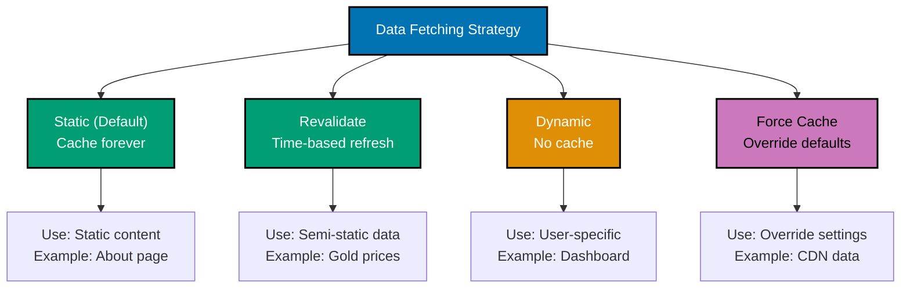

# Next.js Data Fetching

## Quick Reference

**Server-Side Fetching**:

- [Async Server Components](#async-server-components) - Direct data access
- [fetch API with Caching](#fetch-api-with-caching) - Enhanced fetch
- [Parallel Fetching](#parallel-data-fetching) - Promise.all optimization
- [Sequential Fetching](#sequential-data-fetching) - Dependent requests
- [Streaming with Suspense](#streaming-with-suspense) - Progressive loading

**Mutations**:

- [Server Actions](#server-actions) - Type-safe mutations
- [Form Handling](#form-handling-with-server-actions) - Progressive enhancement
- [Optimistic Updates](#optimistic-updates) - Instant feedback

**Client-Side**:

- [Client Fetching Patterns](#client-side-data-fetching) - SWR, React Query
- [Route Handlers](#route-handlers-for-client-fetching) - API endpoints

**Caching & Revalidation**:

- [Caching Strategies](#caching-strategies) - Cache configuration
- [Revalidation](#revalidation-patterns) - Time-based, on-demand

## Overview

Next.js provides multiple data fetching strategies optimized for different use cases. The **App Router** with React Server Components enables server-side data fetching by default, with automatic caching and intelligent revalidation.

**Key Patterns**:

- **Server Components** - fetch data directly (default)
- **Server Actions** - handle mutations with type safety
- **Route Handlers** - API endpoints for client-side fetching
- **Client Components** - browser-based data fetching when needed

This guide covers Next.js 14+ data fetching patterns for enterprise applications.

## Async Server Components

### Direct Database Access

Server Components can directly query databases:

```typescript
// app/(platform)/zakat/history/page.tsx
import { db } from '@/lib/db/client';
import { auth } from '@/lib/auth';
import { redirect } from 'next/navigation';

export default async function ZakatHistoryPage() {
  // Authentication
  const session = await auth();
  if (!session) {
    redirect('/login');
  }

  // Direct database query
  const calculations = await db.zakatCalculation.findMany({
    where: { userId: session.user.id },
    orderBy: { calculatedAt: 'desc' },
    take: 20,
  });

  // Calculate statistics on server
  const totalZakat = calculations.reduce((sum, calc) => sum + calc.zakatAmount, 0);
  const avgWealth = calculations.reduce((sum, calc) => sum + calc.wealth, 0) / calculations.length;

  return (
    <div>
      <h1>Zakat Calculation History</h1>

      <div className="grid grid-cols-2 gap-4 mb-8">
        <div className="border p-4 rounded">
          <p className="text-sm text-gray-600">Total Calculations</p>
          <p className="text-3xl font-bold">{calculations.length}</p>
        </div>
        <div className="border p-4 rounded">
          <p className="text-sm text-gray-600">Total Zakat</p>
          <p className="text-3xl font-bold">{totalZakat.toFixed(2)}</p>
        </div>
      </div>

      <div className="space-y-4">
        {calculations.map((calc) => (
          <div key={calc.id} className="border p-4 rounded">
            <div className="flex justify-between">
              <div>
                <p className="font-semibold">Wealth: {calc.wealth}</p>
                <p className="text-sm text-gray-600">Nisab: {calc.nisab}</p>
              </div>
              <div className="text-right">
                <p className="font-semibold text-green-600">Zakat: {calc.zakatAmount}</p>
                <p className="text-sm text-gray-600">
                  {calc.calculatedAt.toLocaleDateString()}
                </p>
              </div>
            </div>
            <p className="text-sm mt-2">
              Status: {calc.eligible ? 'Eligible' : 'Not Eligible'}
            </p>
          </div>
        ))}
      </div>
    </div>
  );
}
```

### External API Fetching

```typescript
// app/nisab/current/page.tsx
import { unstable_cache } from 'next/cache';

// Cache external API call
const getNisabFromAPI = unstable_cache(
  async () => {
    const res = await fetch('https://api.goldprice.com/current', {
      headers: {
        'Authorization': `Bearer ${process.env.GOLD_API_KEY}`,
      },
    });

    if (!res.ok) {
      throw new Error('Failed to fetch gold price');
    }

    const data = await res.json();

    // Calculate nisab based on gold price
    const NISAB_GOLD_GRAMS = 85;
    const nisab = data.goldPricePerGram * NISAB_GOLD_GRAMS;

    return {
      amount: nisab,
      currency: data.currency,
      goldPrice: data.goldPricePerGram,
      effectiveDate: new Date(),
    };
  },
  ['nisab-current'], // Cache key
  {
    revalidate: 3600, // Revalidate every hour
    tags: ['nisab'],
  }
);

export default async function CurrentNisabPage() {
  const nisab = await getNisabFromAPI();

  return (
    <div>
      <h1>Current Nisab Threshold</h1>
      <div className="border p-6 rounded-lg">
        <p className="text-sm text-gray-600">Nisab Amount</p>
        <p className="text-4xl font-bold">
          {nisab.amount.toFixed(2)} {nisab.currency}
        </p>
        <p className="text-sm text-gray-600 mt-2">
          Based on {NISAB_GOLD_GRAMS}g of gold at {nisab.goldPrice} per gram
        </p>
        <p className="text-xs text-gray-500 mt-2">
          Last updated: {nisab.effectiveDate.toLocaleString()}
        </p>
      </div>
    </div>
  );
}
```

## fetch API with Caching

### Enhanced fetch in Next.js

Next.js extends the native `fetch` API with automatic caching:

```typescript
// Default: cache until manually invalidated
const res = await fetch("https://api.example.com/data");

// Revalidate every 60 seconds
const res = await fetch("https://api.example.com/data", {
  next: { revalidate: 60 },
});

// No caching
const res = await fetch("https://api.example.com/data", {
  cache: "no-store",
});

// Force cache
const res = await fetch("https://api.example.com/data", {
  cache: "force-cache",
});

// Tagged cache for on-demand revalidation
const res = await fetch("https://api.example.com/data", {
  next: { tags: ["data"] },
});
```

### OSE Platform: Murabaha Vendor Pricing

```typescript
// app/(platform)/murabaha/vendors/[id]/page.tsx
import { notFound } from 'next/navigation';

interface Vendor {
  id: string;
  name: string;
  category: string;
  priceData: {
    items: Array<{
      name: string;
      price: number;
      markup: number;
    }>;
  };
}

async function getVendorPricing(vendorId: string): Promise<Vendor> {
  const res = await fetch(`https://api.oseplatform.com/vendors/${vendorId}/pricing`, {
    headers: {
      'Authorization': `Bearer ${process.env.API_KEY}`,
    },
    next: {
      revalidate: 300, // Revalidate every 5 minutes
      tags: [`vendor-${vendorId}`, 'pricing'],
    },
  });

  if (!res.ok) {
    if (res.status === 404) {
      notFound();
    }
    throw new Error('Failed to fetch vendor pricing');
  }

  return res.json();
}

export default async function VendorPricingPage({
  params,
}: {
  params: { id: string };
}) {
  const vendor = await getVendorPricing(params.id);

  return (
    <div>
      <h1>{vendor.name} - Pricing</h1>
      <p className="text-gray-600 mb-4">Category: {vendor.category}</p>

      <div className="space-y-4">
        {vendor.priceData.items.map((item, index) => (
          <div key={index} className="border p-4 rounded">
            <div className="flex justify-between">
              <span className="font-semibold">{item.name}</span>
              <span className="text-gray-600">Cost: ${item.price}</span>
            </div>
            <div className="flex justify-between mt-2">
              <span className="text-sm text-gray-500">
                Markup: {item.markup}%
              </span>
              <span className="font-bold text-green-600">
                Final: ${(item.price * (1 + item.markup / 100)).toFixed(2)}
              </span>
            </div>
          </div>
        ))}
      </div>
    </div>
  );
}
```

## Parallel Data Fetching

### Multiple Requests Simultaneously

```typescript
// app/(platform)/dashboard/page.tsx
import { db } from '@/lib/db/client';
import { auth } from '@/lib/auth';

async function getZakatStats(userId: string) {
  return db.zakatCalculation.aggregate({
    where: { userId },
    _sum: { zakatAmount: true },
    _count: true,
    _avg: { wealth: true },
  });
}

async function getMurabahaStats(userId: string) {
  return db.murabahaApplication.aggregate({
    where: { userId },
    _sum: { requestedAmount: true, totalAmount: true },
    _count: true,
  });
}

async function getWaqfStats(userId: string) {
  return db.waqfDonation.aggregate({
    where: { userId },
    _sum: { amount: true },
    _count: true,
  });
}

async function getRecentActivity(userId: string) {
  return db.activityLog.findMany({
    where: { userId },
    orderBy: { timestamp: 'desc' },
    take: 5,
  });
}

export default async function DashboardPage() {
  const session = await auth();

  // Fetch all data in parallel
  const [zakatStats, murabahaStats, waqfStats, recentActivity] = await Promise.all([
    getZakatStats(session.user.id),
    getMurabahaStats(session.user.id),
    getWaqfStats(session.user.id),
    getRecentActivity(session.user.id),
  ]);

  return (
    <div>
      <h1>Dashboard</h1>

      <div className="grid grid-cols-3 gap-4 mb-8">
        <div className="border p-4 rounded">
          <h2 className="text-lg font-semibold mb-2">Zakat</h2>
          <p>Calculations: {zakatStats._count}</p>
          <p>Total Zakat: {zakatStats._sum.zakatAmount || 0}</p>
          <p>Avg Wealth: {zakatStats._avg.wealth?.toFixed(2) || 0}</p>
        </div>

        <div className="border p-4 rounded">
          <h2 className="text-lg font-semibold mb-2">Murabaha</h2>
          <p>Applications: {murabahaStats._count}</p>
          <p>Requested: {murabahaStats._sum.requestedAmount || 0}</p>
          <p>Total Contracts: {murabahaStats._sum.totalAmount || 0}</p>
        </div>

        <div className="border p-4 rounded">
          <h2 className="text-lg font-semibold mb-2">Waqf</h2>
          <p>Donations: {waqfStats._count}</p>
          <p>Total Donated: {waqfStats._sum.amount || 0}</p>
        </div>
      </div>

      <div className="border p-4 rounded">
        <h2 className="text-lg font-semibold mb-4">Recent Activity</h2>
        {recentActivity.map((activity) => (
          <div key={activity.id} className="mb-2">
            <p className="text-sm">{activity.description}</p>
            <p className="text-xs text-gray-500">
              {activity.timestamp.toLocaleString()}
            </p>
          </div>
        ))}
      </div>
    </div>
  );
}
```

## Sequential Data Fetching

### Dependent Requests

```typescript
// app/(platform)/murabaha/applications/[id]/page.tsx
import { db } from '@/lib/db/client';
import { notFound } from 'next/navigation';

export default async function MurabahaApplicationDetailPage({
  params,
}: {
  params: { id: string };
}) {
  // Fetch application first
  const application = await db.murabahaApplication.findUnique({
    where: { id: params.id },
    include: {
      user: {
        select: { id: true, name: true, email: true },
      },
      vendor: true,
    },
  });

  if (!application) {
    notFound();
  }

  // Fetch installments based on application
  const installments = await db.murabahaInstallment.findMany({
    where: { applicationId: application.id },
    orderBy: { dueDate: 'asc' },
  });

  // Fetch payment history based on installments
  const payments = await db.payment.findMany({
    where: {
      installmentId: { in: installments.map(i => i.id) },
    },
    orderBy: { paidAt: 'desc' },
  });

  // Calculate derived data
  const totalPaid = payments
    .filter(p => p.status === 'completed')
    .reduce((sum, p) => sum + p.amount, 0);

  const totalOutstanding = application.totalAmount - totalPaid;

  const nextInstallment = installments.find(
    i => i.status === 'pending' && i.dueDate > new Date()
  );

  return (
    <div>
      <h1>Murabaha Application #{application.applicationNumber}</h1>

      <section className="mb-8">
        <h2 className="text-xl font-semibold mb-4">Application Details</h2>
        <div className="grid grid-cols-2 gap-4">
          <div>
            <p className="text-sm text-gray-600">Applicant</p>
            <p className="font-semibold">{application.user.name}</p>
          </div>
          <div>
            <p className="text-sm text-gray-600">Vendor</p>
            <p className="font-semibold">{application.vendor.name}</p>
          </div>
          <div>
            <p className="text-sm text-gray-600">Status</p>
            <p className="font-semibold">{application.status}</p>
          </div>
          <div>
            <p className="text-sm text-gray-600">Item</p>
            <p className="font-semibold">{application.itemDescription}</p>
          </div>
        </div>
      </section>

      <section className="mb-8">
        <h2 className="text-xl font-semibold mb-4">Financial Summary</h2>
        <div className="grid grid-cols-3 gap-4">
          <div className="border p-4 rounded">
            <p className="text-sm text-gray-600">Total Contract</p>
            <p className="text-2xl font-bold">{application.totalAmount}</p>
          </div>
          <div className="border p-4 rounded">
            <p className="text-sm text-gray-600">Total Paid</p>
            <p className="text-2xl font-bold text-green-600">{totalPaid}</p>
          </div>
          <div className="border p-4 rounded">
            <p className="text-sm text-gray-600">Outstanding</p>
            <p className="text-2xl font-bold text-orange-600">{totalOutstanding}</p>
          </div>
        </div>

        {nextInstallment && (
          <div className="mt-4 p-4 bg-blue-50 border border-blue-200 rounded">
            <p className="font-semibold">Next Payment</p>
            <p>Due: {nextInstallment.dueDate.toLocaleDateString()}</p>
            <p>Amount: {nextInstallment.amount}</p>
          </div>
        )}
      </section>

      <section className="mb-8">
        <h2 className="text-xl font-semibold mb-4">Installment Schedule</h2>
        <div className="space-y-2">
          {installments.map((installment) => (
            <div key={installment.id} className="border p-4 rounded">
              <div className="flex justify-between">
                <div>
                  <p className="font-semibold">
                    Installment #{installment.installmentNumber}
                  </p>
                  <p className="text-sm text-gray-600">
                    Due: {installment.dueDate.toLocaleDateString()}
                  </p>
                </div>
                <div className="text-right">
                  <p className="font-semibold">{installment.amount}</p>
                  <p className="text-sm">{installment.status}</p>
                </div>
              </div>
            </div>
          ))}
        </div>
      </section>

      <section>
        <h2 className="text-xl font-semibold mb-4">Payment History</h2>
        <div className="space-y-2">
          {payments.map((payment) => (
            <div key={payment.id} className="border p-3 rounded">
              <div className="flex justify-between">
                <div>
                  <p className="font-semibold">{payment.amount}</p>
                  <p className="text-sm text-gray-600">
                    {payment.paidAt?.toLocaleString()}
                  </p>
                </div>
                <div>
                  <span
                    className={`px-2 py-1 rounded text-sm ${
                      payment.status === 'completed'
                        ? 'bg-green-100 text-green-800'
                        : 'bg-gray-100 text-gray-800'
                    }`}
                  >
                    {payment.status}
                  </span>
                </div>
              </div>
            </div>
          ))}
        </div>
      </section>
    </div>
  );
}
```

## Streaming with Suspense

### Progressive Component Loading

```typescript
// app/(platform)/dashboard/page.tsx
import { Suspense } from 'react';
import { ZakatStats } from '@/components/dashboard/ZakatStats';
import { MurabahaStats } from '@/components/dashboard/MurabahaStats';
import { WaqfStats } from '@/components/dashboard/WaqfStats';
import { RecentActivity } from '@/components/dashboard/RecentActivity';

export default function DashboardPage() {
  return (
    <div>
      <h1>Dashboard</h1>

      {/* Static content loads immediately */}
      <p className="text-gray-600 mb-8">
        Welcome to your financial dashboard
      </p>

      <div className="grid grid-cols-3 gap-4 mb-8">
        {/* Each section streams independently */}
        <Suspense
          fallback={
            <div className="border p-4 rounded animate-pulse">
              <div className="h-4 bg-gray-200 rounded w-3/4 mb-2"></div>
              <div className="h-8 bg-gray-200 rounded w-1/2"></div>
            </div>
          }
        >
          <ZakatStats />
        </Suspense>

        <Suspense
          fallback={
            <div className="border p-4 rounded animate-pulse">
              <div className="h-4 bg-gray-200 rounded w-3/4 mb-2"></div>
              <div className="h-8 bg-gray-200 rounded w-1/2"></div>
            </div>
          }
        >
          <MurabahaStats />
        </Suspense>

        <Suspense
          fallback={
            <div className="border p-4 rounded animate-pulse">
              <div className="h-4 bg-gray-200 rounded w-3/4 mb-2"></div>
              <div className="h-8 bg-gray-200 rounded w-1/2"></div>
            </div>
          }
        >
          <WaqfStats />
        </Suspense>
      </div>

      <Suspense
        fallback={
          <div className="border p-4 rounded">
            <p className="text-gray-500">Loading recent activity...</p>
          </div>
        }
      >
        <RecentActivity />
      </Suspense>
    </div>
  );
}
```

```typescript
// components/dashboard/ZakatStats.tsx (Server Component)
import { db } from '@/lib/db/client';
import { auth } from '@/lib/auth';

export async function ZakatStats() {
  const session = await auth();

  // Simulate slow query
  await new Promise(resolve => setTimeout(resolve, 1000));

  const stats = await db.zakatCalculation.aggregate({
    where: { userId: session.user.id },
    _sum: { zakatAmount: true },
    _count: true,
  });

  return (
    <div className="border p-4 rounded">
      <h2 className="text-lg font-semibold mb-2">Zakat</h2>
      <p>Calculations: {stats._count}</p>
      <p>Total Zakat: {stats._sum.zakatAmount || 0}</p>
    </div>
  );
}
```

## Server Actions

### Type-Safe Mutations

```typescript
// features/zakat/actions/calculateZakat.ts
"use server";

import { db } from "@/lib/db/client";
import { auth } from "@/lib/auth";
import { revalidatePath } from "next/cache";
import { redirect } from "next/navigation";
import { z } from "zod";

const zakatSchema = z.object({
  wealth: z.number().positive(),
  nisab: z.number().positive(),
  notes: z.string().optional(),
});

interface CalculationResult {
  zakatAmount: number;
  eligible: boolean;
  calculationId: string;
}

interface FormState {
  result?: CalculationResult;
  error?: string;
}

export async function calculateZakat(prevState: FormState | null, formData: FormData): Promise<FormState> {
  // Authentication
  const session = await auth();
  if (!session) {
    return { error: "Unauthorized. Please log in." };
  }

  // Validation
  const wealth = parseFloat(formData.get("wealth") as string);
  const nisab = parseFloat(formData.get("nisab") as string);
  const notes = formData.get("notes") as string;

  const validation = zakatSchema.safeParse({ wealth, nisab, notes });

  if (!validation.success) {
    return { error: validation.error.errors[0].message };
  }

  // Business logic
  const eligible = wealth >= nisab;
  const zakatAmount = eligible ? wealth * 0.025 : 0;

  try {
    // Save to database
    const calculation = await db.zakatCalculation.create({
      data: {
        userId: session.user.id,
        wealth,
        nisab,
        zakatAmount,
        eligible,
        notes,
        calculatedAt: new Date(),
        hijriDate: getHijriDate(), // Assume helper function
      },
    });

    // Revalidate affected pages
    revalidatePath("/zakat/history");
    revalidatePath("/dashboard");

    return {
      result: {
        zakatAmount,
        eligible,
        calculationId: calculation.id,
      },
    };
  } catch (error) {
    console.error("Failed to save zakat calculation:", error);
    return { error: "Failed to save calculation. Please try again." };
  }
}

function getHijriDate(): string {
  // Implementation for Hijri date conversion
  return new Date().toLocaleDateString("ar-SA-u-ca-islamic");
}
```

### Form Handling with Server Actions

```typescript
// features/zakat/components/ZakatCalculationForm.tsx
'use client';

import { useFormState, useFormStatus } from 'react-dom';
import { calculateZakat } from '../actions/calculateZakat';

function SubmitButton() {
  const { pending } = useFormStatus();

  return (
    <button
      type="submit"
      disabled={pending}
      className="px-4 py-2 bg-blue-600 text-white rounded disabled:opacity-50"
    >
      {pending ? 'Calculating...' : 'Calculate Zakat'}
    </button>
  );
}

interface ZakatCalculationFormProps {
  defaultNisab: number;
}

export function ZakatCalculationForm({ defaultNisab }: ZakatCalculationFormProps) {
  const [state, formAction] = useFormState(calculateZakat, null);

  return (
    <form action={formAction} className="space-y-4">
      <div>
        <label htmlFor="wealth" className="block text-sm font-medium mb-1">
          Your Total Wealth
        </label>
        <input
          type="number"
          id="wealth"
          name="wealth"
          step="0.01"
          required
          className="w-full border rounded px-3 py-2"
          placeholder="Enter your total wealth"
        />
      </div>

      <div>
        <label htmlFor="nisab" className="block text-sm font-medium mb-1">
          Nisab Threshold
        </label>
        <input
          type="number"
          id="nisab"
          name="nisab"
          defaultValue={defaultNisab}
          step="0.01"
          required
          className="w-full border rounded px-3 py-2"
        />
        <p className="text-sm text-gray-600 mt-1">
          Current nisab based on gold price
        </p>
      </div>

      <div>
        <label htmlFor="notes" className="block text-sm font-medium mb-1">
          Notes (Optional)
        </label>
        <textarea
          id="notes"
          name="notes"
          rows={3}
          className="w-full border rounded px-3 py-2"
          placeholder="Add any notes about this calculation"
        />
      </div>

      <SubmitButton />

      {state?.error && (
        <div className="p-4 bg-red-50 border border-red-200 rounded">
          <p className="text-red-800">{state.error}</p>
        </div>
      )}

      {state?.result && (
        <div className="p-4 bg-green-50 border border-green-200 rounded">
          <h3 className="font-semibold text-green-800 mb-2">Calculation Complete</h3>
          <p className="text-green-800">
            {state.result.eligible
              ? `You are eligible to pay Zakat. Amount: ${state.result.zakatAmount}`
              : 'You are not yet eligible to pay Zakat.'}
          </p>
          <p className="text-sm text-green-700 mt-2">
            Calculation ID: {state.result.calculationId}
          </p>
        </div>
      )}
    </form>
  );
}
```

## Optimistic Updates

### Instant UI Feedback

```typescript
// features/waqf/components/DonationButton.tsx
'use client';

import { useOptimistic, useTransition } from 'react';
import { makeDonation } from '../actions/makeDonation';

interface Donation {
  id: string;
  amount: number;
  projectName: string;
  timestamp: Date;
}

interface DonationButtonProps {
  projectId: string;
  projectName: string;
  amount: number;
  donations: Donation[];
}

export function DonationButton({
  projectId,
  projectName,
  amount,
  donations,
}: DonationButtonProps) {
  const [isPending, startTransition] = useTransition();
  const [optimisticDonations, addOptimisticDonation] = useOptimistic(
    donations,
    (state, newDonation: Donation) => [...state, newDonation]
  );

  const handleDonate = () => {
    const optimisticDonation: Donation = {
      id: `temp-${Date.now()}`,
      amount,
      projectName,
      timestamp: new Date(),
    };

    startTransition(async () => {
      addOptimisticDonation(optimisticDonation);
      await makeDonation(projectId, amount);
    });
  };

  return (
    <div>
      <button
        onClick={handleDonate}
        disabled={isPending}
        className="px-4 py-2 bg-green-600 text-white rounded disabled:opacity-50"
      >
        {isPending ? 'Processing...' : `Donate $${amount}`}
      </button>

      <div className="mt-4">
        <h3 className="font-semibold mb-2">Recent Donations</h3>
        {optimisticDonations.map((donation) => (
          <div
            key={donation.id}
            className={`p-2 border rounded mb-2 ${
              donation.id.startsWith('temp-') ? 'opacity-50' : ''
            }`}
          >
            <p className="font-semibold">${donation.amount}</p>
            <p className="text-sm text-gray-600">{donation.projectName}</p>
            <p className="text-xs text-gray-500">
              {donation.timestamp.toLocaleString()}
            </p>
          </div>
        ))}
      </div>
    </div>
  );
}
```

## Client-Side Data Fetching

### Using SWR

```typescript
// features/dashboard/components/LiveNisabDisplay.tsx
'use client';

import useSWR from 'swr';

interface NisabData {
  amount: number;
  currency: string;
  goldPrice: number;
  lastUpdated: string;
}

const fetcher = (url: string) => fetch(url).then((res) => res.json());

export function LiveNisabDisplay() {
  const { data, error, isLoading } = useSWR<NisabData>(
    '/api/nisab/current',
    fetcher,
    {
      refreshInterval: 60000, // Refresh every minute
      revalidateOnFocus: true,
    }
  );

  if (error) {
    return <div className="text-red-600">Failed to load nisab data</div>;
  }

  if (isLoading) {
    return <div className="animate-pulse">Loading nisab...</div>;
  }

  return (
    <div className="border p-4 rounded">
      <h3 className="font-semibold mb-2">Current Nisab</h3>
      <p className="text-2xl font-bold">
        {data.amount.toFixed(2)} {data.currency}
      </p>
      <p className="text-sm text-gray-600">
        Gold price: ${data.goldPrice}/gram
      </p>
      <p className="text-xs text-gray-500">
        Updated: {new Date(data.lastUpdated).toLocaleString()}
      </p>
    </div>
  );
}
```

### Using TanStack Query

```typescript
// features/murabaha/components/ApplicationsList.tsx
'use client';

import { useQuery } from '@tanstack/react-query';

interface Application {
  id: string;
  applicationNumber: string;
  status: string;
  requestedAmount: number;
  vendor: {
    name: string;
  };
}

async function fetchApplications(): Promise<Application[]> {
  const res = await fetch('/api/murabaha/applications');
  if (!res.ok) {
    throw new Error('Failed to fetch applications');
  }
  return res.json();
}

export function ApplicationsList() {
  const {
    data: applications,
    isLoading,
    error,
  } = useQuery({
    queryKey: ['murabaha-applications'],
    queryFn: fetchApplications,
    staleTime: 30000, // Consider data fresh for 30 seconds
    refetchOnWindowFocus: true,
  });

  if (isLoading) {
    return <div>Loading applications...</div>;
  }

  if (error) {
    return <div className="text-red-600">Error loading applications</div>;
  }

  return (
    <div className="space-y-4">
      {applications?.map((app) => (
        <div key={app.id} className="border p-4 rounded">
          <div className="flex justify-between">
            <div>
              <p className="font-semibold">#{app.applicationNumber}</p>
              <p className="text-sm text-gray-600">{app.vendor.name}</p>
            </div>
            <div className="text-right">
              <p className="font-semibold">${app.requestedAmount}</p>
              <p className="text-sm">{app.status}</p>
            </div>
          </div>
        </div>
      ))}
    </div>
  );
}
```

## Route Handlers for Client Fetching

### API Endpoint

```typescript
// app/api/nisab/current/route.ts
import { NextResponse } from "next/server";
import { db } from "@/lib/db/client";

export const dynamic = "force-dynamic";
export const revalidate = 60; // Revalidate every 60 seconds

export async function GET() {
  try {
    // Fetch latest nisab from database
    const nisab = await db.nisab.findFirst({
      orderBy: { effectiveDate: "desc" },
    });

    if (!nisab) {
      return NextResponse.json({ error: "Nisab threshold not found" }, { status: 404 });
    }

    // Fetch current gold price from external API
    const goldPriceRes = await fetch("https://api.goldprice.com/current", {
      headers: {
        Authorization: `Bearer ${process.env.GOLD_API_KEY}`,
      },
    });

    const goldPriceData = await goldPriceRes.json();

    // Calculate current nisab
    const NISAB_GOLD_GRAMS = 85;
    const currentNisab = goldPriceData.goldPricePerGram * NISAB_GOLD_GRAMS;

    return NextResponse.json({
      amount: currentNisab,
      currency: goldPriceData.currency,
      goldPrice: goldPriceData.goldPricePerGram,
      lastUpdated: new Date().toISOString(),
      historicalNisab: nisab.amount,
    });
  } catch (error) {
    console.error("Error fetching nisab:", error);
    return NextResponse.json({ error: "Internal server error" }, { status: 500 });
  }
}
```

## Caching Strategies

### Cache Configuration Matrix



### Configuration Examples

```typescript
// Static (default)
const res = await fetch("https://api.example.com/static-data");

// Revalidate every 60 seconds
const res = await fetch("https://api.example.com/semi-static", {
  next: { revalidate: 60 },
});

// No caching
const res = await fetch("https://api.example.com/dynamic", {
  cache: "no-store",
});

// Force cache (use cached version)
const res = await fetch("https://api.example.com/cached", {
  cache: "force-cache",
});

// Tagged cache for on-demand revalidation
const res = await fetch("https://api.example.com/tagged", {
  next: { tags: ["products"] },
});
```

## Revalidation Patterns

### Time-Based Revalidation

```typescript
// app/products/page.tsx
export const revalidate = 3600; // Revalidate every hour

export default async function ProductsPage() {
  const products = await db.product.findMany();
  return <div>{/* Render products */}</div>;
}
```

### On-Demand Revalidation

```typescript
// features/products/actions/updateProduct.ts
"use server";

import { revalidatePath, revalidateTag } from "next/cache";
import { db } from "@/lib/db/client";

export async function updateProduct(productId: string, data: ProductData) {
  await db.product.update({
    where: { id: productId },
    data,
  });

  // Revalidate specific path
  revalidatePath("/products");
  revalidatePath(`/products/${productId}`);

  // Revalidate all routes with tag
  revalidateTag("products");
}
```

## Best Practices

### ✅ Do

- **Use Server Components** for data fetching by default
- **Fetch in parallel** when possible (Promise.all)
- **Use Suspense** for streaming
- **Cache external API calls** appropriately
- **Use Server Actions** for mutations
- **Validate input** before processing
- **Handle errors** gracefully
- **Use optimistic updates** for better UX

### ❌ Don't

- **Don't fetch in Client Components** unless necessary
- **Don't over-cache** dynamic data
- **Don't expose secrets** in client-side code
- **Don't skip error handling**
- **Don't fetch sequentially** when parallel is possible
- **Don't ignore loading states**
- **Don't skip revalidation** after mutations

## Related Documentation

**Core Next.js**:

- [Server Components](./ex-so-plwe-tsnext__server-components.md) - RSC patterns
- [Rendering](./ex-so-plwe-tsnext__rendering.md) - Rendering strategies
- [API Routes](./ex-so-plwe-tsnext__api-routes.md) - Route handlers
- [Caching](./ex-so-plwe-tsnext__performance.md#caching-strategies) - Performance optimization

**Patterns**:

- [Idioms](./ex-so-plwe-tsnext__idioms.md) - Data fetching patterns
- [Best Practices](./ex-so-plwe-tsnext__best-practices.md) - Production standards

---

**Last Updated**: 2026-01-26
**Next.js Version**: 14+ (Server Components, Server Actions stable)
