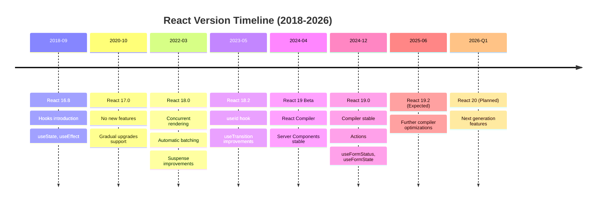

# React Framework

**Understanding-oriented documentation** for React framework in the open-sharia-enterprise platform.

## Overview

React is a declarative, component-based library for building user interfaces. It enables creating interactive, performant web applications through composable components, unidirectional data flow, and a virtual DOM. Combined with TypeScript, React provides type-safe UI development with excellent tooling and developer experience.

This documentation covers React 18+ with TypeScript 5+, focusing on functional components, hooks, and modern React patterns for building enterprise-grade financial applications.

## Framework Standards

**This documentation is the authoritative reference** for React usage standards in the open-sharia-enterprise platform.

All React applications MUST follow the patterns and practices documented here:

1. **[Idioms](./ex-so-plwe-tsre__idioms.md)** - React-specific patterns
2. **[Best Practices](./ex-so-plwe-tsre__best-practices.md)** - Framework standards
3. **[Anti-Patterns](./ex-so-plwe-tsre__anti-patterns.md)** - Common mistakes
4. **[Component Architecture](./ex-so-plwe-tsre__component-architecture.md)** - Component design
5. **[State Management](./ex-so-plwe-tsre__state-management.md)** - State patterns

**For Agents**: Reference this documentation when building React applications.

**Language Standards**: Also follow [TypeScript](../../prog-lang/typescript/README.md) language standards.

### Quick Standards Reference

- **Project Structure**: See [Architecture Integration](#architecture-integration)
- **Component Patterns**: See [Component Architecture](./ex-so-plwe-tsre__component-architecture.md)
- **State Management**: See [State Management](./ex-so-plwe-tsre__state-management.md)
- **Testing**: See [Testing](./ex-so-plwe-tsre__testing.md)
- **Performance**: See [Performance](./ex-so-plwe-tsre__performance.md)

## Software Engineering Principles

React usage in this platform follows the five software engineering principles from [governance/principles/software-engineering/](../../../../../governance/principles/software-engineering/README.md):

1. **[Automation Over Manual](../../../../../governance/principles/software-engineering/automation-over-manual.md)** - React automates through Fast Refresh, ESLint plugins, automated testing, build optimization
2. **[Explicit Over Implicit](../../../../../governance/principles/software-engineering/explicit-over-implicit.md)** - React enforces through explicit props typing, clear component contracts, TypeScript integration
3. **[Immutability Over Mutability](../../../../../governance/principles/software-engineering/immutability.md)** - React requires immutable state updates, pure components, functional updates
4. **[Pure Functions Over Side Effects](../../../../../governance/principles/software-engineering/pure-functions.md)** - React encourages pure rendering logic, effects isolation in useEffect, functional components
5. **[Reproducibility First](../../../../../governance/principles/software-engineering/reproducibility.md)** - React enables through Volta pinning, package-lock.json, deterministic builds, snapshot testing

**See Also**: [Functional Programming](./ex-so-plwe-tsre__functional-programming.md) for FP patterns with React.

## Quick Reference

**Jump to:**

- [Overview](#overview) - React in the platform
- [Software Engineering Principles](#software-engineering-principles) - Five core principles
- [React Version Strategy](#react-version-strategy) - Version management
- [Documentation Structure](#documentation-structure) - Guide to documentation files
- [Key Capabilities](#key-capabilities) - Framework features
- [Use Cases](#use-cases) - When to use React
- [Architecture Integration](#architecture-integration) - Component architecture, DDD
- [Development Workflow](#development-workflow) - Setup, configuration, testing
- [Learning Path](#learning-path) - Recommended reading order
- [Code Examples from Platform](#code-examples-from-platform) - Real implementations
- [Integration with Other Documentation](#integration-with-other-documentation) - Cross-references
- [React Ecosystem](#react-ecosystem) - Libraries and tools
- [Tools and Development Environment](#tools-and-development-environment) - Build tools, IDEs
- [Resources and References](#resources-and-references) - External resources
- [Related Documentation](#related-documentation) - Cross-references

**Core Documentation:**

- [Idioms](./ex-so-plwe-tsre__idioms.md) - React patterns (functional components, hooks, composition)
- [Best Practices](./ex-so-plwe-tsre__best-practices.md) - Framework coding standards
- [Anti-Patterns](./ex-so-plwe-tsre__anti-patterns.md) - Common React mistakes
- [Component Architecture](./ex-so-plwe-tsre__component-architecture.md) - Component design patterns
- [State Management](./ex-so-plwe-tsre__state-management.md) - State patterns and tools
- [Hooks](./ex-so-plwe-tsre__hooks.md) - useState, useEffect, custom hooks
- [TypeScript](./ex-so-plwe-tsre__typescript.md) - TypeScript integration
- [Testing](./ex-so-plwe-tsre__testing.md) - React Testing Library, Jest
- [Performance](./ex-so-plwe-tsre__performance.md) - Optimization strategies
- [Routing](./ex-so-plwe-tsre__routing.md) - React Router patterns
- [Forms](./ex-so-plwe-tsre__forms.md) - Form handling and validation
- [Data Fetching](./ex-so-plwe-tsre__data-fetching.md) - API integration
- [Styling](./ex-so-plwe-tsre__styling.md) - CSS strategies
- [Accessibility](./ex-so-plwe-tsre__accessibility.md) - WCAG compliance
- [Security](./ex-so-plwe-tsre__security.md) - Security best practices
- [Build & Deployment](./ex-so-plwe-tsre__build-deployment.md) - Build tools and deployment
- [Version Migration](./ex-so-plwe-tsre__version-migration.md) - Upgrading React versions
- [Domain-Driven Design](./ex-so-plwe-tsre__domain-driven-design.md) - DDD with React
- [Functional Programming](./ex-so-plwe-tsre__functional-programming.md) - FP patterns with React

## React Version Strategy



**Platform Strategy**: React 18.2+ (current) → React 19.x → React 20 (future)

### Current Version: React 18.2+

**Platform Standard**: React 18.2 is the target version for all React projects.

**Rationale**:

- Concurrent rendering for improved responsiveness
- Automatic batching reduces unnecessary re-renders
- Suspense for data fetching (experimental)
- useId for server-side rendering compatibility
- Mature ecosystem and library support
- Stable foundation for modern React patterns

**Key Features**:

- Concurrent rendering with startTransition
- Automatic batching of state updates
- Streaming SSR with Suspense
- useId for unique IDs in SSR
- useDeferredValue for non-urgent updates
- useTransition for UI transitions

### Future: React 19+

**Released**: December 2024

**Major Changes**:

- React Compiler - automatic memoization (no manual useMemo/useCallback)
- React Server Components stable
- Actions for form handling and mutations
- useFormStatus and useFormState hooks
- useOptimistic for optimistic updates
- use hook for reading context and promises
- ref as prop (no forwardRef needed)

**Migration Path**:

Projects will migrate to React 19 when:

- React Compiler provides proven performance benefits
- Critical libraries support React 19
- Server Components pattern is adopted
- Migration guide is validated

## Documentation Structure

### [React Idioms](./ex-so-plwe-tsre__idioms.md)

Framework-specific patterns for writing idiomatic React applications.

**Covers**:

- Functional components over class components
- Hooks patterns (useState, useEffect, useContext, useReducer)
- Component composition patterns
- Props spreading and destructuring
- Children patterns (render props, compound components)
- Custom hooks for reusable logic
- Conditional rendering patterns
- List rendering with keys
- Event handling in React
- Controlled vs uncontrolled components

### [React Best Practices](./ex-so-plwe-tsre__best-practices.md)

Proven approaches for building production-ready React applications.

**Covers**:

- Project structure and organization
- Component design principles (SRP, composition)
- State management strategies
- TypeScript integration best practices
- Error boundaries and error handling
- Performance optimization strategies
- Accessibility standards (ARIA, semantic HTML)
- Testing strategies (unit, integration, E2E)
- Code splitting and lazy loading
- Security best practices

### [React Anti-Patterns](./ex-so-plwe-tsre__anti-patterns.md)

Common mistakes and problematic patterns to avoid.

**Covers**:

- Prop drilling without context
- Unnecessary re-renders
- Misuse of useEffect (missing dependencies, race conditions)
- Direct DOM manipulation
- Incorrect key usage in lists
- State management anti-patterns
- Performance anti-patterns (premature optimization)
- TypeScript anti-patterns (any types, type assertions)
- Testing anti-patterns
- Security vulnerabilities (XSS, injection)

### Documentation Organization

```mermaid
%% Color Palette: Blue #0173B2, Orange #DE8F05, Teal #029E73, Purple #CC78BC
%% All colors are color-blind friendly and meet WCAG AA contrast standards

flowchart TD
    A["React Documentation"]:::blue
    B["Core Patterns"]:::teal
    C["Architecture"]:::teal
    D["Advanced Topics"]:::purple
    E["Integration"]:::orange
    F["Specialized"]:::purple

    A --> B
    A --> C
    A --> D
    A --> E
    A --> F

    B --> B1["Idioms"]
    B --> B2["Best Practices"]
    B --> B3["Anti-Patterns"]

    C --> C1["Component Architecture"]
    C --> C2["State Management"]
    C --> C3["Hooks"]
    C --> C4["TypeScript"]

    D --> D1["Performance"]
    D --> D2["Testing"]
    D --> D3["Accessibility"]
    D --> D4["Security"]

    E --> E1["Routing"]
    E --> E2["Forms"]
    E --> E3["Data Fetching"]
    E --> E4["Styling"]

    F --> F1["Build & Deployment"]
    F --> F2["Domain-Driven Design"]
    F --> F3["Functional Programming"]
    F --> F4["Version Migration"]

    classDef blue fill:#0173B2,stroke:#000000,color:#FFFFFF,stroke-width:2px
    classDef orange fill:#DE8F05,stroke:#000000,color:#FFFFFF,stroke-width:2px
    classDef teal fill:#029E73,stroke:#000000,color:#FFFFFF,stroke-width:2px
    classDef purple fill:#CC78BC,stroke:#000000,color:#000000,stroke-width:2px
```



### Specialized Topics

Deep-dive documentation on critical React areas:

#### [React Component Architecture](./ex-so-plwe-tsre__component-architecture.md)

Comprehensive guide to component design patterns.

**Covers**:

- Component design principles (SRP, composition over inheritance)
- Presentational vs container components
- Compound components pattern
- Render props pattern
- Higher-order components (HOCs)
- Custom hooks pattern
- Component composition strategies
- Component library organization
- Atomic design methodology
- Component testing strategies

#### [React State Management](./ex-so-plwe-tsre__state-management.md)

Comprehensive guide to state management patterns.

**Covers**:

- Local state with useState
- Reducer pattern with useReducer
- Context API for global state
- State lifting and prop drilling
- Zustand for simple global state
- Redux Toolkit (if needed for complex state)
- React Query for server state
- State management best practices
- Optimistic updates
- State testing strategies

#### [React Hooks](./ex-so-plwe-tsre__hooks.md)

Comprehensive guide to React hooks.

**Covers**:

- useState for local state
- useEffect for side effects
- useContext for context consumption
- useReducer for complex state logic
- useMemo for memoization
- useCallback for function memoization
- useRef for mutable refs
- useImperativeHandle for ref customization
- useLayoutEffect for synchronous effects
- Custom hooks patterns
- Hooks rules and best practices
- Hooks testing strategies

#### [React TypeScript Integration](./ex-so-plwe-tsre__typescript.md)

Comprehensive guide to TypeScript with React.

**Covers**:

- Typing functional components
- Typing props with interfaces
- Typing state with generics
- Typing events (onClick, onChange, onSubmit)
- Typing refs (useRef with HTMLElement)
- Typing context providers and consumers
- Generic components
- Typing custom hooks
- React.FC vs function component
- Children typing patterns
- Discriminated unions in props
- TypeScript best practices

#### [React Testing](./ex-so-plwe-tsre__testing.md)

Comprehensive guide to testing React applications.

**Covers**:

- React Testing Library fundamentals
- Jest configuration and setup
- Component testing strategies
- Hooks testing with renderHook
- Integration testing
- Mocking (API calls, modules, timers)
- Testing user interactions
- Testing asynchronous behavior
- Testing custom hooks
- Snapshot testing (when appropriate)
- E2E testing with Playwright/Cypress
- TDD workflow with React

#### [React Performance](./ex-so-plwe-tsre__performance.md)

Comprehensive guide to React performance optimization.

**Covers**:

- React.memo for component memoization
- useMemo for expensive computations
- useCallback for function memoization
- Code splitting with React.lazy
- Lazy loading routes and components
- Virtualization (react-window, react-virtual)
- Bundle size optimization
- Profiling with React DevTools
- Performance monitoring (Web Vitals)
- Image optimization
- Avoiding unnecessary re-renders
- Optimization strategies and trade-offs

#### [React Routing](./ex-so-plwe-tsre__routing.md)

Comprehensive guide to routing with React Router.

**Covers**:

- React Router v6 fundamentals
- Route configuration and nesting
- Navigation with Link and Navigate
- Route parameters and query strings
- Protected routes and authentication
- Programmatic navigation
- Route guards and middleware
- Nested routes
- 404 and error routes
- TypeScript with React Router
- Testing routes

#### [React Forms](./ex-so-plwe-tsre__forms.md)

Comprehensive guide to form handling in React.

**Covers**:

- Controlled vs uncontrolled components
- React Hook Form library
- Formik alternative
- Form validation strategies
- Error handling and display
- Field arrays (dynamic fields)
- File uploads
- Form submission patterns
- Async validation
- TypeScript with forms
- Accessibility in forms
- Testing forms

#### [React Data Fetching](./ex-so-plwe-tsre__data-fetching.md)

Comprehensive guide to data fetching patterns.

**Covers**:

- Fetch API and axios
- TanStack Query (React Query) for server state
- SWR alternative
- Loading states and skeletons
- Error handling and retry logic
- Caching strategies
- Optimistic updates
- Infinite scrolling and pagination
- Prefetching data
- Mutations with React Query
- WebSocket integration
- TypeScript with data fetching

#### [React Styling](./ex-so-plwe-tsre__styling.md)

Comprehensive guide to styling React applications.

**Covers**:

- CSS Modules for scoped styles
- Tailwind CSS integration
- styled-components for CSS-in-JS
- Emotion alternative
- CSS variables for theming
- Responsive design patterns
- Dark mode implementation
- CSS architecture (BEM, ITCSS)
- Animation and transitions
- Typography and spacing systems
- Styling best practices
- Performance considerations

#### [React Accessibility](./ex-so-plwe-tsre__accessibility.md)

Comprehensive guide to accessibility in React.

**Covers**:

- ARIA attributes and roles
- Semantic HTML in JSX
- Keyboard navigation
- Focus management
- Screen reader support
- Alt text for images
- Form accessibility
- WCAG AA compliance
- Color contrast requirements
- Testing accessibility (axe, jest-axe)
- Accessibility in component libraries
- Accessibility best practices

#### [React Security](./ex-so-plwe-tsre__security.md)

Comprehensive guide to security in React applications.

**Covers**:

- XSS prevention (dangerouslySetInnerHTML, sanitization)
- CSRF protection patterns
- Authentication patterns (JWT, OAuth)
- Authorization and protected routes
- Secure API communication (HTTPS, CORS)
- Input validation and sanitization
- Content Security Policy (CSP)
- Dependency security (npm audit)
- Secret management (environment variables)
- Security headers
- OWASP Top 10 for frontend
- Security testing

#### [React Build & Deployment](./ex-so-plwe-tsre__build-deployment.md)

Comprehensive guide to building and deploying React applications.

**Covers**:

- Build tools (Vite, Create React App, Next.js)
- Environment variables and configuration
- Production builds and optimization
- Deployment strategies (Vercel, Netlify, AWS)
- CI/CD integration (GitHub Actions)
- Docker containerization
- Server-side rendering (SSR) with Next.js
- Static site generation (SSG)
- Progressive Web Apps (PWA)
- Monitoring and error tracking (Sentry)
- Performance monitoring

#### [React Version Migration](./ex-so-plwe-tsre__version-migration.md)

Comprehensive guide to upgrading React versions.

**Covers**:

- Migrating from class to functional components
- Adopting hooks from lifecycle methods
- React 16 to React 17 migration
- React 17 to React 18 migration
- React 18 to React 19 migration
- Breaking changes and deprecations
- Codemod tools for automated migration
- Gradual migration strategies
- Testing during migration
- Third-party library compatibility

#### [React Domain-Driven Design](./ex-so-plwe-tsre__domain-driven-design.md)

Comprehensive guide to DDD patterns in React.

**Covers**:

- Organizing components by domain
- Bounded contexts in frontend
- Domain models in TypeScript
- Feature-based folder structure
- Separation of concerns (UI vs domain logic)
- Repository pattern for data access
- Domain events in React
- CQRS patterns in frontend
- Hexagonal architecture for React apps
- Financial examples: Zakat, Murabaha, Waqf UIs

#### [React Functional Programming](./ex-so-plwe-tsre__functional-programming.md)

Comprehensive guide to FP patterns in React.

**Covers**:

- Pure components and pure functions
- Immutability in state updates
- Function composition patterns
- Higher-order components as higher-order functions
- Hooks as functional abstractions
- Functional error handling (Result/Either)
- Function currying in event handlers
- Declarative vs imperative code
- Functional testing strategies
- FP libraries (fp-ts, Ramda)

## Key Capabilities

### Component-Based Architecture

React excels at building UIs from composable components:

- **Functional Components** - Modern, hooks-based components
- **JSX** - Declarative UI syntax
- **Composition** - Building complex UIs from simple pieces
- **Props** - Component communication
- **Children** - Component nesting
- **Reusability** - DRY principle through components

### Declarative UI

React uses declarative programming for UI:

- **State-Driven Rendering** - UI derives from state
- **Virtual DOM** - Efficient DOM updates
- **Reconciliation** - Smart diffing algorithm
- **One-Way Data Flow** - Predictable state changes
- **Reactive Updates** - Automatic UI updates

### Modern Hooks

React hooks enable powerful patterns:

- **useState** - Local component state
- **useEffect** - Side effects and lifecycle
- **useContext** - Global state access
- **useReducer** - Complex state logic
- **useMemo/useCallback** - Performance optimization
- **Custom Hooks** - Reusable stateful logic

### TypeScript Integration

First-class TypeScript support:

- **Type-Safe Props** - Compile-time prop validation
- **Generic Components** - Flexible, reusable components
- **Type Inference** - Automatic type detection
- **IDE Support** - Excellent autocomplete and IntelliSense
- **Refactoring Safety** - Confident refactoring

### Rich Ecosystem

Extensive library ecosystem:

- **Routing** - React Router
- **State Management** - Redux, Zustand, Jotai
- **Forms** - React Hook Form, Formik
- **Data Fetching** - TanStack Query, SWR
- **Styling** - Tailwind, styled-components, Emotion
- **Testing** - React Testing Library, Jest

### Performance

Built-in performance features:

- **Virtual DOM** - Minimal actual DOM operations
- **React.memo** - Component memoization
- **Code Splitting** - Load code on demand
- **Lazy Loading** - Defer non-critical components
- **Suspense** - Loading state management
- **Concurrent Rendering** - Non-blocking rendering

## Use Cases

**Use React when you need:**

✅ Interactive user interfaces with complex state
✅ Single-page applications (SPAs)
✅ Component reusability across projects
✅ Type-safe UI development with TypeScript
✅ Large ecosystem of libraries and tools
✅ Server-side rendering (with Next.js)
✅ Progressive Web Apps (PWAs)
✅ Cross-platform development (React Native)
✅ Strong community and hiring pool

**Consider alternatives when:**

❌ Building simple static websites (use plain HTML/CSS)
❌ SEO-critical marketing sites (use Astro, Next.js SSG)
❌ You need native mobile performance (consider Swift/Kotlin)
❌ Team has no JavaScript/TypeScript experience
❌ Bundle size is critical for low-bandwidth users (consider Preact, Svelte)

## Architecture Integration

### Component-Based Architecture

React naturally encourages component-based design:

```
src/
├── features/                 # Feature-based organization
│   ├── zakat/               # Zakat calculation feature
│   │   ├── components/      # Feature-specific components
│   │   │   ├── ZakatForm.tsx
│   │   │   ├── ZakatResult.tsx
│   │   │   └── ZakatHistory.tsx
│   │   ├── hooks/           # Feature-specific hooks
│   │   │   ├── useZakatCalculation.ts
│   │   │   └── useZakatHistory.ts
│   │   ├── api/             # API integration
│   │   │   └── zakatApi.ts
│   │   ├── types/           # TypeScript types
│   │   │   └── zakat.types.ts
│   │   └── utils/           # Feature utilities
│   │       └── zakatRules.ts
│   ├── donations/           # Donations feature
│   └── loans/               # Murabaha loans feature
├── shared/                  # Shared across features
│   ├── components/          # Reusable components
│   │   ├── Button/
│   │   ├── Card/
│   │   ├── Form/
│   │   └── Layout/
│   ├── hooks/               # Reusable hooks
│   │   ├── useAuth.ts
│   │   ├── useFetch.ts
│   │   └── useLocalStorage.ts
│   ├── utils/               # Utility functions
│   │   ├── formatters.ts
│   │   └── validators.ts
│   └── types/               # Shared types
│       └── common.types.ts
└── core/                    # Core application
    ├── api/                 # API client
    ├── auth/                # Authentication
    ├── routing/             # Routing configuration
    └── store/               # Global state
```

### Functional Programming

React embraces functional programming principles:

**Pure Components**:

```typescript
// Pure functional component
interface ZakatResultProps {
  wealth: number;
  nisab: number;
  rate: number;
}

export const ZakatResult: React.FC<ZakatResultProps> = ({ wealth, nisab, rate }) => {
  // Pure calculation - no side effects
  const zakatAmount = wealth >= nisab ? wealth * rate : 0;
  const isEligible = wealth >= nisab;

  return (
    <div className="zakat-result">
      <h3>Zakat Calculation Result</h3>
      <p>Wealth: {wealth}</p>
      <p>Nisab: {nisab}</p>
      <p>Eligible: {isEligible ? 'Yes' : 'No'}</p>
      {isEligible && <p>Zakat Amount: {zakatAmount}</p>}
    </div>
  );
};
```

**Immutable State Updates**:

```typescript
interface Donation {
  id: string;
  amount: number;
  category: string;
  date: Date;
}

const [donations, setDonations] = useState<Donation[]>([]);

// Immutable add
const addDonation = (donation: Donation) => {
  setDonations((prev) => [...prev, donation]); // Create new array
};

// Immutable update
const updateDonation = (id: string, updates: Partial<Donation>) => {
  setDonations((prev) =>
    prev.map((donation) =>
      donation.id === id
        ? { ...donation, ...updates } // Create new object
        : donation,
    ),
  );
};

// Immutable remove
const removeDonation = (id: string) => {
  setDonations((prev) => prev.filter((donation) => donation.id !== id));
};
```

**Function Composition**:

```typescript
// Composable validation functions
type Validator<T> = (value: T) => string | undefined;

const required: Validator<string> = (value) => (value.trim() === "" ? "This field is required" : undefined);

const minLength =
  (min: number): Validator<string> =>
  (value) =>
    value.length < min ? `Minimum length is ${min}` : undefined;

const maxLength =
  (max: number): Validator<string> =>
  (value) =>
    value.length > max ? `Maximum length is ${max}` : undefined;

const isNumber: Validator<string> = (value) => (isNaN(Number(value)) ? "Must be a number" : undefined);

// Compose validators
const compose =
  <T>(...validators: Validator<T>[]): Validator<T> =>
  (value) => {
    for (const validator of validators) {
      const error = validator(value);
      if (error) return error;
    }
    return undefined;
  };

// Usage
const validateZakatAmount = compose(required, isNumber, minLength(1), maxLength(10));
```

### Domain-Driven Design

React components can implement DDD patterns:

**Domain Models as Types**:

```typescript
// Value Objects
export interface Money {
  readonly amount: number;
  readonly currency: string;
}

export interface NisabThreshold {
  readonly goldGrams: number;
  readonly silverGrams: number;
  readonly equivalentMoney: Money;
}

// Entity
export interface ZakatCalculation {
  readonly id: string;
  readonly userId: string;
  readonly wealth: Money;
  readonly nisab: NisabThreshold;
  readonly zakatAmount: Money;
  readonly eligible: boolean;
  readonly calculationDate: Date;
  readonly hijriDate: string;
}

// Aggregate
export interface MurabahaContract {
  readonly id: string;
  readonly assetCost: Money;
  readonly downPayment: Money;
  readonly profitRate: number;
  readonly termMonths: number;
  readonly payments: Payment[];
  readonly status: ContractStatus;
  readonly createdAt: Date;
}
```

**Feature-Based Organization**:

```typescript
// features/zakat/components/ZakatCalculator.tsx
export const ZakatCalculator: React.FC = () => {
  const { calculate, loading, error } = useZakatCalculation();
  const [formData, setFormData] = useState<ZakatFormData>({
    wealth: 0,
    nisab: 0,
  });

  const handleSubmit = async (e: React.FormEvent) => {
    e.preventDefault();
    await calculate(formData);
  };

  return (
    <form onSubmit={handleSubmit}>
      {/* Form fields */}
    </form>
  );
};

// features/zakat/hooks/useZakatCalculation.ts
export const useZakatCalculation = () => {
  const [result, setResult] = useState<ZakatCalculation | null>(null);
  const [loading, setLoading] = useState(false);
  const [error, setError] = useState<string | null>(null);

  const calculate = async (data: ZakatFormData) => {
    setLoading(true);
    setError(null);
    try {
      const calculation = await zakatApi.calculate(data);
      setResult(calculation);
    } catch (err) {
      setError(err.message);
    } finally {
      setLoading(false);
    }
  };

  return { result, calculate, loading, error };
};
```

## Development Workflow

### Project Setup

**Create new React application in Nx workspace:**

```bash
# Generate React application with Nx
nx generate @nx/react:application ose-platform-web-app

# Or use Vite directly
npm create vite@latest ose-platform-web-app -- --template react-ts

# Install dependencies
npm install

# Start development server
nx serve ose-platform-web-app

# Or with Vite
npm run dev
```

**Project Structure**:

```
apps/ose-platform-web-app/
├── src/
│   ├── features/          # Feature modules
│   ├── shared/            # Shared code
│   ├── core/              # Core application
│   ├── assets/            # Static assets
│   ├── App.tsx            # Root component
│   ├── main.tsx           # Entry point
│   └── vite-env.d.ts      # Vite types
├── public/                # Public assets
├── index.html             # HTML template
├── vite.config.ts         # Vite configuration
├── tsconfig.json          # TypeScript configuration
├── tsconfig.app.json      # App-specific TS config
├── tsconfig.node.json     # Node-specific TS config
└── package.json           # Dependencies
```

### Configuration

**Vite Configuration** (`vite.config.ts`):

```typescript
import { defineConfig } from "vite";
import react from "@vitejs/plugin-react";
import path from "path";

export default defineConfig({
  plugins: [react()],
  resolve: {
    alias: {
      "@": path.resolve(__dirname, "./src"),
      "@features": path.resolve(__dirname, "./src/features"),
      "@shared": path.resolve(__dirname, "./src/shared"),
      "@core": path.resolve(__dirname, "./src/core"),
    },
  },
  server: {
    port: 3000,
    open: true,
  },
  build: {
    sourcemap: true,
    rollupOptions: {
      output: {
        manualChunks: {
          vendor: ["react", "react-dom", "react-router-dom"],
        },
      },
    },
  },
});
```

**TypeScript Configuration** (`tsconfig.json`):

```json
{
  "compilerOptions": {
    "target": "ES2020",
    "lib": ["ES2020", "DOM", "DOM.Iterable"],
    "module": "ESNext",
    "skipLibCheck": true,
    "moduleResolution": "bundler",
    "allowImportingTsExtensions": true,
    "resolveJsonModule": true,
    "isolatedModules": true,
    "noEmit": true,
    "jsx": "react-jsx",
    "strict": true,
    "noUnusedLocals": true,
    "noUnusedParameters": true,
    "noFallthroughCasesInSwitch": true,
    "paths": {
      "@/*": ["./src/*"],
      "@features/*": ["./src/features/*"],
      "@shared/*": ["./src/shared/*"],
      "@core/*": ["./src/core/*"]
    }
  },
  "include": ["src"],
  "references": [{ "path": "./tsconfig.node.json" }]
}
```

**ESLint Configuration** (`.eslintrc.cjs`):

```javascript
module.exports = {
  root: true,
  env: { browser: true, es2020: true },
  extends: [
    "eslint:recommended",
    "plugin:@typescript-eslint/recommended",
    "plugin:react/recommended",
    "plugin:react/jsx-runtime",
    "plugin:react-hooks/recommended",
    "plugin:jsx-a11y/recommended",
  ],
  ignorePatterns: ["dist", ".eslintrc.cjs"],
  parser: "@typescript-eslint/parser",
  plugins: ["react-refresh"],
  rules: {
    "react-refresh/only-export-components": ["warn", { allowConstantExport: true }],
    "react/prop-types": "off", // TypeScript handles this
    "@typescript-eslint/no-unused-vars": ["error", { argsIgnorePattern: "^_" }],
  },
  settings: {
    react: {
      version: "detect",
    },
  },
};
```

### Testing Strategy

**1. Component Tests** (React Testing Library):

```typescript
// ZakatCalculator.test.tsx
import { render, screen, fireEvent, waitFor } from '@testing-library/react';
import userEvent from '@testing-library/user-event';
import { ZakatCalculator } from './ZakatCalculator';

describe('ZakatCalculator', () => {
  it('calculates zakat correctly', async () => {
    const user = userEvent.setup();
    render(<ZakatCalculator />);

    // Fill form
    const wealthInput = screen.getByLabelText(/wealth/i);
    const nisabInput = screen.getByLabelText(/nisab/i);
    await user.type(wealthInput, '10000');
    await user.type(nisabInput, '5000');

    // Submit
    const submitButton = screen.getByRole('button', { name: /calculate/i });
    await user.click(submitButton);

    // Assert result
    await waitFor(() => {
      expect(screen.getByText(/zakat amount: 250/i)).toBeInTheDocument();
    });
  });

  it('shows error for invalid input', async () => {
    const user = userEvent.setup();
    render(<ZakatCalculator />);

    const wealthInput = screen.getByLabelText(/wealth/i);
    await user.type(wealthInput, '-100');

    const submitButton = screen.getByRole('button', { name: /calculate/i });
    await user.click(submitButton);

    await waitFor(() => {
      expect(screen.getByText(/wealth must be positive/i)).toBeInTheDocument();
    });
  });
});
```

**2. Hook Tests**:

```typescript
// useZakatCalculation.test.ts
import { renderHook, waitFor } from "@testing-library/react";
import { useZakatCalculation } from "./useZakatCalculation";

describe("useZakatCalculation", () => {
  it("calculates zakat successfully", async () => {
    const { result } = renderHook(() => useZakatCalculation());

    expect(result.current.loading).toBe(false);
    expect(result.current.result).toBeNull();

    await result.current.calculate({ wealth: 10000, nisab: 5000 });

    await waitFor(() => {
      expect(result.current.loading).toBe(false);
      expect(result.current.result?.zakatAmount.amount).toBe(250);
    });
  });

  it("handles errors", async () => {
    const { result } = renderHook(() => useZakatCalculation());

    await result.current.calculate({ wealth: -100, nisab: 5000 });

    await waitFor(() => {
      expect(result.current.error).toBeTruthy();
      expect(result.current.result).toBeNull();
    });
  });
});
```

**3. Integration Tests**:

```typescript
// App.test.tsx
import { render, screen, waitFor } from '@testing-library/react';
import userEvent from '@testing-library/user-event';
import { App } from './App';
import { server } from './mocks/server';
import { rest } from 'msw';

describe('App Integration', () => {
  it('completes zakat calculation flow', async () => {
    const user = userEvent.setup();
    render(<App />);

    // Navigate to calculator
    const calculatorLink = screen.getByRole('link', { name: /zakat calculator/i });
    await user.click(calculatorLink);

    // Fill and submit form
    await user.type(screen.getByLabelText(/wealth/i), '10000');
    await user.type(screen.getByLabelText(/nisab/i), '5000');
    await user.click(screen.getByRole('button', { name: /calculate/i }));

    // Verify result
    await waitFor(() => {
      expect(screen.getByText(/zakat amount: 250/i)).toBeInTheDocument();
    });
  });
});
```

## Learning Path

### 1. Start with Idioms

Read [React Idioms](./ex-so-plwe-tsre__idioms.md) to understand framework patterns:

- Functional components
- Hooks basics (useState, useEffect, useContext)
- Component composition
- JSX patterns
- Props and children

### 2. Apply Best Practices

Read [React Best Practices](./ex-so-plwe-tsre__best-practices.md) for production standards:

- Project structure
- Component design
- State management
- TypeScript integration
- Testing strategies
- Performance optimization

### 3. Avoid Anti-Patterns

Read [React Anti-Patterns](./ex-so-plwe-tsre__anti-patterns.md) to prevent common mistakes:

- Prop drilling
- Unnecessary re-renders
- useEffect misuse
- Direct DOM manipulation
- Key prop mistakes

### 4. Master Advanced Topics

Read specialized documentation:

- [Component Architecture](./ex-so-plwe-tsre__component-architecture.md)
- [State Management](./ex-so-plwe-tsre__state-management.md)
- [Hooks](./ex-so-plwe-tsre__hooks.md)
- [TypeScript](./ex-so-plwe-tsre__typescript.md)
- [Performance](./ex-so-plwe-tsre__performance.md)

### 5. Integrate with DDD

Read complementary documentation:

- [Domain-Driven Design](./ex-so-plwe-tsre__domain-driven-design.md)
- [TypeScript DDD Patterns](../../prog-lang/typescript/ex-so-prla-ty__domain-driven-design.md)
- [Functional Programming](./ex-so-plwe-tsre__functional-programming.md)

## Code Examples from Platform

### Complete Feature Component

```typescript
// features/zakat/components/ZakatCalculator.tsx
import React, { useState } from 'react';
import { useZakatCalculation } from '../hooks/useZakatCalculation';
import { ZakatFormData, ZakatCalculation } from '../types/zakat.types';
import { Button } from '@shared/components/Button';
import { Input } from '@shared/components/Input';
import { Card } from '@shared/components/Card';

export const ZakatCalculator: React.FC = () => {
  const { calculate, loading, error } = useZakatCalculation();
  const [result, setResult] = useState<ZakatCalculation | null>(null);
  const [formData, setFormData] = useState<ZakatFormData>({
    wealth: '',
    nisab: '',
    currency: 'USD',
  });

  const handleSubmit = async (e: React.FormEvent) => {
    e.preventDefault();

    const calculation = await calculate({
      wealth: Number(formData.wealth),
      nisab: Number(formData.nisab),
      currency: formData.currency,
    });

    if (calculation) {
      setResult(calculation);
    }
  };

  const handleChange = (field: keyof ZakatFormData) => (
    e: React.ChangeEvent<HTMLInputElement>
  ) => {
    setFormData(prev => ({ ...prev, [field]: e.target.value }));
  };

  return (
    <div className="zakat-calculator">
      <h1>Zakat Calculator</h1>

      <Card>
        <form onSubmit={handleSubmit}>
          <Input
            label="Total Wealth"
            type="number"
            value={formData.wealth}
            onChange={handleChange('wealth')}
            placeholder="Enter your total wealth"
            required
          />

          <Input
            label="Nisab Threshold"
            type="number"
            value={formData.nisab}
            onChange={handleChange('nisab')}
            placeholder="Enter nisab threshold"
            required
          />

          <Input
            label="Currency"
            type="text"
            value={formData.currency}
            onChange={handleChange('currency')}
            placeholder="USD"
            required
          />

          {error && <div className="error">{error}</div>}

          <Button type="submit" loading={loading}>
            Calculate Zakat
          </Button>
        </form>
      </Card>

      {result && (
        <Card>
          <h2>Calculation Result</h2>
          <div className="result">
            <p>Wealth: {result.wealth.amount} {result.wealth.currency}</p>
            <p>Nisab: {result.nisab.equivalentMoney.amount} {result.nisab.equivalentMoney.currency}</p>
            <p>Eligible: {result.eligible ? 'Yes' : 'No'}</p>
            {result.eligible && (
              <p className="zakat-amount">
                Zakat Amount: {result.zakatAmount.amount} {result.zakatAmount.currency}
              </p>
            )}
            <p>Calculation Date: {new Date(result.calculationDate).toLocaleDateString()}</p>
            <p>Hijri Date: {result.hijriDate}</p>
          </div>
        </Card>
      )}
    </div>
  );
};
```

### Custom Hook with API Integration

```typescript
// features/zakat/hooks/useZakatCalculation.ts
import { useState } from "react";
import { zakatApi } from "../api/zakatApi";
import { ZakatCalculation, ZakatFormData } from "../types/zakat.types";

export const useZakatCalculation = () => {
  const [loading, setLoading] = useState(false);
  const [error, setError] = useState<string | null>(null);

  const calculate = async (data: ZakatFormData): Promise<ZakatCalculation | null> => {
    setLoading(true);
    setError(null);

    try {
      const result = await zakatApi.calculate(data);
      return result;
    } catch (err) {
      const message = err instanceof Error ? err.message : "Calculation failed";
      setError(message);
      return null;
    } finally {
      setLoading(false);
    }
  };

  return { calculate, loading, error };
};
```

### TypeScript Types

```typescript
// features/zakat/types/zakat.types.ts
export interface Money {
  readonly amount: number;
  readonly currency: string;
}

export interface NisabThreshold {
  readonly goldGrams: number;
  readonly silverGrams: number;
  readonly equivalentMoney: Money;
}

export interface ZakatCalculation {
  readonly id: string;
  readonly userId: string;
  readonly wealth: Money;
  readonly nisab: NisabThreshold;
  readonly zakatAmount: Money;
  readonly eligible: boolean;
  readonly calculationDate: Date;
  readonly hijriDate: string;
}

export interface ZakatFormData {
  wealth: string | number;
  nisab: string | number;
  currency: string;
}

export interface ZakatApiRequest {
  wealth: number;
  nisab: number;
  currency: string;
}
```

### Reusable Component

```typescript
// shared/components/Button/Button.tsx
import React from 'react';
import './Button.css';

export interface ButtonProps extends React.ButtonHTMLAttributes<HTMLButtonElement> {
  variant?: 'primary' | 'secondary' | 'danger';
  size?: 'small' | 'medium' | 'large';
  loading?: boolean;
  children: React.ReactNode;
}

export const Button: React.FC<ButtonProps> = ({
  variant = 'primary',
  size = 'medium',
  loading = false,
  disabled,
  children,
  className = '',
  ...props
}) => {
  const classNames = [
    'button',
    `button--${variant}`,
    `button--${size}`,
    loading && 'button--loading',
    className,
  ]
    .filter(Boolean)
    .join(' ');

  return (
    <button
      className={classNames}
      disabled={disabled || loading}
      {...props}
    >
      {loading ? (
        <>
          <span className="button__spinner" />
          <span>Loading...</span>
        </>
      ) : (
        children
      )}
    </button>
  );
};
```

## Integration with Other Documentation

### TypeScript Language Standards

- **[TypeScript](../../prog-lang/typescript/README.md)** - Core TypeScript documentation
- **[TypeScript Idioms](../../prog-lang/typescript/ex-so-prla-ty__idioms.md)** - Modern TypeScript patterns
- **[TypeScript Best Practices](../../prog-lang/typescript/ex-so-prla-ty__best-practices.md)** - TypeScript coding standards
- **[TypeScript Security](../../prog-lang/typescript/ex-so-prla-ty__security.md)** - Secure TypeScript coding
- **[TypeScript Performance](../../prog-lang/typescript/ex-so-prla-ty__performance.md)** - Performance optimization

### Architecture Patterns

- **[Domain-Driven Design](../../architecture/domain-driven-design-ddd/README.md)** - DDD tactical patterns
- **[C4 Architecture Model](../../architecture/c4-architecture-model/README.md)** - System documentation

### Development Practices

- **[Test-Driven Development](../../development/test-driven-development-tdd/README.md)** - TDD with React
- **[Behavior-Driven Development](../../development/behavior-driven-development-bdd/README.md)** - BDD with React Testing Library
- **[Functional Programming](../../../../../governance/development/pattern/functional-programming.md)** - FP principles

### Code Quality

- **[Code Quality Standards](../../../../../governance/development/quality/code.md)** - Quality requirements
- **[Implementation Workflow](../../../../../governance/development/workflow/implementation.md)** - Development process
- **[Commit Messages](../../../../../governance/development/workflow/commit-messages.md)** - Conventional Commits

## React Ecosystem

### Core React Libraries

**React**:

- React Core - Components, hooks, JSX
- React DOM - DOM rendering
- React DevTools - Browser extension for debugging

**React Router**:

- Declarative routing
- Nested routes
- Navigation components
- Route protection

### State Management

**Local State**:

- useState - Component state
- useReducer - Complex state logic
- useContext - Context API

**Global State**:

- **Zustand** (Recommended) - Simple, unopinionated
- **Redux Toolkit** - Full-featured, opinionated
- **Jotai** - Atomic state management
- **Recoil** - Facebook's state library

**Server State**:

- **TanStack Query** (React Query) - Recommended for server state
- **SWR** - Vercel's data fetching library

### Forms

- **React Hook Form** (Recommended) - Performance-focused
- **Formik** - Full-featured alternative
- **Zod** - Schema validation
- **Yup** - Alternative validation

### Styling

**CSS-in-JS**:

- **styled-components** - Popular CSS-in-JS
- **Emotion** - Performance-focused alternative

**Utility-First**:

- **Tailwind CSS** (Recommended) - Utility-first framework
- **UnoCSS** - Instant on-demand atomic CSS

**CSS Modules**:

- Scoped CSS
- Type-safe class names

### UI Component Libraries

- **shadcn/ui** (Recommended) - Customizable components
- **Radix UI** - Unstyled, accessible primitives
- **Headless UI** - Tailwind-focused components
- **Material-UI (MUI)** - Google Material Design
- **Ant Design** - Enterprise-focused

### Testing

- **React Testing Library** (Recommended) - User-centric testing
- **Jest** - Test runner and assertions
- **Vitest** - Vite-powered test runner
- **Playwright** - E2E testing
- **Cypress** - E2E alternative

### Build Tools

- **Vite** (Recommended) - Fast, modern build tool
- **Create React App** - Official React starter (maintenance mode)
- **Next.js** - React framework with SSR/SSG
- **Remix** - Full-stack React framework

## Tools and Development Environment

### Build Tools

**Vite** (Recommended):

```typescript
// vite.config.ts
import { defineConfig } from "vite";
import react from "@vitejs/plugin-react";
import path from "path";

export default defineConfig({
  plugins: [
    react({
      // Enable React Fast Refresh
      fastRefresh: true,
      // Babel plugins
      babel: {
        plugins: [],
      },
    }),
  ],
  resolve: {
    alias: {
      "@": path.resolve(__dirname, "./src"),
    },
  },
  server: {
    port: 3000,
    host: true,
    open: true,
  },
  build: {
    sourcemap: true,
    rollupOptions: {
      output: {
        manualChunks: {
          vendor: ["react", "react-dom"],
          router: ["react-router-dom"],
        },
      },
    },
  },
  test: {
    globals: true,
    environment: "jsdom",
    setupFiles: ["./src/test/setup.ts"],
  },
});
```

### Development Environment

**VS Code** (Recommended):

Extensions:

- ESLint
- Prettier
- ES7+ React/Redux/React-Native snippets
- TypeScript React code snippets
- Tailwind CSS IntelliSense
- Auto Rename Tag
- Auto Close Tag
- Path Intellisense

**WebStorm**:

- Built-in React support
- Excellent TypeScript integration
- Debugging tools

### Code Quality Tools

**ESLint**:

```bash
npm install -D eslint @typescript-eslint/parser @typescript-eslint/eslint-plugin
npm install -D eslint-plugin-react eslint-plugin-react-hooks
npm install -D eslint-plugin-jsx-a11y
```

**Prettier**:

```json
{
  "semi": true,
  "singleQuote": true,
  "tabWidth": 2,
  "trailingComma": "es5",
  "printWidth": 100,
  "arrowParens": "avoid"
}
```

**TypeScript**:

```json
{
  "compilerOptions": {
    "strict": true,
    "noUnusedLocals": true,
    "noUnusedParameters": true,
    "noFallthroughCasesInSwitch": true
  }
}
```

### Reproducible React Development

**Version Management** (Volta):

```json
{
  "volta": {
    "node": "24.11.1",
    "npm": "11.6.3"
  }
}
```

**Dependency Management**:

```bash
# Lock file for reproducible builds
npm install  # Creates package-lock.json

# CI environment
npm ci  # Installs from lock file
```

**Docker Development Container**:

```dockerfile
FROM node:24-alpine

WORKDIR /app

# Copy package files
COPY package*.json ./

# Install dependencies
RUN npm ci

# Copy source
COPY . .

# Expose port
EXPOSE 3000

# Development command
CMD ["npm", "run", "dev"]
```

## Resources and References

### Official Documentation

- [React Documentation](https://react.dev/)
- [React TypeScript Cheatsheet](https://react-typescript-cheatsheet.netlify.app/)
- [React Router Documentation](https://reactrouter.com/)
- [TanStack Query Documentation](https://tanstack.com/query/latest)

### Best Practices

- [React Patterns](https://reactpatterns.com/)
- [React Testing Library](https://testing-library.com/react)
- [React Performance](https://react.dev/learn/render-and-commit)

### Migration Guides

- [React 18 Upgrade Guide](https://react.dev/blog/2022/03/08/react-18-upgrade-guide)
- [React 19 Upgrade Guide](https://react.dev/blog/2024/12/05/react-19)

## Related Documentation

### Core React Documentation

- **[React Idioms](./ex-so-plwe-tsre__idioms.md)** - Framework patterns
- **[React Best Practices](./ex-so-plwe-tsre__best-practices.md)** - Production standards
- **[React Anti-Patterns](./ex-so-plwe-tsre__anti-patterns.md)** - Common mistakes

### Application Layer Documentation

- **[Component Architecture](./ex-so-plwe-tsre__component-architecture.md)** - Component design
- **[State Management](./ex-so-plwe-tsre__state-management.md)** - State patterns
- **[Hooks](./ex-so-plwe-tsre__hooks.md)** - React hooks
- **[TypeScript](./ex-so-plwe-tsre__typescript.md)** - TypeScript integration

### Advanced Topics

- **[Performance](./ex-so-plwe-tsre__performance.md)** - Optimization
- **[Testing](./ex-so-plwe-tsre__testing.md)** - Testing strategies
- **[Accessibility](./ex-so-plwe-tsre__accessibility.md)** - WCAG compliance
- **[Security](./ex-so-plwe-tsre__security.md)** - Security best practices

### Integration Documentation

- **[Domain-Driven Design](./ex-so-plwe-tsre__domain-driven-design.md)** - DDD with React
- **[Functional Programming](./ex-so-plwe-tsre__functional-programming.md)** - FP patterns
- **[Version Migration](./ex-so-plwe-tsre__version-migration.md)** - Upgrading versions

### Platform Documentation

- **[Libraries and Frameworks Index](../README.md)** - Parent frameworks documentation
- **[TypeScript Programming Language](../../prog-lang/typescript/README.md)** - TypeScript standards
- **[Software Design Index](../../README.md)** - Software documentation root
- **[Monorepo Structure](../../../../reference/re__monorepo-structure.md)** - Nx workspace organization

---

**Last Updated**: 2026-01-25
**React Version**: 18.2+ (TypeScript 5+, targeting React 19)
**Maintainers**: Platform Documentation Team

## Best Practices

### Component Design

- Keep components small and focused
- Use TypeScript interfaces for props
- Prefer functional components over class components
- Compose components rather than inherit
- Extract custom hooks for reusable logic

### TypeScript Usage

```typescript
// Define clear prop types
interface ButtonProps {
  variant: "primary" | "secondary";
  onClick: () => void;
  children: React.ReactNode;
  disabled?: boolean;
}

// Use FC type with props
const Button: React.FC<ButtonProps> = ({ variant, onClick, children, disabled = false }) => {
  // Implementation
};
```

### Hooks

- Follow Rules of Hooks (only call at top level)
- Use custom hooks for reusable logic
- Name custom hooks with `use` prefix
- Keep effects focused (one concern per effect)
- Clean up side effects properly

### Performance

- Use `React.memo` for expensive pure components
- Memoize callbacks with `useCallback`
- Memoize computed values with `useMemo`
- Lazy load components with `React.lazy`
- Split code with dynamic imports

### Accessibility

- Use semantic HTML elements
- Provide ARIA labels where needed
- Ensure keyboard navigation works
- Test with screen readers
- Follow WCAG AA guidelines

## Common Antipatterns

### ❌ Props Drilling

**Problem**: Passing props through many layers

```typescript
// Bad
<App data={data}>
  <Layout data={data}>
    <Page data={data}>
      <Component data={data} />  {/* Props drilling */}
    </Page>
  </Layout>
</App>
```

**Solution**: Use Context API or state management

```typescript
// Good
const DataContext = createContext<Data | null>(null);

function App() {
  return (
    <DataContext.Provider value={data}>
      <Layout>
        <Page>
          <Component />
        </Page>
      </Layout>
    </DataContext.Provider>
  );
}

function Component() {
  const data = useContext(DataContext);  // Access directly
  // ...
}
```

### ❌ Overusing `useEffect`

**Problem**: Using effects for derived state

```typescript
// Bad
const [total, setTotal] = useState(0);

useEffect(() => {
  setTotal(items.reduce((sum, item) => sum + item.price, 0));
}, [items]); // Unnecessary effect
```

**Solution**: Calculate during render

```typescript
// Good
const total = items.reduce((sum, item) => sum + item.price, 0);
```

### ❌ Mutating State Directly

**Problem**: Updating state object properties directly

```typescript
// Bad
const handleUpdate = () => {
  user.name = "New Name"; // Direct mutation!
  setUser(user);
};
```

**Solution**: Create new objects/arrays

```typescript
// Good
const handleUpdate = () => {
  setUser({ ...user, name: "New Name" }); // Immutable update
};
```

### ❌ Missing Dependencies in `useEffect`

**Problem**: Stale closures and bugs

```typescript
// Bad
useEffect(() => {
  doSomething(value); // 'value' not in dependencies
}, []); // Missing dependency
```

**Solution**: Include all dependencies

```typescript
// Good
useEffect(() => {
  doSomething(value);
}, [value]); // Complete dependencies
```

## React Ecosystem

### Meta-Frameworks

- **Next.js** - React framework with SSR, SSG, and routing
- **Remix** - Full-stack React framework
- **Gatsby** - Static site generator

### State Management

- **Zustand** - Minimalist state management
- **Redux Toolkit** - Redux with less boilerplate
- **Jotai** - Atomic state management
- **React Query** - Server state management

### UI Libraries

- **shadcn/ui** - Copy-paste component library (Radix + Tailwind)
- **Radix UI** - Headless, accessible components
- **Chakra UI** - Component library with themes
- **Material-UI** - Material Design components

### Forms

- **React Hook Form** - Performant form library
- **Formik** - Forms with validation
- **Zod** - TypeScript-first schema validation

## Learning Resources

### Official Documentation

- [React Documentation](https://react.dev/)
- [TypeScript Handbook](https://www.typescriptlang.org/docs/)
- [Next.js Documentation](https://nextjs.org/docs)

### Books and Courses

- "The Road to React" by Robin Wieruch
- "Effective TypeScript" by Dan Vanderkam
- React Official Tutorial

### Platform-Specific Documentation

- **[Functional Programming](../../../../../governance/development/pattern/functional-programming.md)** - FP principles
- **[Software Design](../../README.md)** - Architecture patterns
- **[Content Quality Standards](../../../../../governance/conventions/writing/quality.md)** - Accessibility requirements

## React vs Other Frontend Libraries

| Feature            | React     | Vue      | Svelte   | Angular  |
| ------------------ | --------- | -------- | -------- | -------- |
| Learning Curve     | Medium    | Gentle   | Gentle   | Steep    |
| TypeScript Support | Excellent | Good     | Good     | Native   |
| Ecosystem Size     | Largest   | Large    | Growing  | Large    |
| Bundle Size        | Medium    | Small    | Smallest | Large    |
| State Management   | External  | Built-in | Built-in | Built-in |
| Performance        | Fast      | Fast     | Fastest  | Fast     |
| Community          | Huge      | Large    | Growing  | Large    |

## Related Documentation

- **[Libraries and Frameworks Index](../README.md)** - Parent frameworks documentation
- **[Software Design](../../README.md)** - Architecture and development practices
- **[Functional Programming](../../../../../governance/development/pattern/functional-programming.md)** - FP principles
- **[Accessibility Standards](../../../../../governance/conventions/writing/quality.md)** - WCAG guidelines

---

**Last Updated**: 2026-01-25
