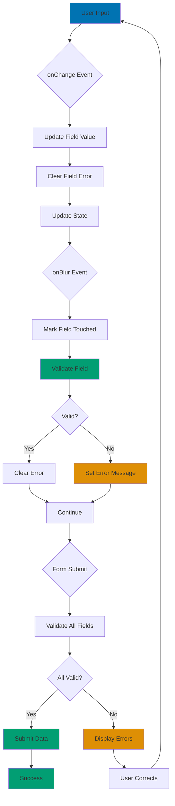

# React Forms

## Quick Reference

**Navigation**: [Stack Libraries](../README.md) > [TypeScript React](./README.md) > Forms

**Related Guides**:

- [Idioms](./ex-so-plwe-tsre__idioms.md) - Controlled components pattern
- [Hooks](./ex-so-plwe-tsre__hooks.md) - Form hooks
- [State Management](./ex-so-plwe-tsre__state-management.md) - Form state patterns

## Overview

Forms are central to web applications. This guide covers controlled components, React Hook Form, validation strategies, and form state management.

**Target Audience**: Developers building React applications with complex forms, particularly Islamic finance platforms requiring multi-step forms, validation, and data submission.

**React Version**: React 18.2+ with TypeScript 5+

## Controlled Components

### Basic Controlled Form

```typescript
interface DonationFormData {
  campaignId: string;
  amount: number;
  donorName: string;
  email: string;
  message: string;
}

export const DonationForm: React.FC = () => {
  const [formData, setFormData] = useState<DonationFormData>({
    campaignId: '',
    amount: 0,
    donorName: '',
    email: '',
    message: '',
  });

  const handleChange = (
    e: React.ChangeEvent<HTMLInputElement | HTMLTextAreaElement | HTMLSelectElement>
  ) => {
    const { name, value } = e.target;
    setFormData(prev => ({
      ...prev,
      [name]: name === 'amount' ? Number(value) : value,
    }));
  };

  const handleSubmit = async (e: React.FormEvent) => {
    e.preventDefault();
    await donationApi.create(formData);
  };

  return (
    <form onSubmit={handleSubmit}>
      <select
        name="campaignId"
        value={formData.campaignId}
        onChange={handleChange}
        required
      >
        <option value="">Select campaign</option>
        <option value="1">Education Fund</option>
        <option value="2">Healthcare</option>
      </select>

      <input
        type="number"
        name="amount"
        value={formData.amount}
        onChange={handleChange}
        min="1"
        step="0.01"
        required
      />

      <input
        type="text"
        name="donorName"
        value={formData.donorName}
        onChange={handleChange}
        placeholder="Your name"
        required
      />

      <input
        type="email"
        name="email"
        value={formData.email}
        onChange={handleChange}
        placeholder="your@email.com"
        required
      />

      <textarea
        name="message"
        value={formData.message}
        onChange={handleChange}
        placeholder="Optional message"
        rows={3}
      />

      <button type="submit">Submit Donation</button>
    </form>
  );
};
```

### Form Validation

Form validation follows a clear flow from user input to error display:



**Validation Strategy**:

1. **onChange**: Clear errors as user types
2. **onBlur**: Validate individual fields when focus leaves
3. **onSubmit**: Validate all fields before submission
4. **Display**: Show errors only for touched fields

```typescript
interface FormErrors {
  campaignId?: string;
  amount?: string;
  email?: string;
}

export const DonationFormWithValidation: React.FC = () => {
  const [formData, setFormData] = useState<DonationFormData>({
    campaignId: '',
    amount: 0,
    donorName: '',
    email: '',
    message: '',
  });

  const [errors, setErrors] = useState<FormErrors>({});
  const [touched, setTouched] = useState<Record<string, boolean>>({});

  const validate = (data: DonationFormData): FormErrors => {
    const errors: FormErrors = {};

    if (!data.campaignId) {
      errors.campaignId = 'Please select a campaign';
    }

    if (data.amount <= 0) {
      errors.amount = 'Amount must be greater than 0';
    }

    if (!data.email.match(/^[^\s@]+@[^\s@]+\.[^\s@]+$/)) {
      errors.email = 'Invalid email address';
    }

    return errors;
  };

  const handleChange = (
    e: React.ChangeEvent<HTMLInputElement | HTMLSelectElement | HTMLTextAreaElement>
  ) => {
    const { name, value } = e.target;

    setFormData(prev => ({
      ...prev,
      [name]: name === 'amount' ? Number(value) : value,
    }));

    // Clear error when user types
    setErrors(prev => ({
      ...prev,
      [name]: undefined,
    }));
  };

  const handleBlur = (field: string) => {
    setTouched(prev => ({ ...prev, [field]: true }));

    // Validate field on blur
    const fieldErrors = validate(formData);
    setErrors(prev => ({
      ...prev,
      [field]: fieldErrors[field as keyof FormErrors],
    }));
  };

  const handleSubmit = async (e: React.FormEvent) => {
    e.preventDefault();

    // Validate all fields
    const validationErrors = validate(formData);
    setErrors(validationErrors);

    // Mark all as touched
    setTouched({
      campaignId: true,
      amount: true,
      email: true,
    });

    // Submit if no errors
    if (Object.keys(validationErrors).length === 0) {
      await donationApi.create(formData);
    }
  };

  return (
    <form onSubmit={handleSubmit}>
      <div>
        <select
          name="campaignId"
          value={formData.campaignId}
          onChange={handleChange}
          onBlur={() => handleBlur('campaignId')}
        >
          <option value="">Select campaign</option>
        </select>
        {touched.campaignId && errors.campaignId && (
          <span className="error">{errors.campaignId}</span>
        )}
      </div>

      <div>
        <input
          type="number"
          name="amount"
          value={formData.amount}
          onChange={handleChange}
          onBlur={() => handleBlur('amount')}
        />
        {touched.amount && errors.amount && (
          <span className="error">{errors.amount}</span>
        )}
      </div>

      <div>
        <input
          type="email"
          name="email"
          value={formData.email}
          onChange={handleChange}
          onBlur={() => handleBlur('email')}
        />
        {touched.email && errors.email && (
          <span className="error">{errors.email}</span>
        )}
      </div>

      <button type="submit">Submit</button>
    </form>
  );
};
```

## React Hook Form

### Basic Usage

```typescript
import { useForm } from 'react-hook-form';

interface DonationFormData {
  campaignId: string;
  amount: number;
  donorName: string;
  email: string;
  message?: string;
}

export const DonationFormWithHookForm: React.FC = () => {
  const {
    register,
    handleSubmit,
    formState: { errors, isSubmitting },
  } = useForm<DonationFormData>();

  const onSubmit = async (data: DonationFormData) => {
    await donationApi.create(data);
  };

  return (
    <form onSubmit={handleSubmit(onSubmit)}>
      <select {...register('campaignId', { required: 'Please select a campaign' })}>
        <option value="">Select campaign</option>
        <option value="1">Education Fund</option>
      </select>
      {errors.campaignId && <span>{errors.campaignId.message}</span>}

      <input
        type="number"
        {...register('amount', {
          required: 'Amount is required',
          min: { value: 1, message: 'Amount must be at least 1' },
        })}
      />
      {errors.amount && <span>{errors.amount.message}</span>}

      <input
        type="text"
        {...register('donorName', { required: 'Name is required' })}
        placeholder="Your name"
      />
      {errors.donorName && <span>{errors.donorName.message}</span>}

      <input
        type="email"
        {...register('email', {
          required: 'Email is required',
          pattern: {
            value: /^[^\s@]+@[^\s@]+\.[^\s@]+$/,
            message: 'Invalid email address',
          },
        })}
      />
      {errors.email && <span>{errors.email.message}</span>}

      <textarea {...register('message')} placeholder="Optional message" />

      <button type="submit" disabled={isSubmitting}>
        {isSubmitting ? 'Submitting...' : 'Submit'}
      </button>
    </form>
  );
};
```

### Custom Validation

```typescript
import { useForm } from 'react-hook-form';

export const ZakatCalculatorForm: React.FC = () => {
  const {
    register,
    handleSubmit,
    formState: { errors },
    watch,
  } = useForm<{ gold: number; silver: number; cash: number }>();

  const goldValue = watch('gold', 0);

  const onSubmit = (data: any) => {
    const totalWealth = data.gold + data.silver + data.cash;
    console.log('Total wealth:', totalWealth);
  };

  return (
    <form onSubmit={handleSubmit(onSubmit)}>
      <input
        type="number"
        {...register('gold', {
          required: 'Gold amount is required',
          min: { value: 0, message: 'Cannot be negative' },
          validate: (value) => {
            if (value > 10000) {
              return 'Please verify amount (seems high)';
            }
            return true;
          },
        })}
      />
      {errors.gold && <span>{errors.gold.message}</span>}

      <input
        type="number"
        {...register('silver', {
          validate: {
            positive: (value) => value >= 0 || 'Cannot be negative',
            reasonable: (value, formValues) => {
              const total = value + formValues.gold + formValues.cash;
              return total > 0 || 'Total wealth must be greater than 0';
            },
          },
        })}
      />
      {errors.silver && <span>{errors.silver.message}</span>}

      <input type="number" {...register('cash')} />

      <button type="submit">Calculate</button>
    </form>
  );
};
```

### Multi-Step Forms

```typescript
import { useForm, UseFormReturn } from 'react-hook-form';
import { useState } from 'react';

interface DonationFormData {
  // Step 1
  campaignId: string;
  amount: number;

  // Step 2
  donorName: string;
  email: string;

  // Step 3
  paymentMethod: 'card' | 'bank';
  cardNumber?: string;
  accountNumber?: string;
}

export const MultiStepDonationForm: React.FC = () => {
  const [step, setStep] = useState(1);
  const methods = useForm<DonationFormData>();

  const { handleSubmit, trigger, formState: { errors } } = methods;

  const nextStep = async () => {
    const fieldsToValidate = step === 1
      ? ['campaignId', 'amount']
      : ['donorName', 'email'];

    const isValid = await trigger(fieldsToValidate as any);

    if (isValid) {
      setStep(prev => prev + 1);
    }
  };

  const prevStep = () => setStep(prev => prev - 1);

  const onSubmit = async (data: DonationFormData) => {
    await donationApi.create(data);
  };

  return (
    <form onSubmit={handleSubmit(onSubmit)}>
      {step === 1 && <Step1 methods={methods} />}
      {step === 2 && <Step2 methods={methods} />}
      {step === 3 && <Step3 methods={methods} />}

      <div className="form-actions">
        {step > 1 && <button type="button" onClick={prevStep}>Back</button>}

        {step < 3 && <button type="button" onClick={nextStep}>Next</button>}

        {step === 3 && <button type="submit">Submit</button>}
      </div>
    </form>
  );
};

const Step1: React.FC<{ methods: UseFormReturn<DonationFormData> }> = ({ methods }) => {
  const { register, formState: { errors } } = methods;

  return (
    <div>
      <h2>Select Campaign & Amount</h2>

      <select {...register('campaignId', { required: 'Required' })}>
        <option value="">Select</option>
      </select>
      {errors.campaignId && <span>{errors.campaignId.message}</span>}

      <input
        type="number"
        {...register('amount', {
          required: 'Required',
          min: { value: 1, message: 'Minimum 1' },
        })}
      />
      {errors.amount && <span>{errors.amount.message}</span>}
    </div>
  );
};
```

## Related Documentation

- **[Idioms](./ex-so-plwe-tsre__idioms.md)** - Controlled components pattern
- **[Hooks](./ex-so-plwe-tsre__hooks.md)** - Form hooks
- **[State Management](./ex-so-plwe-tsre__state-management.md)** - Form state patterns

---

**Last Updated**: 2026-01-25
